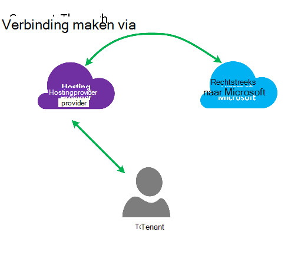
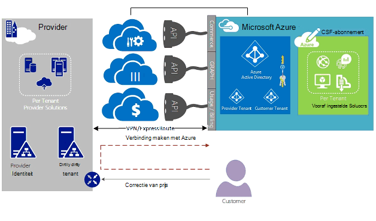
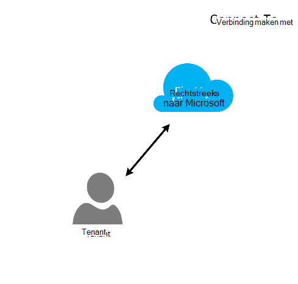
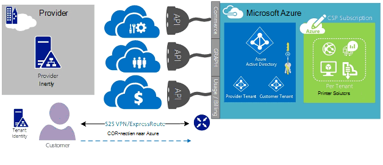
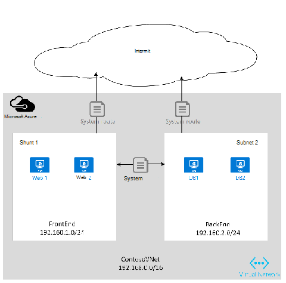

<properties
   pageTitle="Azure ExpressRoute voor Cloud oplossing Providers | Microsoft Azure"
   description="In dit artikel vindt u informatie voor Cloud-Providers die wilt opnemen Azure services en ExpressRoute in hun aanbiedingen."
   documentationCenter="na"
   services="expressroute"
   authors="richcar"
   manager="carmonm"
   editor=""/>
<tags
   ms.service="expressroute"
   ms.devlang="na"
   ms.topic="get-started-article"
   ms.tgt_pltfrm="na"
   ms.workload="infrastructure-services"
   ms.date="10/10/2016"
   ms.author="richcar"/>

# ExpressRoute voor Cloud oplossing Providers (CSP)

Microsoft biedt Hyper-schaal services voor traditionele leveranciers en distributors (CSP) kunnen snel inrichten van nieuwe services en oplossingen voor uw klanten hoeft te investeren in het ontwikkelen van deze nieuwe services. Als u wilt de Cloud oplossing (CSP) de mogelijkheid voor het beheren van rechtstreeks deze nieuwe services toestaan, worden in Microsoft-programma's en API's waarmee Microsoft Azure resources beheren namens uw klanten van de Serviceprovider biedt. Een van deze resources is ExpressRoute. ExpressRoute kan de Serviceprovider bestaande klant bronnen verbinden met Azure services. ExpressRoute is een hoge snelheid privé communicatie-koppeling naar services in Azure wordt aangegeven. 

ExpresRoute bestaat uit een paar circuits beschikbaarheid die zijn gekoppeld aan een enkele klant-abonnementen en kan niet worden gedeeld door meerdere klanten. Elke circuitlijnen moet worden beëindigd in een andere router te onderhouden van de beschikbaarheid.

>[AZURE.NOTE] Er zijn bandbreedte en verbinding caps op ExpressRoute wat betekent dat grote/complexe implementaties meerdere ExpressRoute circuits nodig voor één klant.

Microsoft Azure biedt een groeiende aantal services die u aan uw klanten bieden kunt.  Aanbevolen stappen profiteren van de volgende services houdt in dat ExpressRoute-verbindingen met hoge snelheid bieden lage latentie toegang tot de Microsoft Azure-omgeving.

## Microsoft Azure management
Microsoft biedt CSP met API's voor het beheren van de abonnementen klant Azure doordat programma integratie met uw eigen management service systems. Ondersteunde beheermogelijkheden vindt u [hier](https://msdn.microsoft.com/library/partnercenter/dn974944.aspx).

## Microsoft Azure resourcebeheer
Afhankelijk van het contract die u hebt met de klant bepaalt hoe het abonnement dat wordt beheerd. De CSP kunt rechtstreeks beheren voor het maken en onderhoud van de klant of resources kan voor het behoud van de besturing van het Microsoft Azure-abonnement en maken van de Azure resources als ze nodig hebben. Als uw klant het maken van resources in hun Microsoft Azure-abonnement beheert gebruikt deze een van twee modellen: model "Connect-Through" of "Direct naar"-model. Deze modellen worden in detail in de volgende secties beschreven.  

### Verbinding maken via model

  

In het model verbinding maken via de CSP Hiermee maakt u een directe verbinding tussen uw datacenter en Azure abonnement van de klant. De directe verbinding wordt gemaakt met ExpressRoute, uw netwerk verbinden met Azure. Uw klant maakt vervolgens verbinding met uw netwerk. Dit scenario is vereist dat de klant wordt doorgegeven via het netwerk CSP voor toegang tot Azure services. 

Als uw klant overige Azure abonnementen niet beheerd door de u, zou ze met openbare Internet of hun eigen persoonlijke verbindingen verbinding maken met deze services deze is ingericht onder het abonnement dat niet CSP. 

Voor CSP Azure services beheren, wordt uitgegaan dat de CSP heeft een eerder vastgestelde klant identiteit winkel waarin zou vervolgens worden gerepliceerd naar Azure Active Directory voor beheer van hun CSP abonnement via Administrate-On-Behalf-Of (AOBO). Belangrijke stuurprogramma's voor dit scenario opnemen waar een bepaald partner of -aanbieder een bestaande relatie met de klant heeft, de klant de services provider momenteel verbruikt of de partner heeft een behoefte aan een combinatie van provider gehost en Azure gehoste oplossingen en op te geven flexibiliteit adres klant uitdagingen die niet aan CSP alleen. Dit model wordt geïllustreerd in de **afbeelding**, onder.

### Verbinding maken met model

In het model verbinding maken met naar de serviceprovider Hiermee maakt u een directe verbinding tussen datacenter van de klant en de CSP deze is ingericht-abonnement Azure ExpressRoute met via (klant) van de klant netwerk.

>[AZURE.NOTE] Voor ExpressRoute moet de klant maken en onderhouden van de circuitlijnen ExpressRoute.  

Dit scenario connectivity is vereist dat de klant tot stand is gekomen rechtstreeks via het netwerk van een klant voor toegang tot Azure abonnement CSP worden beheerd met een directe netwerkverbinding die is gemaakt, eigendom en geheel of gedeeltelijk beheerd door de klant. Voor deze klanten die wordt ervan uitgegaan dat de provider niet momenteel beschikt over een klant identiteit store tot stand gebracht en de provider zou de klant helpen bij het repliceren van hun huidige identificeren store in Azure Active Directory voor beheer van hun abonnement via AOBO. Belangrijke stuurprogramma's voor dit scenario opnemen waar een bepaald partner of -aanbieder een bestaande relatie met de klant heeft, de klant de services provider momenteel verbruikt of de partner heeft een behoefte aan services die zijn gebaseerd uitsluitend op Azure gehoste oplossingen zonder dat u een bestaande datacenter van de provider of infrastructuur.

De keuze tussen deze twee opties zijn gebaseerd op de behoeften van uw klant en uw huidige behoeften aan te geven van Azure services. De details van deze modellen en de bijbehorende Rolgebaseerd access bepalen, netwerken en identiteit ontwerppatronen worden beschreven in de details in de volgende koppelingen:
-   **Rol op basis van Access besturingselement (RBAC)** – RBAC is gebaseerd op Azure Active Directory.  Zie voor meer informatie over Azure RBAC [hier](../active-directory/role-based-access-control-configure.md).
-   **Netwerkproblemen** – behandelt de verschillende onderwerpen van netwerken in Microsoft Azure.
-   **Azure Active Directory (AAD)** – AAD biedt het identiteitsbeheer voor Microsoft Azure en 3e SaaS toepassingen van derden. Azure AD Zie voor meer informatie over [hier](https://azure.microsoft.com/documentation/services/active-directory/).  

## Netwerksnelheden
ExpressRoute ondersteunt netwerksnelheden voor het van 50 Mb/s tot 10Gb/s. Hiermee kan klanten de hoeveelheid netwerkbandbreedte die u nodig hebt voor hun unieke omgeving aanschaffen.

>[AZURE.NOTE] Netwerkbandbreedte kan worden verhoogd naar wens zonder storend voor communicatie, maar als u wilt verkleinen van het netwerk vereist snelheid kwijtraken omlaag de circuitlijnen en opnieuw is de onderste netwerk snelheid.  

ExpressRoute ondersteunt de verbinding van meerdere vNets naar een enkel ExpressRoute circuitlijnen voor betere gebruik van de verbindingen hogere snelheid. Een enkel ExpressRoute circuitlijnen kan door meerdere Azure abonnementen eigendom van dezelfde klant worden gedeeld.

## ExpressRoute configureren
ExpressRoute kan worden geconfigureerd voor de ondersteuning van drie typen verkeer ([routeren domeinen](#ExpressRoute-routing-domains)) via een enkele ExpressRoute circuitlijnen. Dit verkeer onderverdeeld in Microsoft peering, peering van Azure openbare en persoonlijke peering. U kunt een of alle typen verkeer om te worden verzonden via een enkele ExpressRoute circuitlijnen of gebruik van meerdere ExpressRoute circuits afhankelijk van de grootte van het ExpressRoute circuitlijnen en moeten worden geïsoleerd vereist door de klant. De houding beveiliging van uw klant is niet toegestaan openbare verkeer en privé verkeer via de dezelfde circuitlijnen doorlopen.

### Verbinding maken via model
In de configuratie van een verbinding maken via bent de u verantwoordelijk voor alle de netwerken fundering naar uw klanten datacenter bronnen verbinden met de abonnementen die worden gehost in Azure wordt aangegeven. Elk van de klant van de gewenste Azure mogelijkheden hun eigen verbinding ExpressRoute, dat wordt beheerd door de u nodig hebt. De gewenste dezelfde methoden die de klant gebruiken zou om aan te schaffen de circuitlijnen ExpressRoute. U wordt dezelfde stappen uit in het artikel [ExpressRoute werkstromen](./expressroute-workflows.md) voor het inrichten van circuitlijnen en circuitlijnen Staten worden beschreven. Vervolgens wordt de u de rand Gateway Protocol (BGP) routes om te bepalen de verkeer die doorloopt tussen de on-premises netwerk en Azure vNet configureren.

### Verbinding maken met model
In een verbinding maken met naar configuratie, de klant al heeft een bestaande verbinding met Azure of een verbinding met de internetprovider ExpressRoute koppelen vanuit uw datacenter van klant rechtstreeks naar Azure, in plaats van uw datacenter wordt gestart. Om te beginnen het inrichten wordt van een klant de stappen zoals hierboven is beschreven in het model verbinden via. Zodra de circuitlijnen tot stand is gebracht moet uw klant Configureer de on-premises implementatie de mogelijkheid voor toegang tot uw netwerk- en Azure vNets.

U kunt helpen met de verbinding instellen en configureren van de routes toe te staan dat de resources in uw datacenter(s) om te communiceren met de resources client in uw datacenter of met de resources die wordt gehost in Azure wordt aangegeven.

## ExpressRoute routeren domeinen
ExpressRoute biedt drie routeren domeinen: openbare privé en Microsoft peering. Elk van de domeinen van de routering zijn geconfigureerd met identieke router in actieve configuratie voor beschikbaarheid. Zoek voor meer informatie over het ExpressRoute routeren domeinen naar [hier](./expressroute-circuit-peerings.md).

U kunt aangepaste routes filters zodat alleen de dienen die u wilt toestaan of nodig definiëren. Voor meer informatie en om te zien hoe u deze wijzigingen Zie artikel: [maken en wijzigen voor een ExpressRoute circuitlijnen via PowerShell-mailroutering](./expressroute-howto-routing-classic.md) voor meer informatie over de routering filters.

>[AZURE.NOTE] Voor Microsoft en openbare Peering connectiviteit moet al een openbare IP-adres eigendom van de klant of CSP en moet voldoen aan alle regels voor gedefinieerde. Zie de pagina [ExpressRoute vereisten](expressroute-prerequisites.md) voor meer informatie.  

## Routering
ExpressRoute maakt verbinding met de Azure netwerken via het netwerk van Azure virtuele Gateway. Netwerkgateways bieden omleiding voor Azure virtuele netwerken.

Azure virtuele netwerken maken, maakt ook een routeren standaardtabel voor de vNet naar verkeer door de subnetten van de vNet/naar. Als de route standaardtabel onvoldoende voor de aangepaste oplossing is worden routes gemaakt om te routeren uitgaand verkeer naar aangepaste toestellen of blok routes naar specifieke subnetten of externe netwerken.

### Standaard-mailroutering
De standaard route-tabel bevat de volgende routes:

- Binnen een subnet gerouteerd
- Subnet-naar-subnet binnen het virtuele netwerk
- Met Internet
- Virtuele netwerk en de virtuele netwerk door gebruik van VPN gateway
- Virtuele netwerk-naar-on-premises netwerk via een VPN- of ExpressRoute gateway

  

### De gebruiker gedefinieerde routeren (UDR)
Door gebruiker gedefinieerd waarmee het besturingselement verkeer uitgaand verkeer toestaan uit het toegewezen subnet naar andere subnetten in het virtuele netwerk of op een van de andere vooraf gedefinieerde gateways (ExpressRoute; internet of VPN). De standaard systeem routeren tabel kan worden vervangen door een op de gebruiker gedefinieerde routeren tabel die de routering standaardtabel vervangen door aangepaste routes. Met de gebruiker gedefinieerde-mailroutering kunnen klanten specifieke routes naar apparaten zoals firewalls of indringers detectie toestellen maken of blokkeren, toegang toe aan specifieke subnetten uit het hosten van de gebruiker gedefinieerde route subnet. Zoek voor een overzicht van de gebruiker gedefinieerde Routes naar [hier](../virtual-network/virtual-networks-udr-overview.md). 

## Beveiliging
Afhankelijk van welk model wordt gebruikt, of Connect-via, Connect-aan uw klant definieert de beveiligingsbeleid voor apparaten in hun vNet of biedt de beveiliging beleidsvereisten voor de CSP om naar hun vNets te definiëren. De volgende criteria voor de beveiliging kunnen worden gedefinieerd:

1.  **Klanten moeten worden geïsoleerd** , het Azure platform biedt klant moeten worden geïsoleerd door op te slaan klant-ID en vNet info in een beveiligde database, die wordt gebruikt om het verpakken van elke klant-verkeer is toegestaan in een tunnel GRE.
2.  Regels voor **Netwerk beveiliging groep (NSG)** zijn voor het definiëren van verkeer toegestaan in- en afmelden bij de subnetten binnen vNets in Azure wordt aangegeven. Standaard bevatten de NSG regels verkeer van Internet naar de vNet blokkeren en toestaan van regels voor het verkeer binnen een vNet blokkeren. Zoek voor meer informatie over het netwerk beveiligingsgroepen naar [hier](https://azure.microsoft.com/blog/network-security-groups/).
3.  **Dwingen tunneling** : dit is een optie om te leiden die is gebonden internetverkeer die afkomstig zijn in Azure wordt aangegeven via de ExpressRoute verbinding met het aan lokale datacenter wordt omgeleid. Zoek voor meer informatie over het geforceerde tunneling naar [hier](./expressroute-routing.md#advertising-default-routes).  

4.  **Versleuteling** , hoewel de circuits ExpressRoute zijn specifiek voor een bepaalde klant, is de mogelijkheid dat de netwerkprovider kan worden nagekomen, zodat onbevoegden te onderzoeken pakket-verkeer is toegestaan. Als u wilt het adres van dit potentieel, een klant of CSP kunt versleutelen verkeer via de verbinding definiëren IPSec-tunnel-modus beleid voor al het verkeer die doorloopt tussen aan lokale bronnen en Azure resources (verwijzen naar de modus voor optioneel Tunnel IPSec voor 1 van de klant in afbeelding 5: ExpressRoute beveiliging, hierboven). De tweede optie zou gebruik van een toestel firewall op elk het eindpunt van de circuitlijnen ExpressRoute. Dit houdt in dat extra 3e partijen firewall VMs/toestellen op beide uiteinden versleutelen van het verkeer via de circuitlijnen ExpressRoute zijn geïnstalleerd.

  

## Volgende stappen
De Provider van de oplossing Cloud-service biedt u een manier om de waarde naar uw klanten zonder dat u dure infrastructuur en de mogelijkheid aankopen, terwijl uw positie als de primaire uitbesteding-provider te verhogen. Naadloze integratie met Microsoft Azure kan worden uitgevoerd via de API CSP, zodat u kunt het beheer van Microsoft Azure binnen uw bestaande management kaders integreren.  

Aanvullende informatie kunt vinden op de volgende koppelingen:

[Programma voor Microsoft Cloud Solution Provider](https://partner.microsoft.com/en-US/Solutions/cloud-reseller-overview).  
[Voorbereiden om af te handelen als de Provider van een Cloud-oplossing](https://partner.microsoft.com/en-us/solutions/cloud-reseller-pre-launch).  
[Microsoft Cloud-oplossingsprovider resources](https://partner.microsoft.com/en-us/solutions/cloud-reseller-resources).
