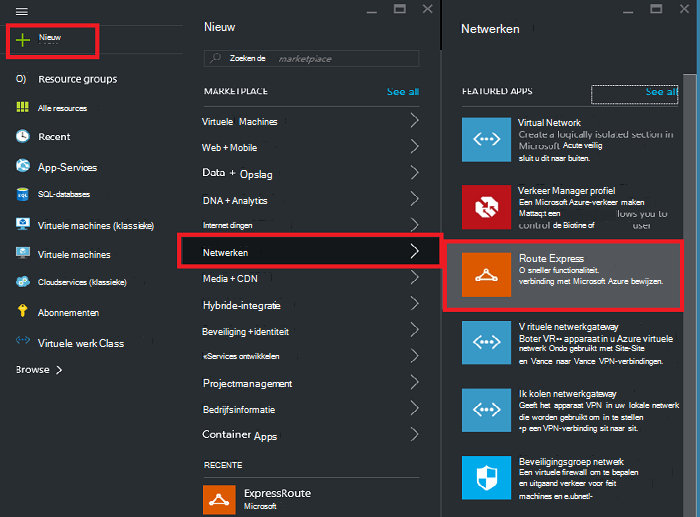
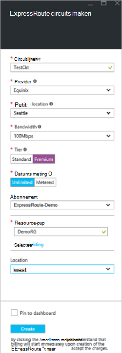
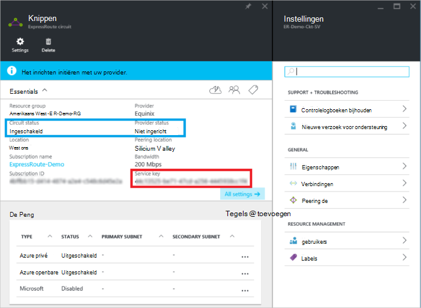
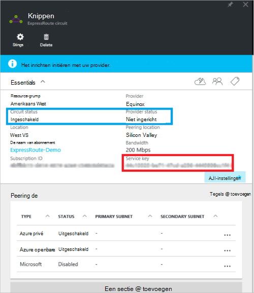
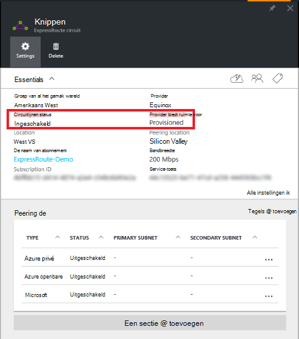

<properties
   pageTitle="Maken en wijzigen van een circuitlijnen ExpressRoute met behulp van resourcemanager en de portal van Azure | Microsoft Azure"
   description="In dit artikel wordt beschreven hoe maken, inrichten verifiëren, bijwerken, verwijderen en een circuitlijnen ExpressRoute deprovision."
   documentationCenter="na"
   services="expressroute"
   authors="cherylmc"
   manager="carmonm"
   editor=""
   tags="azure-resource-manager"/>
<tags
   ms.service="expressroute"
   ms.devlang="na"
   ms.topic="article"
   ms.tgt_pltfrm="na"
   ms.workload="infrastructure-services"
   ms.date="10/10/2016"
   ms.author="cherylmc"/>

# Maken en wijzigen van een circuitlijnen ExpressRoute

> [AZURE.SELECTOR]
[Azure-Portal - resourcemanager](expressroute-howto-circuit-portal-resource-manager.md)
[PowerShell - resourcemanager](expressroute-howto-circuit-arm.md)
[PowerShell - klassiek](expressroute-howto-circuit-classic.md)

In dit artikel wordt beschreven hoe een circuitlijnen Azure ExpressRoute maken met behulp van de Azure-portal en het implementatiemodel resourcemanager Azure. De volgende stappen ook hoe u de status van de circuitlijnen controleren, bijwerken of verwijderen en deprovision deze.

**Over Azure-implementatie-modellen**

[AZURE.INCLUDE [vpn-gateway-clasic-rm](../../includes/vpn-gateway-classic-rm-include.md)] 

## Voordat u begint

- Bekijk de [vereisten](expressroute-prerequisites.md) en [werkstromen](expressroute-workflows.md) voordat u configuratie begint.
- Zorg ervoor dat u toegang tot de [portal van Azure hebt](https://portal.azure.com).
- Zorg ervoor dat u gemachtigd bent om u te maken van nieuwe netwerken resources. Neem contact op met de beheerder van uw account als u niet de juiste machtigingen hebt.

## Maken en een circuitlijnen ExpressRoute inrichten

### 1. Meld u aan bij de portal van Azure

Via een browser, Ga naar de [Azure-portal](http://portal.azure.com) en meld u aan met uw Azure-account.

### 2. Maak een nieuwe ExpressRoute circuitlijnen

>[AZURE.IMPORTANT] Uw circuitlijnen ExpressRoute wordt gefactureerd vanaf het moment dat een servicesleutel is uitgegeven. Zorg ervoor dat u deze bewerking uitvoeren wanneer de provider connectivity klaar is voor het inrichten van de circuitlijnen.

1. U kunt een circuitlijnen ExpressRoute maken door de optie een nieuwe bron maken. Klik op **Nieuw** > **netwerkproblemen** > **ExpressRoute**, zoals wordt weergegeven in de volgende afbeelding:

    

2. Nadat u op **ExpressRoute**, ziet u het blad **circuitlijnen ExpressRoute maken** . Wanneer u de waarden in deze blade hebt ingevuld, zorg dat u de juiste SKU laag en gegevens meting opgeeft.

    - **Laag** bepaalt of een standaard ExpressRoute of een ExpressRoute premium-invoegtoepassing is ingeschakeld. U kunt opgeven **standaard** als u van de standaard SKU of **Premium** voor de premium-invoegtoepassing.

    - **Gegevens meting** bepaalt het type facturering. **Gebruik** kunt voor een netwerk naar gebruik data-abonnement en **onbeperkt** u opgeven voor een onbeperkte data-abonnement. Houd er rekening mee dat u het billing type van **Gebruik** in **onbeperkt wijzigen kunt**, maar u niet meer het type van **onbeperkt** **Gebruik wijzigen**.

    

>[AZURE.IMPORTANT] Zorg ervoor dat de locatie Peering geeft de [fysieke locatie](expressroute-locations.md) waar u bij Microsoft zijn peering. Dit is **niet** gekoppeld aan "Locatie" eigenschap, die verwijst naar de Geografie waarin de Resource van Azure netwerkprovider zich bevindt. Terwijl ze niet zijn gerelateerd, is een goede gewoonte om te kiezen, een Resource netwerkprovider geografisch dicht bij de Peering locatie van de circuitlijnen. 

### 3. de circuits en eigenschappen weergeven

**Alle circuits weergeven**

U kunt alle circuits die u hebt gemaakt met het selecteren van **alle resources** in het menu tabel aan de linkerkant weergeven.
    

**De eigenschappen weergeven**

    You can view the properties of the circuit by selecting it. On this blade, note the service key for the circuit. You must copy the circuit key for your circuit and pass it down to the service provider to complete the provisioning process. The circuit key is specific to your circuit.

### 4. het verzenden van de service-toets naar uw connectivity-provider voor het inrichten

Op deze blade vindt **Provider status** u informatie over de huidige status van de inrichting van aan de service-provider. **Circuitlijnen status** biedt de stand aan de zijkant van Microsoft. Zie het artikel [werkstromen](expressroute-workflows.md#expressroute-circuit-provisioning-states) voor meer informatie over circuitlijnen Staten inrichting.

Wanneer u een nieuwe ExpressRoute circuitlijnen maakt, wordt de circuitlijnen worden in de volgende staat:

Status van providers: niet ingericht 
Status circuit: ingeschakeld

De circuitlijnen verandert naar de volgende staat wanneer de provider connectivity wordt ingeschakeld voor u:

Status van providers: inrichting 
Status circuit: ingeschakeld

Als u wilt mogelijk een circuitlijnen ExpressRoute gebruiken, moet zijn in de volgende staat:

Status van providers: deze is ingericht 
Status circuit: ingeschakeld

### 5. regelmatig Controleer de status en de status van de circuitlijnen-toets

Hier ziet u de eigenschappen van de circuitlijnen die u bent geïnteresseerd in door deze te selecteren. Controleer de **status van providers** en zorg ervoor dat deze naar **Provisioned verplaatst** voordat u verdergaat.

### 6. de configuratie van uw routering maken

Raadpleeg het artikel [configuratie ExpressRoute circuitlijnen routering](expressroute-howto-routing-portal-resource-manager.md) maken en wijzigen van circuitlijnen peerings voor stapsgewijze instructies.

>[AZURE.IMPORTANT] Deze instructies zijn alleen van toepassing op circuits die zijn gemaakt met serviceproviders die laag 2 connectivity services bieden. Als u gebruikmaakt van een serviceprovider die beheerde layer 3 services (meestal een IP VPN, zoals MPLS), wordt uw provider connectiviteit configureren en beheren omleiding voor u.

### 7. een virtueel netwerk koppelen aan een circuitlijnen ExpressRoute

Een virtueel netwerk vervolgens een koppeling naar uw circuitlijnen ExpressRoute. Gebruik het artikel [Linking virtuele netwerken naar ExpressRoute circuits](expressroute-howto-linkvnet-arm.md) wanneer u met het implementatiemodel resourcemanager werkt.

## De status van een circuitlijnen ExpressRoute ophalen

U kunt de status van een circuitlijnen weergeven door deze te selecteren. 

## Een circuitlijnen ExpressRoute wijzigen

U kunt bepaalde eigenschappen van een circuitlijnen ExpressRoute wijzigen zonder die invloed hebben op connectivity. Op dit moment kan wijzigen u ExpressRoute circuitlijnen eigenschappen niet met behulp van de Azure-portal. U kunt echter PowerShell circuitlijnen eigenschappen wijzigen. Zie de sectie [een circuitlijnen ExpressRoute via PowerShell wijzigen](expressroute-howto-circuit-arm.md#modify)voor meer informatie.

U kunt het volgende met geen downtime doen:

- In- of uitschakelen van een ExpressRoute premium-invoegtoepassing voor uw circuitlijnen ExpressRoute.

- De bandbreedte van uw circuitlijnen ExpressRoute vergroten. Houd er rekening mee dat de bandbreedte van een circuitlijnen Downgrade niet wordt ondersteund. 

- Het abonnement waarop meting wijzigen van gegevens met Datalimiet naar onbeperkt gegevens. Houd er rekening mee dat het abonnement waarop meting van onbeperkte gegevens wijzigen in gegevens met Datalimiet niet wordt ondersteund.

-  U kunt in- en uitschakelen **Klassieke bewerkingen toestaan**.

Raadpleeg de [Veelgestelde vragen over ExpressRoute](expressroute-faqs.md)voor meer informatie over beperkingen en tekortkomingen.

## Deprovisioning en verwijderen van een circuitlijnen ExpressRoute

U kunt uw circuitlijnen ExpressRoute verwijderen door het pictogram **verwijderen** selecteren. Houd rekening met het volgende:

- U kunt alle virtuele netwerken uit de circuitlijnen ExpressRoute moet ontkoppelen. Als deze bewerking mislukt, controleert u of een virtuele netwerken zijn gekoppeld aan de circuitlijnen.

- Als de ExpressRoute circuitlijnen provider inrichten servicestatus **Provisioning** of **Provisioned** moet u werken met uw provider naar de circuitlijnen aan hun kant deprovision. We blijft reserveren van resources en u rekening totdat de serviceprovider voltooit u de circuitlijnen deprovisioning en krijgt ons.

- Als de serviceprovider heeft de circuitlijnen (de status voor het inrichten van service-provider is ingesteld op **niet ingericht**) opgeheven kunt u de circuitlijnen vervolgens verwijderen. Hierdoor wordt de facturering voor de circuitlijnen gestopt

## Volgende stappen

Nadat u uw circuitlijnen hebt gemaakt, zorg dat u het volgende doen:

- [Maken en wijzigen omleiding voor uw circuitlijnen ExpressRoute](expressroute-howto-routing-portal-resource-manager.md)
- [Het virtuele netwerk koppelen aan uw circuitlijnen ExpressRoute](expressroute-howto-linkvnet-arm.md)
