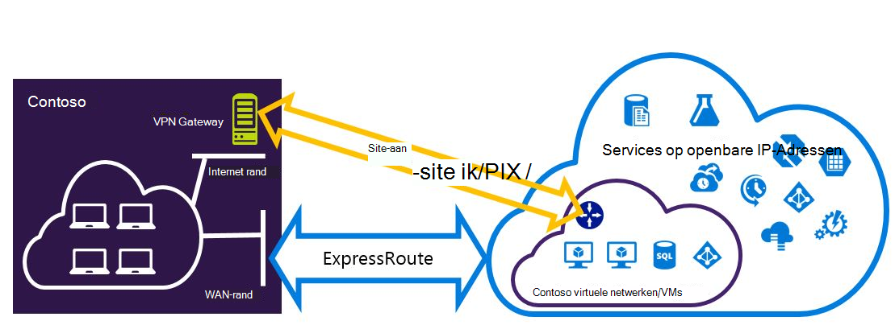
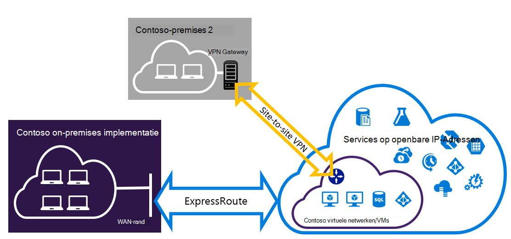

<properties
   pageTitle="Expressroute en Site-naar-Site VPN-verbindingen die kunnen worden geïnstalleerd configureren | Microsoft Azure"
   description="In dit artikel begeleidt u bij het configureren van ExpressRoute en een Site-naar-Site VPN-verbinding die kan worden geïnstalleerd voor het implementatiemodel klassieke."
   documentationCenter="na"
   services="expressroute"
   authors="charwen"
   manager="carmonm"
   editor=""
   tags="azure-service-management"/>
<tags
   ms.service="expressroute"
   ms.devlang="na"
   ms.topic="get-started-article"
   ms.tgt_pltfrm="na"
   ms.workload="infrastructure-services"
   ms.date="10/10/2016"
   ms.author="charwen"/>

# ExpressRoute en Site-naar-Site naast elkaar bestaande verbindingen configureren voor het implementatiemodel klassieke

> [AZURE.SELECTOR]
- [PowerShell - resourcemanager](expressroute-howto-coexist-resource-manager.md)
- [PowerShell - klassiek](expressroute-howto-coexist-classic.md)

Met de mogelijkheid om te configureren op website VPN en ExpressRoute heeft verschillende voordelen. U kunt naar website VPN configureren als een pad secure failover voor ExressRoute of Site-naar-Site VPN's met verbinding maken met sites die niet zijn verbonden via ExpressRoute. Aan bod komen de stappen voor het configureren van beide scenario's in dit artikel. In dit artikel is van toepassing op het implementatiemodel klassieke. Deze configuratie is niet beschikbaar in de portal.

**Over Azure-implementatie-modellen**

[AZURE.INCLUDE [vpn-gateway-clasic-rm](../../includes/vpn-gateway-classic-rm-include.md)] 

>[AZURE.IMPORTANT] ExpressRoute circuits moeten vooraf worden geconfigureerd voordat u de onderstaande instructies volgen. Zorg ervoor dat u de hulplijnen [ExpressRoute circuits maken](expressroute-howto-circuit-classic.md) en [configureren routering](expressroute-howto-routing-classic.md) hebt uitgevoerd voordat u de onderstaande stappen volgen.

## Beperkingen en tekortkomingen

- **Overdracht routering wordt niet ondersteund.** U kunt geen routeert (via Azure) tussen het lokale netwerk is verbonden via VPN van Site-naar-Site en het lokale netwerk is verbonden via ExpressRoute.
- **Punt-naar-site wordt niet ondersteund.** U kunt niet punt-naar-site VPN verbindingen met het dezelfde VNet die is gekoppeld aan ExpressRoute inschakelen. De VPN en ExpressRoute punt-naar-site kan niet worden gecombineerd voor de dezelfde VNet.
- **Afgedwongen tunneling kan niet worden ingeschakeld voor de gateway naar website VPN.** U kunt alleen "afdwingen" alle Internet verkeer terug naar uw on-premises netwerk via ExpressRoute.
- **Eenvoudige SKU gateway wordt niet ondersteund.** U moet een gateway niet - eenvoudige SKU gebruiken voor zowel de [ExpressRoute gateway](expressroute-about-virtual-network-gateways.md) en de [VPN gateway](../vpn-gateway/vpn-gateway-about-vpngateways.md).
- **Alleen route gebaseerde VPN gateway wordt ondersteund.** U kunt een route gebaseerde [VPN Gateway](../vpn-gateway/vpn-gateway-about-vpngateways.md)moet gebruiken.
- **Statische route moet worden geconfigureerd voor uw gateway VPN.** Als het lokale netwerk is verbonden met zowel ExpressRoute als een VPN-verbinding voor de Site-naar-Site, moet u een statische route geconfigureerd in uw lokale netwerk om te leiden van de Site-naar-Site VPN-verbinding met de openbare Internet hebben.
- **ExpressRoute gateway moet eerst worden geconfigureerd.** Voordat u de gateway naar website VPN toevoegt, moet u de gateway ExpressRoute eerst maken.

## Configuratie ontwerpen

### Een VPN-verbinding voor de Site-naar-Site configureren als een pad failover voor ExpressRoute

U kunt een Site-naar-Site VPN-verbinding configureren als een back-up voor ExpressRoute. Dit geldt alleen voor virtuele netwerken die zijn gekoppeld aan het Azure privé peering pad. Er is geen failover op basis van een VPN-oplossing voor services toegankelijk is via Azure openbare en Microsoft peerings. De circuitlijnen ExpressRoute is altijd de primaire koppeling. Gegevens worden door het pad naar website VPN stromen alleen als de circuitlijnen ExpressRoute mislukt. 

### Een Site-naar-Site VPN verbinding maken met sites die niet worden verbonden via ExpressRoute configureren

U kunt uw netwerk waar sommige sites verbinding rechtstreeks met Azure via VPN van Site-naar-Site en sommige sites Maak verbinding via ExpressRoute configureren. 

>[AZURE.NOTE] U kunt een configureren een virtueel netwerk niet als een router overdracht.

## De stappen voor het gebruik van selecteren

Er zijn twee soorten procedures waaruit u kunt kiezen om te configureren van verbindingen die kunnen worden geïnstalleerd. De configuratieprocedure die u selecteert, is afhankelijk of u een bestaand virtuele netwerk waarmee u verbinding wilt maken, of u wilt een nieuwe virtueel netwerk maken hebt.

- Ik heb niet een VNet hebben en moet u een account maakt.
    
    Als u een virtueel netwerk nog geen hebt, wordt deze procedure u begeleid maken van nieuwe virtuele netwerk met behulp van het implementatiemodel klassieke en het maken van nieuwe ExpressRoute en Site-naar-Site VPN-verbindingen. Als u wilt configureren, volg de stappen in de sectie artikel [om een nieuwe virtuele netwerk en naast elkaar bestaande verbindingen te maken](#new).

- Ik heb al een implementatiemodel klassieke VNet.

    Mogelijk hebt u al een virtueel netwerk op hun plaats staan met een bestaande website naar VPN-verbinding of ExpressRoute verbinding. De sectie artikel [coexsiting verbindingen configureren voor een bestaande VNet](#add) leest u de gateway verwijderen en vervolgens nieuwe ExpressRoute en Site-naar-Site VPN-verbindingen te maken. Houd er rekening mee dat bij het maken van de nieuwe verbindingen, de stappen moeten worden uitgevoerd in een zeer specifieke volgorde. De instructies in andere artikelen niet worden gebruikt om uw gateways en verbindingen te maken.

    In deze procedure wordt voor het maken van verbindingen die kunnen worden geïnstalleerd moet u uw gateway wilt verwijderen en vervolgens nieuwe gateways configureren. Dit betekent dat u downtime voor uw lokale meerdere verbindingen hebt terwijl u verwijderen en opnieuw maken van de gateway en verbindingen, maar u niet moet uw VMs of services te migreren naar een nieuw virtuele netwerk. Uw VMs en services is nog steeds mogelijk om te communiceren af tot en met de taakverdeling terwijl u uw gateway configureren als ze hiervoor zijn geconfigureerd.

## Een nieuw virtuele netwerk en naast elkaar bestaande verbindingen maken

Deze procedure wordt u begeleid bij het maken van een VNet en Site-naar-Site en ExpressRoute verbindingen die de tabel maken.

1. U moet de meest recente versie van de Azure PowerShell-cmdlets installeren. Lees [hoe u installeren en configureren van Azure PowerShell](../powershell-install-configure.md) voor meer informatie over het installeren van de PowerShell-cmdlets. Houd er rekening mee dat de cmdlets die u voor deze configuratie gebruikt mogelijk enigszins afwijken van wat u gewend bent misschien. Zorg ervoor dat de cmdlets die is opgegeven in deze instructies gebruiken. 

2. Maak een schema voor uw virtuele netwerk. Zie voor meer informatie over het configuratieschema, [Azure Virtual Network configuratieschema](https://msdn.microsoft.com/library/azure/jj157100.aspx).

    Wanneer u uw schema maakt, moet u de volgende waarden:

    - De gateway-subnet voor het virtuele netwerk moet /27 of een kortere voorvoegsel (zoals /26 of /25).
    - Het type van de gateway verbinding "streeft".

              <VirtualNetworkSite name="MyAzureVNET" Location="Central US">
                <AddressSpace>
                  <AddressPrefix>10.17.159.192/26</AddressPrefix>
                </AddressSpace>
                <Subnets>
                  <Subnet name="Subnet-1">
                    <AddressPrefix>10.17.159.192/27</AddressPrefix>
                  </Subnet>
                  <Subnet name="GatewaySubnet">
                    <AddressPrefix>10.17.159.224/27</AddressPrefix>
                  </Subnet>
                </Subnets>
                <Gateway>
                  <ConnectionsToLocalNetwork>
                    <LocalNetworkSiteRef name="MyLocalNetwork">
                      <Connection type="Dedicated" />
                    </LocalNetworkSiteRef>
                  </ConnectionsToLocalNetwork>
                </Gateway>
              </VirtualNetworkSite>

3. Na het maken en configureren van uw XML-schemabestand, het bestand te uploaden. Hiermee maakt u uw virtuele netwerk.

    Gebruik de volgende cmdlet om uw bestand, de waarde vervangen door uw eigen te uploaden.

        Set-AzureVNetConfig -ConfigurationPath 'C:\NetworkConfig.xml'

4. Een gateway ExpressRoute maken. Zorg ervoor dat de GatewaySKU opgeven als *standaard*, *HighPerformance*, of *UltraPerformance* en de GatewayType als *DynamicRouting*.

    In het onderstaande voorbeeld, wordt vervangen door de waarden voor eigen gebruik.

        New-AzureVNetGateway -VNetName MyAzureVNET -GatewayType DynamicRouting -GatewaySKU HighPerformance

5. Koppeling van de gateway bij ExpressRoute naar de circuitlijnen ExpressRoute. Nadat u deze stap is voltooid, wordt de verbinding tussen uw on-premises netwerk en Azure, tot en met ExpressRoute, tot stand gebracht.

        New-AzureDedicatedCircuitLink -ServiceKey <service-key> -VNetName MyAzureVNET

6. Maak vervolgens uw gateway naar website VPN. De GatewaySKU moet zijn *standaard*, *HighPerformance*, of *UltraPerformance* en de GatewayType moeten *DynamicRouting*.

        New-AzureVirtualNetworkGateway -VNetName MyAzureVNET -GatewayName S2SVPN -GatewayType DynamicRouting -GatewaySKU  HighPerformance

    Als u wilt ophalen van de virtuele gateway netwerkinstellingen, met inbegrip van de gateway-ID en het openbare IP-, gebruikt u de `Get-AzureVirtualNetworkGateway` cmdlet.

        Get-AzureVirtualNetworkGateway

        GatewayId            : 348ae011-ffa9-4add-b530-7cb30010565e
        GatewayName          : S2SVPN
        LastEventData        :
        GatewayType          : DynamicRouting
        LastEventTimeStamp   : 5/29/2015 4:41:41 PM
        LastEventMessage     : Successfully created a gateway for the following virtual network: GNSDesMoines
        LastEventID          : 23002
        State                : Provisioned
        VIPAddress           : 104.43.x.y
        DefaultSite          :
        GatewaySKU           : HighPerformance
        Location             :
        VnetId               : 979aabcf-e47f-4136-ab9b-b4780c1e1bd5
        SubnetId             :
        EnableBgp            : False
        OperationDescription : Get-AzureVirtualNetworkGateway
        OperationId          : 42773656-85e1-a6b6-8705-35473f1e6f6a
        OperationStatus      : Succeeded

7. Een lokale VPN gateway entiteit-site maken. Deze opdracht configureren niet uw on-premises implementatie VPN gateway. In plaats daarvan kunt deze u opgeven van de lokale gateway-instellingen, zoals in het openbare IP- en de on-premises adresruimte, zodat de gateway Azure VPN-verbinding met deze maken kunt.

    >[AZURE.IMPORTANT] De lokale site van de VPN naar website wordt niet gedefinieerd in de netcfg. U moet in plaats daarvan deze cmdlet gebruiken om op te geven van de lokale site parameters. U kunt geen definiëren met behulp van portal of het bestand netcfg.

    Gebruik in het onderstaande voorbeeld, de waarden vervangen door uw eigen.

        New-AzureLocalNetworkGateway -GatewayName MyLocalNetwork -IpAddress <MyLocalGatewayIp> -AddressSpace <MyLocalNetworkAddress>

    > [AZURE.NOTE] Als het lokale netwerk meerdere routes heeft, kunt u doorgeven ze allemaal op als een matrix.  $MyLocalNetworkAddress =@("10.1.2.0/24","10.1.3.0/24","10.2.1.0/24")  

    Als u wilt ophalen van de virtuele gateway netwerkinstellingen, met inbegrip van de gateway-ID en het openbare IP-, gebruikt u de `Get-AzureVirtualNetworkGateway` cmdlet. Zie het volgende voorbeeld.

        Get-AzureLocalNetworkGateway

        GatewayId            : 532cb428-8c8c-4596-9a4f-7ae3a9fcd01b
        GatewayName          : MyLocalNetwork
        IpAddress            : 23.39.x.y
        AddressSpace         : {10.1.2.0/24}
        OperationDescription : Get-AzureLocalNetworkGateway
        OperationId          : ddc4bfae-502c-adc7-bd7d-1efbc00b3fe5
        OperationStatus      : Succeeded

8. Configureer uw lokale apparaat van de VPN-verbinding maken met de nieuwe gateway. Gebruik de informatie die u hebt opgehaald in stap 6 tijdens het configureren van uw apparaat VPN. Zie [Configuratie van de VPN-apparaat](../vpn-gateway/vpn-gateway-about-vpn-devices.md)voor meer informatie over het configureren van de VPN-apparaat.

9. De gateway naar website VPN op Azure een koppeling naar de lokale gateway.

    In dit voorbeeld is connectedEntityId de lokale gateway-ID, die u door te voeren vinden kunt `Get-AzureLocalNetworkGateway`. U kunt virtualNetworkGatewayId vinden met behulp van de `Get-AzureVirtualNetworkGateway` cmdlet. Na deze stap de verbinding tussen uw lokale netwerk en Azure via de website naar VPN-verbinding tot stand is gebracht.

        New-AzureVirtualNetworkGatewayConnection -connectedEntityId <local-network-gateway-id> -gatewayConnectionName Azure2Local -gatewayConnectionType IPsec -sharedKey abc123 -virtualNetworkGatewayId <azure-s2s-vpn-gateway-id>

## Coexsiting verbindingen voor een bestaande VNet configureren

Als u een bestaand virtuele netwerk ondervindt, raadpleegt u de grootte van de subnet gateway. Als het subnet gateway /28 of /29 is, moet u eerst verwijderen van de gateway virtueel netwerk en de gateway-subnet vergroten. De stappen in deze sectie wordt uitgelegd hoe u dat doen.

Als het subnet gateway /27 is of groter en het virtuele netwerk is verbonden via ExpressRoute, kunt u de onderstaande stappen overslaan en ga verder naar ['Stap 6: een gateway naar website VPN maken'](#vpngw) in de vorige sectie.

>[AZURE.NOTE] Wanneer u de bestaande gateway verwijdert, uw lokale premises gaan verloren de verbinding met uw netwerk virtuele terwijl u aan deze configuratie werkt.

1. U moet de meest recente versie van de Azure resourcemanager PowerShell-cmdlets installeren. Lees [hoe u installeren en configureren van Azure PowerShell](../powershell-install-configure.md) voor meer informatie over het installeren van de PowerShell-cmdlets. Houd er rekening mee dat de cmdlets die u voor deze configuratie gebruikt mogelijk enigszins afwijken van wat u gewend bent misschien. Zorg ervoor dat de cmdlets die is opgegeven in deze instructies gebruiken. 

2. Verwijder de bestaande ExpressRoute of Site-naar-Site VPN gateway. Gebruik de volgende cmdlet, de waarden vervangen door uw eigen.

        Remove-AzureVNetGateway –VnetName MyAzureVNET

3. Exporteer het schema virtueel netwerk. Gebruik de volgende PowerShell-cmdlet, de waarden vervangen door uw eigen.

        Get-AzureVNetConfig –ExportToFile “C:\NetworkConfig.xml”

4. Bewerk het schema van netwerk configuratie bestand zodat het subnet gateway /27 of een kortere voorvoegsel (zoals /26 of /25 is). Zie het volgende voorbeeld. 
>[AZURE.NOTE] Als u geen voldoende IP-adressen in uw virtuele netwerk om de grootte van de subnet gateway naar links, moet u meer IP-adresruimte toevoegen. Zie voor meer informatie over het configuratieschema, [Azure Virtual Network configuratieschema](https://msdn.microsoft.com/library/azure/jj157100.aspx).

          <Subnet name="GatewaySubnet">
            <AddressPrefix>10.17.159.224/27</AddressPrefix>
          </Subnet>

5. Als uw vorige gateway een VPN-verbinding voor de Site-naar-Site is, moet u ook het verbindingstype wijzigen naar **speciaal**.

                 <Gateway>
                  <ConnectionsToLocalNetwork>
                    <LocalNetworkSiteRef name="MyLocalNetwork">
                      <Connection type="Dedicated" />
                    </LocalNetworkSiteRef>
                  </ConnectionsToLocalNetwork>
                </Gateway>

6. U hebt nu een VNet met geen gateways. Als u wilt maken van nieuwe gateways en uw verbindingen voltooit, kunt u doorgaan met [stap 4 - maken van een gateway ExpressRoute](#gw), zijn gevonden in de voorgaande reeks stappen.

## Volgende stappen

Raadpleeg de [Veelgestelde vragen over ExpressRoute](expressroute-faqs.md) voor meer informatie over ExpressRoute,
