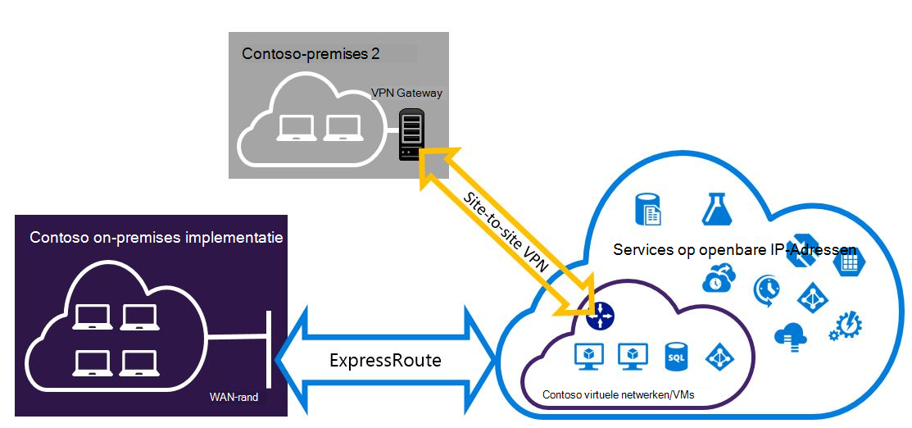

<properties
   pageTitle="Expressroute en Site-naar-Site VPN-verbindingen die kunnen worden geïnstalleerd voor het implementatiemodel resourcemanager configureren | Microsoft Azure"
   description="In dit artikel begeleidt u bij het configureren van ExpressRoute en een Site-naar-Site VPN-verbinding die kan worden geïnstalleerd voor resourcemanager model."
   documentationCenter="na"
   services="expressroute"
   authors="charwen"
   manager="carmonm"
   editor=""
   tags="azure-resource-manager"/>
<tags
   ms.service="expressroute"
   ms.devlang="na"
   ms.topic="get-started-article"
   ms.tgt_pltfrm="na"
   ms.workload="infrastructure-services"
   ms.date="10/10/2016"
   ms.author="charleywen"/>

# ExpressRoute en Site-naar-Site naast elkaar bestaande verbindingen configureren voor het resourcemanager implementatiemodel

> [AZURE.SELECTOR]
- [PowerShell - resourcemanager](expressroute-howto-coexist-resource-manager.md)
- [PowerShell - klassiek](expressroute-howto-coexist-classic.md)

Met de mogelijkheid om te configureren op website VPN en ExpressRoute heeft verschillende voordelen. U kunt naar website VPN configureren als een pad secure failover voor ExressRoute of Site-naar-Site VPN's met verbinding maken met sites die niet zijn verbonden via ExpressRoute. Aan bod komen de stappen voor het configureren van beide scenario's in dit artikel. In dit artikel is van toepassing op het implementatiemodel resourcemanager. Deze configuratie is niet beschikbaar in de portal van Azure.

**Over Azure-implementatie-modellen**

[AZURE.INCLUDE [vpn-gateway-clasic-rm](../../includes/vpn-gateway-classic-rm-include.md)] 

>[AZURE.IMPORTANT] ExpressRoute circuits moeten vooraf worden geconfigureerd voordat u de onderstaande instructies volgen. Zorg ervoor dat u de hulplijnen [ExpressRoute circuits maken](expressroute-howto-circuit-arm.md) en [configureren routering](expressroute-howto-routing-arm.md) hebt uitgevoerd voordat u de onderstaande stappen volgen.

## Beperkingen en tekortkomingen

- **Overdracht routering wordt niet ondersteund.** U kunt geen routeert (via Azure) tussen het lokale netwerk is verbonden via VPN van Site-naar-Site en het lokale netwerk is verbonden via ExpressRoute.
- **Eenvoudige SKU gateway wordt niet ondersteund.** U moet een gateway niet - eenvoudige SKU gebruiken voor zowel de [ExpressRoute gateway](expressroute-about-virtual-network-gateways.md) en de [VPN gateway](../vpn-gateway/vpn-gateway-about-vpngateways.md).
- **Alleen route gebaseerde VPN gateway wordt ondersteund.** U kunt een route gebaseerde [VPN Gateway](../vpn-gateway/vpn-gateway-about-vpngateways.md)moet gebruiken.
- **Statische route moet worden geconfigureerd voor uw gateway VPN.** Als het lokale netwerk is verbonden met zowel ExpressRoute als een VPN-verbinding voor de Site-naar-Site, moet u een statische route geconfigureerd in uw lokale netwerk om te leiden van de Site-naar-Site VPN-verbinding met de openbare Internet hebben.
- **ExpressRoute gateway moet eerst worden geconfigureerd.** Voordat u de gateway naar website VPN toevoegt, moet u de gateway ExpressRoute eerst maken.

## Configuratie ontwerpen

### Een VPN-verbinding voor de Site-naar-Site configureren als een pad failover voor ExpressRoute

U kunt een Site-naar-Site VPN-verbinding configureren als een back-up voor ExpressRoute. Dit geldt alleen voor virtuele netwerken die zijn gekoppeld aan het Azure privé peering pad. Er is geen failover op basis van een VPN-oplossing voor services toegankelijk is via Azure openbare en Microsoft peerings. De circuitlijnen ExpressRoute is altijd de primaire koppeling. Gegevens worden door het pad naar website VPN stromen alleen als de circuitlijnen ExpressRoute mislukt.
>[AZURE.NOTE] Terwijl ExpressRoute circuitlijnen primaire op Site-naar-Site VPN wanneer beide manieren hetzelfde zijn, wordt Azure het vergelijken van longuest voorvoegsel gebruikt om te kiezen de route naar de bestemming van het pakket.

### Een Site-naar-Site VPN verbinding maken met sites die niet worden verbonden via ExpressRoute configureren

U kunt uw netwerk waar sommige sites verbinding rechtstreeks met Azure via VPN van Site-naar-Site en sommige sites Maak verbinding via ExpressRoute configureren. 

>[AZURE.NOTE] U kunt een configureren een virtueel netwerk niet als een router overdracht.

## De stappen voor het gebruik van selecteren

Er zijn twee soorten procedures waaruit u kunt kiezen om te configureren van verbindingen die kunnen worden geïnstalleerd. De configuratieprocedure die u selecteert, is afhankelijk of u een bestaand virtuele netwerk waarmee u verbinding wilt maken, of u wilt een nieuwe virtueel netwerk maken hebt.

- Ik heb niet een VNet hebben en moet u een account maakt.
    
    Als u een virtueel netwerk nog geen hebt, wordt deze procedure u begeleid maken van nieuwe virtuele netwerk resourcemanager implementatiemodel gebruiken en maken van nieuwe ExpressRoute en Site-naar-Site VPN-verbindingen. Als u wilt configureren, volg de stappen in de sectie artikel [om een nieuwe virtuele netwerk en naast elkaar bestaande verbindingen te maken](#new).

- Ik heb al een resourcemanager implementatiemodel VNet.

    Mogelijk hebt u al een virtueel netwerk op hun plaats staan met een bestaande website naar VPN-verbinding of ExpressRoute verbinding. De sectie [naar coexsiting verbindingen configureren voor een bestaande VNet](#add) leest u de gateway verwijderen en vervolgens nieuwe ExpressRoute en Site-naar-Site VPN-verbindingen te maken. Houd er rekening mee dat bij het maken van de nieuwe verbindingen, de stappen moeten worden uitgevoerd in een zeer specifieke volgorde. De instructies in andere artikelen niet worden gebruikt om uw gateways en verbindingen te maken.

    In deze procedure wordt voor het maken van verbindingen die kunnen worden geïnstalleerd moet u uw gateway wilt verwijderen en vervolgens nieuwe gateways configureren. Dit betekent dat u downtime voor uw lokale meerdere verbindingen hebt terwijl u verwijderen en opnieuw maken van de gateway en verbindingen, maar u niet moet uw VMs of services te migreren naar een nieuw virtuele netwerk. Uw VMs en services is nog steeds mogelijk om te communiceren af tot en met de taakverdeling terwijl u uw gateway configureren als ze hiervoor zijn geconfigureerd.

## Een nieuw virtuele netwerk en naast elkaar bestaande verbindingen maken

Deze procedure wordt u begeleid bij het maken van een VNet en Site-naar-Site en ExpressRoute verbindingen die de tabel maken.
    
1. U moet de meest recente versie van de Azure PowerShell-cmdlets installeren. Lees [hoe u installeren en configureren van Azure PowerShell](../powershell-install-configure.md) voor meer informatie over het installeren van de PowerShell-cmdlets. Houd er rekening mee dat de cmdlets die u voor deze configuratie gebruikt mogelijk enigszins afwijken van wat u gewend bent misschien. Zorg ervoor dat de cmdlets die is opgegeven in deze instructies gebruiken.

2. Meld u uw account en stel de omgeving.
    
        login-AzureRmAccount
        Select-AzureRmSubscription -SubscriptionName 'yoursubscription'
        $location = "Central US"
        $resgrp = New-AzureRmResourceGroup -Name "ErVpnCoex" -Location $location

3. Maak een virtueel netwerk, inclusief Gateway Subnet. Zie voor meer informatie over de virtuele netwerkconfiguratie [Azure virtuele netwerkconfiguratie](../virtual-network/virtual-networks-create-vnet-arm-ps.md).

    >[AZURE.IMPORTANT] De Gateway-Subnet moet /27 of een kortere voorvoegsel (zoals /26 of /25).
    
    Maak een nieuwe VNet.

        $vnet = New-AzureRmVirtualNetwork -Name "CoexVnet" -ResourceGroupName $resgrp.ResourceGroupName -Location $location -AddressPrefix "10.200.0.0/16" 

    Subnetten toevoegen.

        Add-AzureRmVirtualNetworkSubnetConfig -Name "App" -VirtualNetwork $vnet -AddressPrefix "10.200.1.0/24"
        Add-AzureRmVirtualNetworkSubnetConfig -Name "GatewaySubnet" -VirtualNetwork $vnet -AddressPrefix "10.200.255.0/24"

    Sla de configuratie VNet.

        $vnet = Set-AzureRmVirtualNetwork -VirtualNetwork $vnet

4. Een gateway ExpressRoute maken. Zie voor meer informatie over de configuratie van de gateway ExpressRoute, [ExpressRoute gatewayconfiguratie](expressroute-howto-add-gateway-resource-manager.md). De GatewaySKU moet zijn *standaard*, *HighPerformance*of *UltraPerformance*.

        $gwSubnet = Get-AzureRmVirtualNetworkSubnetConfig -Name "GatewaySubnet" -VirtualNetwork $vnet
        $gwIP = New-AzureRmPublicIpAddress -Name "ERGatewayIP" -ResourceGroupName $resgrp.ResourceGroupName -Location $location -AllocationMethod Dynamic
        $gwConfig = New-AzureRmVirtualNetworkGatewayIpConfig -Name "ERGatewayIpConfig" -SubnetId $gwSubnet.Id -PublicIpAddressId $gwIP.Id
        $gw = New-AzureRmVirtualNetworkGateway -Name "ERGateway" -ResourceGroupName $resgrp.ResourceGroupName -Location $location -IpConfigurations $gwConfig -GatewayType "ExpressRoute" -GatewaySku Standard 

5. Koppeling van de gateway bij ExpressRoute naar de circuitlijnen ExpressRoute. Nadat u deze stap is voltooid, wordt de verbinding tussen uw on-premises netwerk en Azure, tot en met ExpressRoute, tot stand gebracht. Zie voor meer informatie over de koppelingsbewerking [Koppeling VNets naar ExpressRoute](expressroute-howto-linkvnet-arm.md).

        $ckt = Get-AzureRmExpressRouteCircuit -Name "YourCircuit" -ResourceGroupName "YourCircuitResourceGroup"
        New-AzureRmVirtualNetworkGatewayConnection -Name "ERConnection" -ResourceGroupName $resgrp.ResourceGroupName -Location $location -VirtualNetworkGateway1 $gw -PeerId $ckt.Id -ConnectionType ExpressRoute

6. Maak vervolgens uw gateway naar website VPN. Zie voor meer informatie over de configuratie van de gateway VPN [configureren een VNet met de verbinding van een Site-naar-Site](../vpn-gateway/vpn-gateway-create-site-to-site-rm-powershell.md). De GatewaySKU moet zijn *standaard*, *HighPerformance*of *UltraPerformance*. De VpnType moet *RouteBased*.

        $gwSubnet = Get-AzureRmVirtualNetworkSubnetConfig -Name "GatewaySubnet" -VirtualNetwork $vnet
        $gwIP = New-AzureRmPublicIpAddress -Name "VPNGatewayIP" -ResourceGroupName $resgrp.ResourceGroupName -Location $location -AllocationMethod Dynamic
        $gwConfig = New-AzureRmVirtualNetworkGatewayIpConfig -Name "VPNGatewayIpConfig" -SubnetId $gwSubnet.Id -PublicIpAddressId $gwIP.Id
        New-AzureRmVirtualNetworkGateway -Name "VPNGateway" -ResourceGroupName $resgrp.ResourceGroupName -Location $location -IpConfigurations $gwConfig -GatewayType "Vpn" -VpnType "RouteBased" -GatewaySku "Standard"

    Azure VPN gateway ondersteunt de BGP. In de volgende opdracht kunt u - EnableBgp opgeven.

        $azureVpn = New-AzureRmVirtualNetworkGateway -Name "VPNGateway" -ResourceGroupName $resgrp.ResourceGroupName -Location $location -IpConfigurations $gwConfig -GatewayType "Vpn" -VpnType "RouteBased" -GatewaySku "Standard" -EnableBgp $true

    U vindt de BGP peering IP- en de AS-nummer dat Azure voor de gateway VPN in $azureVpn.BgpSettings.BgpPeeringAddress en $azureVpn.BgpSettings.Asn gebruikt. Zie [BGP configureren](../vpn-gateway/vpn-gateway-bgp-resource-manager-ps.md) voor Azure VPN gateway voor meer informatie.

7. Een lokale VPN gateway entiteit-site maken. Deze opdracht configureren niet uw on-premises implementatie VPN gateway. In plaats daarvan kunt deze u opgeven van de lokale gateway-instellingen, zoals in het openbare IP- en de on-premises adresruimte, zodat de gateway Azure VPN-verbinding met deze maken kunt.

    Als uw lokale VPN apparaat alleen statische routering ondersteunt, kunt u de statische routes configureren op de volgende manier.

        $MyLocalNetworkAddress = @("10.100.0.0/16","10.101.0.0/16","10.102.0.0/16")
        $localVpn = New-AzureRmLocalNetworkGateway -Name "LocalVPNGateway" -ResourceGroupName $resgrp.ResourceGroupName -Location $location -GatewayIpAddress *<Public IP>* -AddressPrefix $MyLocalNetworkAddress

    Als uw lokale VPN-apparaat de BGP ondersteunt en u wilt inschakelen dynamische routering, moet u weten de BGP peering IP- en de AS-nummer die uw lokale VPN-apparaat gebruikt.

        $localVPNPublicIP = "<Public IP>"
        $localBGPPeeringIP = "<Private IP for the BGP session>"
        $localBGPASN = "<ASN>"
        $localAddressPrefix = $localBGPPeeringIP + "/32"
        $localVpn = New-AzureRmLocalNetworkGateway -Name "LocalVPNGateway" -ResourceGroupName $resgrp.ResourceGroupName -Location $location -GatewayIpAddress $localVPNPublicIP -AddressPrefix $localAddressPrefix -BgpPeeringAddress $localBGPPeeringIP -Asn $localBGPASN

8. Configureer uw lokale apparaat van de VPN-verbinding maken met de nieuwe Azure VPN gateway. Zie [Configuratie van de VPN-apparaat](../vpn-gateway/vpn-gateway-about-vpn-devices.md)voor meer informatie over het configureren van de VPN-apparaat.

9. De gateway naar website VPN op Azure een koppeling naar de lokale gateway.

        $azureVpn = Get-AzureRmVirtualNetworkGateway -Name "VPNGateway" -ResourceGroupName $resgrp.ResourceGroupName
        New-AzureRmVirtualNetworkGatewayConnection -Name "VPNConnection" -ResourceGroupName $resgrp.ResourceGroupName -Location $location -VirtualNetworkGateway1 $azureVpn -LocalNetworkGateway2 $localVpn -ConnectionType IPsec -SharedKey <yourkey>

## Coexsiting verbindingen voor een bestaande VNet configureren

Als u een bestaand virtuele netwerk ondervindt, raadpleegt u de grootte van de subnet gateway. Als het subnet gateway /28 of /29 is, moet u eerst verwijderen van de gateway virtueel netwerk en de gateway-subnet vergroten. De stappen in deze sectie wordt uitgelegd hoe u dat doen.

Als het subnet gateway /27 is of groter en het virtuele netwerk is verbonden via ExpressRoute, kunt u de onderstaande stappen overslaan en ga verder naar ['Stap 6: een gateway naar website VPN maken'](#vpngw) in de vorige sectie. 

>[AZURE.NOTE] Wanneer u de bestaande gateway verwijdert, uw lokale premises gaan verloren de verbinding met uw netwerk virtuele terwijl u aan deze configuratie werkt. 

1. U moet de meest recente versie van de Azure PowerShell-cmdlets installeren. Lees [hoe u installeren en configureren van Azure PowerShell](../powershell-install-configure.md) voor meer informatie over het installeren van de PowerShell-cmdlets. Houd er rekening mee dat de cmdlets die u voor deze configuratie gebruikt mogelijk enigszins afwijken van wat u gewend bent misschien. Zorg ervoor dat de cmdlets die is opgegeven in deze instructies gebruiken. 

2. Verwijder de bestaande ExpressRoute of Site-naar-Site VPN gateway. 

        Remove-AzureRmVirtualNetworkGateway -Name <yourgatewayname> -ResourceGroupName <yourresourcegroup>

3. Gateway-Subnet verwijderen.
        
        $vnet = Get-AzureRmVirtualNetwork -Name <yourvnetname> -ResourceGroupName <yourresourcegroup> 
        Remove-AzureRmVirtualNetworkSubnetConfig -Name GatewaySubnet -VirtualNetwork $vnet

4. Een Gateway-subnetten die is /27 toevoegen of groter.
    >[AZURE.NOTE] Als u geen voldoende IP-adressen in uw virtuele netwerk om de grootte van de subnet gateway naar links, moet u meer IP-adresruimte toevoegen.

        $vnet = Get-AzureRmVirtualNetwork -Name <yourvnetname> -ResourceGroupName <yourresourcegroup>
        Add-AzureRmVirtualNetworkSubnetConfig -Name "GatewaySubnet" -VirtualNetwork $vnet -AddressPrefix "10.200.255.0/24"

    Sla de configuratie VNet.

        $vnet = Set-AzureRmVirtualNetwork -VirtualNetwork $vnet

5. U hebt nu een VNet met geen gateways. Als u wilt maken van nieuwe gateways en uw verbindingen voltooit, kunt u doorgaan met [stap 4 - maken van een gateway ExpressRoute](#gw), zijn gevonden in de voorgaande reeks stappen.

## Configuratie van het punt-naar-site toevoegen aan de gateway VPN
U kunt de onderstaande stappen om de configuratie van het punt-naar-Site toevoegen aan uw gateway VPN bij het instellen van een collega bestaan volgen.

1. Groep VPN-Client-adressen toevoegen. 

        $azureVpn = Get-AzureRmVirtualNetworkGateway -Name "VPNGateway" -ResourceGroupName $resgrp.ResourceGroupName
        Set-AzureRmVirtualNetworkGatewayVpnClientConfig -VirtualNetworkGateway $azureVpn -VpnClientAddressPool "10.251.251.0/24"

2. Upload het certificaat van de hoofdsite VPN naar Azure voor uw gateway VPN. In dit voorbeeld wordt ervan uitgegaan dat het certificaat hoofdmap is opgeslagen in de lokale computer waarop het volgende PowerShell-cmdlets worden uitgevoerd. 

        $p2sCertFullName = "RootErVpnCoexP2S.cer"
        $p2sCertMatchName = "RootErVpnCoexP2S"
        $p2sCertToUpload=get-childitem Cert:\CurrentUser\My | Where-Object {$_.Subject -match $p2sCertMatchName}
        if ($p2sCertToUpload.count -eq 1){
            write-host "cert found"
        } else {
            write-host "cert not found"
            exit
        } 
        $p2sCertData = [System.Convert]::ToBase64String($p2sCertToUpload.RawData)
        Add-AzureRmVpnClientRootCertificate -VpnClientRootCertificateName $p2sCertFullName -VirtualNetworkGatewayname $azureVpn.Name -ResourceGroupName $resgrp.ResourceGroupName -PublicCertData $p2sCertData

Zie [een verbinding punt-naar-Site configureren](../vpn-gateway/vpn-gateway-howto-point-to-site-rm-ps.md)voor meer informatie over VPN punt-naar-Site.

## Volgende stappen

Raadpleeg de [Veelgestelde vragen over ExpressRoute](expressroute-faqs.md)voor meer informatie over ExpressRoute.
