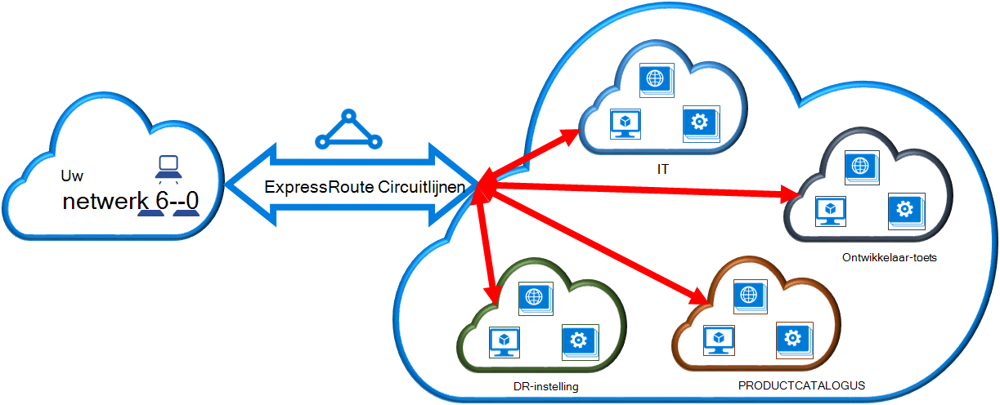

<properties
   pageTitle="Een virtueel netwerk koppelen aan een circuitlijnen ExpressRoute met behulp van klassieke implementatiemodel en PowerShell | Microsoft Azure"
   description="Dit document bevat een overzicht van het virtuele netwerken (VNets) koppelen aan ExpressRoute circuits met behulp van klassieke implementatiemodel en PowerShell."
   services="expressroute"
   documentationCenter="na"
   authors="ganesr"
   manager="carmonm"
   editor=""
   tags="azure-service-management"/>
<tags
   ms.service="expressroute"
   ms.devlang="na"
   ms.topic="article"
   ms.tgt_pltfrm="na"
   ms.workload="infrastructure-services"
   ms.date="10/10/2016"
   ms.author="ganesr" />

# Een virtueel netwerk koppelen aan een circuitlijnen ExpressRoute

> [AZURE.SELECTOR]
- [Azure-Portal - bronbeheer](expressroute-howto-linkvnet-portal-resource-manager.md)
- [PowerShell - resourcemanager](expressroute-howto-linkvnet-arm.md)
- [PowerShell - klassiek](expressroute-howto-linkvnet-classic.md)

In dit artikel kunt u virtuele netwerken (VNets) koppelen aan Azure ExpressRoute circuits met behulp van klassieke implementatiemodel en PowerShell. Virtuele netwerken zijn in hetzelfde abonnement of kunnen deel uitmaken van een ander abonnement.

**Over Azure-implementatie-modellen**

[AZURE.INCLUDE [vpn-gateway-clasic-rm](../../includes/vpn-gateway-classic-rm-include.md)]

## Vereisten voor de configuratie

1. Moet u de nieuwste versie van de Azure PowerShell-modules. U kunt de meest recente PowerShell-modules downloaden van de PowerShell-gedeelte van de [pagina Downloads van Azure](https://azure.microsoft.com/downloads/). Volg de instructies in [het installeren en configureren van Azure PowerShell](../powershell-install-configure.md) voor stapsgewijze instructies voor het configureren van uw computer als u wilt gebruiken van de Azure PowerShell-modules.
2. U moet de [vereisten](expressroute-prerequisites.md), [routeren vereisten](expressroute-routing.md)en [werkstromen](expressroute-workflows.md) bekijken voordat u configuratie begint.
3. U moet een actieve ExpressRoute circuitlijnen hebben.
    - Volg de instructies voor het [maken van een circuitlijnen ExpressRoute](expressroute-howto-circuit-classic.md) en hebben connectivity provider van de circuitlijnen inschakelen.
    - Zorg ervoor dat er Azure privé peering geconfigureerd voor uw circuitlijnen. Zie het artikel [configureren mailroutering](expressroute-howto-routing-classic.md) routeren voor instructies.
    - Zorg ervoor dat Azure privé peering is geconfigureerd en de BGP peering tussen uw netwerk en Microsoft omhoog zodat u kunt end-to-end-connectiviteit inschakelen.
    - U moet een virtueel netwerk en een virtueel netwerkgateway gemaakt en volledig deze is ingericht. Volg de instructies voor het [configureren van een virtueel netwerk voor ExpressRoute](expressroute-howto-vnet-portal-classic.md).

U kunt maximaal 10 virtuele netwerken koppelen aan een circuitlijnen ExpressRoute. Alle virtuele netwerken moeten zich in dezelfde geopolitieke regio. U kunt een groot aantal virtuele netwerken naar uw circuitlijnen ExpressRoute of koppeling virtuele netwerken die zijn in andere geopolitieke regio's als u de premium-invoegtoepassing ExpressRoute ingeschakeld koppelen. Controleer de [Veelgestelde vragen](expressroute-faqs.md) voor meer informatie over de premium-invoegtoepassing.

## Een virtueel netwerk in hetzelfde abonnement verbinden met een circuitlijnen

U kunt een virtueel netwerk koppelen aan een circuitlijnen ExpressRoute met behulp van de volgende cmdlet. Zorg ervoor dat de gateway virtueel netwerk wordt gemaakt en klaar is om te worden gekoppeld voordat u de cmdlet uitvoeren.

    New-AzureDedicatedCircuitLink -ServiceKey "*****************************" -VNetName "MyVNet"
    Provisioned

## Een virtueel netwerk in een ander abonnement van verbinden met een circuitlijnen

U kunt een circuitlijnen ExpressRoute meerdere abonnementen delen. De volgende afbeelding ziet u een eenvoudige schema van hoe delen werkt voor ExpressRoute circuits over meerdere abonnementen.

Elk van de kleinere wolken binnen de grote cloud wordt gebruikt voor abonnementen die deel uitmaakt van verschillende afdelingen binnen een organisatie. Elk van de afdelingen binnen de organisatie kunt hun eigen abonnement kunt gebruiken voor het implementeren van hun services--, maar de afdelingen kunt delen één ExpressRoute uw on-premises netwerk verbinding te maken. Één afdeling (in dit voorbeeld: IT) kan de eigenaar bent van de circuitlijnen ExpressRoute. Overige abonnementen binnen de organisatie kan de circuitlijnen ExpressRoute kunnen gebruiken.

>[AZURE.NOTE] Connectiviteit en bandbreedte kosten voor de speciale circuitlijnen wordt toegepast op de eigenaar van de ExpressRoute circuitlijnen. Alle virtuele netwerken delen de dezelfde bandbreedte.

### Beheer

De *eigenaar van de circuitlijnen* is de beheerder/coadministrator van het abonnement waarin de circuitlijnen ExpressRoute is gemaakt. De eigenaar van de circuitlijnen kan beheerders/coadministrators van andere abonnementen, genoemd *circuitlijnen gebruikers*, als u wilt gebruiken de speciale circuitlijnen waarvan ze eigenaar Autoriseer. Circuitlijnen-gebruikers die zijn geautoriseerd gebruik van de organisatie ExpressRoute circuitlijnen kunnen het virtuele netwerk in hun abonnement koppelen aan de circuitlijnen ExpressRoute nadat ze zijn geautoriseerd.

De eigenaar van de circuitlijnen heeft de kracht om te wijzigen en vergunningen op elk gewenst moment intrekken. Een vergunning intrekken resulteert in alle koppelingen worden verwijderd uit het abonnement waarvoor toegang is ingetrokken.

### Circuitlijnen eigenaar bewerkingen

#### Een vergunning maken

De eigenaar van de circuitlijnen geautoriseerd de beheerders van de overige abonnementen gebruik van de opgegeven circuitlijnen. In het volgende voorbeeld kan de beheerder van de circuitlijnen (Contoso IT) de beheerder van een ander abonnement (ontwikkelaar-Test) om de koppeling van maximaal twee virtuele netwerken naar de circuitlijnen. De Contoso-IT-beheerder kunt dit door het opgeven van de ontwikkelaar-toets Microsoft-ID. De cmdlet verzenden geen e-mail naar de opgegeven id van Microsoft. De eigenaar van de circuitlijnen moet expliciet hoogte andere eigenaar van het abonnement dat de autorisatie voltooid is.

    New-AzureDedicatedCircuitLinkAuthorization -ServiceKey "**************************" -Description "Dev-Test Links" -Limit 2 -MicrosoftIds 'devtest@contoso.com'

    Description         : Dev-Test Links
    Limit               : 2
    LinkAuthorizationId : **********************************
    MicrosoftIds        : devtest@contoso.com
    Used                : 0

#### Reviseren van vergunningen

De eigenaar van de circuitlijnen kunt bekijken van alle vergunningen die op een bepaalde circuitlijnen worden uitgegeven door de volgende cmdlet uit te voeren:

    Get-AzureDedicatedCircuitLinkAuthorization -ServiceKey: "**************************"

    Description         : EngineeringTeam
    Limit               : 3
    LinkAuthorizationId : ####################################
    MicrosoftIds        : engadmin@contoso.com
    Used                : 1

    Description         : MarketingTeam
    Limit               : 1
    LinkAuthorizationId : @@@@@@@@@@@@@@@@@@@@@@@@@@@@@@@@@@@@
    MicrosoftIds        : marketingadmin@contoso.com
    Used                : 0

    Description         : Dev-Test Links
    Limit               : 2
    LinkAuthorizationId : &&&&&&&&&&&&&&&&&&&&&&&&&&&&&&&&&&&&
    MicrosoftIds        : salesadmin@contoso.com
    Used                : 2

#### Vergunningen bijwerken

De eigenaar van de circuitlijnen kunt vergunningen wijzigen met behulp van de volgende cmdlet:

    Set-AzureDedicatedCircuitLinkAuthorization -ServiceKey "**************************" -AuthorizationId "&&&&&&&&&&&&&&&&&&&&&&&&&&&&"-Limit 5

    Description         : Dev-Test Links
    Limit               : 5
    LinkAuthorizationId : &&&&&&&&&&&&&&&&&&&&&&&&&&&&&&&&&&&&&&
    MicrosoftIds        : devtest@contoso.com
    Used                : 0

#### Vergunningen verwijderen

De eigenaar van de circuitlijnen kunt intrekken/verwijderen vergunningen aan de gebruiker door de volgende cmdlet uit te voeren:

    Remove-AzureDedicatedCircuitLinkAuthorization -ServiceKey "*****************************" -AuthorizationId "###############################"

### Circuitlijnen gebruiker bewerkingen

#### Reviseren van vergunningen

De gebruiker circuitlijnen kunt vergunningen bekijken met behulp van de volgende cmdlet:

    Get-AzureAuthorizedDedicatedCircuit

    Bandwidth                        : 200
    CircuitName                      : ContosoIT
    Location                         : Washington DC
    MaximumAllowedLinks              : 2
    ServiceKey                       : &&&&&&&&&&&&&&&&&&&&&&&&&&&&&&&&&&&&
    ServiceProviderName              : equinix
    ServiceProviderProvisioningState : Provisioned
    Status                           : Enabled
    UsedLinks                        : 0

#### Koppeling vergunningen wisselen

De volgende cmdlet om in te wisselen van een koppeling autorisatie kan worden uitgevoerd door de gebruiker circuitlijnen:

    New-AzureDedicatedCircuitLink –servicekey "&&&&&&&&&&&&&&&&&&&&&&&&&&" –VnetName 'SalesVNET1'

    State VnetName
    ----- --------
    Provisioned SalesVNET1

## Volgende stappen

Raadpleeg de [Veelgestelde vragen over ExpressRoute](expressroute-faqs.md)voor meer informatie over ExpressRoute.
