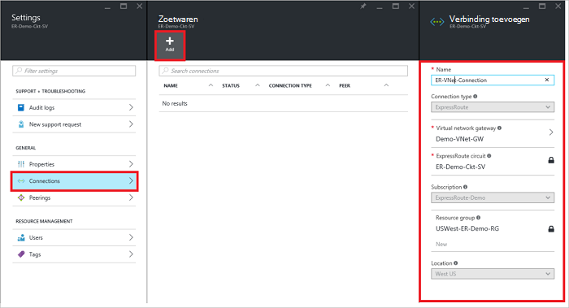
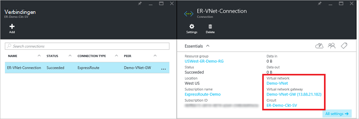

<properties
   pageTitle="Een virtueel netwerk koppelen aan een circuitlijnen ExpressRoute met behulp van het implementatiemodel resourcemanager-en de portal van Azure | Microsoft Azure"
   description="Dit document bevat een overzicht van het virtuele netwerken (VNets) koppelen aan ExpressRoute circuits."
   services="expressroute"
   documentationCenter="na"
   authors="cherylmc"
   manager="carmonm"
   editor=""
   tags="azure-resource-manager"/>
<tags
   ms.service="expressroute"
   ms.devlang="na"
   ms.topic="article"
   ms.tgt_pltfrm="na"
   ms.workload="infrastructure-services"
   ms.date="10/10/2016"
   ms.author="cherylmc" />

# Een virtueel netwerk koppelen aan een circuitlijnen ExpressRoute

> [AZURE.SELECTOR]
- [Azure-Portal - bronbeheer](expressroute-howto-linkvnet-portal-resource-manager.md)
- [PowerShell - resourcemanager](expressroute-howto-linkvnet-arm.md)
- [PowerShell - klassiek](expressroute-howto-linkvnet-classic.md)

In dit artikel kunt u virtuele netwerken (VNets) koppelen aan Azure ExpressRoute circuits met behulp van het implementatiemodel resourcemanager-en de Azure-portal. Virtuele netwerken zijn in hetzelfde abonnement of deel uitmaken van een ander abonnement.

**Over Azure-implementatie-modellen**

[AZURE.INCLUDE [vpn-gateway-clasic-rm](../../includes/vpn-gateway-classic-rm-include.md)]

## Vereisten voor de configuratie

- Zorg ervoor dat u de [vereisten](expressroute-prerequisites.md), [routeren vereisten](expressroute-routing.md)en [werkstromen](expressroute-workflows.md) hebt bekeken voordat u configuratie begint.
- U moet een actieve ExpressRoute circuitlijnen hebben.
    - Volg de instructies voor het [maken van een circuitlijnen ExpressRoute](expressroute-howto-circuit-arm.md) en de circuitlijnen ingeschakeld door uw provider connectivity hebben.

    - Zorg ervoor dat er Azure privé peering geconfigureerd voor uw circuitlijnen. Zie het artikel [configureren mailroutering](expressroute-howto-routing-portal-resource-manager.md) routeren voor instructies.

    - Zorg ervoor dat Azure privé peering is geconfigureerd en de BGP peering tussen uw netwerk en Microsoft omhoog zodat u kunt end-to-end-connectiviteit inschakelen.

    - Zorg ervoor dat er een virtueel netwerk en een virtueel netwerkgateway gemaakt en volledig deze is ingericht. Volg de instructies voor het maken van een [VPN-gateway](../articles/vpn-gateway/vpn-gateway-howto-site-to-site-resource-manager-portal.md) (volgen na alleen stappen 1-5).

U kunt maximaal 10 virtuele netwerken koppelen aan een standaard ExpressRoute circuitlijnen. Alle virtuele netwerken moeten zich in dezelfde geopolitieke regio bij gebruik van een standaard ExpressRoute circuitlijnen. U kunt een virtuele netwerken buiten de geopolitieke regio van de circuitlijnen ExpressRoute koppelt of een groot aantal virtuele netwerken verbinden met uw circuitlijnen ExpressRoute als u de ExpressRoute premium-invoegtoepassing hebt ingeschakeld. Controleer de [Veelgestelde vragen](expressroute-faqs.md) voor meer informatie over de premium-invoegtoepassing.

## Een virtueel netwerk in hetzelfde abonnement verbinden met een circuitlijnen

### Een verbinding te maken

1. Zorg ervoor dat uw ExpressRoute circuitlijnen en Azure privé peering correct zijn geconfigureerd. Volg de instructies in [een circuitlijnen ExpressRoute maken](expressroute-howto-circuit-arm.md) en [configureren doorgeven](expressroute-howto-routing-arm.md). Uw circuitlijnen ExpressRoute ziet er nu de volgende afbeelding.

    

    >[AZURE.NOTE] Configuratiegegevens BGP wordt niet weergegeven als de provider layer 3 uw peerings geconfigureerd. Als uw circuitlijnen zich in een ingerichte staat, moet u mogelijk zijn om te maken van verbindingen.

2. U kunt nu de inrichting van een verbinding om te koppelen van de gateway bij virtueel netwerk naar uw circuitlijnen ExpressRoute starten. Klik op **verbinding** > **toevoegen** te openen van het blad **verbinding toevoegen** en vervolgens de waarden te configureren. Zie het volgende voorbeeld van de verwijzing.

      

3. Nadat de verbinding is geconfigureerd, kan het verbindingsobject gegevens voor de verbinding wordt weergegeven.

    

### Een verbinding verwijderen

U kunt een verbinding verwijderen door het pictogram **verwijderen** op het blad voor de verbinding selecteren.

## Een virtueel netwerk in een ander abonnement van verbinden met een circuitlijnen

Op dit moment kan u geen verbinding maken virtuele netwerken in abonnementen met behulp van de Azure-portal. U kunt echter PowerShell u dit wilt doen. Zie het artikel [PowerShell](expressroute-howto-linkvnet-arm.md) voor meer informatie.

## Volgende stappen

Raadpleeg de [Veelgestelde vragen over ExpressRoute](expressroute-faqs.md)voor meer informatie over ExpressRoute.
