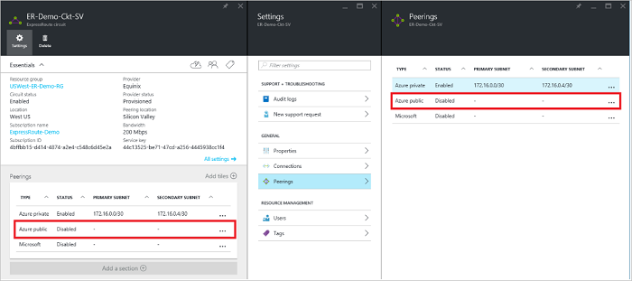
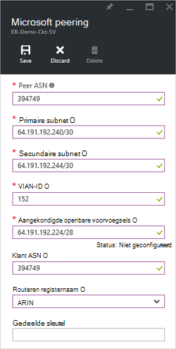

<properties
   pageTitle="Het configureren van omleiding voor een ExpressRoute circuitlijnen met behulp van de Portal Azure | Microsoft Azure"
   description="In dit artikel begeleidt u bij de stappen voor het maken en de inrichting van de privé, openbare en Microsoft peering van een circuitlijnen ExpressRoute. In dit artikel leest u ook het controleren van de status, bijwerken of verwijderen van peerings voor uw circuitlijnen."
   documentationCenter="na"
   services="expressroute"
   authors="cherylmc"
   manager="carmonm"
   editor=""
   tags="azure-resource-manager"/>
<tags
   ms.service="expressroute"
   ms.devlang="na"
   ms.topic="hero-article" 
   ms.tgt_pltfrm="na"
   ms.workload="infrastructure-services"
   ms.date="10/10/2016"
   ms.author="cherylmc"/>

# Maken en wijzigen voor een circuitlijnen ExpressRoute-mailroutering

> [AZURE.SELECTOR]
[Azure-Portal - resourcemanager](expressroute-howto-routing-portal-resource-manager.md)
[PowerShell - resourcemanager](expressroute-howto-routing-arm.md)
[PowerShell - klassiek](expressroute-howto-routing-classic.md)

In dit artikel begeleidt u bij de stappen voor het maken en beheren van de configuratie van de routering voor een ExpressRoute circuitlijnen gebruik van de Azure-portal en het implementatiemodel resourcemanager.

**Over Azure-implementatie-modellen**

[AZURE.INCLUDE [vpn-gateway-clasic-rm](../../includes/vpn-gateway-classic-rm-include.md)] 

## Vereisten voor de configuratie

- Zorg ervoor dat u de pagina [vereisten voor](expressroute-prerequisites.md) de pagina [Routering vereisten](expressroute-routing.md) en de pagina [werkstromen](expressroute-workflows.md) hebt bekeken voordat u configuratie begint.
- U moet een actieve ExpressRoute circuitlijnen hebben. Volg de instructies te [maken een circuitlijnen ExpressRoute](expressroute-howto-circuit-arm.md) en hebben de circuitlijnen ingeschakeld door uw provider connectivity voordat u verdergaat. De circuitlijnen ExpressRoute moet zich in een staat ingerichte en is ingeschakeld voor u kunnen de cmdlets hieronder beschreven.

Deze instructies zijn alleen van toepassing op circuits die zijn gemaakt met serviceproviders aanbod Layer 2 connectivity-services. Als u een serviceprovider aanbod beheerde Layer 3-services (meestal een IPVPN, zoals MPLS) gebruikt, wordt uw provider connectiviteit configureren en beheren omleiding voor u. 

>[AZURE.IMPORTANT] We doen momenteel niet geconfigureerd door serviceproviders tot en met de service-beheerportal peerings aangekondigd. We werken over het inschakelen van deze mogelijkheid binnenkort. Neem contact op met uw provider voordat u configureert BGP peerings.

U kunt een, twee of alle drie peerings (Azure privé, Azure openbaar en Microsoft) voor een circuitlijnen ExpressRoute configureren. U kunt peerings configureren in elke gewenste volgorde. Echter, moet u ervoor zorgen dat u de configuratie van elk peering tegelijk worden voltooid. 

## Azure privé peering

In deze sectie bevat instructies voor het maken, ophalen, bijwerken en verwijderen van de Azure privé peering configuratie voor een circuitlijnen ExpressRoute. 

### Azure privé peering maken

1. Configureer de circuitlijnen ExpressRoute. Zorg ervoor dat de circuitlijnen is volledig deze is ingericht door de provider connectivity voordat u verdergaat.

    

2. Configureer Azure privé peering voor de circuitlijnen. Zorg ervoor dat u de volgende items hebt voordat u met de volgende stappen verdergaat:

    - Een /30 subnet voor de primaire koppeling. Dit mag geen onderdeel van een adresruimte gereserveerd voor virtuele netwerken.
    - Een /30 subnet voor de secundaire koppeling. Dit mag geen onderdeel van een adresruimte gereserveerd voor virtuele netwerken.
    - Een geldige VLAN-ID tot stand brengen van deze peering op. Zorg ervoor dat er geen bij andere peering in de circuitlijnen gebruikmaakt van dezelfde VLAN-ID.
    - Als getal voor peering. U kunt zowel 2-byte of 4-byte als getallen. U kunt een privé als getal voor deze peering. Zorg ervoor dat u 65515 niet worden gebruikt.
    - Een MD5-hash als u ervoor kiest om een te gebruiken. **Dit is optioneel**.

3. Selecteer de Azure privé peering rij, zoals hieronder wordt weergegeven.
    
    
    

4. Configureer privé peering. De onderstaande afbeelding ziet u een configuratievoorbeeld.

    

    
5. De configuratie opslaan nadat u alle parameters hebt opgegeven. Zodra de configuratie is geaccepteerd, ziet u een vergelijkbare naar het volgende voorbeeld.

    
    

### Azure peering privégegevens weergeven

U kunt de eigenschappen van Azure privé peering door te selecteren de peering weergeven.

### Azure privé peering configuratie bij te werken

U kunt de rij voor peering selecteren en de peering eigenschappen wijzigen. 

### Azure privé peering verwijderen

U kunt uw peering configuratie verwijderen door het verwijderpictogram zoals hieronder wordt weergegeven.

## Azure openbare peering

In deze sectie bevat instructies voor het maken, ophalen, bijwerken en verwijderen van de Azure openbare peering configuratie voor een circuitlijnen ExpressRoute. 

### Azure openbare peering maken

1. ExpressRoute circuitlijnen configureren. Zorg ervoor dat de circuitlijnen is volledig deze is ingericht door de provider connectivity voordat u verdergaat verder.

    

2. Configureer Azure openbare peering voor de circuitlijnen. Zorg ervoor dat u de volgende items hebt voordat u met de volgende stappen verdergaat:

    - Een /30 subnet voor de primaire koppeling. 
    - Een /30 subnet voor de secundaire koppeling. 
    - Alle IP-adressen die worden gebruikt voor het instellen van deze peering moet geldige openbare IPv4-adressen.
    - Een geldige VLAN-ID tot stand brengen van deze peering op. Zorg ervoor dat er geen bij andere peering in de circuitlijnen gebruikmaakt van dezelfde VLAN-ID.
    - Als getal voor peering. U kunt zowel 2-byte of 4-byte als getallen.
    - Een MD5-hash als u ervoor kiest om een te gebruiken. **Dit is optioneel**.

3. Selecteer de Azure openbare peering rij, zoals hieronder wordt weergegeven.
    
    
    

4. Configureer openbare peering. De onderstaande afbeelding ziet u een configuratievoorbeeld.

    

    
5. De configuratie opslaan nadat u alle parameters hebt opgegeven. Zodra de configuratie is geaccepteerd, ziet u een vergelijkbare naar het volgende voorbeeld.

    
    

### Azure openbare peering details weergeven

U kunt de eigenschappen van Azure openbare peering door te selecteren de peering weergeven.

### Azure openbare peering configuratie bij te werken

U kunt de rij voor peering selecteren en de peering eigenschappen wijzigen. 

### Azure openbare peering verwijderen

U kunt uw peering configuratie verwijderen door het verwijderpictogram zoals hieronder wordt weergegeven.

## Microsoft peering

In deze sectie bevat instructies voor het maken, ophalen, bijwerken en verwijderen van de peering configuratie van Microsoft voor een circuitlijnen ExpressRoute. 

### Microsoft peering maken

1. ExpressRoute circuitlijnen configureren. Zorg ervoor dat de circuitlijnen is volledig deze is ingericht door de provider connectivity voordat u verdergaat verder.

    

2. Microsoft peering voor de circuitlijnen configureren. Zorg ervoor dat u hebt de volgende informatie voordat u verdergaat.

    - Een /30 subnet voor de primaire koppeling. Dit moet een geldige openbare IPv4 voorvoegsel waarvan u de eigenaar en geregistreerd in een RIR / IR.
    - Een /30 subnet voor de secundaire koppeling. Dit moet een geldige openbare IPv4 voorvoegsel waarvan u de eigenaar en geregistreerd in een RIR / IR.
    - Een geldige VLAN-ID tot stand brengen van deze peering op. Zorg ervoor dat er geen bij andere peering in de circuitlijnen gebruikmaakt van dezelfde VLAN-ID.
    - Als getal voor peering. U kunt zowel 2-byte of 4-byte als getallen.
    - **Aangekondigd voorvoegsels voor eenheden:** Een lijst met alle voorvoegsels die u van plan bent om via de sessie BGP bekend te maken, moet u opgeven. Alleen openbare IP-adresvoorvoegsels worden geaccepteerd. U kunt een door komma's gescheiden lijst verzenden als u van plan bent om te verzenden van een reeks voorvoegsels voor eenheden. Deze voorvoegsels moeten aan u zijn geregistreerd in een RIR / IR.
    - **Klant ASN:** Als u reclame voorvoegsels die niet zijn geregistreerd op de peering als getal, kunt u de AS-nummer waaraan ze zijn geregistreerd. **Dit is optioneel**.
    - **Routeren registernaam:** Kunt u de RIR / IR waarop de AS getal en voorvoegsels voor eenheden zijn geregistreerd. **Dit is optioneel.**
    - Een MD5-hash, als u ervoor kiest om een te gebruiken. **Dit is optioneel.**
    
3. U kunt de peering die u configureren wilt, zoals hieronder wordt weergegeven. Selecteer de peering rij van Microsoft.
    
    
    

4.  Configureer Microsoft peering. De onderstaande afbeelding ziet u een configuratievoorbeeld.

    

    
5. De configuratie opslaan nadat u alle parameters hebt opgegeven. 

    Als uw circuitlijnen, wordt onmiddellijk een validatie nodig staat (zoals hieronder weergegeven), moet u een ondersteuningsticket om aan te tonen dat eigendom van de voorvoegsels om ons ondersteuningsteam te openen.  
    
    

    U kunt een ondersteuningsticket rechtstreeks openen vanuit de portal zoals hieronder wordt weergegeven   
    
    

6. Zodra de configuratie is geaccepteerd, ziet u een vergelijkbare naar het volgende voorbeeld.

    
    

### Microsoft peering details weergeven

U kunt de eigenschappen van Azure openbare peering door te selecteren de peering weergeven.

### Peering configuratie van Microsoft bij te werken

U kunt de rij voor peering selecteren en de peering eigenschappen wijzigen. 

### Microsoft peering verwijderen

U kunt uw peering configuratie verwijderen door het verwijderpictogram zoals hieronder wordt weergegeven.

## Volgende stappen

Volgende stap, [koppeling een VNet naar een circuitlijnen ExpressRoute](expressroute-howto-linkvnet-arm.md).

-  Zie voor meer informatie over werkstromen voor het ExpressRoute [ExpressRoute werkstromen](expressroute-workflows.md).

-  Zie voor meer informatie over circuitlijnen peering, [ExpressRoute circuits en routeren domeinen](expressroute-circuit-peerings.md).

-  Zie voor meer informatie over het werken met virtuele netwerken [virtuele netwerk overzicht](../virtual-network/virtual-networks-overview.md).

