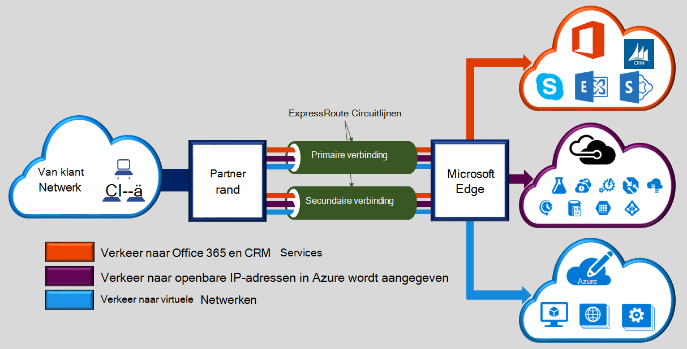
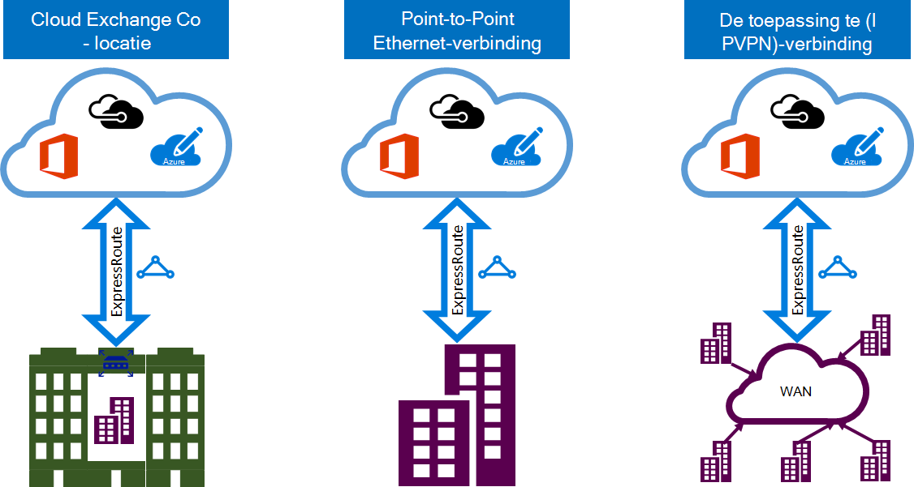

<properties 
   pageTitle="Inleiding tot ExpressRoute | Microsoft Azure"
   description="Deze pagina bevat een overzicht van de ExpressRoute-service, inclusief de werking van een verbinding ExpressRoute."
   documentationCenter="na"
   services="expressroute"
   authors="cherylmc"
   manager="carmonm"
   editor=""/>
<tags 
   ms.service="expressroute"
   ms.devlang="na"
   ms.topic="get-started-article" 
   ms.tgt_pltfrm="na"
   ms.workload="infrastructure-services" 
   ms.date="10/10/2016"
   ms.author="cherylmc"/>

# ExpressRoute technisch overzicht

Microsoft Azure ExpressRoute kunt u uw on-premises implementatie-netwerken uitbreiden naar het Microsoft cloud via een speciale privé verbinding vergemakkelijkt door een provider connectivity. U kunt verbindingen met Microsoft cloudservices, zoals Microsoft Azure, Office 365 en CRM Online tot stand te brengen met ExpressRoute. Connectiviteit kan afkomstig zijn uit een de toepassing te (VPN IP)-netwerk, een Ethernet-netwerk met een punt of een virtuele cross-verbinding via een provider connectivity in de inrichting van een collega locatie. ExpressRoute verbindingen gaan niet via de openbare Internet. Hierdoor ExpressRoute verbindingen om te bieden meer betrouwbaarheid, snellere snelheden lagere vertragingstijden en hoger beveiliging dan de normale verbindingen via Internet.

**Belangrijkste voordelen zijn:**

- Layer 3 connectiviteit tussen uw on-premises netwerk en het Microsoft Cloud via een provider connectivity. Connectiviteit kunt worden van een netwerk in de toepassing te (IPVPN), een puntverbinding Ethernet, of door een virtueel cross-verbinding via een exchange Ethernet.
- Connectiviteit met Microsoft cloudservices in alle regio's in de geopolitieke regio.
- Globale connectiviteit met Microsoft-services in alle regio's met ExpressRoute premium-invoegtoepassing.
- Een dynamische routering tussen uw netwerk en Microsoft via industriële standaard protocollen (BGP).
- Ingebouwde redundantie in elke peering locatie voor hogere betrouwbaarheid.
- Actieve verbinding tijdsduur [SLA](https://azure.microsoft.com/support/legal/sla/).
- OS en ondersteuning voor meerdere klassen van service voor speciale toepassingen, zoals Skype voor bedrijven.

Raadpleeg de [Veelgestelde vragen over ExpressRoute](expressroute-faqs.md) voor meer informatie.

## Hoe kan ik mijn netwerk verbinden met Microsoft ExpressRoute gebruiken?

U kunt een verbinding maken tussen uw on-premises netwerk en het Microsoft cloud op drie manieren:

### Kan zich bevinden op een exchange cloud

Als u zich samen op een locatie met een exchange cloud, kunt u virtuele cross-verbindingen met het Microsoft cloud tot en met de collega locatie-provider Ethernet exchange bestellen. CO locatie providers kunnen bieden Layer 2 cross-verbindingen of beheerde Layer 3 cross-verbindingen tussen de infrastructuur van uw collega locatie functie en de Microsoft-cloud.

### Point-to-Point Ethernet-verbindingen 

U kunt uw on-premises implementatie datacenters/kantoren koppelen aan de Microsoft cloud via point-to-point Ethernet koppelingen. Point-to-Point Ethernet providers Layer 2-verbindingen kunnen bieden of beheerde Layer 3-verbindingen tussen uw site en de Microsoft-cloud.

### De toepassing te (IPVPN)-netwerken te gebruiken

U kunt uw WAN integreren met de Microsoft-cloud. IPVPN providers (meestal MPLS VPN) bieden de toepassing te connectiviteit tussen uw filialen en datacenters. De Microsoft cloud kunt onderling verbonden aan uw WAN om het uiterlijk naar net als andere kantoor. WAN-providers bieden meestal beheerde Layer 3 connectivity. ExpressRoute voorzieningen en functies die zijn alle identiek op alle bovenstaande connectivity-modellen. 

Connectiviteit providers kunnen een of meer connectivity-modellen bieden. U kunt werken met uw provider connectivity moet kiezen het model dat geschikt is voor u.

## ExpressRoute functies

ExpressRoute ondersteunt de volgende functies en mogelijkheden: 

### Layer 3-connectiviteit

Microsoft gebruik industriële standaard dynamische routeren protocol (BGP) uitwisselen stuurt tussen uw on-premises netwerk, uw exemplaren in Azure wordt aangegeven en Microsoft openbare adressen.  We tot stand brengen meerdere BGP sessies met uw netwerk voor verschillende verkeer profielen. Meer informatie vindt u in het artikel [ExpressRoute circuitlijnen en de routering van domeinen](expressroute-circuit-peerings.md) .

### Redundantie

Elke circuitlijnen ExpressRoute bestaat uit twee verbindingen bij twee Microsoft Enterprise rand router (MSEEs) van de provider connectivity / uw netwerk rand. Microsoft moeten worden dubbele BGP verbinding vanuit de provider connectivity / uw kant – één tot elke MSEE. U kunt niet implementeren overtollige apparaten / Ethernet circuits aan het einde. Connectiviteit providers worden echter overtollige apparaten gebruiken om ervoor te zorgen dat uw verbindingen worden ingeleverd bij Microsoft overtollige zodanig. Een redundante Layer 3 connectivity configuratie is vereist voor onze [SLA](https://azure.microsoft.com/support/legal/sla/) geldig. 

### Connectiviteit met Microsoft cloudservices

[AZURE.INCLUDE [expressroute-office365-include](../../includes/expressroute-office365-include.md)]

ExpressRoute verbindingen u toegang tot de volgende services:

- Microsoft Azure-services
- Microsoft Office 365-services
- Microsoft CRM Online services 
 
U kunt de pagina [Veelgestelde vragen over ExpressRoute](expressroute-faqs.md) voor een gedetailleerde lijst met services ondersteund via ExpressRoute bezoeken.

### Connectiviteit met alle regio's binnen een geopolitieke gebied

U kunt verbinding maken met Microsoft op een van onze [peering locaties](expressroute-locations.md) en toegang hebben tot alle regio's binnen de geopolitieke regio. 

Als u met Microsoft in Amsterdam tot en met ExpressRoute verbonden, hebt u bijvoorbeeld toegang tot alle Microsoft cloudservices gehost in Noord-Europa en West-Europa. Raadpleeg het artikel [ExpressRoute partners en peering locaties](expressroute-locations.md) voor een overzicht van de geopolitieke regio's, Microsoft cloud-regio's gekoppeld en bijbehorende ExpressRoute peering locaties.

### Globale-connectiviteit met ExpressRoute premium-invoegtoepassing

U kunt de functie ExpressRoute premium invoegtoepassing om uit te breiden connectivity geopolitieke grenzen inschakelen. Bijvoorbeeld, als er verbinding is met Microsoft in Amsterdam tot en met ExpressRoute, hebt u toegang tot alle Microsoft cloudservices gehost in alle regio's kant van de wereld zitten (nationale wolken worden niet opgenomen). U kunt de services die zijn geïmplementeerd in Zuid-Amerika of Australië dezelfde manier als u toegang hebt tot de regio Noord- en West Europe's openen.

### RTF-connectiviteit partner-systeem

ExpressRoute heeft een voortdurend groeiende selectie aan connectivity providers en SI partners. U kunt verwijzen naar het artikel [ExpressRoute providers en locaties](expressroute-locations.md) voor de meest recente gegevens.

### Connectiviteit met nationale wolken

Microsoft werkt geïsoleerd cloud omgevingen voor speciale geopolitieke regio's en klantsegmenten. Verwijzen naar de pagina [ExpressRoute providers en locaties](expressroute-locations.md) voor een lijst met nationale wolken en providers.

### Ondersteunde bandbreedte opties

U kunt de stroom ExpressRoute voor een groot aantal bandbreedte kopen. Hieronder ziet u de lijst met ondersteunde bandbreedte. Zorg ervoor dat u Neem contact op met uw provider connectivity om te bepalen de lijst met ondersteunde bandbreedte die ze bieden.

- 50 Mbps
- 100 Mbps
- 200 Mbps
- 500 Mbps
- 1 GB/s
- 2 GB/s
- 5 GB/s
- 10 GB/s

### Dynamische schaalbaarheid van de bandbreedte

U hebt de mogelijkheid om uit te breiden de bandbreedte ExpressRoute circuitlijnen (op beste planning op basis van) zonder dat u moet uw verbindingen verwijderen. 

### Flexibele facturering modellen

U kunt een factureringsbeheerder model dat geschikt is voor u kunt kiezen. Kies tussen de facturering modellen onderstaande. Verwijzen naar de pagina [ExpressRoute Veelgestelde vragen](expressroute-faqs.md) voor meer informatie. 

- **Onbeperkt gegevens**. De circuitlijnen ExpressRoute in rekening wordt gebracht op basis van maandelijkse kosten in rekening en alle inkomende en uitgaande gegevens doorverbinden is opgenomen gratis gratis. 
- **Gebruik gegevens**. De circuitlijnen ExpressRoute is BTW geheven op basis van maandelijkse kosten in rekening. Alle inkomende gegevens oproepdoorschakeling is gratis. Uitgaande gegevens doorverbinden per GB overdragen van gegevens in rekening wordt gebracht. Gegevens doorverbinden tarieven verschillen per regio.
- **ExpressRoute premium-invoegtoepassing**. De premium ExpressRoute is een invoegtoepassing via de circuitlijnen ExpressRoute. De premium-invoegtoepassing ExpressRoute biedt de volgende mogelijkheden: 
    - Verbeterde route-limieten voor Azure openbare en Azure privé peering uit 4000 routes naar 10.000 routes.
    - Globale connectiviteit voor services. Een ExpressRoute circuitlijnen gemaakt in een gebied (exclusief nationale wolken) hebben toegang tot de resources in een andere regio in de wereld. Bijvoorbeeld, zijn een virtueel netwerk gemaakt in West Europa toegankelijk via een ExpressRoute circuitlijnen deze is ingericht in Silicon Valley.
    - Verbeterde aantal VNet koppelingen per ExpressRoute circuitlijnen van 10 voor een grotere, afhankelijk van de bandbreedte van de circuitlijnen.

## Volgende stappen

- Meer informatie over ExpressRoute verbindingen en routeren domeinen. Zie [ExpressRoute circuits en routeren domeinen](expressroute-circuit-peerings.md).
- Zoek een serviceprovider. Zie [ExpressRoute partners en peering locaties](expressroute-locations.md).
- Zorg ervoor dat alle voorwaarden wordt voldaan. Zie [ExpressRoute vereisten](expressroute-prerequisites.md).
- Raadpleeg de vereisten voor de [Routering](expressroute-routing.md), [NAT](expressroute-nat.md) en [QoS](expressroute-qos.md).
- Configureer uw verbinding ExpressRoute.
    - [ExpressRoute circuits maken](expressroute-howto-circuit-classic.md)
    - [Routering configureren](expressroute-howto-routing-classic.md)
    - [Een VNet koppelen aan een circuitlijnen ExpressRoute](expressroute-howto-linkvnet-classic.md)
