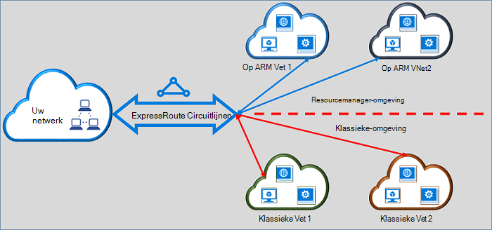

<properties
   pageTitle="ExpressRoute circuits verplaatsen van klassiek naar resourcemanager | Microsoft Azure"
   description="Deze pagina bevat een overzicht van wat u weten moet over bruggen het klassieke en de resourcemanager implementatiemodellen."
   documentationCenter="na"
   services="expressroute"
   authors="ganesr"
   manager="carmonm"
   editor=""/>
<tags
   ms.service="expressroute"
   ms.devlang="na"
   ms.topic="get-started-article"
   ms.tgt_pltfrm="na"
   ms.workload="infrastructure-services"
   ms.date="10/10/2016"
   ms.author="ganesr"/>

# ExpressRoute circuits uit het klassieke verplaatsen naar het implementatiemodel resourcemanager

Dit artikel bevat een overzicht van wat betekent dit een circuitlijnen Azure ExpressRoute verplaatsen van het klassieke naar het implementatiemodel resourcemanager Azure.

[AZURE.INCLUDE [vpn-gateway-sm-rm](../../includes/vpn-gateway-classic-rm-include.md)]

U kunt een enkel ExpressRoute circuitlijnen verbinding maken met virtuele netwerken die zijn geïmplementeerd zowel in de klassieke en de resourcemanager implementatiemodellen. Een circuitlijnen ExpressRoute, ongeacht hoe deze is gemaakt, kunt nu een koppeling naar virtuele netwerken tussen beide implementatiemodellen.

## ExpressRoute circuits die zijn gemaakt in het implementatiemodel klassieke

ExpressRoute circuits die zijn gemaakt in het implementatiemodel klassieke moeten worden verplaatst naar het implementatiemodel resourcemanager eerst voor verbindingen met het klassieke zowel de resourcemanager implementatiemodellen. Is er connectivity verlies of verstoringen niet wanneer een verbinding wordt verplaatst. Alle circuitlijnen en de virtuele netwerk koppelingen in het implementatiemodel klassieke (binnen dezelfde abonnement en cross-abonnement) worden bewaard.

Nadat de overstap is voltooid, de circuitlijnen ExpressRoute ziet er worden uitgevoerd en exact iets aan een ExpressRoute circuitlijnen die is gemaakt in het implementatiemodel resourcemanager. U kunt nu verbindingen met virtuele netwerken maken in het implementatiemodel resourcemanager.

Na een ExpressRoute is circuitlijnen verplaatst naar het resourcemanager implementatiemodel, kunt u de levenscyclus van de circuitlijnen ExpressRoute alleen met behulp van het implementatiemodel resourcemanager-beheren. Dit betekent dat u bewerkingen, bijvoorbeeld peerings toevoegen/bijwerken/verwijderen, uitvoeren kunt circuitlijnen eigenschappen (zoals bandbreedte, SKU en facturering type) bijwerken en verwijderen van circuits alleen in het implementatiemodel resourcemanager. Raadpleeg de sectie onder op circuits die zijn gemaakt in het implementatiemodel resourcemanager voor meer informatie over hoe u toegang tot beide implementatiemodellen kan beheren.

U hoeft niet te gebruikmaakt van uw provider connectivity om uit te voeren verplaatsen.

## ExpressRoute circuits die zijn gemaakt in het implementatiemodel resourcemanager

ExpressRoute circuits die zijn gemaakt in het implementatiemodel resourcemanager toegankelijk beide implementatiemodellen, kunt u ook weer inschakelen. Een circuitlijnen ExpressRoute in uw abonnement kan worden ingeschakeld voor zijn toegankelijk vanaf beide implementatiemodellen.

- ExpressRoute circuits die zijn gemaakt in het implementatiemodel resourcemanager geen toegang tot het objectmodel klassieke implementatie heeft al dan niet standaard.
- ExpressRoute circuits die uit het implementatiemodel klassieke zijn verplaatst naar de Resource manager implementatie-model zijn toegankelijk vanaf beide implementatiemodellen al dan niet standaard.
- Een circuitlijnen ExpressRoute heeft altijd toegang tot de resourcemanager implementatiemodel, ongeacht of deze is gemaakt in bronbeheer of klassieke implementatie. Dit betekent dat u verbindingen met virtuele netwerken die zijn gemaakt in het implementatiemodel resourcemanager door de instructies te volgen voor [het koppelen van virtuele netwerken](expressroute-howto-linkvnet-arm.md)kunt maken.
- Toegang tot het objectmodel klassieke implementatie wordt bepaald door de parameter **allowClassicOperations** in de circuitlijnen ExpressRoute.

>[AZURE.IMPORTANT] Alle quota's die worden beschreven op de pagina [service limieten](../azure-subscription-service-limits.md) toepassen. Als u bijvoorbeeld wel een standaard circuitlijnen verschillende mogelijk maximaal 10 virtuele koppelingen/netwerkverbindingen het klassieke zowel de resourcemanager implementatiemodellen.

## Toegang tot het implementatiemodel klassieke beheren

U kunt een enkel ExpressRoute circuitlijnen om de koppeling naar virtuele netwerken in beide implementatiemodellen door in te stellen van de parameter **allowClassicOperations** van de circuitlijnen ExpressRoute inschakelen.

Als u **allowClassicOperations** op TRUE, kunt u virtuele netwerken van beide implementatiemodellen van naar de circuitlijnen ExpressRoute koppelen. U kunt met de volgende richtlijnen voor [het koppelen van virtuele netwerken in het implementatiemodel klassieke](expressroute-howto-linkvnet-classic.md)koppelen aan virtuele netwerken in het implementatiemodel klassieke. U kunt met volgen richtlijnen voor [het koppelen van virtuele netwerken in het implementatiemodel resourcemanager](expressroute-howto-linkvnet-arm.md)koppelen aan virtuele netwerken in het implementatiemodel resourcemanager.

Instelling **allowClassicOperations** voor ONWAAR blokkeert de toegang tot de circuitlijnen uit het implementatiemodel klassieke. Maar blijven alle virtueel netwerk koppelingen in het implementatiemodel klassieke behouden. In dit geval is de circuitlijnen ExpressRoute niet zichtbaar in het implementatiemodel klassieke.

## Ondersteunde bewerkingen in het implementatiemodel klassieke

De volgende klassieke bewerkingen worden ondersteund in een circuitlijnen ExpressRoute wanneer **allowClassicOperations** is ingesteld op waar:

 - ExpressRoute circuitlijnen informatie vinden
 - Virtuele maken/bijwerken/get/verwijderen netwerkkoppelingen naar klassieke virtuele netwerken
 - Virtuele netwerk maken/bijwerken/get/verwijderen koppeling vergunningen voor cross-abonnement connectivity

U kunt de volgende klassieke bewerkingen niet uitvoeren wanneer **allowClassicOperations** is ingesteld op waar:

 - Maken, bijwerken of get/verwijderen rand Gateway Protocol (BGP) peerings voor Azure privé, Azure openbare en Microsoft peerings
 - ExpressRoute circuits verwijderen

## Communicatie tussen het klassieke en de resourcemanager implementatiemodellen

De circuitlijnen ExpressRoute fungeert als een brug tussen het klassieke en de resourcemanager implementatiemodellen. Verkeer tussen virtual machines in virtuele netwerken in het implementatiemodel klassieke en die in de virtuele netwerken in de resourcemanager implementatie model loopt tot en met ExpressRoute als beide virtuele netwerken zijn gekoppeld aan de dezelfde ExpressRoute circuitlijnen.

Geaggregeerde doorvoer wordt beperkt door de doorvoercapaciteit van de gateway virtueel netwerk. Verkeer heeft geen van de provider connectivity-netwerken te gebruiken of uw netwerken in dat geval invoert. Netwerkverkeer tussen de virtuele netwerken zich volledig in het Microsoft-netwerk.

## Toegang tot Azure openbare en Microsoft peering resources

U kunt toegang krijgen tot bronnen die meestal toegankelijk zijn via Azure openbare peering en Microsoft peering zonder eventuele verstoring blijven.  

## Functies die worden ondersteund

In deze sectie worden beschreven wat wordt ondersteund voor ExpressRoute circuits:

 - U kunt een enkel ExpressRoute circuitlijnen gebruiken voor toegang tot virtuele netwerken die zijn geïmplementeerd in de klassieke en de resourcemanager implementatiemodellen.
 - U kunt een circuitlijnen ExpressRoute verplaatsen uit het klassieke aan het implementatiemodel resourcemanager. Nadat deze is verplaatst, de circuitlijnen ExpressRoute ziet er lijkt en zoals elke andere ExpressRoute circuitlijnen die is gemaakt in het implementatiemodel resourcemanager-uitvoert.
 - U kunt alleen de circuitlijnen ExpressRoute verplaatsen. Circuitlijnen koppelingen, virtuele netwerken en VPN gateways kunnen niet worden verplaatst door deze bewerking.
 - Na een ExpressRoute is circuitlijnen verplaatst naar het resourcemanager implementatiemodel, kunt u de levenscyclus van de circuitlijnen ExpressRoute alleen met behulp van het implementatiemodel resourcemanager-beheren. Dit betekent dat u bewerkingen, bijvoorbeeld peerings toevoegen/bijwerken/verwijderen, uitvoeren kunt circuitlijnen eigenschappen (zoals bandbreedte, SKU en facturering type) bijwerken en verwijderen van circuits alleen in het implementatiemodel resourcemanager.
 - De circuitlijnen ExpressRoute fungeert als een brug tussen het klassieke en de resourcemanager implementatiemodellen. Verkeer tussen virtual machines in virtuele netwerken in het implementatiemodel klassieke en die in de virtuele netwerken in de resourcemanager implementatie model loopt tot en met ExpressRoute als beide virtuele netwerken zijn gekoppeld aan de dezelfde ExpressRoute circuitlijnen.
 - Cross-abonnement connectivity wordt ondersteund in de klassieke zowel de resourcemanager implementatiemodellen.

## Wat wordt niet ondersteund

In deze sectie worden beschreven wat wordt niet ondersteund voor ExpressRoute circuits:

 - Zwevend circuitlijnen koppelingen, gateways en virtuele netwerken uit het klassieke aan het implementatiemodel resourcemanager.
 - Het beheren van de levenscyclus van een circuitlijnen ExpressRoute uit het implementatiemodel klassieke.
 - Rolgebaseerd Access besturingselement (RBAC) ondersteuning voor het implementatiemodel klassieke. U kunt een circuitlijnen RBAC besturingselementen niet uitvoeren in het implementatiemodel klassieke. Een beheerder/coadministrator van het abonnement kunt koppelen of ontkoppelen van virtuele netwerken naar de circuitlijnen.

## Configuratie

Volg de instructies die worden beschreven in het [verplaatsen van een circuitlijnen ExpressRoute uit het klassieke aan het implementatiemodel resourcemanager](expressroute-howto-move-arm.md).

## Volgende stappen

- Zie [ExpressRoute circuitlijnen inrichting werkstromen en circuitlijnen Staten](expressroute-workflows.md)voor werkstroomgegevens.
- Configureer de verbinding ExpressRoute:

    - [ExpressRoute circuits maken](expressroute-howto-circuit-arm.md)
    - [Routering configureren](expressroute-howto-routing-arm.md)
    - [Een virtueel netwerk koppelen aan een circuitlijnen ExpressRoute](expressroute-howto-linkvnet-arm.md)
