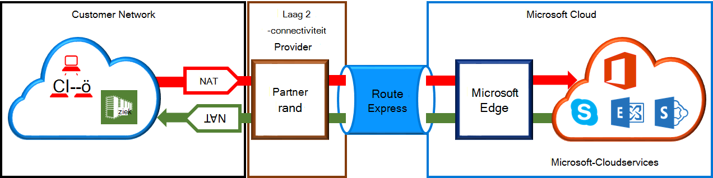

<properties
   pageTitle="NAT vereisten voor ExpressRoute circuits | Microsoft Azure"
   description="Deze pagina vindt gedetailleerde vereisten voor het configureren en beheren van NAT voor ExpressRoute circuits."
   documentationCenter="na"
   services="expressroute"
   authors="cherylmc"
   manager="carmonm"
   editor=""/>
<tags
   ms.service="expressroute"
   ms.devlang="na"
   ms.topic="get-started-article"
   ms.tgt_pltfrm="na"
   ms.workload="infrastructure-services"
   ms.date="10/10/2016"
   ms.author="cherylmc"/>

# ExpressRoute NAT vereisten

Als u wilt verbinden met Microsoft cloudservices ExpressRoute gebruiken, moet u instellen en beheren van NAT's. Sommige connectivity-providers bieden deze instellen en beheren van NAT als beheerde service. Neem contact op met uw provider connectivity om te zien als ze deze dienst bieden. Als dat niet zo is, u moet voldoen aan de vereisten die hieronder beschreven. 

Bekijk de pagina [ExpressRoute circuits en routeren domeinen](expressroute-circuit-peerings.md) voor een overzicht van de domeinen van de verschillende routeren. Om te voldoen aan de openbare IP-adres van openbare Azure en Microsoft peering, is het raadzaam dat u NAT tussen uw netwerk en Microsoft instelt. Deze sectie bevat een gedetailleerde beschrijving van de NAT-infrastructuur die u nodig hebt om in te stellen.

## NAT-vereisten voor Azure openbare peering

Het Azure openbare peering pad kunt u verbinding maken met alle services gehost in Azure wordt aangegeven via de openbare IP-adressen. Hierbij services weergegeven in de [Veelgestelde vragen over ExpessRoute](expressroute-faqs.md) en alle services die worden gehost door ISV's op Microsoft Azure. Connectiviteit met Microsoft Azure-services op openbare peering wordt altijd vanaf uw netwerk bij het Microsoft-netwerk gestart. Verkeer Microsoft Azure op openbare peering moet SNATed naar geldige openbare IPv4-adressen voordat ze deelnemen aan het Microsoft-netwerk. De onderstaande afbeelding biedt een hoog niveau afbeelding van hoe de NAT kan worden ingesteld voor de bovenstaande vereiste vergaderen.

 

### NAT IP-toepassingen en route advertenties

Moet u ervoor zorgen dat verkeer is worden gebruikt voor het invoeren van de Azure openbare peering pad met geldige openbare IPv4-adres. Microsoft moet kunnen zijn voor het valideren van het eigendom van de groep NAT IPv4-adressen tegen een regionale routeren Internet register (RIR) of een Internet routeren register (IR). Een selectievakje wordt uitgevoerd op basis van de AS-nummer wordt peered met en het IP-adressen gebruikt voor het apparaat. Verwijzen naar de pagina [ExpressRoute routeren vereisten](expressroute-routing.md) voor meer informatie over de routering registervermeldingen.
 
Er zijn geen beperkingen van de lengte van het NAT IP-voorvoegsel via deze peering. U moet controleren van de NAT-toepassingen en zorg ervoor dat u niet van NAT-sessies zijn gezet.

>[AZURE.IMPORTANT] De NAT IP-toepassingen aangekondigd naar Microsoft moet niet aangekondigd met Internet. Hiermee worden afgebroken connectiviteit met andere services van Microsoft.

## NAT-vereisten voor Microsoft peering

Het Microsoft peering pad kunt u verbinding maken met Microsoft-cloudservices die niet worden ondersteund door het Azure openbare peering pad. De lijst met services bevat Office 365-services, zoals Exchange Online, SharePoint Online, Skype voor bedrijven en CRM Online. Microsoft verwacht ter ondersteuning van bidirectionele verbindingen op de Microsoft-peering. Microsoft-cloudservices verkeer moet SNATed naar geldige openbare IPv4-adressen voordat ze deelnemen aan het Microsoft-netwerk. Verkeer naar uw netwerk van Microsoft-cloudservices moet SNATed voordat ze deelnemen aan het netwerk. De onderstaande afbeelding biedt een hoog niveau afbeelding van hoe de NAT setup voor Microsoft peering moet worden.
 
 

#### Verkeer die afkomstig zijn van uw netwerk bestemd naar Microsoft

- Moet u ervoor zorgen dat verkeer is worden gebruikt voor het invoeren van het Microsoft peering pad met een geldig openbaar IPv4-adres. Microsoft moet kunnen zijn voor het valideren van de eigenaar van de groep NAT IPv4-adressen ten opzichte van het regionale routeren internet register (RIR) of een internet routeren register (IR). Een selectievakje wordt uitgevoerd op basis van de AS-nummer wordt peered met en het IP-adressen die wordt gebruikt voor apparaat. Verwijzen naar de pagina [ExpressRoute routeren vereisten](expressroute-routing.md) voor meer informatie over de routering registervermeldingen.

- IP-adressen die wordt gebruikt voor het Azure openbare peering installatie en andere circuits ExpressRoute moeten niet aangekondigd naar Microsoft via de sessie BGP. Er is geen beperking voor de lengte van het NAT IP-voorvoegsel via deze peering.

    >[AZURE.IMPORTANT] De NAT IP-toepassingen aangekondigd naar Microsoft moet niet aangekondigd met Internet. Hiermee worden afgebroken connectiviteit met andere services van Microsoft.

#### Verkeer die afkomstig zijn van Microsoft bestemd is voor uw netwerk

- Bepaalde scenario's is Microsoft om te starten connectiviteit met service-eindpunten gehost binnen uw netwerk vereist. Een typisch voorbeeld van het scenario is connectiviteit met ADFS-servers in uw netwerk uit Office 365 gehost. In dat geval moet u juiste voorvoegsels lekken vanuit uw netwerk in de Microsoft-peering. 

- U moet SNAT verkeer IP-adressen binnen het netwerk van Microsoft. 

## Volgende stappen

- Raadpleeg de vereisten voor de [Routering](expressroute-routing.md) en [QoS](expressroute-qos.md).
- Zie [ExpressRoute circuitlijnen inrichting werkstromen en circuitlijnen Staten](expressroute-workflows.md)voor werkstroomgegevens.
- Configureer uw verbinding ExpressRoute.

    - [ExpressRoute circuits maken](expressroute-howto-circuit-classic.md)
    - [Routering configureren](expressroute-howto-routing-classic.md)
    - [Een VNet koppelen aan een circuitlijnen ExpressRoute](expressroute-howto-linkvnet-classic.md)

