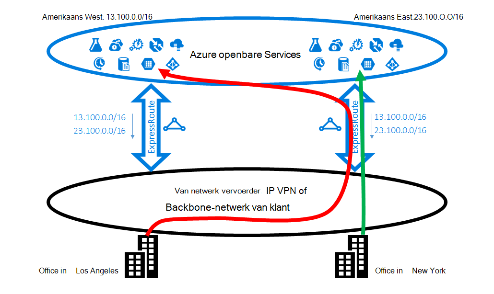
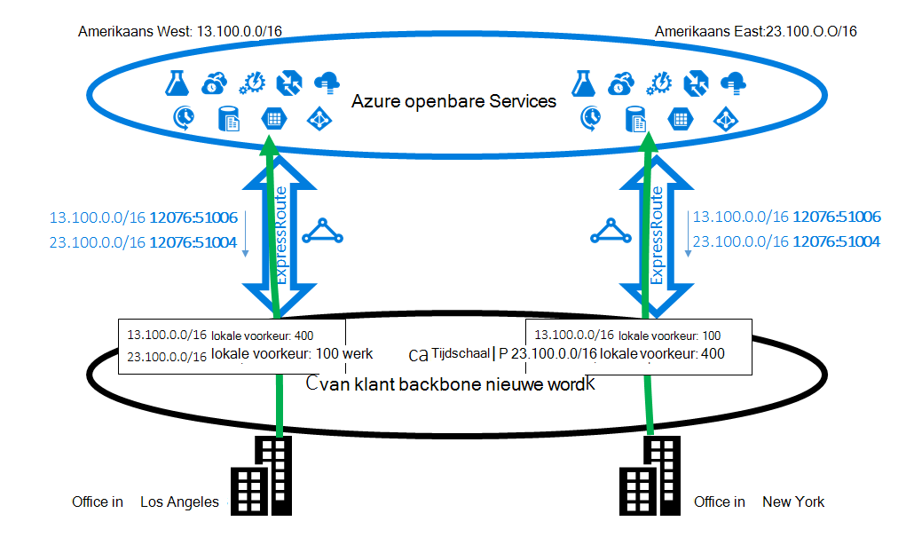
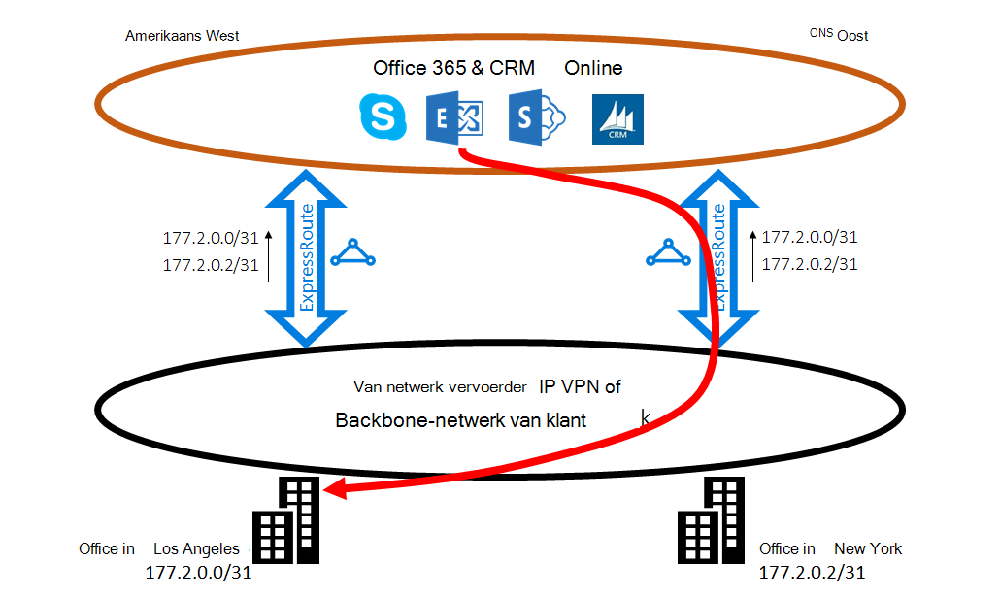
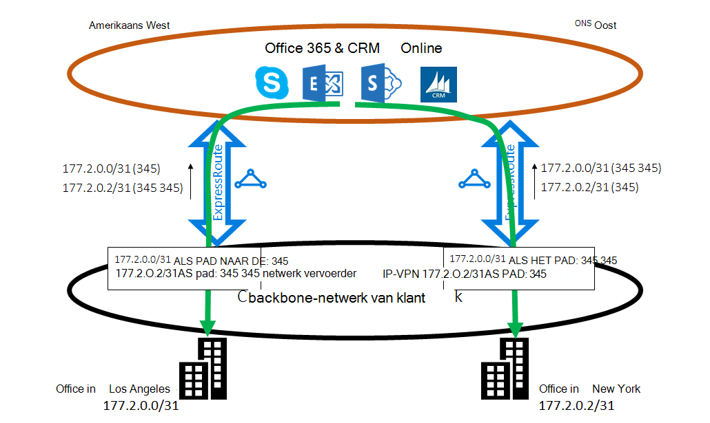

<properties
   pageTitle="Optimaliseren ExpressRoute routering | Microsoft Azure"
   description="Deze pagina bevat informatie over de routering wanneer een klant heeft meer dan één ExpressRoute circuits die verbinding tussen Microsoft en van de klant corp netwerk maken optimaliseren."
   documentationCenter="na"
   services="expressroute"
   authors="charwen"
   manager="carmonm"
   editor=""/>
<tags
   ms.service="expressroute"
   ms.devlang="na"
   ms.topic="get-started-article"
   ms.tgt_pltfrm="na"
   ms.workload="infrastructure-services"
   ms.date="10/10/2016"
   ms.author="charwen"/>

# ExpressRoute routering optimaliseren
Wanneer u meerdere ExpressRoute circuits hebt, hebt u meer dan één pad naar het verbinding maken met Microsoft. Hierdoor optimale routering kan optreden - dat wil zeggen het verkeer duurt langer pad naar het Microsoft en Microsoft met uw netwerk hebt bereikt. Hoe langer het netwerkpad, des te groter het latentie. Latentie heeft directe gevolgen voor de toepassing prestaties en gebruiker ervaring. In dit artikel wordt dit probleem illustreren en wordt uitgelegd hoe u optimaliseren omleiding van de standaard routeren technologieën gebruiken.

## Niet-optimale routeren hoofdletters/kleine letters 1
We even verder kijken bij een probleem met de routering sluiten door een voorbeeld. Stel dat u hebt twee kantoren in de VS, een in Los Angeles en één in New York. Uw kantoren zijn verbonden op een gebied WAN (Wide Network), die op uw eigen backbone-netwerk of uw provider IP VPN kan zijn. U hebt twee ExpressRoute circuits, een in ons West en een in ons Oost, die ook in de WAN verbonden zijn. Duidelijk, hebt u twee paden verbinding maken met het Microsoft-netwerk. Nu Stel u Azure-implementatie (bijvoorbeeld Azure App Service) in zowel ons West en ons Oost hebt. Uw bedoeling is te verbinden met uw gebruikers in Los Angeles Azure ons West en uw gebruikers in New York naar Azure ons Oost omdat uw servicebeheerder worden dat gebruikers in elke office toegang de in de buurt Azure services voor een optimale ervaring tot. Het abonnement werkt helaas goed voor de gebruikers oostkust maar niet voor de gebruikers westen. De oorzaak van het probleem is het volgende. Klik op elke circuitlijnen ExpressRoute we reclame maken voor u zowel het voorvoegsel in Azure ons Oost (23.100.0.0/16) als het voorvoegsel in Azure ons West (13.100.0.0/16). Als u niet welke voorvoegsel afkomstig is van welke regio weet, bent u niet anders toepassen. Uw WAN-netwerk denkt misschien beide van de voorvoegsels zich het dichtst bij ons Oost dan ons West en kunnen daarom beide office-gebruikers doorsturen naar de circuitlijnen ExpressRoute in ons Oost. In het einde hebt u veel ontevreden gebruikers in de office Los Angeles.

### Oplossing: gebruik BGP community 's
Als u wilt optimaliseren omleiding voor beide office-gebruikers, moet u weet welke voorvoegsel van Azure ons West en die afkomstig is van Azure ons Oost. We coderen deze informatie met behulp van [de Community BGP waarden](expressroute-routing.md). We hebt een unieke BGP Community-waarde aan elke Azure regio, bijvoorbeeld "12076:51004" voor ons Oost, "12076:51006" voor ons West toegewezen. Als u weet welke voorvoegsel afkomstig is van welke Azure regio, kunt u welke circuitlijnen ExpressRoute moet voorkeur kunt configureren. Omdat we de BGP gebruiken om te routeren info van exchange, kunt u de BGP lokale voorkeur te beïnvloeden routering. In ons voorbeeld kunt u een hogere voorkeurswaarde in de lokale naar 13.100.0.0/16 in ons West dan in ons Oosten en daarnaast een hogere voorkeurswaarde in de lokale toewijzen aan 23.100.0.0/16 in ons Oost dan in ons westen. Deze configuratie zorgt ervoor dat wanneer beide paden naar Microsoft beschikbaar zijn, uw gebruikers in Los Angeles het circuitlijnen ExpressRoute in ons westen verbinding maken met Azure ons West duurt dat uw gebruikers in New York duren voordat de ExpressRoute in ons Oost Azure ons Oost zijn. Routering is geoptimaliseerd op beide zijden. 

## Niet-optimale routeren hoofdletters/kleine letters 2
Hier ziet u een ander voorbeeld wanneer de langer pad naar uw netwerk hebt bereikt voor het maken van verbindingen van Microsoft. In dit geval u lokale Exchange-servers en Exchange Online gebruiken in een [hybride omgeving](https://technet.microsoft.com/library/jj200581%28v=exchg.150%29.aspx). Uw kantoren zijn verbonden met een WAN. U weergeven de voorvoegsels van uw on-premises implementatie-servers in beide uw kantoren naar Microsoft tot en met de twee ExpressRoute circuits. Exchange Online initiëren verbindingen met de servers on-premises implementatie in gevallen zoals migratie van postvakken. Helaas kunt wordt de verbinding met uw office Los Angeles doorgestuurd naar de circuitlijnen ExpressRoute in ons Oost voordat u de hele continent terug bladeren naar het westen. De oorzaak van het probleem is vergelijkbaar met de eerste fase. Het Microsoft-netwerk kan niet zonder een tip bepalen welke voorvoegsel klant lijkt op ons Oosten en welke dicht bij ons West is. Dit gebeurt er als volgt te werk van het verkeerde pad naar uw office in Los Angeles.

### Oplossing: gebruik als pad prepending
Er zijn twee oplossingen voor het probleem. De eerste fase is dat u gewoon uw on-premises implementatie voorvoegsel voor uw office Los Angeles, 177.2.0.0/31, klik op de circuitlijnen ExpressRoute in ons West weergeven en uw on-premises aanduiding voor uw office New York, 177.2.0.2/31, klik op de circuitlijnen ExpressRoute in ons Oost. Hierdoor is er slechts één pad voor Microsoft verbinding maken met elk van uw kantoren. Er is geen dubbelzinnigheden en routering is geoptimaliseerd. Met dit ontwerp moet u uw strategie failover nadenken. In het geval dat het pad naar Microsoft via een ExpressRoute niet meer werkt, moet u zorgen dat Exchange Online nog steeds verbinding met uw on-premises implementatie-servers maken kan. 

De tweede oplossing is dat u blijven reclame maken voor beide van de voorvoegsels op beide ExpressRoute circuits en bovendien geeft u ons een tip van welke voorvoegsel lijkt op waarvoor een van uw kantoren. Omdat we BGP als pad prepending wordt ondersteund, kunt u het pad als voor uw voorvoegsel beïnvloeden routering kunt configureren. In dit voorbeeld kunt u het pad als voor 172.2.0.0/31 in ons Oost verlengen, zodat we de circuitlijnen ExpressRoute in ons westen voor verkeer voor dit voorvoegsel (zoals ons netwerk denkt het pad naar dit voorvoegsel korter in het westen dat wordt) wordt liever. U kunt ook het pad als voor 172.2.0.2/31 in ons West verlengen zodat we de circuitlijnen ExpressRoute in ons Oost wordt liever. Routering is geoptimaliseerd voor beide kantoren. Met dit ontwerp als één ExpressRoute circuitlijnen verbroken wordt, Exchange Online nog steeds bereikbaar via een andere ExpressRoute circuitlijnen en uw WAN. 

>[AZURE.IMPORTANT] We verwijderen privé als getallen in het pad als voor de voorvoegsels op Microsoft Peering hebt ontvangen. U moet toevoegen openbare als getallen in het pad als te beïnvloeden omleiding voor Microsoft Peering.

>[AZURE.IMPORTANT] Hoewel de hier opgegeven voorbeelden voor Microsoft en openbare peerings zijn, ondersteunen we dezelfde mogelijkheden voor het persoonlijke peering. Het pad als prepending werkt ook, binnen één enkele ExpressRoute circuitlijnen, de selectie van de primaire en secundaire paden beïnvloeden.
