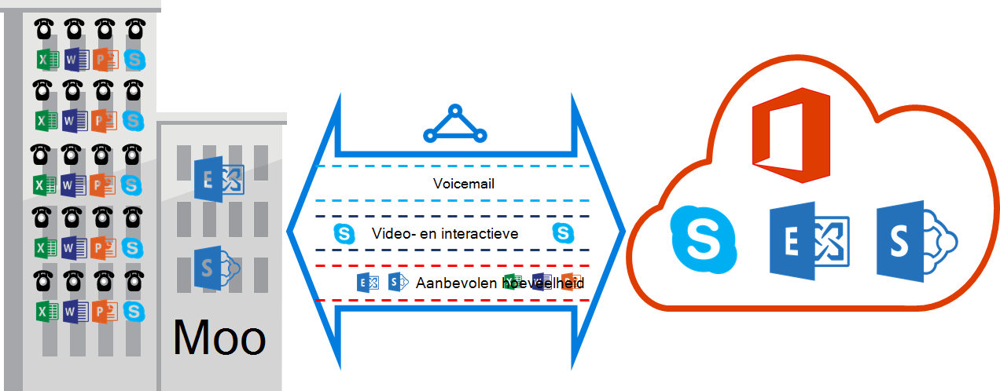

<properties
   pageTitle="QoS vereisten voor ExpressRoute | Microsoft Azure"
   description="Deze pagina vindt gedetailleerde vereisten voor het configureren en beheren van QoS voor ExpressRoute circuits."
   documentationCenter="na"
   services="expressroute"
   authors="cherylmc"
   manager="carmonm"
   editor=""/>
<tags
   ms.service="expressroute"
   ms.devlang="na"
   ms.topic="get-started-article"
   ms.tgt_pltfrm="na"
   ms.workload="infrastructure-services"
   ms.date="10/10/2016"
   ms.author="cherylmc"/>

# ExpressRoute QoS vereisten

Skype voor bedrijven heeft verschillende werkbelasting waarvoor gesplitste QoS behandeling. Als u van plan bent voice-services via ExpressRoute in beslag neemt, moet u voldoen aan de vereisten die hieronder beschreven.

>[AZURE.NOTE] QoS vereisten toepassen op de Microsoft alleen peering. De DSCP-waarden in het netwerkverkeer ontvangen op Azure openbare peering en Azure privé peering worden ingesteld op 0. 

De volgende tabel vindt u een lijst DSCP markeringen die worden gebruikt door Skype voor bedrijven. Raadpleeg [QoS beheren voor Skype voor bedrijven](https://technet.microsoft.com/library/gg405409.aspx) voor meer informatie.

| **Verkeer Class** | **Behandeling (DSCP markering)** | **Skype voor bedrijven-werkbelastingen** |
|---|---|---|
| **Voicemail** | EF (46) | Skype / Lync voice |
| **Interactieve** | AF41 (34) | Video |
|   | AF21 (18) | Apps delen | 
| **Standaard** | AF11 (10) | Bestandsoverdracht|
|   | CS0 (0) | Nog iets| 

- U moet de werkbelasting classificeren en past u de juiste DSCP-waarden. Ga als volgt de richtlijnen [hier](https://technet.microsoft.com/library/gg405409.aspx) over het instellen van DSCP markeringen in uw netwerk.

- U moet configureren en ondersteuning voor meerdere QoS wachtrijen binnen uw netwerk. Voicemail moet een zelfstandige klasse en de EF behandeling dat is opgegeven in RFC 3246 ontvangt. 

- U kunt de wachtrijmechanisme, overbelasting detectie beleid en bandbreedtetoewijzing per verkeer class bepalen. Maar de DSCP-markering voor Skype voor bedrijven-werkbelastingen moet worden behouden. Als u werkt met DSCP markeringen niet wordt weergegeven, bijvoorbeeld AF31 (26), moet u deze waarde DSCP 0 herschrijven voordat het pakket naar Microsoft verzonden. Microsoft stuurt alleen pakketten die zijn gemarkeerd met de DSCP-waarde in de bovenstaande tabel weergegeven. 

## Volgende stappen

- Raadpleeg de vereisten voor de [Routering](expressroute-routing.md) en [NAT](expressroute-nat.md).
- Zie de volgende koppelingen om uw verbinding ExpressRoute te configureren.

    - [ExpressRoute circuits maken](expressroute-howto-circuit-classic.md)
    - [Routering configureren](expressroute-howto-routing-classic.md)
    - [Een VNet koppelen aan een circuitlijnen ExpressRoute](expressroute-howto-linkvnet-classic.md)
