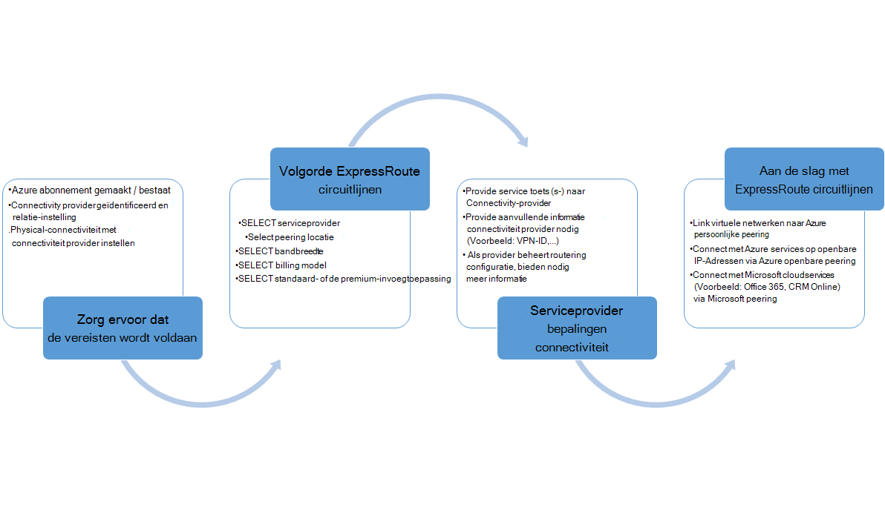
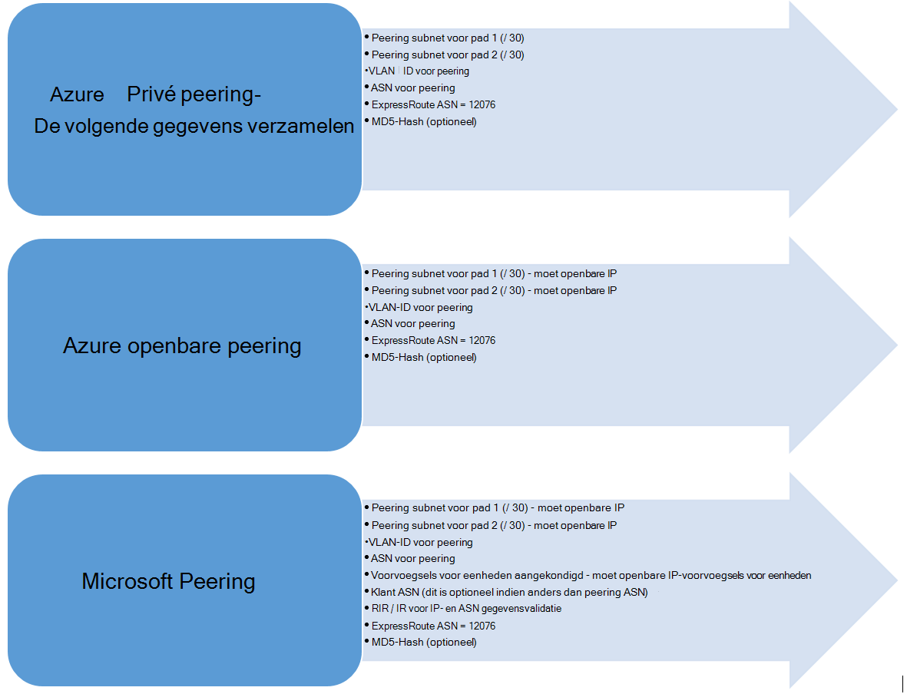

<properties
   pageTitle="Werkstromen voor het configureren van een circuitlijnen ExpressRoute | Microsoft Azure"
   description="Deze pagina begeleidt u bij de werkstromen voor het configureren van ExpressRoute circuitlijnen en peerings"
   documentationCenter="na"
   services="expressroute"
   authors="cherylmc"
   manager="carmonm"
   editor="" />
<tags
   ms.service="expressroute"
   ms.devlang="na"
   ms.topic="article" 
   ms.tgt_pltfrm="na"
   ms.workload="infrastructure-services"
   ms.date="10/10/2016"
   ms.author="cherylmc"/>

# ExpressRoute werkstromen voor de inrichting van circuitlijnen en circuitlijnen Staten

Deze pagina begeleidt u bij de inrichting en configuratie van werkstromen voor circulatie op hoog niveau-service.

De volgende afbeelding en de bijbehorende stappen wordt de taken die u volgen moet om te hebben een ExpressRoute circuitlijnen deze is ingericht end-to-end weergeven. 

1. PowerShell gebruiken voor het configureren van een circuitlijnen ExpressRoute. Volg de instructies in het artikel [circuits ExpressRoute maken](expressroute-howto-circuit-classic.md) voor meer informatie.

2. Bestel connectivity van de serviceprovider. Dit proces varieert. Neem contact op met uw connectivity-provider voor meer informatie over het bestel connectivity.

3. Zorg ervoor dat de circuitlijnen heeft is ingericht door te verifiëren de ExpressRoute circuitlijnen inrichting staat via PowerShell. 

4. Routeren domeinen configureren. Als uw provider connectivity worden beheerd in Layer 3 voor u, worden ze configureren voor uw circuitlijnen-mailroutering. Als uw provider connectivity alleen Layer 2-services biedt, moet u de routering volgens de richtlijnen die worden beschreven in de [Routering van vereisten](expressroute-routing.md) en [configuratie van de routering's](expressroute-howto-routing-classic.md) configureren.

    -  Inschakelen Azure privé peering - moet u deze peering als u wilt verbinden met VMs / cloud services die zijn geïmplementeerd in virtuele netwerken inschakelen.
    -  Inschakelen Azure openbare peering - moet u inschakelen Azure openbare peering als u wilt verbinden met Azure services die worden gehost op openbare IP-adressen. Dit is een vereiste dat toegang krijgen tot Azure bronnen als u hebt gekozen standaardroutering voor Azure privé peering inschakelen.
    -  Microsoft peering - inschakelen moet u dit bij toegang tot Office 365 en CRM online services inschakelen. 
    
    >[AZURE.IMPORTANT] Moet u ervoor zorgen dat u een afzonderlijke proxy gebruikt / rand verbinding maken met Microsoft dan de versie die u gebruikt voor het Internet. Met behulp van de rand voor zowel ExpressRoute als Internet ertoe leiden dat asymmetrische Routering en ertoe leiden dat connectiviteit bijvoorbeeld voor uw netwerk.

    

5. Virtuele netwerken koppelen aan ExpressRoute circuits - kunt u virtuele netwerken koppelen aan uw circuitlijnen ExpressRoute. Volg de instructies [om te koppelen VNets](expressroute-howto-linkvnet-arm.md) naar uw circuitlijnen. Deze VNets zijn hetzelfde Azure-abonnement als de circuitlijnen ExpressRoute of een ander abonnement mogelijk niet.

## ExpressRoute circuitlijnen Staten inrichting

Elke circuitlijnen ExpressRoute heeft twee staten:

- Status van serviceprovider inrichten
- Status

Status voorstelt van Microsoft inrichten status. Deze eigenschap is ingesteld op ingeschakeld wanneer u Expressroute circuits maken

De status voor het inrichten van connectivity-serviceprovider voorstelt de status op de connectivity-provider kant. Dit zijn *NotProvisioned*, *Provisioning*of *Provisioned*. De circuitlijnen ExpressRoute moet zich in Provisioned staat om te kunnen gebruiken.

### Statussen van een circuitlijnen ExpressRoute

In deze sectie bevat uit de mogelijke fasen voor een circuitlijnen ExpressRoute.

#### Bij het maken

U ziet de circuitlijnen ExpressRoute in de volgende stand zodra u de PowerShell-cmdlet als u wilt maken van de circuitlijnen ExpressRoute uitvoeren.

    ServiceProviderProvisioningState : NotProvisioned
    Status                           : Enabled

#### Wanneer connectivity-provider is het proces van het circuitlijnen inrichten

U ziet de circuitlijnen ExpressRoute in de volgende stand zodra u de service-toets aan de connectivity-provider doorgeven en ze zijn begonnen met het inrichten.

    ServiceProviderProvisioningState : Provisioning
    Status                           : Enabled

#### Wanneer connectivity provider het inrichten is voltooid

U ziet de circuitlijnen ExpressRoute in de volgende stand zodra de provider connectivity het inrichten is voltooid.

    ServiceProviderProvisioningState : Provisioned
    Status                           : Enabled

Deze is ingericht en ingeschakeld is dat de enige staat de circuitlijnen mogelijk niet voor u kunnen gebruiken. Als u een laag 2-provider gebruikt, kunt u omleiding voor uw circuitlijnen alleen tijdens deze deze status.

#### Wanneer de circuitlijnen is deprovisioning in connectivity-provider

Als u de serviceprovider naar de circuitlijnen ExpressRoute deprovision aangevraagd, ziet u de circuitlijnen ingesteld op de volgende staat nadat de serviceprovider het deprovisioning proces is voltooid.

    ServiceProviderProvisioningState : NotProvisioned
    Status                           : Enabled

U kunt deze opnieuw inschakelen als nodig, of Voer PowerShell-cmdlets als u wilt verwijderen van de circuitlijnen.  

>[AZURE.IMPORTANT] Als u de PowerShell-cmdlet als u wilt verwijderen van de circuitlijnen bij de inrichting van de ServiceProviderProvisioningState of Provisioned de bewerking mislukt uitvoeren. Neem werken met uw provider connectivity naar de circuitlijnen ExpressRoute eerst deprovision en verwijder vervolgens het circuitlijnen. Microsoft blijft voor de circuitlijnen totdat u de PowerShell-cmdlet als u wilt verwijderen van de circuitlijnen uitvoert.

## Status van de configuratie routeren sessie

De inrichting van staat BGP krijgt u als de sessie BGP is ingeschakeld op de Microsoft edge. De status moet zijn ingeschakeld om berichten te kunnen gebruiken de peering.

Het is belangrijk om te controleren van de status van de BGP-sessie met name voor Microsoft peering. Naast de BGP inrichting staat, is in een andere staat genoemd *aangekondigd openbare voorvoegsels staat*. De staat aangekondigde openbare voorvoegsels moet zich in *geconfigureerd* provincie, zowel voor de sessie BGP moeten u en uw rondsturen end-to-end werkt. 

Als de aangekondigde openbare voorvoegsel status is ingesteld op een staat *validatie nodig* , is de sessie BGP niet ingeschakeld, zoals de aangekondigde voorvoegsels niet overeenkomt met de AS-nummer in een van de routering registervermeldingen. 

>[AZURE.IMPORTANT] Als de status aangekondigde openbare voorvoegsels voor eenheden in *handmatige validatie* staat, moet u een ondersteuningsticket met [Microsoft ondersteuning voor het](https://portal.azure.com/?#blade/Microsoft_Azure_Support/HelpAndSupportBlade) openen en bewijzen dat u eigenaar bent van het IP-adressen aangekondigd langs met een getal dat de bijbehorende zelfstandige systeem.

## Volgende stappen

- Configureer uw verbinding ExpressRoute.

    - [ExpressRoute circuits maken](expressroute-howto-circuit-arm.md)
    - [Routering configureren](expressroute-howto-routing-arm.md)
    - [Een VNet koppelen aan een circuitlijnen ExpressRoute](expressroute-howto-linkvnet-arm.md)
