<properties
    pageTitle="Inleiding tot Microsoft Azure | Microsoft Azure"
    description="Nieuw in Microsoft Azure? Een eenvoudige overzicht van de services biedt met voorbeelden van hoe ze nuttig zijn."
    services=" "
    documentationCenter=".net"
    authors="rboucher"
    manager="carolz"
    editor=""/>

<tags
    ms.service="multiple"
    ms.workload="multiple"
    ms.tgt_pltfrm="na"
    ms.devlang="na"
    ms.topic="article"
    ms.date="06/30/2015"  
    ms.author="robb"/>

# Inleiding tot Microsoft Azure

Microsoft Azure is Microsoft toepassingsplatform voor de openbare cloud.  Het doel van dit artikel is geeft u een foundation voor informatie over de grondbeginselen van Azure, zelfs als u niet over cloud weet computing.

**In dit artikel lezen**

Azure groeit altijd zodat u gemakkelijk naar overbelast raakt.  Beginnen met de eenvoudige diensten, die eerst worden vermeld in dit artikel en Ga door met andere services. Dat betekent niet dat u niet alleen de extra services afzonderlijk gebruiken, maar de eenvoudige services vormen de kern van een toepassing wordt uitgevoerd in Azure wordt aangegeven.

**Feedback geven**

Uw feedback is belangrijk. In dit artikel geeft u een effectieve overzicht van Azure. Als dit niet het geval is, laat u ons in de sectie Opmerkingen onder aan de pagina. Geef bepaalde informatie over wat u verwacht te zien en hoe u het artikel te verbeteren.  

## De onderdelen van Azure

Azure groepen services in categorieën in de beheerportal en klik op verschillende visuele hulpmiddelen, zoals de [Wat Is Azure Infographic](https://azure.microsoft.com/documentation/infographics/azure/) . De beheerportal wordt gebruikt voor het beheren van de meeste (maar niet alle) services in Azure wordt aangegeven.

In dit artikel wordt een **andere organisatie** gebruikt om te communiceren over services op basis van dezelfde functie en om te bellen belangrijke onderliggend services die deel uitmaken van grotere bestanden.  

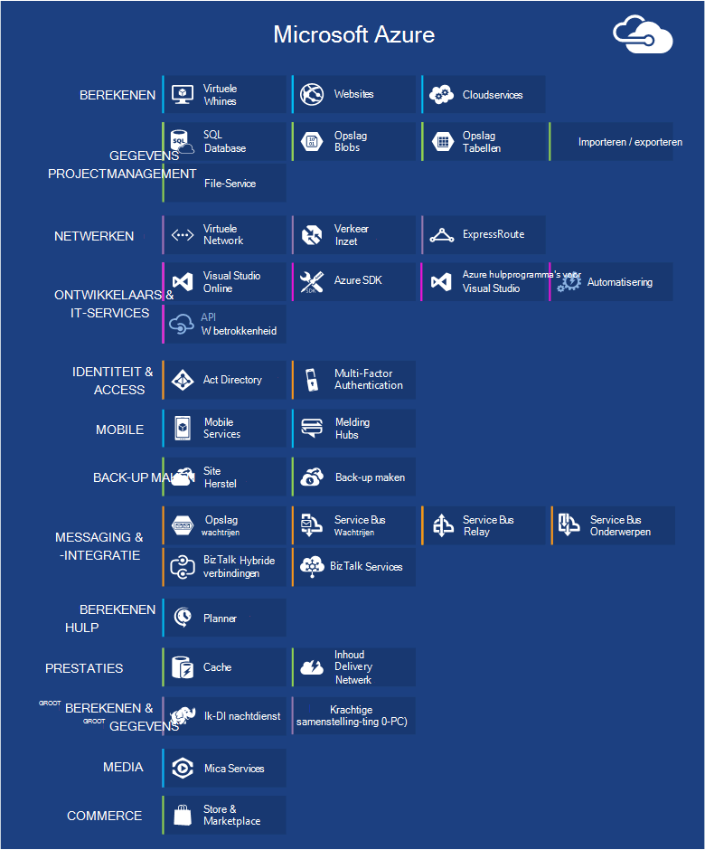   
 *Afbeelding: Azure biedt Internet toegankelijke toepassingsservices uitgevoerd in Azure datacenters.*

## Management Portal
Azure heeft een webservice-interface de [Beheerportal](http://manage.windowsazure.com) waarmee beheerders kunnen openen en meest beheren, maar niet alle functies van Azure genoemd.  Microsoft brengt meestal de nieuwere UI-portal in beta voordat u een oudere intrekken. De nieuwere versie wordt de [' Azure Preview Portal '](https://portal.azure.com/)genoemd.

Er is meestal een lange overlapping wanneer beide portals actief zijn. Terwijl core services in beide portals wordt weergegeven, is het mogelijk dat niet alle functies beschikbaar zijn in beide. Nieuwere services mogelijk weergegeven in de nieuwere services voor het eerste en eerder van portal en functionaliteit mag alleen bestaan in de sectie die oudere.  Hier het bericht is die als u iets niet in de portal oudere vinden controleert u de nieuwere versie en vice versa.

## Berekenen

Een van de belangrijkste zaken aan bod een cloud-platform heeft is toepassingen uitvoeren. Elk van de Azure berekeningscluster-modellen heeft een eigen rol om af te spelen.

U kunt deze technologieën afzonderlijk gebruiken of deze combineren zo nodig naar de juiste basis voor uw toepassing maken. De methode die u kiest, is afhankelijk van welke problemen u probeert om op te lossen.

### Azure virtuele Machines

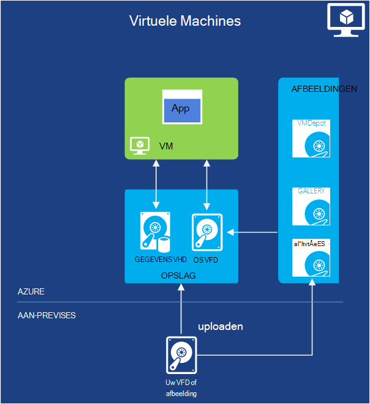   
*Afbeelding: Azure virtuele Machines biedt u volledige controle over VM exemplaren in de cloud.*

De mogelijkheid om te maken van een virtuele machine op aanvraag, ongeacht of vanuit een standaard afbeelding of een die u opgeeft, is met name handig. Deze methode, ook wel bekend als infrastructuur als een Service (IaaS), is wat Azure virtuele Machines biedt. Afbeelding 2 ziet u een combinatie van hoe een virtuele Machine (VM) wordt uitgevoerd en hoe u kunt maken via een VHD.  

U maakt een VM, te geven welke VHD wilt gebruiken en de grootte van de VM.  Vervolgens betaalt u voor de tijd waarop de VM wordt uitgevoerd. U betaalt per minuut en alleen terwijl deze wordt uitgevoerd, hoewel er een minimale opslag-kosten is voor het behouden van de VHD beschikbaar. Azure biedt een galerie met voorraad VHD's (ook wel 'afbeeldingen' genoemd) met een besturingssysteem wilt beginnen. Hierbij Microsoft en partner opties, zoals Windows Server en Linux, SQL Server, Oracle en nog veel meer. U bent gratis VHD's en afbeeldingen maken en vervolgens uploaden zelf. U kunt zelfs VHD's die alleen gegevens bevatten en deze vervolgens openen vanaf uw actieve VMs uploaden.

Waar de VHD afkomstig zijn uit, kunt u wijzigingen hebt aangebracht terwijl een VM wordt uitgevoerd persistent opslaan. De volgende keer dat u een VM vanuit die VHD maken verdergaan dingen waar u gebleven was. De VHD's die een back-de virtuele Machines worden opgeslagen in de opslag van Azure BLOB's, die we later nader bekeken.  Dat betekent dat u redundantie om ervoor te zorgen dat uw VMs won't verdwijnen vanwege hardware en schijf fouten krijgt. Het is ook mogelijk om te kopiëren van de gewijzigde VHD afmelden bij Azure en voer vervolgens deze lokaal.

Uw toepassing wordt uitgevoerd binnen een of meer virtuele Machines, afhankelijk van hoe u het eerder hebt gemaakt of besluit nu helemaal te maken.

Deze methode vrij algemeen cloud computing kan worden gebruikt om de diverse problemen.

**VM scenario 's**

1.  **Ontwikkelaar/testen** - u kunt ze gebruiken om te maken van een goedkoop ontwikkel- en -platform dat u af sluiten te wanneer u klaar bent met deze. U kunt ook maken en uitvoeren van toepassingen die gebruikmaken van andere talen en bibliotheken die u tevreden bent. Deze toepassingen kunnen u elk van de opties voor het beheer van gegevens die Azure bevat en u kunt er ook voor kiezen om SQL Server of een ander DBMS uitgevoerd in een of meer virtuele machines te gebruiken.
2.  **Azure (op-en-shift)-toepassingen verplaatsen** - "Lift-en-shift" verwijst naar het verplaatsen van uw toepassing net zoals u een vorkheftruck gebruiken zou om een grote object te verplaatsen.  U 'til' de VHD vanuit uw lokale datacenter, en "shift' deze naar Azure en er worden uitgevoerd.  U moet meestal werken u afhankelijkheden op andere systemen wilt verwijderen. Als er te veel, kunt u in plaats daarvan optie 3.  
3.  **Verlengen uw Datacenter** - gebruik Azure VMs een uitbreiding van uw datacenter van de on-premises implementatie, SharePoint of andere toepassingen uitgevoerd. Als u wilt dit wordt ondersteund, is het mogelijk te maken van Windows-domeinen in de cloud met behulp van Active Directory in Azure VMs. Azure Virtual Network (later genoemd) kunt u het lokale netwerk en uw netwerk in Azure wordt aangegeven met elkaar verbinden.

### WebApps

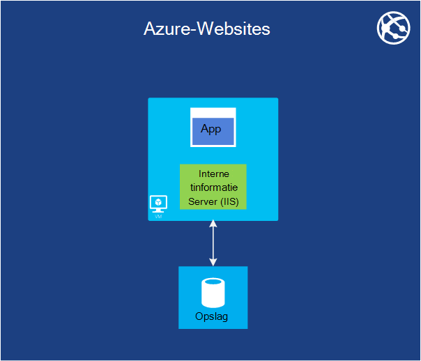   
 *Afbeelding: Azure Web-Apps worden uitgevoerd een toepassing voor de website in de cloud zonder voor het beheren van de onderliggende webserver.*

Een van de meest voorkomende zaken aan bod die mensen uitvoeren in de cloud wordt websites en webtoepassingen uitgevoerd. Azure virtuele Machines dit toestaat, maar nog steeds laat u die verantwoordelijk is van een of meer VMs en de onderliggende besturingssystemen beheren. Cloud services-web rollen kunnen dit doen, maar implementeert en onderhouden van deze is nog steeds administratief werk.  Wat gebeurt er als u alleen wilt een website waar iemand anders zorgt voor het administratief werk voor u?

Dit is precies wat Web Apps bevat. Dit model berekeningscluster biedt een beheerde webomgeving gebruik van de Azure-beheerportal, evenals de API's. U kunt een bestaande website-toepassing naar ongewijzigd-WebApps verplaatsen of kunt u een nieuw document rechtstreeks in de cloud. Wanneer een website wordt uitgevoerd, kunt u deze kunt toevoegen of exemplaren dynamisch, verwijderen te vertrouwen op Azure-WebApps balance '-aanvragen over deze laden. Azure Apps biedt de optie van een gedeelde, waar uw website wordt uitgevoerd in een virtuele machine met andere sites, zowel een standaard de optie waarmee een site in een eigen VM uit te voeren. De optie standaard kunt u ook de tekengrootte (rekenkracht) van uw exemplaren indien nodig.

Voor de ontwikkeling ondersteunt Webapps .NET, PHP, Node.js, Java en Python samen met SQL-Database en MySQL (van ClearDB, een Microsoft-partner) voor relationele opslag. Deze ook biedt ingebouwde ondersteuning voor verschillende populaire toepassingen, waaronder WordPress, Joomla en Drupal. Het doel is om aan te bieden van een platform lage kosten, scalable en ruim zijn handig voor het maken van websites en webtoepassingen in de openbare cloud.

**Web Apps-scenario 's**

Web Apps is bedoeld zijn handig voor ondernemingen, ontwikkelaars en web ontwerp overheidsinstanties helpt. Voor ondernemingen is dit een eenvoudig te beheren, scalable zeer veilige en ten zeerste beschikbaar oplossing voor het uitvoeren van aanwezigheid websites. Wanneer u nodig hebt voor het instellen van een Website, is het aanbevolen om te starten met Azure Web Apps en gaat u verder met de Cloud Services zodra u nodig hebt met een functie die niet beschikbaar is. Zie het einde van de sectie 'Berekeningscluster' voor meer koppelingen waarmee u kunt kiezen tussen de opties.

### Cloudservices
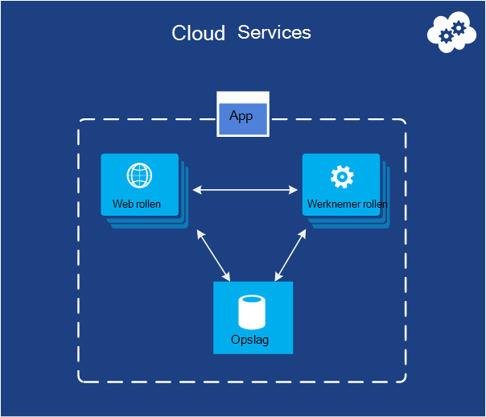   
*Afbeelding: Azure Cloudservices hier ten zeerste scalable aangepaste code uitvoeren op een Platform als een Service (PaaS)-omgeving*

Stel dat u wilt maken van een cloud-toepassing die een groot aantal gelijktijdige gebruikers kunt ondersteunen, hoeft het niet veel beheer en nooit uitvalt. Wilt u misschien een softwareleverancier waarop deze is opgezet, bijvoorbeeld die heeft besloten te Profiteer van Software als Service (SaaS) door het bouwen van een versie van een van uw toepassingen in de cloud. Of u mogelijk een opstart maken van een toepassing voor consumenten dat u verwacht snel zal toenemen. Als u op Azure maakt, welke worden uitgevoerd-model moet u gebruiken?

Azure-WebApps kunt maken van dit soort webtoepassing, maar er zijn enkele beperkingen. U hebt geen beheerderstoegang, bijvoorbeeld, wat betekent dat u willekeurige software niet installeren. Azure virtuele Machines biedt u een groot aantal flexibiliteit, inclusief beheerderstoegang, en u zeker deze kunt gebruiken om een groot aantal toepassing te maken, maar u moet wel veel aspecten van betrouwbaarheid- en beheerinstellingen uzelf verwerken. Wat u wilt dat is een optie waarmee u het besturingselement dat u nodig hebt, maar ook voert het grootste deel van het werk dat is vereist voor betrouwbaarheid en beheer.

Dit is precies wat verstrekt door Azure-Cloudservices. Deze technologie uitdrukkelijk is ontworpen ter ondersteuning van scalable, betrouwbare en laag-beheerders toepassingen en dit is een voorbeeld van wat heeft genoemd Platform als een Service (PaaS). Als u wilt gebruiken, moet u een toepassing via de technologie die u, zoals C#, Java, PHP, Python, Node.js of iets anders kiest maken. Uw code vervolgens wordt uitgevoerd in de virtuele machines (genoemd exemplaren) met een versie van Windows Server.

Maar deze VMs, onderling verschillen van de kleuren die u met Azure virtuele Machines maakt. Voor één criterium, Azure zelf beheert deze items, zoals het installeren van besturingssysteem patches doen en afbeeldingen automatisch implementeren van nieuwe hersteld. Dit betekent dat uw toepassing niet mag worden gebruikt voor het behoud van staat in rol-processen, Internet of een werknemer; Deze moet worden bewaard in plaats daarvan in een van de opties voor het beheer van Azure gegevens beschreven in de volgende sectie. Azure bewaakt ook deze VMs, opnieuw starten van een die fail. Cloudservices dat automatisch meer of minder exemplaren in antwoord op aanvraag gemaakt, kunt u instellen. Hiermee kunt u betere gebruik worden verwerkt en vervolgens te schalen terug zodat u zo veel mogelijk worden niet betalen als er minder gebruik.

U hebt twee rollen om te kiezen wanneer u een exemplaar maakt, beide op basis van Windows Server. Het belangrijkste verschil tussen de twee is dat een exemplaar van een Webrol wordt uitgevoerd IIS, maar niet door een exemplaar van de rol van een werknemer. Beide worden beheerd op dezelfde manier, maar en dat is gebruikelijk voor een toepassing moet u beide gebruiken. Een exemplaar van de rol web mogelijk bijvoorbeeld accepteer aanmeldingsaanvragen van gebruikers vervolgens aan een exemplaar van de rol werknemer voor verwerking door te geven. Als uw toepassing omhoog of omlaag wilt verkleinen, kunt u dat Azure meer exemplaren van een rol maken of bestaande exemplaren afgesloten aanvragen. En soortgelijke naar Azure virtuele Machines, u bent betalen alleen voor de tijd dat elk exemplaar van de rol web of werknemer wordt uitgevoerd.

**Cloud Services-scenario 's**

Cloudservices zijn ideaal voor de ondersteuning van enorme schaal uit wanneer u nodig hebt u meer controle over het platform dan verstrekt door Azure Web Apps, maar niet nodig controle over het onderliggende besturingssysteem hebt.

#### Een berekeningscluster Model kiezen
De pagina [Azure Web Apps, Cloudservices en virtuele Machines vergelijking](./app-service-web/choose-web-site-cloud-service-vm.md) vindt u meer gedetailleerde informatie over het kiezen van een berekeningscluster-model.

## Gegevensbeheer

Toepassingen moeten gegevens en verschillende soorten toepassingen nodig verschillende soorten gegevens. Reden biedt Azure op verschillende manieren opslaan en beheren van gegevens. Azure biedt veel opslagopties, maar alle zijn ontworpen voor zeer duurzaam opslag.  Met een van de volgende opties, zijn er altijd 3 kopieën van uw gegevens die zijn gesynchroniseerd via een Azure datacenter--6 als u Azure geografische redundantie kunt een back-up maken met een ander datacenter ten minste 300 mijl afwezig toestaat.     

### In de virtuele Machines
De mogelijkheid om uit te voeren van SQL Server- of een ander DBMS in een VM gemaakt met Azure virtuele Machines heeft al is genoemd. En zich daarna realiseert dat deze optie is niet beperkt tot relationele systemen; u bent ook gratis NoSQL technologieën zoals MongoDB en Cassandra uitvoeren. Ingewikkelde it gerepliceerd voor het uitvoeren van uw eigen databasesysteem is wat helpen we u graag gebruikt voor in onze eigen datacenters- maar ook moeten de verwerking van het beheer van die DBMS.  Andere opties voor verwerkt Azure meer of alle het beheer voor u.

Nogmaals, de status van de virtuele Machine en eventuele aanvullende gegevensschijf u maken of uploaden worden ondersteund door blobopslag (die we het gaan hebben over later).  

### Azure SQL-Database
   

*Afbeelding: Azure SQL-Database biedt een beheerde relationele database-service in de cloud.*

Azure biedt voor relationele opslag, de functie SQL-Database. Laat u niet de tuin u naamgeving. Dit is anders dan een veelgebruikte SQL-Database verstrekt door SQL Server boven op Windows Server wordt uitgevoerd.  

Azure SQL-Database bevat voorheen SQL Azure wordt aangegeven, alle van de belangrijkste functies van een relationele database management systeem, inclusief atomische transacties gelijktijdige gegevenstoegang door meerdere gebruikers met gegevensintegriteit, ANSI SQL-query's en een vertrouwde programming model. Zoals SQL Server, SQL-Database kunnen worden geopend met entiteit Framework, access ADO.NET, JDBC en andere vertrouwde data-technologieën. Dit ondersteunt ook de meeste van de T-SQL-taal, samen met SQL Server-hulpprogramma's zoals SQL Server Management Studio. Voor iedereen vertrouwd met SQL Server (of een andere relationele database) gebruik van de SQL-Database eenvoudig is.

Maar SQL-Database is niet alleen een DBMS in de cloud-it bevindt zich een PaaS-service. U nog steeds uw gegevens beheren en wie toegang heeft tot deze, maar SQL-Database zorgt de administratieve knorvis werk, zoals het beheren van de infrastructuur hardware en de database en besturingssysteem software automatisch actueel houden. SQL-Database bevat ook beschikbaarheid, automatische back-ups, point-in-time herstelmogelijkheden en kopieën kunnen repliceren tussen geografische regio's.  

**Scenario's voor SQL-Database**

Als u een Azure-toepassing (via een van de modellen voor berekeningscluster) die nog moet worden relationele opslag maakt, kan SQL-Database een goede optie zijn. Toepassingen die buiten de cloud worden uitgevoerd kunnen deze service, ook wel gebruiken zodat er tal van andere scenario's zijn. Bijvoorbeeld zijn gegevens die zijn opgeslagen in SQL-Database toegankelijk vanaf andere klant-systemen, inclusief bureaubladen, laptop, tablets en -telefoons. En omdat deze ingebouwde beschikbaarheid via replicatie biedt, met behulp van SQL-Database kunt uitvaltijd.

### Tabellen
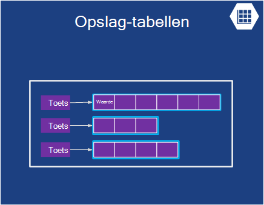  

*Afbeelding: Azure tabellen biedt een platte NoSQL manier voor het opslaan van gegevens.*

Deze functie wordt soms verschillende termen als onderdeel van een grotere functie ' Azure opslag ' genoemd. Als u "tabellen", "Azure tabellen" of "opslag tabellen" ziet, is alle hetzelfde.  

En door de naam niet verwarren: deze technologie relationele opslag niet zelf. Dit is in feite een voorbeeld van een NoSQL aanpak een archief sleutelwaarde/genoemd. Azure tabellen kunnen een toepassing eigenschappen van verschillende typen, zoals tekenreeksen, gehele getallen en datums opslaan. Een toepassing kunt vervolgens een groep eigenschappen ophalen met behulp van een unieke sleutel voor die groep. Wanneer u complexe bewerkingen zoals joins worden niet ondersteund, tabellen snel toegang tot getypte gegevens bieden. Ze zijn ook zeer scalable, met één tabel kunnen zoveel een terabyte gegevens bevatten. En overeenkomen met de eenvoudig, tabellen zijn meestal minder duur te gebruiken dan relationele SQL-Database-opslag.

**Scenario's voor tabellen**

Stel dat u wilt maken een Azure-toepassing die nog moet worden snelle toegang tot getypt gegevens, wellicht een groot aantal deze, maar geen hoeft te complexe SQL-query's uitvoeren op deze gegevens. Stel dat u maakt een toepassing voor consumenten die vereist zijn voor het opslaan van gegevens van de klant-profiel voor elke gebruiker. Uw app is het verstandig om zeer populair, dus moet u toestaan voor een groot aantal gegevens, maar u ze toch niet veel met deze gegevens na het opslaan van deze, doet u ze ophaalt op eenvoudige manieren. Dit is precies het soort scenario waar Azure tabellen relevant is.

### BLOB 's
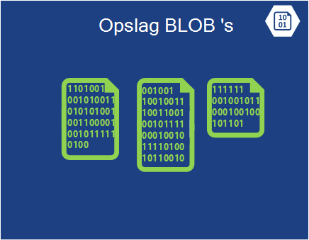    
*Afbeelding: Azure BLOB's biedt ongestructureerde binaire gegevens.*  

Azure BLOB's (opnieuw "Blob Storage" en alleen opslag BLOB "'s" zijn hetzelfde) is bedoeld voor de opslag ongestructureerde binaire gegevens. Zoals tabellen, kan BLOB's biedt goedkoop opslag, en een enkel blob zo groot 1TB (één terabyte). Azure-toepassingen kunnen ook Azure-sticks, waarmee BLOB's bieden permanente opslagruimte voor een Windows-bestandssysteem gekoppeld in een Azure exemplaar gebruiken. De toepassing gewone Windows-bestanden kan zien, maar de inhoud daadwerkelijk zijn opgeslagen in een blob.

Blobopslag wordt gebruikt door de vele andere Azure functies (inclusief virtuele Machines), zodat deze kan uw werkbelasting zeker te verwerken.

**Scenario's voor BLOB 's**

Een toepassing die worden opgeslagen video, grote bestanden of andere binaire gegevens kunt BLOB's voor eenvoudige, goedkope opslag gebruiken. BLOB's worden ook vaak gebruikt in combinatie met andere services zoals inhoud bezorging netwerk op, dat we wordt nader bekeken later.  

### Importeren / exporteren
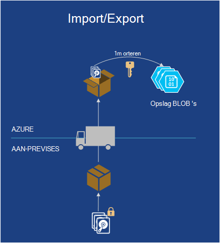  

*Afbeelding: Azure importeren / exporteren biedt de mogelijkheid om te verzenden van een fysieke harde schijf of van Azure voor snellere en goedkoper bulksgewijs gegevens importeren of exporteren.*  

Soms wilt u een groot aantal gegevens verplaatsen naar Azure. Die zou lang duren, bijvoorbeeld dagen en een groot aantal bandbreedte gebruiken. In dat geval kunt u Azure importeren/exporteren, zodat u Bitlocker zijn versleuteld 3.5" SATA vaste schijven rechtstreeks aan Azure datacenters waar Microsoft de gegevens naar blobopslag voor u overgebracht worden op verzenden.  Nadat de upload is voltooid, wordt de stations terug naar u geleverd met Microsoft.  U kunt ook aanvragen dat grote hoeveelheden gegevens uit Blob Storage worden geëxporteerd naar vaste schijven en terug naar u via e-mail worden verzonden.

**Scenario's voor het importeren / exporteren**

- **Grote migratie van gegevens** : wanneer u grote hoeveelheden gegevens (TB) die u wilt uploaden naar Azure hebt, de service importeren/exporteren is vaak sneller en misschien goedkoper dan overdragen via internet. Als u de gegevens hebt in BLOB's, kunt u deze kunt verwerken in andere formulieren zoals Table storage of een SQL-Database.

- **Gegevens herstellen gearchiveerd** - kunt u importeren/exporteren naar Microsoft doorverbinden grote hoeveelheden gegevens die zijn opgeslagen in Azure-blobopslag naar een opslagapparaat die u verzendt en vervolgens hebt dat apparaat geabonneerd terug naar een locatie die u nodig hebt. Omdat dit enige tijd duren kan, is het niet een goede keuze voor herstel. Het is raadzaam voor gearchiveerde gegevens die u niet nodig voor snelle toegang tot hebt.

### File-Service
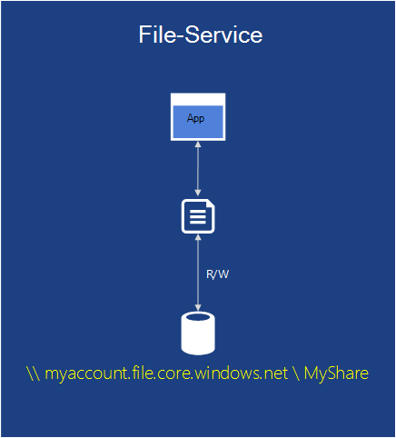    
*Afbeelding: Azure Bestandsservices biedt SMB \\ \\server\share paden voor toepassingen die wordt uitgevoerd in de cloud.*

On-premises dat is gebruikelijk om grote hoeveelheden bestandsopslag toegankelijk is via de Server bericht blokkeren (SMB) protocol via een \\ \\Server\share opmaken. Azure bevat nu een service die u kunt dit protocol gebruiken in de cloud. Azure applicaties kunnen deze gebruiken om bestanden tussen VMs met vertrouwde bestandssysteem API's zoals ReadFile en WriteFile te delen. Bovendien kunnen de bestanden ook worden geopend op hetzelfde moment via een REST API interface, waarmee u de waarden voor aandelen vanuit on-premises als u ook een virtueel netwerk instellen. Azure bestanden is gebouwd met de service blob, zodat deze de dezelfde beschikbaarheid, levensduur, schaalbaarheid en geografische-redundantie ingebouwd in Azure Storage overneemt.

**Scenario's voor Azure-bestanden**

- **Bestaande apps migreren naar de cloud** - het eenvoudiger om te migreren on-premises implementatie toepassingen in de cloud die bestandsshares gebruiken om gegevens tussen onderdelen van de toepassing te delen. Elke VM maakt verbinding met het delen van het bestand en vervolgens deze kunt lezen en schrijven bestanden alsof deze zou ten opzichte van een on-premises implementatie-bestand delen.

- **Toepassingsinstellingen gedeeld** - een algemene patroon voor gedistribueerde toepassingen is dat de configuratiebestanden op een centrale locatie waar ze zijn toegankelijk vanaf veel verschillende virtuele machines. Deze configuratiebestanden kunnen worden opgeslagen in een bestandsshare van Azure en gelezen door alle toepassingsexemplaren. De instellingen kunnen ook worden beheerd via de REST-interface, waarmee u overal ter wereld toegang krijgt tot de configuratiebestanden.

- **Diagnostische gegevens delen** - u kunt bestanden opslaan en delen diagnostische zoals Logboeken, aan de doelstellingen en crashdumps. Dat deze bestanden geeft beschikbaar via de SMB en de REST interface toepassingen diverse hulpprogramma's voor gegevensanalyse gebruiken voor de diagnostische gegevens analyseren en verwerkt.

- **Test-ontwikkelaar/foutopsporing** - wanneer ontwikkelaars of beheerders aan virtuele machines in de cloud werken, ze moeten vaak een verzameling hulpprogramma's of hulpmiddelen. Installatie en distributie van deze hulpprogramma's op elke virtuele machine is tijd in beslag nemen. Met Azure-bestanden, kan een ontwikkelaar of de beheerder hun favoriete hulpmiddelen worden opgeslagen op een bestandsshare en verbinding maken met deze vanuit een virtuele machine.

## Netwerken

Azure worden uitgevoerd vandaag in veel datacenters verdeeld over de hele wereld. Wanneer u een toepassing uitvoeren of gegevens op te slaan, kunt u een of meer van deze datacenters gebruiken. U kunt ook verbinding maakt met deze datacenters op verschillende manieren met behulp van de onderstaande services.

### Virtual Network
   

*Afbeelding: Virtuele netwerken biedt een private network in de cloud, zodat de verschillende services met elkaar kunnen praten of naar on-premises implementatie bronnen als u een VPN-verbinding cross lokale verbinding.*  

Een handige manier om een openbare cloud te gebruiken, is het als een uitbreiding van uw eigen datacenter te.

Omdat u VMs op aanvraag maken kunt, verwijdert u deze (en stoppen betaalt) wanneer ze niet meer nodig hebt zich, kunt u beschikken over rekenkracht alleen wanneer u deze wilt. En aangezien Azure virtuele Machines u met SharePoint, Active Directory en andere software vertrouwde on-premises implementatie VMs maken kunt, deze methode kunt werken met de toepassingen die u al hebt.

Als u dit heel handig, maar zou uw gebruikers moeten kunnen deze toepassingen behandelen alsof ze in uw eigen datacenter uitvoert. Dit is precies wat Azure virtuele netwerk is toegestaan. Een VPN-gateway-apparaat met kunt een beheerder instellen een VPN (VPN) tussen het lokale netwerk en uw VMs die zijn geïmplementeerd in een virtueel netwerk in Azure wordt aangegeven. Omdat u uw eigen v4 IP-adressen in de cloud VMs toewijst, wordt deze weergegeven op uw eigen netwerk. Gebruikers in uw organisatie hebben toegang tot de toepassingen die VMs bevatten alsof ze lokaal uitvoert.

Zie voor meer informatie over het plannen en maken van een virtueel netwerk die voor u werkt, [Virtual Network](./virtual-network/virtual-networks-overview.md).

### Route Express

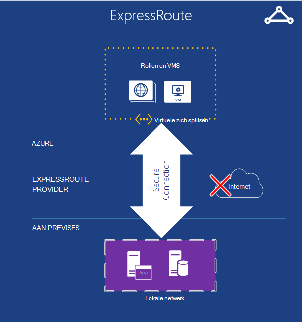   

*Afbeelding: ExpressRoute werkt met een virtueel Azure-netwerk, maar verbindingen via sneller speciale lijnen in plaats van de openbare Internet stuurt.*  

Als u meer bandbreedte of beveiliging dan een Azure Virtual Network verbinding kan bieden, kunt u zoeken naar ExpressRoute. In sommige gevallen kunt ExpressRoute ook u geld besparen. Moet u nog steeds een virtueel netwerk in Azure wordt aangegeven, maar de koppeling tussen Azure en uw site met een speciale verbinding die niet verder via de openbare Internet. Pas deze service gebruiken, moet u een overeenkomst met een netwerkprovider of een exchange-provider hebt.

Het instellen van een verbinding is vereist voor meer tijd ExpressRoute en plannen, zodat u wilt mogelijk laten beginnen met een VPN-site-naar-site en migreren naar een ExpressRoute-verbinding.

Zie voor meer informatie over ExpressRoute, [ExpressRoute technisch overzicht](./expressroute/expressroute-introduction.md).

### Verkeer Manager

   

*Afbeelding: Azure verkeer Manager, kunt u globale verkeer naar uw service op basis van intelligente regels doorstuurt.*

Als uw Azure-toepassing wordt uitgevoerd in meerdere datacenters, kunt u Azure verkeer Manager gebruiken om te leiden aanmeldingsaanvragen van gebruikers slim alle werkstroomexemplaren van de toepassing. U kunt ook verkeer naar services worden niet uitgevoerd in Azure zo lang maken als ze toegankelijk vanaf internet zijn doorstuurt.  

Een Azure-toepassing met gebruikers in slechts een enkel deel van de wereld mogelijk worden uitgevoerd in slechts één Azure datacenter. Een toepassing met gebruikers verspreid overal ter wereld, is echter waarschijnlijk meer geneigd uitvoeren in meerdere datacenters, misschien zelfs al deze. In dit geval tweede u een probleem betrokken: hoe u Slim gebruikers verwijzen naar toepassingsexemplaren? De meeste gevallen, gewenste waarschijnlijk elke gebruiker voor toegang tot het datacenter dat zich het dichtst bij haar, aangezien waarschijnlijk ze het meest geschikte tijdstip voor de reactie geeft. Maar wat gebeurt er als dat exemplaar van de toepassing overbelasting of niet beschikbaar is? In dit geval zou zij aardig voor haar aanvraag automatisch naar een ander datacenter. Dit is precies wat door Azure verkeer Manager voltooid.

De eigenaar van een toepassing wordt gedefinieerd regels die opgeven hoe aanmeldingsaanvragen van gebruikers moeten worden doorgestuurd naar datacenters en vervolgens is afhankelijk van op verkeer beheer om deze regels uit te voeren. Bijvoorbeeld gebruikers mogelijk gewend doorgestuurd naar het dichtstbijzijnde datacenter van de Azure, maar verzonden naar een andere wanneer het tijdstip van de reactie van de standaard-datacenter groter is dan de reactietijd op de van andere datacenters. Voor globaal verdeelde toepassingen met veel gebruikers is het handig dat een ingebouwde service u omgaat met problemen zoals hieronder.

Verkeer manager Directory Name Service (DNS) route-beheerders kunnen de eindpunten van de service gebruikt, maar verder verkeer niet verder tot en met verkeer Manager als u die verbinding is gemaakt. Hiermee wordt verkeer Manager worden van een vertraging veroorzaken die uw service communicatie mogelijk vertragen.

## Services voor ontwikkelaars
Azure biedt een aantal hulpmiddelen voor ontwikkelaars en IT-Professional maken en onderhouden van toepassingen in de cloud.  

### Azure SDK
Terug in 2008, wordt in de eerste versie van de voorlopige versie van Azure alleen .NET development ondersteund. Tegenwoordig kunnen echter, kunt u Azure toepassingen in vrijwel elke taal. Microsoft biedt momenteel taalspecifieke SDK's voor .NET, Java PHP, Node.js, Ruby en Python. Er is ook een algemene Azure SDK die basisondersteuning voor elke taal, zoals C++ biedt.  

Deze SDK's kunnen u bouwen, en Azure-toepassingen beheren. Ze zijn beschikbaar van [www.microsoftazure.com](https://azure.microsoft.com/downloads/) of GitHub en ze kunnen worden gebruikt met Visual Studio en Eclips. Azure biedt ook hulpmiddelen voor de opdrachtregel die ontwikkelaars bij elke omgeving editor of ontwikkeling, met inbegrip van hulpmiddelen voor het implementeren van toepassingen op Azure van Linux en Macintosh-systemen kunnen gebruiken.

Samen met helpt u bij het maken van Azure-toepassingen, bieden deze SDK's ook het clientbibliotheken die u maakt software die gebruikmaakt van Azure services. U mogelijk bijvoorbeeld een toepassing worden gelezen en geschreven Azure BLOB's maken of maak een hulpprogramma dat Azure toepassingen via de interface van Azure management implementeert.

### Visual Studio teamservices

Visual Studio Team Services is een marketingactiviteit naam die betrekking hebben op een nummer services die bijdragen tot het ontwikkelen van toepassingen in de Azure wordt aangegeven.

Om verwarring - te voorkomen biedt geen een gehoste of Web-based versie van Visual Studio. Moet u ook uw lokale kopie van Visual Studio die wordt uitgevoerd. Maar deze biedt vele andere hulpprogramma's wat zeer handig kunnen zijn.

Bevat een gehoste systeem voor bronbeheer gebruikt Team Foundation-Service versiebeheer en het werk item traceren biedt genoemd.  U kunt zelfs cijfer voor versiebeheer gebruiken als u liever die. En u kunt de bron-besturingselement-mailsysteem die u door project gebruiken variëren. U kunt teamprojecten maken onbeperkte privé toegankelijk zijn vanuit een willekeurige plaats in de wereld.  

Visual Studio Team Services biedt een service voor het testen van laden. U kunt uitvoeren laden tests die is gemaakt in Visual Studio op VMs in de cloud. U het totale aantal gebruikers dat u wilt laden test met opgeven en Visual Studio Team Services wordt automatisch bepalen hoeveel agenten nodig zijn, kringvelden van de vereiste virtuele machines en uw laden tests uit te voeren. Als u een MSDN-abonnee bent, krijgt u duizenden gebruiker minuten laden testen van elke maand gratis.

Visual Studio Team Services biedt ook ondersteuning voor agile ontwikkeling met functies zoals doorlopend integratie genereert, kanbanborden en virtueel team ruimten.

**Visual Studio Team Services scenario 's**

Visual Studio Team Services is een goede keuze voor bedrijven die moeten samenwerken wereldwijd en niet de infrastructuur al hebt op hun plaats staan kunt doen. U kunt setup ophalen in minuten, kiest u een bron-besturingselement-mailsysteem en code schrijven en het bouwen van die dag starten.  De team-hulpmiddelen bieden een locatie voor afhankelijk en voor samenwerking en de extra hulpmiddelen bieden de analyse die nodig zijn om te testen en sneller uw toepassing aanpassen.

Maar organisaties die al een on-premises-systeem nieuwe projecten op Visual Studio Team Services om te zien als deze efficiënter is kunnen testen.   

### Toepassing inzichten

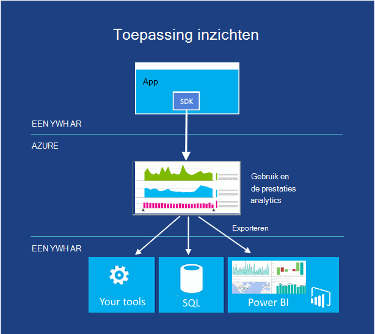  

*Afbeelding: Toepassing inzichten beeldschermen prestaties en het gebruik van uw live Internet of een apparaat-app.*

Wanneer u uw app - hebt gepubliceerd of deze wordt uitgevoerd op mobiele apparaten, desktopcomputer of webbrowsers - toepassing inzichten wordt uitgelegd hoe deze wordt uitgevoerd en wat gebruikers ermee doen. Er wordt een telling van crashes en traag antwoord wel voor dat, waarschuwing u als de cijfers niet acceptabel drempelwaarden cross en u kunnen een diagnose stellen bij sprake is van problemen.

Wanneer u een nieuwe functie ontwikkelt, wilt u het succes moeten meten met gebruikers. Door gebruikspatronen analyse, moet u begrijpen wat geschikt is voor uw klanten en uw app in elke ontwikkelingscyclus verbeteren.

Hoewel die wordt gehost in Azure wordt aangegeven, werkt de toepassing inzichten voor een breed en groeien reeks apps, zowel in- en uitschakelen Azure. J2EE zowel ASP.NET web apps vallen, evenals iOS, Android, OSX en Windows-toepassingen. Telemetrielogboek is verzonden vanuit een SDK gemaakt met de app, worden geanalyseerd en weergegeven in de service-toepassing inzichten in Azure wordt aangegeven.

Als u meer specialistische analyses wilt, de stream telemetrielogboek met een database of exporteren naar een andere's of Power BI.

**Toepassing inzichten scenario 's**

U ontwikkelt een app. Het is mogelijk een web-app of een apparaat-app of een apparaat-app met web back-enddatabase.

* De prestaties van uw app afstemmen nadat deze is gepubliceerd, of tijdens het laden testen.  Toepassing inzichten telemetrielogboek is samengevoegd uit alle geïnstalleerde exemplaren en biedt u grafieken van antwoord tijden, aanvraag en uitzondering telt afhankelijkheid antwoord tijden en andere prestatie-indicatoren. Dit kunnen u van uw app afstemmen. U kunt invoegen code als u wilt rapporteren meer specifieke gegevens als u deze nodig hebt.
* Problemen opsporen en onderzoeken in uw live-app. U kunt KPI cross aanvaardbaar drempelwaarden waarschuwingen per e-mail onmiddellijk. U kunt specifieke sessies, bijvoorbeeld om te zien van de aanvraag waardoor een uitzondering onderzoek.
* Bijhouden gebruik om te beoordelen, het succes van elke nieuwe functie. Wanneer u een nieuwe gebruiker verhaal ontwerpt, moet u wilt meten hoeveel deze worden gebruikt en of gebruikers hun verwachte doelen bereiken. Toepassing inzichten kunt u gegevens over het gebruik van eenvoudige zoals Webpaginaweergaven en kunt u de code om bij te houden van de gebruikerservaring uitgebreider invoegen.

### Automatisering
Niemand vind ik leuk naar de dezelfde handmatige processen steeds doen tijd verspillen. Azure automatisering biedt een manier om te maken, controleren, beheren en implementeren van resources in uw Azure-omgeving.  

Automatisering maakt gebruik van 'runbooks", waarbij gebruik Windows PowerShell werkstromen (versus alleen normale PowerShell) achter de wordt. Runbooks zijn bedoeld om te worden uitgevoerd zonder tussenkomst van de gebruiker. PowerShell werkstromen kunnen de status van een script op controlepunten daarbij worden opgeslagen. Als u een fout optreedt, hoeft u een script vanaf het begin starten. U kunt deze op de laatste controlepunt starten. Dit bespaart u veel werk dat u probeert te brengen het script verwerken van elke mogelijke is mislukt.

**Automatisering scenario 's**

Azure automatisering is een goede keuze om de handmatige, langdurige lastige en vaak herhaalde taken in Azure wordt aangegeven te automatiseren.

### API-beheer

Maken en publiceren van Application programma Interfaces (API's) op internet is een gebruikelijke manier op te geven van de services naar toepassingen. Als deze services zijn resellable (bijvoorbeeld weergegevens), kan een organisatie overige derde partijen voor toegang tot deze dezelfde services voor een bedrag toestaan. Als u wilt voor meer partners verkleinen, moet u meestal te optimaliseren en toegang.  Sommige partners mogelijk zelfs moet u de gegevens in een andere indeling.

Azure API Management helpt organisaties API's publiceren naar partners, werknemers en ontwikkelaars, veilig en bij het op schaal. Deze biedt een verschillende API-eindpunt en fungeert als proxy het werkelijke eindpunt bellen terwijl services zoals caching, transformatie beperken, toegangsbeheer en analyses aggregatie.

**Scenario's voor het beheer van API**

Stel dat uw bedrijf heeft een reeks apparaten dat alle moet terugbellen naar een centrale service toegang tot gegevens, bijvoorbeeld een vervoerder die apparaten in elke die onderweg heeft.  Het bedrijf wilt zeker instellen van een systeem voor het bijhouden van eigen vrachtwagens zodat deze betrouwbaar voorspellen levertijden bijwerken. Er kan weten hoeveel vrachtwagens heeft en correct plannen.  Elke die moet een apparaat dat u terug naar een centrale locatie met de positie en de snelheid gegevens en misschien meer belt.

Een klant van het bedrijf verzending zou waarschijnlijk ook profiteren van deze plaatsing gegevens ophalen.  De klant kunt gebruiken om te weten hoe ver producten hebt kunnen reizen, waar ze vastloopt, hoeveel ze betaalt langs bepaalde routes (indien gecombineerd met wat ze betaald verzenden). Als de vervoerder is al deze gegevens samengevoegd, veel klanten mogelijk betalen.  Maar de vervoerder moet zelf een formule de gegevens van klanten geven. Zodra ze toegang tot klanten bieden, ze mogelijk geen controle over hoe vaak de gegevens wordt gevraagd. Ze moeten worden gegeven over wie toegang heeft tot welke gegevens. Al deze regels zou moeten zijn ingebouwd in hun externe API. Dit is waar API Management kunnen helpen.  

## Identiteits- en Access

Werken met identiteit maakt deel uit van de meeste toepassingen. Weten wie een gebruiker is, kunt een toepassing die bepalen hoe deze moet samenwerken met die gebruiker. Azure biedt services voor het bijhouden van identiteit alsmede integreren met identiteit winkels die u al gebruikt mogelijk.

### Active Directory

Als de meeste adreslijstservices slaat Azure Active Directory informatie over gebruikers en de organisaties waartoe ze behoren. Deze kan gebruikers zich kunnen aanmelden en vervolgens levert ze met tokens die ze naar toepassingen om hun identiteit te bewijzen kunnen presenteren. Daarnaast kunt u gebruikersgegevens synchroniseren met Windows Server Active Directory met on-premises in uw lokale netwerk. Hoewel de regelingen en gegevensindelingen die worden gebruikt door Azure Active Directory niet identiek zijn met die van Windows Server Active Directory, zijn de functies die worden uitgevoerd vergelijkbaar.

Het is belangrijk om te begrijpen dat Azure Active Directory voornamelijk voor gebruik door cloud-toepassingen ontworpen is. Dit kan worden gebruikt door toepassingen op Azure, bijvoorbeeld, of op andere platforms cloud. Dit wordt ook gebruikt door van het Microsoft cloud-toepassingen, zoals die in Office 365. Als u uw datacenter uitbreiden naar de cloud met Azure virtuele Machines en Azure Virtual Network wilt, echter Azure Active Directory is niet de juiste keuze. U wilt in plaats daarvan wordt uitgevoerd van Windows Server Active Directory in de virtuele Machines.

Als u wilt dat toepassingen toegang tot de informatie die deze bevat, biedt Azure Active Directory een RESTful API Azure Active Directory Graph genoemd. Deze API kunt toepassingen op een platform access directory-objecten en de relaties tussen deze.  Bijvoorbeeld, een geautoriseerde toepassing deze API gebruiken voor meer informatie over een gebruiker, de groepen die hij behoort en andere informatie. Toepassingen kunnen ook Zie de relaties tussen gebruikers hun sociale graph-dat ze intelligenter werken met de verbindingen tussen personen.

Een andere functie van deze service, Azure Active Directory-toegangsbeheer, makkelijker voor een toepassing identiteitsgegevens uit Facebook, Google, Windows Live ID en andere populaire identiteitsprovider accepteren. In plaats van het vereisen van de toepassing voor meer informatie over de verschillende gegevensindelingen en protocollen die door elk van deze providers gebruikt, zet toegangsbeheer al deze in een enkele algemene indeling. Ook kunt u een toepassing accepteren aanmeldingen van een of meer Active Directory-domeinen. Bijvoorbeeld een leverancier leveren van een toepassing voor SaaS Azure Active Directory-toegangsbeheer gebruiken om gebruikers te geven in elk van de klanten eenmalige aanmelding bij de toepassing.

Adreslijstservices zijn de basis van een core on-premises computing. Deze niet mag worden verrassend dat ze ook belangrijke in de cloud bent.

### Meervoudige verificatie
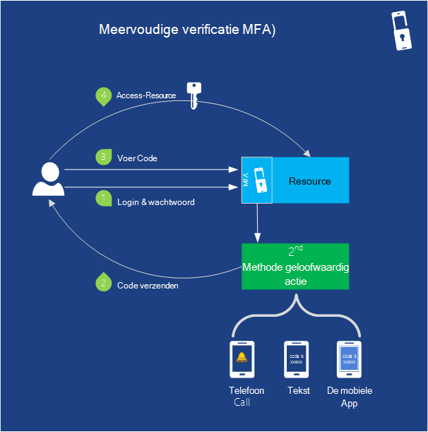   

*Afbeelding: Meervoudige verificatie biedt de functionaliteit voor uw toepassing voor de verificatie van meer dan één vorm van identificatie*

Beveiliging is altijd belangrijk. Meervoudige verificatie (MFA) kunt ervoor zorgen dat alleen de gebruikers zelf toegang hun accounts tot. MFA (ook wel bekend als tweeledige verificatie of '2FA') is vereist gebruikers bieden twee van de volgende drie manieren van de verificatie van de identiteit voor gebruiker aanmeldingen en transacties.

- Wat u weten (meestal een wachtwoord)
- Iets er (een vertrouwde apparaat die niet gemakkelijk gedupliceerd, zoals een telefoon)
- Iets dat u (biometrie)

Dus wanneer een gebruiker zich aanmeldt, u kunt opgeven dat ze moeten ook hun identiteit verifiëren met een mobiele app, een telefoongesprek of een tekstbericht in combinatie met hun wachtwoord. Ondersteunt het gebruik van wachtwoorden als verificatiemethode voor gebruiker aanmeldingen standaard Azure Active Directory. U kunt MFA samen met Azure AD of met aangepaste toepassingen en mappen gebruiken met behulp van de SDK MFA. U kunt ook deze samen met on-premises implementatie-toepassingen gebruiken met behulp van meervoudige verificatie-Server.

**MFA scenario 's**

De beveiliging van de aanmelding op gevoelige accounts zoals bank aanmeldingen en code toegang tot waarvoor onbevoegde toegang een hoge financiële of richtlijnen voor intellectuele eigenschap kosten kan hebben.   

## Mobile

Als u een app voor een mobiel apparaat maakt, kunt Azure opslag van gegevens in de cloud, gebruikers verifiëren en push-meldingen verzenden zonder dat u hoeft te schrijven van een grote hoeveelheid aangepaste code.

Terwijl u de backend voor een mobiele app met virtuele Machines, Cloudservices of Web Apps zeker maken kunt, kunt u veel minder tijd voor het schrijven van de onderdelen van de onderliggende service met behulp van Azure services besteedt.

### Mobiele Apps

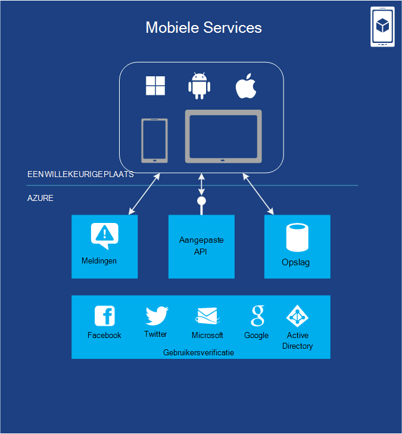

*Afbeelding: Mobiele Apps biedt functionaliteit vaak vereist door de toepassingen die interface met mobiele apparaten.*

Azure Mobile-Apps biedt veel handige functies waarmee u bespaart tijd bij het samenstellen van een backend voor een mobiele toepassing. Dit kunt u eenvoudige inrichting en beheren van de gegevens die zijn opgeslagen in een SQL-Database. U kunt opties voor het opslaan van extra gegevens zoals blobopslag of MongoDB gebruiken met servers code. Mobile-Apps biedt ondersteuning voor meldingen, hoewel in bepaalde gevallen u in plaats daarvan melding Hubs gebruiken kunt zoals hieronder wordt beschreven.  De service, heeft ook een REST API die uw mobiele toepassing voor uw werk kunt bellen. Mobile-Apps bevat ook de mogelijkheid om te verifiëren gebruikers via Microsoft en Active Directory en andere bekende identiteitsprovider zoals Facebook, Twitter en Google.   

U kunt andere Azure-Services zoals Service Bus en werknemer rollen gebruikt, en u kunt verbinding maken met on-premises implementatie systemen. U kunt zelfs 3e partijen invoegtoepassingen uit het archief Azure (zoals SendGrid voor e-mail) gebruiken om aan te bieden extra functionaliteit.

Clientbibliotheken van native voor Android-, iOS-, HTML/JavaScript-, Windows Phone- en Windows Store kunnen u eenvoudiger ontwikkelen voor apps op alle primaire mobiele platforms. Een REST API kunt u de gegevens en verificatie functionaliteit Mobile Services gebruiken met apps op andere platforms. Een service voor eenmalige mobiele kan meerdere clienttoepassingen een back-zodat u een consistente gebruikersinterface op apparaten kan geven.

Omdat Azure al enorme schaal ondersteunt, kunt u het verkeer verwerken terwijl uw app populairder verandert.  Cmdlets voor controle en registratie worden ondersteund om u te helpen oplossen en prestaties te beheren.

### Melding Hubs

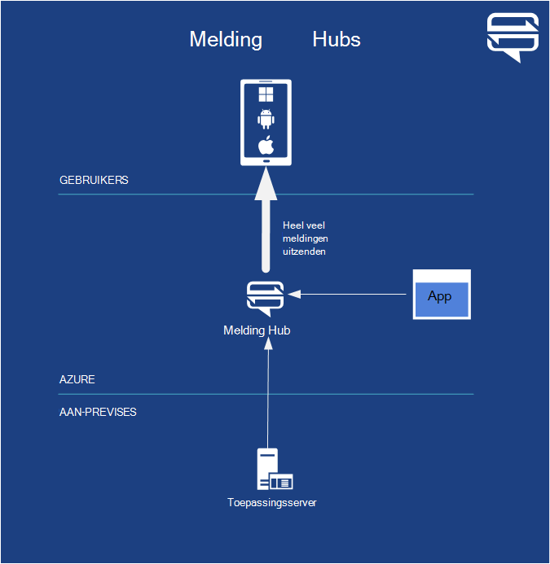  

*Afbeelding: Melding Hubs biedt functionaliteit vaak vereist door de toepassingen die interface met mobiele apparaten.*

Terwijl u de code zodanig meldingen in Azure Mobile-Apps schrijven kunt, is melding Hubs binnen minuten geoptimaliseerd voor uitzending miljoenen van zeer gepersonaliseerde push-meldingen.  U hoeft niet te bang details zoals mobiele carrier of de apparaatfabrikant van het. U kunt afzonderlijke of miljoenen gebruikers met een enkele API-oproep afstemmen.

Melding Hubs is ontworpen voor gebruik met een back-end. U kunt Azure Mobile-Apps, een aangepaste backend in de cloud uitgevoerd op een willekeurige-provider of een on-premises implementatie backend gebruiken.

**Melding Hub-scenario 's** Als u een mobiele spel waar spelers verandert heeft schrijft, moet u mogelijk een melding van speler 2 die speler 1 klaar bent met haar inschakelen. Als dat wordt gevormd door alle die u moet doen, kunt u alleen Mobile-Apps. Maar als u 100.000 gebruikers had spel uw en u wilt een gevoelige gratis aanbieding voor iedereen, melding Hubs het meest geschikte is tijdstip verzenden.

U kunt laatste nieuws, gebeurtenissen en product aankondiging meldingen voor miljoenen gebruikers met een lage latentie Sport verzenden. Ondernemingen kunnen hun werknemers over de nieuwe tijd vertrouwelijke communicatie, zoals verkoopleads, melden zodat werknemers niet hoeft te worden voortdurend controleren e-mail of andere toepassingen op de hoogte blijven. U kunt ook een / permanente-wachtwoorden vereist voor meervoudige verificatie verzenden.

## Back-up
Elke enterprise moet back-up maken en gegevens herstellen. U kunt Azure back-up maken en terugzetten van uw toepassing in de cloud of on-premises implementatie. Azure biedt verschillende opties waarmee afhankelijk van het type back-up.

### Herstel van de site

Azure Site herstel (voorheen Hyper-V herstel Manager) kunt u belangrijke toepassingen beveiligen door de herhaling en herstelbestanden coördineren op sites. Herstel van de site biedt de mogelijkheid voor het beschermen van toepassingen op basis van Hyper-v, VMWare of SAN naar uw eigen secundaire site op de site van een hoster, of Azure en de complexiteit van maken en beheren van uw eigen secundaire locatie en de kosten voorkomen. Azure gegevens worden gecodeerd en communicatie en u hebt de optie versleuteling voor gegevens op andere te schakelen.

Deze de status van uw services continu worden bewaakt en helpt de ordelijk herstel van services in het geval van een storing site op het primaire datacenter automatiseren. Virtuele machines kan op geregiseerde wijze worden gebracht om te helpen met het herstellen van de service snel, zelfs voor complexe met meerdere niveaus werkbelasting.

Herstel van de site werkt met bestaande technologieën zoals Hyper-V Replica, System Center en SQL Server altijd op. [Overzicht van de Azure Site herstel](site-recovery/site-recovery-overview.md) uitchecken voor meer informatie.

### Azure back-up maken
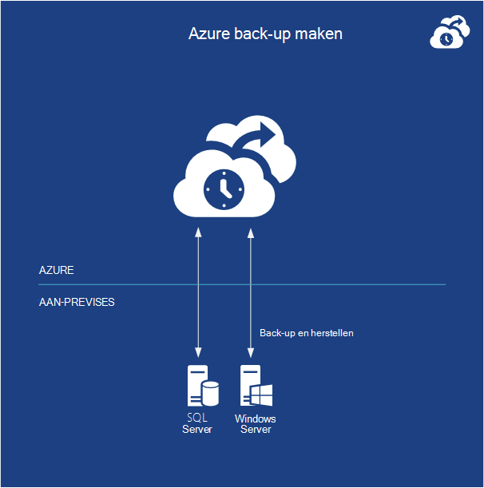  

*Afbeelding: Azure back-up waarin gegevens uit lokale Windows-Servers in de cloud.*  

Azure back-up back-ups van gegevens uit lokale servers met Windows Server in de cloud. U kunt uw back-ups rechtstreeks vanuit de back-hulpprogramma's in Windows Server 2012, Windows Server 2012 Essentials of systeem Center 2012 - Data Protection Manager beheren. U kunt ook een speciale back-agent gebruiken.

Gegevens is veiliger omdat back-ups vóór de overdracht zijn versleuteld en opgeslagen versleutelde in Azure en beveiligd met een certificaat dat u uploaden. Dezelfde gegevens overtollige en uiterst beschikbaar bescherming zijn gevonden in Azure Storage wordt gebruikt door de service.  U kunt een back-up bestanden en mappen op gezette tijden of direct de back-ups van een volledige of incrementele uitgevoerd. Nadat de back-up in de cloud, kunnen bevoegde gebruikers eenvoudig back-ups op een server herstellen. Deze optie ook biedt bewaarbeleid configureerbare gegevens, compressie van gegevens en gegevens overbrengen beperken zodat u de kosten voor het opslaan en gegevens overbrengen kunt beheren.

**Scenario's voor Azure back-up maken**

Als u al met Windows Server of System Center, Azure back-up een natuurlijke oplossing is voor het back-ups van uw bestandssysteem servers, virtuele machines en SQL Server-databases.  Dit werkt met versleutelde, verspreid en gecomprimeerde bestanden. Er gelden enkele beperkingen, moet u [controleren van de back-up van Azure-minimumvereisten](http://technet.microsoft.com/library/dn296608.aspx) eerst.

## Messaging en integratie

Ongeacht wat dit doet, moet de code regelmatig om te communiceren met andere code.  In sommige gevallen, enige die nodig is, is eenvoudige wachtrijtaken messaging. Meer complexe interacties zijn in andere gevallen vereist. Azure biedt een aantal verschillende manieren voor het oplossen van deze problemen. Figuur 5 ziet u de opties.

### Wachtrijen
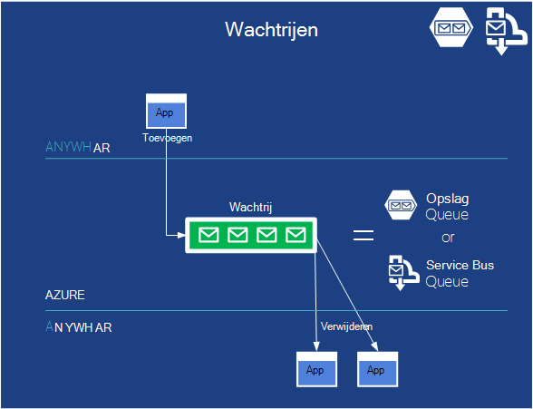

*Afbeelding: Wachtrijen toestaan losse verbinding tussen onderdelen van een toepassing en vergemakkelijken schaalbaarheid.*  

Queuing is een eenvoudige idee: één toepassing een bericht in een wachtrij geplaatst en dat bericht wordt uiteindelijk gelezen door een andere toepassing. Als uw toepassing moet worden alleen deze ingewikkelde service, mogelijk Azure wachtrijen de beste keus.

Vanwege de manier waarop die de Azure na verloop van tijd werden, bieden Azure opslag wachtrijen en Service Bus wachtrijen services, vergelijkbare wachtrij plaatsen. De redenen waarom u zou willen gebruiken elkaar worden beschreven in het vrij technische papier [Azure wachtrijen en Service Bus wachtrijen - vergeleken en Contrasted](http://msdn.microsoft.com/library/azure/hh767287.aspx).  In veel gevallen werkt een op.

**Wachtrij scenario 's**

Vandaag is het wachtrijen worden vaak gebruikt om te laten een web rol exemplaar communiceren met een exemplaar van de rol werknemer binnen dezelfde Cloud Services-toepassing.

Stel dat u een Azure-toepassing voor het delen van video maken. De toepassing bestaat uit PHP-code die wordt uitgevoerd in een Webrol waarmee gebruikers uploaden en bekijk video's, samen met de rol van een werknemer geïmplementeerd in C# die geüploade video in verschillende indelingen zet.

Wanneer een exemplaar van de rol web ontvangt een nieuwe video van een gebruiker, kunt deze opslaan van de video in een blob en vervolgens een bericht verzenden naar een rol werknemer via een wachtrij vertellen deze waar vind ik deze nieuwe video. Een exemplaar werknemer rol-it niet welke één-is van belang en vervolgens het bericht in de wachtrij lezen en de vereiste video vertalingen op de achtergrond uitvoeren.

Asynchrone verwerking structureren van een toepassing op deze manier kunt en deze ook vergemakkelijkt de toepassing schaal, aangezien het aantal exemplaren van web rol en werknemer rol exemplaren onafhankelijk kan variëren. U kunt ook de grootte van de wachtrij gebruiken als een trigger aan de nieuwe schaal het aantal werknemer rollen omhoog en omlaag. Te hoog is, en u meer rollen toevoegen. Wanneer deze lagere ontvangt, kunt u het nummer van de uitvoering van rollen om op te slaan geld verkleinen.  

Zelfs als ze rollen web en werknemer niet gebruikt, kunt u deze hetzelfde patroon tussen veel verschillende gedeelten van uw toepassing.  U kunt de schaal van de onderdelen aan beide zijden van de wachtrij omhoog en omlaag als vraag en verwerkingstijd is vereist.

### Service Bus
Ongeacht of ze worden uitgevoerd in de cloud, in uw datacenter, dat op een mobiel apparaat of ergens anders, moeten toepassingen communiceren. Het doel van Azure Service Bus is om te laten applicaties vrijwel overal gegevensuitwisseling.

Naast de wachtrijen (een-op-) hierboven, biedt Service Bus ook naar andere communicatiemethoden.

#### Service Bus Relay
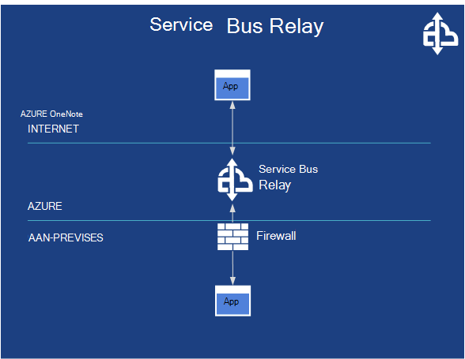

*Afbeelding: Service Bus Relay kunt communicatie tussen toepassingen op verschillende zijden van een firewall.*

Service Bus kunt directe communicatie via de relayservice, een veilige manier om te communiceren via firewalls leveren. Service Bus relais mogelijk dat toepassingen om te communiceren door uitwisseling van berichten via een gehost in de cloud, in plaats van lokaal eindpunt.

**Service Bus Relay scenario 's**

Toepassingen die via Service Bus communiceren mogelijk Azure toepassingen of software uitvoeren op enkele andere cloud-platform. Ze kunnen ook worden toepassingen die echter buiten de cloud, worden uitgevoerd. Bijvoorbeeld Beschouw van een luchtvaartmaatschappij die reserveringsservices in computers binnen een eigen datacenter implementeert. De luchtvaartmaatschappijen moet worden van deze services voor veel clients, inclusief inchecken kiosk in airports, reservering agent overstapstations, en misschien zelfs klanten telefoons. Mogelijk gebruikt via Service Bus hiervoor losse interactie tussen de verschillende toepassingen maken.

#### Service Bus onderwerpen en abonnementen
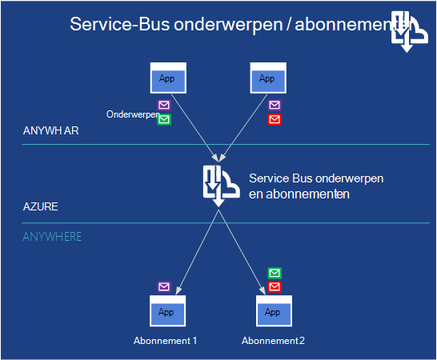   
 *Afbeelding: Service Bus onderwerpen kunnen meerdere apps worden berichten en andere toepassingen kunnen abonneren om te ontvangen van berichten die voldoen aan bepaalde criteria voldoen.*

Service Bus biedt een publiceren en abonnementen om genoemd onderwerpen en abonnementen. Met publish-subscribe, kunt een toepassing berichten verzenden naar een onderwerp, terwijl andere toepassingen abonnementen op dit onderwerp kunnen maken. Hierdoor wordt een-op-veel-communicatie tussen een reeks toepassingen, waardoor hetzelfde bericht door meerdere ontvangers worden gelezen.

**Service Bus onderwerpen en abonnementen scenario 's**

Op elk gewenst moment u deze instelt waar zijn er veel berichten die alle belangrijke zijn, maar verschillende volgende systemen hoeft slechts eenmaal te luisteren naar verschillende subsets van deze communicatie Service Bus onderwerp en abonnementen zijn geschikt.

### BizTalk-Services
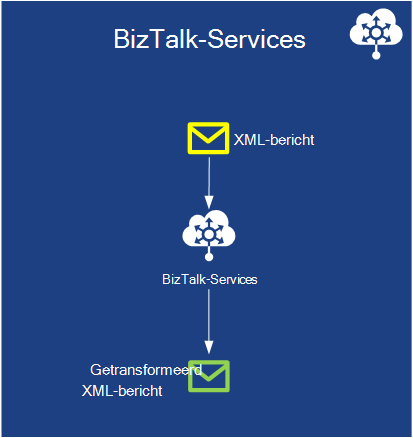   
 *Afbeelding: BizTalk Services biedt de mogelijkheid om te transformeren van XML-berichten indelingen in de cloud.*

Soms moet u systemen die communiceren met verschillende notaties voor SMS-berichten. Dit geldt voor bedrijven met een andere database schema's en XML-indelingen, messaging, zelfs als een gemeenschappelijke standaard beschikbaar zijn. In plaats van een groot aantal aangepaste code schrijven, kunt u BizTalk Server on-premises implementatie naar verschillende systemen integreren.  Azure BizTalk Services biedt hetzelfde type van service, maar in de cloud. U kunt alleen wat u gebruikt en niet bang schaal zoals u zou on-premises implementatie moet betalen.

**BizTalk Services scenario 's**

Business-to-Business (B2B) interacties meestal dit type vertaling is vereist.  Een bedrijf samenstellen vliegtuigen moet bijvoorbeeld bestel onderdelen van de verschillende onderdelen leveranciers. Er is veel onderdelen leveranciers.  Die orders moeten worden geautomatiseerd om rechtstreeks vanuit het vliegtuig kiezen systemen van de systemen leveranciers.  Geen van beide bedrijven wil hun core-systemen en berichtindelingen wijzigen en het hoogstwaarschijnlijk die bestandsindelingen zijn hetzelfde is. BizTalk-Services kunt maken van berichten en tussen de nieuwe indelingen beide manieren vertalen. De leverancier vliegtuig kan het werk om te vertalen of de verschillende leveranciers kunnen, afhankelijk van wie wil meer controle en de hoeveelheid vertaling nodig.     

## Ondersteuning voor berekenen
Azure biedt ondersteuning voor services die niet moeten altijd worden uitgevoerd.  

### Planner

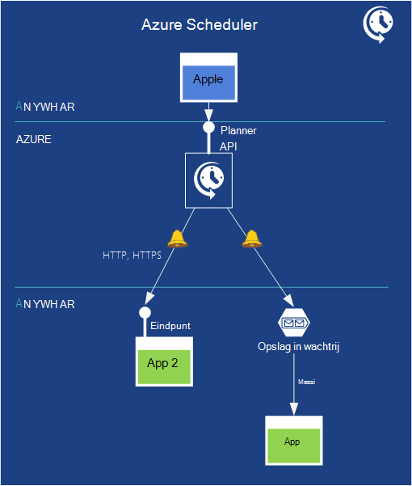   
*Afbeelding: Azure Scheduler biedt een manier om taken te plannen op een bepaald tijdstip voor een specifieke duur.*

Soms moeten toepassingen alleen uitvoeren op een bepaald moment. Klik op Azure, kunt u geld opslaan met dit type app in plaats van een toepassing NET 24 x 7 wachten op gegevens om te verwerken blijven uitvoeren laten. Azure Scheduler kunt u plannen wanneer een toepassing moet uitgevoerd op basis van tijdsinterval tijd of een agenda. Deze betrouwbaar is en dat een proces wordt uitgevoerd evenzeer netwerk, machine en gegevens center mislukken wordt gecontroleerd. U kunt de Scheduler REST API gebruiken voor het beheren van deze acties.

Wanneer een geplande waarschuwing wordt Scheduler HTTP of HTTPS berichten verzendt naar een bepaald eindpunt of een bericht in een wachtrij opslag kunt plaatsen.  Dus moet u beschikken over van de toepassing die u hebt een toegankelijke eindpunt of dit een wachtrij opslag controleren hebt. Zodra het bericht wordt opgehaald, kan deze ongeacht deze wordt geprogrammeerde naar actie uitvoeren.

**Scheduler scenario 's**

- Terugkerende acties in bedrijfstoepassingen: als u bijvoorbeeld een service mogelijk regelmatig gegevens ophalen uit twitter en verzamel de gegevens in een normale feed.
- Dagelijkse onderhoud: Log processing of weghalen, uitvoeren back-ups en andere tijdelijk taken plannen.
- Taken die zijn uitgevoerd nachts.
- Taken van de Web-toepassingen zoals dagelijkse weghalen van Logboeken, back-ups maken, en andere onderhoudstaken. Een beheerder kunt back-ups haar database om 1 uur elke dag voor de volgende negen maanden, bijvoorbeeld.

De API Scheduler kunt maken, bijwerken, verwijderen, weergeven en taak verzamelingen en geplande taken via programmacode beheren.

## Prestaties

Prestaties is altijd belangrijk voor een toepassing. Toepassingen meestal dezelfde gegevens steeds openen. Een manier om de prestaties verbeteren is geen kopie te bewaren van die gegevens dichter naar de toepassing minimaliseren van de tijd die nodig is om op te halen. Azure biedt andere services om dit te doen.

### Caching van Azure

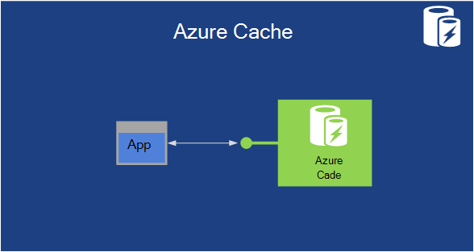   
 **Afbeelding: Een Azure-toepassing kunt gegevens in het geheugen in cache en zelfs over veel werknemer rollen omhoog verdelen**

Toegang tot gegevens die zijn opgeslagen in een van de Azure gegevensbeheer services-SQL-Database, tabellen of BLOB's-behoorlijk snel is. Nog toegang tot gegevens die zijn opgeslagen in het geheugen is nog sneller. Reden kunt behouden een kopie in het geheugen van veelgebruikte gegevens verbeteren de toepassingsprestaties van de. Van Azure in het geheugen cache kunt u dit wilt doen.

Een Cloud Services-toepassing kunt opslag van gegevens in deze cache en vervolgens deze rechtstreeks zonder toegang hebben tot permanente opslag ophalen. De cache kan worden beheerd in van de toepassing VMs of worden verstrekt door VMs specifiek uitsluitend voor caching. In beide gevallen de cache kan worden verdeeld, met de gegevens erin verspreiding over meerdere VMs in een Azure datacenter.

Azure heeft een aantal verschillende cache-technologieën die na verloop van tijd zijn verschoven. In de volgorde waarin ze zijn ingevoerd, is er een gedeeld, in-functie, beheerd en bestand Vgx. cache. De gedeelde caching is een oudere technologie en u nieuwe implementaties niet mag maken met deze. De Cache beheerd heeft dezelfde functies van de cache In-rol, maar als beheerde service buiten de Azure-beheerportal. De Cache bestand Vgx. is in de proefversie. De implementatie bestand Vgx. het grootste getal van functies heeft en u wordt aangeraden wanneer u nieuwe in de cache programmacode schrijven.

**Azure Cache scenario 's**

Een toepassing die net zo vaak een productcatalogus leest mogelijk profiteren van het gebruik van dit soort caching, bijvoorbeeld sinds de gegevens het moet beschikbaar sneller. De technologie ondersteunt ook vergrendelen, zodat deze worden gebruikt met alleen-lezen/schrijven, evenals de alleen-lezen gegevens. En ASP.NET-toepassingen de service kunnen gebruiken voor de opslag van sessiegegevens met alleen een wijziging in de configuratie.

### Netwerk voor Contentlevering
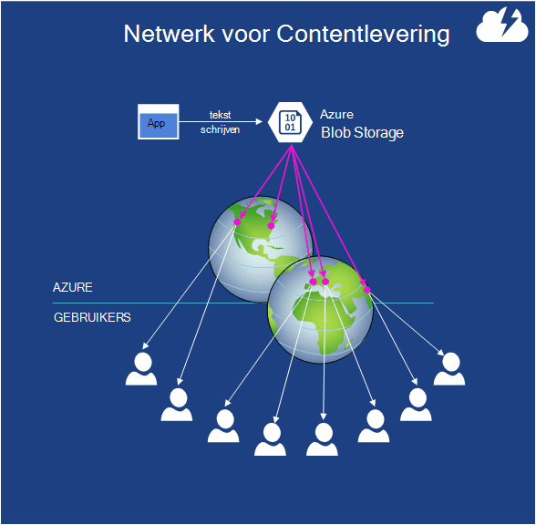   
 **Afbeelding: Kopieën van een blob kunnen worden opgeslagen op sites overal ter wereld.**

Stel dat u nodig hebt om op te slaan blob-gegevens die worden gebruikt door gebruikers overal ter wereld. Het is misschien een video van de meest recente World Cup overeenkomen, bijvoorbeeld stuurprogramma updates of een populaire e-adresboek. Een kopie van de gegevens in meerdere Azure datacenters opslaan helpt, maar als er een groot aantal gebruikers, het is waarschijnlijk niet voldoende. Voor nog betere prestaties, kunt u de CDN Azure.

De CDN heeft tientallen sites overal ter wereld, elk kan worden opgeslagen kopieën van Azure BLOB's. De eerste keer die een gebruiker in een deel van de wereld toegang heeft tot een bepaalde blob, de gegevens in die deze sectie gekopieerd vanuit een Azure datacenter naar lokale CDN-opslag in die Geografie. Hierna wordt gebruikt u toegang uit het deel van de wereld blob kopiëren in cache opgeslagen in de CDN-ze niet nodig om helemaal naar het dichtstbijzijnde datacenter van de Azure te gaan. Het resultaat is sneller toegang tot veelgebruikte gegevens door gebruikers overal ter wereld.

**CDN-scenario 's**

Algemene om CDN met Media-Services gebruiken om video overal ter wereld is. Video is meestal grote en een groot aantal bandbreedte vereist.  Media Services is elders besproken op deze pagina.

## BIG Data en groot berekenen

### HDInsight (Hadoop)
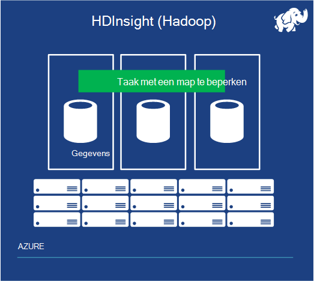   
 **Afbeelding: HDInsight helpt bij de verwerking bulksgewijs van grote hoeveelheden gegevens**

Jaren, heeft het grootste deel van gegevensanalyse plaatsgevonden van relationele gegevens die zijn opgeslagen in een datawarehouse op basis van een relationele DBMS. Dit soort business analytics nog steeds belangrijk is, en wordt deze lange tijd om uit te komen. Maar wat gebeurt er als de gegevens die u wilt analyseren is zo groot dat relationele databases NET kunnen niet verwerkt door? En stel dat de gegevens niet relationele? Het kan zijn logboeken op de server in een datacenter, bijvoorbeeld of historische gebeurtenisgegevens van sensoren of iets anders. In geval kan er hebt u wat een probleem met grote gegevens wordt genoemd. Moet u een andere methode.

De dominante technologie vandaag voor het analyseren van gegevens groot is Hadoop. Een Apache bronproject opent en deze technologie slaat van gegevens met behulp van de Hadoop Distributed bestand System (HDFS) en vervolgens kan ontwikkelaars maken MapReduce taken om die gegevens te analyseren. HDFS dubbele gegevens over meerdere servers, en vervolgens wordt uitgevoerd gedeelten van de taak MapReduce op elkaar, zodat de grote gegevens worden verwerkt.

HDInsight is de naam van Apache Hadoop op basis van de Azure-service. HDInsight kunt HDFS opslag van gegevens op het cluster en deze verdelen over meerdere VMs. Deze ook dubbele de logica van een taak MapReduce over deze VMs. Net zoals met on-premises implementatie Hadoop, gegevens zich verwerkte lokaal, de logica en de gegevens die deze werkt op in dezelfde VM- en parallel voor betere prestaties. HDInsight kan gegevens ook opslaan in Azure opslag kluis (Luchtverzadigingswaarde), waarbij gebruik BLOB's wordt.  Luchtverzadigingswaarde gebruikt, kunt u geld besparen omdat u kunt uw cluster HDInsight wanneer u niet in gebruik verwijderen, maar nog steeds uw gegevens blijven opslaan in de cloud.

HDinsight ondersteunt andere onderdelen van het Hadoop-systeem, inclusief component en varken. Microsoft heeft ook gemaakt onderdelen die het gemakkelijker maken om te werken met gegevens die zijn gemaakt met de HDInsight traditionele BI-functies, zoals de HiveODBC-adapter gebruiken en Data Explorer die werken met Excel.

### High-Performance Computing (groot berekenen)

Een van de meest aantrekkelijk manieren om een cloud-platform is om uit te voeren high performance computing (HPC) en andere toepassingen "Groot berekenen". Voorbeelden hiervan zijn gespecialiseerde technische toepassingen die zijn ontworpen om te gebruiken van de standaard-bericht Passing Interface (MPI), evenals de zogenaamde embarrassingly parallelle toepassingen, zoals financiële risicomodellen.

De essentie van grote berekenen wordt programmacode uitgevoerd op meerdere computers tegelijk. Op Azure machines deze betekent dat met veel virtuele tegelijk, alle werken parallel sommige probleem op te lossen. Hiervoor moet de andere manier naar bronnen en toepassingen, dat wil zeggen plannen, naar hun werk verdelen over deze exemplaren. Microsoft gratis HPC Inpakken en andere berekeningscluster clusteroplossingen kunnen uitvoeren ook in Azure, profiteert van Azure berekenen en de infrastructuur van services capaciteit op aanvraag toevoegen aan een berekeningscluster on-premises implementatie of groot berekenen toepassingen uitvoeren volledig in de cloud.

Azure biedt een bereik van VM exemplaar formaten met verschillende configuraties van CPU cores, geheugen schijf en andere kenmerken om te voldoen aan de vereisten van andere toepassingen. Het onlangs heeft geïntroduceerd A8 en A9 exemplaren werk voor veel berekenen intensief werkbelasting en parallelle MPI toepassingen met name omdat ze hoge snelheid, multicore CPU's en grote hoeveelheden geheugen hebben. In bepaalde configuraties profiteren de exemplaren van een toepassingennetwerk met een lage latentie en hoge gegevensdoorvoer in de cloud met externe directe geheugen access (RDMA) technologie voor maximale efficiëntie van parallelle MPI-toepassingen.

Azure ook biedt softwareontwikkelaars groot berekenen en partners een volledige reeks berekeningscluster mogelijkheden, services, architectuur keuzen en ontwikkeling's. Azure ondersteunt aangepaste groot berekenen werkstromen werkstromen gespecialiseerde gegevens betrekking hebben op personen en taak en patronen die kunnen worden aangepast tot duizenden voor taakplanning cores berekenen.

## Media

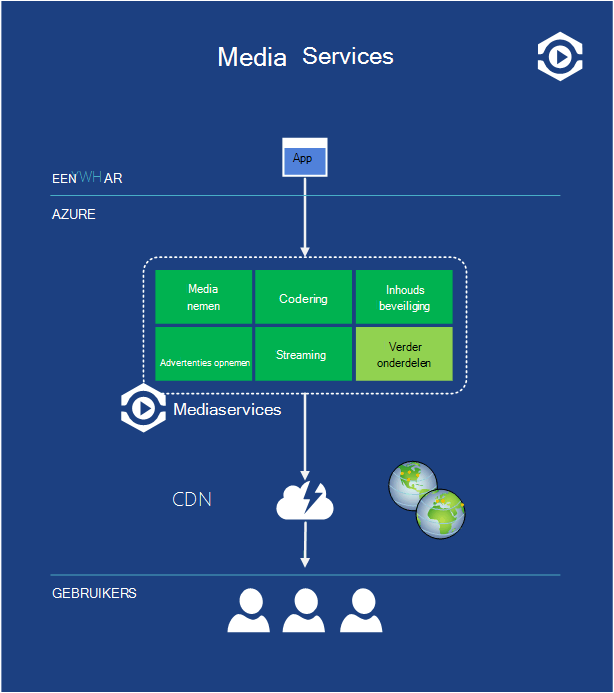   
 **Afbeelding: Mediaservices is een platform voor toepassingen die video en andere media voor clients overal ter wereld.**

Video een grote onderdeel uitmaakt van internetverkeer vandaag, en wordt dat percentage indrukwekkende morgen. Nog niet eenvoudige leveren video op het web is. Zijn er een groot aantal variabelen, zoals de algoritme van de versleuteling en de weergaveresolutie van de van het scherm van de gebruiker. Video ook vaak bursts in aanvraag, zoals een Prikker zaterdag 's nachts wanneer een groot aantal personen besluit dat ze willen een online film te bekijken.

De populariteit gegeven, is een veilige relevante treffers dat veel nieuwe toepassingen die video gebruiken wordt gemaakt. Nog al deze nodig hebt voor het oplossen van sommige van deze problemen en het maken van elkaar deze oplossen op een eigen maakt geen zin. Een betere benadering is het opzetten van een platform met veelgebruikte oplossingen voor veel toepassingen gebruiken. En dit platform in de cloud samenstellen heeft enkele voordelen wissen. Het kan zijn ruim zijn beschikbaar op basis van pay-as-you-go en deze kan ook omgaan met de variaties van de vraag die vaak video-toepassingen te maken.

Azure Media Services-adressen voor dit probleem. Deze biedt een reeks cloud-onderdelen die leven gemakkelijker voor mensen maken en uitvoeren met media, video en andere toepassingen.

Als de afbeelding wordt weergegeven, biedt Media Services een reeks onderdelen voor toepassingen die met video en andere media werken. Deze bevat bijvoorbeeld een media nemen component video uploaden naar Media-Services (waar deze worden opgeslagen in Azure BLOB's), een codering onderdeel die ondersteuning biedt voor verschillende video en audio-indelingen, een inhoudsbeveiliging-onderdeel waarmee (digital rights management), een onderdeel voor advertenties invoegen in een video-stream, components voor streaming en meer. Microsoft-partners kunnen ook onderdelen bieden voor het platform en vervolgens Microsoft distribueren die onderdelen en factureren namens hen hebt.

Toepassingen die gebruikmaken van deze platform kunnen worden uitgevoerd op Azure of ergens anders. Bijvoorbeeld een bureaubladtoepassing voor een huis videoproductie kunt mogelijk de gebruikers video uploaden naar Media-Services, klikt u vervolgens verwerken op verschillende manieren. Een service beheer van webinhoud cloudgebaseerde op Azure mogelijk ook afhankelijk zijn van Media-Services te verwerken en distribueren van de video. Afhankelijk van waar deze wordt uitgevoerd en wat de optie doet, kiest elke toepassing welke onderdelen die moet worden gebruikt, opent deze via RESTful interfaces.

Als u wilt verspreiden wat is het resultaat, een toepassing gebruik van de Azure CDN, een andere CDN, of gewoon bits rechtstreeks naar gebruikers wordt gestuurd. Echter wordt er, video die zijn gemaakt met behulp van Media Services kan worden gebruikt door verschillende clientsystemen, met inbegrip van Windows, Macintosh, HTML 5, iOS, Android, Windows Phone, Flash en Silverlight. Het doel is het gemakkelijker maken om moderne mediatoepassingen te maken.

**Verwijzingen**

Download de [Poster van Azure Media Services]voor een meer visuele weergave van de werking van Media Services,[Azure Media Services Poster].

## Commerce

De stijging van Software als Service is transformeren hoe we toepassingen maken. Dit wordt ook transformeren hoe we verkopen toepassingen. Aangezien een toepassing voor SaaS bevindt zich in de cloud, is het handig dat de potentiële klanten voor online-oplossingen. En deze wijziging is van toepassing op gegevens ook over toepassingen. Waarom niet mag personen zoeken in de cloud verkrijgbare gegevenssets? Microsoft-adressen voor beide van deze problemen met het [Azure Marketplace](https://azure.microsoft.com/marketplace/).

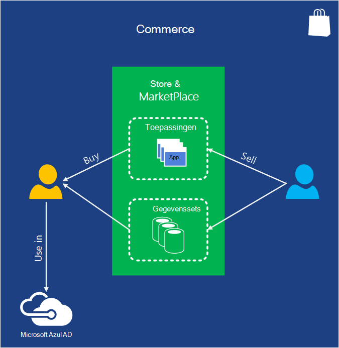   
 **Afbeelding: Azure Marketplace en Azure Store kunt u vinden en Azure-toepassingen en commerciële gegevenssets kopen en deze gebruiken als onderdeel van uw Azure-toepassingen.**

Het verschil tussen de twee is dat Marketplace buiten de beheerportal Azure, maar de Store zijn toegankelijk vanaf binnen de portal. Potentiële klanten kunnen zoeken als u wilt zoeken naar Azure toepassingen die hun behoeften. Klanten kunnen zoeken voor commerciële gegevenssets, met inbegrip van demografische gegevens, financiële gegevens, geografische gegevens en meer. Als ze iets dat die ze graag wilt vinden, ze toegang tot deze hetzij van de leverancier, rechtstreeks via de weblocaties Marketplace of Store of in sommige gevallen uit de beheerportal. Toepassingen kunnen de API voor het zoeken van Bing ook gebruiken door de Marketplace, zodat ze toegang krijgt tot de resultaten van zoekacties op het web.

**Commerce-scenario 's**

SendGrid is een toepassing in de winkel Azure waarmee u om e-mail te verzenden. Beschikt u over extra functionaliteit zoals betrouwbaar bezorging en statistieken worden aangepast.  U kunt deze toepassing en de gerelateerde services kopen plaats probeert te maken van dergelijke infrastructuur zelf.  

## Aan de slag

Nu dat u het totaalbeeld hebt, wordt de volgende stap is om te schrijven van uw eerste Azure-toepassing. Selecteer uw taal, [de juiste SDK krijgen](/downloads/), en probeer het maar. Cloud computing de nieuwe standaardindeling--is nu aan de slag.

[Azure Media Services Poster]: http://azure.microsoft.com/documentation/infographics/media-services/
