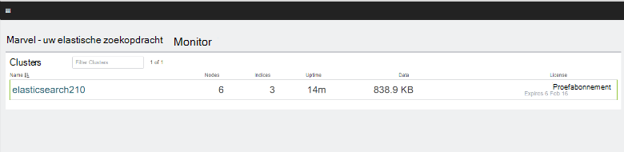

<properties
   pageTitle="Maken van een prestaties omgeving testen op Elasticsearch | Microsoft Azure"
   description="Het instellen van een omgeving voor het testen van de prestaties van een cluster Elasticsearch."
   services=""
   documentationCenter="na"
   authors="dragon119"
   manager="bennage"
   editor=""
   tags=""/>

<tags
   ms.service="guidance"
   ms.devlang="na"
   ms.topic="article"
   ms.tgt_pltfrm="na"
   ms.workload="na"
   ms.date="09/22/2016"
   ms.author="masashin"/>
   
# <a name="creating-a-performance-testing-environment-for-elasticsearch-on-azure"></a>Maken van een prestaties omgeving voor Elasticsearch op Azure testen

[AZURE.INCLUDE [pnp-header](../../includes/guidance-pnp-header-include.md)]

In dit artikel maakt [deel uit van een reeks](guidance-elasticsearch.md). 

In dit document wordt beschreven hoe voor het instellen van een omgeving voor het testen van de prestaties van een cluster Elasticsearch. Deze configuratie is gebruikt om te testen van de prestaties van gegevens opname en query werkbelastingen, zoals wordt beschreven in [afstemmen gegevens opname prestaties voor Elasticsearch op Azure][].

De prestaties testen proces gebruikt [Apache JMeter](http://jmeter.apache.org/), met de [standaardset](http://jmeter-plugins.org/wiki/StandardSet/) geïnstalleerd in de configuratie van een basispagina/medewerkers met een set speciale VMs (die geen deel uitmaakt van het cluster Elasticsearch) specifiek is geconfigureerd voor het doel-Plug-ins. 

De [PerfMon Server-Agent](http://jmeter-plugins.org/wiki/PerfMonAgent/) is geïnstalleerd op elk knooppunt Elasticsearch. De volgende secties bevatten instructies voor het opnieuw te maken van de testomgeving zodat u kunt uw eigen prestaties testen met JMeter leiden. Deze instructies wordt ervan uitgegaan dat u al een Elasticsearch cluster met verbonden met een Azure virtuele netwerk knooppunten hebt gemaakt. 

Houd er rekening mee dat de testomgeving ook wordt uitgevoerd als een set Azure VMs beheerd via een enkele Azure resourcegroep.

[Marvel](https://www.elastic.co/products/marvel) is ook geïnstalleerd en geconfigureerd voor het inschakelen van de interne aspecten van het cluster Elasticsearch moeten worden bewaakt en geanalyseerd eenvoudiger. Als de statistieken JMeter had een piek of dieptepunt prestaties, kan deze informatie beschikbaar via de Marvel bijzonder nuttig om vast te stellen van de oorzaak van het schommelingen zijn.

De volgende afbeelding ziet u de structuur van het gehele systeem. 


Houd rekening met de volgende punten:

- Het model JMeter VM wordt uitgevoerd van Windows Server bieden van de grafische gebruikersinterface-omgeving voor de JMeter-console. De VM JMeter outmodel biedt de grafische gebruikersinterface (de *jmeter* toepassing) om in te schakelen een tester tests maken, tests uitvoeren en de resultaten visualiseren. Deze VM coördinaten met de server JMeter VMs die daadwerkelijk de aanvragen waaruit de tests te verzenden.

- De onderliggende VMs JMeter Ubuntu-Server (Linux) wordt uitgevoerd, wordt er geen vereiste grafische gebruikersinterface voor deze VMs. De server JMeter VMs de JMeter server-software (de *jmeter -* servertoepassing) voor het versturen van aanvragen aan het cluster Elasticsearch uitvoeren.

- Speciale client knooppunten zijn niet gebruikt, maar speciale basispagina knooppunten zijn.

- Het aantal gegevensknooppunten in het cluster kan variëren, afhankelijk van het geteste scenario.

- Alle knooppunten in het cluster Elasticsearch uitvoeren Marvel naar toekijken prestaties gedurende runtime, en de JMeter Server-Agent voor het verzamelen van controlegegevens voor latere analyse.

- Bij het testen van Elasticsearch 2.0.0 en later een van de gegevensknooppunten ook Kibana hebt uitgevoerd. Dit is vereist door de versie van Marvel die wordt uitgevoerd op Elasticsearch 2.0.0 en hoger.

## <a name="creating-an-azure-resource-group-for-the-virtual-machines"></a>Maken van een Azure resourcegroep voor de virtuele machines

De basispagina JMeter moet verbinding maken met elk van de knooppunten in het cluster Elasticsearch prestatiegegevens verzamelen. Als de JMeter VNet van het cluster Elasticsearch VNet verschilt, klikt u vervolgens dit houdt in dat elk knooppunt Elasticsearch configureren met een openbare IP-adres. Als dit is een probleem met de configuratie Elasticsearch, houd rekening met het VMs JMeter implementeren in de dezelfde VNet als Elasticsearch cluster met behulp van dezelfde resourcegroep, in dat geval kunt u weglaten deze eerste procedure.

Eerste, [een resourcegroep maken](../resource-group-template-deploy-portal.md). In dit document wordt ervan uitgegaan dat uw resourcegroep *JMeterPerformanceTest*naam. Als u de VMs JMeter worden uitgevoerd in de dezelfde VNet als het cluster Elasticsearch wilt, gebruikt u dezelfde resourcegroep als dat cluster in plaats van een nieuwe id maken.

## <a name="creating-the-jmeter-master-virtual-machine"></a>De JMeter basispagina virtuele machine maken

Volgende [maken van een Windows-VM](../virtual-machines/virtual-machines-windows-hero-tutorial.md) met de *Windows Server 2008 R2 SP1* -afbeelding.  Het is raadzaam om de grootte van een VM met voldoende cores en het geheugen het testen van de prestaties te selecteren. In het ideale geval dit is een computer met ten minste 2 cores en 3,5 GB RAM (A2 standaard of groter te maken).

<!-- TODO add info on why disabling diagnostics is positive --> 

Het is raadzaam de diagnostische hulpprogramma's uit te schakelen. Wanneer u de VM maakt in de portal, dit gebeurt op het blad *Instellingen* in de sectie *Monitoring* onder *Diagnostische gegevens*. Laat de andere instellingen op de standaardwaarden.

Controleer of dat de VM en alle bijbehorende hulpbronnen zijn gemaakt door [de resourcegroep onderzoeken](../azure-portal/resource-group-portal.md#manage-resource-groups) in de portal. De resources moeten bestaan uit een VM, een beveiligingsgroep netwerk en een openbare IP-adres met dezelfde naam en interface en hetzelfde opslag netwerkaccount met namen op basis van die van VM.

## <a name="creating-the-jmeter-subordinate-virtual-machines"></a>Maken van de JMeter onderliggende virtuele machines

Nu [een VM Linux maken](../virtual-machines/virtual-machines-linux-quick-create-portal.md) met de afbeelding *Ubuntu Server 14.04 LTS* .  Net als met de JMeter basispagina VM, de grootte van een VM met voldoende cores en het geheugen het testen van de prestaties te selecteren. In het ideale geval dit is een computer met ten minste 2 cores en ten minste 3,5 GB RAM (standaard A2 of groter te maken).

Nogmaals, is het raadzaam de diagnostische hulpprogramma's uit te schakelen.

U kunt zo veel onderliggende VMs naar wens kunt maken. 

## <a name="installing-jmeter-server-on-the-jmeter-subordinate-vms"></a>JMeter server installeren op de onderliggende VMs JMeter

De onderliggende VMs JMeter Linux worden uitgevoerd en al dan niet standaard kunt u deze via een verbinding met extern bureaublad (RDP). In plaats daarvan kunt u op elke VM [gebruiken stopverf om een opdrachtregel-venster te openen](../virtual-machines/virtual-machines-linux-mac-create-ssh-keys.md) .

Zodra u hebt verbonden met een van de onderliggende VMs, gebruiken we we vaker doen JMeter instellen.

Installeer eerst de Java Runtime-omgeving die moet worden uitgevoerd JMeter.

```bash
sudo add-apt-repository ppa:webupd8team/java
sudo apt-get update
sudo apt-get install oracle-java8-installer
```

Nu kunt u de software JMeter is geleverd als een zip-bestand downloaden.

```bash
wget http://apache.mirror.anlx.net/jmeter/binaries/apache-jmeter-2.13.zip
```

De opdracht unzip installeren en deze gebruiken om uit te vouwen van de software JMeter. De software wordt gekopieerd naar een map genaamd **apache-jmeter-2,13**.

```bash
sudo apt-get install unzip
unzip apache-jmeter-2.13.zip
```

Wijzigen met de *bin* -directory vasthouden van de JMeter uitvoerbare bestanden en de programma's *jmeter-server* en *jmeter* uitvoerbare kunt aanbrengen.

```bash
cd apache-jmeter-2.13/bin
chmod u+x jmeter-server
chmod u+x jmeter
```

Nu kunnen we nodig om het bestand te bewerken `jmeter.properties` zich in de huidige map (Gebruik de teksteditor u meest bekend met, zoals *vi* of *vim bent*). Zoek de volgende regels:

```yaml
...
client.rmi.localport=0
...
server.rmi.localport=4000
...
```

Verwijder de opmerkingen bij (de regelafstand verwijderen \## tekens) en deze regels wijzigen, zoals hieronder, sla het bestand op en sluit de editor:

```yaml
...
client.rmi.localport=4441
...
server.rmi.localport=4440
```

Nu, voert u de volgende opdrachten poort 4441 binnenkomende TCP-verkeer te openen (dit is de poort die u zojuist hebt geconfigureerd *jmeter-server* op luistert):

```bash
sudo iptables -A INPUT -m state --state NEW -m tcp -p tcp --dport 4441 -j ACCEPT
```

Download het zip-bestand met de standaard verzameling Plug-ins voor JMeter (deze plug-ins bevatten prestaties controleren items) en klikt u vervolgens het bestand naar de map **apache-jmeter-2,13** unzip. Het bestand op deze locatie ritsen, wordt de Plug-ins in de juiste map geplaatst.

Als u wordt gevraagd of u de licentie-bestand te vervangen, typt u A (voor alle):

```bash
wget http://jmeter-plugins.org/downloads/file/JMeterPlugins-Standard-1.3.0.zip
unzip JMeterPlugins-Standard-1.3.0.zip
```

Gebruik `nohup` de server JMeter op de achtergrond te starten. Dit moet reageren door een proces-ID en een bericht aangegeven dat dit een extern object heeft gemaakt en gereed is voor het ontvangen van de opdrachten weer te geven.  Voer de volgende opdracht in de adreslijst ~/apache-jmeter-2.13/bin. 

```bash
nohup jmeter-server &
```

> [AZURE.NOTE]Het programma van de server JMeter wordt beëindigd als de VM afgesloten is. U moet verbinding maken met de VM en start u het opnieuw handmatig opnieuw. U kunt ook kunt u de opdracht *jmeter-server* automatisch bij het opstarten uitgevoerd door toe te voegen van de volgende opdrachten aan de `/etc/rc.local` bestand (voordat u de opdracht *afsluiten 0* ):

```bash
sudo -u <username> bash << eoc
cd /home/<username>/apache-jmeter-2.13/bin
nohup ./jmeter-server &
eoc
```

Vervang `<username>` met uw aanmeldingsnaam.

U mogelijk handiger om te behouden de terminal-venster openen, zodat u de voortgang van de server JMeter controleren kunt terwijl testen uitgevoerd wordt.

U moet Herhaal deze stappen voor elke onderliggende VM JMeter.

## <a name="installing-the-jmeter-server-agent-on-the-elasticsearch-nodes"></a>Installatie van de Server JMeter Agent op de knooppunten Elasticsearch

Deze procedure wordt ervan uitgegaan dat u login toegang tot de knooppunten Elasticsearch hebben. Als u het gebruik van de sjabloon resourcemanager cluster hebt gemaakt, kunt u verbinding met elk knooppunt via het vak sprong VM, zoals in het gedeelte van de topologie Elasticsearch van [Elasticsearch uitgevoerd op Azure](guidance-elasticsearch-running-on-azure.md). U kunt verbinding maken met het sprong vak stopverf ook gebruiken. 

Hierin kunt u de *ssh* -opdracht voor aanmelding bij elk van de knooppunten in het cluster Elasticsearch.

Meld u als beheerder aan bij een van de knooppunten Elasticsearch.  Voer de volgende opdrachten voor het maken van een map voor het vasthouden van de Server JMeter Agent en verplaats naar die map bij de opdrachtprompt we vaker doen:

```bash
mkdir server-agent
cd server-agent
```

Voer de volgende opdrachten voor het installeren van de opdracht *pak* (als dit nog niet is gebeurd), de JMeter Server Agent-software downloaden en pak dit:

```bash
sudo apt-get install unzip
wget http://jmeter-plugins.org/downloads/file/ServerAgent-2.2.1.zip
unzip ServerAgent-2.2.1.zip
```
 
Voer de volgende opdracht uit de firewall configureren en inschakelen van TCP-verkeer via poort 4444 (dit is de poort die wordt gebruikt door de Server JMeter Agent):

```bash
sudo iptables -A INPUT -m state --state NEW -m tcp -p tcp --dport 4444 -j ACCEPT
```

Voer de volgende opdracht naar de Server JMeter Agent start op de achtergrond:

```bash
nohup ./startAgent.sh &
```

De Server JMeter Agent moet reageren met berichten die aangeeft dat deze is gestart en op poort 4444 luistert.  Druk op Enter om te verkrijgen van een opdrachtprompt en voer de volgende opdracht uit.

```bash
telnet <nodename> 4444
```

Vervang `<nodename>` met de naam van uw knooppunt. (U kunt de naam van uw knooppunt vinden door te voeren de `hostname` opdracht.) Deze opdracht opent een Telnet-verbinding met poort 4444 op uw lokale computer. U kunt deze verbinding gebruiken om te bevestigen dat de Server JMeter Agent juist wordt uitgevoerd.

Als de Server JMeter Agent niet wordt uitgevoerd, ontvangt u het antwoord 

`*telnet: Unable to connect to remote host: Connection refused*.`

Als de Server JMeter Agent wordt uitgevoerd en poort 4444 correct is geconfigureerd, ziet u het volgende antwoord:


> [AZURE.NOTE] De telnetsessie biedt geen verloop prompt nadat dit is aangesloten.

Typ de volgende opdracht in de telnetsessie:

``` 
test
```

Als de JMeter Server-Agent is geconfigureerd en correct luistert, moet deze geven aan dat deze de opdracht ontvangen en beantwoorden met het bericht *Yep*.

> [AZURE.NOTE]U kunt typen in andere opdrachten verkrijgen prestaties-gegevens bewaken. Bijvoorbeeld, de opdracht `metric-single:cpu:idle` krijgt u de huidige deel van de tijd die de Processorsnelheid niet-actief is (dit is een momentopname). Voor een volledige lijst met opdrachten, gaat u naar de pagina [PerfMon Server Agent](http://jmeter-plugins.org/wiki/PerfMonAgent/) . : Terug naar het bellen van deze hij Perfmon Server Agent. >>

Typ in het telnetsessie, de volgende opdracht om de sessie afsluiten en wilt teruggaan naar de opdrachtprompt we vaker doen:

``` 
exit
```

> [AZURE.NOTE]Als u met de JMeter onderliggende VMs, als u zich afmeldt of als deze computer afgesloten is en opnieuw gestart de JMeter Server-Agent moet handmatig opnieuw worden gestart met behulp van de `startAgent.sh` opdracht. Als u wilt dat de Server JMeter Agent automatisch wordt gestart, de volgende opdracht toevoegen aan het einde van de `/etc/rc.local` bestand, voordat u de opdracht *0 afsluiten* . 
> Vervang `<username>` met uw aanmeldingsnaam:

```bash
sudo -u <username> bash << eoc
cd /home/<username>/server-agent
nohup ./startAgent.sh &
eoc
```

U kunt nu al herhaalt u deze hele procedure voor elke andere knooppunt in het cluster Elasticsearch of kunt u de `scp` opdracht naar de server-agent map en de inhoud ervan kopiëren naar elke andere knooppunt en gebruik de `ssh` opdracht JMeter Server Agent te starten zoals hieronder wordt weergegeven. e vervangen `<username>` met uw gebruikersnaam en `<nodename>` met de naam van het knooppunt wanneer u wilt kopiëren en uitvoeren van de software (u mogelijk gevraagd om uw wachtwoord als u elke opdracht worden uitgevoerd):

```bash
scp -r \~/server-agent <username>@<nodename>:\~
ssh <nodename> sudo iptables -A INPUT -m state --state NEW -m tcp -p tcp --dport 4444 -j ACCEPT
ssh <nodename> -n -f 'nohup \~/server-agent/startAgent.sh'
```

## <a name="installing-and-configuring-jmeter-on-the-jmeter-master-vm"></a>Installeren en configureren van JMeter op de basispagina VM JMeter

Klik in de portal Azure op **resourcegroepen**. Klik in het blad **resourcegroepen** op met de JMeter diamodel en de onderliggende VMs resourcegroep.  Klik in het blad **resourcegroep** op de **basispagina VM JMeter**. Klik in het blad VM, klik op de werkbalk op **verbinding maken**. Open het RDP-bestand wanneer u hierom in de webbrowser. Windows Hiermee maakt u een verbinding met extern bureaublad voor uw VM.  Voer de gebruikersnaam en wachtwoord voor de VM wanneer hierom wordt gevraagd.

In de VM, met Internet Explorer, gaat u naar de pagina [Java downloaden voor Windows](http://www.java.com/en/download/ie_manual.jsp) . Volg de instructies voor het downloaden en uitvoeren van het installatieprogramma van Java.

In de webbrowser, gaat u naar de pagina [Apache JMeter downloaden](http://jmeter.apache.org/download_jmeter.cgi) en downloaden van de zip met de meest recente binair getal. Sla de zip in een handige locatie op uw VM.

Ga naar de site [Aangepast JMeter Plug-ins](http://jmeter-plugins.org/) en download het Standard instellen van Plug-ins. Sla de zip in dezelfde map als het JMeter downloaden uit de vorige stap.

Ga in Windows Verkenner naar de map met de apache-jmeter -*lengte* zip-bestand, waar *lengte* is voor de huidige versie van JMeter. Pak de bestanden in de huidige map.

Pak de bestanden in de JMeterPlugins-standaard -*yyy*ZIP-bestand, waarbij *yyy* de huidige versie van de Plug-ins, in de apache-jmeter -*lengte* map. Hiermee wordt de Plug-ins toegevoegd aan de juiste map voor JMeter. U kunt veilig de mappen bibliotheek samenvoegen op en overschrijf de licentie en Leesmij-bestanden wanneer hierom wordt gevraagd.

Ga naar de apache-jmeter -**lengte/bin map en bewerken de jmeter.properties bestand met Kladblok.  In de `jmeter.properties` bestand, zoek de sectie gekenmerkt *externe hosts en RMI configuratie*.  In deze sectie van het bestand, vindt u de volgende regel:

```yaml
remote_hosts=127.0.0.1
```

Deze regel wijzigen en vervang de IP-adres 127.0.0.1 met komma's gescheiden lijst met IP-adressen of hostnamen voor elk van de onderliggende JMeter-servers. Bijvoorbeeld:

```yaml
remote_hosts=JMeterSub1,JMeterSub2
```

Zoek de volgende regel en klik op verwijderen de `#` teken aan het begin van de regel en te wijzigen van de waarde van de instellingen voor client.rmi.localport uit:

```yaml
#client.rmi.localport=0
```

Aan:

```yaml
client.rmi.localport=4440
```

Sla het bestand en sluit Kladblok af. 

In de Windows-werkbalk, klik op **Start**, **Systeembeheer**en klik vervolgens op **Windows Firewall met geavanceerde beveiliging**.  Klik in het venster Windows Firewall met geavanceerde beveiliging, in het linkerdeelvenster met de rechtermuisknop op **Regels voor binnenkomende verbindingen**en klik vervolgens op **Nieuwe regel**.

Klik in de **Inkomende Wizard nieuwe regel**op de pagina **Type regel** **poort**selecteren en klik vervolgens op **volgende**.  Selecteer op de pagina protocollen en poorten, **TCP**, selecteert u **specifieke lokale poorten**, typt u in het tekstvak `4440-4444`, en klik op **volgende**.  Klik op de pagina actie selecteert u **toestaan de verbinding**en klik vervolgens op **volgende**. Klik op de profielpagina, laat u alle opties ingeschakeld en klik op **volgende**.  Klik op de pagina naam in de **naam** tekstvak Typ *JMeter*, en klik vervolgens op **Voltooien**.  Sluit het venster Windows Firewall met geavanceerde beveiliging.

In Windows Verkenner, in de apache-jmeter - map**xx/bin, dubbelklik op het bestand *jmeter* Windows batch om te starten van de grafische gebruikersinterface. De gebruikersinterface moet worden weergegeven:


Klik op **uitvoeren**in de menubalk op **Externe starten**en controleer of de twee JMeter onderliggende machines worden weergegeven:


U bent nu klaar om te beginnen prestaties testen.

## <a name="installing-and-configuring-marvel"></a>Installeren en configureren van Marvel

De sjabloon Elasticsearch Quickstart voor Azure installeren en configureren van de juiste versie van Marvel automatisch als u de MARVEL en KIBANA parameters op true ("Ja") bij het maken van het cluster instellen:


Als u Marvel aan een bestaand cluster toevoegt, moet u handmatig de installatie uitvoert en het proces verschilt afhankelijk van of u van Elasticsearch versie gebruikmaakt 1.7.x of 2.x, zoals wordt beschreven in de volgende procedures uit.

### <a name="installing-marvel-with-elasticsearch-173-or-earlier"></a>Installatie van Marvel met Elasticsearch 1,73 of lager

Als u Elasticsearch 1.7.3 gebruikt of eerder, de volgende stappen *op elk knooppunt* in het cluster uitvoeren:

- Meld u aan bij het knooppunt en verplaatsen naar de basismap Elasticsearch.  Klik op Linux, typische basismap is `/usr/share/elasticsearch`.

-  Voer de volgende opdracht downloaden en installeren van de invoegtoepassing voor Marvel voor Elasticsearch:

```bash
sudo bin/plugin -i elasticsearch/marvel/latest
```

- Stoppen en opnieuw starten Elasticsearch op het knooppunt:

```bash
sudo service elasticsearch restart
```

- Om te bevestigen dat Marvel juist is geïnstalleerd, open een webbrowser en Ga naar de URL `http://<server>:9200/_plugin/marvel`. Vervang `<server>` met de naam of het IP-adres van een server Elasticsearch in het cluster.  Controleer of dat een pagina die vergelijkbaar is met die hieronder wordt weergegeven:


### <a name="installing-marvel-with-elasticsearch-200-or-later"></a>Installeren van Marvel met Elasticsearch 2.0.0 of hoger

Als u Elasticsearch 2.0.0 gebruikt of hoger gebruikt, de volgende taken *op elk knooppunt* in het cluster uitvoeren:

Meld u aan bij het knooppunt en verplaatsen naar de basismap Elasticsearch (meestal `/usr/share/elasticsearch`) Voer de volgende opdrachten downloaden en installeren van de invoegtoepassing voor Marvel voor Elasticsearch:

```bash
sudo bin/plugin install license
sudo bin/plugin install marvel-agent
```

Stoppen en opnieuw starten Elasticsearch op het knooppunt:

```bash
sudo service elasticsearch restart
```

Vervang in de volgende procedure, `<kibana-version>` met 4.2.2 als u gebruikmaakt van Elasticsearch 2.0.0 of Elasticsearch 2.0.1 of met 4.3.1 als u Elasticsearch 2.1.0 gebruikt of hoger.  Vervang `<marvel-version>` met 2.0.0 als u gebruikmaakt van Elasticsearch 2.0.0 of Elasticsearch 2.0.1 of met 2.1.0 als u Elasticsearch 2.1.0 gebruikt of hoger.  De volgende taken uitvoeren *op één knooppunt* in het cluster:

Meld u aan bij het knooppunt en de juiste build van Kibana voor uw versie van Elasticsearch downloaden uit de [Elasticsearch web site voor downloaden](https://www.elastic.co/downloads/past-releases)en vervolgens het pakket ophalen:

```bash
wget https://download.elastic.co/kibana/kibana/kibana-<kibana-version>-linux-x64.tar.gz
tar xvzf kibana-<kibana-version>-linux-x64.tar.gz
```

Poort 5601 om te verzoeken voor oproepen accepteren openen:

```bash
sudo iptables -A INPUT -m state --state NEW -m tcp -p tcp --dport 5601 -j ACCEPT
```

Verplaatsen naar de map Kibana config (`kibana-<kibana-version>-linux-x64/config`), bewerken de `kibana.yml` bestand en voeg de volgende regel. Vervang `<server>` met de naam of het IP-adres van een server Elasticsearch in het cluster:

```yaml
elasticsearch.url: "http://<server>:9200"
```

Verplaatsen naar de map van de opslaglocatie Kibana (`kibana-<kibana-version>-linux-x64/bin`), en voer de volgende opdracht de invoegtoepassing voor Marvel integreren in Kibana:

```bash
sudo ./kibana plugin --install elasticsearch/marvel/<marvel-version>
```

Start Kibana:

```bash
sudo nohup ./kibana &
```

Als u wilt controleren of de installatie Marvel, open een webbrowser en Ga naar de URL `http://<server>:5601/app/marvel`. Vervang `<server>` met de naam of het IP-adres van de server met Kibana.

Controleren of een pagina die vergelijkbaar is met die hieronder wordt weergegeven (de naam van uw cluster varieert waarschijnlijk uit die in de afbeelding wordt weergegeven).



Klik op de koppeling die met uw cluster overeenkomt (elasticsearch210 in de bovenstaande afbeelding). Een pagina die vergelijkbaar is met die hieronder wordt weergegeven, moet worden weergegeven:


[Gegevens opname prestaties voor Elasticsearch op Azure optimaliseren]: guidance-elasticsearch-tuning-data-ingestion-performance.md  