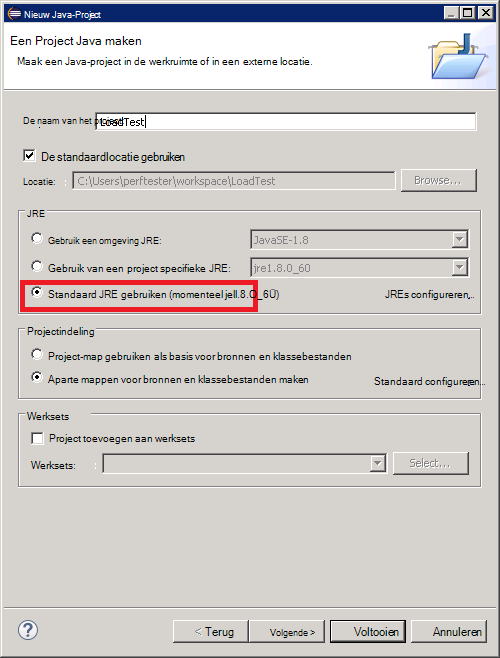
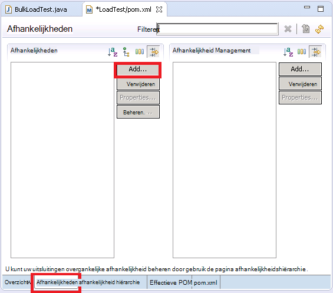

<properties
   pageTitle="Een pipet JMeter JUnit implementeren voor het testen van Elasticsearch prestaties | Microsoft Azure"
   description="Hoe u met een pipet JUnit genereren en deze gegevens uploaden naar een cluster Elasticsearch."
   services=""
   documentationCenter="na"
   authors="dragon119"
   manager="bennage"
   editor=""
   tags=""/>

<tags
   ms.service="guidance"
   ms.devlang="na"
   ms.topic="article"
   ms.tgt_pltfrm="na"
   ms.workload="na"
   ms.date="09/22/2016"
   ms.author="masashin"/>
   
# Een pipet JMeter JUnit implementeren voor het testen van Elasticsearch prestaties

[AZURE.INCLUDE [pnp-header](../../includes/guidance-pnp-header-include.md)]

In dit artikel maakt [deel uit van een reeks](guidance-elasticsearch.md). 

In dit document wordt beschreven hoe maken en gebruiken van een JUnit pipet waarmee u kunt genereren en gegevens uploaden naar een cluster Elasticsearch als onderdeel van een testplan JMeter. Deze methode biedt een zeer flexibele aanpak om te testen laden die grote hoeveelheden testgegevens zonder afhankelijk van externe gegevensbestanden kunt genereren.

> [AZURE.NOTE] De belasting tests gebruikt om te bepalen de prestaties van de opname van gegevens die worden beschreven in [afstemmen gegevens opname prestaties voor Elasticsearch](guidance-elasticsearch-tuning-data-ingestion-performance.md) werden samengesteld op basis van deze methode. De details van de code JUnit worden beschreven in dit document.

De code JUnit is ontwikkelen Eclips (Mars) gebruiken voor testen gegevens opname prestaties en afhankelijkheden zijn opgelost met Maven. De volgende procedures uit beschreven de stap voor stap voor Eclips installeren, configureren Maven maken van een JUnit-toets en deze test implementeren als een pipet JUnit verzoek in een JMeter-toets.

> [AZURE.NOTE] Zie [een prestaties testomgeving voor Elasticsearch op Azure maken][]voor gedetailleerde informatie over de structuur en de configuratie van de testomgeving.

## Installatievereisten

De [Java Runtime-omgeving](http://www.java.com/en/download/ie_manual.jsp) moet u op uw computer ontwikkeling.
U moet ook de [Eclips IDE voor ontwikkelaars van Java](https://www.eclipse.org/downloads/index.php?show_instructions=TRUE)installeren.

> [AZURE.NOTE] Als u de JMeter basispagina VM beschreven in [een prestaties testomgeving voor Elasticsearch op Azure maken][] als uw ontwikkelomgeving gebruikt, kunt u de Windows 32-bitsversie van het installatieprogramma van Eclips downloaden.

## Een project voor het testen van JUnit voor laden Elasticsearch testen te maken

De IDE Eclips start als dit nog niet is gebeurd en sluit vervolgens **de welkomstpagina** .  Klik in het menu **bestand** op en klik vervolgens op **Java-Project**.

Klik in het venster **Nieuw Java-Project** voert u de naam van een project, selecteer **gebruiken standaard JRE**en klik vervolgens op **Voltooien**.

Het **Pakket Verkenner** -venster Vouw in de naam van uw project. Controleer of het tabblad bevat een map met de naam **src** en een verwijzing naar de JRE die u hebt opgegeven.

Met de rechtermuisknop op de map **src** , klikt u op **Nieuw**en klik vervolgens op **JUnit Test hoofdletters/kleine letters**.

Klik in het venster **nieuwe JUnit Test zaak** select **nieuwe Junit 4 testen**, voer een naam voor het pakket (Dit steekt nogal hetzelfde als de naam van het project, hoewel door congres naam met een kleine letter beginnen moet), een naam voor de test class en selecteert u de opties die is de standaardinstelling methode is vereist voor uw test genereren. Laat het vak **klasse onder test** leeg en klik vervolgens op **Voltooien**.

Als u het volgende dialoogvenster van **hoofdletters/kleine letters nieuwe JUnit-toets** wordt weergegeven, selecteert u de optie voor de bibliotheek JUnit 4 toevoegen aan het pad opbouwen en klik vervolgens op **OK**. 

Controleer of de skelet code voor de JUnit-test is gegenereerd en weergegeven in het venster Java-editor.

Klik in het **Pakket Explorer**met de rechtermuisknop op het knooppunt voor uw project, klikt u op **configureren**en klik vervolgens op **converteren naar Maven Project**.

> [AZURE.NOTE]Maven kunt u eenvoudig externe afhankelijkheden (zoals de Elasticsearch Java-client-bibliotheken) beheren met afhankelijk een project.

Klik in het dialoogvenster **nieuwe POM maken** in de vervolgkeuzelijst **verpakking** **oppervlak**selecteren en klik vervolgens op **Voltooien**.

De waarschuwing kan worden weergegeven in het deelvenster dat wordt weergegeven onder de project objectmodel (POM)-editor "opbouwen pad bepaalt omgeving J2SE-1,5. Er zijn geen JREs geïnstalleerd in de werkruimte die strikt compatibel met deze omgeving zijn', afhankelijk van welke versie van Java is geïnstalleerd op uw computer ontwikkeling. Als er een versie van Java die later is dan versie 1.5 kunt u deze waarschuwing gewoon negeren.

Klik in de editor POM uitvouwen **Eigenschappen** en klik op **maken**.

Klik in het dialoogvenster **Eigenschap toevoegen** in het vak **naam** Typ *es.version*, typ in het vak **waarde** *1.7.2*en klik vervolgens op **OK**. Dit is de versie van de bibliotheek Elasticsearch Java-client gebruiken (deze versie in de toekomst mogelijk worden vervangen, en het definiëren van de versie als een eigenschap POM en verwijst naar deze eigenschap elders binnen het project kunt u de versie die u wilt snel worden gewijzigd.)

Klik op het tabblad **afhankelijkheden** bij het grondtal voor de POM-editor en klik vervolgens op **toevoegen** naast de lijst met **afhankelijkheden** .

Typ in het dialoogvenster **Selecteer afhankelijkheid** in het vak **Groeps-Id** *org.elasticsearch*, typ in het **Onderdeel-Id** *elasticsearch*, typt u in het **versie** * \${es.version}*, en klik vervolgens op **OK**. Informatie over de Java Elasticsearch client-bibliotheek in de online Maven centrale opslagplaats wordt bewaard en deze configuratie wordt automatisch gedownload de bibliotheek en de bijbehorende afhankelijkheden wanneer het project is gebaseerd.

Klik in het menu **bestand** , klikt u op **Alles opslaan**. Deze actie bespaart en bouwen van het project, de afhankelijkheden die is opgegeven door Maven downloaden. Controleer of dat de map Maven afhankelijkheden wordt weergegeven in de Verkenner-pakket. Vouw deze map om het oppervlak-bestanden gedownload ter ondersteuning van de Elasticsearch Java-client-bibliotheek te bekijken.

## Een bestaand JUnit testproject importeren in Eclips

Deze procedure wordt ervan uitgegaan dat u een project Maven die eerder is gemaakt met behulp van Eclips hebt gedownload.

Start de Eclips IDE. Klik op het menu **bestand** op **importeren**.

Klik in het venster **selecteert u** de map **Maven** uitvouwen, klikt u op **Bestaande Maven projecten**en klik op **volgende**.

Geef de map die het project (de map met het pom.xml-bestand), klikt u op **Alles selecteren**en klik vervolgens op **Voltooien**in het venster **Maven projecten** .

Vouw in het **Pakket Verkenner** -venster uit het knooppunt dat overeenkomt met uw project. Controleer of het project bevat een map met de naam **src**. Deze map bevat de broncode voor de test JUnit. Het project kan worden gecompileerd en volg de onderstaande instructies geïmplementeerd.

## Een test JUnit implementeren naar JMeter

Deze procedure wordt ervan uitgegaan dat u een project met de naam LoadTest met een JUnit Test-klasse met de naam hebt gemaakt `BulkLoadTest.java` die configuratieparameters als één tekenreeks doorgegeven aan een constructor (dit is de om die JMeter verwacht) accepteert.

In de IDE Eclips in **Pakket Verkenner**met de rechtermuisknop op het projectknooppunt en klik vervolgens op **exporteren**.

Klik in de **Wizard exporteren**op de pagina **Selecteer** **Java** Vouw, klikt u op **JAR-bestand**en klik vervolgens op **volgende**.

Klik op de pagina **Bestandsspecificatie JAR** in het vak **Selecteer de resources wilt exporteren** de project uitvouwen Deselecteer **.project**en **pom.xml**deselecteren. Geef een bestandsnaam en locatie voor het oppervlak (moet verkrijgen de bestandsextensie .jar) in het vak **JAR-bestand** en klik vervolgens op **Voltooien**.

Met Windows Verkenner, kopieert u het bestand oppervlak u zojuist hebt gemaakt op de basispagina JVM JMeter en sla deze op in de apache-jmeter-2,13\\bibliotheek\\junit submap in de map waarin u JMeter hebt geïnstalleerd (Zie de procedure "Maken van de JMeter basispagina virtuele machine" bij het [maken van een prestaties testomgeving voor Elasticsearch op Azure](guidance-elasticsearch-creating-performance-testing-environment.md) voor meer informatie.)

Ga terug naar Eclips, uitvouwen van het **Pakket Verkenner** -venster en maak een notitie van alle bestanden die oppervlak en de locaties in de map Maven afhankelijkheden voor het project weergegeven. Houd er rekening mee dat de bestanden die wordt weergegeven in de volgende afbeelding variëren kunnen, afhankelijk van welke versie van Elasticsearch u gebruikt:

Met Windows Verkenner, kopieert u elke oppervlak-bestand waarnaar wordt verwezen in de map Maven afhankelijkheden apache-jmeter-2,13\\bibliotheek\\junit-map op de basispagina VM JMeter.

Als de bibliotheek\\junit map al met oudere versies van deze oppervlak-bestanden en vervolgens deze verwijderen. Als u ze op hun plaats staan laat vervolgens de test JUnit werkt mogelijk niet zoals verwijzingen omgezet in de verkeerde potten worden kunnen.

In het model JMeter VM stoppen JMeter als momenteel wordt uitgevoerd.  JMeter starten.  In JMeter, met de rechtermuisknop op **Testplan**, klikt u op **toevoegen**, klikt u op **Threads (gebruikers)**en klik vervolgens op **Thread-groep**.

Onder het knooppunt **Testplan** met de rechtermuisknop op **De groep Thread**, klikt u op **toevoegen**, klikt u op **pipet**en klik vervolgens op **JUnit verzoek**.

Selecteer op de pagina **JUnit verzoek** **zoeken voor JUnit4 aantekeningen (in plaats van JUnit 3)**. Selecteer in de vervolgkeuzelijst **klassenaam** uw klas JUnit laden test (deze worden weergegeven in het formulier * &lt;pakket&gt;.&lt; klasse&gt;*), in de **Methode testen** vervolgkeuzelijst, selecteer de JUnit methode testen (dit is de methode die het werk dat is gekoppeld aan de test uitvoert en moet zijn gemarkeerd met de *@test* aantekeningen in het project Eclips), en voert u alle waarden worden doorgegeven aan de constructor in het vak **Constructor tekenreekslabel** . De details die wordt weergegeven in de volgende afbeelding ziet u alleen voorbeelden; uw **klassenaam**, * *Test-methode*, en * *Constructor tekenreekslabel** wordt waarschijnlijk afwijken van die wordt weergegeven.

Als uw klas niet wordt weergegeven in de vervolgkeuzelijst **klassenaam** , betekent dit waarschijnlijk dat het oppervlak niet correct is geëxporteerd of is niet in de bibliotheek geplaatst\\junit map, of enkele van de afhankelijke potten ontbreken in de bibliotheek\\junit map. Als dit gebeurt, het project opnieuw uit Eclips exporteren en zorg ervoor dat u de resource **src** hebt geselecteerd, kunt u het oppervlak kopiëren naar de bibliotheek\\junit map, en controleer vervolgens of dat u alle de afhankelijke potten Maven gesorteerd naar de map bibliotheek hebt gekopieerd.

Sluit JMeter. Er is het testplan opslaan niet nodig.  Kopieer het oppervlak-bestand met de klas JUnit test aan de /home/&lt;gebruikersnaam&gt;/apache-jmeter-2.13/lib/junit-map op elk van de onderliggende VMs JMeter (*&lt;gebruikersnaam&gt; * is de naam van de administratieve gebruiker u hebt opgegeven tijdens het maken van de VM, raadpleegt u de procedure "Maken van de JMeter onderliggende virtuele machines" bij het [maken van een prestaties testomgeving voor Elasticsearch op Azure](guidance-elasticsearch-creating-performance-testing-environment.md) voor meer informatie.)

Kopieer de afhankelijke oppervlak-bestanden vereist door de klasse JUnit test aan de /home/&lt;gebruikersnaam&gt;/apache-jmeter-2.13/lib/junit-map op elk van de onderliggende VMs JMeter. Zorg ervoor dat u eerst alle oudere versies van oppervlak bestanden uit deze map verwijderen.

U kunt de `pscp` hulpprogramma bestanden kopiëren van een Windows-computer naar Linux.

[Maken van een prestaties omgeving voor Elasticsearch op Azure testen]: guidance-elasticsearch-creating-performance-testing-environment.md
