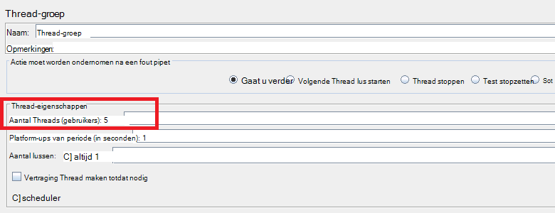
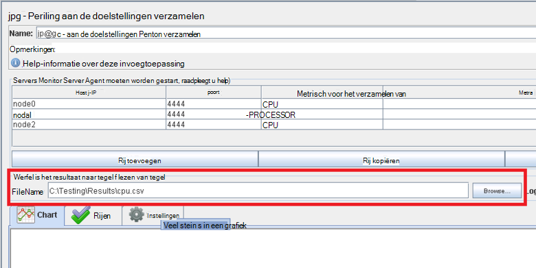
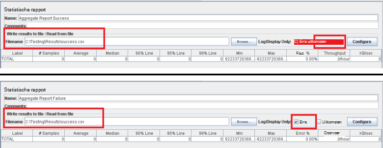
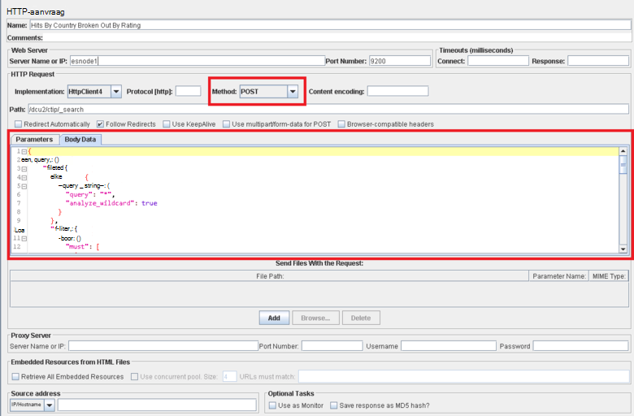

<properties
   pageTitle="Een testplan JMeter implementeren voor Elasticsearch | Microsoft Azure"
   description="Het uitvoeren van prestaties getest Elasticsearch met JMeter."
   services=""
   documentationCenter="na"
   authors="dragon119"
   manager="bennage"
   editor=""
   tags=""/>

<tags
   ms.service="guidance"
   ms.devlang="na"
   ms.topic="article"
   ms.tgt_pltfrm="na"
   ms.workload="na"
   ms.date="09/22/2016"
   ms.author="masashin" />
   
# <a name="implementing-a-jmeter-test-plan-for-elasticsearch"></a>Een testplan JMeter implementeren voor Elasticsearch

[AZURE.INCLUDE [pnp-header](../../includes/guidance-pnp-header-include.md)]

In dit artikel maakt [deel uit van een reeks](guidance-elasticsearch.md). 

De prestaties proeven tegen Elasticsearch zijn geïmplementeerd JMeter test abonnementen samen met Java-code verwerkt als een JUnit-toets voor de uitvoering van taken zoals het uploaden van gegevens in het cluster met. De test-abonnementen en JUnit code worden beschreven in [afstemmen gegevens opname prestaties voor Elasticsearch op Azure][]en [afstemmen gegevens aggregatie en prestaties van query's voor Elasticsearch op Azure][].

Het doel van dit document is samenvatting van de belangrijkste ervaring ervaring uit het bouwen en uitvoeren van deze abonnementen testen. De pagina [JMeter aanbevolen procedures](http://jmeter.apache.org/usermanual/best-practices.html) op de website van Apache JMeter bevat meer generalized advies over JMeter effectief gebruiken.

## <a name="implementing-a-jmeter-test-plan"></a>Een testplan JMeter implementeren

De volgende lijst bevat een overzicht van de items die u rekening houden moet bij het maken van een testplan JMeter:

- Maak een groep afzonderlijke thread voor elke test die u wilt uitvoeren. Een toets kan meerdere stappen, waaronder logica controllers, timers, vóór en na processors monsternemers en listeners bevatten.

- Maak te veel threads in een groep thread. Veel threads veroorzaakt JMeter mislukt met "Afmelden bij geheugen" uitzonderingen. Is het beter om toe te voegen meer JMeter onderliggende servers elke uitgevoerd een kleinere aantal threads dan u met een groot aantal threads uitvoert op een enkele JMeter-server.



- Om te beoordelen de prestaties van het cluster, neemt u de invoegtoepassing voor [Perfmon aan de doelstellingen verzamelen](http://jmeter-plugins.org/wiki/PerfMon/) in het testplan. Dit is een JMeter luisteraar ervan af die is beschikbaar als een van de standaard JMeter Plug-ins. De van onbewerkte prestatiegegevens opslaan in een set bestanden in de indeling met door komma's gescheiden waarden (CSV) en deze uitgevoerd als de test voltooid is. Dit is efficiënter en u minder druk op JMeter dan poging tot het verwerken van de gegevens zoals deze is vastgelegd in rekening brengt. 



U kunt een hulpmiddel zoals Excel de gegevens importeren en een bereik van grafieken voor analytische doeleinden te genereren.

Houd rekening met het vastleggen van de volgende informatie:

- CPU-gebruik voor elk knooppunt in de cluster Elasticsearch.

- Het aantal bytes dat is gelezen per seconde vanaf schijf voor elk knooppunt.

- Het percentage van CPU-tijd besteed indien mogelijk, wachten op-en uitvoer voor op elk knooppunt worden uitgevoerd. Dit is niet altijd mogelijk voor Windows VMs, maar u kunt een aangepaste meting (een Raad metrisch) die wordt uitgevoerd van de volgende shellopdracht uit om aan te roepen *vmstat* op een knooppunt maken voor Linux:

```Shell
sh:-c:vmstat 1 5 | awk 'BEGIN { line=0;total=0;}{line=line+1;if(line&gt;1){total=total+\$16;}}END{print total/4}'
```

Veld 16 in de uitvoer van *vmstat* bevat de CPU wachttijd voor I/O. Zie voor meer informatie over de werking van deze verklaring, de [opdracht vmstat](http://linuxcommand.org/man_pages/vmstat8.html).

- Het aantal bytes dat verzonden en ontvangen via het netwerk voor elk knooppunt.

- Gebruik afzonderlijke statistische rapport listeners opnemen van de prestaties en de frequentie van geslaagde en mislukte bewerkingen. Geslaagde en mislukte gegevens in andere bestanden opnemen.



- Houd elk JMeter test hoofdletters/kleine letters zo eenvoudig mogelijk zodat u kunt rechtstreeks relateren prestaties met specifieke test acties. Voor test situaties waarvoor complexe logica, kunt u deze logica in een toets JUnit die en het pipet JUnit aanvraag gebruiken in JMeter de test wilt uitvoeren.

- Gebruik het pipet HTTP-aanvraag HTTP bewerkingen uitvoeren, zoals ophalen, bericht, opslag of verwijderen. U kunt bijvoorbeeld Elasticsearch zoekacties uitvoeren met een query posten en de Querydetails in het vak *Hoofdtekst gegevens* leveren:



- Voor eenvoudige herhaalbaarheid en hergebruik, voorzien testen JMeter test-abonnementen. U kunt vervolgens uitvoeren van scripts gebruiken om te automatiseren van het uitvoeren van test-abonnementen.

## <a name="implementing-a-junit-test"></a>Een test JUnit implementeren

U kunt complexe code opnemen in een testplan JMeter door te maken van een of meer JUnit testen. U kunt een toets JUnit schrijven met behulp van een Java geïntegreerde ontwikkelomgeving (IDE) zoals Eclips. [Een pipet JMeter JUnit voor het testen van Elasticsearch prestaties implementeert][] , vindt u informatie over het instellen van een juiste ontwikkelomgeving.

De volgende lijst bevat een overzicht van de volgende aanbevolen procedures die moet u bij het schrijven van de code voor een test JUnit:

- Gebruik de klassenconstructor test om initialisatieparameters te geven in de test. JMeter kunt een constructor die een tekenreeks met één argument gebruiken. In de constructor parseert u dit argument in de afzonderlijke elementen, zoals u in het volgende voorbeeld:

```Java
private String hostName = "";
private String indexName = "";
private String typeName = "";
private int port = 0;
private String clusterName = "";
private int itemsPerBatch = 0;

/\* JUnit test class constructor \*/
public ElasticsearchLoadTest2(String params) {
    /* params is a string containing a set of comma separated values for:
        hostName
        indexName
        typeName
        port
        clustername
        itemsPerBatch
    */

    /* Parse the parameter string into an array of string items */
    String delims = "\[ \]\*,\[ \]\*"; // comma surrounded by zero or more spaces
    String\[\] items = params.split(delims);

    /* Note: Parameter validation code omitted */

    /* Use the parameters to populate variables used by the test */
    hostName = items[0];
    indexName = items[1];
    typeName = items[2];
    port = Integer.parseInt(items[3]);
    clusterName = items[4];
    itemsPerBatch = Integer.parseInt(items[5]);

    if(itemsPerBatch == 0)
        itemsPerBatch = 1000;
}
```

- Voorkom i/o-bewerkingen of andere tijdrovende bewerkingen in de constructor of setup test-klasse, omdat ze uitvoeren telkens wanneer de test JUnit wordt uitgevoerd. (Dezelfde JUnit test kan worden uitgevoerd duizenden tijden voor elke prestatietest worden uitgevoerd vanaf JMeter.)

- Overwegen eenmalige instelling voor initialisatie van de duur test hoofdletters/kleine letters.

- Als de test vereist is voor een groot aantal invoerparameters, test configuratiegegevens opgeslagen in een afzonderlijk configuratiebestand en de constructor van de locatie van dit bestand binnenkomen.

- Voorkom hard kleurcodering bestandspaden de code van de test laden. Dit kunnen leiden tot fouten vanwege verschillen tussen operating systems zoals Windows en Linux.

- Bevestigingen gebruiken om aan te geven fouten in JUnit testen methoden zodat u kunt ze met JMeter bijhouden en ze als een zakelijke maatstaven gebruiken. Informatie over de oorzaak van het probleem, indien mogelijk doorgeven zoals wordt weergegeven in vet weergegeven in het volgende voorbeeld:

```Java
@Test
public void bulkInsertTest() throws IOException {
    ...
    BulkResponse bulkResponse = bulkRequest.execute().actionGet();
    assertFalse(
        bulkResponse.buildFailureMessage(), bulkResponse.hasFailures());
        ...
}
```


[Running Elasticsearch on Azure]: guidance-elasticsearch-running-on-azure.md
[Gegevens opname prestaties voor Elasticsearch op Azure optimaliseren]: guidance-elasticsearch-tuning-data-ingestion-performance.md
[Een pipet JMeter JUnit implementeren voor het testen van Elasticsearch prestaties]: guidance-elasticsearch-deploying-jmeter-junit-sampler.md
[Gegevens samenvoegen en prestaties van query's voor Elasticsearch op Azure optimaliseren]: guidance-elasticsearch-tuning-data-aggregation-and-query-performance.md
