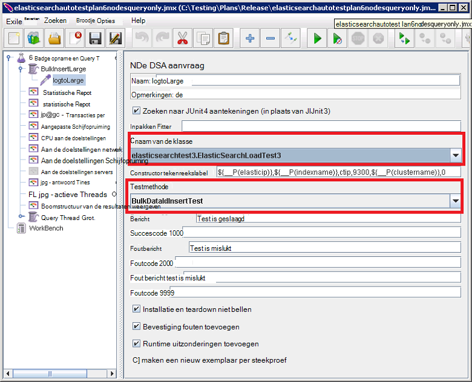

<properties
   pageTitle="De automatische Elasticsearch prestatietests uitvoeren | Microsoft Azure"
   description="Beschrijving van hoe u de prestatietests in uw eigen omgeving kunt uitvoeren."
   services=""
   documentationCenter="na"
   authors="dragon119"
   manager="bennage"
   editor=""
   tags=""/>

<tags
   ms.service="guidance"
   ms.devlang="na"
   ms.topic="article"
   ms.tgt_pltfrm="na"
   ms.workload="na"
   ms.date="09/22/2016"
   ms.author="masashin"/>
   
# <a name="running-the-automated-elasticsearch-performance-tests"></a>De automatische Elasticsearch prestatietests uitvoeren

[AZURE.INCLUDE [pnp-header](../../includes/guidance-pnp-header-include.md)]

In dit artikel maakt [deel uit van een reeks](guidance-elasticsearch.md). 

De documenten [afstemmen gegevens opname prestaties voor Elasticsearch op Azure] en [afstemmen gegevens aggregatie en prestaties van query's voor Elasticsearch op Azure] beschrijven een aantal prestatietests die zijn uitgevoerd op een steekproef Elasticsearch cluster.

Deze tests zijn vastgelegd in een script te worden uitgevoerd op een geautomatiseerde wijze. In dit document wordt beschreven hoe u de tests in uw eigen omgeving kunt herhalen.

## <a name="prerequisites"></a>Vereisten voor

De automatische tests vereisen de volgende items:

-  Een cluster Elasticsearch.

- Een JMeter omgeving installatie zoals wordt beschreven door het document [een prestaties testomgeving voor Elasticsearch op Azure maken].

- [Python 3.5.1](https://www.python.org/downloads/release/python-351/) geïnstalleerd op de basispagina JMeter VM.


## <a name="how-the-tests-work"></a>De werking van de tests
De tests worden uitgevoerd met JMeter. Een basispagina JMeter-server een testplan geladen en wordt doorgegeven aan een set JMeter onderliggende servers die daadwerkelijk de tests uitvoeren. De basispagina server JMeter coördinaten van de onderliggende JMeter-servers en de resultaten worden bij elkaar opgeteld.

De volgende test-abonnementen zijn beschikbaar:

* [elasticsearchautotestplan3nodes.jmx](https://github.com/mspnp/azure-guidance/blob/master/ingestion-and-query-tests/templates/elasticsearchautotestplan3nodes.jmx). De opname-test is uitgevoerd via een cluster 3 knooppunten.

* [elasticsearchautotestplan6nodes.jmx](https://github.com/mspnp/azure-guidance/blob/master/ingestion-and-query-tests/templates/elasticsearchautotestplan6nodes.jmx). De opname-test is uitgevoerd via een cluster 6 knooppunten.

* [elasticsearchautotestplan6qnodes.jmx](https://github.com/mspnp/azure-guidance/blob/master/ingestion-and-query-tests/templates/elasticsearchautotestplan6qnodes.jmx). Wordt de opname en query test uitgevoerd via een cluster 6 knooppunten.

* [elasticsearchautotestplan6nodesqueryonly.jmx](https://github.com/mspnp/azure-guidance/blob/master/ingestion-and-query-tests/templates/elasticsearchautotestplan6nodesqueryonly.jmx). De query alleen-lezen-test is uitgevoerd via een cluster 6 knooppunten.


U kunt deze abonnementen testen als uitgangspunt voor uw eigen scenario's als u minder of meer knooppunten nodig hebt.

De test-abonnementen gebruiken een pipet JUnit-verzoek om te genereren en de testgegevens uploaden. Het testplan JMeter wordt gemaakt en wordt uitgevoerd in dit voorbeeld en bewaakt de elk van de knooppunten Elasticsearch voor prestatiegegevens.  

## <a name="building-and-deploying-the-junit-jar-and-dependencies"></a>Maken en implementeren van de JUnit JAR en afhankelijkheden
Voordat u de van prestatietests die u moet downloaden, compileren en implementeren van de JUnit tests bevindt zich onder de map prestaties/junitcode. Deze tests wordt verwezen door het testplan JMeter. Zie de procedure 'Een bestaand JUnit testproject importeren in Eclips' in het document [een pipet JMeter JUnit voor het testen van Elasticsearch prestaties implementeren]voor meer informatie.

Er zijn twee versies van de tests JUnit: 

- [Elasticsearch1.73](https://github.com/mspnp/azure-guidance/tree/master/ingestion-and-query-tests/junitcode/elasticsearch1.73). Gebruikt u deze code voor de uitvoering van de opname tests. Deze tests gebruik Elasticsearch 1,73.

- [Elasticsearch2](https://github.com/mspnp/azure-guidance/tree/master/ingestion-and-query-tests/junitcode/elasticsearch2). Gebruikt u deze code voor het uitvoeren van de query testen. Deze tests gebruik Elasticsearch 2.1 en hoger.

Kopieer het juiste Java (oppervlak) archiefbestand samen met de rest van de afhankelijkheden op uw computers JMeter. Het proces wordt beschreven in [een pipet JMeter JUnit voor het testen van Elasticsearch prestaties implementeren][]. 

> **Belangrijke** Na een toets JUnit wordt geïmplementeerd, gebruikt u JMeter laden en de test-abonnementen die verwijzen naar deze test JUnit en controleer of de BulkInsertLarge thread-groep verwijst naar het juiste oppervlak-bestand, JUnit klassenaam configureren en methode testen:
> 
> 
> 
> Sla de abonnementen bijgewerkte testen voordat u de tests.

## <a name="creating-the-test-indexes"></a>De test indexen maken
Elke test uitvoert opname en/of query's op een enkele index opgegeven wanneer de test wordt uitgevoerd. U moet de index met de schema's die worden beschreven in de bijlagen bij de documenten [afstemmen gegevens opname prestaties voor Elasticsearch op Azure] en [afstemmen gegevens aggregatie en prestaties van query's voor Elasticsearch op Azure] maken en configureren op basis van uw testscenario (doc-waarden ingeschakeld/uitgeschakeld, meerdere replica's, enzovoort.) Houd er rekening mee dat de test-abonnementen wordt ervan uitgegaan dat dat de index één type met de naam *ctip*bevat.

## <a name="configuring-the-test-script-parameters"></a>De test scriptparameters configureren
Kopieer de volgende test script parameterbestanden naar de server JMeter:

* [run.properties](https://github.com/mspnp/azure-guidance/blob/master/ingestion-and-query-tests/run.properties). Dit bestand Hiermee geeft u het aantal JMeter test threads moet worden gebruikt, de duur van de test (in seconden), het IP-adres van een knooppunt (of een taakverdeling in het cluster Elasticsearch) en de naam van het cluster:

  ```ini
  nthreads=3
  duration=300
  elasticip=<IP Address or DNS Name Here>
  clustername=<Cluster Name Here>
  ```
  
  In dit bestand bewerken en geef de juiste waarden voor uw test en cluster.

* [query-config-win.ini](https://github.com/mspnp/azure-guidance/blob/master/ingestion-and-query-tests/query-config-win.ini) en [query-config-nix.ini](https://github.com/mspnp/azure-guidance/blob/master/ingestion-and-query-tests/query-config-nix.ini). Deze twee bestanden bevatten dezelfde gegevens; het bestand *winnen* is opgemaakt voor weergave op Windows bestandsnamen en paden en het bestand *nix* is opgemaakt voor weergave op Linux bestandsnamen en paden:

  ```ini
  [DEFAULT]
  debug=true #if true shows console logs.

  [RUN]
  pathreports=C:\Users\administrator1\jmeter\test-results\ #path where tests results are saved.
  jmx=C:\Users\administrator1\testplan.jmx #path to the JMeter test plan.
  machines=10.0.0.1,10.0.0.2,10.0.0.3 #IPs of the Elasticsearch data nodes separated by commas.
  reports=aggr,err,tps,waitio,cpu,network,disk,response,view #Name of the reports separated by commas.
  tests=idx1,idx2 #Elasticsearch index(es) name(s) to test, comma delimited if more than one.
  properties=run.properties #Name of the properties file.
  ```

  In dit bestand als u wilt opgeven van de locaties van de analyseresultaten, de naam van het testplan JMeter uitvoeren, het IP-adressen van de Elasticsearch gegevensknooppunten u prestatiegegevens van, de rapporten met de van onbewerkte prestatiegegevens die worden gegenereerd verzamelt, en de naam (of namen gescheiden door lijstscheidingsteken) van de index(en) onder test, als meer dan één bewerken , testen achter elkaar worden uitgevoerd. Als het bestand run.properties bevindt zich in een andere map of de map, geeft u het volledige pad naar dit bestand.

## <a name="running-the-tests"></a>De tests uitvoeren

* Kopieer het bestand [query-test.py](https://github.com/mspnp/azure-guidance/blob/master/ingestion-and-query-tests/query-test.py) naar de servercomputer JMeter, in dezelfde map als de run.properties en de query-config-win.ini (query-config-nix.ini)-bestanden.

* Zorg ervoor dat jmeter.bat (Windows) of jmeter.sh (Linux) op het uitvoerbare pad voor uw omgeving.

* De query-test.py-script uitvoeren vanaf de opdrachtregel de tests uitvoeren:

  ```cmd
  py query-test.py
  ```

* Wanneer de test is voltooid, worden de resultaten worden opgeslagen als de set door komma's gescheiden (CSV)-bestanden die zijn opgegeven in het query-config-win.ini (query-config-nix.ini)-bestand waarden. U kunt Excel gebruiken om te analyseren en deze gegevens in een grafiek.


[Gegevens opname prestaties voor Elasticsearch op Azure optimaliseren]: guidance-elasticsearch-tuning-data-ingestion-performance.md
[Gegevens samenvoegen en prestaties van query's voor Elasticsearch op Azure optimaliseren]: guidance-elasticsearch-tuning-data-aggregation-and-query-performance.md
[Maken van een prestaties omgeving voor Elasticsearch op Azure testen]: guidance-elasticsearch-creating-performance-testing-environment.md
[Een pipet JMeter JUnit implementeren voor het testen van Elasticsearch prestaties]: guidance-elasticsearch-deploying-jmeter-junit-sampler.md
