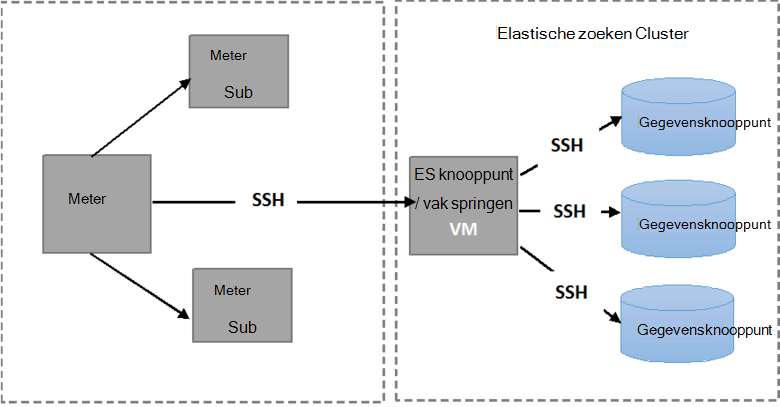

<properties
   pageTitle="Met de geautomatiseerd Elasticsearch tolerantie tests | Microsoft Azure"
   description="Beschrijving van hoe u de tests tolerantie in uw eigen omgeving uitvoeren kunt."
   services=""
   documentationCenter="na"
   authors="dragon119"
   manager="bennage"
   editor=""
   tags=""/>

<tags
   ms.service="guidance"
   ms.devlang="na"
   ms.topic="article"
   ms.tgt_pltfrm="na"
   ms.workload="na"
   ms.date="09/22/2016"
   ms.author="masashin"/>

# <a name="running-the-automated-elasticsearch-resiliency-tests"></a>De automatische Elasticsearch tolerantie tests uitvoeren

[AZURE.INCLUDE [pnp-header](../../includes/guidance-pnp-header-include.md)]

In dit artikel maakt [deel uit van een reeks](guidance-elasticsearch.md).

In [configureren flexibiliteit en herstelbestanden op Elasticsearch op Azure][elasticsearch-resilience-recovery], we een reeks tests die zijn uitgevoerd op een steekproef Elasticsearch cluster om te bepalen hoe u ook het systeem op sommige algemene vormen van mislukt gereageerd en hoe u ook het hersteld beschreven. De tests zijn vastgelegd in een script te worden uitgevoerd op een geautomatiseerde wijze. In dit document wordt beschreven hoe u de tests in uw eigen omgeving kunt herhalen. 

De volgende scenario's zijn getest:

- **Knooppunt is mislukt en opnieuw starten zonder verlies van gegevens**. Een gegevensknooppunt wordt gestopt en 5 minuten door te gaan.
Elasticsearch is geconfigureerd voor het niet opnieuw toewijzen ontbrekende shards in dit interval, zodat er geen aanvullende I/O wordt weergegeven in het shards navigeren. Wanneer het knooppunt opnieuw opstart, kunt u met het herstelproces de shards op dat knooppunt terug up-to-date.

- **Knooppunt mislukt met ernstige gegevensverlies**. Een gegevensknooppunt wordt gestopt en de gegevens die deze bevat deze de vorm van een ernstige schijf is mislukt wordt gewist. Het knooppunt is vervolgens opnieuw gestart (na 5 minuten), effectief die fungeert als vervanging voor het oorspronkelijke knooppunt. Het herstelproces is vereist opnieuw maken van de ontbrekende gegevens voor dit knooppunt en mogelijk shards gehouden op andere knooppunten verplaatsen.

- **Knooppunt is mislukt en opnieuw starten met geen verlies van gegevens, maar met shard herverdeling**. Een gegevensknooppunt wordt gestopt en de shards die deze bevat andere knooppunten worden herverdeeld. Het knooppunt vervolgens opnieuw is opgestart en meer herverdeling treedt op als u wilt vastleggen van het cluster.

- **Schuivend updates**. Elk knooppunt in de cluster wordt gestopt en opnieuw is opgestart na een korte interval simuleren machines opnieuw worden gestart nadat een software-update. Slechts één knooppunt is gestopt op elk gewenst moment.
Shards worden niet herverdeeld terwijl een knooppunt niet beschikbaar is.

## <a name="prerequisites"></a>Vereisten voor

De automatische tests vereisen de volgende items:

- Een cluster Elasticsearch.

- Een JMeter omgeving installatie volgens de beschrijving namelijk de [prestaties testen richtlijnen]. 

- De volgende toevoegingen geïnstalleerd op de JMeter basispagina VM alleen.

    - Java Runtime 7.

    - Nodejs 4.x.x of hoger.

    - De cijfer opdrachtregel hulpmiddelen.

## <a name="how-the-scripts-work"></a>De werking van de scripts

De testscripts zijn bedoeld om uit te voeren op de VM JMeter basispagina. Wanneer u een toets om uit te voeren selecteert, wordt in de scripts de volgende volgorde van bewerkingen uitvoeren:

1.  Start een JMeter testplan doorgeven van de parameters die u hebt opgegeven.

2.  Een script waarmee de bewerkingen die is vereist door de test voor een opgegeven VM in het cluster kopiëren. Dit is een VM met een openbare IP-adres of de VM *Jumpbox* als u het cluster met behulp van de [Azure Elasticsearch quickstart sjabloon](https://github.com/Azure/azure-quickstart-templates/tree/master/elasticsearch)hebt gemaakt.

3.  Het script uitvoeren op de VM (of Jumpbox).

De volgende afbeelding ziet u de structuur van de testomgeving en Elasticsearch cluster. Houd er rekening mee dat de testscripts secure shell (SSH) met verbinding maken met elk knooppunt in het cluster verschillende Elasticsearch bewerkingen zoals stoppen of opnieuw starten van een knooppunt uit te voeren.



## <a name="setting-up-the-jmeter-tests"></a>Bij het instellen van de JMeter getest

Voordat het uitvoeren van de flexibiliteit getest moet u compileren en implementeren van de JUnit tests die zich in de map tolerantie/jmeter/tests. Deze tests wordt verwezen door het testplan JMeter. Zie de procedure "Een bestaand JUnit testproject importeren in Eclips" bij de [implementatie van een pipet JMeter JUnit voor het testen van Elasticsearch prestaties][]voor meer informatie.

Er zijn twee versies van de JUnit tests gehouden in de volgende mappen:

- **Elasticsearch17.** Het project in deze map wordt het bestand Elasticsearch17.jar gegenereerd. In dit oppervlak gebruiken voor het testen van Elasticsearch versies 1.7.x

- **Elasticsearch20**. Het project in deze map wordt het bestand Elasticsearch20.jar gegenereerd. In dit oppervlak gebruiken voor het testen van Elasticsearch versie 2.0.0 en hoger

Kopieer het juiste oppervlak-bestand samen met de rest van de afhankelijkheden op uw computers JMeter. Het proces wordt beschreven door de procedure 'implementeert een test JUnit JMeter"bij de [implementatie van een pipet JMeter JUnit voor testen Elasticsearch prestaties].

## <a name="configuring-vm-security-for-each-node"></a>VM beveiliging voor elk knooppunt configureren

De testscripts moeten een certificaat voor serververificatie worden geïnstalleerd op elk knooppunt Elasticsearch in het cluster. Hiermee worden de scripts worden automatisch uitgevoerd zonder waarschuwing voor een gebruikersnaam of wachtwoord ze verbinding maken met de verschillende VMs.

Begin met het aanmelden bij een van de knooppunten in het cluster Elasticsearch (of de VM Jumpbox) en voer de volgende opdracht uit om een verificatiesleutel te genereren:

```Shell
ssh-keygen -t rsa
```

Terwijl u verbinding hebben met de Elasticsearch knooppunt (of Jumpbox), moet u de volgende opdrachten voor elk knooppunt uitvoeren in hij Elasticsearch cluster. Vervang `<username>` met de naam van een geldige gebruiker op elke VM en vervangen `<nodename>` met de DNS-naam of het IP-adres van het knooppunt Elasticsearch hostingprovider VM.
Houd er rekening mee dat u wordt gevraagd het wachtwoord van de gebruiker bij het uitvoeren van deze opdrachten.
Zie [SSH login zonder wachtwoord](http://www.linuxproblem.org/art_9.html)voor meer informatie:

```Shell
ssh <username>@<nodename> mkdir -p .ssh (
cat .ssh/id\_rsa.pub | ssh <username>*@<nodename> 'cat &gt;&gt; .ssh/authorized\_keys'
```

## <a name="downloading-and-configuring-the-test-scripts"></a>Downloaden en configureren van de testscripts

De testscripts vindt u in de bibliotheek van een cijfer. Gebruik de volgende procedure kunt downloaden en configureren van de scripts.

Klik op de JMeter basispagina machine waar u de tests wilt uitvoeren, opent u een cijfer venster voor het bureaublad (cijfer we vaker doen) en klonen van de bibliotheek waarin de scripts, als volgt:

```Shell
git clone https://github.com/mspnp/azure-guidance.git
```

Verplaatsen naar de map tolerantie-tests en voer de volgende opdracht voor het installeren van de afhankelijkheden vereist voor het uitvoeren van de tests:

```Shell
npm install
```

Als het model JMeter op Windows wordt uitgevoerd, downloadt u [Plink](http://www.chiark.greenend.org.uk/~sgtatham/putty/download.html), namelijk een opdrachtregel-interface naar de stopverf Telnet-client. Kopieer het uitvoerbare Plink naar de map tolerantie-tests/bibliotheek.

Als het model JMeter op Linux wordt uitgevoerd, u niet nodig hebt om te downloaden Plink, maar u moet configureren wachtwoord minder SSH tussen de hoofdlijst JMeter en de Elasticsearch knooppunt of Jumpbox die u gebruikt door de stappen in de procedure te volgen ' configureren VM beveiliging voor elk knooppunt. " 

Bewerken van de volgende configuratieparameters in de `config.js` bestand zodat deze overeenkomt met uw testomgeving en Elasticsearch cluster. Deze parameters gelden voor alle tests:

| Naam | Beschrijving | Standaardwaarde |
| ---- | ----------- | ------------- |
| `jmeterPath` | Lokaal pad waar JMeter zich bevindt. | `C:/apache-jmeter-2.13` |
| `resultsPath` | Relatieve map waarin het script het resultaat wordt. | `results` |
| `verbose` | Geeft aan of het script de uitvoer met uitgebreide modus of niet. | `true` |
| `remote` | Geeft aan of de tests JMeter lokaal of op de externe servers uitgevoerd. | `true` |
| `cluster.clusterName` | De naam van het cluster Elasticsearch. | `elasticsearch` |
| `cluster.jumpboxIp`         | Het IP-adres van de computer Jumpbox.                 |-|
| `cluster.username`          | De beheerder-gebruiker die u hebt gemaakt tijdens het implementeren van het cluster. |-|
| `cluster.password`          | Het wachtwoord voor de beheerder.                        |-|
| `cluster.loadBalancer.ip`   | Het IP-adres van de verdeling van de Elasticsearch belasting.    |-|
| `cluster.loadBalancer.url`  | Basis-URL van de taakverdeling.                          |-|

## <a name="running-the-tests"></a>De tests uitvoeren

Verplaatsen naar de map tolerantie-tests en voer de volgende opdracht:

```Shell
node app.js
```

Het volgende menu moet worden weergegeven:


Voer het aantal het scenario die u wilt uitvoeren: `11`, `12`, `13` of `21`. 

Wanneer u een scenario hebt geselecteerd, wordt de test automatisch uitgevoerd. De resultaten worden opgeslagen als een set door komma's gescheiden waarden (.csv) bestanden in een map die is gemaakt onder de map met resultaten. Elke klaar zijn eigen map resultaten.
U kunt Excel gebruiken om te analyseren en deze gegevens in een grafiek.

[Running Elasticsearch on Azure]: guidance-elasticsearch-running-on-azure.md
[Tuning Data Ingestion Performance for Elasticsearch on Azure]: guidance-elasticsearch-tuning-data-ingestion-performance.md
[prestaties testen richtlijnen]: guidance-elasticsearch-creating-performance-testing-environment.md
[JMeter guidance]: guidance-elasticsearch-implementing-jmeter.md
[Considerations for JMeter]: guidance-elasticsearch-deploying-jmeter-junit-sampler.md
[Query aggregation and performance]: guidance-elasticsearch-query-aggregation-performance.md
[elasticsearch-resilience-recovery]: guidance-elasticsearch-configuring-resilience-and-recovery.md
[Resilience and Recovery Testing]: guidance-elasticsearch-running-automated-resilience-tests.md
[Een pipet JMeter JUnit implementeren voor het testen van Elasticsearch prestaties]: guidance-elasticsearch-deploying-jmeter-junit-sampler.md
