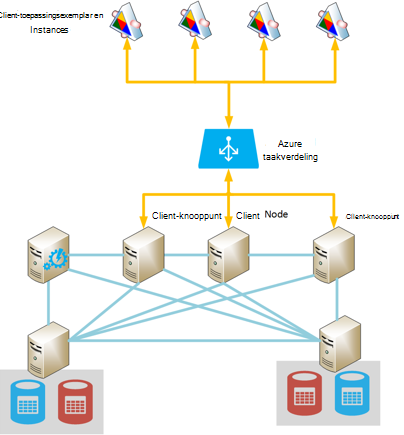
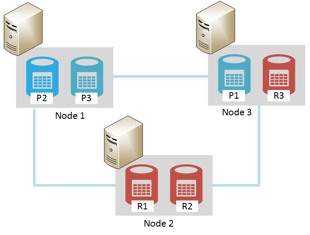

<properties
   pageTitle="Elasticsearch uitgevoerd op Azure | Microsoft Azure"
   description="Het installeren, configureren en uitvoeren van Elasticsearch op Azure."
   services=""
   documentationCenter="na"
   authors="dragon119"
   manager="bennage"
   editor=""
   tags=""/>

<tags
   ms.service="guidance"
   ms.devlang="na"
   ms.topic="article"
   ms.tgt_pltfrm="na"
   ms.workload="na"
   ms.date="09/22/2016"
   ms.author="masashin"/>

# <a name="running-elasticsearch-on-azure"></a>Actieve Elasticsearch op Azure

[AZURE.INCLUDE [pnp-header](../../includes/guidance-pnp-header-include.md)]

In dit artikel maakt [deel uit van een reeks](guidance-elasticsearch.md). 

## <a name="overview"></a>Overzicht

Dit document bevat een korte inleiding tot de algemene structuur van Elasticsearch en vervolgens wordt beschreven hoe u een Elasticsearch cluster met Azure kunt implementeren. Deze raakt op aanbevolen procedures voor het implementeren van een Elasticsearch cluster concentreren op de verschillende functionele prestaties en beheersvereisten voor het van uw systeem en gezien hoe uw vereisten moeten aangestuurd door de configuratie en de zoektopologie die u selecteert.

> [AZURE.NOTE] Deze instructies wordt ervan uitgegaan enkele eenvoudige bekend zijn met [Elasticsearch][].

## <a name="the-structure-of-elasticsearch"></a>De structuur van Elasticsearch 

Elasticsearch is een document-database ten zeerste geoptimaliseerd voor de fungeren als een zoekmachine. Documenten zijn serienummer in JSON-indeling. Gegevens wordt in de indexen, geïmplementeerd via [Apache Lucene][], hoewel de details zijn geabstraheerd vanuit de weergave en het is niet nodig begrijpen Lucene om te kunnen gebruiken Elasticsearch bewaard.

### <a name="clusters-nodes-indexes-and-shards"></a>Clusters, knooppunten, indexen en shards

Elasticsearch implementeert een gegroepeerd architectuur waarin sharding voor gegevens verdelen over meerdere knooppunten en herhaling beschikbaarheid wordt gebruikt. Documenten zijn opgeslagen in indexen. De gebruiker kan opgeven welke velden in een document worden gebruikt om te identificeren in een index, of het systeem automatisch laten genereren een sleutelveld en waarden. De index wordt gebruikt fysiek om documenten te ordenen en wordt de hoofdsom betekent dat voor het zoeken van documenten. 

Een index bevat een reeks shards. Documenten zijn gelijkmatig verspreid staat in shards met een hashing om op basis van de index-sleutelwaarden en het aantal shards in de index. 

Indexen kunnen worden gerepliceerd. In dit geval wordt elke shard in de index gekopieerd. Elasticsearch zorgt ervoor dat elk oorspronkelijke shard voor een index (genoemd "primaire shard") en de replica altijd bevinden zich op verschillende knooppunten. Wanneer een document wordt toegevoegd of gewijzigd, schrijf alle bewerkingen worden uitgevoerd op de primaire shard eerste en klik vervolgens op elke replica. 

De onderstaande afbeelding ziet u de essentiële aspecten van een Elasticsearch cluster met drie knooppunten. Een index is gemaakt die uit twee primaire shards met twee replica's voor elke shard (zes shards in alle bestaat).


*Een eenvoudige Elasticsearch cluster met twee primaire knooppunten en twee sets replica 's*

In dit cluster bevinden primaire shard 1 en 2 voor primaire shard zich op afzonderlijke knooppunten om te helpen met het selectievakje laden alle ze balans. De replica's zijn op dezelfde manier verdeeld. Als één knooppunt mislukt, hebben de resterende knooppunten voldoende informatie zodat het systeem blijft werken. Indien nodig, bestaat Elasticsearch uit het niveau van een replica shard als u wilt een primaire shard worden als de bijbehorende primaire shard niet beschikbaar is.

### <a name="node-roles"></a>Knooppunt rollen

De knooppunten in een cluster Elasticsearch kunnen de volgende rollen uitvoeren:

- Een **gegevensknooppunt** voor een of meer shards die indexgegevens bevatten.

- Een **client knooppunt** dat niet indexgegevens over maar die verzoeken voor oproepen die zijn aangebracht door de juiste gegevensknooppunt-clienttoepassingen verwerkt.
 
- Een **basispagina knooppunt** dat niet indexgegevens over maar die cluster management bewerkingen, zoals onderhouden worden uitgevoerd en informatie over de routering rond het cluster distribueren (de lijst waarvan knooppunten welke shards bevatten), bepalen welke knooppunten zijn beschikbaar, shards verplaatsen terwijl knooppunten worden weergegeven en verdwijnen en herstel coördineren na het knooppunt is mislukt. Meerdere knooppunten kunnen worden geconfigureerd als outmodellen, maar dat is wel slechts één worden gekozen basispagina bewerkingen uitvoeren. Als dit knooppunt mislukt, een andere verkiezingsuitslagen plaatsvindt en een van de andere in aanmerking komend basispagina knooppunten worden gekozen en overnemen.

> [AZURE.NOTE]Het gekozen basispagina knooppunt is belangrijk dat het wordt goed van het cluster. De andere knooppunten ping deze regelmatig om ervoor te zorgen dat dit nog steeds beschikbaar is. Als het gekozen basispagina knooppunt ook als een gegevensknooppunt fungeert, is er een kans dat het knooppunt kan worden omgezet in bezet en fail reageren op deze ping-opdrachten. In dit geval de basispagina wordt beschouwd als is mislukt en een van de andere basispagina knooppunten is geselecteerd in plaats daarvan. 

 De onderstaande afbeelding ziet u een topologie met een combinatie van speciale basispagina, client en gegevensknooppunten in een cluster Elasticsearch.


*Een Elasticsearch cluster met verschillende typen knooppunten*

### <a name="costs-and-benefits-of-using-client-nodes"></a>Kosten en voordelen van het gebruik van de client knooppunten

Wanneer een toepassing een query toevoegen aan een cluster Elasticsearch indient, is het knooppunt waarmee de toepassing verbinding maakt leiding van het queryproces. Het knooppunt de aanvraag doorgestuurd naar elk gegevensknooppunt en worden de resultaten, de samengevoegde gegevens terugkeren naar de toepassing verzameld. Als een query aggregaties en andere berekeningen houdt, voor het knooppunt waarmee de toepassing verbinding maakt, worden de benodigde bewerkingen uitgevoerd nadat de gegevens ophaalt uit elk van de andere knooppunten. Dit proces spreidingsdiagrammen/verzamelen kan aanzienlijke verwerking en geheugen bronnen gebruiken.

Gebruikt speciale client knooppunten deze taken uitvoeren, kunt gegevensknooppunten kunt richten op beheren en gegevens opslaat. Het resultaat is dat veel scenario's, waarbij u gebruikmaakt van complexe query's en aggregaties profiteren kunnen van speciale client knooppunten. De gevolgen van het gebruik van speciale client knooppunten varieert echter waarschijnlijk afhankelijk van uw scenario, werkdruk en clustergrootte. 

> [AZURE.NOTE] Raadpleeg [gegevens aggregatie optimaliseren en prestaties van query's voor Elasticsearch op Azure][] voor meer informatie over het afstemmen proces.

### <a name="connecting-to-a-cluster"></a>Verbinding maken met een cluster

Elasticsearch beschrijft een reeks REST API's voor het maken van clienttoepassingen en vergaderverzoeken verzenden naar een cluster. Als u toepassingen met .NET Framework ontwikkelt, twee hogere niveaus API's zijn beschikbaar: [Elasticsearch.Net & NESTEN][].

Als u met Java-clienttoepassingen samenstelt, kunt u het [Knooppunt Client API][] client dynamisch knooppunten maken en deze toevoegen aan het cluster. Client dynamisch knooppunten maken is handig als uw systeem een relatief klein aantal lange levensduur verbindingen gebruikt. Client-knooppunten die zijn gemaakt met behulp van de API knooppunt zijn opgegeven met het cluster (de details waarvan knooppunten bevatten welke shards) routering toewijzen door het knooppunt basispagina. Deze informatie kan de toepassing Java sluit rechtstreeks aan op de juiste knooppunten wanneer indexeren of opvragen van gegevens, het aantal hops die mogelijk nodig bij het gebruik van andere API's te verminderen.

De kosten van deze methode is het realiseren van het knooppunt client in het cluster inschrijven. Als een groot aantal knooppunten van de client weergegeven en snel verdwijnen, zijn de gevolgen van het onderhoud en distribueren van de cluster routeren kaart kan worden aanzienlijk.

De onderstaande afbeelding ziet u een configuratie met een taakverdeling om te leiden aanvragen tot een set met client knooppunten, hoewel de dezelfde strategie kan worden gebruikt om verbinding maken met rechtstreeks naar gegevensknooppunten als client knooppunten niet worden gebruikt.



*Client-toepassingsexemplaren verbinding maakt met een cluster Elasticsearch via de verdeling van de Azure belasting*

> [AZURE.NOTE]U kunt de [Azure taakverdeling][] gebruiken om te laten zien het cluster met openbare Internet of u kunt een [interne taakverdeling][] gebruiken als de clienttoepassingen en cluster bevinden zich volledig in hetzelfde privé virtuele netwerk (VNet).

### <a name="node-discovery"></a>Knooppunt discovery

Elasticsearch is gebaseerd op peer-to-peer-communicaties, zodat andere knooppunten in een cluster ontdekken een belangrijk onderdeel in de levenscyclus van een knooppunt is. Knooppunt discovery kunt nieuwe gegevensknooppunten dynamisch wordt toegevoegd aan een cluster, wat op zijn beurt kan het cluster transparant schaal af. Ook als een gegevensknooppunt niet reageren op communicatie aanvragen van andere knooppunten, kunt een basispagina knooppunt beslissen dat het gegevensknooppunt is mislukt en de benodigde stappen opnieuw toewijzen van de shards die deze is vasthouden naar andere knooppunten operationele gegevens uitvoeren.

Elasticsearch knooppunt discovery wordt uitgevoerd door het gebruik van een discovery-module. De module discovery is een invoegtoepassing die kan worden veranderd om een andere discovery-oplossing te gebruiken. De standaard-discovery-module ([Zen][]) zorgt ervoor dat een knooppunt naar ping-verzoeken om te zoeken van andere knooppunten in hetzelfde netwerk. Als andere knooppunten reageert, ze roddels om uitwisseling van gegevens. Een basispagina knooppunt vervolgens shards naar het nieuwe knooppunt distribueren (als dit een gegevensknooppunt is) en het cluster opnieuw. De Zen discovery-module verwerkt ook het proces basispagina verkiezingsuitslagen en het protocol voor detectie van knooppunt is mislukt.

Daarnaast kunnen wanneer u Elasticsearch knooppunten als Azure virtuele machines (VMs), wordt multicast-berichten niet ondersteund. Voor deze redenen, moet u het detecteren Zen als u wilt gebruiken unicast messaging en geef een lijst met geldige contactpersonen knooppunten in het configuratiebestand elasticsearch.yml configureren.

Als u een cluster Elasticsearch binnen een Azure virtuele netwerk host, kunt u opgeven dat de privé DHCP toegewezen IP gericht elk blijven VM in het cluster toegewezen (statisch). U kunt configureren Zen discovery unicast messaging met deze statische IP-adressen. Als u VMs met dynamische IP-adressen gebruikt, houd er rekening mee dat als een VM stopt en start deze kan worden toegewezen een nieuwe IP-adres discovery moeilijker maken. Om te verwerken in dit scenario, kunt u de Zen discovery-module voor de [Cloud-invoegtoepassing van Azure][]uitwisselen. Deze invoegtoepassing gebruikt de API Azure willen implementeren van de om discovery, die is gebaseerd op informatie over Azure abonnement.

> [AZURE.NOTE]De huidige versie van de Azure Cloud-invoegtoepassing moet u het certificaat management voor uw abonnement Azure installeren in de keystore Java op het knooppunt Elasticsearch en geef de locatie en de referenties voor toegang tot de keystore in het bestand elasticsearch.yml. Dit bestand is gehouden als gewone tekst, zodat deze wordt ten zeerste dat u ervoor zorgen dat dit bestand alleen toegankelijk is door de account de service Elasticsearch. 
> 
> Daarnaast kunnen deze methode mogelijk niet compatibel met Azure resourcemanager implementaties. Het wordt aanbevolen dat u statische IP-adressen voor basispagina knooppunten gebruikt, en deze knooppunten willen implementeren Zen discovery unicast messaging gehele cluster gebruiken om deze redenen. In de volgende configuratie (die u uit het bestand elasticsearch.yml voor een voorbeeld van gegevensknooppunt hebt gemaakt), is het IP-adressen verwijzen naar basispagina knooppunten in het cluster:

```yaml
discovery.zen.ping.multicast.enabled: false  
discovery.zen.ping.unicast.hosts: ["10.0.0.10","10.0.0.11","10.0.0.12"]
```

## <a name="general-system-guidelines"></a>Algemene systeem richtlijnen

Elasticsearch kan worden uitgevoerd op verschillende computers, die variëren van een één laptop aan een cluster van geavanceerde servers. De meer bronnen voor het geheugen, computing macht en snel schijven die zijn echter beschikbaar hoe beter de prestaties. De volgende secties samenvatting maken van de basisvereisten hardware en software voor het uitvoeren van Elasticsearch.

### <a name="memory-requirements"></a>Geheugenvereisten 

Elasticsearch probeert voor de opslag van gegevens in het geheugen voor snelheid. Een productieserver hostingprovider knooppunt voor een normale enterprise of commerciële implementatie op Azure gemiddeld grootte nodig tussen 14 en 28GB RAM (D3 of D4 VMs) hebt. **Het selectievakje laden over meer knooppunten in plaats van maken knooppunten met meer geheugen verspreiden** (Experimenten hebt aangegeven dat het gebruik van grotere knooppunten met meer geheugen uitgebreid herstel tijden bij een storing kan veroorzaken.) Echter clusters maken met een groot aantal kleine knooppunten kunt beschikbaarheid en de doorvoer, maar escaleert deze ook de hoeveelheid voor het beheren en onderhouden van een dergelijk systeem.

**50% van de beschikbare geheugen op een server naar de opslagruimte Elasticsearch toewijzen**. Als u Linux instellen de omgevingsvariabele ES_HEAP_SIZE voordat u Elasticsearch uitvoert. U kunt ook als u Windows of Linux gebruikt, kunt u de grootte van geheugen in de `Xmx` en `Xms` parameters tijdens het starten van Elasticseach. Stel beide parameters op dezelfde waarde om te voorkomen dat de Java VM (JVM) het formaat van de opslagruimte gedurende runtime wijzigen. Echter **kan niet meer dan 30 GB toewijzen**. Gebruik het resterende geheugen voor de cache van het besturingssysteem-bestanden.

> [AZURE.NOTE]Elasticsearch maakt gebruik van de bibliotheek Lucene als u wilt maken en beheren van indexen. Lucene structuren gebruiken een schijf-indeling en caching van deze structuren in het cachegeheugen enorm prestaties verbeteren.

Houd er rekening mee dat de grootte van de maximale optimale opslagruimte voor Java op een 64-bits computer net boven 30GB is. Boven deze grootte die Java schakelt u over het gebruik van een uitgebreide manier voor het verwijzen naar objecten op de opslagruimte, waarin de geheugenvereisten voor elk object verhogen en vermindert de prestaties. 

De standaard Java garbagecollector (gelijktijdige markeren en opschonen) mogelijk ook optimaal onderliggend als de opslagruimte grootte dan 30 GB is. Het is momenteel niet aanbevolen om te schakelen naar een ander garbagecollector zoals Elasticsearch en Lucene alleen ten opzichte van de standaard getest zijn.

Te geheugen zoals Bezig belangrijkste geheugen op schijf systeemprestaties prestaties. Indien mogelijk uitschakelen volledig verwisselen (de details is afhankelijk van het besturingssysteem). Als dit niet mogelijk is Schakel de instelling *mlockall* in het configuratiebestand Elasticsearch (elasticsearch.yml) als volgt:

```yaml
bootstrap.mlockall: true
```

Deze configuratieinstelling zorgt ervoor dat de JVM het geheugen vergrendelen en voorkomen dat deze wordt uitgewisseld door het besturingssysteem.

### <a name="disk-and-file-system-requirements"></a>Schijf- en systeemvereisten

Gegevensschijven ondersteund door de premium-opslag voor het opslaan van shards gebruiken. Schijven moeten worden aangepast houdt u de maximale hoeveelheid gegevens verwacht in uw shards, hoewel het mogelijk om toe te voegen verdere schijven later is. U kunt een shard over meerdere schijven op een knooppunt uitbreiden.

> [AZURE.NOTE]Elasticsearch de gegevens voor opgeslagen velden worden gecomprimeerd met behulp van de algoritme van de LZ4 en in Elasticsearch 2.0 hoger kunt u het compressietype wijzigen. U kunt de compressiealgoritme van de overschakelen naar DEFLATE zoals gebruikt door de *postcodes* en *gzip's* . Deze techniek compressie soms veel meer bronnen, maar u het beste gebruiken voor gearchiveerde logboekgegevens. Deze methode kunt index verkleinen.

Het is niet essentieel of alle knooppunten in een cluster dezelfde schijfindeling en capaciteit hebben. Echter een knooppunt met de schijfcapaciteit van een zeer grote vergeleken met andere knooppunten in een cluster trekt meer gegevens en moet u betere verwerking power om deze gegevens te verwerken. Daarom het knooppunt kan worden omgezet in 'warm' vergeleken met andere knooppunten en kunt dit op zijn beurt prestaties beïnvloeden.

Gebruik indien mogelijk RAID 0 (gesegmenteerd te verdelen). Er zijn andere vormen van RAID die overeenkomst en spiegelen implementeren onnodige zoals Elasticsearch een eigen oplossing hoge beschikbaarheid in de vorm van replica's biedt.

> [AZURE.NOTE]Voordat u Elasticsearch 2.0.0, kan u ook gesegmenteerd op het softwareniveau van de te verdelen door het opgeven van meerdere mappen in de instelling van de configuratie *path.data* implementeren. Dit formulier van gesegmenteerd te verdelen in Elasticsearch 2.0.0, wordt niet meer worden ondersteund. In plaats daarvan verschillende shards kunnen worden toegewezen aan verschillende paden, maar alle bestanden in een enkel shard worden geschreven naar hetzelfde pad. Als u gesegmenteerd te verdelen vereist, moet u de gegevens van het besturingssysteem of hardwareniveau stripe. 

Opslag doorvoer, elke **VM moet een speciale premium opslag-account hebt**maximaliseren.

De bibliotheek Lucene een groot aantal bestanden kunt gebruiken voor de opslag indexgegevens en Elasticsearch een groot aantal sockets voor de communicatie tussen knooppunten en met klanten kunt openen. Zorg ervoor dat het besturingssysteem is geconfigureerd voor ondersteuning voldoende bestand openen descriptors (maximaal 64000 zijn als onvoldoende geheugen beschikbaar is). Houd er rekening mee dat de standaard-configuratie voor veel Linux onderzoeken het aantal beperkt bestand openen descriptors naar 1024, welke veel te klein is.

Elasticsearch gebruikt een combinatie van geheugen toegewezen (mmap) I/O en Java nieuwe i/o-(NIO) gelijktijdige toegang tot gegevensbestanden en indexen optimaliseren. Als u Linux gebruikt, moet u het besturingssysteem om ervoor te zorgen dat er voldoende virtueel geheugen beschikbaar op de spatie voor 256K geheugen kaart gebieden is configureren.

> [AZURE.NOTE]Veel Linux onderzoeken standaard over het gebruik van de volledig fair wachtrij plaatsen (CFQ) planner bij het rangschikken van gegevens naar schijf schrijven. Deze scheduler niet is geoptimaliseerd voor SSD. Houd rekening met het besturingssysteem gebruik van de planner Nooperation of de deadline scheduler, die beide effectiever voor SSD zijn opnieuw te configureren.

### <a name="cpu-requirements"></a>CPU-vereisten

Azure VMs zijn beschikbaar in een groot aantal verschillende CPU configuraties, ondersteunende tussen 1 en 32 cores. Naar het gegevensknooppunt, is een goed beginpunt een standaard DS-reeks VM aan en selecteer een van beide de DS3 (4 cores) of D4 (8-cores) SKU's. De DS3 bovendien 14GB RAM, terwijl de DS4 28GB bevat. 

Xeon E5 V3-processors die mogelijk zijn handig voor werkbelasting die sterk computerintensieve, zoals grootschalige aggregaties zijn voor de GS-reeks (voor premium opslag) en G-serie (voor standaard opslag) gebruikt. Ga naar [grootten voor virtuele machines][]voor de meest recente gegevens.

### <a name="network-requirements"></a>Netwerkvereisten

Elasticsearch vereist een netwerkbandbreedte van tussen 1 en 10Gbps, afhankelijk van de grootte en volatiliteit clusters die worden geïmplementeerd. Elasticsearch migreert shards tussen knooppunten, zoals meer knooppunten worden toegevoegd aan een cluster. Elasticsearch wordt ervan uitgegaan dat de tijd van de communicatie tussen alle knooppunten ongeveer overeenkomt en geen rekening met de relatieve locaties van shards op die knooppunten gehouden. Replicatie kan ook aanzienlijk netwerk I/O tussen shards tot. Voor deze redenen **vermijden clusters op knooppunten die in verschillende gebieden zijn maken**.

### <a name="software-requirements"></a>Softwarevereisten

U kunt Elasticsearch uitvoeren op Windows of Linux. De service Elasticsearch als Java oppervlak bibliotheek wordt geïmplementeerd en afhankelijk is van andere Java-bibliotheken die van het pakket Elasticsearch uitmaken deel. U moet de Java 7 (update 55 of hoger) of Java installeren 8 (update van 20 of hoger) JVM Elasticsearch uitvoeren.

> [AZURE.NOTE]Dan de parameters van de geheugen *Xmx* en *Xms* (opgegeven als opdrachtregelopties voor de engine Elasticsearch – Zie [geheugenvereisten][]) Wijzig niet de standaardinstellingen voor de configuratie van JVM. Elasticsearch is ontworpen met de standaardinstellingen; blokjes kan leiden tot Elasticsearch detuned en slecht uitvoeren.

### <a name="deploying-elasticsearch-on-azure"></a>Elasticsearch op Azure implementeren

Hoewel het niet moeilijk te implementeren van één exemplaar van Elasticsearch, kan voor het maken van een aantal knooppunten en bij het installeren en configureren van Elasticsearch op elk item een tijd in beslag nemen en lastige proces zijn. Als u bezig zijn met het Elasticsearch op Azure VMs uitgevoerd, hebt u drie opties waarmee u kunnen de kans van fouten kleiner.

- Gebruik de resourcemanager Azure- [sjabloon](https://azure.microsoft.com/marketplace/partners/elastic/elasticsearchelasticsearch/) in Azure marketplace. Deze sjabloon wordt gemaakt door elastische. U kunt commerciële verbeteringen zoals schild, Marvel Watcher en dergelijke toevoegen.

- Gebruik van de Azure quickstart- [sjabloon](https://github.com/Azure/azure-quickstart-templates/tree/master/elasticsearch) maken van het cluster. Deze sjabloon kunt een cluster op basis van Windows Server 2012 of Ubuntu Linux 14.0.4 maken. Dit kunt u experiment functies zoals Azure bestandsopslag. Deze sjabloon wordt gebruikt voor de onderzoeks- en testen taken in dit document.

- Scripts die kunnen worden automatisch in- of toezicht worden gebruikt. Scripts die kunnen maken en implementeren van een cluster Elasticsearch zijn beschikbaar op de [GitHub opslagplaats][elasticsearch-scripts]

## <a name="cluster-and-node-sizing-and-scalability"></a>Cluster en knooppunt hoekformaatgreep en schaalbaarheid 

Elasticsearch kunt een aantal implementatietopologieën, ter ondersteuning van verschillende vereisten en niveaus van schaal. In deze sectie worden enkele veelvoorkomende topologieën beschreven en wordt de overwegingen voor de uitvoering van clusters op basis van deze topologieën beschreven.

### <a name="elasticsearch-topologies"></a>Elasticsearch topologieën

De onderstaande afbeelding ziet u een beginpunt voor het ontwerpen van de topologie van een Elasticsearch voor Azure:


*Voorgestelde beginpunt voor het samenstellen van een Elasticsearch cluster met Azure*

Deze topologie bevat zes gegevensknooppunten samen met drie client knooppunten en drie basispagina knooppunten (slechts één basispagina knooppunt is geselecteerd, de andere twee zijn beschikbaar voor verkiezingsuitslagen moet het gekozen outmodel mislukken.) Elk knooppunt wordt geïmplementeerd als een afzonderlijke VM. Azure webtoepassingen, worden doorgestuurd naar client knooppunten via een taakverdeling. 

In dit voorbeeld worden alle knooppunten en de webtoepassingen in hetzelfde virtuele netwerk waarin ze effectief geïsoleerd van buiten wereld bevinden. Als het cluster beschikbaar moet zijn extern (mogelijk als onderdeel van een oplossing van een hybride on-premises implementatie clients opnemen), kunt u de verdeling van de Azure belasting op te geven van een openbare IP-adres gebruiken, maar u moet extra beveiliging voorzorgsmaatregelen treffen om te voorkomen dat onbevoegde toegang tot het cluster. 

De optioneel 'springen vak' is een VM die is alleen beschikbaar voor beheerders. Deze VM heeft een verbinding met het virtuele netwerk, maar ook een passieve die tegenover elkaar liggen netwerkverbinding om aan te melden als beheerder van een extern netwerk (deze aanmelding moet worden beveiligd met een sterk wachtwoord of het certificaat) toestaan. Een beheerder kunt aanmelden bij het vak springen en sluit daarvandaan rechtstreeks naar een van de knooppunten in het cluster. 

Alternatieve benaderingen opnemen via een VPN naar website tussen een organisatie en het virtuele netwerk of [ExpressRoute][] circuits verbinding maken met het virtuele netwerk gebruiken. Deze regelingen vergunningsaanvragen beheerderstoegang tot het cluster zonder dat het cluster met openbare internet.

Als u wilt behouden VM beschikbaarheid, zijn de gegevensknooppunten gegroepeerd in dezelfde beschikbaarheid van Azure set. Op dezelfde manier de client knooppunten worden gehouden in een andere beschikbaarheid instellen en de basispagina knooppunten zijn opgeslagen in een derde beschikbaarheid.

Deze topologie is relatief gemakkelijk schaal af, gewoon meer knooppunten van het juiste type toe te voegen en zeker weet dat ze zijn geconfigureerd met dezelfde clusternaam in het bestand elasticsearch.yml. Client knooppunten moet ook worden toegevoegd aan de backend-toepassingen voor de verdeling van de Azure laden.

**Clusters geografische zoeken**

**Knooppunten in een cluster tussen regio's niet worden verspreid als dit van invloed op de prestaties van de communicatie tussen knooppunt zijn kan** (Zie [vereisten voor netwerk][]). Zoeken van de geografische gegevens dicht bij de gebruikers in verschillende regio's is vereist voor het maken van meerdere clusters. In dit geval moet u rekening houden hoe (of zelfs of) voor het synchroniseren van clusters. Mogelijke oplossingen omvatten:

[Tribe knooppunten][] zijn vergelijkbaar met een client-knooppunt, behalve dat dit kunt deelnemen aan meerdere Elasticsearch clusters en ze alles als één groot cluster te bekijken. Nog steeds lokaal gegevens worden beheerd door elke cluster (updates worden niet doorgegeven cluster grenzen), maar alle gegevens zichtbaar is. Een knooppunt tribe kunt zoeken, maken en beheren van documenten in een cluster. 

De primaire beperkingen zijn dat een knooppunt tribe kan niet worden gebruikt om een nieuwe index te maken en indexnamen uniek zijn in alle clusters moet. Het is dus belangrijk dat u rekening houden met hoe de indexen worden genoemd, wanneer u clusters bedoeld om u te zijn toegankelijk vanaf tribe knooppunten ontwerpt.

Met deze methode, elk cluster bevatten de gegevens die waarschijnlijk het meest worden gebruikt door lokale clienttoepassingen, maar deze clients nog steeds kunnen openen en te wijzigen van externe gegevens zo goed mogelijk uitgebreide latentie Hoewel bij. De onderstaande afbeelding ziet u een voorbeeld van deze topologie. Het knooppunt tribe in Cluster 1 is gemarkeerd; de andere clusters kunnen ook tribe knooppunten bevatten, maar deze niet worden weergegeven in het diagram:


*Een clienttoepassing toegang krijgen tot meerdere clusters via een knooppunt tribe*

In dit voorbeeld de clienttoepassing maakt verbinding met het knooppunt tribe in Cluster 1 (samen zich in dezelfde regio), maar dit knooppunt is geconfigureerd om te kunnen access Cluster 2 en 3 Cluster, die mogelijk in verschillende regio's bevindt. De clienttoepassing kan aanvragen die ophalen of wijzigen van gegevens in een of meer clusters verzenden.

> [AZURE.NOTE]Tribe knooppunten vereisen multicast discovery verbinding maken met kolomgroepen die een bedreiging kunnen opleveren. Zie het gedeelte [knooppunt discovery][] voor meer informatie.

- Geografische-replicatie tussen clusters implementeren. In deze benadering wijzigingen op elk cluster worden doorgegeven in in de buurt van realtime met clusters bevinden in andere datacenters. Invoegtoepassingen van derden zijn beschikbaar voor Elasticsearch die ondersteuning bieden voor deze functionaliteit, zoals de [PubNub wijzigingen-invoegtoepassing][].

- Gebruik van de [Elasticsearch momentopname en herstellen module][]. Als de gegevens zeer vertraagd-verplaatsen is en alleen door één cluster is gewijzigd, kunt u overwegen momentopnamen maken van een periodieke kopie van de gegevens en zet deze momentopnamen in andere clusters (momentopnamen kunnen worden opgeslagen in Azure-blobopslag als u de [Azure Cloud-invoegtoepassing][]hebt geïnstalleerd). Deze oplossing werkt echter niet goed voor het snel wijzigen van gegevens of als de gegevens kunnen worden gewijzigd in meer dan één cluster.

**Kleine topologieën**

Grootschalige topologieën clusters van knooppunten van speciale basispagina, client en gegevens die mogelijk niet geschikt te maken voor elke scenario. Als u een kleine productie of systeem voor de ontwikkeling maakt, kunt u de cluster 3 knooppunten weergegeven in de onderstaande afbeelding.

Clienttoepassingen sluit rechtstreeks aan een knooppunt beschikbare gegevens in het cluster. Het cluster bevat drie shards gekenmerkt P1-P3 (voor voor groei) plus replica's gekenmerkt R1-R3. Gebruikt drie knooppunten, kunt Elasticsearch kunt distribueren naar de shards en replica's zodat als een willekeurig knooppunt mislukt geen gegevens verloren die zijn.



*Een 3-knooppunt cluster met 3 shards en replica 's*

Als u een development-installatie op een computer zelfstandige uitvoert kunt u een cluster met één knooppunt die als basispagina, client en gegevens opslag fungeert. U kunt ook meerdere knooppunten uitgevoerd als een cluster op dezelfde computer meer dan één exemplaar van Elasticsearch starten door te starten. De onderstaande afbeelding ziet u een voorbeeld.


*Een development-configuratie met meerdere Elasticsearch knooppunten op dezelfde computer*

Houd er rekening mee dat geen van deze configuraties zelfstandige worden aanbevolen voor een productieomgeving, terwijl ze leiden conflicten tot kunnen tenzij de ontwikkeling-computer een aanzienlijke hoeveelheid geheugen en meerdere snel schijven heeft. Daarnaast kunnen bieden ze geen dat andere hoge beschikbaarheid garandeert. Als de computer is mislukt, gaan alle knooppunten verloren.

### <a name="scaling-a-cluster-and-data-nodes"></a>Schaalbaarheid van de knooppunten van een cluster en gegevens

Elasticsearch kunt schaal in twee dimensies: verticaal (via groter, krachtiger systemen) en horizontaal (het selectievakje laden spreiden over machines).

**Elasticsearch gegevensknooppunten verticaal schaalbaarheid**

Als u een Elasticsearch cluster met behulp van Azure VMs host, overeenkomen elk knooppunt met een VM. De limiet voor verticale schaalbaarheid naar het knooppunt is grotendeels geregeld door de SKU van VM en de algehele beperkingen toegepast op afzonderlijke opslag accounts en Azure abonnementen. 

De pagina [Azure-abonnement en limieten van de service, quota's en beperkingen](../azure-subscription-service-limits.md) wordt deze limieten in detail beschreven, maar wat betreft bouwen van een cluster Elasticsearch is, de items in de volgende lijst worden het meest relevant zijn. 

- Elk account opslag is beperkt tot 20.000 IO's / s. Elke VM in het cluster kan gebruikmaken van een speciale (bij voorkeur premium) opslag-account.

- Het aantal gegevensknooppunten in een virtueel netwerk. Als u niet de resourcemanager Azure gebruikt, ziet u een limiet van 2048 VM exemplaren per virtueel netwerk. Terwijl dit voldoende voor veel gevallen bewijzen moet hebt u een zeer grote configuratie met duizenden knooppunten mogelijk een beperking.

- Het aantal opslag accounts per abonnement per regio. U kunt maximaal 100 opslag accounts per Azure abonnement maken in elke regio. Opslag-accounts zijn bedoeld voor virtuele schijven en elk account opslag geldt een limiet van 500TB ruimte.

- Het aantal kernen per abonnement. De standaardbeperking is 20 cores per abonnement, maar dit kan maximaal 10.000 cores met toenemen aanvragen van een stijging van de limiet via een ondersteuningsticket. 

- De hoeveelheid geheugen per VM grootte. Kleinere tekengrootte VMs beperkt hoeveelheden beschikbare geheugen (D1 machines 3,5 GB hebt en D2 machines hebt 7 GB). Deze machines is mogelijk niet geschikt voor scenario's waarvoor Elasticsearch om grote hoeveelheden gegevens aan goede prestaties (gegevens aggregeren of analyseren van een groot aantal documenten tijdens de opname van de gegevens, bijvoorbeeld) in cache.

- Het maximum aantal schijven per VM grootte. Deze beperking kunt beperken de grootte en prestaties van een cluster. Minder schijven betekent dat minder gegevens kan plaatsvinden, en de prestaties kan afnemen als er minder schijven beschikbaar voor gesegmenteerd te verdelen.

- Het aantal domeinen bijwerken / fault domeinen per beschikbaarheid instellen. Als u met bronbeheer Azure VMs maakt, kan elke set beschikbaarheid maximaal 3 foutenstructuuranalyse domeinen en 20 update domeinen worden toegewezen. Deze beperking kan van invloed zijn op de flexibiliteit van een grote cluster die is ondergaan veelgebruikte lopende updates.

Daarnaast moet u waarschijnlijk geen overwegen VMs met meer dan 64GB geheugen. Zoals is beschreven in de sectie [geheugenvereisten][], moet u niet meer dan 30 GB RAM op elke VM toewijst aan de JVM en ervoor dat het besturingssysteem gebruik van de resterende geheugen voor i/o-buffer.

Met deze beperkingen worden ingeschakeld in gedachten, moet u altijd de virtuele schijven voor de VMs in een cluster verspreid over opslag-accounts de kans van de i/o-beperken kleiner. In een zeer grote cluster moet u mogelijk het ontwerp van de infrastructuur van uw logische en splitsen in afzonderlijke functionele partities. Bijvoorbeeld mogelijk moet u het cluster splitsen in abonnementen, hoewel dit proces kan leiden tot verdere problemen vanwege dat u een virtuele netwerken.

**Een cluster Elasticsearch schalen horizontaal**

Binnen Elasticsearch, wordt de limiet voor horizontale schaalbaarheid intern bepaald door het aantal shards voor elke index gedefinieerd. In eerste instantie veel shards kunnen worden toegewezen aan hetzelfde knooppunt in een cluster, maar als het volume van de gegevens in omvang extra groeit knooppunten kunnen worden toegevoegd en shards kan worden verdeeld over deze knooppunten. In theorie alleen als het aantal knooppunten het aantal shards bereikt het systeem niet meer horizontaal schaal.

Met een verticale schaling zijn er enkele problemen waarmee u rekening houden moet wanneer die implementeren horizontaal schalen, waaronder:

- Het maximum aantal VMs waarmee u verbinding in een Azure virtuele netwerk maken kunt. Dit kunt de horizontale schaalbaarheid voor een zeer grote cluster beperken. U kunt een cluster van knooppunten dat reeksen meer dan één virtueel netwerk te omzeilen deze limiet, maar deze methode tot verminderde prestaties vanwege het ontbreken van de plaats van elk knooppunt met haar collega's leiden kan maken.

- Het aantal schijven per VM grootte. Ondersteuning van verschillende getallen van gekoppelde schijven andere reeks en SKU's.
Bovendien kunt u ook overwegen de kortstondige opslag wordt geleverd bij de VM op te geven van een beperkte tijdsduur sneller gegevensopslag, hoewel er tolerantie en herstelbestanden consequenties waarmee u rekening moet houden (Zie [configureren flexibiliteit en -herstel op Elasticsearch op Azure] [ elasticsearch-resilience-recovery] voor meer informatie). De D-reeks, DS-reeks, Dv2-reeks en GS-reeks VMs SSD voor kortstondige opslag gebruiken.

U kunt u overwegen [VM schaal Sets] [ vmss] starten en stoppen VMs zoals bepaalt is vereist. Echter deze methode mogelijk niet geschikt te maken voor een cluster Elasticsearch voor de volgende oorzaken hebben:

- Deze methode werkt het meest geschikt voor stateless VMs. Telkens wanneer u toevoegen of verwijderen van een knooppunt uit een cluster Elasticsearch shards opnieuw zijn toegewezen, zodat het saldo vanaf het selectievakje laden en dit proces aanzienlijk hoeveelheden netwerkverkeer en schijf I/O kunt genereren en deze kunt systeemprestaties gegevens opname tarieven. U moet te beoordelen of dit realiseren zegt het voordeel van de aanvullende verwerking en geheugen resources die beschikbaar komen door meer VMs dynamisch te starten.

- VM opstarten niet onmiddellijk plaatsvindt en het kan enkele minuten duren voordat extra VMs beschikbaar komen of ze worden afgesloten. Schaalbaarheid op deze manier mag alleen worden gebruikt u omgaat met continue wijzigingen van de vraag.

- Na het horizontaal schalen, u daadwerkelijk moet u rekening moet houden schaalbaarheid terug? Een VM verwijderen uit een cluster Elasticsearch, kan een resource intensief proces vereisen dat Elasticsearch herstelt de shards en replica's die op die VM bevinden zich en voegt u deze toe op een of meer van de resterende knooppunten zijn. Verschillende VMs op hetzelfde moment verwijderen, kan de integriteit van het cluster, waardoor het herstelproces is moeilijk in gevaar brengen. Bovendien veel Elasticsearch implementaties na verloop van tijd toenemen, maar de aard van de gegevens zodat deze niet gemakkelijk verkleinen in volume is. Het is mogelijk handmatig verwijderen van documenten en documenten kunnen ook worden geconfigureerd met een TTL (time naar live) na waarin ze verlopen en worden verwijderd, maar in de meeste gevallen is de kans groot dat de ruimte die eerder toegewezen snel opnieuw door de nieuwe of gewijzigde documenten gebruikt. Fragmentatie binnen een index kan optreden wanneer documenten worden verwijderd of gewijzigd, zodat u kunt de Elasticsearch HTTP [optimaliseren][] API (Elasticsearch 2.0.0 en eerder) of het [Samenvoegen van kracht][] API (Elasticsearch 2.1.0 en hoger) defragmentatie uitvoeren.

### <a name="determining-the-number-of-shards-for-an-index"></a>Het aantal shards voor een index vaststellen

Het aantal knooppunten in een cluster kan variëren loop van de tijd, maar het aantal shards in een index is opgelost nadat u de index is gemaakt. Als u wilt toevoegen of verwijderen van shards vereist opnieuw indexeren van de gegevens – een proces van een nieuwe index maken met het vereiste aantal shards en vervolgens de gegevens van de oude index te kopiëren naar het nieuwe (u kunt aliassen kastje gebruikers van het feit dat gegevens opnieuw zijn geïndexeerd – Zie [afstemmen gegevens aggregatie en prestaties van query's voor Elasticsearch op Azure][] voor meer informatie).
Daarom is het belangrijk om te bepalen van het aantal shards die u vaak vereisen aangekondigd vóór de eerste index maken in uw cluster. U kunt de volgende stappen uit om dit nummer stand te brengen uitvoeren:

- Maak een cluster met één knooppunt met dezelfde hardwareconfiguratie die u wilt implementeren in productie.

- Een index die overeenkomt met de structuur die u wilt gebruiken in productie maken. Een enkel shard en geen replica's mogelijkheden geven voor deze index.

- Een specifieke hoeveelheid realistische productiegegevens toevoegen aan de index.

- Normale query's, aggregaties en andere werkbelasting ten opzichte van de index uitvoeren en de tijd doorvoer en reactie meten.

- Als de tijd doorvoer en antwoord binnen acceptabel grenzen, herhaalt u het proces uit stap 3 (meer gegevens toevoegen).

- Wanneer u de capaciteit van de shard (antwoord tijden en doorvoer starten raken niet acceptabel) hebt bereikt, noteer het volume van documenten.

- Afleiden van de capaciteit van een enkel shard op het verwachte aantal documenten in productie voor het berekenen van het vereiste aantal shards (Neem sommige foutmarge in deze berekeningen zoals extrapolatie niet een exacte wetenschappelijke is).

> [AZURE.NOTE]Houd er rekening mee dat elke shard wordt geïmplementeerd als een Lucene-index die geheugen, CPU power en om het bestand verbruikt. De meer shards u hebt, meer van deze bronnen die u nodig.

Daarnaast kunnen meer shards maken schaalbaarheid (afhankelijk van uw werkbelasting en scenario) mogelijk vergroten en opname gegevensdoorvoer kunt vergroten, maar het deze de efficiëntie van veel query's mogelijk beperken voor. Standaard wordt een query elke shard die worden gebruikt door een index (u kunt [aangepaste routering][] dit gedrag wijzigen als u welke shards de gegevens die u nodig hebt bevindt zich weet op) onderzoeken. 

Dit proces volgen, kan een raming voor het aantal shards alleen genereren en het volume van de documenten verwacht in productie mogelijk niet bekend. In dit geval moet u het oorspronkelijke volume (Zie boven) en de voorspelde groei bepalen. Maak een juiste aantal shards dat de groei van gegevens voor de periode totdat u bent bereid opnieuw indexeren van de database kan worden verwerkt. 

Andere strategieën gebruikt voor scenario's zoals beheer van gebeurtenissen en logboekregistratie omvatten het gebruik van de lopende indexen.
Maak een nieuwe index voor de gegevens ingenomen van elke dag en toegang tot deze index via een alias die dagelijks is veranderd zodat deze verwijzen naar de meest recente index. Deze methode kunt u eenvoudiger leeftijd-out oude gegevens (u kunt met gegevens die niet meer nodig indexen verwijderen) en blijft de hoeveelheid gegevens te beheren.

Houd er rekening mee dat het aantal knooppunten geen heeft zodat deze overeenkomt met het aantal shards. Bijvoorbeeld als u 50 shards maakt, kunt u ze in eerste instantie verspreid over 10 knooppunten en voegt u meer knooppunten als u het systeem af als het volume van werk tariefverhogingen wilt verkleinen. Maak een bijzonder grote aantal shards op een klein aantal knooppunten (1000 shards verdeeld over 2 knooppunten, bijvoorbeeld). Hoewel het systeem theorie aan 1000 knooppunten met deze configuratie schalen kan, voert u 500 shards op een enkel knooppunt risico's de prestaties van het knooppunt crippling.

> [AZURE.NOTE]Voor systemen die gegevens-opname zijn dik, kunt u overwegen een priemgetal van shards. De standaardalgoritme die Elasticsearch voor documentroutering shards produceren een meer zelfs in dit geval verspreiden wordt gebruikt.

### <a name="security"></a>Beveiliging

Standaard Elasticsearch implementeert minimale beveiliging en biedt geen elke beschikbare verificatie en machtiging. Deze aspecten is vereist voor het onderliggende besturingssysteem en netwerk configureren en gebruiken van Plug-ins en hulpprogramma's van derden. Voorbeelden hiervan zijn [schild][]en [Beveiliging van zoeken][].

> [AZURE.NOTE]Schild is een invoegtoepassing die is opgegeven door elastische voor gebruikersverificatie, gegevensversleuteling Rolgebaseerd toegangsbeheer, filteren op IP- en controle. Het is mogelijk dat deze nodig zijn voor het configureren van het onderliggende besturingssysteem implementatie verder beveiligingsmaatregelen, zoals Schijfopruiming versleuteling.

In een productieomgeving, moet u overwegen hoe:

- Onbevoegde toegang tot het cluster voorkomen.
- Moeten identificeren en gebruikers verifiëren.
- Autoriseer de bewerkingen die gebruikers geverifieerde kunnen uitvoeren.
- Beveiligen het cluster rogue of schadelijke bewerkingen.
- De gegevens beveiligen tegen ongeoorloofde toegang.
- Voldoen aan wettelijke vereisten voor gegevensbeveiliging commerciële (indien van toepassing).

### <a name="securing-access-to-the-cluster"></a>Toegang tot het cluster beveiligen

Elasticsearch is een netwerkservice. De knooppunten in een cluster Elasticsearch luisteren naar binnenkomende clientaanvragen met behulp van HTTP en communiceren met elkaar met behulp van een TCP-kanaal. U moet stappen uitvoeren om te voorkomen dat onbevoegden clients of services kunnen aanvragen verzenden via het HTTP- en TCP paden. Houd rekening met de volgende items. 

- Beveiligingsgroepen netwerk als u wilt beperken het binnenkomende en uitgaande netwerkverkeer voor een virtueel netwerk of VM naar alleen bepaalde poorten definiëren.

- Wijzig de standaard-poorten gebruikt voor de client web access (9200) en programma netwerktoegang (9300). Gebruik een firewall elk knooppunt beschermen tegen schadelijke internetverkeer.

- Afhankelijk van de locatie en de verbinding van clients, zet u het cluster in een persoonlijke subnet met geen directe toegang tot Internet. Als het cluster moet worden weergegeven buiten het subnet, routeert alle aanvragen via een bastionhost server of proxy voldoende harde het cluster beveiligen.

Als u moet ondersteuning bieden voor directe toegang tot knooppunten, gebruik een proxyserver [nginx](http://nginx.org/en/) configureren en HTTPS-verificatie.

> [AZURE.NOTE]Een proxyserver zoals nginx gebruikt, kunt u ook toegang tot beperken functionaliteit. Bijvoorbeeld, kunt u nginx als u wilt dat alleen aanvragen voor het \_eindpunt zoeken als u nodig hebt om te voorkomen dat clients andere handelingen kunt verrichten.

Als u meer uitgebreide beveiliging in access netwerk vereist, gebruikt u de afscherming of zoeken beveiliging Plug-ins.

### <a name="identifying-and-authenticating-users"></a>Identificeren en verifiëren van gebruikers

Alle aanvragen die zijn aangebracht door clients in het cluster moeten worden geverifieerd. U moet bovendien voorkomen dat onbevoegden knooppunten deelnemen aan het cluster als deze een Trojaans kunnen opgeven in het systeem dat wordt omzeild verificatie.

Elasticsearch-Plug-ins beschikbaar zijn die verschillende soorten verificatie, kunnen uitvoeren zoals:

- **HTTP-basisverificatie**. Gebruikersnamen en wachtwoorden opnieuw instellen worden opgenomen in elk verzoek om een. Alle aanvragen moeten worden gecodeerd via SSL/TLS of een gelijkwaardig beschermingsniveau.

- **LDAP en Active Directory-integratie**. Deze methode is vereist dat klanten rollen in LDAP of AD-groepen zijn toegewezen.

- **Systeemeigen verificatie**. Identiteiten die zijn gedefinieerd in het Elasticsearch cluster zelf gebruikt.

- **TLS-verificatie**. TLS-verificatie binnen een cluster gebruiken om te verifiëren van alle knooppunten.

- **Filteren op IP**. Gebruik de IP-filtering om te voorkomen dat onbevoegde subnetten van clients verbinding maakt, en ook voorkomen van knooppunten van deze subnetten die deelnemen aan het cluster.

### <a name="authorizing-client-requests"></a>Machtigen clientaanvragen

Autorisatie, is afhankelijk van de Elasticsearch-invoegtoepassing gebruikt om deze service te leveren. Een invoegtoepassing waarmee basisverificatie meestal biedt bijvoorbeeld informatie over functies die het niveau van verificatie, definiëren dat een invoegtoepassing die gebruikmaakt van LDAP of AD worden clients meestal aan functies koppelt en vervolgens toegangsrechten aan die rollen toewijzen. Als u een invoegtoepassing gebruikt, moet u de volgende punten overwegen:

- Moet u de bewerkingen die een client kunt uitvoeren beperken? Bijvoorbeeld een client moet kunnen de status van het cluster, controleren of maken en verwijderen van indexen?

- De client moet worden beperkt tot specifieke indexen? Dit is handig in een multitenant: geen afbreekstreepje per stijl handleiding. >> situatie waar tenants hun eigen specifieke reeks indexen kunnen zijn aangewezen en deze indexen moeten zijn niet toegankelijk voor andere tenants.

- Moet de gewoon door kunnen lezen en schrijven van gegevens naar een index? Een client mogelijk om zoekopdrachten die ophalen van gegevens met behulp van een index, maar kunnen toevoegen of verwijderen van gegevens uit die index, bijvoorbeeld moeten worden voorkomen.

De meeste beveiliging Plug-ins bereik op dit moment bewerkingen op het niveau van de cluster of index, en niet op subsets van documenten in indexen. Dit is vanwege de efficiency. Daarom niet gemakkelijk te beperken aanvragen voor specifieke documenten binnen een enkele index. Als u dit niveau specifieker vereist, documenten opslaan in afzonderlijke indexen en aliassen samen de indexen voor die groep gebruiken. 

Bijvoorbeeld in een systeem personeel als gebruiker A is vereist voor toegang tot alle documenten die informatie over werknemers in afdeling X bevatten, gebruiker B is vereist voor toegang tot alle documenten die informatie over werknemers in afdeling Y bevatten en gebruiker C is vereist voor toegang tot alle documenten die informatie over werknemers in beide afdelingen bevatten, twee indexen maken (voor afdeling X en Y-afdeling) , en een alias die verwijst naar beide indexen. Gebruiker A alleen toegang geven tot de eerste index, gebruiker B leestoegang tot de tweede index en gebruiker C leestoegang tot beide indexen via de alias. Zie [Index Faking per gebruiker met aliassen][]voor meer informatie.

### <a name="protecting-the-cluster"></a>Het cluster beveiligen

Het cluster kan worden omgezet vatbaar voor misbruik als dit niet zorgvuldig is beveiligd. 

**Dynamische query uitvoeren van scripts in Elasticsearch uitschakelen** als ze tot beveiligingsrisico's leiden kunnen een query. Systeemeigen scripts in plaats van query uitvoeren van scripts; gebruiken een systeemeigen script is een invoegtoepassing Elasticsearch geschreven in Java en gecompileerd naar een oppervlak-bestand.

Nu is al dan niet standaard; dynamische query uitvoeren van scripts uitgeschakeld niet opnieuw inschakelen deze tenzij u een zeer goede reden hebt kunt doen.

**Voorkomen dat de queryreeks zoekopdrachten aan gebruikers** als dit type zoeken kunnen gebruikers concurrerende systeembronnen query's uitvoeren. Deze zoekopdrachten kunnen de prestaties van het cluster systeemprestaties en het systeem openen voor DOS-aanvallen kunnen geven. Daarnaast kunnen query-tekenreeks zoeken kunt laten zien mogelijk persoonlijke gegevens.

**Voorkomen dat bewerkingen uit een groot aantal geheugen verbruikt** als deze kunnen leiden tot out geheugen uitzonderingen met resultaat Elasticsearch mislukte op een knooppunt. Langdurige resource intensief bewerkingen kunnen ook worden gebruikt voor het implementeren van DOS-aanvallen. Voorbeelden hiervan zijn:

Search-aanvragen die u wilt laden zeer grote velden in het geheugen (als een query worden gesorteerd, scripts of aspecten van deze velden), zoals voorkomen:

- Hiermee wordt gezocht die query meerdere indexen op hetzelfde moment.

- Zoekopdrachten die een groot aantal velden ophalen. Deze zoekacties kunnen geheugen geluiddempinrichting door veroorzaakt door een enorme hoeveelheid veldgegevens in de cache opgeslagen. Standaard de gegevenscache veld is onbeperkte grootte, maar u kunt de [indices.fielddata.cache.*](https://www.elastic.co/guide/en/elasticsearch/reference/current/modules-fielddata.html) -eigenschappen instellen in het configuratiebestand elasticsearch.yml informatiebronnen beperken. U kunt ook het [veld gegevens stroomonderbreker][] om te voorkomen dat de gegevens in de cache van een veld uit allemaal geheugen en de [aanvraag stroomonderbreker][] afzonderlijke query's geheugen belasten stoppen. De kosten van het instellen van deze parameters is de verbeterde waarschijnlijke enkele query's verbroken of time-out optreedt.
 
> [AZURE.NOTE]Met behulp van [Doc-waarden][] , kunt de geheugenvereisten van indexen verkleinen door het veldgegevens op schijf opslaan in plaats van laden in het geheugen. Dit kan helpen de kans van geheugen uitputting op een knooppunt, maar met een wilt verkleinen in snelheid kleiner.

> Elasticsearch wordt altijd ervan uitgegaan dat er onvoldoende geheugen voor de huidige werklast. Als dit niet het geval is, en vervolgens de Elasticsearch-service kan vastlopen. Elasticsearch biedt eindpunten die gegevens over Resourcegebruik (de HTTP [kat API's][]) retourneren en moet u deze gegevens zorgvuldig controleren.

**Nog te lang een geheugensegment in uitvoering leegmaken**. Dit kan in het geheugen bufferruimte geluiddempinrichting.
Als nodig [de translog configureren][] verkleinen van de drempels waarmee wordt leeggemaakt naar schijf.

**Indexen met grote hoeveelheden metagegevens te maken**. Een index met documenten met een grote variatie in veldnamen kan een groot aantal geheugen in beslag nemen. Zie [Explosie toewijzen][]voor meer informatie.
  
De definitie van een langdurige of query vergt is ten zeerste scenario / regiospecifieke. De werklast meestal verwacht door één cluster mogelijk een volledig ander profiel van de werklast op een andere. Te bepalen welke bewerkingen niet acceptabel is vereist, aanzienlijk onderzoek en testen van uw toepassingen.

Moet ondernemen, detecteren en schadelijke activiteiten stoppen voordat ze ertoe leiden dat significante schade of verlies van gegevens.
Kunt u overwegen een beveiliging cmdlets voor controle en melding systeem dat snel detecteren kan ongebruikelijke patronen van gegevens voor toegang tot en waarschuwingen verhogen wanneer, bijvoorbeeld gebruiker login aanvragen mislukt, onverwachte knooppunten lid of de cluster verlaten of bewerkingen duurt langer dan verwacht. Hulpprogramma's waarmee u kunnen deze taken uitvoeren opnemen Elasticearch [Watcher][].

### <a name="protecting-the-data"></a>De gegevens beveiligen

U kunt gegevens inflight beveiligen met SSL/TLS, maar Elasticsearch biedt geen elke ingebouwde vorm van gegevensversleuteling voor informatie die is opgeslagen op de schijf. Houd er rekening mee dat deze informatie wordt gehouden in bestanden gewone schijf en alle gebruikers met toegang tot deze bestanden mogelijk niets aan de gegevens die ze, bijvoorbeeld bevatten door deze te kopiëren naar hun eigen cluster. Houd rekening met de volgende punten:

- De bestanden die wordt gebruikt door Elasticsearch voor houdt u de gegevens beveiligen. Niet toestaan willekeurige lees- of schrijftoegang tot identiteiten dan de Elasticsearch-service.

- Versleutelt u de gegevens in deze bestanden met behulp van een codering bestandssysteem.

> [AZURE.NOTE]Azure ondersteunt nu schijfversleuteling voor Linux en Windows VMs. Zie [Azure schijf versleuteling voor Windows en Linux IaaS VMs Preview][]voor meer informatie.

### <a name="meeting-regulatory-requirements"></a>Wettelijke vereisten voor vergadering

Wettelijke vereisten hoofdzakelijk betrekking hebben op controle-bewerkingen voor het behoud van een geschiedenis van gebeurtenissen, en ervoor zorgen dat de privacy van de volgende bewerkingen om te voorkomen dat deze wordt gecontroleerd (en cookies) door een extern bureau. Met name, kunt u overwegen hoe:

- Alle aanvragen bijhouden (geslaagd of niet), en alle pogingen voor toegang tot het systeem.

- Communicatie die zijn aangebracht door clients in het cluster alsmede naar knooppunten communicatie uitgevoerd door het cluster versleutelen. U moet SSL/TLS implementeren voor alle clustercommunicatie. Elasticsearch ondersteunt ook pluggable versleuteling als uw organisatie vereisten distinct van de beschikbare via SSL/TLS heeft.

- Alle audit gegevens veilig opslaan. Het volume van controlegegevens zeer snel te vergroten en krachtig om te voorkomen dat wordt geknoeid van controlegegevens moet worden beveiligd.

- Veilig controlegegevens archiveren.

### <a name="monitoring"></a>Cmdlets voor controle

Het is belangrijk om cmdlets voor controle op het niveau van besturingssysteem zowel op het niveau van Elasticsearch.

U kunt uitvoeren cmdlets voor controle op het niveau van het besturingssysteem met besturingssysteem specifieke hulpmiddelen. Klik onder Windows deze groep omvat items zoals Performance Monitor met de juiste items, terwijl onder Linux kunt u hulpprogramma's zoals *vmstat*, *iostat*en *begin*. De belangrijke items om te controleren op het niveau van het besturingssysteem zijn CPU-gebruik, schijfvolumes i/o-schijf i/o-wachttijden en netwerkverkeer.
CPU-gebruik door het proces Elasticsearch hoog moet worden in een goed lopende Elasticsearch cluster, en schijf I/O wacht tijden wordt minimale.

Op het softwareniveau van de, moet u de tijden doorvoer en antwoord van aanvragen, samen met de details van aanvragen die niet controleren. Elasticsearch biedt een aantal API's die u gebruiken kunt om te bekijken van de prestaties van verschillende aspecten van een cluster. De twee belangrijkste API's zijn *_cluster/gezondheid* en *_nodes/stat*. De *_cluster/systeemstatus* API kunnen worden gebruikt om een momentopname van de algemene status van het cluster, evenals gedetailleerde informatie voor elke index verstrekt bieden, zoals weergegeven in het volgende voorbeeld:

`GET _cluster/health?level=indices`

De uitvoer van het voorbeeld hieronder is gegenereerd met deze API:

```json
{
    "cluster_name": "elasticsearch",
    "status": "green",
    "timed_out": false,
    "number_of_nodes": 6,
    "number_of_data_nodes": 3,
    "active_primary_shards": 10,
    "active_shards": 20,
    "relocating_shards": 0,
    "initializing_shards": 0,
    "unassigned_shards": 0,
    "delayed_unassigned_shards": 0,
    "number_of_pending_tasks": 0,
    "number_of_in_flight_fetch": 0,
    "indices": {
        "systwo": {
            "status": "green",
            "number_of_shards": 5,
            "number_of_replicas": 1,
            "active_primary_shards": 5,
            "active_shards": 10,
            "relocating_shards": 0,
            "initializing_shards": 0,
            "unassigned_shards": 0
        },
        "sysfour": {
            "status": "green",
            "number_of_shards": 5,
            "number_of_replicas": 1,
            "active_primary_shards": 5,
            "active_shards": 10,
            "relocating_shards": 0,
            "initializing_shards": 0,
            "unassigned_shards": 0
        }
    }
}
```

Dit cluster bevat twee indexen met de naam *systwo* en *sysfour*. Belangrijke statistieken om te controleren op elke index zijn de status, active_shards en unassigned_shards. De status moet zijn groen, het aantal active_shards moet overeenkomen met de number_of_shards en number_of_replicas en unassigned_shards moet zijn aan nul. 

Als de status ervan rode is, onderdeel van de index ontbreekt of is beschadigd. U kunt dit controleren als de instelling *active_shards* kleiner dan *number_of_shards* - (*number_of_replicas* + 1 is) en unassigned_shards dan nul is. Houd er rekening mee dat de status van geel geeft aan dat een index in een overgangs staat, als het resultaat van het toevoegen van meer replica's of shards wordt verplaatst. De status moet overschakelen naar groen wanneer de overgang is voltooid. 

Als deze gele voor een langere periode of wijzigingen in rood blijft, moet u er uitzien als u wilt zien of alle belangrijke gebeurtenissen i/o-(zoals een schijf of het netwerk is mislukt) op het niveau van het besturingssysteem zijn opgetreden.

De \_knooppunten/stat API genereert uitgebreide informatie over elke knooppunt in het cluster:

`GET _nodes/stats`

De uitvoer gegenereerd bevat informatie over hoe indexen worden opgeslagen op elk knooppunt (waaronder de grootte en het aantal documenten), afstemmen gebruikte uitvoeren indexering, query's uitvoeren, zoeken, samenvoegen, caching, besturingssysteem en Procesinformatie, statistieken over de JVM (inclusief ongewenste siteverzameling prestaties), en thread-toepassingen. Zie [Afzonderlijke knooppunten Monitoring][]voor meer informatie.

Als een groot aantal Elasticsearch aanvragen terwijl *EsRejectedExecutionException* foutberichten worden weergegeven mislukken, is klikt u vervolgens Elasticsearch verbroken bij het werk dat wordt verzonden eraan te houden. In dit geval moet u het knelpunt dat wordt veroorzaakt door Elasticsearch vallen achter identificeren. Houd rekening met de volgende items:

- Als het knelpunt vanwege een portfolioselectiescenario op basis, zoals onvoldoende geheugen toegewezen aan de JVM veroorzaakt door veel ongewenste verzamelingen, klikt u vervolgens kunt u aanvullende resources toewijzen (in dit geval de JVM gebruiken van meer geheugen: omhoog tot 50% van de beschikbare ruimte op het knooppunt – Zie [geheugenvereisten][]configureren).

- Als het cluster wordt weergegeven grote I/O wacht tijden en de statistieken samenvoegen verzameld voor een index met behulp van de \_knooppunt/stat API grote waarden bevatten en vervolgens de index is veel schrijven. Terugkeren naar de punten verheven in [resources optimaliseren voor indexing bewerkingen](guidance-elasticsearch-tuning-data-ingestion-performance.md#optimizing-resources-for-indexing-operations) die u wilt indexeren afstemmen.

- Beperken clienttoepassingen die gegevens opname bewerkingen uitvoert en het effect dat dit op de prestaties heeft te bepalen. Als deze methode wordt vastgesteld aanzienlijk, kunt u dit behoudt de beperking of door het selectievakje laden voor schrijven veel indexen spreiden over meer knooppunten schalen.
Zie [afstemmen gegevens opname prestaties voor Elasticsearch op Azure][]voor meer informatie.

- Als de statistieken voor zoeken voor een index geven aan dat query's zijn duurt erg lang en houd rekening met hoe de query's worden geoptimaliseerd. Houd er rekening mee dat u de door de zoekstatistieken vermelde waarden van *query_time_in_millis* en *query_total* gebruiken kunt voor het berekenen van de algemene richtlijnen voor efficiëntie van de query; de vergelijking *query_time_in_millis* / *query_total* geeft wel een gemiddelde tijd voor elke query.

### <a name="tools-for-monitoring-elasticsearch"></a>Hulpprogramma's voor Elasticsearch bewaken

Diverse hulpprogramma's zijn beschikbaar voor het uitvoeren van dagelijkse controle van Elasticsearch in productie. Deze hulpmiddelen gebruiken meestal de onderliggende Elasticsearch APIs om gegevens verzamelen en presenteren van de details op een wijze die makkelijker te toekijken dan de onbewerkte gegevens. Algemene voorbeelden hiervan zijn [Elasticsearch hoofd][], [Bigdesk][] [Kopf][]en [Marvel][].

Elasticsearch hoofd, Bigdesk en Kopf als Plug-ins voor de software Elasticsearch worden uitgevoerd. Meer recente versies van Marvel kunnen onafhankelijk uitgevoerd, maar vereisen [Kibana][] een gegevens vastleggen en hostomgeving te geven. Het voordeel van het gebruik van Marvel met Kibana is dat u cmdlets voor controle in een afzonderlijk omgeving uit het cluster Elasticsearch implementeren kunt, zodat u kunt het verkennen van problemen met Elasticsearch die mogelijk niet als de controle hulpmiddelen als onderdeel van de software Elasticsearch. Bijvoorbeeld als Elasticsearch herhaaldelijk mislukt of traag wordt uitgevoerd, wordt hulpprogramma's waarmee u als Elasticsearch Plug-ins uitvoeren ook worden beïnvloed, waardoor u cmdlets voor controle en diagnose moeilijker.

Op het niveau van besturingssysteem werkt, kunt u hulpprogramma's zoals de functie Log analyses van [Azure bewerkingen Management Suite][] of [Azure diagnostische gegevens in de Portal van Azure][] om vast te leggen prestatiegegevens voor VMs Elasticsearch knooppunten hostingprovider. Een andere methode werkt het gebruik van [Logstash][] vastleggen van prestaties en meld u aan gegevens, deze informatie opslaan in een afzonderlijk Elasticsearch cluster (gebruik niet hetzelfde cluster dat u gebruikt of de toepassing), en gebruik vervolgens Kibana de gegevens kunt visualiseren. Zie [Microsoft Azure diagnostische gegevens met ELK][]voor meer informatie.

### <a name="tools-for-testing-elasticsearch-performance"></a>Hulpmiddelen voor het testen van Elasticsearch prestaties

Hulpmiddelen die beschikbaar zijn als u Elasticsearch benchmarks of onderwerpen van een cluster tot het testen van de prestaties. Deze hulpprogramma's zijn bedoeld om te worden gebruikt in een ontwikkel of -omgeving in plaats van productie testen.
Een voorbeeld veelgebruikte is [Apache JMeter][].

JMeter is gebruikt om uit te voeren benchmarking en andere laden tests in documenten die zijn gerelateerd aan deze richtlijnen beschreven. [Maken van een prestaties testomgeving voor Elasticsearch op Azure][] beschreven in detail hoe JMeter is geconfigureerd en worden gebruikt.

[Running Elasticsearch on Azure]: guidance-elasticsearch-running-on-azure.md
[Gegevens opname prestaties voor Elasticsearch op Azure optimaliseren]: guidance-elasticsearch-tuning-data-ingestion-performance.md
[Maken van een prestaties omgeving voor Elasticsearch op Azure testen]: guidance-elasticsearch-creating-performance-testing-environment.md
[Implementing a JMeter Test Plan for Elasticsearch]: guidance-elasticsearch-implementing-jmeter-test-plan.md
[Deploying a JMeter JUnit Sampler for Testing Elasticsearch Performance]: guidance-elasticsearch-deploying-jmeter-junit-sampler.md
[Gegevens samenvoegen en prestaties van query's voor Elasticsearch op Azure optimaliseren]: guidance-elasticsearch-tuning-data-aggregation-and-query-performance.md
[Configuring Resilience and Recovery on Elasticsearch on Azure]: guidance-elasticsearch-configuring-resilience-and-recovery.md
[Running the Automated Elasticsearch Resiliency Tests]: guidance-elasticsearch-configuring-resilience-and-recovery

[Apache JMeter]: http://jmeter.apache.org/
[Apache Lucene]: https://lucene.apache.org/
[Azure schijfversleuteling voor Windows en Linux IaaS VMs Preview]: ../azure-security-disk-encryption.md
[Azure taakverdeling]: ../load-balancer/load-balancer-overview.md
[ExpressRoute]: ../expressroute/expressroute-introduction.md
[interne taakverdeling]:  ../load-balancer/load-balancer-internal-overview.md
[Grootte voor virtuele Machines]: ../virtual-machines/virtual-machines-linux-sizes.md

[Geheugenvereisten]: #memory-requirements
[Netwerkvereisten]: #network-requirements
[Knooppunt Discovery]: #node-discovery
[Query Tuning]: #query-tuning

[elasticsearch-scripts]: https://github.com/mspnp/azure-guidance/tree/master/scripts/ps
[A Highly Available Cloud Storage Service with Strong Consistency]: http://blogs.msdn.com/b/windowsazurestorage/archive/2011/11/20/windows-azure-storage-a-highly-available-cloud-storage-service-with-strong-consistency.aspx
[Azure Cloud-invoegtoepassing]: https://www.elastic.co/blog/azure-cloud-plugin-for-elasticsearch
[Azure diagnostische gegevens in de Portal van Azure]: https://azure.microsoft.com/blog/windows-azure-virtual-machine-monitoring-with-wad-extension/
[Azure bewerkingen Management Suite]: https://www.microsoft.com/server-cloud/operations-management-suite/overview.aspx
[Azure Quickstart Templates]: https://azure.microsoft.com/documentation/templates/
[Bigdesk]: http://bigdesk.org/
[kat API 's]: https://www.elastic.co/guide/en/elasticsearch/reference/1.7/cat.html
[de translog configureren]: https://www.elastic.co/guide/en/elasticsearch/reference/current/index-modules-translog.html
[aangepaste routering]: https://www.elastic.co/guide/en/elasticsearch/reference/current/mapping-routing-field.html
[Doc-waarden]: https://www.elastic.co/guide/en/elasticsearch/guide/current/doc-values.html
[Elasticsearch]: https://www.elastic.co/products/elasticsearch
[Elasticsearch hoofd]: https://mobz.github.io/elasticsearch-head/
[Elasticsearch.Net & NESTEN]: http://nest.azurewebsites.net/
[elasticsearch-resilience-recovery]: guidance-elasticsearch-configuring-resilience-and-recovery.md
[Elasticsearch momentopname en herstellen module]: https://www.elastic.co/guide/en/elasticsearch/reference/current/modules-snapshots.html
[Index per gebruiker met aliassen faking]: https://www.elastic.co/guide/en/elasticsearch/guide/current/faking-it.html
[veld gegevens stroomonderbreker]: https://www.elastic.co/guide/en/elasticsearch/reference/current/circuit-breaker.html#fielddata-circuit-breaker
[Samenvoegen afdwingen]: https://www.elastic.co/guide/en/elasticsearch/reference/2.1/indices-forcemerge.html
[gossiping]: https://en.wikipedia.org/wiki/Gossip_protocol
[Kibana]: https://www.elastic.co/downloads/kibana
[Kopf]: https://github.com/lmenezes/elasticsearch-kopf
[Logstash]: https://www.elastic.co/products/logstash
[Toewijzing Uitlichting van segmenten]: https://www.elastic.co/blog/found-crash-elasticsearch#mapping-explosion
[Marvel]: https://www.elastic.co/products/marvel
[Diagnostische hulpprogramma's van Microsoft Azure met ELK]: http://aka.ms/AzureDiagnosticsElk
[Afzonderlijke knooppunten bewaken]: https://www.elastic.co/guide/en/elasticsearch/guide/current/_monitoring_individual_nodes.html#_monitoring_individual_nodes
[nginx]: http://nginx.org/en/
[Knooppunt Client-API]: https://www.elastic.co/guide/en/elasticsearch/client/java-api/current/client.html
[Optimaliseren]: https://www.elastic.co/guide/en/elasticsearch/reference/1.7/indices-optimize.html
[PubNub wijzigingen-invoegtoepassing]: http://www.pubnub.com/blog/quick-start-realtime-geo-replication-for-elasticsearch/
[aanvraag stroomonderbreker]: https://www.elastic.co/guide/en/elasticsearch/reference/current/circuit-breaker.html#request-circuit-breaker
[Zoeken-beveiliging]: https://github.com/floragunncom/search-guard
[Schild]: https://www.elastic.co/products/shield
[Transport Client API]: https://www.elastic.co/guide/en/elasticsearch/client/java-api/current/transport-client.html
[tribe knooppunten]: https://www.elastic.co/blog/tribe-node
[vmss]: https://azure.microsoft.com/documentation/services/virtual-machine-scale-sets/
[Watcher]: https://www.elastic.co/products/watcher
[Zen]: https://www.elastic.co/guide/en/elasticsearch/reference/current/modules-discovery-zen.html
