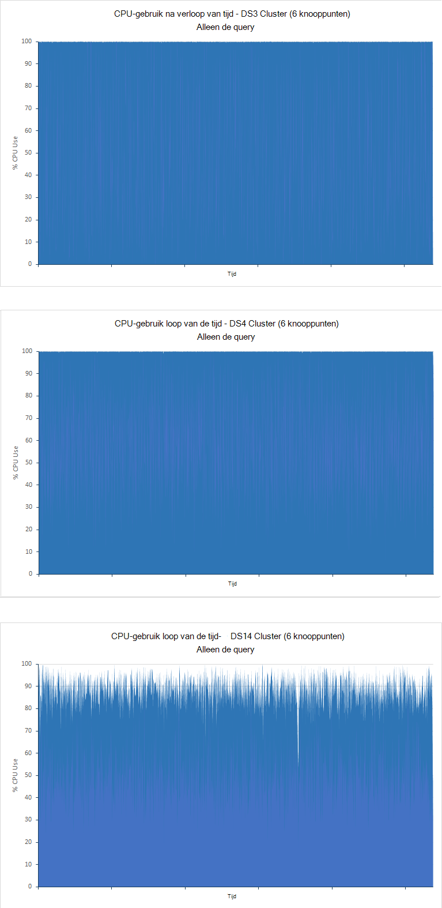

<properties
   pageTitle="Gegevens samenvoegen en query prestaties met Elasticsearch op Azure afstemmen | Microsoft Azure"
   description="Een samenvatting van overwegingen bij het optimaliseren van de query en zoeken prestaties voor Elasticsearch."
   services=""
   documentationCenter="na"
   authors="dragon119"
   manager="bennage"
   editor=""
   tags=""/>

<tags
   ms.service="guidance"
   ms.devlang="na"
   ms.topic="article"
   ms.tgt_pltfrm="na"
   ms.workload="na"
   ms.date="09/22/2016"
   ms.author="masashin"/>
   
# <a name="tuning-data-aggregation-and-query-performance-with-elasticsearch-on-azure"></a>Gegevens samenvoegen en query prestaties met Elasticsearch op Azure optimaliseren

[AZURE.INCLUDE [pnp-header](../../includes/guidance-pnp-header-include.md)]

In dit artikel maakt [deel uit van een reeks](guidance-elasticsearch.md). 

Een primaire reden voor het gebruik van Elasticsearch is ter ondersteuning van zoekopdrachten tot en met gegevens. Gebruikers moeten kunnen de informatie die ze zoekt snel vinden. Het systeem moet bovendien kunnen gebruikers vragen kunt stellen van de gegevens, correlatie zoeken en zich voordoen conclusies die zakelijke beslissingen kunnen sturen. Verwerking van dit is wat gegevens van informatie onderscheidt.

In dit document bevat een overzicht van de opties die u kunt bij het bepalen van de beste manier uw systeem voor de query en zoeken prestaties optimaliseren.

Alle prestaties aanbevelingen afhankelijk grotendeels de scenario's die van toepassing zijn voor uw situatie, het volume van de gegevens die u zijn indexeren en het tarief weer dat waarop-toepassingen en gebruikers de gegevens zoeken. Zorgvuldig moet u de resultaten van er een wijziging in de configuratie of indexing structuur uw eigen gegevens en de werkbelasting gebruiken om te beoordelen van de voordelen van uw specifieke scenario testen. Daartoe in dit document ook een aantal benchmarks die zijn uitgevoerd voor een specifieke scenario geïmplementeerd met verschillende configuraties beschreven. U kunt de methode die u hebt gemaakt om te bepalen de prestaties van uw eigen systemen aanpassen. De details van deze tests worden beschreven in de [bijlage](#appendix-the-query-and-aggregation-performance-test).

## <a name="index-and-query-performance-considerations"></a>Index en query prestatieoverwegingen

Dit onderwerp vindt enkele veelvoorkomende factoren die u moet denken over wanneer ontwerpen indexeert die nodig om snel query's uitvoeren en zoeken te ondersteunen.

### <a name="storing-multiple-types-in-an-index"></a>Meerdere typen opslaan in een index

Een index Elasticsearch kan meerdere itemtypen bevatten. Het is mogelijk beter te voorkomen dat deze methode als u een afzonderlijke index voor elk type maken. Houd rekening met de volgende punten:

- Verschillende typen mogelijk verschillende analyzers opgeven en het niet altijd duidelijk is welke analyzer Elasticsearch gebruiken moet als een query wordt uitgevoerd op het indexniveau van de in plaats van op het niveau van het type. Zie [Voorkomen Type weetjes](https://www.elastic.co/guide/en/elasticsearch/guide/current/mapping.html#_avoiding_type_gotchas) voor meer informatie.

- Shards voor indexen die meerdere typen bevatten waarschijnlijk groter is dan die voor indexen die één type bevatten. De groter per shard, langer is vereist voor Elasticsearch om gegevens te filteren bij het uitvoeren van query's.

- Als er aanzienlijk komen niet overeen tussen gegevensvolumes voor de typen, kan de informatie voor een bepaald type zeer worden verdeeld over veel shards verkleinen van de efficiëntie van zoekacties die deze gegevens ophalen.

    

    ***De effecten van het delen van een index tussen typen*** 

    In het bovenste gedeelte van het diagram, wordt dezelfde index gedeeld door documenten van het type A en type b te drukken. Zijn er veel meer documenten van het type A dan type die b. wordt gezocht naar een type gebruikmaakt van query's uitvoeren alle vier shards. Het onderste gedeelte van het diagram ziet u het effect als afzonderlijke indexen voor elk type worden gemaakt. In dit geval vereist wordt gezocht naar een type alleen twee shards openen.

- Kleine shards kunnen zijn meer gelijkmatig verdeelde dan grote shards, het Elasticsearch naar het selectievakje laden verdeeld over knooppunten gemakkelijker gemaakt.

- Verschillende typen mogelijk verschillende bewaarbeleid perioden. Het kan lastig zijn om te archiveren oude gegevens dat shards met actieve gegevens deelt.


Onder bepaalde omstandigheden delen van een index in verschillende typen kan echter zijn efficiënt als:

- Zoekopdrachten beslaan regelmatig typen gehouden op dezelfde positie.

- De typen hoeft slechts een klein aantal documenten elke. Onderhouden van een andere reeks shards voor elk type kan worden omgezet in een aanzienlijk realiseren in dit geval.


### <a name="optimizing-index-types"></a>Index typen optimaliseren

Een index Elasticsearch bevat een kopie van de oorspronkelijke JSON-documenten die zijn gebruikt om te vullen deze. Deze informatie wordt gehouden de [* \_bron*](https://www.elastic.co/guide/en/elasticsearch/reference/current/mapping-source-field.html#mapping-source-field) veld van elk geïndexeerde item. Deze gegevens niet doorzoekbaar is, maar al dan niet standaard door het *ophalen* en *Zoeken* aanvragen wordt geretourneerd. Dit veld is echter realiseren bijhoudt en in beslag neemt opslag, zodat shards groter wordt weergegeven en het volume van I/O uitgevoerd met groter wordende. U kunt uitschakelen de * \_bron* veld op basis van de per type:

```http
PUT my_index
{
  "mappings": {
    "my_type": {
      "_source": {
        "enabled": false
      }
    }
  }
}
```
Dit veld uitschakelen, verwijdert ook de mogelijkheid om te de volgende bewerkingen uitvoeren:

- Gegevens in de index bijwerken met behulp van de *bijwerken* API.

- Uitvoering van zoekopdrachten die gemarkeerde gegevens ophalen.

- Opnieuw indexeren van één Elasticsearch index rechtstreeks naar de andere.

- Toewijzingen of analyse instellingen te wijzigen.

- Voor foutopsporing in query's door het oorspronkelijke document bekijken.


### <a name="reindexing-data"></a>Gegevens opnieuw indexeren

Het aantal shards die beschikbaar zijn voor een index bepaalt uiteindelijk de capaciteit van de index. U kunt een schatting eerste (en op de hoogte) aan hoeveel shards uitgevoerd moeten worden, maar u moet altijd rekening houden met het document opnieuw indexeren strategie vooraf. In veel gevallen opnieuw indexeren mogelijk een beoogde taak als gegevens in omvang groeit. U kunt niet naar een groot aantal shards aan een index in eerste instantie toewijzen voor optimalisatie van zoeken, maar nieuwe shards toewijzen, zoals de hoeveelheid gegevens wordt uitgebreid. In andere gevallen opnieuw indexeren moet mogelijk worden uitgevoerd op basis van meer ad-hoc als uw maakt een schatting over gegevens volumegroei gewoon bewijzen te kloppen.

> [AZURE.NOTE] Opnieuw indexeren mogelijk niet nodig is voor gegevens die snel leeftijden. In dit geval mogelijk een toepassing als u een nieuwe index maken voor elke tijdsperiode. Voorbeelden Prestatielogboeken opnemen of controlegegevens dat moet worden opgeslagen in een nieuwe index elke dag.

<!-- -->

Opnieuw indexeren effectief heeft betrekking op een nieuwe index maken op basis van de gegevens in een van de oude en het vervolgens verwijdert de oude index. Als een index groot is, kan dit proces kan duren en mogelijk moet u ervoor zorgen dat de gegevens blijven aanwezig doorzoekbare tijdens deze periode. Daarom moet u een [alias voor elke index](https://www.elastic.co/guide/en/elasticsearch/reference/current/indices-aliases.html)maken en query's moeten gegevens via deze aliassen ophalen. Tijdens het opnieuw indexeren, blijven de alias die verwijst naar de oude index en schakelt u erop om te verwijzen naar de nieuwe index nadat de opnieuw indexeren is voltooid. Deze methode werkt ook handig voor toegang tot op tijd gebaseerde gegevens die u een nieuwe index elke dag maakt. Toegang tot de huidige tekstgegevens gebruikt u een alias die uitgevouwen via tot de nieuwe index wanneer deze is gemaakt.

### <a name="managing-mappings"></a>Toewijzingen beheren

Toewijzingen Elasticsearch gebruikt om te bepalen hoe de gegevens die in elk veld in een document voorkomt interpreteren. Elk type heeft een eigen toewijzing, waarin effectief een schema voor dat type. Elasticsearch gebruikt deze gegevens om te genereren omgekeerde indexen voor elk veld dat in de documenten in een type. Elk veld heeft in een document een gegevenstype (zoals *tekenreeks*, *datum*of *lange*) en een waarde. Wanneer de index voor het eerst wordt gemaakt, of ze kunnen worden afgeleid door Elasticsearch wanneer nieuwe documenten worden toegevoegd aan een type, kunt u de toewijzingen voor een index opgeven. Echter, kunt u de volgende punten overwegen:

- Toewijzingen dynamisch gegenereerd kunnen leiden tot fouten afhankelijk van hoe de velden worden geïnterpreteerd wanneer documenten worden toegevoegd aan een index. Bijvoorbeeld document 1 een veld A die in het bezit van een getal kan bevatten en oorzaken Elasticsearch veld toe te voegen een toewijzing waarmee wordt opgegeven dat dit een *lang*is. Als een latere document is toegevoegd in het veld dat een niet-numerieke gegevens bevat en klik erop, mislukt. In dit geval moet veld A waarschijnlijk hebt zijn geïnterpreteerd als een tekenreeks als het eerste document is toegevoegd. Deze toewijzing op te geven wanneer de index wordt gemaakt kan helpen voorkomen dat dergelijke problemen.

- Ontwerp uw documenten om te voorkomen dat te groot toewijzingen gegenereerd als dit kunt aanzienlijk belasting toevoegen bij het uitvoeren van zoekopdrachten, hoeveelheid geheugen grote en ook de oorzaak van query mislukt om gegevens te zoeken. Een consistente naamgeving voor velden in documenten die delen van hetzelfde type vast. Bijvoorbeeld niet in verschillende documenten veldnamen, zoals 'Voornaam', 'Voornaam' en 'Voornaam' te gebruiken. Gebruik de naam van het hetzelfde veld in elk document. Probeer ook geen waarden als sleutels gebruiken (dit is een aanpak in kolom-reeks databases, maar kunnen leiden tot efficiëntie en fouten met Elasticsearch.) Zie [Explosie toewijzen](https://www.elastic.co/blog/found-crash-elasticsearch#mapping-explosion)voor meer informatie.

- Gebruik *not_analyzed* om te voorkomen van tokeniseren wanneer van toepassing. Bijvoorbeeld als een document bevat een tekenreeksveld met de *gegevens* die de waarde "ABC-Definition bevat" naam u mogelijk probeer te doorzoeken voor alle documenten die overeenkomen met deze waarde als volgt:

  ```http
  GET /myindex/mydata/_search
  {
    "query" : {
      "filtered" : {
        "filter" : {
          "term" : {
            "data" : "ABC-DEF"
          }
        }
      }
    }
  }
  ```

 Deze zoekopdracht mislukt echter om terug te keren de verwachte resultaten vanwege de manier waarop de tekenreeks ABC-Definition is ge? exeerd wanneer deze wordt geïndexeerd. Dit wordt effectief gesplitst in twee tokens, ABC en Definition, met een afbreekstreepje. Deze functie is ontworpen voor het zoeken van de volledige tekst wordt ondersteund, maar als u wilt dat de tekenreeks geïnterpreteerd als één atomaire item moet u tokeniseren uitschakelen wanneer het document wordt toegevoegd aan de index. U kunt een toewijzing zoals dit:

  ```http
  PUT /myindex
  {
    "mappings" : {
      "mydata" : {
        "properties" : {
          "data" : {
            "type" : "string",
            "index" : "not_analyzed"
          }
        }
      }
    }
  }
  ```

  Zie [Exacte waarden vinden](https://www.elastic.co/guide/en/elasticsearch/guide/current/_finding_exact_values.html#_term_filter_with_text)voor meer informatie.


### <a name="using-doc-values"></a>Doc-waarden gebruiken

Groot aantal query's en aggregaties vereisen dat gegevens worden gesorteerd als onderdeel van de zoekbewerking. Sorteren, moet kunt een of meer voorwaarden toewijzen aan een lijst met documenten. Om u te helpen bij het dit proces, Elasticsearch alle waarden voor een veld gebruikt als een sleutel sorteren in het geheugen geladen. Deze informatie wordt genoemd in *fielddata*. De bedoeling is dat minder I/O caching van fielddata in het geheugen bijhoudt en wellicht sneller dan herhaaldelijk dezelfde gegevens lezen van schijf worden verwijderd. Als een veld heeft kunt hoge verhouding bewaren van de fielddata in het geheugen echter gebruiken in een groot aantal opslagruimte ruimte, mogelijk die invloed hebben op de mogelijkheid andere gelijktijdige bewerkingen uitvoeren of zelfs eerst opslag veroorzaakt door Elasticsearch mislukt.

Als het alternatieve gaat ondersteunt Elasticsearch ook *doc-waarden*. De waarde van een document is vergelijkbaar met een item van in het geheugen fielddata, behalve dat dit is opgeslagen op een schijf en hebt gemaakt tijdens de gegevens worden opgeslagen in een index (fielddata wordt opgesteld dynamisch wanneer een query wordt uitgevoerd.) Doc-waarden niet veel ruimte voor opslagruimte en dus zijn handig voor query's dat sorteer- of statistische gegevens over die velden kunnen een groot aantal unieke waarden bevatten. De verminderde druk op de opslagruimte kunt bovendien de prestatieverschillen tussen het ophalen van gegevens van schijf en lezen uit het geheugen verschuiving. Opschonen is waarschijnlijk minder vaak voordoen en andere gelijktijdige bewerkingen die gebruikmaken van geheugen worden minder snel moet worden verricht.

U inschakelen of uitschakelen van doc-waarden op basis van per eigenschap in een index met het kenmerk *doc_values* , zoals u in het volgende voorbeeld:

```http
PUT /myindex
{
  "mappings" : {
    "mydata" : {
      "properties" : {
        "data" : {
          ...
          "doc_values": true
        }
      }
    }
  }
}
```
> [AZURE.NOTE] Doc-waarden zijn met Elasticsearch versie 2.0.0 hoger standaard ingeschakeld.

De exacte gevolgen van het gebruik van document waarden is waarschijnlijk zeer specifiek zijn voor uw eigen gegevens en de query-scenario's, dus zorg ervoor dat prestaties testen om hun bruikbaarheid stand te brengen. Vergeet niet dat document waarden niet met geanalyseerde tekenreeksvelden werken. Zie [Doc-waarden](https://www.elastic.co/guide/en/elasticsearch/guide/current/doc-values.html#doc-values)voor meer informatie.

### <a name="using-replicas-to-reduce-query-contention"></a>Replica's via te verminderen query conflict

Een algemene strategie om zo de prestaties van query's is het opzetten van veel kopieën van elke index. Bewerkingen voor voor het ophalen van gegevens kunnen worden voldaan door het ophalen van gegevens uit een replica. Echter kunt deze strategie systeemprestaties de prestaties van opname gegevensbewerkingen, zodat deze moeten worden gebruikt met noodzakelijk in scenario's gemengde werkbelasting. Daarnaast kunnen bevat deze strategie alleen voordeel als replica's zijn verdeeld over knooppunten en van invloed zijn op voor resources met primaire shards die deel uitmaken van dezelfde index. Vergeet niet dat dit mogelijk is om te vergroten of verkleinen van het aantal replica's voor een index dynamisch is.

### <a name="using-the-shard-request-cache"></a>Gebruik van de cache van de aanvraag shard

Elasticsearch kan de lokale gegevens aangevraagd door query's op elke shard in het geheugen in cache. Dit kunt zoekopdrachten waarin dezelfde gegevens om uit te voeren sneller opgehaald, gegevens kunnen worden gelezen uit het geheugen in plaats van schijf opslag. Caching van gegevens op deze manier, kunt u de prestaties van bepaalde zoekbewerkingen, maar oplevert afgetrokken van het geheugen die beschikbaar zijn voor andere taken tegelijkertijd worden uitgevoerd, dus verbeteren. Er is ook het risico dat gegevens uit de cache served is verouderd. De gegevens in de cache ongeldig alleen wanneer de shard wordt vernieuwd en de gegevens zijn gewijzigd. De frequentie van vernieuwingen valt onder de waarde van de instelling *serienummer vernieuwingsinterval* van de index.

Het verzoek voor een index caching is standaard uitgeschakeld, maar u kunt deze als volgt inschakelen:

```http
PUT /myindex/_settings
{
  "index.requests.cache.enable": true
}
```

De cache van de aanvraag shard is het meest geschikt is voor informatie die relatief statisch, zoals historische of als de registratie gegevens blijft.

### <a name="using-client-nodes"></a>Gebruik van de client knooppunten

Alle query's worden verwerkt door het knooppunt dat eerst de aanvraag ontvangt. Dit knooppunt verzendt verder aanvragen voor alle andere knooppunten met shards voor de indexen query wordt uitgevoerd en worden vervolgens de resultaten voor het retourneren van het antwoord bij elkaar opgeteld. Als een query heeft betrekking op gegevens aggregeren of complexe berekeningen uitvoeren, is het eerste knooppunt die verantwoordelijk is voor de uitvoering van de juiste verwerking. Als uw systeem ter ondersteuning van een relatief klein aantal complexe query's bevat, kunt u het maken van een groep van de client van knooppunten aan het laden van de gegevensknooppunten verhelpen. Daarentegen als uw systeem heeft u omgaat met een groot aantal eenvoudige query's, indienen deze aanvragen rechtstreeks naar de gegevensknooppunten en het gebruik van een taakverdeling om de aanvragen gelijkmatig verdelen.

### <a name="tuning-queries"></a>Query's optimaliseren

De volgende punten samenvatten tips voor het optimaliseren van de prestaties van Elasticsearch query's:

- Query's waarbij u gebruikmaakt van jokertekens zoveel mogelijk voorkomen.

- Als u hetzelfde veld is onderhevig aan volledige tekst zoeken en exact overeenkomende, kunt opslaan van de gegevens voor het veld in formulieren geanalyseerde en nonanalyzed. Volledige tekst het geanalyseerde veld zoekacties en exacte overeenkomsten ten opzichte van het veld nonanalyzed uitvoeren.

- Retourneert alleen de gegevens nodig. Als u grote documenten hebt, maar een toepassing alleen informatie in een subset van de velden moet, retourneert u deze subset van query's in plaats van volledige documenten. Deze strategie kunt de bandbreedtevereisten netwerk van het cluster verkleinen.

- Waar mogelijk moet u filters gebruiken in plaats van query's bij het zoeken naar gegevens. Een filter gewoon bepaalt of een document overeenkomt met een criterium dat u opgeeft dat een query ook hoe dicht een overeenkomst een document is berekent (scoren). Intern, de waarden die zijn gegenereerd door een filter worden opgeslagen als een bitmap die aangeeft dat de zoekwaarde/Nee vergelijken voor elk document en ze kunnen worden opgeslagen in Elasticsearch. Als de dezelfde filtercriteria vervolgens plaatsvindt, kan de bitmap en worden opgehaald uit de cache gebruikt om op te halen snel de overeenkomende documenten. Zie [Interne filterbewerking](https://www.elastic.co/guide/en/elasticsearch/guide/current/_finding_exact_values.html#_internal_filter_operation)voor meer informatie.

- *Bool* filters gebruiken voor de uitvoering van statische vergelijkingen, en alleen gebruiken * *of*en, *niet* filters*voor dynamisch berekende filters, zoals modellen die gebruikmaakt van uitvoeren van scripts of de *geografische -\* * filters.

- Als een *bool* filters worden gecombineerd met *en*, *of*, al dan *niet* met *geografische -* * filters, plaats de *en*/*of*/*niet geografische-** filters laatst zodat ze op de kleinst mogelijke voor gegevensverzameling werken.

    Gebruik een *post_filter* op dezelfde manier dure filter bewerkingen uitvoeren. Deze filters worden laatst uitgevoerd.

- Aggregaties in plaats van aspecten gebruiken. Vermijd het berekenen van aggregaties die worden geanalyseerd of die veel mogelijke waarden hebben.

    > **Opmerking**: aspecten in Elasticsearch versie 2.0.0 zijn verwijderd.

- Gebruik de aggregatie *verhouding* plaats van de aggregatie *value_count* tenzij uw toepassing vereist een exact aantal overeenkomende objecten. Een exact aantal kunt verouderd snel en veel toepassingen alleen een redelijk benadering vereist.

- Vermijd het uitvoeren van scripts. Scripts in query's en filters kunnen worden duur en de resultaten niet in cache opslaan. Langdurige scripts kunnen zoeken threads voor onbepaalde tijd, de oorzaak van het volgende aanvragen in de wachtrij in beslag nemen. Als de wachtrij vol, verder aanvragen geweigerd.

## <a name="testing-and-analyzing-aggregation-and-search-performance"></a>Test- en aggregatie en zoekopdrachten prestaties analyseren

Dit gedeelte worden de resultaten van een reeks tests die zijn uitgevoerd op verschillende cluster en index configuraties beschreven. Twee soorten tests zijn uitgevoerd, als volgt:

- * *De *opname en query* testen **. Deze test de slag met een lege index die is gevuld als de test voorafgegaan door het uitvoeren van bulkbewerkingen voor invoegen (1000 documenten elke bewerking toegevoegd). Tegelijkertijd, zijn een aantal query's die zijn ontworpen om te zoeken naar documenten die zijn toegevoegd tijdens de voorgaande periode van 15 minuten en aggregaties genereren 5 tweede intervallen herhaald. Deze test is meestal toegestaan uit te voeren voor 24 uur om de effecten van een lastige werkbelasting grootschalige gegevens opname met in de buurt van realtime-query's met reproduceren.

- **De *query alleen-lezen* **testen. Deze test is vergelijkbaar met de *opname en query* testen, behalve dat het deel achter de opname wordt weggelaten, en de index op elk knooppunt wordt vooraf gevuld met 100 miljoen documenten. Een gewijzigde set van query's wordt uitgevoerd; het beperken van documenten die zijn toegevoegd in de laatste 15 minuten tijdselement is verwijderd, zoals de gegevens nu statische was. De tests voor 90 minuten hebt uitgevoerd, wordt er minder tijd die nodig is om een patroon prestaties vanwege de vaste hoeveelheid gegevens te bepalen.

---

Elk document in de index had hetzelfde schema. In deze tabel bevat een overzicht van de velden in het schema:

Naam                          | Type         | Notities |
  ----------------------------- | ------------ | -------------------------------------------------------- |
  Organisatie                  | Tekenreeks      | De test genereert 200 unieke organisaties. |
  CustomField1 - CustomField5   |Tekenreeks       |Hierna ziet u vijf tekenreeksvelden die zijn ingesteld op een lege tekenreeks.|
  DateTimeRecievedUtc           |Tijdstempel    |De datum en tijd waarop het document is toegevoegd.|
  Host                          |Tekenreeks       |In dit veld is ingesteld op een lege tekenreeks.|
  HttpMethod                    |Tekenreeks       |In dit veld is ingesteld op een van de volgende waarden: 'Posten', 'Krijgt', 'Zet'.|
  HttpReferrer                  |Tekenreeks       |In dit veld is ingesteld op een lege tekenreeks.|
  HttpRequest                   |Tekenreeks       |Dit veld wordt gevuld met willekeurige tekst tussen 10 en 200 tekens lang.|
  HttpUserAgent                 |Tekenreeks       |In dit veld is ingesteld op een lege tekenreeks.|
  HttpVersion                   |Tekenreeks       |In dit veld is ingesteld op een lege tekenreeks.|
  Naam van de organisatie              |Tekenreeks       |Dit veld is ingesteld op hetzelfde resultaat als het veld van de organisatie.|
  SourceIp                      |IP           |Dit veld bevat een IP-adres waarin wordt aangegeven dat de "oorsprong" van de gegevens. |
   SourceIpAreaCode              |Lange         |Dit veld is ingesteld op 0.|
  SourceIpAsnNr                 |Tekenreeks       |In dit veld is ingesteld op "Als\#\#\#\#\#".|
  SourceIpBase10                |Lange         |Dit veld is ingesteld op 500.|
  SourceIpCountryCode           |Tekenreeks       |Dit veld bevat een 2-teken landcode. |
  SourceIpCity                  |Tekenreeks       |Dit veld bevat een tekenreeks die een plaats in een land. |
  SourceIpLatitude              |Dubbeltik       |Dit veld bevat een willekeurige waarde.|
  SourceIpLongitude             |Dubbeltik       |Dit veld bevat een willekeurige waarde.|
  SourceIpMetroCode             |Lange         |Dit veld is ingesteld op 0.|
  SourceIpPostalCode            |Tekenreeks       |In dit veld is ingesteld op een lege tekenreeks.|
  SourceLatLong                 |Geografische punt   |Dit veld is ingesteld op een willekeurige geografische punt.|
  Bronpoort                    |Tekenreeks       |In dit veld wordt gevuld met de tekenreeksweergave van een willekeurig getal.|
  TargetIp                      |IP           |Hiermee wordt gevuld met een willekeurig IP-adres in het bereik 0.0.100.100 naar 255.9.100.100.|
  SourcedFrom                   |Tekenreeks       |Dit veld is ingesteld op de tekenreeks "MonitoringCollector".|
  TargetPort                    |Tekenreeks       |In dit veld wordt gevuld met de tekenreeksweergave van een willekeurig getal.|
  Classificatie                        |Tekenreeks       |Dit veld wordt gevuld met een van de 20 verschillende tekenreekswaarden willekeurig worden geselecteerd.|
  UseHumanReadableDateTimes     |Booleaanse waarde      |Dit veld is ingesteld op onwaar.|
 
De volgende query's zijn uitgevoerd als batch door elke herhaling van de tests. De namen in cursief worden gebruikt om te verwijzen naar deze query's in de rest van dit document. Opmerking die is weggelaten, wordt het tijd-criterium (documenten die zijn toegevoegd in de laatste 15 minuten) van de *query alleen-lezen* tests:

- Hoeveel documenten met elke waarde *classificatie* zijn ingevoerd in de laatste 15 minuten (*aantal door classificatie*)? 

- Hoeveel documenten zijn toegevoegd in elk interval 5 minuten gedurende de laatste 15 minuten (*aantal na verloop van tijd*)?

- Hoeveel documenten van elke waarde *beoordeling* zijn toegevoegd voor elk land in de laatste 15 minuten (*treffers per land*)?

- Welke 15 organisaties optreden meeste vaak in documenten die zijn toegevoegd in de laatste 15 minuten (*bovenste 15 organisaties*)?

- Hoeveel verschillende organisaties optreden in documenten die zijn toegevoegd in de laatste 15 minuten (*unieke tellen organisaties*)?

- Hoeveel documenten zijn toegevoegd in de laatste 15 minuten (*Totaal aantal treffers tellen*)?

- Hoeveel verschillende *SourceIp* -waarden voorkomen in documenten die zijn toegevoegd in de laatste 15 minuten (*unieke IP tellen*)?


De definitie van de index en de details van de query's weergegeven in de [bijlage](#appendix-the-query-and-aggregation-performance-test).

De tests zijn ontworpen voor meer informatie over de effecten van de volgende variabelen:

- **Type schijf**. Tests zijn uitgevoerd op een cluster 6 knooppunten van D4 VMs gebruiken standaard opslag (harde schijven) en op een cluster 6 knooppunten van DS4 VMs premium opslag (SSD) herhaald.

- **Machine grootte - schaalbaarheid omhoog**. Tests zijn uitgevoerd op een cluster 6 knooppunten, bestaande uit DS3 VMs (aangewezen als het *kleine* cluster), herhaald op een cluster van DS4 VMs (het *medium* cluster), en nogmaals herhaald op een cluster van DS14 machines (de *grote* cluster). De volgende tabel worden de belangrijkste kenmerken van elk SKU VM:

 Cluster | VM SKU        | Aantal kernen | Aantal gegevensschijven | (GB) RAM |
---------|---------------|-----------------|----------------------|----------|
 Kleine   | Standaard DS3  | 4               | 8                    | 14       |
 Gemiddeld  | Standaard DS4  | 8               | 16                   | 28       |
 Grote   | Standaard DS14 | 16              | 32                   | 112      |

- **Clustergrootte - schalen**. Proeven zijn uitgevoerd op clusters van DS14 VMs met 1, 3 en 6 knooppunten.

- **Aantal index replica's**. Tests zijn uitgevoerd met van indexen geconfigureerd met 1 en 2 replica's.

- **Doc-waarden**. In eerste instantie zijn de tests uitgevoerd met de index instellen *doc_values* ingesteld op *waar* (de standaardwaarde). Geselecteerde tests zijn herhaald met *doc_values* ingesteld op *Onwaar*.

- **In cache opslaan**. Tests zijn uitgevoerd met de cache voor shard-aanvraag is ingeschakeld op de index.

- **Aantal shards**. Tests zijn herhaald met de verschillende aantallen shards tot stand brengen of query's hebt uitgevoerd efficiënter over indexen met minder en grotere shards of meer, kleinere shards.


## <a name="performance-results---disk-type"></a>Prestatieresultaten - schijftype

Prestaties van de schijf is geëvalueerd door de test *opname en de query* uit te voeren op het cluster 6-knooppunt van D4 VMs (via harde schijven) en klik op het cluster 6-knooppunt van DS4 VMs (via SSD). De configuratie van Elasticsearch in beide clusters is dezelfde. De gegevens is verdeeld over 16 schijven op elk knooppunt en elk knooppunt 14GB RAM toegewezen aan de Java virtual machine (JVM) Elasticsearch uitgevoerd, zoals het resterende geheugen (ook 14 Gigabytes) is gegeven voor besturingssysteem gebruik. Elke test hebt uitgevoerd voor 24 uur. Deze periode is geselecteerd, zodat de effecten van de toeneemt hoeveelheid gegevens duidelijk en het systeem stabiliseren toestaan. De onderstaande tabel bevat een overzicht van de resultaten, waarbij de tijden antwoord van de verschillende bewerkingen die bestaat uit de test.

 Cluster | Bewerking/query            | Gemiddelde antwoord tijd ([ms) |
---------|----------------------------|----------------------------|
 D4      | Opname                  | 978                        |
         | Tellen op waardering            | 103                        |
         | Tijd te tellen            | 134                        |
         | Treffers per land            | 199                        |
         | Bovenste 15 organisaties       | 137                        |
         | Unieke tellen organisaties | 139                        |
         | Unieke IP-tellen            | 510                        |
         | Totaal aantal treffers tellen           | 89                         |
 DS4     | Opname                  | 511                        |
         | Tellen op waardering            | 187                        |
         | Tijd te tellen            | 411                        |
         | Treffers per land            | 402                        |
         | Bovenste 15 organisaties       | 307                        |
         | Unieke tellen organisaties | 320                        |
         | Unieke IP-tellen            | 841                        |
         | Totaal aantal treffers tellen           | 236                        |

Het lijkt op het eerste gezicht dat het cluster DS4 uitgevoerd van query's minder bron dan het D4 cluster, soms wordt verdubbeld (of slechter) de tijd antwoord. Dit zegt niet de hele verhaal door. De volgende tabel ziet u het aantal opname bewerkingen wordt uitgevoerd door elk cluster (Vergeet niet dat elke bewerking 1000 documenten laadt):

 Cluster | Opname bewerking tellen |
---------|---------------------------|
 D4      | 264769                    |
 DS4     | 503157                    |

Het cluster DS4 kon bijna tweemaal zoveel gegevens dan het cluster D4 laden tijdens de test. Daarom bij het analyseren van de reactietijden voor elke bewerking, moet u ook overwegen om het aantal documenten query's hebben om door te nemen en hoeveel documenten worden geretourneerd. Hierna ziet u dynamische afbeeldingen terwijl het volume van documenten in de index continu groeit. U kunt niet alleen delen 503137 door 264769 (het aantal opname bewerkingen wordt uitgevoerd door elk cluster) en vermenigvuldigt u het resultaat met het tijdstip gemiddelde antwoord voor elke query uitgevoerd door het cluster D4 naar een vergelijkende informatie geven, zoals de hoeveelheid I/O tegelijkertijd worden uitgevoerd door de opname bewerking genegeerd. U moet in plaats daarvan de fysieke hoeveelheid gegevens naar worden geschreven meten en lezen van schijf naarmate de test verloopt. Het testplan JMeter wordt deze informatie voor elk knooppunt vastgelegd. De samengevatte resultaten zijn:

 Cluster | Gemiddelde aantal bytes geschreven/gelezen door elke bewerking |
---------|----------------------------------------------|
 D4      | 13471557                                     |
 DS4     | 24643470                                     |

Deze gegevens ziet u dat het cluster DS4 kon om op te vangen een tarief i/o-ongeveer 1,8 tijden die van het cluster D4. Gezien het feit dat, met uitzondering van aard van de schijven, alle andere bronnen hetzelfde, wordt het verschil moet vanwege SSD gebruik liever harde schijven.

Deze sluiting uitvullen, zodat de volgende grafieken illustreren hoe de I/O na verloop van tijd is uitgevoerd door elke cluster:


<!-- -->

***Activiteit van de schijf voor de clusters D4 en DS4***

In de grafiek voor het cluster D4 ziet aanzienlijk variatie, met name tijdens de eerste helft van de test. Dit was waarschijnlijk door om te beperken het tarief weer dat i/o-beperken. In de eerste fasen van de test zijn de query's uitvoeren snel omdat er weinig gegevens te analyseren. De schijven in het cluster D4 zijn waarschijnlijk beschouwt dicht bij hun invoer/uitvoer-bewerkingen elke tweede (IO's / s) capaciteit, hoewel elke i/o-bewerking niet veel gegevens retourneren mogelijk. Het cluster DS4 kan een hogere IO's / s-snelheid en neemt niet het wegschrijven van dezelfde mate van beperken, de i/o-tarieven meer normale zijn. Als u wilt deze theorie wordt ondersteund, met het volgende paar van grafieken weergeven hoe de CPU is geblokkeerd door de schijf I/O na verloop van tijd (de schijf wachttijden in de grafieken weergegeven zijn de verhouding van de tijd dat de processor gewacht voor I/O wordt):


***CPU-schijf i/o-wacht tijden voor de clusters D4 en DS4***

Is het belangrijk om te begrijpen dat er twee belangrijkste redenen voor i/o-bewerkingen voor het blokkeren van de processor zijn:

- Het IO-subsysteem kan worden lezen of schrijven van gegevens naar of vanaf schijf.

- Het IO-subsysteem kan worden vertraagd door de hostomgeving. Azure schijven geïmplementeerd via harde schijven hebben een maximale capaciteit van 500 IO's / s en SSD hebben een maximale capaciteit van 5000 IO's / s.


Voor het cluster D4 de hoeveelheid tijd die is besteed wachten op I/O tijdens de eerste helft van de test is afgestemd nauw op omgekeerde wijze met de grafiek met de i/o-tarieven. Aantal termijnen van lage I/O komen overeen met perioden aanzienlijk de processor besteedt aan geblokkeerde, Hiermee wordt aangeduid dat I/O is wordt vertraagd. Als u meer gegevens worden toegevoegd aan het cluster de wijzigingen situatie en in de tweede helft van de pieken testen in i/o-wachttijden komen overeen met pieken in i/o-doorvoer. Nu is de CPU tijdens het uitvoeren van reële I/O geblokkeerd. Nogmaals, is de wachttijd voor I/O met het cluster DS4 veel gelijkmatiger. Elke piek overeenkomt met een overeenkomstige piek in plaats van een dieptepunt o prestaties, dit houdt in dat is er weinig of geen bandbreedteregeling optreedt.

Er is een andere factoren u rekening moet houden. Tijdens de test gegenereerd het cluster D4 10584 opname fouten en 21 query fouten. De test op het cluster DS4 geproduceerd geen fouten.

## <a name="performance-results---scaling-up"></a>Prestatieresultaten - schaalbaarheid omhoog

Schaal-up getest door ten opzichte van 6 knooppunten bevatten van DS3, DS4 en DS14 VMs tests uit te voeren. Deze SKU's zijn geselecteerd, omdat een VM DS4 tweemaal zoveel cores processor en geheugen als een DS3 biedt en een machine DS14 wordt verdubbeld de CPU-bronnen opnieuw terwijl viermaal drukken de hoeveelheid geheugen. De onderstaande tabel worden de belangrijkste aspecten van elke SKU vergeleken:

 SKU  | \#CPU-kernen | Geheugen (GB) | Max schijf IO's / s | Max bandbreedte (MB/s)|
------|-------------|-------------|---------------|--------------|
 DS3  | 4           | 14          | 12,800| 128 |
 DS4  | 8           | 28          | 25,600| 256 |
 DS14 | 16          | 112         | 50.000| 512 |

De volgende tabel worden de resultaten van de tests uitvoeren op de kleine (DS3), normaal (DS4) en grote (DS14) clusters. Elke VM kon u SSD houdt u de gegevens. Elke test hebt uitgevoerd voor 24 uur.

De tabel rapporten het aantal succesvolle aanvragen voor elk type query (fouten zijn niet opgenomen). Het aantal aanvragen geprobeerd voor elk type query is ongeveer hetzelfde tijdens een uitvoeren van de test. Dit is omdat het testplan JMeter een willekeurig exemplaar van beide query's (aantal door te beoordelen, tijd te tellen, treffers per land, boven 15 organisaties, unieke tellen organisaties, unieke IP-tellen en totaalaantal treffers) samen in één eenheid bekend als een *transactie testen voert* (deze transactie onafhankelijk is van de taak die de bewerking opname, die wordt uitgevoerd door een afzonderlijke thread uitvoert). Elke herhaling van het testplan uitvoert een testtransactie één. Het aantal testtransacties voltooid is dus een maateenheid voor de reactietijd van de laagst mogelijke query in elke transactie.

| Cluster      | Bewerking/query            | Aantal aanvragen | Gemiddelde antwoord tijd ([ms) |
|--------------|----------------------------|--------------------|----------------------------|
| Kleine (DS3)  | Opname                  | 207284             | 3328                       |
|              | Tellen op waardering            | 18444              | 268                        |
|              | Tijd te tellen            | 18444              | 340                        |
|              | Treffers per land            | 18445              | 404                        |
|              | Bovenste 15 organisaties       | 18439              | 323                        |
|              | Unieke tellen organisaties | 18437              | 338                        |
|              | Unieke IP-tellen            | 18442              | 468                        |
|              | Totaal aantal treffers tellen           | 18428              | 294   
|||||
| Gemiddeld (DS4) | Opname                  | 503157             | 511                        |
|              | Tellen op waardering            | 6958               | 187                        |
|              | Tijd te tellen            | 6958               | 411                        |
|              | Treffers per land            | 6958               | 402                        |
|              | Bovenste 15 organisaties       | 6958               | 307                        |
|              | Unieke tellen organisaties | 6956               | 320                        |
|              | Unieke IP-tellen            | 6955               | 841                        |
|              | Totaal aantal treffers tellen           | 6958               | 236                        |
|||||
| Grote (DS14) | Opname                  | 502714             | 511                        |
|              | Tellen op waardering            | 7041               | 201                        |
|              | Tijd te tellen            | 7040               | 298                        |
|              | Treffers per land            | 7039               | 363                        |
|              | Bovenste 15 organisaties       | 7038               | 244                        |
|              | Unieke tellen organisaties | 7037               | 283                        |
|              | Unieke IP-tellen            | 7037               | 681                        |
|              | Totaal aantal treffers tellen           | 7038               | 200                        |

De prestaties van het cluster DS4 en DS14 zijn deze afbeeldingen ziet u dat voor deze test, redelijk vergelijkbare. De tijden antwoord voor de querybewerkingen voor het cluster DS3 ook weergegeven om te vergelijken fotoprinters in eerste instantie en het aantal querybewerkingen is uiterst dan de waarden voor het cluster DS4 en DS14. Een moet sterke kennisgeving van de snelheid van de opname en het na een aantal documenten waarin wordt gezocht echter ook aandacht. In het cluster DS3 opname veel meer wordt beperkt en aan het einde van de test bevat de database alleen ongeveer 40% van de documenten lezen in door elk van de andere twee clusters. Dit is mogelijk vanwege de verwerking van resources, netwerk en schijf bandbreedte beschikbaar voor een DS3 VM in vergelijking met een DS4 of DS14 VM. Gezien het feit dat een VM DS4 tweemaal zoveel bronnen die beschikbaar zijn als een VM DS3 heeft en een DS14 tweemaal (viermaal drukken voor geheugen) de bronnen van een VM DS4 heeft, een vraag blijft: Waarom is het verschil in opname tarieven tussen de clusters DS4 en DS14 aanzienlijk kleiner zijn dan die optreedt tussen de clusters DS3 en DS4? Dit kan zijn vanwege de bandbreedte limieten van Azure VMs en het netwerk raken. De onderstaande grafieken weergeven deze gegevens voor alle drie clusters:


**Gebruik voor de uitvoering van de opname en query test clusters van DS3, DS4 en DS14 netwerk** 

<!-- -->

De grenzen van de beschikbare netwerkbandbreedte met Azure VMs niet worden gepubliceerd en kunnen variëren, maar het feit dat activiteit netwerk wordt weergegeven om het totaal hebt uitgeschakeld op een gemiddelde van ongeveer 2.75GBps voor zowel de DS4 en DS14 tests stappen worden voorgesteld dat deze een limiet is bereikt en de primaire factor bij het beperken van doorvoer is geworden. Als het cluster DS3 is netwerkactiviteiten aanzienlijk lager, zodat de onderste prestaties vaker vanwege beperkingen in de beschikbaarheid van andere bronnen wordt.

Als u de effecten van de opname bewerkingen isoleren en illustreren hoe queryprestaties verschilt zoals knooppunten vergroten, is een set met alleen-query testen uitgevoerd met de dezelfde knooppunten. De volgende tabel worden de resultaten op elk cluster:

> [AZURE.NOTE] U moet niet worden vergeleken de prestaties en het aantal aanvragen uitgevoerd door de query's in de *query alleen-lezen* test met de macro's starten met de *opname en query* testen. Dit komt doordat de query's zijn gewijzigd en het volume van documenten die nodig zijn voor verschillende is.

| Cluster      | Bewerking/query            | Aantal aanvragen | Gemiddelde antwoord Ttme ([ms) |
|--------------|----------------------------|--------------------|----------------------------|
| Kleine (DS3)  | Tellen op waardering            | 464                | 11758                      |
|              | Tijd te tellen            | 464                | 14699                      |
|              | Treffers per land            | 463                | 14075                      |
|              | Bovenste 15 organisaties       | 464                | 11856                      |
|              | Unieke tellen organisaties | 462                | 12314                      |
|              | Unieke IP-tellen            | 461                | 19898                      |
|              | Totaal aantal treffers tellen           | 462                | 8882  
|||||
| Gemiddeld (DS4) | Tellen op waardering            | 1045               | 4489                       |
|              | Tijd te tellen            | 1045               | 7292                       |
|              | Treffers per land            | 1053               | 7564                       |
|              | Bovenste 15 organisaties       | 1055               | 5066                       |
|              | Unieke tellen organisaties | 1051               | 5231                       |
|              | Unieke IP-tellen            | 1051               | 9228                       |
|              | Totaal aantal treffers tellen           | 1051               | . 2180                       |
|||||
| Grote (DS14) | Tellen op waardering            | 1842               | 1927                       |
|              | Tijd te tellen            | 1839               | 4483                       |
|              | Treffers per land            | 1838               | 4761                       |
|              | Bovenste 15 organisaties       | 1842               | 2117                       |
|              | Unieke tellen organisaties | . 1837               | 2393                       |
|              | Unieke IP-tellen            | . 1837               | 7159                       |
|              | Totaal aantal treffers tellen           | . 1837               | 642                        |

Schakel ditmaal de trends in de gemiddelde antwoord tijden over de verschillende clusters duidelijker is. Netwerk in gebruik is ook onder de 2.75GBps eerder vereist door de DS4 en DS14 kolomgroepen (dat verzadigd waarschijnlijk het netwerk in de opname en query tests) en de 1.5GBps voor het cluster DS3. Het is zelfs dichter bij 200MBps in alle gevallen zoals u in de onderstaande grafieken:


***Gebruik voor de DS3, netwerk DS4 en DS14 clusters uitvoeren van de query alleen-lezen-test*** 

De beperken factor in de clusters DS3 en DS4 wordt nu CPU-gebruik, dat wil dicht bij 100% voor veel van de tijd zeggen worden weergegeven. In de DS14 gemiddelden cluster de CPU-gebruik iets meer dan 80%. Dit is nog steeds hoog, maar duidelijk worden de voordelen van meer CPU cores beschikbaar. De volgende afbeelding ziet u de CPU-gebruikspatronen voor de clusters DS3, DS4 en DS14.



***CPU-gebruik voor de uitvoering van de query alleen-lezen-test clusters van DS3 en DS14*** 

## <a name="performance-results---scaling-out"></a>Prestatieresultaten - schalen

Als u wilt laten zien hoe het systeem afhankelijk zijn van het aantal knooppunten, zijn tests uitgevoerd met DS14 clusters met 1, 3 en 6 knooppunten. Schakel ditmaal alleen de *alleen-query* testen is uitgevoerd, met gebruik van 100 miljoen documenten en uit te voeren voor 90 minuten:

| Cluster | Bewerking/query            | Aantal aanvragen | Gemiddelde antwoord tijd ([ms) |
|---------|----------------------------|--------------------|----------------------------|
| 1 knooppunt  | Tellen op waardering            | 288                | 6216                       |
|         | Tijd te tellen            | 288                | 28933                      |
|         | Treffers per land            | 288                | 29455                      |
|         | Bovenste 15 organisaties       | 288                | 9058                       |
|         | Unieke tellen organisaties | 287                | 19916                      |
|         | Unieke IP-tellen            | 284                | 54203                      |
|         | Totaal aantal treffers tellen           | 287                | 3333                       |
|||||
| 3 knooppunten | Tellen op waardering            | 1194               | 3427                       |
|         | Tijd te tellen            | 1194               | 5381                       |
|         | Treffers per land            | 1191               | 6840                       |
|         | Bovenste 15 organisaties       | 1196               | 3819                       |
|         | Unieke tellen organisaties | 1190               | 2938                       |
|         | Unieke IP-tellen            | 1189               | 12516                      |
|         | Totaal aantal treffers tellen           | 1191               | 1272                       |
|||||
| 6 knooppunten | Tellen op waardering            | 1842               | 1927                       |
|         | Tijd te tellen            | 1839               | 4483                       |
|         | Treffers per land            | 1838               | 4761                       |
|         | Bovenste 15 organisaties       | 1842               | 2117                       |
|         | Unieke tellen organisaties | . 1837               | 2393                       |
|         | Unieke IP-tellen            | . 1837               | 7159                       |
|         | Totaal aantal treffers tellen           | . 1837               | 642                        |

Het aantal knooppunten van belang aanzienlijk in de queryprestaties van het cluster, hoewel in een niet-lineair wijze. Het cluster 3 knooppunt is ongeveer 4 maal zoveel query's voltooid als de cluster met één knooppunt, terwijl het cluster 6 knooppunt 6 tijden vaker verwerkt. Om uit te leggen deze nonlinearity, de volgende grafieken wordt aangegeven hoe de CPU is wordt gebruikt door de drie clusters:


***CPU-gebruik voor de 1, 3 en 6 knooppunten bevatten uitvoeren van de query alleen-lezen-test***

De één- en 3 knooppunten clusters zijn CPU-gebonden, hoewel Hoewel CPU-gebruik hoge in het cluster 6-knooppunt is er extra verwerkingscapaciteit beschikbaar is. In dit geval zijn de andere factoren kunnen worden de doorvoer beperken. Dit kan worden bevestigd door testen met 9 en 12-knooppunten, zou waarschijnlijk verder vrije verwerkingscapaciteit weergeven.

De gegevens in de tabel hierboven wordt ook weergegeven hoe de gemiddelde antwoord tijden voor de query's variëren. Dit is het item dat is meest gedetailleerde bij het testen van hoe een systeem voor specifieke soorten query wordt aangepast. Zoekopdrachten zijn duidelijk uiterst efficiënter wanneer die meer knooppunten dan andere in beslag nemen. Dit kan worden veroorzaakt door de verhouding tussen het aantal knooppunten en het aantal documenten in de cluster met groter wordende, elk cluster opgenomen 100 miljoen documenten. Bij het uitvoeren van zoekopdrachten die gebruikmaakt van gegevens aggregeren, wordt de Elasticsearch verwerkt en de gegevens die zijn opgehaald als onderdeel van het aggregatieproces in het geheugen op elk knooppunt opgeslagen. Als er meer knooppunten, moet u er minder gegevens kunt ophalen, buffer, en op elk knooppunt van proces is.

## <a name="performance-results---number-of-replicas"></a>Prestatieresultaten - aantal replica 's

De *opname en query* tests zijn uitgevoerd ten opzichte van een index met een enkel replica. De tests zijn op de 6 knooppunten DS4 en DS14 bevatten met een index die is geconfigureerd met twee replica's herhaald. Alle tests uitgevoerd voor 24 uur. De onderstaande tabel ziet u de vergelijkende resultaten voor één en twee replica's:

| Cluster | Bewerking/query            | Gemiddelde antwoord tijd ([ms) - 1 replica | Gemiddelde antwoord tijd ([ms) - 2 replica 's | % verschil in antwoord tijd |
|---------|----------------------------|----------------------------------------|-----------------------------------------|-------------------------------|
| DS4     | Opname                  | 511                                    | 655                                     | + 28%                          |
|         | Tellen op waardering            | 187                                    | 168                                     | -10%                          |
|         | Tijd te tellen            | 411                                    | 309                                     | -25%                          |
|         | Treffers per land            | 402                                    | 562                                     | + 40%                          |
|         | Bovenste 15 organisaties       | 307                                    | 366                                     | + 19%                          |
|         | Unieke tellen organisaties | 320                                    | 378                                     | + 18%                          |
|         | Unieke IP-tellen            | 841                                    | 987                                     | + 17%                          |
|         | Totaal aantal treffers tellen           | 236                                    | 236                                     | + 0%                           |
||||||
| DS14    | Opname                  | 511                                    | 618                                     | + 21%                          |
|         | Tellen op waardering            | 201                                    | 275                                     | + 37%                          |
|         | Tijd te tellen            | 298                                    | 466                                     | + 56%                          |
|         | Treffers per land            | 363                                    | 529                                     | + 46%                          |
|         | Bovenste 15 organisaties       | 244                                    | 407                                     | + 67%                          |
|         | Unieke tellen organisaties | 283                                    | 403                                     | + 42%                          |
|         | Unieke IP-tellen            | 681                                    | 823                                     | + 21%                          |
|         | Totaal aantal treffers tellen           | 200                                    | 221                                     | + 11%                          |

Het tarief weer dat opname afgenomen als het aantal replica's verhoogd. Hiermee worden verwacht zoals Elasticsearch schrijft meer kopieën van elk document extra schijf I/O genereren.  Dit is doorgevoerd door de grafieken voor het cluster DS14 voor indexen met 1 en 2 replica's weergegeven in de onderstaande afbeelding. Als de index met 1 replica is het gemiddelde van de i/o-16896573 bytes/seconde. Voor de index met 2 replica's is het gemiddelde van de i/o-33986843 bytes/tweede, iets meer dan tweemaal zoveel.


***Schijf i/o-tarieven voor knooppunten met 1 en 2 replica's uitvoeren van de opname en query-test***

| Cluster | Query                      | Gemiddelde antwoord tijd ([ms) - 1 replica | Gemiddelde antwoord tijd ([ms) - 2 replica 's |
|---------|----------------------------|----------------------------------------|-----------------------------------------|
| DS4     | Tellen op waardering            | 4489                                   | 4079                                    |
|         | Tijd te tellen            | 7292                                   | 6697                                    |
|         | Treffers per land            | 7564                                   | 7173                                    |
|         | Bovenste 15 organisaties       | 5066                                   | 4650                                    |
|         | Unieke tellen organisaties | 5231                                   | 4691                                    |
|         | Unieke IP-tellen            | 9228                                   | 8752                                    |
|         | Totaal aantal treffers tellen           | . 2180                                   | 1909                                    |
|||||
| DS14    | Tellen op waardering            | 1927                                   | 2330                                    |
|         | Tijd te tellen            | 4483                                   | 4381                                    |
|         | Treffers per land            | 4761                                   | 5341                                    |
|         | Bovenste 15 organisaties       | 2117                                   | 2560                                    |
|         | Unieke tellen organisaties | 2393                                   | 2546                                    |
|         | Unieke IP-tellen            | 7159                                   | 7048                                    |
|         | Totaal aantal treffers tellen           | 642                                    | 708                                     |

Deze resultaten weergeven een verbetering in gemiddelde antwoord tijd voor het cluster DS4, maar een grotere voor het cluster DS14. Om u te helpen voorkomen deze resultaten interpreteren, moet u ook het aantal query's die zijn uitgevoerd door elke test overwegen:

| Cluster | Query                      | Getal uitgevoerd - 1 replica | Getal uitgevoerd - 2 replica 's |
|---------|----------------------------|------------------------------|-------------------------------|
| DS4     | Tellen op waardering            | 1054                         | 1141                          |
|         | Tijd te tellen            | 1054                         | 1139 beschermlak                          |
|         | Treffers per land            | 1053                         | 1138                          |
|         | Bovenste 15 organisaties       | 1055                         | 1141                          |
|         | Unieke tellen organisaties | 1051                         | 1136                          |
|         | Unieke IP-tellen            | 1051                         | 1135                          |
|         | Totaal aantal treffers tellen           | 1051                         | 1136                          |
|||||
| DS14    | Tellen op waardering            | 1842                         | 1718                          |
|         | Tijd te tellen            | 1839                         | 1716                          |
|         | Treffers per land            | 1838                         | 1714                          |
|         | Bovenste 15 organisaties       | 1842                         | 1718                          |
|         | Unieke tellen organisaties | . 1837                         | 1712                          |
|         | Unieke IP-tellen            | . 1837                         | 1712                          |
|         | Totaal aantal treffers tellen           | . 1837                         | 1712                          |

Deze gegevens ziet u dat het aantal query's die zijn uitgevoerd door het cluster DS4 opgehoogd loopt gelijk met de toename van de gemiddelde antwoord tijd, maar nogmaals het omgekeerde geldt ook voor het cluster DS14. Een grote factor is dat het CPU-gebruik van de DS4 cluster in de 1-replica en 2 tests is ongelijke Verdeel. Sommige knooppunten tentoongesteld dicht bij gebruik van 100%, terwijl de anderen vrije verwerkingscapaciteit had. De verbetering van de prestaties is waarschijnlijk de verbeterde functie voor het distribueren van verwerking op de knooppunten van het cluster. De volgende afbeelding ziet de variatie in CPU processing tussen de meest licht en intensief gebruikte VMs (knooppunten 4 en 3):


***CPU-gebruik voor de minste gebruikt en de meest gebruikte knooppunten in het DS4 cluster uitvoeren van de query alleen-lezen-test***

Voor het cluster DS14 is dit niet de hoofdletters/kleine letters. CPU-gebruik voor beide tests op alle knooppunten lager is en de beschikbaarheid van een tweede replica kwam kleiner van een voordeel en meer van een realiseren:


***CPU-gebruik voor de minste gebruikt en de meest gebruikte knooppunten in het DS14 cluster uitvoeren van de query alleen-lezen-test***

Deze resultaten blijkt dat u naar uw systeem zorgvuldig gebruikelijke bij het bepalen of u kunt meerdere replica's gebruiken. U moet altijd ten minste één replica van elke index (tenzij u bereid bent te verlies van gegevens als een knooppunt mislukt), maar extra replica's een last op het systeem voor weinig uit, afhankelijk van uw werkbelasting en de hardwarebronnen die beschikbaar zijn voor het cluster kunnen leggen.

## <a name="performance-results---doc-values"></a>Prestatieresultaten - doc-waarden

De *opname en query* tests zijn uitgevoerd met doc waarden ingeschakeld, veroorzaakt door Elasticsearch voor de opslag van gegevens die worden gebruikt voor het sorteren van velden op schijf. De tests zijn herhaald met doc-waarden die zijn uitgeschakeld, zodat Elasticsearch fielddata dynamisch opgesteld en in het cachegeheugen opgeslagen. Alle tests uitgevoerd voor 24 uur. De onderstaande tabel worden vergeleken antwoord tijden voor tests uitvoeren op clusters van 6 knooppunten die zijn gemaakt met D4, DS4 en DS14 VMs (D4 cluster wordt gebruikt normale vaste schijven, terwijl de clusters DS4 en DS14 SSD gebruiken).

| Cluster | Bewerking/query            | Gemiddelde antwoord tijd ([ms) - doc-waarden die zijn ingeschakeld | Gemiddelde antwoord tijd ([ms) - doc-waarden die zijn uitgeschakeld | % verschil in antwoord tijd |
|---------|----------------------------|-------------------------------------------------|--------------------------------------------------|-------------------------------|
| D4      | Opname                  | 978                                             | 835                                              | -15%                          |
|         | Tellen op waardering            | 103                                             | 132                                              | + 28%                          |
|         | Tijd te tellen            | 134                                             | 189                                              | + 41%                          |
|         | Treffers per land            | 199                                             | 259                                              | + 30%                          |
|         | Bovenste 15 organisaties       | 137                                             | 184                                              | + 34%                          |
|         | Unieke tellen organisaties | 139                                             | 197                                              | + 42%                          |
|         | Unieke IP-tellen            | 510                                             | 604                                              | + 18%                          |
|         | Totaal aantal treffers tellen           | 89                                              | 134                                              | + 51%                          |
||||||
| DS4     | Opname                  | 511                                             | 581                                              | + 14%                          |
|         | Tellen op waardering            | 187                                             | 190                                              | + 2%                           |
|         | Tijd te tellen            | 411                                             | 409                                              | -0.5%                         |
|         | Treffers per land            | 402                                             | 414                                              | + 3%                           |
|         | Bovenste 15 organisaties       | 307                                             | 284                                              | -7%                           |
|         | Unieke tellen organisaties | 320                                             | 313                                              | -% van 2                           |
|         | Unieke IP-tellen            | 841                                             | 955                                              | + 14%                          |
|         | Totaal aantal treffers tellen           | 236                                             | 281                                              | + 19%                          |
||||||
| DS14    | Opname                  | 511                                             | 571                                              | + 12%                          |
|         | Tellen op waardering            | 201                                             | 232                                              | + 15%                          |
|         | Tijd te tellen            | 298                                             | 341                                              | + 14%                          |
|         | Treffers per land            | 363                                             | 457                                              | + 26%                          |
|         | Bovenste 15 organisaties       | 244                                             | 338                                              | + 39%                          |
|         | Unieke tellen organisaties | 283                                             | 350                                              | + 24%                          |
|         | Unieke IP-tellen            | 681                                             | 909                                              | + 33%                          |
|         | Totaal aantal treffers tellen           | 200                                             | 245                                              | + 23%                          |

De volgende tabel worden vergeleken het aantal opname bewerkingen wordt uitgevoerd door de tests:

| Cluster | Opname bewerking aantal - doc-waarden die zijn ingeschakeld | Opname bewerking aantal - document waarden uitgeschakeld | % verschil in \number van opname bewerkingen |
|---------|----------------------------------------------|-----------------------------------------------|-----------------------------------------|
| D4      | 264769                                       | 408690                                        | + 54%                                    |
| DS4     | 503137                                       | 578237                                        | + 15%                                    |
| DS14    | 502714                                       | 586472                                        | + 17%                                    |

De verbeterde opname tarieven optreden met doc-waarden die zijn uitgeschakeld als minder gegevens worden geschreven naar de schijf, zoals documenten worden ingevoegd. De verbeterde prestaties is merkt met de D4 VM harde schijven gebruiken voor de opslag van gegevens. In dit geval het tijdstip antwoord voor opname bewerkingen ook verlaagd met 15% (Zie de eerste tabel in deze sectie). Dit kan worden vanwege de verminderde druk op de harde schijven die waarschijnlijk waren uitgevoerd dicht bij hun limieten IO's / s in de test met doc waarden die zijn ingeschakeld, raadpleegt u de schijftype test voor meer informatie. Het volgende diagram wordt de o prestaties van de VMs D4 vergeleken met document waarden ingeschakeld (gehouden op schijf) en doc waarden uitgeschakeld (waarden in het geheugen bewaard):


***Activiteit van de schijf voor het D4 cluster met doc waarden uitgeschakeld***

De opname waarden voor het gebruik van SSD VMs weergeven daarentegen, een stijging van kleine in het aantal documenten, maar ook een toename van de reactietijd van de opname-bewerkingen. Met een of twee kleine uitzonderingen zijn er ook de query antwoord tijden slechter. De SSD zijn minder snel te dicht bij hun IO's / s-limieten worden uitgevoerd met doc-waarden die zijn ingeschakeld, zodat wijzigingen in de prestaties zijn waarschijnlijk meer vanwege verhoogd processing activiteit en de realiseren van het beheren van de opslagruimte JVM. Dit is duidelijk de CPU-gebruik vergelijken met doc-waarden in- en uitgeschakeld. Het volgende diagram worden deze gegevens voor het cluster DS4, waar de grootste deel van het processorgebruik wordt verplaatst van de band 30-40% met doc-waarden die zijn ingeschakeld, naar de band 40% - 50% met doc-waarden uitgeschakeld gemarkeerd (het cluster DS14 wees uit een soortgelijke trend):


***CPU-gebruik voor de DS4 cluster met doc-waarden in- en uitgeschakeld***

Om te onderscheiden van de effecten van doc-waarden voor queryprestaties gegevens opname, paren van query alleen-lezen tests uitgevoerd voor de clusters DS4 en DS14 met doc-waarden in- en uitgeschakeld. De onderstaande tabel bevat een overzicht van de resultaten van deze tests:

| Cluster | Bewerking/query            | Gemiddelde antwoord tijd ([ms) - doc-waarden die zijn ingeschakeld | Gemiddelde antwoord tijd ([ms) - doc-waarden die zijn uitgeschakeld | % verschil in antwoord tijd |
|---------|----------------------------|-------------------------------------------------|--------------------------------------------------|-------------------------------|
| DS4     | Tellen op waardering            | 4489                                            | 3736                                             | -16%                          |
|         | Tijd te tellen            | 7293                                            | 5459                                             | -25%                          |
|         | Treffers per land            | 7564                                            | 5930                                             | -22%                          |
|         | Bovenste 15 organisaties       | 5066                                            | 3874                                             | -14%                          |
|         | Unieke tellen organisaties | 5231                                            | 4483                                             | -% van 2                           |
|         | Unieke IP-tellen            | 9228                                            | 9474                                             | + 3%                           |
|         | Totaal aantal treffers tellen           | . 2180                                            | 1218                                             | -44%                          |
||||||
| DS14    | Tellen op waardering            | 1927                                            | 2144                                             | + 11%                          |
|         | Tijd te tellen            | 4483                                            | 4337                                             | -3%                           |
|         | Treffers per land            | 4761                                            | 4840                                             | + 2%                           |
|         | Bovenste 15 organisaties       | 2117                                            | 2302                                             | + 9%                           |
|         | Unieke tellen organisaties | 2393                                            | 2497                                             | + 4%                           |
|         | Unieke IP-tellen            | 7159                                            | 7639                                             | + 7%                           |
|         | Totaal aantal treffers tellen           | 642                                             | 633                                              | -1%                           |

Onthoud dat met Elasticsearch 2.0 hoger, doc-waarden zijn standaard ingeschakeld. In de tests die betrekking hebben op het cluster DS4, weergegeven moet een positief effect algehele, terwijl het omgekeerde gewoonlijk waar voor het DS14 cluster is (de twee gevallen waarin prestaties beter met uitgeschakeld doc-waarden zijn zijn zeer kleine) uitschakelen doc-waarden.

Voor het cluster DS4 is CPU-gebruik in beide gevallen bijna 100% voor de duur van beide tests die wordt aangegeven dat het cluster CPU afhankelijk is. Het aantal query's verwerkt verlaagd echter van 7369 naar 5894 (20%). Denk eraan dat als doc-waarden zijn uitgeschakeld Elasticsearch dynamisch fielddata in het geheugen genereert en dit CPU power neemt. Deze configuratie heeft beperkte het tarief weer dat van schijf i/o- maar verbeterde belasting op CPU's dicht bij de maximale mogelijkheden is gebeurd, dus in dit geval query's worden sneller met doc-waarden uitgeschakeld maar er zijn minder van deze.

In de tests DS14 met en zonder doc-waarden CPU is activiteit hoog, maar niet 100%. Het aantal query's uitgevoerd is iets hoger (ongeveer 4%) in tests met doc-waarden die zijn ingeschakeld:

| Cluster | Query                      | Getal uitgevoerd - doc-waarden die zijn ingeschakeld | Getal uitgevoerd - document waarden uitgeschakeld |
|---------|----------------------------|---------------------------------------|----------------------------------------|
| DS4     | Tellen op waardering            | 1054                                  | 845                                    |
|         | Tijd te tellen            | 1054                                  | 844                                    |
|         | Treffers per land            | 1053                                  | 842                                    |
|         | Bovenste 15 organisaties       | 1055                                  | 846                                    |
|         | Unieke tellen organisaties | 1051                                  | 839                                    |
|         | Unieke IP-tellen            | 1051                                  | 839                                    |
|         | Totaal aantal treffers tellen           | 1051                                  | 839  
|||||                                  |
| DS14    | Tellen op waardering            | 1772                                  | 1842                                   |
|         | Tijd te tellen            | 1772                                  | 1839                                   |
|         | Treffers per land            | 1770                                  | 1838                                   |
|         | Bovenste 15 organisaties       | 1773                                  | 1842                                   |
|         | Unieke tellen organisaties | 1769                                  | . 1837                                   |
|         | Unieke IP-tellen            | 1768                                  | . 1837                                   |
|         | Totaal aantal treffers tellen           | 1769                                  | . 1837                                   |

## <a name="performance-results---shard-request-cache"></a>Prestatieresultaten - shard verzoek cache

Als u wilt laten zien hoe de in de cache indexgegevens in het geheugen van elk knooppunt kan invloed hebben op prestaties, de *query en opname* -test is uitgevoerd op een DS4 en een cluster DS14 6 knooppunten met caching van index ingeschakeld - Zie de sectie die [de cache van de aanvraag shard gebruiken](#using-the-shard-request-cache) voor meer informatie. De resultaten zijn vergeleken met die gegenereerd door de eerdere tests met dezelfde index, maar met een index caching uitgeschakeld. De onderstaande tabel worden de resultaten. Houd er rekening mee dat de gegevens heeft beperkt voor alleen de eerste 90 minuten van de test is dan, op dit moment de vergelijkende trend zichtbaar is en de test doorlopende waarschijnlijk niet eventuele aanvullende inzichten overgedragen zouden:

| Cluster | Bewerking/query            | Gemiddelde antwoord tijd ([ms) - index cache uitgeschakeld | Gemiddelde antwoord tijd ([ms) - index cache ingeschakeld | % verschil in antwoord tijd |
|---------|----------------------------|---------------------------------------------------|--------------------------------------------------|-------------------------------|
| DS4     | Opname                  | 504                                               | 3260                                             | + 547%                         |
|         | Tellen op waardering            | 218                                               | 273                                              | + 25%                          |
|         | Tijd te tellen            | 450                                               | 314                                              | -30%                          |
|         | Treffers per land            | 447                                               | 397                                              | -11%                          |
|         | Bovenste 15 organisaties       | 342                                               | 317                                              | -7%                           |
|         | Unieke tellen organisaties | 370                                               | 324                                              | -12 %%                         |
|         | Unieke IP-tellen            | 760                                               | 355                                              | -53%                          |
|         | Totaal aantal treffers tellen           | 258                                               | 291                                              | + 12%                          |
||||||
| DS14    | Opname                  | 503                                               | 3365                                             | + 569%                         |
|         | Tellen op waardering            | 234                                               | 262                                              | + 12%                          |
|         | Tijd te tellen            | 357                                               | 298                                              | -17%                          |
|         | Treffers per land            | 416                                               | 383                                              | -8%                           |
|         | Bovenste 15 organisaties       | 272                                               | 324                                              | -7%                           |
|         | Unieke tellen organisaties | 330                                               | 321                                              | -3%                           |
|         | Unieke IP-tellen            | 674                                               | 352                                              | -48%                          |
|         | Totaal aantal treffers tellen           | 227                                               | 292                                              | + 29%                          |

Deze gegevens ziet u twee punten:

-  Gegevens opname tarieven lijken sterk afnemen doordat caching van index.

-  Index caching is niet per se de tijd antwoord van alle typen query te verbeteren en kan een nadelige gevolgen hebben voor bepaalde aggregatiebewerkingen zoals uitgevoerd door de query's tellen door te beoordelen en totaalaantal treffers.
 

Als u wilt weten over waarom het systeem dit gedrag vertoont, moet u rekening houden met het aantal query's die worden uitgevoerd in elk geval tijdens de test wordt uitgevoerd. De volgende tabel worden deze gegevens:

| Cluster | Bewerking/query            | Bewerkingen/query's tellen - index cache uitgeschakeld | Bewerkingen/query's tellen - index cache ingeschakeld |
|---------|----------------------------|-------------------------------------------------|------------------------------------------------|
| DS4     | Opname                  | 38611                                           | 13232                                          |
|         | Tellen op waardering            | 524                                             | 18704                                          |
|         | Tijd te tellen            | 523                                             | 18703                                          |
|         | Treffers per land            | 522                                             | 18702                                          |
|         | Bovenste 15 organisaties       | 521                                             | 18706                                          |
|         | Unieke tellen organisaties | 521                                             | 18700                                          |
|         | Unieke IP-tellen            | 521                                             | 18699                                          |
|         | Totaal aantal treffers tellen           | 521                                             | 18701                                          |
||||                                        |
| DS14    | Opname                  | 38769                                           | 12835                                          |
|         | Tellen op waardering            | 528                                             | 19239                                          |
|         | Tijd te tellen            | 528                                             | 19239                                          |
|         | Treffers per land            | 528                                             | 19238                                          |
|         | Bovenste 15 organisaties       | 527                                             | 19240                                          |
|         | Unieke tellen organisaties | 524                                             | 19234                                          |
|         | Unieke IP-tellen            | 524                                             | 19234                                          |
|         | Totaal aantal treffers tellen           | 527                                             | 19236                                          |

U kunt zien dat hoewel het tarief weer dat opname wanneer caching is ingeschakeld ongeveer 1/3 van die was wanneer caching is uitgeschakeld, het aantal query's uitgevoerd opgehoogd met een factor 34. Query's niet meer zoveel schijf I/O oplopen, en geen bij het verkrijgen van schijf resources. Dit is doorgevoerd door de grafieken in de onderstaande afbeelding die de o-activiteit voor alle vier zaken vergelijken:


***Schijf i/o-activiteit voor de opname en query test met index caching uitgeschakeld en ingeschakeld***

De toename van de schijf I/O bedoeld ook dat de CPU minder tijd-en uitvoer voor voltooien wachten besteed. Dit is gemarkeerd door de volgende afbeelding:


***CPU-tijd besteed wachten op schijf I/O om uit te voeren voor de opname en query test met index caching uitgeschakeld en ingeschakeld***

De beperking van schijf die i/o bedoelde dat Elasticsearch kwijt om een veel groter deel van de tijd onderhoud van query's vanuit de gegevens in het geheugen bewaard. Dit CPU-gebruik die duidelijk als u naar de CPU-gebruik voor alle vier de gevallen kijken wordt verhoogd. De onderstaande grafieken weergeven CPU-gebruik plaatsvond hoe meer met ingeschakelde cache:


***CPU-gebruik voor de opname en de query testen met index caching uitgeschakeld en ingeschakeld***

Het volume van netwerk I/O in beide scenario's voor de duur van de tests is ruim zijn vergelijkbaar. De tests zonder caching blijkt een geleidelijke verslechtering van tijdens de testperiode, maar het langer, 24 uur wordt uitgevoerd van deze tests blijkt dat deze statistische totaal uitschakelen bij ongeveer 2.75GBps. De onderstaande afbeelding ziet u deze gegevens voor de DS4 clusters (de gegevens voor de clusters DS14 is vergelijkbaar):


***Verkeersstromen netwerk voor de opname en query test met index caching uitgeschakeld en ingeschakeld***

Zoals is beschreven in de test [schaalbaarheid van](#performance-results-scaling-up) , de beperkingen voor netwerkbandbreedte met Azure VMs niet worden gepubliceerd en kunnen variëren, maar de regelmatige niveaus van de activiteit CPU- en stappen worden voorgesteld dat netwerkgebruik mogelijk de beperken factor in dit scenario.

Caching is natuurlijk meer geschikt is voor scenario's waarin gegevens niet vaak veranderen. Om te markeren, wat de invloed van caching in dit scenario de *query alleen-lezen* tests zijn uitgevoerd met ingeschakelde cache. De resultaten worden weergegeven onder (deze tests 90 minuut hebt uitgevoerd en de indexen onder test opgenomen 100 miljoen documenten):

| Cluster | Query                      | Gemiddelde antwoord tijd ([ms) | Aantal query's die worden uitgevoerd |
|---------|----------------------------|----------------------------|-------------------------|
|         |                            | **Cache uitgeschakeld**         | **Cache ingeschakeld**       |
| DS4     | Tellen op waardering            | 4489                       | 210                     |
|         | Tijd te tellen            | 7292                       | 211                     |
|         | Treffers per land            | 7564                       | 231                     |
|         | Bovenste 15 organisaties       | 5066                       | 211                     |
|         | Unieke tellen organisaties | 5231                       | 211                     |
|         | Unieke IP-tellen            | 9228                       | 218                     |
|         | Totaal aantal treffers tellen           | . 2180                       | 210                     |
|         |                            |                            |                         |
| DS14    | Tellen op waardering            | 1927                       | 211                     |
|         | Tijd te tellen            | 4483                       | 219                     |
|         | Treffers per land            | 4761                       | 236                     |
|         | Bovenste 15 organisaties       | 2117                       | 212                     |
|         | Unieke tellen organisaties | 2393                       | 212                     |
|         | Unieke IP-tellen            | 7159                       | 220                     |
|         | Totaal aantal treffers tellen           | 642                        | 211                     |

De variantie in de prestaties van de noncached tests is vanwege het verschil in bronnen die beschikbaar zijn tussen de DS4 en DS14 VMs. In beide gevallen van de in de cache test was de gemiddelde antwoord keer aanzienlijk verwijderd als de gegevens rechtstreeks uit het geheugen worden opgehaald. Het is ook handig om te weten dat de tijden antwoord voor het in de cache opgeslagen DS4 en DS14 cluster tests zijn vergelijkbaar ondanks de verschillen tussen met de noncached resultaten. Er is ook zeer klein verschil tussen de tijden antwoord voor elke query binnen elke test, worden alle nemen ongeveer 220ms. De schijf i/o-tarieven en CPU-gebruik voor beide clusters zijn erg laag als één keer alle de gegevens zich in het geheugen weinig i/o- of verwerking is vereist. Het tarief weer dat netwerk I/O is vergelijkbaar met die van de uncached tests, de acceptatie van dat die netwerkbandbreedte mogelijk een beperken factor in deze test. De volgende grafieken presenteren deze informatie voor het cluster DS4. Het profiel van het cluster DS14 is vergelijkbaar:


***Schijf I/O, CPU-gebruik en netwerkgebruik voor de query alleen-lezen-test met index ingeschakelde cache***

De cijfers in de tabel hierboven voorgesteld dat gebruik van de architectuur DS14 weinig voordeel worden over het gebruik van de DS4. Ja, het aantal voorbeelden die zijn gegenereerd door het cluster DS14 circa 5% onder die van het cluster DS4 is, maar dit kan ook worden vanwege netwerkbeperkingen waarin iets loop van de tijd variëren kunnen.

## <a name="performance-results---number-of-shards"></a>Prestatieresultaten - aantal shards

Het doel van deze test is om te bepalen of het aantal shards gemaakt voor een index een invloed op de queryprestaties van die index heeft.

Afzonderlijke proeven eerder blijkt dat de configuratie shard van een index van invloed op het tarief weer dat van de opname van de gegevens zijn kan. De proeven uitgevoerd om te bepalen queryprestaties uitgevoerd van een soortgelijke methodologie, maar zijn beperkt tot een cluster 6 knooppunten DS14 hardware waarop. Deze methode kunt u het aantal variabelen, minimaliseren, zodat alle verschillen tussen de prestaties vanwege het volume van shards moet.

De *query alleen-lezen* test is uitgevoerd op kopieën van dezelfde index geconfigureerd met 7, 13, 23, 37 en 61 primaire shards. De index opgenomen 100 miljoen documenten en een enkel replica, het aantal shards wordt verdubbeld in het cluster had. Elke test hebt uitgevoerd voor 90 minuten. De volgende tabel worden de resultaten. De gemiddelde antwoord tijd weergegeven wordt het antwoord tijdstip voor de JMeter testtransactie die de volledige reeks query's omvat uitgevoerd door elke herhaling van de test. Zie de opmerking in de sectie [prestatieresultaten - schaalbaarheid van](#performance-results-scaling-up) voor meer informatie:

| Aantal shards          | Shard-indeling (shards per knooppunt, inclusief replica's) | Aantal query's die worden uitgevoerd | Avg antwoord tijd ([ms) |
|---------------------------|----------------------------------------------------|-----------------------------|------------------------|
| 7 (14 inclusief replica's) | 3-2-2-2-2-3                                        | 7461                        | 40524                  |
| 13 (26)                   | 5-4-5-4-4-4                                        | 7369                        | 41055                  |
| 23 (46)                   | 7-8-8-7-8-8                                        | 14193                       | 21283                  |
| 37 (74)                   | 13-12-12-13-12-12                                  | 13399                       | 22506                  |
| 61 (122)                  | 20-21-20-20-21-20                                  | 14743                       | 20445                  |

Deze resultaten geven aan dat er een belangrijk verschil in prestaties tussen het 13(26) shard cluster en het 23,(46) shard cluster is, doorvoer bijna verdubbeld en reactietijden Halveer. Dit is meestal veroorzaakt door de configuratie van de VMs en de structuren waarin Elasticsearch voor het verwerken van aanvragen van de zoekopdracht wordt gebruikt. Search-aanvragen in de wachtrij en elke zoekopdracht wordt uitgevoerd door een thread één zoeken. Het aantal zoekresultaten threads gemaakt door een knooppunt Elasticsearch is een functie van het aantal processors beschikbaar op de computer aan waarop het knooppunt. De resultaten voorgesteld dat met alleen 4 of 5 shards op een knooppunt, verwerking resources worden wordt volledig gebruikt. Dit wordt ondersteund door te kijken de CPU-gebruik tijdens het uitvoeren van deze test. De volgende afbeelding is een momentopname van Marvel tijdens het uitvoeren van de 13(26) shard test:


***CPU-gebruik voor de query alleen-lezen-test op het 7(14) shard cluster***

Vergelijk deze cijfers met die van de 23(46) shard test:


***CPU-gebruik voor de query alleen-lezen-test op het 23(46) shard cluster***

CPU-gebruik is in de test van de shard 23(46) veel hoger. Elk knooppunt bevat 7 of 8 shards. De architectuur DS14 biedt 16 processors en Elasticsearch is beter gebruikmaken van dit aantal kernen met de extra shards. De cijfers in de tabel hierboven voorgesteld dat het aantal shards na dit punt verhogen de prestaties enigszins verbeteren mogelijk, maar u moet deze cijfers tegen de extra belasting van een groot aantal shards onderhouden offset. Deze tests geven dat het optimale aantal shards per knooppunt helft van het aantal processorcores op elk knooppunt beschikbaar is. Vergeet niet dat deze resultaten zijn bereikt wanneer alleen het uitvoeren van query's. Als uw systeem gegevens worden geïmporteerd, moet u ook rekening houden wat de prestaties van opname gegevensbewerkingen kunt invloed op sharding. 

## <a name="summary"></a>Overzicht

Elasticsearch biedt veel opties waarmee u kunt indexen structureren en afstemmen deze ter ondersteuning van grootschalige querybewerkingen. In dit document is samengevat enkele veelvoorkomende configuraties en technieken die u gebruiken kunt om uw database voor query doeleinden af te stellen. U moet echter herkennen er staat een verhouding tussen het optimaliseren van een database om te snel kunt ophalen en plaats het ondersteunende grote hoeveelheden gegevens opname ondersteunen. Wat is een goed idee voor query's kunt soms nadelige gevolgen op insert-bewerkingen en vice versa hebben. In een systeem dat wordt blootgesteld aan gemengde werkbelasting, moet u Beoordeel de balans is en de systeemparameters hieraan aanpassen.

Daarnaast kunnen de toepassing van verschillende configuraties en technieken variëren, afhankelijk van de structuur van de gegevens en worden de beperkingen (of anderszins) van de hardware het systeem wordt opgesteld op. Veel van de tests die wordt weergegeven in dit document illustreren wat doorvoer kunt invloed op de selectie van het hardwareplatform en ook hoe sommige strategieën nuttige in bepaalde gevallen, maar in andere schadelijk kunnen zijn. Het belangrijkste is om te begrijpen van de beschikbare opties en vervolgens daar strikte benchmarks met uw eigen gegevens gebruikt om te bepalen de meest optimale combinatie.

Onthoud tot slot dat een Elasticsearch-database niet per se een statische item is. Deze waarschijnlijk zal toenemen na verloop van tijd en de strategieën waarmee de gegevens structureren mogelijk moet u regelmatig mogelijk worden gecorrigeerd. Dit kan bijvoorbeeld nodig zijn te vergroten, schaal af of opnieuw indexeren van gegevens met extra shards. Als het systeem in grootte en complexiteit toeneemt, zorg ervoor dat continu testen prestaties om ervoor te zorgen dat u nog steeds een serviceovereenkomsten gegarandeerd naar uw klanten zijn de vergadering.

## <a name="appendix-the-query-and-aggregation-performance-test"></a>Bijlage: de query en aggregatie prestatietest

Deze bijlage worden de prestatietest uitgevoerd op het cluster Elasticsearch. De tests zijn uitgevoerd met behulp van JMeter uitgevoerd op een andere reeks VMs. Details van de configuratie van de testomgeving worden beschreven in [een omgeving voor Elasticsearch op Azure testen prestaties maken](guidance-elasticsearch-creating-performance-testing-environment.md). Als u wilt uw eigen tests uitvoeren, kunt u uw eigen JMeter testplan handmatig de richtlijnen in deze bijlage te volgen of u kunt de beschikbare geautomatiseerde test-scripts afzonderlijk gebruiken. Zie [de geautomatiseerde Elasticsearch prestatietests uitvoeren](guidance-elasticsearch-running-automated-performance-tests.md)voor meer informatie.

De werklast van de query gegevens uitgevoerd de set van query's hieronder beschreven tijdens het uitvoeren van een grootschalige uploaden van documenten op hetzelfde moment. Het doel van de werklast was simuleren een productieomgeving waarin nieuwe gegevens voortdurend wordt toegevoegd terwijl zoekopdrachten worden uitgevoerd. De query's zijn gestructureerd om alleen de meest recente gegevens ophalen met documenten die zijn toegevoegd in de laatste 15 minuten.

Elk document is opgeslagen in een enkele index *idx*met de naam en het type *document*had. De volgende HTTP-aanvraag kunt u de index wilt maken. De instellingen van het *number_of_replicas* en *number_of_shards* variëren van de waarden in veel van de tests hieronder wordt weergegeven. Daarnaast kunnen voor de tests die fielddata in plaats van doc-waarden, elke eigenschap gebruikt is gemarkeerd met het kenmerk *"doc_values": ONWAAR*.

**Belangrijk**: de index is verwijderd en opnieuw gemaakt voordat u elke test uitvoeren. 

``` http
PUT /idx
{  
    "settings" : {
        "number_of_replicas": 1,
        "refresh_interval": "30s",
        "number_of_shards": "5",
        "index.translog.durability": "async"    
    },
    "doc": {
        "mappings": {
            "event": {
                "_all": {
                    "enabled": false
                },
                "_timestamp": {
                    "enabled": true,
                    "store": true,
                    "format": "date_time"
                },
                "properties": {
                    "Organization": {
                        "type": "string",
                        "index": "not_analyzed"
                    },
                    "CustomField1": {
                        "type": "string",
                        "index": "not_analyzed"
                    },
                    "CustomField2": {
                        "type": "string",
                        "index": "not_analyzed"
                    },
                    "CustomField3": {
                        "type": "string",
                        "index": "not_analyzed"
                    },
                    "CustomField4": {
                        "type": "string",
                        "index": "not_analyzed"
                    },
                    "CustomField5": {
                        "type": "string",
                        "index": "not_analyzed"
                    },
                    "DateTimeReceivedUtc": {
                        "type": "date",
                        "format": "dateOptionalTime"
                    },
                    "Host": {
                        "type": "string",
                        "index": "not_analyzed"
                    },
                    "HttpMethod": {
                        "type": "string",
                        "index": "not_analyzed"
                    },
                    "HttpReferrer": {
                        "type": "string",
                        "index": "not_analyzed"
                    },
                    "HttpRequest": {
                        "type": "string",
                        "index": "not_analyzed"
                    },
                    "HttpUserAgent": {
                        "type": "string",
                        "index": "not_analyzed"
                    },
                    "HttpVersion": {
                        "type": "string",
                        "index": "not_analyzed"
                    },
                    "OrganizationName": {
                        "type": "string",
                        "index": "not_analyzed"
                    },
                    "SourceIp": {
                        "type": "ip"
                    },
                    "SourceIpAreaCode": {
                        "type": "long"
                    },
                    "SourceIpAsnNr": {
                        "type": "string",
                        "index": "not_analyzed"
                    },
                    "SourceIpBase10": {
                        "type": "long"
                    },
                    "SourceIpCity": {
                        "type": "string",
                        "index": "not_analyzed"
                    },
                    "SourceIpCountryCode": {
                        "type": "string",
                        "index": "not_analyzed"
                    },
                    "SourceIpLatitude": {
                        "type": "double"
                    },
                    "SourceIpLongitude": {
                        "type": "double"
                    },
                    "SourceIpMetroCode": {
                        "type": "long"
                    },
                    "SourceIpPostalCode": {
                        "type": "string",
                        "index": "not_analyzed"
                    },
                    "SourceIpRegion": {
                        "type": "string",
                        "index": "not_analyzed"
                    },
                    "SourceLatLong": {
                        "type": "geo_point",
                        "doc_values": true,
                        "lat_lon": true,
                        "geohash": true
                    },
                    "SourcePort": {
                        "type": "string",
                        "index": "not_analyzed"
                    },
                    "SourcedFrom": {
                        "type": "string",
                        "index": "not_analyzed"
                    },
                    "TargetIp": {
                        "type": "ip"
                    },
                    "TargetPort": {
                        "type": "string",
                        "index": "not_analyzed"
                    },
                    "Rating": {
                        "type": "string",
                        "index": "not_analyzed"
                    },
                    "UseHumanReadableDateTimes": {
                        "type": "boolean"
                    }
                }
            }
        }
    }
}
```

De volgende query's zijn uitgevoerd door de test:
* Hoeveel documenten met elke waarde classificatie zijn ingevoerd in de laatste 15 minuten?

  ```http
  GET /idx/doc/_search
  {
    "query": {
      "bool": {
        "must": [
          {
            "range": {
              "DateTimeReceivedUtc": {
                "gte": "now-15m",
                "lte": "now"
              }
            }
          }
        ],
        "must_not": [],
        "should": []
      }
    },
    "from": 0,
    "size": 0,
    "aggs": {
      "2": {
        "terms": {
          "field": "Rating",
          "size": 5,
          "order": {
            "_count": "desc"
          }
        }
      }
    }
  }
  ```

* Hoeveel documenten zijn toegevoegd in elk interval 5 minuten gedurende de laatste 15 minuten?

  ```http
  GET /idx/doc/_search
  {
    "query": {
      "bool": {
        "must": [
          {
            "range": {
              "DateTimeReceivedUtc": {
                "gte": "now-15m",
                "lte": "now"
              }
            }
          }
        ],
        "must_not": [],
        "should": []
      }
    },
    "from": 0,
    "size": 0,
    "sort": [],
    "aggs": {
      "2": {
        "date_histogram": {
          "field": "DateTimeReceivedUtc",
          "interval": "5m",
          "time_zone": "America/Los_Angeles",
          "min_doc_count": 1,
          "extended_bounds": {
            "min": "now-15m",
            "max": "now"
          }
        }
      }
    }
  }
  ```

* Hoeveel documenten van elke waarde classificatie zijn toegevoegd voor elk land in de laatste 15 minuten?

  ```HTTP
  GET /idx/doc/_search
  {
    "query": {
      "filtered": {
        "query": {
          "query_string": {
            "query": "*",
            "analyze_wildcard": true
          }
        },
        "filter": {
          "bool": {
            "must": [
              {
                "query": {
                  "query_string": {
                    "query": "*",
                    "analyze_wildcard": true
                  }
                }
              },
              {
                "range": {
                  "DateTimeReceivedUtc": {
                    "gte": "now-15m",
                    "lte": "now"
                  }
                }
              }
            ],
            "must_not": []
          }
        }
      }
    },
    "size": 0,
    "aggs": {
      "2": {
        "terms": {
          "field": "Rating",
          "size": 5,
          "order": {
            "_count": "desc"
          }
        },
        "aggs": {
          "3": {
            "terms": {
              "field": "SourceIpCountryCode",
              "size": 15,
              "order": {
                "_count": "desc"
              }
            }
          }
        }
      }
    }
  }
  ```

* Welke 15 organisaties vooral optreden in documenten die zijn toegevoegd in de laatste 15 minuten?

  ```http
  GET /idx/doc/_search
  {
    "query": {
      "filtered": {
        "query": {
          "query_string": {
            "query": "*",
            "analyze_wildcard": true
          }
        },
        "filter": {
          "bool": {
            "must": [
              {
                "query": {
                  "query_string": {
                    "query": "*",
                    "analyze_wildcard": true
                  }
                }
              },
              {
                "range": {
                  "DateTimeReceivedUtc": {
                    "gte": "now-15m",
                    "lte": "now"
                  }
                }
              }
            ],
            "must_not": []
          }
        }
      }
    },
    "size": 0,
    "aggs": {
      "2": {
        "terms": {
          "field": "Organization",
          "size": 15,
          "order": {
            "_count": "desc"
          }
        }
      }
    }
  }
  ```

* Hoeveel verschillende organisaties optreden in documenten die zijn toegevoegd in de laatste 15 minuten?

  ```http
  GET /idx/doc/_search
  {
    "query": {
      "filtered": {
        "query": {
          "query_string": {
            "query": "*",
            "analyze_wildcard": true
          }
        },
        "filter": {
          "bool": {
            "must": [
              {
                "query": {
                  "query_string": {
                    "query": "*",
                    "analyze_wildcard": true
                  }
                }
              },
              {
                "range": {
                  "DateTimeReceivedUtc": {
                    "gte": "now-15m",
                    "lte": "now"
                  }
                }
              }
            ],
            "must_not": []
          }
        }
      }
    },
    "size": 0,
    "aggs": {
      "2": {
        "cardinality": {
          "field": "Organization"
        }
      }
    }
  }
  ```

* Hoeveel documenten zijn toegevoegd in de laatste 15 minuten?

  ```http
  GET /idx/doc/_search
  {
    "query": {
      "filtered": {
        "query": {
          "query_string": {
            "query": "*",
            "analyze_wildcard": true
          }
        },
        "filter": {
          "bool": {
            "must": [
              {
                "query": {
                  "query_string": {
                    "analyze_wildcard": true,
                    "query": "*"
                  }
                }
              },
              {
                "range": {
                  "DateTimeReceivedUtc": {
                    "gte": "now-15m",
                    "lte": "now"
                  }
                }
              }
            ],
            "must_not": []
          }
        }
      }
    },
    "size": 0,
    "aggs": {}
  }
  ```

* Hoeveel verschillende SourceIp-waarden voorkomen in documenten die zijn toegevoegd in de laatste 15 minuten?

  ```http
  GET /idx/doc/_search
  {
    "query": {
      "filtered": {
        "query": {
          "query_string": {
            "query": "*",
            "analyze_wildcard": true
          }
        },
        "filter": {
          "bool": {
            "must": [
              {
                "query": {
                  "query_string": {
                    "query": "*",
                    "analyze_wildcard": true
                  }
                }
              },
              {
                "range": {
                  "DateTimeReceivedUtc": {
                    "gte": "now-15m",
                    "lte": "now"
                  }
                }
              }
            ],
            "must_not": []
          }
        }
      }
    },
    "size": 0,
    "aggs": {
      "2": {
        "cardinality": {
          "field": "SourceIp"
        }
      }
    }
  }
  ```
