<properties
   pageTitle="Optimaliseren gegevens opname voor Elasticsearch op Azure | Microsoft Azure"
   description="Hoe u de prestaties gegevens opname met Elasticsearch op Azure."
   services=""
   documentationCenter="na"
   authors="dragon119"
   manager="bennage"
   editor=""
   tags=""/>

<tags
   ms.service="guidance"
   ms.devlang="na"
   ms.topic="article"
   ms.tgt_pltfrm="na"
   ms.workload="na"
   ms.date="09/22/2016"
   ms.author="masashin"/>

# <a name="tuning-data-ingestion-performance-for-elasticsearch-on-azure"></a>Gegevens opname prestaties voor Elasticsearch op Azure optimaliseren

[AZURE.INCLUDE [pnp-header](../../includes/guidance-pnp-header-include.md)]

In dit artikel maakt [deel uit van een reeks](guidance-elasticsearch.md). 

## <a name="overview"></a>Overzicht

Er is een belangrijk aspect bij het maken van een zoekdatabase om te bepalen de beste manier om het systeem nemen doorzoekbare gegevens snel en efficiënt structuur. De omringende deze vereiste overwegingen betrekking hebben op niet alleen de keuze van infrastructuur waarop u het systeem implementeren, maar ook de verschillende optimalisaties toe die u kunt gebruiken om ervoor te zorgen dat het systeem met de verwachte niveaus van de gegevens toestroom kunt bijhouden. 

In dit document beschrijft de implementatie- en configuratieservices opties waarmee u rekening houden moet voor de uitvoering van een Elasticsearch cluster die een grote hoeveelheid gegevens opname verwacht. Om te bieden effen gegevens voor illustratie, in dit document ook de resultaten van verschillende configuraties met een eenvoudige grote hoeveelheden gegevens opname werkbelasting benchmarks weergegeven. De details van de werklast worden beschreven in de [bijlage](#appendix-the-bulk-load-data-ingestion-performance-test) aan het einde van dit document.

Het doel van de benchmarks is niet te genereren absolute prestaties afbeeldingen voor het uitvoeren van Elasticsearch of zelfs een bepaalde topologie aangeraden, maar liever illustreren methoden die u gebruiken kunt voor beoordeling van prestaties, gegevensknooppunten vergroten of verkleinen en implementeren van clusters die voldoet aan de vereisten van uw eigen prestaties. 

Wanneer u het formaat van uw eigen systemen, is het is belangrijk om te testen prestaties zorgvuldig op basis van uw eigen werkbelasting. Verzamel telemetrielogboek waarmee u informatie weergeven over de hardwareconfiguratie optimale wilt gebruiken en de horizontale schaal factoren waarmee u rekening moet houden. Met name moet u:

- Houd rekening met de totale grootte van de nettolading verzonden en niet alleen het aantal items in elke bulksgewijs verzoek invoegen. Het is mogelijk dat een kleinere aantal grote bulksgewijs items in elk verzoek om meer optimale dan een grotere waarde, afhankelijk van de resource die beschikbaar zijn voor het verwerken van elk verzoek om een.

U kunt de effecten van het verzoek van bulksgewijs invoegen met behulp van [Marvel](https://www.elastic.co/products/marvel), de *readbytes*met variërende controleren/*writebytes* I/O items met [JMeter](https://jmeter.apache.org/)en besturingssysteem tools zoals *iostat* en *vmstat* op Ubuntu. 

- Prestaties testen en telemetrielogboek verzamelen maateenheid CPU verwerking en i/o-wachttijd, schijf latentie, doorvoer en reactietijden. Deze informatie kunt mogelijke sporen en te bepalen de kosten en voordelen van het gebruik van de premium-opslag. Houd er rekening mee dat CPU- en -gebruik mogelijk niet zelfs op alle knooppunten afhankelijk van de manier waarop shards en replica's zijn verdeeld over de cluster (aantal knooppunten bevatten meer shards dan andere).

- Let op hoe het aantal gelijktijdige aanvragen voor uw werkzaamheden worden verdeeld over de cluster en beoordeling van de gevolgen van het gebruik van verschillend aantal knooppunten voor het verwerken van de werklast.

- Houd rekening met hoe werkbelasting mogelijk vergroten terwijl het bedrijf wordt uitgebreid. Beoordeel wat de invloed van deze groei Klik op de kosten van de VMs en opslag die worden gebruikt door de knooppunten.

- Herkennen gebruik van een cluster met een groot aantal knooppunten met normale schijven mogelijk voordeliger als uw scenario een groot aantal verzoeken vereist en de infrastructuur schijf onderhoudt doorvoer die voldoet aan de serviceovereenkomsten (Sla's). Het aantal knooppunten verhogen kan echter realiseren in de vorm van extra tussen knooppunt communicatie en synchronisatie introduceren.

- Begrijpen dat een hoger aantal kernen per knooppunt meer schijf verkeer zoals meer documenten worden verwerkt mogelijk genereren. In dit geval meten Gebruik Schijfopruiming om te beoordelen of het IO-subsysteem mogelijk een vertraging veroorzaken wordt en bepalen van de voordelen van het gebruik van de premium-opslag.

- Test en de voor-en nadelen met een hoger aantal knooppunten met minder cores versus minder knooppunten met meer cores analyseren. Houd er rekening mee dat het vergroten van het aantal replica's tijd aan het cluster escaleert en u vragen kan te knooppunten toevoegen.

- Houd rekening met dat kortstondige schijven vereist mogelijk dat indexen moeten vaker worden hersteld.

- Gebruik van opslagruimte volume te beoordelen capaciteit en onder gebruik van opslagruimte meten. In ons scenario opgeslagen we bijvoorbeeld 1,5 miljard documenten met 350GB opslagruimte.

- De overdracht meten voor uw werkbelasting en bedenken hoe dicht u waarschijnlijk krijgen tot de totale i/o-doorverbinden limiet voor een bepaald opslag-account waarin u virtuele schijven hebt gemaakt.

## <a name="node-and-index-design"></a>Knooppunt en index ontwerpen

In een systeem dat grootschalige gegevens opname moet ondersteunen, vraagt u de volgende vragen:

- **Is de gegevens snel bewegende of relatief statische?** Hoe meer dynamische gegevens, des te groter het onderhoud belasting voor Elasticsearch. Als de gegevens worden gerepliceerd, wordt elke replica synchroon behouden. Gegevens snel bewegende die alleen een beperkte levensduur heeft of dat eenvoudig kan worden gerepareerd nuttig herhaling helemaal uitschakelen. Deze optie wordt beschreven in de sectie [grootschalige gegevens opname optimaliseren.](#tuning-large-scale-data-ingestion)

- **Hoe bijgewerkt u hoeft de gegevens ontdekt door te zoeken?** Als u wilt behouden prestaties, buffers Elasticsearch zo veel gegevens in het geheugen geplaatst. Dit betekent dat niet alle wijzigingen onmiddellijk beschikbaar voor search-aanvragen zijn. Het proces dat elasticsearch wordt gebruikt om ze zichtbaar te maken en permanent van wijzigingen aan wordt in [Wijzigingen permanente waardoor](https://www.elastic.co/guide/en/elasticsearch/guide/current/translog.html#translog)beschreven. 

    De snelheid waarmee gegevens zichtbaar moet voldoen aan de *vernieuwen\_interval* van de relevante index instellen. Dit interval is standaard ingesteld op 1 seconde. Niet alle situatie vereist echter vernieuwingen dit snel voordoen. Indexen logboekgegevens opname mogelijk bijvoorbeeld omgaan met een snelle en continu toestroom van gegevens die moet worden ingenomen snel, maar niet vereist is voor de gegevens onmiddellijk beschikbaar voor query's uitvoeren. Beperk eventueel in dit geval de frequentie van vernieuwingen. Deze functie wordt ook beschreven in de sectie [grootschalige gegevens opname optimaliseren.](#tuning-large-scale-data-ingestion)

- **Hoe snel worden waarschijnlijk om te laten groeien gegevens?** Index capaciteit wordt bepaald door het aantal shards opgegeven wanneer de index wordt gemaakt. Als u wilt toestaan voor groei, geef voldoende shards (de standaardinstelling is vijf). Als de index is in eerste instantie hebt gemaakt op één knooppunt, alle vijf shards, bevindt zich op het knooppunt, maar als het volume van de gegevens in omvang extra groeit knooppunten kunnen worden toegevoegd en Elasticsearch wordt dynamisch shards distribueren op knooppunten. Elke shard heeft echter een realiseren. Alle zoekopdrachten in een index worden alle shards, query, zodat u een groot aantal shards voor een kleine hoeveelheid gegevens gegevens ophaalacties vertraagt kunt (te voorkomen dat het [Kagillion shards](https://www.elastic.co/guide/en/elasticsearch/guide/current/kagillion-shards.html) -scenario).

    Sommige werkbelastingen (zoals logboekregistratie) mogelijk maken als u een nieuwe index elke dag en als u constateert dat het aantal shards onvoldoende voor het volume van gegevens is, moet u deze wijzigen voordat u de volgende index maken (bestaande indexen niet worden gewijzigd). U moet de bestaande gegevens verdelen over meer shards, klikt u vervolgens één optie is als de informatie opnieuw indexeren. Een nieuwe index maken met de juiste configuratie en kopieer de gegevens erin. Dit proces kan doorzichtig worden gemaakt naar toepassingen met behulp van [index aliassen](https://www.elastic.co/guide/en/elasticsearch/reference/current/indices-aliases.html).

- **Heeft gegevens kunt partitioneren tussen gebruikers in een scenario voor multitenancy nodig?** U kunt afzonderlijke indexen voor elke gebruiker maken, maar dit is dure als elke gebruiker alleen een gemiddelde hoeveelheid gegevens heeft. In plaats daarvan kunt u [gedeelde indexen](https://www.elastic.co/guide/en/elasticsearch/guide/current/shared-index.html) maken en gebruiken van [aliassen op basis van filters](https://www.elastic.co/guide/en/elasticsearch/guide/current/faking-it.html) om verzenden naar de gegevens per gebruiker. Als u wilt dat de gegevens voor een gebruiker samen in de dezelfde shard, overschreven door de configuratie van de standaard routering voor de index en route-gegevens op basis van een kenmerk kenmerk van de gebruiker.

- **Gegevens lange of tijdelijk is?** Als u een reeks Azure VMs willen implementeren van een cluster Elasticsearch gebruikt, kunt u kortstondige gegevens opslaan op een lokale resource systeemschijf in plaats van een bijgevoegd station.
Een VM SKU die gebruikmaakt van een SSD voor de resource-schijf gebruikt, kunt o prestaties verbeteren. Alle informatie die op de resource-schijf is echter tijdelijke en mogelijk verloren als de VM opnieuw is opgestart (Zie de sectie wanneer worden de gegevens op een tijdelijke station worden verloren [het tijdelijke station op Microsoft Azure virtuele Machines](http://blogs.msdn.com/b/mast/archive/2013/12/07/understanding-the-temporary-drive-on-windows-azure-virtual-machines.aspx) begrijpen voor meer informatie). Als u bewaren van gegevens tussen opnieuw is opgestart wilt, maakt u gegevensschijven houdt u deze informatie en koppel deze aan de VM.

- **Hoe actieve worden gegevens?** Azure VHD's gelden beperking als de hoeveelheid alleen-lezen/schrijven activiteit groter is dan de opgegeven parameters (momenteel 500 invoer/uitvoer-bewerkingen per seconde (IO's / s) voor een schijf die is gekoppeld aan een standaard laag VM en 5000 IO's / s voor een Premium-opslag-schijf). 

    Als u de kans van beperken kleiner en vergroten o prestaties, kunt u meerdere gegevensschijven voor elke VM maken en configureren van Elasticsearch met streep gegevens over deze schijven zoals is beschreven in de [schijf- en systeemvereisten](guidance-elasticsearch-running-on-azure.md#disk-and-file-system-requirements).

    U moet een hardwareconfiguratie die helpt bij het minimaliseren van het nummer van schijf I/O bewerkingen lezen door ervoor te zorgen dat onvoldoende geheugen beschikbaar voor vaak toegankelijk cachegegevens is selecteren. Dit wordt beschreven in de sectie [geheugenvereisten](guidance-elasticsearch-running-on-azure.md#memory-requirements) van Elasticsearch uitgevoerd op Azure.

- **Welk type werkbelasting elk knooppunt moet ondersteuning?** Elasticsearch voordelen niet kan geheugen beschikbaar met cachegegevens in (in de vorm van de bestandssysteemcache) en voor de opslagruimte JVM zoals is beschreven in de sectie [geheugenvereisten](guidance-elasticsearch-running-on-azure.md#memory-requirements) van Elasticsearch uitgevoerd op Azure. 

    De grootte van geheugen, aantal CPU kernen en het aantal beschikbare schijven door de SKU van de virtuele machine zijn geconfigureerd. Zie [Virtuele Machines prijzen](http://azure.microsoft.com/pricing/details/virtual-machines/) op de website van Azure voor meer informatie.

### <a name="virtual-machine-options"></a>VM-opties

U kunt inrichten VMs in Azure wordt aangegeven met een aantal verschillende SKU's. De bronnen die beschikbaar zijn voor een VM Azure, hangt af van SKU geselecteerd. Elke SKU biedt een andere combinatie van cores, geheugen en opslag. U nodig hebt om een geschikte grootte van VM die de verwachte werklast worden verwerkt, maar die ook bewijzen in efficiënt te selecteren.
Beginnen met een configuratie die gekoppeld is voldoet aan uw huidige vereisten (uitvoeren als u wilt testen, benchmarks, zoals beschreven verderop in dit document). U kunt een cluster later schalen door toe te voegen meer VMs Elasticsearch knooppunten uitgevoerd.

[Grootte voor virtuele Machines](../virtual-machines/virtual-machines-linux-sizes.md) op de website van Azure documenten de verschillende opties en SKU's beschikbaar voor VMs.

U moet overeenkomen met de grootte en bronnen van een VM aan de rol die knooppunten waarop de VM uitvoert.

Naar het gegevensknooppunt:

- Toewijzen maximaal 30 GB of 50% van de beschikbare RAM geheugen naar de Java heap, het laagst is. Laat het restgetal op het besturingssysteem voor caching van bestanden wilt gebruiken. Als u Linux gebruikt, kunt u de hoeveelheid geheugen toewijzen aan de opslagruimte Java door in te stellen van de ES\_opslagruimte\_grootte omgevingsvariabele voordat u Elasticsearch uitvoert. U kunt ook als u Windows of Linux gebruikt, kunt u bepalen geheugen formaat en de parameters *Xmx* en *Xms* tijdens het starten van Elasticsearch.

    Afhankelijk van de werklast, minder grote VMs mogelijk niet als effectieve voor de prestaties als met een groot aantal enigszins grote VMs. U moet tests die welke compromissen nodig zijn tussen de extra netwerkverkeer en onderhoud nodig zijn voor de kosten van het vergroten van het aantal cores beschikbaar en het feit verminderde schijf op elk knooppunt van het verschil kunnen meten leiden.

- Gebruik premium opslag voor Elasticsearch gegevens opslaat. Hiermee wordt beschreven in de sectie [opslagopties](#storage-options) uitgebreider.

- Gebruik meerdere schijven van dezelfde grootte en streep gegevens over deze schijven. De SKU van uw VMs wordt dicteren het maximum aantal gegevensschijven die u kunt koppelen. Zie [schijf- en systeemvereisten](guidance-elasticsearch-running-on-azure.md#disk-and-file-system-requirements)voor meer informatie.

- Gebruik een SKU van meerdere core processor met ten minste 2 cores, bij voorkeur 4 of meer. 

Naar het knooppunt client:

- Kan geen schijfruimte toewijzen voor Elasticsearch gegevens, speciale clients gegevens niet op schijf opslaan.

- Zorg ervoor dat er voldoende geheugen beschikbaar worden afgehandeld werkbelasting is. In het geheugen voordat u de gegevens die worden verzonden naar de verschillende gegevensknooppunten aanvragen voor het invoegen van bulksgewijs worden gelezen en de resultaten van query's en aggregaties samengevoegd in het geheugen voordat het wordt geretourneerd met de clienttoepassing. Uw eigen werkbelasting gebruikelijke en geheugengebruik controleren met behulp van een hulpmiddel zoals Marvel of de [JVM informatie](https://www.elastic.co/guide/en/elasticsearch/guide/current/_monitoring_individual_nodes.html#_jvm_section) geretourneerd met behulp van het *knooppunt/stat* API (`GET _nodes/stats`) om te bepalen de optimale vereisten.  Met name controleren het *opslagruimte\_gebruikt\_percentage* metrische voor elke knooppunt en doel wilt behouden, de grootte van de opslagruimte onder 75% van de beschikbare ruimte.

- Zorg ervoor dat voldoende CPU cores beschikbaar zijn ontvangen en de verwachte hoeveelheid aanvragen verwerken.
Aanvragen zijn in wachtrij als ze worden ontvangen vóór verwerking en het volume van de items die ook in wachtrij een functie van het aantal CPU cores op elk knooppunt is. U kunt de wachtrij lengte berekend met behulp van de gegevens in de [Threadpool informatie](https://www.elastic.co/guide/en/elasticsearch/guide/current/_monitoring_individual_nodes.html#_threadpool_section) geretourneerd met behulp van het knooppunt/stat API controleren. 

    Als het aantal *geweigerd* voor een wachtrij geeft aan dat aanvragen worden wordt geweigerd, betekent dit dat het cluster knelpunt wordt gestart. Dit mogelijk worden vanwege CPU-bandbreedte, maar kunnen ook worden veroorzaakt door andere factoren zoals onvoldoende geheugen of traag o prestaties, zodat deze gegevens gebruiken in combinatie met andere statistieken worden aangepast om vast te stellen van de onderliggende oorzaak.

    Client knooppunten al dan niet nodig is, afhankelijk van uw werkbelasting. Gegevens opname werkbelasting meestal niet profiteren van het gebruik van speciale clients, terwijl u enkele zoekopdrachten en aggregaties sneller kunnen uitvoeren. Zorg ervoor dat uw eigen scenario's gebruikelijke.

    Client knooppunten zijn vooral handig voor toepassingen die gebruikmaken van de API Transport-Client verbinding maakt met het cluster. U kunt ook het knooppunt Client-API, waarmee dynamisch Hiermee maakt u een speciale client voor de toepassing en het gebruik van de bronnen van de toepassing hostomgeving gebruiken. Als uw toepassingen het knooppunt Client-API gebruiken, klikt u vervolgens het niet mogelijk nodig is voor uw cluster bevatten vooraf geconfigureerde speciale client knooppunten. 
    
    Echter er rekening mee dat een knooppunt gemaakt met behulp van de Client knooppunt API eersteklas lid zijn van het cluster en als zodanig deelneemt aan het netwerk zo levensecht mogelijk met andere knooppunten. Starten en stoppen client knooppunten kunnen maken onnodige ruis vaak voor het hele cluster.

Voor een basispagina knooppunt:

- Kan geen schijfruimte toewijzen voor Elasticsearch gegevens, speciale basispagina knooppunten gegevens niet op schijf opslaan.

- CPU-vereisten moet minimale.

- Geheugenvereisten, hangt af van de grootte van het cluster. Informatie over de status van het cluster blijft behouden in het geheugen. De hoeveelheid geheugen vereist is voor kleine clusters minimaal, maar voor een grote, zeer actieve cluster waar indexen worden gemaakt vaak en shards navigeren, de hoeveelheid informatie over de status kan aanzienlijk groeien. De grootte van de opslagruimte JVM om te bepalen of u wilt toevoegen van meer geheugen bewaken.

> [AZURE.NOTE]Cluster betrouwbaarheid, altijd meerdere basispagina knooppunten te maken en configureren voor de resterende knooppunten om te voorkomen dat de mogelijkheid van een gesplitste hersenen optreedt. In het ideale geval moet er een oneven getal van de basispagina knooppunten. In dit onderwerp wordt beschreven in [configureren flexibiliteit en herstelbestanden op Elasticsearch op Azure][]uitgebreider.

### <a name="storage-options"></a>Opslagopties voor

Er zijn een aantal opties beschikbaar op VMs van de Azure met verschillende voor-en nadelen dat dit gevolgen heeft kosten, prestaties, beschikbaarheid en herstel die u moet zorgvuldig.

Houd er rekening mee moet op te slaan Elasticsearch gegevens speciale gegevensschijven.  Hiermee kunt beperken met een conflict met het besturingssysteem en zorg ervoor dat grote hoeveelheden Elasticsearch I/O van invloed zijn op met de functies van besturingssysteem voor i/o-resources.

Azure schijven zijn gelden prestaties beperkingen. Als u vindt dat een cluster periodiek lichtflitsen activiteit betrokken mogelijk i/o-aanvragen worden vertraagd. Om dit te voorkomen, het ontwerp van uw om de grootte van het document in Elasticsearch ten opzichte van het volume van aanvragen kunnen worden ontvangen door elke schijf balans af te stellen.

Schijven op basis van standaard opslag ondersteuning voor een maximum verzoek tarief van 500 IO's / s dat schijven op basis van de premium-opslag met maximaal 5.000 IO met's / s, afhankelijk van de grootte van de gegevensschijven werken kunnen. Premium schijven zijn alleen beschikbaar voor de DS en GS reeks VMs. De maximale schijf IO's / s door VM grootte, Zie [grootten voor virtuele machines in Azure wordt aangegeven](../virtual-machines/virtual-machines-linux-sizes.md). Prestaties van premium opslag wordt bepaald door de grootte VM samen met schijf grootte toegewezen. Zie voor meer informatie [Premium opslag: High-Performance-opslag voor Azure virtuele machines werkbelasting](../storage/storage-premium-storage.md).

**Permanente gegevensschijven**

Permanente gegevensschijven zijn VHD's die worden ondersteund door Azure Storage. Als de VM opnieuw worden ingesteld na een storing moet, kunnen de bestaande VHD's eenvoudig worden gekoppeld aan de nieuwe VM. VHD's kunnen worden gemaakt op basis van de standaard opslag (draaiende media) of premium-opslag (SSD). Als u wilt gebruiken SSD moet u maakt gebruik van de reeks DS VMs of beter. DS machines kosten hetzelfde als de overeenkomstige D-reeks VMs, maar u extra wordt geheven voor het gebruik van de premium-opslag.

In gevallen waarin de maximale tarieven per schijf onvoldoende ter ondersteuning van de verwachte werklast, beide het maken van meerdere gegevensschijven overwegen en Elasticsearch mogen wijzigen [streep gegevens over deze schijven](guidance-elasticsearch-running-on-azure.md#disk-and-file-system-requirements)of systeemniveau [RAID 0 striping met virtuele schijven](../virtual-machines/virtual-machines-linux-configure-raid.md)implementeren.

> [AZURE.NOTE]Ervaring met Microsoft heeft weergegeven dat het gebruik van RAID 0 met name nuttig zijn is voor het vloeiend maken van de i/o-effecten van *spiky* werkbelasting die veelgebruikte lichtflitsen activiteit te genereren.

Gebruik premium lokaal overtollige (of lokaal overtollige voor ongunstigste of q & a-werkbelastingen) opslag voor het vasthouden van de schijven; opslag-account repliceren over locaties en zones is niet vereist voor Elasticsearch beschikbaarheid. 

**Kortstondige schijven**

Permanente schijven op basis van SSD gebruikt, is vereist voor het maken van VMs die ondersteuning bieden voor premium opslag. Dit is een implicatie prijs. Gebruik van de lokale kortstondige schijf hebben voor Elasticsearch gegevens is een efficiënte oplossing voor enigszins grote knooppunten vereisen van maximaal ongeveer 800 GB opslagruimte. Klik op de standaard-D reeks VMs, worden kortstondige schijven geïmplementeerd SSD die veel groter prestaties en nog veel lagere latentie dan gewone schijven bieden gebruiken

Wanneer u met Elasticsearch, de prestaties kan worden gelijk aan premium opslag zonder – Zie de sectie [adressering schijf latentieproblemen](#addressing-disk-latency-issues) voor meer informatie.

De grootte van de VM beperkt de hoeveelheid ruimte beschikbaar in kortstondige opslag, zoals wordt beschreven in het blogbericht [D-reeks prestatieverwachtingen](https://azure.microsoft.com/blog/d-series-performance-expectations/).

Bijvoorbeeld een standaard\_D1 VM 50GB kortstondige opslag, een standaard biedt\_D2 VM heeft 100GB kortstondige opslag en een standaard\_D14 VM 800GB kortstondige ruimte biedt. Voor kolomgroepen waar knooppunten alleen deze hoeveelheid ruimte vereist kan een VM D-reeks gebruikt met kortstondige opslag zijn kosten effectieve.

U moet saldo vanaf de grotere gegevensdoorvoer beschikbaar met kortstondige opslag ten opzichte van de tijd en de kosten voor het herstellen van deze gegevens nadat een computer opnieuw opstarten. De inhoud van de tijdelijke schijf gaan verloren als de VM wordt verplaatst naar een andere host-server, als de host wordt bijgewerkt, of als de host een hardwarefout optreedt. Als de gegevens zelf een beperkte levensduur hebben vervolgens deze verlies van gegevens mogelijk toegestane. Voor gaan langer mee gegevens, het mogelijk een index opnieuw opbouwen of de ontbrekende gegevens terughalen uit een back-up. Het is mogelijk om te minimaliseren van de kans op gegevensverlies met behulp van replica's op andere VMs gehouden.

> [AZURE.NOTE]Gebruik geen **enkel** VM kritieke productiegegevens hebben voor. Als het knooppunt mislukt, is de gegevens niet beschikbaar. Zorg ervoor dat gegevens worden gerepliceerd op ten minste één andere knooppunt voor cruciale informatie.

**Azure-bestanden**

De [Azure bestand-Service](http://blogs.msdn.com/b/windowsazurestorage/archive/2014/05/12/introducing-microsoft-azure-file-service.aspx) biedt via Azure opslag van de toegang tot gedeelde bestand. U kunt bestandsshares die u kunt vervolgens koppelen op Azure VMs maken. Meerdere VMs kunnen de dezelfde bestandsshare koppelen, zodat ze toegang tot de dezelfde gegevens.

Voor betere prestaties is het niet aanbevolen dat u bestandsshares gebruiken voor het vasthouden van Elasticsearch-gegevens die u niet hoeft te worden gedeeld door knooppunten, normale gegevensschijven zijn meer geschikt is voor dit doel. Gedeelde bestanden kunnen worden gebruikt voor het maken van Elasticsearch [schaduw replica indexen](https://www.elastic.co/guide/en/elasticsearch/reference/current/indices-shadow-replicas.html). Deze functie is echter momenteel experiment en op dit moment niet in een productieomgeving moet worden uitgevoerd. Daarom schaduwindexen niet meegenomen verdere in deze handleiding.

**Opties voor netwerken**

Azure een gedeelde netwerken schema geïmplementeerd. Gebruik van dezelfde hardware rekken VMs zijn geconfigureerd voor het netwerk resources. Daarom beschikbare netwerkbandbreedte kan variëren op basis van de tijd van de dag en de dagelijks cyclus van werk op VMs delen dezelfde fysieke netwerkinfrastructuur uitgevoerd. U hebt weinig controle over deze factoren. Het is belangrijk om te begrijpen dat netwerkprestaties waarschijnlijk variëren loop van de tijd is, dus verwachtingen gebruiker tijdzone instellen.

## <a name="scaling-up-nodes-to-support-large-scale-data-ingestion"></a>Schaalbaarheid van knooppunten ter ondersteuning van grootschalige gegevens opname

U kunt ontwikkelen Elasticsearch clusters met redelijk regelmatige hardware en vervolgens schaal van of schalen af, zoals het volume van de gegevens in omvang groeit en het aantal aanvragen verhogen. Met Azure u schaal-up door te voeren op groter te maken en meer dure VMs, of u kunt schalen met behulp van extra kleinere en goedkoper VMs. 

U kunt ook een combinatie van beide strategieën uitvoeren. Er is geen standaardoplossing voor alle oplossing voor alle scenario's, dus om te beoordelen van de beste manier om een bepaalde situatie, moet u ervoor dat de prestaties van een reeks verrichten getest.

In deze sectie met de methode schaal-up betreft, horizontaal te schalen wordt beschreven in de sectie [schaal af: conclusies](#scaling-out-conclusions).
In dit gedeelte worden de resultaten van een reeks benchmarks die zijn uitgevoerd op een reeks Elasticsearch clusters met VMs van verschillende grootten. De clusters zijn aangewezen als kleine, middelgrote en grote. De volgende tabel bevat een overzicht van de resources die zijn toegewezen aan de VMs in elk cluster.

| Cluster | VM SKU      | Aantal kernen | Aantal gegevensschijven | RAM  |
|---------|-------------|-----------------|----------------------|------|
| Kleine   | Standaard D2 | 2               | 4                    | 7GB  |
| Gemiddeld  | Standaard D3 | 4               | 8                    | 14GB |
| Grote   | Standaard D4 | 8               | 16                   | 28GB |

Elk cluster Elasticsearch bevat 3 gegevensknooppunten. Deze gegevensknooppunten afgehandeld aanvragen van clients, evenals afhandeling gegevensverwerking. Afzonderlijke client knooppunten zijn niet gebruikt, omdat ze weinig voordeel voor de gegevens opname scenario die worden gebruikt door de tests aangeboden. Het cluster bevat ook drie basispagina knooppunten, waaronder is gekozen door Elasticsearch te coördineren van het cluster.

De tests zijn uitgevoerd met behulp van Elasticsearch 1.7.3. De tests in eerste instantie op clusters waarop Ubuntu Linux 14.0.4 zijn uitgevoerd en vervolgens herhaald met Windows Server 2012. De details van de werklast uitgevoerd door de tests worden beschreven in de [bijlage](#appendix-the-bulk-load-data-ingestion-performance-test).

### <a name="data-ingestion-performance--ubuntu-linux-1404"></a>Gegevens opname prestaties: Ubuntu Linux 14.0.4

De volgende tabel worden de resultaten van de uitvoering van de tests voor twee uur voor elke configuratie:

| Configuratie | Aantal voorbeelden | Gemiddelde antwoord tijd ([ms) | Doorvoer (bewerkingen/s) |
|---------------|--------------|----------------------------|---------------------------|
| Kleine         | 67057        | 636                        | 9.3                       |
| Gemiddeld        | 123482       | 692                        | 17,2                      |
| Grote         | 197085       | 839                        | 27,4                      |

De gegevensdoorvoer en een aantal voorbeelden verwerkt voor de drie configuraties in de niet-geheel exacte verhouding tussen 1:2 zijn: 3. De bronnen die beschikbaar zijn in het geheugen, CPU cores en schijven wel de verhouding tussen 1:2:4. Dit is ervaren moeten zegt wordt onderzocht de van laag niveau Prestatiedetails van de knooppunten in het cluster om te bepalen waarom dit het geval kan zijn. Deze informatie kan helpen om te bepalen of er limieten voor de schaal van en wanneer u rekening moet houden schalen beter zijn. 

### <a name="determining-limiting-factors-network-utilization"></a>Vaststellen beperken factoren: gebruik netwerk

Elasticsearch is afhankelijk van het ondervindt voldoende netwerkbandbreedte ter ondersteuning van het binnenkomend van aanvragen van clients, evenals de synchronisatie-informatie die knooppunten in het cluster stroomt. Als gemarkeerde eerder, hebt u beperkt controle over de beschikbaarheid van de bandbreedte, dat afhankelijk is van verschillende variabelen, zoals het datacenter in gebruik is en de huidige netwerkbelasting van andere delen van de dezelfde netwerkinfrastructuur VMs. Het is echter nog steeds zegt netwerkactiviteiten voor elk cluster om te controleren of het volume van verkeer is niet overtollige onderzoeken. Het volgende diagram ziet u een vergelijking van het netwerkverkeer ontvangen door knooppunt 2 in elk van de clusters (de hoeveelheden voor de andere knooppunten in elke cluster is vergelijkbaar).

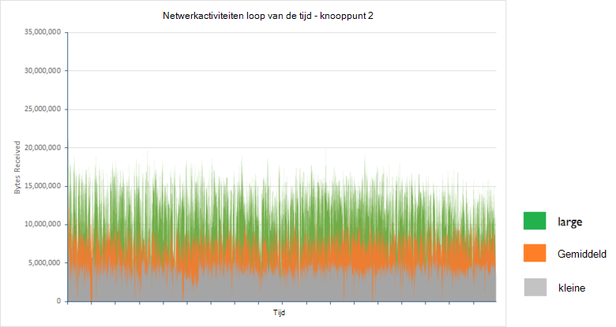

Het gemiddelde aantal bytes ontvangen per seconde voor knooppunt 2 in elke clusterconfiguratie gedurende de periode twee uur waren als volgt:

| Configuratie | Gemiddelde aantal bytes ontvangen per seconde |
|---------------|--------------------------------------|
| Kleine         | 3993640.3                            |
| Gemiddeld        | 7311689.9                            |
| Grote         | 11893874.2                           |

De tests zijn uitgevoerd terwijl het systeem is actief in **constante status**. In situaties waarin index opnieuw of knooppunt herstellen optreedt, genereren verzendingen van gegevens tussen knooppunten vasthouden van primaire en replica shards aanzienlijk netwerkverkeer. De effecten van dit proces worden meer in het document [configureren flexibiliteit en herstelbestanden op Elasticsearch op Azure][]beschreven.

### <a name="determining-limiting-factors-cpu-utilization"></a>Vaststellen beperken factoren: CPU-gebruik

De snelheid waarmee aanvragen worden verwerkt valt gedeeltelijk ten minste onder de verwerkingscapaciteit van de beschikbare. Elasticsearch accepteert aanvragen voor bulksgewijs invoegen op het bulksgewijs wachtrij invoegen. Elk knooppunt heeft een set bulksgewijs wachtrijen bepaald door het aantal beschikbare processors invoegen. Standaard is er één wachtrij voor elke processor en elke wachtrij kan maximaal 50 openstaande aanvragen bevatten voordat ze worden worden genegeerd. 

Toepassingen moeten aanvragen op een percentage dat niet de wachtrijen wordt aan overspill verzenden. Het aantal items in elke wachtrij op elk gewenst moment is het verstandig om een functie van de snelheid waarmee aanvragen worden verzonden door clienttoepassingen en de snelheid waarmee deze dezelfde aanvragen zijn opgehaald en verwerkt door Elasticsearch. Daarom vastgelegd één belangrijke statistische bezwaren het tarief fout in de volgende tabel worden samengevat.

| Configuratie | Totale voorbeelden | Aantal fouten  | Fout rente |
|---------------|---------------|--------------|------------|
| Kleine         | 67057         | 0            | 0,00%      |
| Gemiddeld        | 123483        | 1            | 0.0008%    |
| Grote         | 200702        | 3617         | 1,8%      |

Elk van deze fouten wordt veroorzaakt door de volgende Java-uitzondering:

```
org.elasticsearch.action.support.replication.TransportShardReplicationOperationAction$PrimaryPhase$1@75a30c1b]; ]
[219]: index [systembase], type [logs], id [AVEAioKb2TRSNcPa_8YG], message [RemoteTransportException[[esdatavm2][inet[/10.0.1.5:9300]][indices:data/write/bulk[s]]]; nested: EsRejectedExecutionException[rejected execution (queue capacity 50)
```

Het aantal wachtrijen en/of de lengte van elke wachtrij met groter wordende mogelijk Beperk het aantal fouten, maar deze methode kunt alleen hoofd met lichtflitsen korte duur. Hierdoor tijdens het uitvoeren van een continue reeks gegevens opname taken, wordt het punt waarop fouten begonnen optreedt gewoon uitstellen. Bovendien deze wijziging niet de doorvoer te verbeteren en de reactietijd van clienttoepassingen is waarschijnlijk schadelijk zoals aanvragen meer gewacht voordat het wordt verwerkt.

De structuur van de index standaard van 5 shards met 1 replica (10 shards in alle), resulteert in een bescheiden onevenwicht in laden tussen de knooppunten in een cluster twee knooppunten bevat drie shards terwijl het andere knooppunt uit vier bestaat. Het knooppunt drukste is waarschijnlijk het item dat wordt doorvoer optimaal, beperkt die daarom dit knooppunt in elke zaak is geselecteerd. 

De volgende set grafieken illustreren de CPU-gebruik voor de drukste knooppunt in elke cluster.

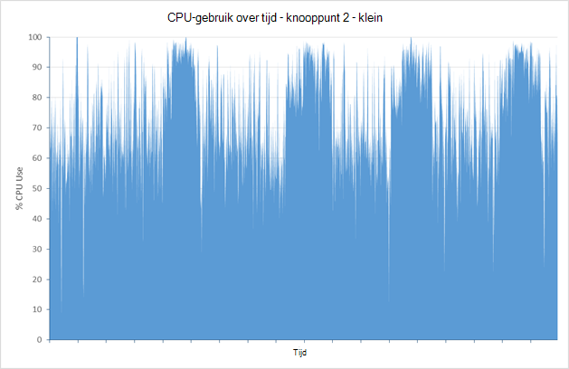

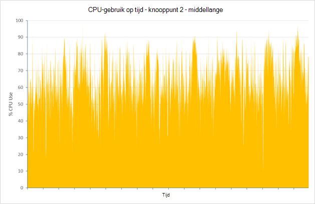

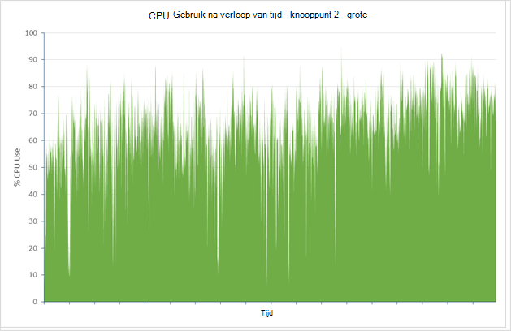

Voor de klein, normaal en grote clusters, was de gemiddelde CPU-gebruik voor deze knooppunten 75.01%, 64.93% en 64.64%. Zelden wordt gebruik daadwerkelijk druk op 100%, en gebruik afneemt als de grootte van de knooppunten en de beschikbare CPU power beschikbaar wordt verhoogd. CPU power daarom waarschijnlijk niet een factor de prestaties van het grote cluster beperken.

### <a name="determining-limiting-factors-memory"></a>Vaststellen beperken factoren: geheugen

Geheugengebruik is een ander belangrijk aspect die invloed kan hebben op prestaties. Voor de tests, is Elasticsearch 50% van de beschikbare geheugen toegewezen. Dit is loopt gelijk met de [aanbevelingen beschreven](https://www.elastic.co/guide/en/elasticsearch/guide/current/heap-sizing.html#_give_half_your_memory_to_lucene). Terwijl de tests zijn uitgevoerd, is de JVM voor overtollige ongewenste siteverzameling activiteit (vermelding van gebrek aan geheugen) bewaakt. In alle gevallen, de grootte van de opslagruimte stabiele is en de JVM tentoongesteld lage ongewenste siteverzameling activiteit. De volgende schermafbeelding ziet u een momentopname van Marvel, de toets JVM statistieken markeren voor een korte termijn, terwijl de test is uitgevoerd op de grote cluster.

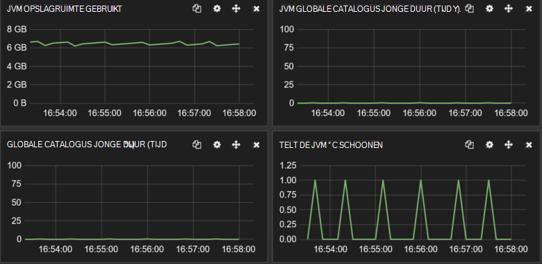

***JVM geheugen en ongewenste siteverzameling activiteit op de grote cluster.***

### <a name="determining-limiting-factors-disk-io-rrates"></a>Vaststellen beperken factoren: i/o-rRates schijf

De resterende fysieke functie op de server die prestaties beperken mogelijk is de prestaties van de schijf IO-subsysteem. Het volgende diagram worden vergeleken de schijfactiviteit in bytes voor de drukste knooppunten in elke cluster zijn geschreven.

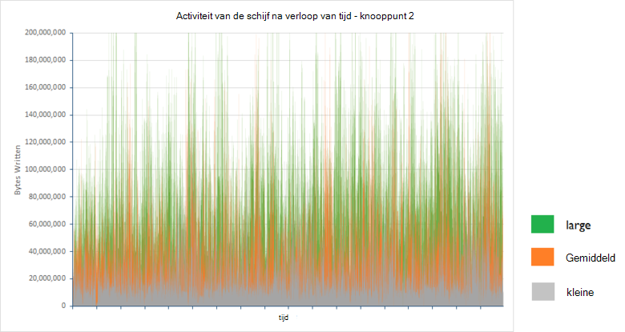 

De volgende tabel ziet u het gemiddelde aantal bytes geschreven per seconde voor knooppunt 2 in elke clusterconfiguratie in de periode twee uur te geven:

| Configuratie | Gemiddelde aantal bytes geschreven/sec |
|---------------|-------------------------------------|
| Kleine         | 25502361.94                         |
| Gemiddeld        | 48856124.5                          |
| Grote         | 88137675.46                         |

Het volume van de gegevens die worden geschreven verhogen met het aantal aanvragen worden verwerkt door een cluster, maar de i/o-tarieven zijn binnen de grenzen van Azure opslag (schijven die zijn gemaakt met behulp van Azure opslag ondersteunt een continue tarieven 10s naar 100s van MB/s, afhankelijk van of standaard of Premium opslag wordt gebruikt). Onderzoek van de hoeveelheid tijd die is besteed wachten op schijf I/O helpt te leggen waarom de schijfdoorvoer ruim onder het theoretische maximum. De grafieken en de onderstaande tabel kunt u deze statistieken voor de dezelfde drie knooppunten weergeven:

> [AZURE.NOTE]De schijf wachttijd wordt gemeten door het percentage van CPU-tijd waarin processors worden geblokkeerd, wachten op i/o-bewerkingen zijn voltooid cmdlets voor controle.

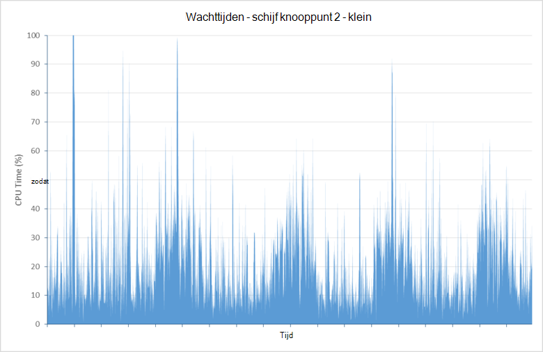

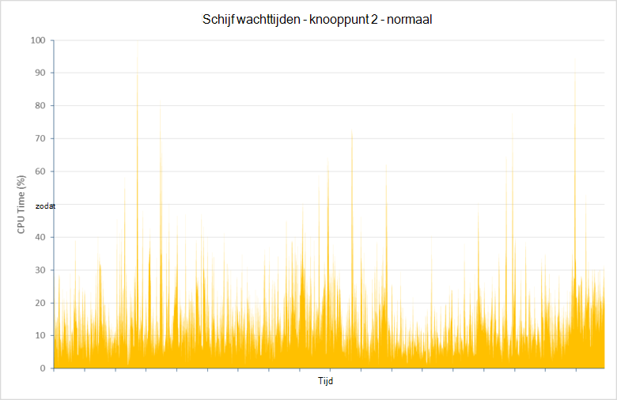

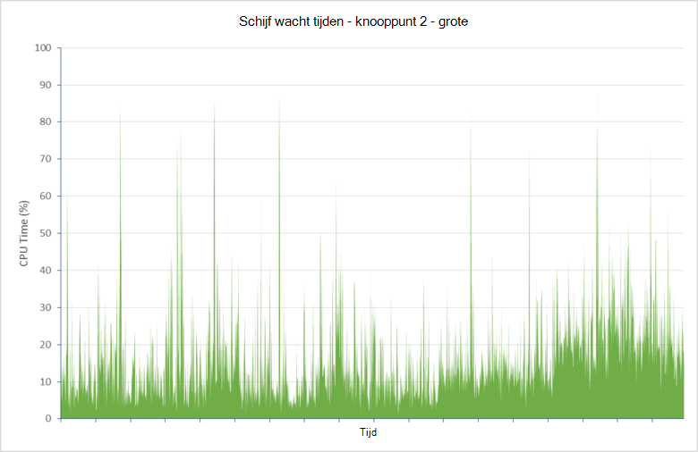

| Configuratie | Gemiddelde schijf wachttijd processor (%) |
|---------------|--------------------------------|
| Kleine         | 21.04                          |
| Gemiddeld        | 14.48                          |
| Grote         | 15.84                          |

Deze gegevens wordt aangegeven dat een groot aantal CPU-tijd (tussen 16% en 21%) is besteed wachten op schijf I/O om te voltooien. Dit is de mogelijkheid van Elasticsearch aanvragen te verwerken en opslag van gegevens beperken.

Tijdens de test uitvoert, het grote cluster ingevoegd meer dan **vijf interacties miljoen documenten**. De test om verder te staan blijkt dat de wachttijd aanzienlijk verhoogd wanneer de database meer dan zes interacties miljoen documenten voorkomen. De redenen om dit probleem zijn niet volledig onderzocht, maar vanwege schijf fragmentatie veroorzaakt verbeterde schijf latentie. 

De grootte van het cluster verhogen via meer knooppunten kan helpen aan de effecten van dit probleem te verhelpen. In extreme gevallen is het mogelijk dat deze moet een schijf die wordt weergegeven overtollige i/o-tijden defragmenteren. Echter een grote onderbreking kan duren aanzienlijke (mogelijk meer dan 48 uur voor een 2TB VHD-station) en gewoon formatteren van het station en Elasticsearch de ontbrekende gegevens herstellen uit replica shards toestaan mogelijk een meer efficiënte manier.

### <a name="addressing-disk-latency-issues"></a>Adressering van schijf latentieproblemen

De tests zijn in eerste instantie uitgevoerd met VMs geconfigureerd met standaard schijven. Een normale schijf is gebaseerd op media draaiende en daardoor kan rotatie latentie en andere knelpunten die i/o-tarieven kunnen beperken. Azure biedt ook premium-opslag waarin schijven zijn gemaakt met SSD-apparaten. Deze apparaten hebben geen rotatie latentie en daardoor verbeterde i/o-snelheden moeten geven. 

De onderstaande tabel worden de resultaten van de standaard schijven vervangen door de premium-schijven in het grote cluster vergeleken (de standaard D4 VMs in het grote cluster zijn vervangen door de standaard DS4 VMs; het aantal cores, geheugen en schijven is dezelfde in beide gevallen wordt het enige verschil dat de VMs DS4 SSD gebruikt).

| Configuratie    | Aantal voorbeelden | Gemiddelde antwoord tijd ([ms) | Doorvoer (bewerkingen/s) |
|------------------|--------------|----------------------------|---------------------------|
| Grote - standaard | 197085       | 839                        | 27,4                      |
| Grote - Premium  | 255985       | 581                        | 35,6                      |

Antwoord tijden zijn aanzienlijk betere, resulteert in een gemiddelde doorvoer veel dichter naar 4 x die van het kleine cluster. Dit is meer loopt gelijk met de bronnen die beschikbaar zijn op een standaard DS4 VM. Gemiddelde CPU-gebruik op het knooppunt in het cluster (knooppunt 1 in dit geval) de drukste is groter, zoals deze besteed minder tijd-en uitvoer voor voltooien wachten:

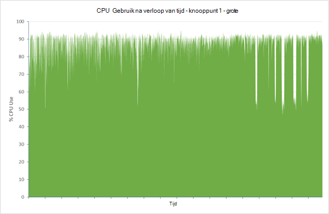

De beperking van schijf wachttijd wordt zichtbaar wanneer u rekening houden met de volgende graph, waarin wordt getoond dat voor het drukste knooppunt deze statistische naar rond 1% gemiddeld doorgeschoven:

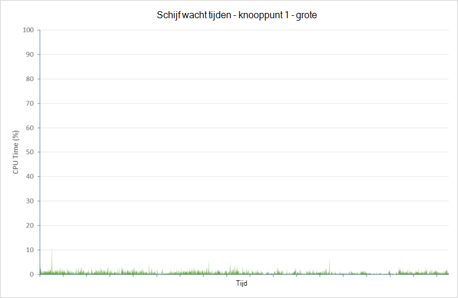

Er is een prijs te betalen voor deze verbetering, echter. Het aantal opname fouten opgehoogd met een factor van 10 naar 35797 (12.3%). De meeste van deze fouten zijn nogmaals het resultaat van de bulksgewijs invoegen wachtrij overloop plaatsvindt. Gezien het feit dat de hardware wordt nu weergegeven dicht bij capaciteit worden uitgevoerd, is het mogelijk dat deze nodig meer knooppunten toevoegen of het tarief weer bulksgewijs invoegen verkleinen van het volume van fouten beperken. Deze problemen worden besproken verderop in dit document.

### <a name="testing-with-ephemeral-storage"></a>Testen met kortstondige opslag

Dezelfde tests zijn op een cluster van D4 VMs kortstondige opslagruimte met herhaald. Kortstondige opslag is op D4 VMs geïmplementeerd als een eenmalige 400GB SSD. Het aantal voorbeelden verwerkt, antwoord tijd en doorvoer zijn alle vergelijkbaar met de cijfers gerapporteerd voor het cluster op basis van DS14 VMs met premium opslagmedia.

| Configuratie                     | Aantal voorbeelden | Gemiddelde antwoord tijd ([ms) | Doorvoer (bewerkingen/s) |
|-----------------------------------|--------------|----------------------------|---------------------------|
| Grote - Premium                   | 255985       | 581                        | 35,6                      |
| Groot – standaard (kortstondige schijf) | 255626       | 585                        | 35,5                      |

De snelheid van de fout is ook vergelijkbare (33862 fouten afmelden bij 289488 verzoeken in totaal – 11,7%).

De volgende grafieken weergeven de CPU-gebruik en schijf wacht statistieken voor de drukste knooppunt in het cluster (knooppunt 2 ditmaal):

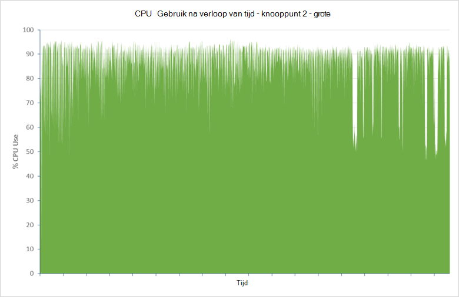

! [] (media/guidance-elasticsearch/data-ingestion-image13.png

In dit geval prestaties genoemd alleen kortstondige opslag als kan worden beschouwd een meest efficiënt oplossing dan het gebruik van de premium-opslag.

### <a name="data-ingestion-performance--windows-server-2012"></a>Gegevens opname prestaties: Windows Server 2012

Dezelfde tests zijn herhaald met een set Elasticsearch clusters met knooppunten waarop Windows Server 2012 worden uitgevoerd. Het doel van deze tests was tot stand brengen van welke effecten, indien van toepassing, de keuze van besturingssysteem mogelijk op clusterprestaties.

Om te illustreren de schaalbaarheid van Elasticsearch in Windows, ziet in de volgende tabel u de doorvoer en reactie tijden voor de kleine, middelgrote en grote clusterconfiguraties bereikt. Houd er rekening mee dat deze tests alle zijn uitgevoerd met Elasticsearch geconfigureerd voor gebruik SSD kortstondige opslag, zoals de tests Ubuntu had dat Schijfopruiming latentie waarschijnlijk een kritieke factor is bij het bereiken van maximale prestaties:

| Configuratie | Aantal voorbeelden | Gemiddelde antwoord tijd ([ms) | Doorvoer (bewerkingen/s) |
|---------------|--------------|----------------------------|---------------------------|
| Kleine         | 90295        | 476                        | 12,5                      |
| Gemiddeld        | 169243       | 508                        | 23.5                      |
| Grote         | 257115       | 613                        | 35,6                      |

Deze resultaten geven aan hoe Elasticsearch afhankelijk zijn van VM grootte en beschikbare bronnen op Windows.

De volgende tabellen worden de resultaten voor het grote cluster in Ubuntu en Windows vergeleken:

| Besturingssysteem | Aantal voorbeelden | Gemiddelde antwoord tijd ([ms) | Doorvoer (bewerkingen/s) | Fout percentage (%) |
|------------------|--------------|----------------------------|---------------------------|----------------|
| Ubuntu           | 255626       | 585                        | 35,5                      | 11,7           |
| Windows          | 257115       | 613                        | 35,6                      | 7.2            |

De doorvoer is consistent zijn met die voor de grote Ubuntu clusters, hoewel de tijd antwoord iets hoger is. Dit kan worden verwerkt door het lagere percentage van de fout (fouten sneller dan geslaagde bewerkingen worden verzonden, zodat een lagere antwoord tijdstip hebt geselecteerd).

De CPU-gebruik gerapporteerd met het Windows-hulpprogramma's voor controle is iets hoger zijn dan van Ubuntu. U moet echter directe vergelijkingen van afmetingen zoals de volgende besturingssystemen zo min vanwege de manier waarop verschillende besturingssystemen rapporteren deze statistieken behandelen. Informatie over Schijfopruiming latentie in CPU wachttijd voor I/O is bovendien niet beschikbaar op dezelfde manier als voor de Ubuntu. Het belangrijkste is dat CPU-gebruik is hoog, laag die aangeeft dat wachttijd gebruikte voor I/O is:

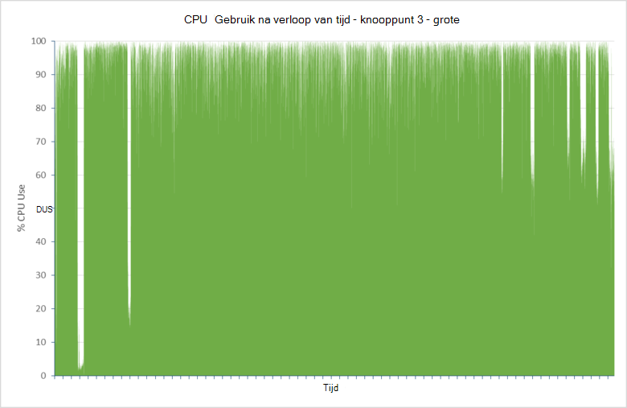

### <a name="scaling-up-conclusions"></a>Schaalbaarheid van: conclusies

Elasticsearch prestaties voor een goed lopende cluster is waarschijnlijk het equivalent in Windows en Ubuntu en dat deze schaal-up in een soortgelijke patroon op beide besturingssystemen. Voor de beste prestaties **premium opslagruimte voor het vasthouden van Elasticsearch gegevens gebruiken**.

## <a name="scaling-out-clusters-to-support-large-scale-data-ingestion"></a>Horizontaal schalen clusters ter ondersteuning van grootschalige gegevens opname

Schalen, is de gratis aanpak schaalbaarheid van onderzochte in de vorige sectie. Een belangrijk onderdeel van Elasticsearch is de inherent horizontale schaalbaarheid ingebouwd in de software. De grootte van een cluster met groter wordende is gewoon een kwestie van het toevoegen van meer knooppunten. U hoeft niet alle handmatige bewerkingen als u wilt verspreiden indexen uit te voeren of shards als deze taken automatisch worden verwerkt, hoewel er een aantal configuratieopties beschikbaar zijn waarmee u kunt dit proces beïnvloeden. 

Meer knooppunten toevoegen kunt u de prestaties verbeteren door het selectievakje laden spreiden over meer machines. Als u meer knooppunten toevoegt, moet u mogelijk ook overwegen opnieuw indexeren om het aantal beschikbare shards vergroten. U kunt dit proces tot op zekere gaan door te maken van indexen die meer shards dan er beschikbare knooppunten in eerste instantie hebt. Wanneer verder knooppunten zijn toegevoegd, kunnen de shards worden gedistribueerd.

Naast het profiteren van de horizontale schaalbaarheid van Elasticsearch, zijn er andere redenen voor de uitvoering van indexen waarvoor meer shards dan knooppunten. Elke shard wordt geïmplementeerd als een afzonderlijke gegevensstructuur (een [Lucene](https://lucene.apache.org/) -index) en heeft een eigen interne regelingen voor consistentie van de en gelijktijdigheid afhandelen. Maken van meerdere shards helpt om uit te breiden parallellisme binnen een knooppunt en de prestaties kunt verbeteren. 

Goede prestaties echter terwijl afwegen schaalbaarheid is. De meer knooppunten en shards die een cluster bevat, is het meer inspanning verplicht voor het synchroniseren van het werk dat wordt uitgevoerd door de cluster, hetgeen kan doorvoer verkleinen. Voor een bepaalde werkbelasting, moet u er een optimale configuratie die gemaximaliseerd opname prestaties tijdens het minimaliseren van het onderhoud nodig is. Deze configuratie is sterk afhankelijk van de aard van de werkbelasting en het cluster. specifiek, het volume, de grootte en de inhoud van de documenten, het tarief weer dat waar opname plaatsvindt en de hardware waarop het systeem wordt uitgevoerd.  

In deze sectie bevat een overzicht van de resultaten van onderzoeken in het formaat wijzigen clusters ter ondersteuning van de werklast die worden gebruikt door de van prestatietests die eerder is beschreven. Dezelfde test op clusters is uitgevoerd met VMs op basis van het grote VM grootte (standaard D4 met 8 CPU cores, 16 gegevensschijven en 28GB RAM) uitvoeren Ubuntu Linux 14.0.4, maar met een verschillend aantal knooppunten en shards geconfigureerde. De resultaten niet moeten worden definitieve als ze alleen voor een specifieke scenario gelden, maar ze kunnen fungeren als een goed beginpunt om te helpen u de horizontale schaalbaarheid van clusters analyseren en genereren aantallen voor de verhouding tussen de optimale shards voor knooppunten die het beste aan uw eigen vereisten voldoet.

### <a name="baseline-results--3-nodes"></a>Resultaten van de basislijn – 3 knooppunten

Als u een afbeelding van de basislijn, is de gegevens opname prestatietest voor een cluster 3 knooppunten met 5 shards en 1 replica uitgevoerd. Dit is de standaard-configuratie voor een index Elasticsearch. In deze configuratie wordt Elasticsearch distribueert 2 primaire shards naar 2 van de knooppunten en het resterende primaire shard is opgeslagen op het derde knooppunt. De onderstaande tabel worden de doorvoer met opname bulkbewerkingen per seconde en het aantal documenten die waren is opgeslagen door de test.

> [AZURE.NOTE] In de tabellen die in deze sectie volgt, wordt de verdeling van de primaire shards gepresenteerd als een getal voor elk knooppunt gescheiden door streepjes. De indeling van de 3-knooppunt 5-shard wordt bijvoorbeeld 2-2-1 genoemd. De indeling van replica shards is niet opgenomen. Ze wordt een soortgelijke kleurenschema Voer aan de primaire shards.

| Configuratie | Aantal documenten | Doorvoer (bewerkingen/s)   | Shard-indeling |
|---------------|----------------|-----------------------------|--------------|
| 5 shards      | 200560412      | 27.86                       | 2-2-1        |

### <a name="6-node-results"></a>6-knooppunt resultaten

De test is een cluster 6 knooppunt herhaald. Het doel van deze tests was u kunt uitproberen en nauwkeuriger de effecten van meer dan één shard opslaan op een knooppunt gaan.

| Configuratie | Aantal documenten | Doorvoer (bewerkingen/s)   | Shard-indeling |
|---------------|----------------|-----------------------------|--------------|
| 4 shards      | 227360412      | 31.58                       | 1-1-0-1-1-0  |
| 7 shards      | 268013252      | 37.22                       | 2-1-1-1-1-1  |
| 10 shards     | 258065854      | 35.84                       | 1-2-2-2-1-2  |
| 11 shards     | 279788157      | 38.86                       | 2-2-2-1-2-2  |
| 12 shards     | 257628504      | 35.78                       | 2-2-2-2-2-2  |
| 13 shards     | 300126822      | 41.68                       | 2-2-2-2-2-3  |

Deze resultaten worden weergegeven om aan te geven van de volgende trends:

* Meer shards per knooppunt verbetert doorvoer. Met de klein aantal shards per knooppunt gemaakt voor deze tests, dit verschijnsel verwacht, vanwege de eerder beschreven.

* Een oneven aantal shards biedt betere prestaties dan een even getal. De redenen *voor deze zijn minder wissen, maar deze is mogelijk dat de routering algoritme dat Elasticsearch wordt gebruikt, kan beter in dit geval de gegevens over shards verdelen waardoor een meer even laden per knooppunt* .

Als u wilt deze hypothesen zijn verschillende verdere tests uitgevoerd met grotere aantallen shards. Op de aanbevelingen van Elasticsearch, werd besloten een priemgetal van shards voor elke test gebruiken, zoals deze een redelijk verdeling van oneven nummers voor het betreffende bereik geven.

| Configuratie | Aantal documenten | Doorvoer (bewerkingen/s)   | Shard-indeling      |
|---------------|----------------|-----------------------------|-------------------|
| 23 shards     | 312844185      | 43.45                       | 4-4-4-3-4-4       |
| 31 shards     | 309930777      | 43.05                       | 5-5-5-5-6-5       |
| 43 shards     | 316357076      | 43.94                       | 8-7-7-7-7-7       |
| 61 shards     | 305072556      | 42.37                       | 10-11-10-10-10-10 |
| 91 shards     | 291073519      | 40.43                       | 15-15-16-15-15-15 |
| 119 shards    | 273596325      | 38.00                       | 20-20-20-20-20-19 |

Deze resultaten voorgestelde dat een bewaring punt op ongeveer 23 shards is bereikt. Na dat moment weer veroorzaakt waardoor het aantal shards een kleine verslechtering van prestaties (de doorvoer voor 43 shards is mogelijk een afwijking).

### <a name="9-node-results"></a>9 knooppunten resultaten

De tests zijn herhaald met een cluster van 9 knooppunten, opnieuw met een priemgetal van shards.

| Configuratie | Aantal documenten | Doorvoer (bewerkingen/s)   | Shard-indeling               |
|---------------|----------------|-----------------------------|----------------------------|
| 17 shards     | 325165364      | 45.16                       | 2-2-2-2-2-2-2-2-1          |
| 19 shards     | 331272619      | 46.01                       | 2-2-2-2-2-2-2-2-3          |
| 29 shards     | 349682551      | 48.57                       | 3-3-3-4-3-3-3-4-3          |
| 37 shards     | 352764546      | 49,00                       | 4-4-4-4-4-4-4-4-5          |
| 47 shards     | 343684074      | 47.73                       | 5-5-5-6-5-5-5-6-5          |
| 89 shards     | 336248667      | 46.70                       | 10-10-10-10-10-10-10-10-9  |
| 181 shards    | 297919131      | 41.38                       | 20-20-20-20-20-20-20-20-21 |

Deze resultaten blijkt een soortgelijke patroon, met een bewaring punt ongeveer 37 shards.

### <a name="scaling-out-conclusions"></a>Horizontaal te schalen: conclusies

Met een ruw extrapolatie, de resultaten van de tests 6 en 9-knooppunten aangegeven dat dit specifieke scenario het ideale aantal shards om prestaties te verbeteren 4n +/-1 was, waarbij n het aantal knooppunten is. Dit *kan* zijn een functie van het aantal bulksgewijs invoegen threads beschikbaar, die op zijn beurt is afhankelijk van het aantal CPU cores, het hoe en waarom wordt als volgt (Zie [Meerdere documenten patronen](https://www.elastic.co/guide/en/elasticsearch/guide/current/distrib-multi-doc.html#distrib-multi-doc) voor meer informatie):

- Elke bulksgewijs invoegen aanvraag verzonden door de clienttoepassing is ontvangen door een gegevensknooppunt één.

- Het gegevensknooppunt genereert een nieuwe bulksgewijs invoegen aanvraag voor elke primaire shard beïnvloed door het oorspronkelijke verzoek en stuurt ze naar de andere knooppunten, parallel.

- Als elke primaire shard is geschreven, wordt een andere aanvraag verzonden naar elke replica voor die shard. De primaire shard wacht totdat de aanvraag verzonden naar de replica om te voltooien voordat u voltooit.

Standaard wordt Elasticsearch één bulksgewijs invoegen thread voor elke beschikbare CPU core gemaakt in een VM. Als de D4 VMs die worden gebruikt door deze test, elke CPU opgenomen 8 cores, zodat 8 bulksgewijs invoegen threads zijn gemaakt. De index gebruikt omspannen 4 (in één geval 5) primaire shards op elk knooppunt, maar er ook 4 (5 zijn) replica's op elk knooppunt. Het invoegen van gegevens in deze shards en replica's kan maximaal 8 threads op elk knooppunt op verzoek overeenkomen met het aantal beschikbare gebruiken. Vergroten of verkleinen van het aantal shards kan ertoe leiden dat threads efficiëntie zoals threads zijn mogelijk onbezette links of aanvragen in de wachtrij. Echter zonder meer experimenten dit alleen gehaald is en het is niet mogelijk om te worden definitieve.

De tests geïllustreerd ook een belangrijk punt. In dit scenario wordt het aantal knooppunten verhogen kunt verbeteren opname gegevensdoorvoer, maar de resultaten niet per se schalen lineair. Verdere proeven met 12 en 15 knooppunten bevatten, kan het punt weergeven Hiermee weinig extra voordeel op welke schaal af. Als dit aantal knooppunten niet voldoende opslagruimte bevat, is het mogelijk moet u terugkeren naar de schaal van strategie en aan de slag met meer of groter schijven op basis van de premium-opslag.

> [AZURE.IMPORTANT] De verhouding tussen de 4n +/-1 worden pas van kracht als een magische formule die voor elke cluster altijd werkt. Als u minder of meer CPU-beschikbaar kernen hebt, is het mogelijk dat de configuratie optimale shard verschillende. De resultaten zijn gebaseerd op een specifieke werkbelasting die alleen gegevens opname hebt. De resultaten kunnen worden zeer diverse voor werkbelasting die ook een combinatie van query's en aggregaties bevatten.

> Bovendien de werklast van de opname gegevens gebruikt voor een enkele index. In veel gevallen is de gegevens kunnen worden verdeeld over meerdere indexen waardoor verschillende patronen of het gebruik van de resource.

> Het belangrijkste van deze oefening is voor meer informatie over de methode gebruikt in plaats van de resultaten worden vermeld. U moet worden voorbereid om uit te voeren van uw eigen schaalbaarheid assessment op basis van uw eigen werkbelasting om informatie die meest geldt voor uw situatie te verkrijgen.

## <a name="tuning-large-scale-data-ingestion"></a>Grootschalige gegevens opname optimaliseren

Elasticsearch is ten zeerste configureerbare, met veel schakelopties en instellingen die u kunt de prestaties optimaliseren voor specifieke gebruik gevallen en scenario's. Dit onderwerp vindt enkele algemene voorbeelden. Vergeet niet dat de flexibiliteit Elasticsearch vindt u in dit verband wordt geleverd met een waarschuwing, het is heel eenvoudig kunt detune Elasticsearch en prestaties slechter kunt aanbrengen. Controleer bij het afstemmen, alleen een tegelijk wijzigen en altijd meet de effecten van wijzigingen om ervoor te zorgen dat ze afkomstig niet schadelijk voor uw systeem zijn.

### <a name="optimizing-resources-for-indexing-operations"></a>Bronnen voor indexing bewerkingen optimaliseren

De volgende lijst bevat enkele punten die u rekening wanneer houden moet een Elasticsearch cluster voor ondersteuning van grootschalige gegevens opname optimaliseren. De eerste twee items zijn meestal een direct duidelijk invloed hebben op prestaties tijdens het restgetal meer randnummer, afhankelijk van de werklast zijn:

*  Nieuwe documenten die zijn toegevoegd aan een index alleen zichtbaar voor zoekopdrachten wanneer de index wordt vernieuwd. Een index vernieuwen is een dure bewerking, zodat deze wordt alleen regelmatig uitgevoerd in plaats van elk document is gemaakt. Het standaardvernieuwingsinterval is 1 seconde. Als u bulkbewerkingen uitvoert, kunt u overwegen index vernieuwingen tijdelijk uit te schakelen. De index instellen *vernieuwen\_interval* op -1.

    ```http
    PUT /my_busy_index
    {
        "settings" : {
            "refresh_interval": -1
        }
    }
    ```

    Een vernieuwing handmatig te activeren met behulp van de [* \_vernieuwen*](https://www.elastic.co/guide/en/elasticsearch/reference/current/indices-refresh.html) API aan het einde van de bewerking de gegevens om zichtbaar te maken. Zie [Bulksgewijs indexeren gebruik](https://www.elastic.co/guide/en/elasticsearch/reference/current/indices-update-settings.html#bulk) voor meer informatie. Meer informatie over de [gevolgen van het wijzigen van het vernieuwingsinterval op gegevens opname](#the-impact-of-changing-the-index-refresh-interval-on-data-ingestion-performance) verderop.

* Als een index wordt gerepliceerd, elk indexeren (document maken, bijwerken of verwijderen) op de shards replica wordt herhaald, zoals die in de primaire shard plaatsvinden. Overweeg herhaling tijdens bulkbewerkingen importeren uit te schakelen en weer inschakelt wanneer het importeren voltooid is:

    ```http
    PUT /my_busy_index
    {
        "settings" : {
            "number_of_replicas": 0
        }
    }
    ```

    Wanneer u replicatie opnieuw inschakelen, voert Elasticsearch een byte-voor-byte netwerkoverdracht van gegevens uit de index aan elke replica. Dit is efficiënter dan indexing werkwijze document document door op elk knooppunt herhalen. Het risico is dat gegevens van de primaire knooppunt mislukt tijdens het uitvoeren van het bulksgewijs importeren verloren kunnen gaan, maar herstel mogelijk gewoon een kwestie van de importbewerking opnieuw te starten. De [impact van herhaling van de opname gegevens](#the-impact-of-replicas-on-data-ingestion-performance) wordt later uitgebreider beschreven.

* Elasticsearch wil saldo vanaf de resources tussen die vereist zijn voor query's uitvoeren en die vereist zijn voor ingesting gegevens beschikbaar. Hierdoor kan deze gegevens opname prestaties (bandbreedteregeling gebeurtenissen worden vastgelegd in het logboek Elasticsearch) beperken. Deze beperking is bedoeld om te voorkomen dat een groot aantal Indexsegmenten gelijktijdig wordt gemaakt die opgevolgd moeten samenvoegen en op te slaan op schijf, een proces dat ten resources opzichte. Als uw systeem momenteel niet van query's uitvoeren is, kunt u de gegevens opname beperken uitschakelen. Hierdoor moet indexering prestaties. U kunt uitschakelen beperken voor een hele cluster als volgt:

    ```http
    PUT /_cluster/settings
    {
        "transient" : {
            "indices.store.throttle.type": "none"
        }
    }
    ```

    Stel het type beperking van het cluster terug naar *'samenvoegen'* wanneer de opname is voltooid. Ook notitie die uitschakelen beperken kan leiden tot instabiliteit in het cluster, dus zorgt ervoor dat u procedures in de locatie waarop het cluster kunt herstellen indien nodig.

* Elasticsearch behoudt een deel van het geheugen voor het indexeren bewerkingen, het restgetal wordt vooral gebruikt door de query's en zoekopdrachten. Het doel van deze buffers is om het aantal schijf i/o-bewerkingen, met het doel van de uitvoering van minder en grotere schrijft dan meer, kleinere schrijft te verlagen. Het standaard aantal geheugen toegewezen is 10%. Als u een grote hoeveelheid gegevens zijn indexeren vervolgens deze waarde mogelijk onvoldoende. Voor systemen die ondersteuning bieden voor grote hoeveelheden gegevens opname, moet u maximaal 512MB geheugen voor elke actieve shard in het knooppunt toestaan. Bijvoorbeeld als u Elasticsearch worden uitgevoerd op D4 VMs (28GB RAM) en 50% van de beschikbare geheugen hebt toegewezen aan de JVM (14GB), is klikt u vervolgens 1,4 GB beschikbaar voor gebruik door indexering bewerkingen. Als een knooppunt 3 actieve shards bevat, zijn deze configuratie is waarschijnlijk voldoende. Echter als een knooppunt meer shards dan deze bevat, houd rekening met de waarde van de *indices.memory.index\_buffer\_grootte* parameter in het configuratiebestand elasticsearch.yml. Zie [Prestatieoverwegingen voor Elasticsearch indexeren](https://www.elastic.co/blog/performance-considerations-elasticsearch-indexing)voor meer informatie.

    Bij het toewijzen van meer dan 512MB per actieve shard waarschijnlijk niet indexeren prestaties te verbeteren en dat is wel mogelijk zijn schadelijk als minder geheugen, beschikbaar is voor het uitvoeren van andere taken. Ook worden dat bij het toewijzen van meer opslagruimte ruimte beschikbaar voor index buffers geheugen voor andere bewerkingen zoals zoeken en gegevens aggregeren verwijdert, en de prestaties van querybewerkingen kunt verminderen.

* Elasticsearch beperkt het aantal threads (de standaardwaarde is 8) die in een shard gelijktijdig indexing bewerkingen kunt uitvoeren. Als een knooppunt alleen een klein aantal shards bevat, klikt u vervolgens kunt vergroten de *index\_gelijktijdigheid* instellen voor een index die onderhevig aan een grote hoeveelheid indexeren bewerkingen, of het doel van een insert bulksgewijs is als volgt:

    ```http
    PUT /my_busy_index
    {
        "settings" : {
            "index_concurrency": 20
        }
    }
    ```

* Als u een groot aantal indexing en bulk-bewerkingen voor een korte tijdsperiode uitvoert, kunt u het aantal *index* en *bulksgewijs* threads beschikbaar in de threadgroep vergroten en de grootte van de wachtrij *bulksgewijs invoegen* voor elk gegevensknooppunt uitbreiden. Hierdoor wordt meer aanvragen in de wachtrij in plaats van wordt verwijderd. Zie [Thread toepassingen](https://www.elastic.co/guide/en/elasticsearch/reference/current/modules-threadpool.html)voor meer informatie. Als u continue hoge niveaus van de opname van gegevens uitvoert, wordt het vergroten van het aantal bulksgewijs threads niet aanbevolen. In plaats daarvan aanvullende knooppunten maken en sharding met de indexing verdelen over deze knooppunten. U kunt ook overwegen bulksgewijs invoegen batches serie verzenden in plaats van parallel zoals dit zal fungeren als natuurlijke bandbreedtebeperking toe die de kans van de fouten vanwege een bulksgewijs kunt kleiner invoegen wachtrij overloop plaatsvindt.

### <a name="the-impact-of-changing-the-index-refresh-interval-on-data-ingestion-performance"></a>De gevolgen van het wijzigen van de index vernieuwingsinterval van de opname gegevens

Het vernieuwingsinterval bepaalt het tarief weer dat waarop geconsumeerde gegevens zichtbaar voor query's en aggregaties, maar veelgebruikte vernieuwingen kunnen van invloed zijn op de prestaties van opname gegevensbewerkingen. Het standaardvernieuwingsinterval is 1 seconde. U kunt uitschakelen vernieuwen volledig, maar dit mogelijk niet geschikt zijn voor uw werkzaamheden. U kunt experimenteren met verschillende intervallen probeert en het instellen van de plaats bataten waarmee de prestaties van de opname tegen de behoefte om up-to-date gegevens te presenteren.

Als een voorbeeld van het effect, is de test gegevens opname prestaties op een Elasticsearch cluster die bestaat uit 7 shards verdeeld over 3 gegevensknooppunten herhaald. De index had een één replica. Elk gegevensknooppunt is gebaseerd op een D4 VM (28GB RAM, 8 processorcores) kortstondige opslag SSD back gebruiken voor de gegevens. Elke test hebt uitgevoerd voor 1 uur staan.

In deze test is het tarief weer dat vernieuwen ingesteld op de standaardwaarde van 1 seconde. De volgende tabel ziet u de doorvoer en reactie tijden voor deze test vergeleken met een afzonderlijk uitvoeren wanneer vernieuwen is verlaagd in één keer elke 30 seconden.

| Tarief vernieuwen | Aantal voorbeelden | Gemiddelde antwoord tijd – geslaagde bewerkingen ([ms) | Doorvoer – geslaagde bewerkingen (bewerkingen/s) |
|--------------|--------------|----------------------------------------------------|---------------------------------------------------|
| 1 seconde     | 93755        | 460                                                | 26,0                                              |
| 30 seconden   | 117758       | 365                                                | 32,7                                              |

In deze test neer te zetten het tarief weer dat vernieuwen geleid tot een verbetering 18% van doorvoer en een 21% wilt verkleinen in gemiddelde antwoord tijd. De volgende grafieken gegenereerd met Marvel illustreren de belangrijkste reden voor dit verschil. De afbeeldingen hieronder ziet u de index samenvoegen activiteit die zijn aangebracht in het vernieuwingsinterval instellen op 1 seconde en 30 seconden. 

Index wordt samengevoegd worden uitgevoerd als u wilt voorkomen dat het aantal in het geheugen Indexsegmenten dat u te veel. Een 1 seconde vernieuwingsinterval een groot aantal kleine segmenten die worden samengevoegd vaak genereert, moeten terwijl het interval voor vernieuwen van 30 seconden genereert minder grote segmenten waarin meer optimaal kunnen worden samengevoegd.

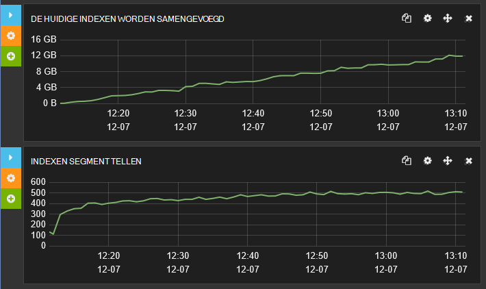

***Index samenvoegen activiteit voor een tarief voor het vernieuwen van index van 1 seconde***

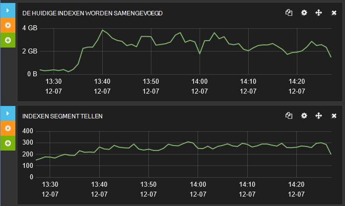

***Index samenvoegen activiteit voor een index vernieuwen tarief van 30 seconden***

### <a name="the-impact-of-replicas-on-data-ingestion-performance"></a>De invloed van replica's van de opname gegevens

Replica's vormen een essentiële functie van een robuuste cluster en zonder ze u risico verloren gaan als een knooppunt niet te gebruiken. Echter replica's vergroot de hoeveelheid schijf en netwerk I/O wordt uitgevoerd en schadelijk voor het tarief weer dat waarmee gegevens is bij. Vanwege de eerder beschreven, is het mogelijk nuttig om tijdelijk replica's voor de duur van het uploaden van grootschalige gegevensbewerkingen uitschakelen.

Gegevens opname prestatietests zijn herhaald met de drie configuraties:

* Gebruik een cluster met geen replica's.

* Gebruik een cluster met 1 replica.

* Gebruik een cluster met 2 replica's.

In alle gevallen het cluster 7 shards verdeeld over 3 knooppunten opgenomen en worden uitgevoerd onder VMs configureren zoals beschreven in de vorige set testen. De test-index gebruikt een vernieuwingsinterval van 30 seconden.

De volgende tabel bevat een overzicht van de reactietijden en doorvoer van elke test ter vergelijking:

| Configuratie | Aantal voorbeelden | Gemiddelde antwoord tijd – geslaagde bewerkingen ([ms) | Doorvoer – geslaagde bewerkingen (bewerkingen/s) | Opname gegevensfouten |
|---------------|--------------|----------------------------------------------------|---------------------------------------------------|--------------------------|
| 0 replica 's    | 215451       | 200                                                | 59.8                                              | 0                        |
| 1 replica     | 117758       | 365                                                | 32,7                                              | 0                        |
| 2 replica 's    | 94218        | 453                                                | 26.1                                              | 194262                   |


De weigeren in prestaties als het aantal replica's toeneemt is uitgeschakeld, maar u moet ook ziet u de grote hoeveelheid gegevens opname fouten in de derde test. De berichten die zijn gegenereerd door deze fouten aangegeven dat ze zijn vanwege de overloop plaatsvindt bulksgewijs invoegen wachtrij veroorzaakt door aanvragen voor worden genegeerd. Deze afwijzingen zeer snel is opgetreden, daarom heb ik het getal groot is.

> [AZURE.NOTE] De resultaten van de derde test Benadruk het belang van het gebruik van een strategie intelligente opnieuw tijdelijke fouten zoals dit: invoegen weer uitschakelen voor een korte termijn toe te staan dat de wachtrij voor het invoegen van bulksgewijs laten alvorens nogmaals te proberen bovenaan elke pagina de bulksgewijs bewerking.

De volgende sets met grafieken Vergelijk de tijden antwoord tijdens de tests. In elk geval die de eerste grafiek de algehele antwoord tijden worden weergegeven terwijl de tweede inzoomen graph op de reactietijden voor de snelste bewerkingen (Let erop dat de schaal van de eerste grafiek tien keer die van de tweede is). U kunt zien hoe het profiel van de tijden antwoord is afhankelijk van de drie tests.

Met geen replica's heeft de meeste bewerkingen tussen 75ms en 750ms, met de snelste reactie tijden ongeveer 25 MS:


Met 1 replica is de meest gevulde operationele antwoord-tijd in het bereik 125ms naar 1250ms. De snelste antwoorden duurt ongeveer 75ms, hoewel er minder van deze snelle antwoorden dan in het geval 0 replica's. Er zijn ook veel meer antwoorden aanzienlijk langer is dan de meest voorkomende gevallen, die groter zijn dan 1250ms duurde:

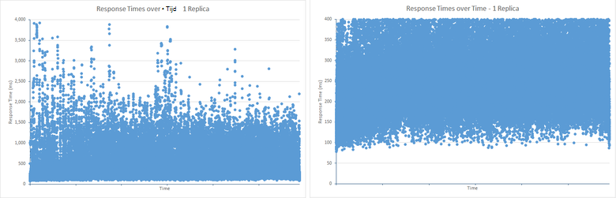

Met 2 replica's, het meest gevulde antwoord tijdsbereik is 200 MS-1500ms, maar er zijn uiterst minder resultaten onder de minimale bereik dan in de test 1 replica. Maar, het patroon van resultaten boven de bovengrens is vergelijkbaar met die van de toets 1 replica. Dit is meestal veroorzaakt door de effecten van de bulksgewijs invoegen wachtrij overloop plaatsvindt (meer dan de wachtrijlengte van een van 50 aanvragen). De extra werk nodig is om te onderhouden 2 replica's zorgt ervoor dat de wachtrij naar het gebied ernaast vaker voorkomen van opname bewerkingen niet kan overtollige antwoord tijden. Bewerkingen zijn snel geweigerd in plaats van een lange periode duurt, mogelijk veroorzaakt door time-out uitzonderingen of die invloed hebben op de reactiesnelheid van clienttoepassingen (dit is het doel van de bulksgewijs invoegen wachtrij om):


Marvel gebruikt, kunt u het effect van het aantal replica's zien in de wachtrij bulksgewijs-index. De onderstaande afbeelding ziet de gegevens uit Marvel die ziet u hoe de wachtrij gevuld tijdens de test voor het invoegen van het bulksgewijs. Lengte van de gemiddelde wachtrij is rond 40 aanvragen, maar periodiek bursts veroorzaakt overloop en aanvragen als gevolg zijn afgewezen:

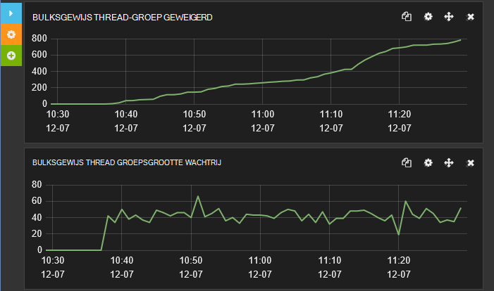

***Bulksgewijs index wachtrijgrootte en aantal aanvragen geweigerd met 2 replica's.***

U moet dit vergelijken met de onderstaande afbeelding waarin de resultaten voor een enkele replica. De engine Elasticsearch was verwerken van aanvragen snel genoeg te bewaren lengte van de gemiddelde wachtrij bij ongeveer 25 en nergens hebt lengte van de wachtrij groter is dan 50 aanvragen zodat er geen tijdelijke is geweigerd.

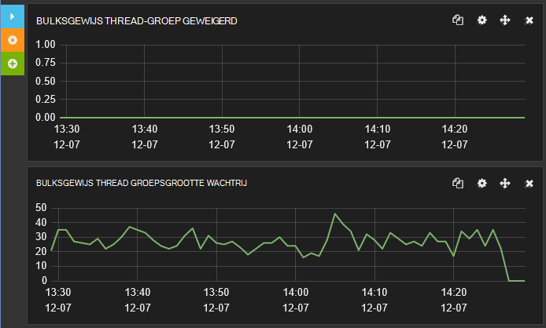

***Bulksgewijs index wachtrijgrootte en het aantal geweigerde met 1 replica aanvragen.***

## <a name="best-practices-for-clients-sending-data-to-elasticsearch"></a>Aanbevolen procedures voor het verzenden van gegevens naar Elasticsearch clients

Veel aspecten van de prestaties zijn ongerust niet alleen intern binnen het systeem, maar met hoe het systeem wordt gebruikt door clienttoepassingen. Elasticsearch biedt veel functies die kunnen worden gebruikt door de gegevens opname proces. unieke id's voor documenten worden gegenereerd, het uitvoeren van document analyses en zelfs gebruik uitvoeren van scripts om de gegevens worden getransformeerd als deze is opgeslagen en volgen enkele voorbeelden. Deze functies die alle aan het selectievakje laden op de engine Elasticsearch en in veel gevallen toevoegen kunnen echter efficiënter worden uitgevoerd door clienttoepassingen vóór de overdracht. 

> [AZURE.NOTE] Deze lijst met aanbevolen procedures vooral verband met nieuwe gegevens liever wijzigen van bestaande gegevens al zijn opgeslagen in een index ingesting. Opname werkbelasting worden uitgevoerd zoals toevoegen door Elasticsearch, dat gegevens worden aangebracht worden uitgevoerd als bewerkingen verwijderen/toevoegen. Dit komt doordat documenten in een index onveranderlijke, zijn zodat het wijzigen van een document heeft betrekking op het hele document vervangen door een nieuwe versie. U kunt een verzoek HTTP plaatsen om naar een bestaand document overschrijven uitvoeren of u kunt de Elasticsearch *bijwerken* API dat een query als u wilt ophalen van een bestaand document abstracts en voert een opslag om op te slaan van het nieuwe document de wijzigingen samengevoegd.

Bovendien kunt u overwegen de volgende procedures implementeren wanneer van toepassing:

* Analyse van de tekst voor de indexvelden die niet moeten worden geanalyseerd uitschakelen. Analyse heeft betrekking op tokens tekst om in te schakelen van query's die u naar specifieke voorwaarden zoeken kunnen. Dit kan echter worden van een taak veel CPU, moet selectief. Als u van Elasticsearch gebruikmaakt logboekgegevens opslaat, is het mogelijk dat deze nuttige informatie voor de gedetailleerde logboekberichten toe te staan dat complexe zoekacties basisvormen. Andere velden, zoals de scripts die foutcodes of -id's moeten waarschijnlijk niet worden ge? exeerd (een '3' voor example? hoe vaak bent u waarschijnlijk het aanvragen van de details van alle berichten waarvan foutcode bevat) de volgende code analyse voor de velden *naam* en *hostip* in het type *Logboeken aan* de index *systembase* uitschakelt.

    ```http
    PUT /systembase
    {
        "settings" : {
            ...
        },
        "logs" : {
            ...
            "name": {
                "type": "string",
                "index" : "not_analyzed"
            },
            "hostip": {
                "type": "string",
                "index" : "not_analyzed"
            },
            ...
        }
    }
    ```

* Het veld *_all* van een index uitschakelen als dit niet vereist is. De * \_alle* veld worden de waarden van de andere velden in het document voor analyse en indexeren samengevoegd. Het is handig voor het uitvoeren van query's die ten opzichte van elk willekeurig veld in een document kunnen koppelen. Als clients wordt verwacht voor het vergelijken van benoemde velden, zodat * \_alle* gewoon bijhoudt CPU en opslag. Het volgende voorbeeld ziet u het uitschakelen van de * \_alle* veld voor het type *Logboeken* in de index *systembase* .

    ```http
    PUT /systembase
    {
        "settings" : {
            ...
        },
        "logs" : {
            "_all": {
                "enabled" : false
            },
            ...,
        ...
        }
    }
    ```

    Houd er rekening mee dat kunt u een selectief versie van * \_alle* die alleen gegevens uit bepaalde velden bevat. Zie voor meer informatie [uitschakelen de \_alle veld](https://www.elastic.co/guide/en/elasticsearch/reference/current/mapping-all-field.html#disabling-all-field).

* Geen dynamische toewijzingen in indexen. Dynamische toewijzing is een krachtige functie, maar nieuwe velden toevoegen aan een bestaande index vereist coördineren van wijzigingen in de indexstructuur van de op knooppunten en tijdelijk ertoe kan leiden dat de index worden vergrendeld. Dynamische toewijzing ook kan leiden tot een explosie in het aantal velden en het na een volume van metagegevens van de index als dit niet zorgvuldig gebruikt. Op zijn beurt hierdoor meer opslagruimte vereisten en i/o-, zowel voor gegevens ingesting en bij het uitvoeren van query's. Beide van deze problemen worden invloed hebben op prestaties. Overweeg dynamische toewijzing uit te schakelen en de index-structuren expliciet definiëren. Zie de [Dynamische veld toewijzen](https://www.elastic.co/guide/en/elasticsearch/reference/current/dynamic-field-mapping.html#dynamic-field-mapping)voor meer informatie.

* Meer informatie over hoe u saldo vanaf de werklast om te voldoen aan vereisten voor conflicterende. U moet altijd rekening houden dat gegevens opname een aanzienlijk invloed kan hebben op de prestaties van andere gelijktijdige bewerkingen, zoals gebruikers uitvoeren van query's. Opname van de gegevens mogelijk kosten voor plotselinge bursts en als het systeem probeert te gebruiken van alle gegevens onmiddellijk binnengekomen query tarieven langzamer te gaan naar een nieuwe kan leiden tot het binnenkomend. Elasticsearch wordt geprobeerd om te voorkomen dat deze situatie voorkomen door te bepalen de snelheid waarmee worden verwerkt opname aanvragen tot en met de bulksgewijs invoegen wachtrij (Zie de sectie [vaststellen beperken factoren – CPU-gebruik](#determining-limiting-factors-cpu-utilization) voor meer informatie), maar deze methode echt moet worden behandeld als noodgevallen. Als uw toepassingscode kan niet worden verwerkt geweigerd aanvragen verloren gegevens. In plaats daarvan kunt u een patroon zoals [wachtrij gebaseerde laden Levelling](https://msdn.microsoft.com/library/dn589783.aspx) gebruiken om te bepalen de snelheid waarmee gegevens worden doorgegeven aan Elasticsearch.

* Zorg ervoor dat uw cluster voldoende middelen u omgaat met de werklast, met name als indexen met meerdere replica's zijn geconfigureerd.

* Gebruik de bulksgewijs invoegen API voor het uploaden van grote batches van documenten. Grootte bulksgewijs aanvraagt correct. Soms groter batches zijn niet betere prestaties en kunnen leiden tot Elasticsearch threads en andere resources om te worden overbelast, andere bewerkingen gelijktijdig vertragen. De documenten in een bulksgewijs invoegen kan worden gehouden in het geheugen het coördineren knooppunt terwijl de bewerking wordt uitgevoerd. De fysieke grootte van elke batch is belangrijker dan het aantal documenten. Er is geen vaste regel dat de batchgrootte ideaal waaruit, hoewel Elasticsearch documentatie aanbevolen gebruiken tussen 5 en 15 MB als een begin wijst u voor uw eigen onderzoeken. Leiden prestaties testen om de batchgrootte optimale voor uw eigen scenario's en de werklast mix stand te brengen.

* Zorg ervoor dat aanvragen voor het invoegen van bulksgewijs zijn verdeeld over de knooppunten in plaats van doorgestuurd naar een enkel knooppunt. Alle aanvragen voor één knooppunt waarmee kan geheugen uitputting veroorzaken, zoals elke bulksgewijs invoegen aanvraag wordt verwerkt in het geheugen in het knooppunt is opgeslagen. Netwerklatentie kunnen ook worden bereikt zoals aanvragen worden omgeleid naar andere knooppunten.

* Elasticsearch maakt gebruik van een quorum bestaande uit een grootste deel van de primaire en replica knooppunten bij het schrijven van gegevens. Een schrijven wordt niet voltooid totdat het quorum success rapporteert. Deze methode zorgt ervoor dat gegevens niet is geschreven als een grootste deel van de knooppunten zijn niet beschikbaar vanwege een netwerk partition (mislukt) gebeurtenis. Gebruikmaakt van een quorum, kan de prestaties van schrijven bewerkingen vertragen. U kunt schrijven quorum gebaseerde uitschakelen door de parameter *consistentie* aan *één* bij het schrijven van gegevens. Het volgende voorbeeld wordt een nieuw document wordt toegevoegd, maar is voltooid zodra het schrijven naar de primaire shard is voltooid.

    ```http
    PUT /my_index/my_data/104?consistency=one
    {
        "name": "Bert",
        "age": 23
    }
    ```

    Houd er rekening mee dat als u met de asynchroon replicatie uitschakelen quorum gebaseerde schrijven tot inconsistenties tussen de primaire shard en elk van de replica's leiden kan.

* Wanneer u met quorum, wacht Elasticsearch als onvoldoende knooppunten vóór het vaststellen dat een bewerking schrijven moet worden geannuleerd, omdat een quorum kan niet worden bereikt beschikbaar zijn. Deze wachtperiode wordt bepaald door de time-out queryparameter (de standaardinstelling is 1 minuut). U kunt deze instelling wijzigen met behulp van de queryparameter time-out. In het onderstaande voorbeeld wordt een nieuw document gemaakt en wacht voor maximaal 5 seconden voor de quorum reageren voordat annuleren:

    ```http
    PUT /my_index/my_data/104?timeout=5s
    {
        "name": "Sid",
        "age": 27
    }
    ```

    Elasticsearch kunt u uw eigen versie getallen [extern gegenereerd](https://www.elastic.co/guide/en/elasticsearch/reference/current/docs-index_.html#_version_types).

* Houd rekening met het uitschakelen van de * \_bron* veld van een index. Dit veld bevat een kopie van het oorspronkelijke JSON-document dat is gebruikt wanneer een document is opgeslagen. Dit veld op te slaan bijhoudt extra opslagruimte kosten en schijf i/o. Maar het is mogelijk dat deze kosten randnummer afhankelijk van de documentstructuur en u ook rekening moet houden dat uitschakelen van de * \_bron* veld voorkomt dat een client kunnen de volgende bewerkingen uitvoeren:

    * De Update-API gebruiken om een document te wijzigen.
    * Op de invoegen markering bij het uitvoeren van query's uit te voeren.
    * De gegevens opnieuw indexeren.
    * Voor foutopsporing in query's en aggregaties door het oorspronkelijke document bekijken.

    Het volgende voorbeeld wordt de * \_bron* veld voor het type *Logboeken* in de index *systembase* .

  ```http
  PUT /systembase
  {
        "settings" : {
            ...
        },
        "logs" : {
            "_source": {
                "enabled": false
            },
            ...,
        ...
        }
  }
  ```

## <a name="general-guidelines-for-conducting-data-ingestion-performance-testing-with-elasticsearch"></a>Algemene richtlijnen voor het uitvoeren van gegevens opname prestaties testen met Elasticsearch

De volgende punten Markeer enkele van de items die u rekening moet houden wanneer prestaties uitgevoerd getest met Elasticsearch en de resultaten te analyseren.

* Prestaties testen is per se tijd in beslag nemen en dure. Verzamel ten minste statistieken die doorverbinden op schijf en netwerk, CPU-gebruik, CPU wachttijden en schijf latentie (indien mogelijk meten). Hiermee kunt u snel feedback, geven op uw werk testen door goede return van investering.

* Gebruikmaken van de mogelijkheden van elke uitvoeren van scripts verstrekt door uw laden testen hulpmiddel voor het verzamelen van statistieken die mogelijk niet anders beschikbaar zijn. Linux bevat bijvoorbeeld allerlei betrouwbare prestatiestatistieken die u kunt verzamelen met hulpprogramma's zoals *vmstat* en *iostat*. U kunt uitvoeren van scripts met JMeter gebruiken om vast te leggen van deze gegevens als onderdeel van een testplan.

* Technische functie prestaties is voornamelijk over het analyseren van statistieken op basis van gegevens betrouwbaar en herhaald. Stop niet op hoog niveau aan de doelstellingen waarmee de benodigde inzichten niet. Lees met de gegevens en breng een ontwikkelaar ops proces met een Feedbacklus snel engineering prestaties. Altijd kijkt u naar de statistieken trends en eerdere resultaten/configuraties vergelijken. Hierdoor regelmatig genereert u gegevens die u duidelijke wordt herhaald met uw werkbelasting, en die u kunnen Beoordeel de effecten van wijzigingen in de configuratie en implementatie.

* Gebruik een hulpprogramma zoals Marvel cluster en knooppunt prestaties tijdens het testen om te gaan als u meer inzicht krijgen controleren. JMeter kunt gelden voor het vastleggen van onbewerkte gegevens voor analyse, maar gebruiken Marvel kunt u een realtime uiterlijk geven voor hoe de prestaties is hoog en de mogelijke oorzaken van problemen vertragen filterkeuzelijsten. Veel laden test-programma's bieden bovendien geen zichtbaarheid aan de doelstellingen van de binnenste van Elasticsearch. Gebruik en vergelijken indexing doorvoersnelheden, samenvoegen segment telt garbagecollector ° (c) statistieken en tijden die beschikbaar zijn in de index statistiek beperken. Herhaal deze analyse regelmatig.

* Vergelijk uw laden test hulpmiddel statistieken met knooppunt statistieken in Marvel (schijf en netwerk-verkeer is toegestaan, CPU-gebruik, geheugen en thread toepassingen gebruik) voor meer informatie over het patroon correlatie tussen de cijfers gemeld door de infrastructuur en specifieke Elasticsearch statistieken worden aangepast.

* Algemeen kunt u *één knooppunt één shard* als de basislijn voor prestaties testen en beoordeel toepassing kosten door toe te voegen knooppunten. Echter niet afhankelijk volledig extrapoleren prestaties op basis van een klein aantal knooppunten en shards. Synchronisatie en communicatie kosten in het cluster kunnen onverwachte gevolgen de groter het aantal knooppunten en shards hebben.

* Bekijk de toewijzing shard op knooppunten de statistieken vergelijken. Sommige knooppunten heeft minder replica's en shards waarin een gebrek aan Resourcegebruik maakt.

* Als u laden testen uitvoert, moet u het aantal threads die uw testprogramma gebruikt voor het verzenden van werk aan het cluster totdat fouten vergroten. Voor het testen van toewijsbare doorvoer, kunt u uw test niveau onder de verwachte belasting onderhouden. Als de fout snelheid het maximum overschrijdt, worden fouten kosten op backend resources vanwege herstelmogelijkheden in rekening gebracht. In deze situaties doorvoer onvermijdelijk neemt na af.

* Overweeg om te zien hoe uw systeem reageert op een onverwacht groot burst van activiteit, te tests die een fout tarief groter is dan het laden van de verwachte piek genereren uitgevoerd. Hiermee krijgt u doorvoer afbeeldingen niet alleen in termen van capaciteit, maar ook de kosten van herstelmogelijkheden.

* Een aantal documenten gebruiken om te controleren van uw profiel prestaties en documenten volgen uw patronen werkbelasting Prullenbak. Houd rekening met dat zoals meer documenten zijn toegevoegd, het profiel van de prestaties kan worden gewijzigd.

* Let op met de serviceovereenkomsten voor IO's / s en doorverbinden tarieven limieten voor de opslag die u gebruikt. In verschillende opslagtypen (SSD, media draaiende) hebben verschillende doorverbinden tarieven.

* Houd er rekening mee dat processor performance niet alleen vanwege schijf en netwerk activiteit neerzetten kunt, maar omdat backend-toepassingen kunt vergrendelen en communicatie regelingen met verdeelde processing die leiden onderbenutting van de processor tot.

* Prestatietests ten minste twee uur (niet een paar minuten) uitvoeren. Indexering kan van invloed zijn op de prestaties op manieren die niet direct zichtbaar kunnen zijn. JVM ongewenste siteverzameling statistieken en indexeren wordt samengevoegd kunnen wijzigen het profiel prestaties bijvoorbeeld na verloop van tijd.

* Houd rekening met hoe index vernieuwingen mogelijk grote gevolgen opname gegevensdoorvoer en beperken met een cluster.

## <a name="summary"></a>Overzicht

Het is belangrijk om te begrijpen hoe u uw oplossing schaal als de hoeveelheden gegevens en het aantal aanvragen toeneemt. Elasticsearch waarop Azure kunt verticale en horizontale schaalbaarheid. U kunt uitvoeren op groter VMs met meer informatiebronnen en u kunt een cluster Elasticsearch distribueren via een netwerk VMs. Het bereik van de opties kunt verwarrend. Is het meest efficiënt is een cluster implementeren op een groot aantal kleine VMs, op een cluster met een klein aantal grote VMs, of ergens in het midden? Daarnaast hoeveel shards moet elke index bevatten, en wat zijn de compromissen nodig zijn betreffende gegevens opname versus queryprestaties? De manier waarop shards zijn verdeeld over knooppunten kunt een aanzienlijk invloed hebben op de opname gegevensdoorvoer. Gebruik van meer shards minder van een interne conflict die binnen een shard plaatsvindt, maar u moet deze korting en met de realiseren die veel shards gebruiken op een cluster kan opleggen verdelen. Als u wilt deze vragen effectief beantwoorden, moet u voorbereid Test uw systeem om te bepalen de meest geschikte strategie.

Voor gegevens opname werkbelastingen is de prestaties van de schijf IO-subsysteem een kritieke factor. Gebruik van SSD verf doorvoer doordat de schijf latentie van schrijven bewerkingen. Als u kunt grote hoeveelheden schijfruimte op een knooppunt niet nodig hebt, kunt u overwegen standaard VMs met kortstondige opslagruimte in plaats van meer dure VMs die ondersteuning bieden voor premium opslag.

## <a name="appendix-the-bulk-load-data-ingestion-performance-test"></a>Bijlage: de bulksgewijs laden gegevens opname prestatietest

Deze bijlage worden de prestatietest uitgevoerd op het cluster Elasticsearch. De tests zijn uitgevoerd met behulp van JMeter uitgevoerd op een andere reeks VMs. Details van de configuratie van de testomgeving worden beschreven in [een omgeving voor Elasticsearch op Azure testen prestaties maken][]. Als u wilt uw eigen tests uitvoeren, kunt u uw eigen testplan JMeter handmatig maken of u kunt de beschikbare geautomatiseerde test-scripts afzonderlijk gebruiken. Zie [de geautomatiseerde Elasticsearch prestatietests uitvoeren][] voor meer informatie.

De werklast van de opname gegevens uitgevoerd een grootschalige uploaden van documenten met behulp van de API van bulksgewijs invoegen. Het doel van deze index is een opslagplaats logboekgegevens dat staat voor systeemgebeurtenissen voor volgende zoeken en analyse ontvangen simuleren. Elk document is opgeslagen in een enkele index *systembase*met de naam en het type *Logboeken*had. Alle documenten had hetzelfde vaste schema dat door de volgende tabel wordt beschreven:

| Veld         | Gegevenstype            | Voorbeeld                           |
|---------------|---------------------|-----------------------------------|
| @timestamp    | datum /            | 2013-12-11T08:01:45.000Z          |
| naam          | tekenreeks              | Checkout.Payment                  |
| Bericht       | tekenreeks              | Binnenkomende request-bericht          |
| severityCode  | geheel getal             | 1                                 |
| ernst      | tekenreeks              | Info                              |
| hostname      | tekenreeks              | sixshot                           |
| hostip        | tekenreeks (IP-adres) | adres 10.0.0.4                          |
| PID           | int                 | 123                               |
| TID           | int                 | 4325                              |
| toepassings-id         | tekenreeks (uuid)       | {00000000-0000-0000-000000000000} |
| Toepassingsnaam       | tekenreeks              | mytestapp                         |
| appVersion    | tekenreeks              | 0.1.0.1234                        |
| type          | int                 | 5                                 |
| subtype       | int                 | 1                                 |
| correlationId | GUID                | {00000000-0000-0000-000000000000} |
| OS            | tekenreeks              | Linux                             |
| Versie_besturing     | tekenreeks              | 4.1.1                             |
| parameters    | [ ]                | {: sleutelwaarde, sleutelwaarde:}             |

De volgende aanvraag kunt u de index wilt maken. De *getal\_van\_replica's*, *vernieuwen\_interval*, en *getal\_van\_shards* instellingen variëren van de waarden in veel van de tests hieronder wordt weergegeven.

> [AZURE.IMPORTANT] De index is verwijderd en opnieuw gemaakt voordat het uitvoeren van elke test.

```http
PUT /systembase
{
    "settings" : {
        "number_of_replicas": 1,
        "refresh_interval": "30s",
        "number_of_shards": "5"
    },
    "logs" : {
        "properties" : {
            "@timestamp": {
            "type": "date",
            "index" : "not_analyzed"
            },
            "name": {
                "type": "string",
                "index" : "not_analyzed"
            },
            "message": {
                "type": "string",
                "index" : "not_analyzed"
            },
            "severityCode": {
                "type": "integer",
                "index" : "not_analyzed"
            },
            "severity": {
                "type": "string",
                "index" : "not_analyzed"
            },
            "hostname": {
                "type": "string",
                "index" : "not_analyzed"
            },
            "hostip": {
                "type": "string",
                "index" : "not_analyzed"
            },
            "pid": {
                "type": "integer",
                "index" : "not_analyzed"
            },
            "tid": {
                "type": "integer",
                "index" : "not_analyzed"
            },
            "appId": {
                "type": "string",
                "index" : "not_analyzed"
            },
            "appName": {
                "type": "string",
                "index" : "not_analyzed"
            },
            "appVersion": {
                "type": "integer",
                "index" : "not_analyzed"
            },
            "type": {
                "type": "integer",
                "index" : "not_analyzed"
            },
            "subtype": {
                "type": "integer",
                "index" : "not_analyzed"
            },
            "correlationId": {
                "type": "string",
                "index" : "not_analyzed"
            },
            "os": {
                "type": "string",
                "index" : "not_analyzed"
            },
            "osVersion": {
                "type": "string",
                "index" : "not_analyzed"
            },
            "parameters": {
                "type": "string",     
                "index" : "not_analyzed"
            }
        }
    }
}
```

Elke bulksgewijs invoegen batch opgenomen 1000 documenten. Elk document is gegenereerd op basis van een combinatie van willekeurige waarden voor de *severityCode*, *hostname* *hostip*, *pid*, *tid*, *toepassingsnaam*, *appVersion*, *type*, *subtype*en *correlationId* velden en een willekeurige selectie van tekst van een vast aantal condities voor de velden *naam*, *bericht*, *prioriteit*, *os*, *Versie_besturing*, *parameters*, *data1*en *data2* . Het aantal exemplaren van client-toepassing voor het uploaden van gegevens is zorgvuldig maximaliseren succesvolle invoer volume geselecteerd. Tests opgetreden tijdens de op twee uur het cluster regelen en de invloed van een tijdelijke problemen in de algehele zoekresultaten inschakelen. In dit scenario is voor bepaalde tests bijna 1,5 miljard documenten geüpload.

De gegevens is dynamisch gegenereerd met behulp van een aangepaste JUnit verzoek pipet die is toegevoegd aan een groep thread in een testplan JMeter. De code JUnit is gemaakt met behulp van de sjabloon JUnit-test hoofdletters/kleine letters in de IDE Eclips.

> [AZURE.NOTE] Zie [een pipet JMeter JUnit voor het testen van Elasticsearch prestaties][]voor informatie over het maken van een toets JUnit voor JMeter.

Het volgende fragment bevat de Java-code voor het testen van Elasticsearch 1.7.3. Houd er rekening mee dat de klas JUnit testen in dit voorbeeld *ElasticsearchLoadTest2*naam:

```java
/* Java */
package elasticsearchtest2;

    import static org.junit.Assert.*;

    import org.junit.*;

    import java.util.*;

    import java.io.*;

    import org.elasticsearch.action.bulk.*;
    import org.elasticsearch.common.transport.*;
    import org.elasticsearch.client.transport.*;
    import org.elasticsearch.common.settings.*;
    import org.elasticsearch.common.xcontent.*;

    public class ElasticsearchLoadTest2 {

        private String [] names={"checkout","order","search","payment"};
        private String [] messages={"Incoming request from code","incoming operation succeeded with code","Operation completed time","transaction performed"};
        private String [] severity={"info","warning","transaction","verbose"};
        private String [] apps={"4D24BD62-20BF-4D74-B6DC-31313ABADB82","5D24BD62-20BF-4D74-B6DC-31313ABADB82","6D24BD62-20BF-4D74-B6DC-31313ABADB82","7D24BD62-20BF-4D74-B6DC-31313ABADB82"};

        private String hostname = "";
        private String indexstr = "";
        private String typestr = "";
        private int port = 0;
        private int itemsPerInsert = 0;
        private String clustername = "";
        private static Random rand=new Random();

        @Before
        public void setUp() throws Exception {
        }

        public ElasticsearchLoadTest2(String paras) {
        \* Paras is a string containing a set of comma separated values for:
            hostname
            indexstr
            typestr
            port
            clustername
            node
            itemsPerInsert
        */

            // Note: No checking/validation is performed

            String delims = "[ ]*,[ ]*"; // comma surrounded by zero or more spaces
            String[] items = paras.split(delims);

            hostname = items[0];
            indexstr = items[1];
            typestr = items[2];
            port = Integer.parseInt(items[3]);
            clustername = items[4];
            itemsPerInsert = Integer.parseInt(items[5]);

            if (itemsPerInsert == 0)
                itemsPerInsert = 1000;
            }

        @After
        public void tearDown() throws Exception {
        }

        @Test
        public void BulkBigInsertTest() throws IOException {

            Settings settings = ImmutableSettings.settingsBuilder().put("cluster.name", clustername).build();

            TransportClient client;
            client = new TransportClient(settings);

            try {
                client.addTransportAddress(new InetSocketTransportAddress(hostname, port));
                BulkRequestBuilder bulkRequest = client.prepareBulk();
                Random random = new Random();
                char[] exmarks = new char[12000];
                Arrays.fill(exmarks, 'x');
                String dataString = new String(exmarks);

                for(int i=1; i &lt; itemsPerInsert; i++){
                    random.nextInt(10);
                    int host=random.nextInt(20);

                    bulkRequest.add(client.prepareIndex(indexstr, typestr).setSource(XContentFactory.jsonBuilder().startObject()
                        .field("@timestamp", new Date())
                        .field("name", names[random.nextInt(names.length)])
                        .field("message", messages[random.nextInt(messages.length)])
                        .field("severityCode", random.nextInt(10))
                        .field("severity", severity[random.nextInt(severity.length)])
                        .field("hostname", "Hostname"+host)
                        .field("hostip", "10.1.0."+host)
                        .field("pid",random.nextInt(10))
                        .field("tid",random.nextInt(10))
                        .field("appId", apps[random.nextInt(apps.length)])
                        .field("appName", "application" + host)
                        .field("appVersion", random.nextInt(5))
                        .field("type", random.nextInt(6))
                        .field("subtype", random.nextInt(6))
                        .field("correlationId", UUID.randomUUID().toString())
                        .field("os", "linux")
                        .field("osVersion", "14.1.5")
                        .field("parameters", "{key:value,key:value}")
                        .field("data1",dataString)
                        .field("data2",dataString)
                    .endObject()));
                }

                BulkResponse bulkResponse = bulkRequest.execute().actionGet();
                assertFalse(bulkResponse.hasFailures());
            }
            finally {
                client.close();
            }
        }

        @Test
        public void BulkDataInsertTest() throws IOException {
            Settings settings = ImmutableSettings.settingsBuilder().put("cluster.name", clustername).build();

            TransportClient client;
            client = new TransportClient(settings);

            try {
                client.addTransportAddress(new InetSocketTransportAddress(hostname, port));
                BulkRequestBuilder bulkRequest = client.prepareBulk();

                for(int i=1; i&lt; itemsPerInsert; i++){
                    rand.nextInt(10);
                    int host=rand.nextInt(20);

                    bulkRequest.add(client.prepareIndex(indexstr, typestr).setSource(XContentFactory.jsonBuilder().startObject()
                        .field("@timestamp", new Date())
                        .field("name", names[rand.nextInt(names.length)])
                        .field("message", messages[rand.nextInt(messages.length)])
                        .field("severityCode", rand.nextInt(10))
                        .field("severity", severity[rand.nextInt(severity.length)])
                        .field("hostname", "Hostname" + host)
                        .field("hostip", "10.1.0."+host)
                        .field("pid",rand.nextInt(10))
                        .field("tid",rand.nextInt(10))
                        .field("appId", apps[rand.nextInt(apps.length)])
                        .field("appName", "application"+host)
                        .field("appVersion", rand.nextInt(5))
                        .field("type", rand.nextInt(6))
                        .field("subtype", rand.nextInt(6))
                        .field("correlationId", UUID.randomUUID().toString())
                        .field("os", "linux")
                        .field("osVersion", "14.1.5")
                        .field("parameters", "{key:value,key:value}")
                    .endObject()));
                }

                BulkResponse bulkResponse = bulkRequest.execute().actionGet();
                assertFalse(bulkResponse.hasFailures());
            }
            finally {
                client.close();
            }
        }
    }
```

De privé *tekenreeks* matrices *namen*, *berichten*, *ernst*en *apps* bevatten een kleine lijst met waarden die items willekeurig uit zijn geselecteerd. De overige gegevensitems voor elk document worden gegenereerd tijdens runtime.

De constructor waarmee de parameter *tekenreeks* wordt aangeroepen vanuit JMeter en de waarden die in de tekenreeks zijn opgegeven als onderdeel van de configuratie van de pipet JUnit verzoek. Voor deze test JUnit de parameter *tekenreeks* naar verwachting bevatten de volgende informatie:

* **Hostname**. Dit is de naam of het IP-adres van de Azure taakverdeling. De taakverdeling probeert het verzoek over de gegevensknooppunten in het cluster verdelen. Als u niet werkt met een taakverdeling kunt u het adres van een knooppunt opgeven in het cluster, maar alle aanvragen doorgestuurd naar dat knooppunt en die kan leiden tot deze dat u een vertraging veroorzaken.

* **Indexstr**. Dit is de naam van de index die de gegevens die zijn gegenereerd door de JUnit-test is toegevoegd aan. Als u de index gemaakt zoals hierboven is beschreven, moet deze waarde *systembase*.

* **Typestr**. Dit is het type in de index waar de gegevens worden opgeslagen. Als u de index gemaakt zoals hierboven is beschreven, moet deze waarde *Logboeken*.

* **Poort**. Dit is de poort verbinding maken met op de host. In de meeste gevallen moet dit worden ingesteld op 9300 (de poort door Elasticsearch gebruikt om te luisteren naar aanvragen van clients API, poort 9200 wordt alleen gebruikt voor HTTP-aanvragen).

* **Clusternaam**. Dit is de naam van het Elasticsearch cluster met de index.

* **ItemsPerInsert**. Dit is een numerieke parameter waarin wordt aangegeven dat het aantal documenten om toe te voegen in elke batch van bulksgewijs invoegen. De standaardgrootte voor de batch is 1000.

U kunt de gegevens voor de constructorreeks opgeeft in de pagina JUnit aanvraag voor het configureren van het pipet JUnit in JMeter. De volgende afbeelding ziet u een voorbeeld:

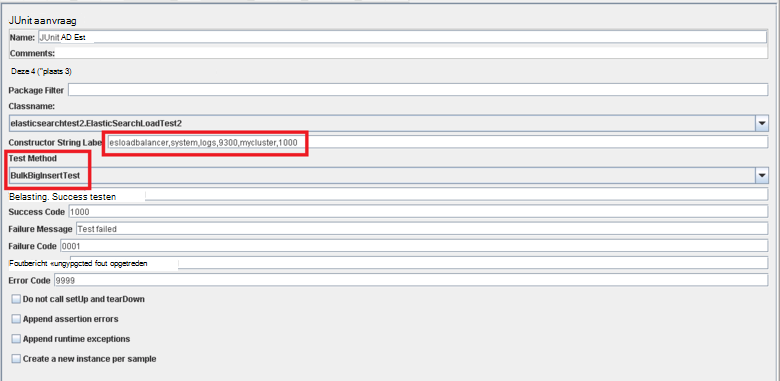

De methoden *BulkInsertTest* en *BigBulkInsertTest* uitvoeren de werkelijke hoeveelheid werk van genereren en de gegevens worden geüpload. Beide methoden zijn vergelijkbaar. Ze verbinding maken met de cluster Elasticsearch en maak een reeks documenten (zoals bepaald door de parameter *ItemsPerInsert* constructor string). De documenten worden toegevoegd aan de index de Elasticsearch bulksgewijs-API gebruiken. Het verschil tussen de twee methoden is dat de velden van de tekenreeks *data1* en *data2* in elk document uit de upload in de methode *BulkInsertTest* zijn weggelaten, maar worden gevuld met 12000 tekenreeksen in de methode *BigBulkInsertTest* . Houd er rekening mee dat u die van de volgende manieren om uit te voeren met het vak *Testmethode* op de pagina JUnit verzoek in JMeter selecteert (gemarkeerd in de vorige afbeelding).

> [AZURE.NOTE] Het voorbeeld hier gepresenteerd wordt gebruikt de Elasticsearch 1.7.3 Transport Client-bibliotheek. Als u Elasticsearch 2.0.0 gebruikt of hoger gebruikt, u de juiste bibliotheek voor de versie die is geselecteerd gebruiken moet. Zie voor meer informatie over de Elasticsearch 2.0.0 Transport Client-bibliotheek, de [Transport Client](https://www.elastic.co/guide/en/elasticsearch/client/java-api/2.0/transport-client.html) -pagina op de website van Elasticsearch.

[Flexibiliteit en herstel configureren op Elasticsearch op Azure]: guidance-elasticsearch-configuring-resilience-and-recovery.md
[Maken van een prestaties omgeving voor Elasticsearch op Azure testen]: guidance-elasticsearch-creating-performance-testing-environment.md
[De geautomatiseerde Elasticsearch prestatietests uitvoeren]: guidance-elasticsearch-running-automated-performance-tests.md
[Een pipet JMeter JUnit implementeren voor het testen van Elasticsearch prestaties]: guidance-elasticsearch-deploying-jmeter-junit-sampler.md
