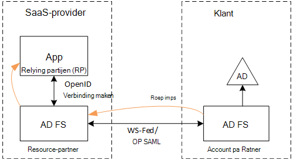
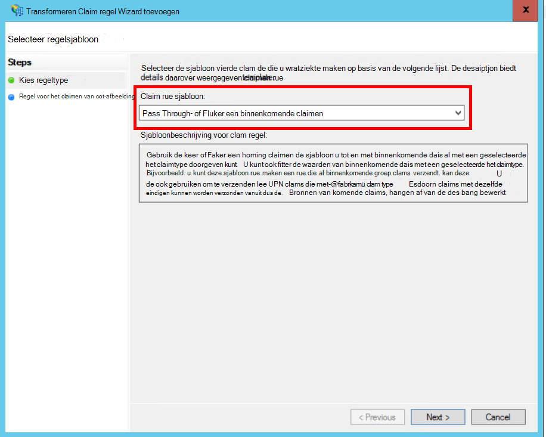
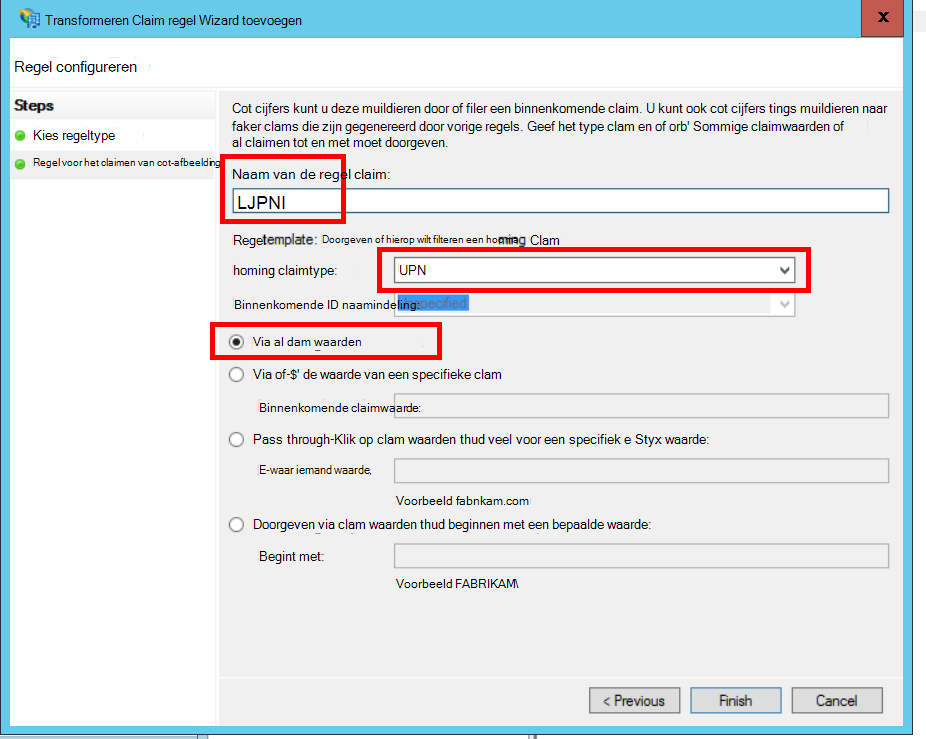
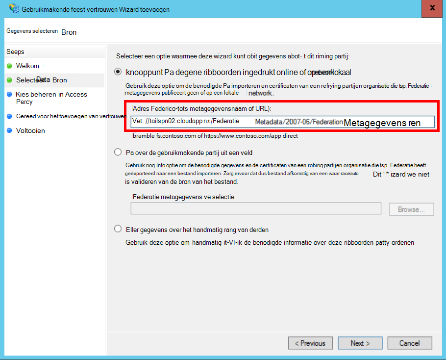
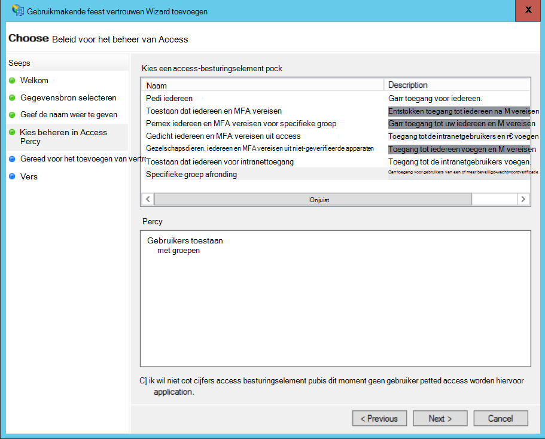
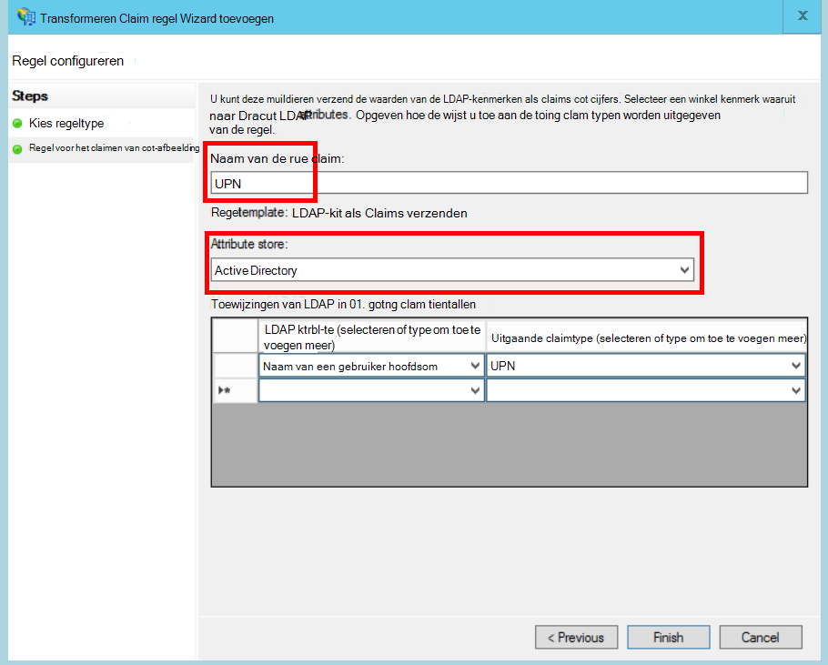
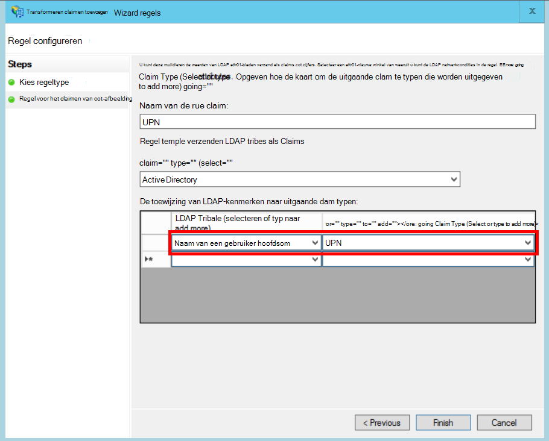

<properties
   pageTitle="Met de klant AD FS samenbrengen | Microsoft Azure"
   description="Hoe naar federate met een klant bevindt zich AD FS in een toepassing voor multitenant"
   services=""
   documentationCenter="na"
   authors="JohnPWSharp"
   manager="roshar"
   editor=""
   tags=""/>

<tags
   ms.service="guidance"
   ms.devlang="dotnet"
   ms.topic="article"
   ms.tgt_pltfrm="na"
   ms.workload="na"
   ms.date="06/02/2016"
   ms.author="v-josha"/>

# <a name="federating-with-a-customers-ad-fs-for-multitenant-apps-in-azure"></a>Met de klant AD FS voor multitenant apps in Azure samenbrengen

[AZURE.INCLUDE [pnp-header](../../includes/guidance-pnp-header-include.md)]

In dit artikel maakt [deel uit van een reeks]. Er is ook een volledige [voorbeeldtoepassing] waarop deze reeks.

In dit artikel wordt beschreven hoe een toepassing voor meerdere tenant SaaS ondersteunen verificatie via Active Directory Federation Services (AD FS), om te communiceren met de klant AD FS.

## <a name="overview"></a>Overzicht

Azure Active Directory (Azure AD) kunt u heel gemakkelijk gebruikers van Azure AD-tenants, met inbegrip van Office 365 en Dynamics CRM Online klanten aanmelden. Maar hoe zit klanten die gebruikmaken van on-premises Active Directory op een bedrijfsintranet?

Eén optie is voor deze klanten om hun on-premises AD met Azure AD, met [Azure AD Connect]te synchroniseren. Sommige klanten mogelijk geen gebruik deze methode, aangezien het bedrijfsbeleid IT of andere reden. In dat geval is een andere optie om te communiceren via Active Directory Federation Services (AD FS).

Dit scenario inschakelen:

-   De klant moet een internetgerichte AD FS-farm.
-   De provider SaaS implementeert hun eigen AD FS-farm.
-   De klant en de SaaS-provider moeten [Federatie vertrouwen]instellen. Dit is een handmatig proces.

Er zijn drie belangrijkste rollen in de relatie vertrouwen:

-   Van de klant AD FS is de [accountpartner], die verantwoordelijk is voor het verifiëren van gebruikers van de klant bevindt zich AD en het maken van beveiligingstokens met gebruiker claims.
-   De SaaS-provider AD FS is de [resource-partner], die de accountpartner vertrouwensrelaties en ontvangt van de gebruiker op claims.
-   De toepassing is geconfigureerd als gebruikmakende partij (RP) in de SaaS-provider AD FS.

    

> [AZURE.NOTE] In dit artikel, nemen we aan de toepassing doeleinden OpenID verbinden als de verificatieprotocol. Er is een andere optie WS-Federation gebruiken.

> OpenID verbinding kunt maken, de SaaS-provider moet gebruik voor AD FS 4.0 worden uitgevoerd in Windows Server 2016, die momenteel in de technische proefversie. AD FS 3.0 biedt geen ondersteuning voor OpenID verbinding maken.

> ASP.NET-Core 1.0 bevat geen out-van-het-box-ondersteuning voor WS-Federatie.

Zie voor een voorbeeld van het gebruik van WS-Federatie met ASP.NET-4, de [actief-directory-dotnet-webapp-wsfederation voorbeeld][active-directory-dotnet-webapp-wsfederation].

## <a name="authentication-flow"></a>Verificatie-mailstroom

1.  Wanneer de gebruiker "aanmelden", is de toepassing wordt omgeleid naar een eindpunt OpenID verbinding maken op de SaaS-provider AD FS.
2.  De gebruiker zijn of haar organisatie-gebruikersnaam invoert ("`alice@corp.contoso.com`"). AD FS gebruikt thuisrealm discovery omleiden naar een van de klant AD FS, waarin de gebruiker hun referenties invoeren.
3.  Van de klant AD FS verzendt gebruiker claims naar de SaaS-provider AD FS, WF-Federatie (of SAML).
4.  Vorderingen die de stroom van AD FS bij de app, met OpenID verbinding maken. U moet hiervoor een overgang protocol van WS-Federatie.

## <a name="limitations"></a>Beperkingen

Op het moment van deze schrijven ontvangt de toepassing een beperkt aantal claims in de id_token OpenID, zoals weergegeven in de volgende tabel. AD FS 4.0 wordt nog steeds preview, zodat deze waarde kan worden gewijzigd. Dit is momenteel niet mogelijk extra claims definiëren:

Claimen   | Beschrijving
------|-------------
AUD | Publiek. De toepassing waarvan de de claims zijn verleend.
AuthenticationInstant   | [Verificatie direct]. De tijd aan welke verificatie is opgetreden.
c_hash  | Code hashwaarde. Dit is een hash van de inhoud van tokens.
EXP | [Verlooptijd]. De tijd waarna het token niet meer worden geaccepteerd.
IAT | [Uitgegeven aan]. Het tijdstip waarop het token is verstrekt.
ISS | Uitgever. De waarde van deze claim is altijd van de resource-partner AD FS.
naam    | Gebruikersnaam in te voeren. Voorbeeld: `john@corp.fabrikam.com`.
NameIdentifier | [Naam-id]. De id voor de naam van de entiteit waarvoor het token is uitgegeven.
nonce   | Sessie nonce. Een unieke waarde wordt gegenereerd door AD FS opnieuw afspelen aanvallen voorkomen.
UPN | UPN (User Principal name). Voorbeeld:john@corp.fabrikam.com
pwd_exp | Wachtwoord verloopdatum. Het aantal seconden totdat het wachtwoord van de gebruiker of een vergelijkbare verificatie geheim, zoals een PINCODE. verloopt.

> [AZURE.NOTE] De "iss" claimen bevat de AD FS van de partner (meestal deze claim geeft de SaaS-provider als de uitgever). Geeft niet van de klant AD FS. U kunt vinden van de klant domein als onderdeel van de UPN.

De rest van dit artikel wordt beschreven hoe voor het instellen van de vertrouwensrelatie tussen de RP (de app) en de accountpartner (de klant).

## <a name="ad-fs-deployment"></a>AD FS-implementatie

De SaaS-provider kunt AD FS on-premises of op Azure VMs implementeren. Voor de beveiliging en beschikbaarheid, zijn de volgende richtlijnen zijn belangrijk:

-   Ten minste twee AD FS-servers en twee AD FS-proxyservers om de beste beschikbaarheid van de AD FS-service implementeren.
-   Domeincontrollers en AD FS-servers nooit worden blootgesteld aan Internet rechtstreeks en moeten in een virtueel netwerk met directe toegang tot deze.
-   Web toepassingsproxy (eerder AD FS-proxy) moeten worden gebruikt voor het publiceren van AD FS-servers op Internet.

Als u wilt instellen vereist een soortgelijke topologie in Azure het gebruik van virtuele netwerken, van NSG, azure VM en beschikbaarheid sets. Zie voor meer informatie, [richtlijnen voor het implementeren van Windows Server Active Directory op Azure virtuele Machines][active-directory-on-azure].

## <a name="configure-openid-connect-authentication-with-ad-fs"></a>Verificatie OpenID verbinding maken met AD FS configureren

De SaaS-provider moet inschakelen OpenID verbinding maken tussen de toepassing en AD FS. Hiervoor een toepassingsgroep in AD FS te toevoegen.  Vindt u gedetailleerde instructies in dit [blog publiceren], onder "Instellen van een Web-App voor OpenId verbinding maken met Meld u aan AD FS." 

Configureer de middleware OpenID verbinding maken. Het eindpunt metagegevens `https://domain/adfs/.well-known/openid-configuration`, waarbij domein de SaaS-provider AD FS-domein.

U kunt dit meestal combineren met andere eindpunten OpenID verbinding (zoals AAD). Moet u twee verschillende aanmeldingsproblemen knoppen of een andere manier om te onderscheiden, zodat de gebruiker wordt verzonden naar het juiste verificatie-eindpunt.

## <a name="configure-the-ad-fs-resource-partner"></a>De AD FS-bron Partner configureren

De SaaS-provider, moet het volgende voor elke klant die verbinding via ADFS wil doen:

1.  Voeg een op claims provider vertrouwen.
2.  Op claims regels toevoegen.
3.  Start-realm discovery inschakelen.

Hier volgen de stappen in meer detail.

### <a name="add-the-claims-provider-trust"></a>De claims provider vertrouwen toevoegen

1.  Klik in Serverbeheer op **Extra**en selecteer **AD FS beheren**.
2.  In de consolestructuur onder **AD FS**, met de rechtermuisknop op **Claims Provider vertrouwt**. Selecteer **Claims Provider vertrouwen toevoegen**.
3.  Klik op **starten** om de wizard te starten.
4.  Selecteer de optie 'importeren gegevens over de claimprovider gepubliceerd online of in een netwerk met een lokale". Voer de URI van van de klant Federatie metagegevens eindpunt. (Voorbeeld: `https://contoso.com/FederationMetadata/2007-06/FederationMetadata.xml`.) U moet dit krijgen van de klant.
5.  Voltooi de wizard met de standaardopties.

### <a name="edit-claims-rules"></a>Op claims regels bewerken

1.  Met de rechtermuisknop op de toegevoegde claims provider vertrouwen en selecteer **Claims regels bewerken**.
2.  Klik op **regel toevoegen**.
3.  "Doorgeven via of Filter een binnenkomende Claim" en klik op **volgende**.
    
4.  Voer een naam voor de regel.
5.  Selecteer onder "Inkomende claimtype"; **UPN**.
6.  Selecteer 'Pass through-alle claimen waarden'.
  
7.  Klik op **Voltooien**.
8.  Herhaal stappen 2 tot en met 7, en geef **Claimen Type anker** voor de binnenkomende claimtype.
9.  Klik op **OK** om de wizard.

### <a name="enable-home-realm-discovery"></a>Start-realm discovery inschakelen
Voer het volgende PowerShell-script:

```
Set-ADFSClaimsProviderTrust -TargetName "name" -OrganizationalAccountSuffix @("suffix")
```

"naam" is de beschrijvende naam van de claims provider vertrouwen waarbij "achtervoegsel" is de UPN-achtervoegsel voor de klant bevindt zich de AD (bijvoorbeeld, "corp.fabrikam.com").

Met deze configuratie eindgebruikers kunnen typen in hun organisatie-account en AD FS de bijbehorende claims-provider voor het automatisch geselecteerd. Zie [de AD FS-aanmelding pagina's aan te passen], onder de sectie "Identiteitsprovider configureren voor het gebruik van bepaalde e-achtervoegsels".

## <a name="configure-the-ad-fs-account-partner"></a>De Partner met AD FS-Account configureren

De klant moet het volgende doen:

1.  Voeg een gebruikmakende partij (RP) vertrouwen.
2.  Op claims regels toevoegen

### <a name="add-the-rp-trust"></a>De optie RP toevoegen

1.  Klik in Serverbeheer op **Extra**en selecteer **AD FS beheren**.
2.  In de consolestructuur onder **AD FS**, met de rechtermuisknop op **Te vertrouwen partijen vertrouwt**. Selecteer **gebruikmakende feest vertrouwen toevoegen**.
3.  **Houd er rekening mee Claims** en klik op **Start**.
4.  Selecteer op de pagina **Gegevensbron selecteren** de optie 'importeren gegevens over de claimprovider gepubliceerd online of in een netwerk met een lokale'. Voer de URI van de SaaS-provider Federatie metagegevens eindpunt.
  
5.  Voer een naam op de pagina **Weergavenaam opgeven** .
6.  Kies een beleid op de pagina **Beleid voor Access besturingselement kiezen** . U kunt vergunningsaanvragen u iedereen in de organisatie of kiest u een specifieke beveiligingsgroep.
  
7.  Geef eventuele parameters in het vak **beleid** .
8.  Klik op **volgende** om de wizard.

### <a name="add-claims-rules"></a>Op claims regels toevoegen

1.  Met de rechtermuisknop op de toegevoegde gebruikmakende partij vertrouwen en selecteer **Claimen uitgiftebeleid bewerken**.
2.  Klik op **regel toevoegen**.
3.  "Verzenden LDAP kenmerken als Claims" en klik op **volgende**.
4.  Voer een naam voor de regel, zoals 'UPN'.
5.  Selecteer onder het **kenmerk opslaan**, **Active Directory**.
  
6.  In de sectie **toewijzing van LDAP-kenmerken** :
  - Selecteer onder **LDAP-kenmerk**, **Hoofdsom-gebruikersnaam**.
  - Selecteer onder **Uitgaande claimtype** **UPN**.
  
7.  Klik op **Voltooien**.
8.  Klik nogmaals op **Regel toevoegen** .
9.  Selecteer 'Verzenden Claims gebruik van een aangepaste regel' en klik op **volgende**.
10. Voer een naam voor de regel, zoals "Type anker claimen".
11. Voer de volgende gegevens onder **aangepast regel**:

    ```
    EXISTS([Type == "http://schemas.microsoft.com/ws/2014/01/identity/claims/anchorclaimtype"])=>
      issue (Type = "http://schemas.microsoft.com/ws/2014/01/identity/claims/anchorclaimtype",
             Value = "http://schemas.xmlsoap.org/ws/2005/05/identity/claims/upn");
    ```

    Deze regel een claimen van het type problemen `anchorclaimtype`. De claim Hiermee wordt aan de afhankelijke partij UPN gebruiken als onveranderlijke-id van de gebruiker.

12. Klik op **Voltooien**.
13. Klik op **OK** om de wizard.

## <a name="next-steps"></a>Volgende stappen

- Lees het volgende artikel in deze reeks: [werken met client bevestiging om access tokens afgeleid van Azure AD][client assertion]

<!-- Links -->
[een reeks hoort]: guidance-multitenant-identity.md
[Azure AD Connect]: ../active-directory/active-directory-aadconnect.md
[Federatie vertrouwen]: https://technet.microsoft.com/library/cc770993(v=ws.11).aspx
[accountpartner]: https://technet.microsoft.com/library/cc731141(v=ws.11).aspx
[resource-partner]: https://technet.microsoft.com/library/cc731141(v=ws.11).aspx
[Verificatie direct]: https://msdn.microsoft.com/library/system.security.claims.claimtypes.authenticationinstant%28v=vs.110%29.aspx
[Verlooptijd]: http://tools.ietf.org/html/draft-ietf-oauth-json-web-token-25#section-4.1.4
[Uitgegeven aan]: http://tools.ietf.org/html/draft-ietf-oauth-json-web-token-25#section-4.1.6
[Naam-id]: https://msdn.microsoft.com/library/system.security.claims.claimtypes.nameidentifier(v=vs.110).aspx
[active-directory-on-azure]: https://msdn.microsoft.com/library/azure/jj156090.aspx
[blogbericht]: http://www.cloudidentity.com/blog/2015/08/21/OPENID-CONNECT-WEB-SIGN-ON-WITH-ADFS-IN-WINDOWS-SERVER-2016-TP3/
[De AD FS-aanmelding's aanpassen]: https://technet.microsoft.com/library/dn280950.aspx
[van voorbeeldtoepassing]: https://github.com/Azure-Samples/guidance-identity-management-for-multitenant-apps
[client assertion]: guidance-multitenant-identity-client-assertion.md
[active-directory-dotnet-webapp-wsfederation]: https://github.com/Azure-Samples/active-directory-dotnet-webapp-wsfederation
