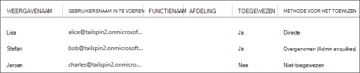

<properties
   pageTitle="Toepassingsrollen | Microsoft Azure"
   description="Verificatie met toepassingsrollen uitvoeren"
   services=""
   documentationCenter="na"
   authors="MikeWasson"
   manager="roshar"
   editor=""
   tags=""/>

<tags
   ms.service="guidance"
   ms.devlang="dotnet"
   ms.topic="article"
   ms.tgt_pltfrm="na"
   ms.workload="na"
   ms.date="02/16/2016"
   ms.author="mwasson"/>

#  <a name="application-roles-in-multitenant-applications"></a>Rollen van de toepassing in multitenant toepassingen

[AZURE.INCLUDE [pnp-header](../../includes/guidance-pnp-header-include.md)]

In dit artikel maakt [deel uit van een reeks]. Er is ook een volledige [voorbeeldtoepassing] waarop deze reeks.

Toepassingsrollen worden gebruikt om machtigingen toewijzen aan gebruikers. Bijvoorbeeld de [De enquêtes] [ Tailspin] toepassing definieert de volgende rollen:

- Beheerder. Alle CRUD-bewerkingen in een enquête maken die bij die tenant hoort kunnen worden uitvoeren.
- Maker. Maak nieuwe enquêtes.
- Reader. Een enquêtes die deel uitmaken van die tenant kunnen worden gelezen.

U kunt zien dat rollen uiteindelijk krijgen vertaald machtigingen tijdens [autorisatie]. Maar de eerste vraag is het toewijzen en rollen beheren. We geïdentificeerd drie belangrijkste opties:

-   [Rollen van Azure AD-App](#roles-using-azure-ad-app-roles)
-   [Azure AD-beveiligingsgroepen](#roles-using-azure-ad-security-groups)
-   [Rol Toepassingsbeheer](#roles-using-an-application-role-manager).

## <a name="roles-using-azure-ad-app-roles"></a>Rollen met Azure AD App rollen

Dit is de methode die wordt gebruikt in de app de enquêtes.

In deze benadering definieert de SaaS-provider de rollen van de toepassing toevoegen aan manifest van de toepassing. Nadat een klant zich registreert, wijst gebruikers toe aan de rollen van een beheerder voor AD-directory van de klant. Wanneer een gebruiker zich aanmeldt, wordt de rollen van de gebruiker worden verzonden als claims.

> [AZURE.NOTE] Als de klant Azure AD Premium heeft, de beheerder van een beveiligingsgroep kunt toewijzen aan een rol en leden van de groep wordt de rol van de app overnemen. Dit is een handige manier voor het beheren van rollen, omdat de Groepseigenaar van de niet moet zijn van een AD-beheerder.

Voordelen van deze methode:

-   Eenvoudige programming model.
-   Rollen zijn specifiek voor de toepassing. De rol vorderingen die voortvloeien uit één toepassing worden niet verzonden naar een andere toepassing.
-   Als de klant verwijdert u de toepassing van hun AD-tenant, gaat u de rollen afwezig.
-   De toepassing nodig niet eventuele extra Active Directory-machtigingen, dan het lezen van het gebruikersprofiel.

Nadelen:

- Klanten zonder Azure AD Premium toewijzen geen beveiligingsgroepen aan rollen. Voor deze klanten, moeten alle gebruikerstoewijzingen worden uitgevoerd door een AD-beheerder.
- Als er een back-end-web API, dat wil los van de web-app zeggen, toepassen niet op het web API roltoewijzingen voor de web-app. Zie [een backend beveiligen web API]voor meer discussie van dit punt.

### <a name="implementation"></a>Implementatie

**De rollen definiëren.** De provider SaaS gedeclareerd de rollen van de app in de [manifest van de toepassing]. Hier is bijvoorbeeld de manifest-vermelding voor de app enquêtes:

```
"appRoles": [
  {
    "allowedMemberTypes": [
      "User"
    ],
    "description": "Creators can create Surveys",
    "displayName": "SurveyCreator",
    "id": "1b4f816e-5eaf-48b9-8613-7923830595ad",
    "isEnabled": true,
    "value": "SurveyCreator"
  },
  {
    "allowedMemberTypes": [
      "User"
    ],
    "description": "Administrators can manage the Surveys in their tenant",
    "displayName": "SurveyAdmin",
    "id": "c20e145e-5459-4a6c-a074-b942bbd4cfe1",
    "isEnabled": true,
    "value": "SurveyAdmin"
  }
],
```

De `value` eigenschap wordt weergegeven in de claim rol. De `id` eigenschap is de unieke id voor de gedefinieerde rol. Genereert altijd een nieuwe GUID-waarde voor `id`.

**Toewijzen aan gebruikers**. Wanneer een nieuwe klant bent zich registreert, wordt de toepassing is geregistreerd in AD-tenant van de klant. Op dit moment kan een AD-beheerder voor die tenant toewijzen aan gebruikers aan rollen.

> [AZURE.NOTE] Zoals hierboven is, kunnen klanten met Azure AD Premium beveiligingsgroepen ook toewijzen aan rollen.

De volgende schermafbeelding van de Azure portal drie gebruikers wordt getoond. Lisa is rechtstreeks aan een rol toegewezen. Stefan overgenomen een rol als lid van een beveiligingsgroep met de naam 'Enquêtes beheerder', die aan een rol is toegewezen. Jeroen is niet toegewezen aan een rol.



> [AZURE.NOTE] U kunt ook kunt de toepassing rollen toewijzen via programmacode, de Azure AD Graph-API gebruiken.  Dit vereist echter de toepassing verkrijgen schrijfmachtigingen voor AD-map van de klant. Een toepassing met die machtigingen kan een groot aantal verkleinen doen &mdash; de klant is de app niet als u wilt fouten maken hun directory vertrouwen. Veel klanten mogelijk niet eens dit toegangsniveau verlenen.

**Rol claims ophalen**. Wanneer een gebruiker zich aanmeldt, de toepassing van de gebruiker toegewezen rollen ontvangt in een claim met type `http://schemas.microsoft.com/ws/2008/06/identity/claims/role`.  

Een gebruiker kan meerdere rollen of geen rol hebben. In autorisatiecode, niet wordt ervan uitgegaan dat de gebruiker heeft precies één rol claimen. Programmacode die Hiermee wordt gecontroleerd of de waarde van een bepaalde claim aanwezig is in plaats daarvan schrijven:

```csharp
if (context.User.HasClaim(ClaimTypes.Role, "Admin")) { ... }
```

## <a name="roles-using-azure-ad-security-groups"></a>Rollen met Azure AD-beveiligingsgroepen

In deze benadering worden rollen weergegeven als AD-beveiligingsgroepen. De toepassing van de machtiging voor gebruikers op basis van hun beveiligingsgroepen.

Voordelen:

-   Voor klanten die ik heb geen Azure AD Premium, kunt deze methode de klant beveiligingsgroepen gebruiken voor het beheren van roltoewijzingen.

Nadelen:

- Complexiteit. Omdat elke tenant andere groepclaims stuurt, de app moet van bijhouden die beveiligingsgroepen met de rollen van welke toepassing voor elke tenant overeenkomen.
- Als de klant verwijdert u de toepassing van hun AD-tenant, worden de beveiligingsgroepen links in hun AD-adreslijst.

### <a name="implementation"></a>Implementatie

Stel in het manifest van de toepassing, de `groupMembershipClaims` eigenschap "SecurityGroup". Dit is nodig om toegang te krijgen van de groepslidmaatschap claims van AAD.

```
{
   // ...
   "groupMembershipClaims": "SecurityGroup",
}
```

Wanneer een nieuwe klant bent zich registreert, de toepassing Hiermee geeft u de klant beveiligingsgroepen voor de rollen die nodig zijn voor de toepassing te maken. De klant moet invoeren van het groepsobject id's in de toepassing. De toepassing worden opgeslagen in een tabel die groep-id's wordt toegewezen aan rollen van toepassing, per pachter.

> [AZURE.NOTE] U kunt ook de toepassing kan de groepen maken via een programma, de Azure AD Graph-API gebruiken.  Dit zou minder vatbaar fout. Dit vereist echter de toepassing verkrijgen 'lezen en schrijven van alle groepen' machtigingen voor AD-map van de klant. Veel klanten mogelijk niet eens dit toegangsniveau verlenen.

Wanneer een gebruiker zich aanmeldt:

1.  De toepassing ontvangt van de gebruiker groepen als claims. De waarde van elke claim is de object-ID van een groep.
2.  Azure AD beperkt het aantal groepen in het token verzonden. Als het aantal groepen deze limiet overschrijdt, stuurt Azure AD een speciale "gebruikskosten" claimen. Als deze claim aanwezig is, moet de toepassing de API Azure AD-grafiek als u alle groepen waartoe die gebruiker behoort query. Zie voor meer informatie, [autorisatie in Cloud-toepassingen met AD groepen], onder de sectie "Groepen claimen overdosering".
3.  De toepassing Hiermee zoekt u de object-id's in een eigen database, worden de bijbehorende toepassingsrollen toewijzen aan de gebruiker zoeken.
4.  De toepassing wordt de waarde van een aangepaste claim toegevoegd aan de gebruiker principal waarmee de toepassingsrol. Bijvoorbeeld: `survey_role` = "SurveyAdmin".

Autorisatiebeleid moeten de claim aangepaste rol gebruiken, niet naar de groep claimen.

## <a name="roles-using-an-application-role-manager"></a>Rollen met een rol Toepassingsbeheer

Met deze benadering worden toepassingsrollen niet opgeslagen in Azure AD helemaal. In plaats daarvan de roltoewijzingen voor elke gebruiker in de toepassing worden opgeslagen in een eigen DB &mdash; bijvoorbeeld, met behulp van de klas **RoleManager** ASP.NET-id.

Voordelen:

-   De app heeft volledige controle over de functies en de gebruikerstoewijzingen.

Nadelen:

- Meer complexe, moeilijker te onderhouden.
- Niet AD-beveiligingsgroepen gebruiken voor het beheren van roltoewijzingen.
- Er worden gebruikersgegevens opgeslagen in de databasetoepassing, waar deze niet gesynchroniseerd met de tenant van AD directory, worden kan zoals gebruikers worden toegevoegd of verwijderd.   

Zijn er veel bestaande voorbeelden voor deze methode. Zie bijvoorbeeld [een ASP.NET-MVC-app met auth en SQL DB maken en implementeren naar Azure App-Service].

## <a name="next-steps"></a>Volgende stappen

- Lees het volgende artikel in deze reeks: [op basis van rollen en op basis van een resource autorisatie in multitenant toepassingen][autorisatie]

<!-- Links -->
[Tailspin]: guidance-multitenant-identity-tailspin.md
[een reeks hoort]: guidance-multitenant-identity.md
[autorisatie]: guidance-multitenant-identity-authorize.md
[Een back-end-web API beveiligen]: guidance-multitenant-identity-web-api.md
[Een ASP.NET-MVC-app met auth en SQL DB maken en implementeren naar Azure App-Service]: ../app-service-web/web-sites-dotnet-deploy-aspnet-mvc-app-membership-oauth-sql-database.md
[toepassingsmanifest]: ../active-directory/active-directory-application-manifest.md
[van voorbeeldtoepassing]: https://github.com/Azure-Samples/guidance-identity-management-for-multitenant-apps
