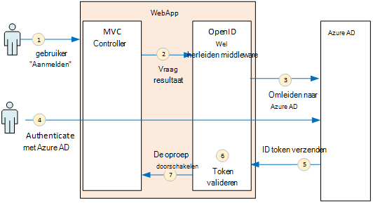
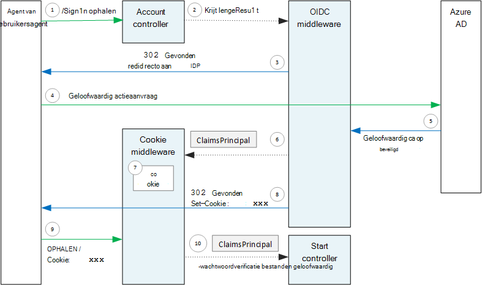

<properties
   pageTitle="Verificatie in multitenant toepassingen | Microsoft Azure"
   description="Hoe een toepassing voor de multitenant gebruikers van Azure AD kan verifiëren"
   services=""
   documentationCenter="na"
   authors="MikeWasson"
   manager="roshar"
   editor=""
   tags=""/>

<tags
   ms.service="guidance"
   ms.devlang="dotnet"
   ms.topic="article"
   ms.tgt_pltfrm="na"
   ms.workload="na"
   ms.date="05/23/2016"
   ms.author="mwasson"/>

# <a name="authentication-in-multitenant-apps-using-azure-ad-and-openid-connect"></a>Verificatie in multitenant apps, met behulp van Azure AD en verbindt u OpenID

[AZURE.INCLUDE [pnp-header](../../includes/guidance-pnp-header-include.md)]

In dit artikel maakt [deel uit van een reeks](guidance-multitenant-identity.md). Er is ook een volledige [voorbeeldtoepassing] waarop deze reeks.

In dit artikel wordt beschreven hoe een toepassing voor de multitenant gebruikers van Azure Active Directory (Azure AD), OpenID verbinding (OIDC) gebruiken om te verifiëren kan verifiëren.

## <a name="overview"></a>Overzicht

Onze [verwijzing-implementatie](guidance-multitenant-identity-tailspin.md) is een ASP.NET Core 1.0-toepassing. De toepassing gebruikt de ingebouwde OpenID verbinding middleware om uit te voeren de stroom van OIDC verificatie. In het volgende diagram ziet u wat er gebeurt wanneer de gebruiker zich aanmeldt, klikt u op hoog niveau.



1.  De gebruiker klikt op de knop 'aanmelden' in de app. Deze actie wordt uitgevoerd door een controller MVC.
2.  De controller MVC geeft als resultaat een actie **ChallengeResult** .
3.  De middleware onderschept de **ChallengeResult** en maakt een 302 antwoord dat wordt de gebruiker omgeleid naar de aanmeldingspagina van Azure AD.
4.  De gebruiker geverifieerd met Azure AD.
5.  Azure AD stuurt een token ID naar de toepassing.
6.  De middleware is gevalideerd met het ID-token. Op dit moment dat de gebruiker nu wordt geverifieerd binnen de toepassing.
7.  De middleware wordt de gebruiker terug naar de toepassing.

## <a name="register-the-app-with-azure-ad"></a>De app met Azure AD registreren

Als u wilt inschakelen OpenID verbinden, registreert de SaaS-provider de toepassing binnen hun eigen Azure AD-tenant.

Als u wilt de toepassing hebt geregistreerd, volg de stappen in [De toepassingen integreren met Azure Active Directory](../active-directory/active-directory-integrating-applications.md), in de sectie [een toepassing toe te voegen](../active-directory/active-directory-integrating-applications.md#adding-an-application).

Op de pagina **configureren** :

-   Houd rekening met de klant-ID.
-   Selecteer **Ja**onder **toepassing meerdere Tenant is**.
-   **De URL van het antwoord** instellen op een URL waar Azure AD stuurt de verificatiereactie. U kunt de basis-URL van uw app kunt gebruiken.
  - Opmerking: De URL-pad kunt alles zijn, zolang de hostnaam overeenkomt met uw geïmplementeerd-app.
  - U kunt meerdere antwoord-URL's instellen. Tijdens de ontwikkeling, kunt u een `localhost` adres voor de app lokaal uitgevoerd.
-   Een geheim client genereren: onder **toetsen**, klik op de vervolgkeuzelijst die wordt gemeld dat **duur selecteren** en kies 1 of 2 jaar. De toets niet zichtbaar wanneer u op **Opslaan**klikt. Zorg ervoor dat de waarde, kopiëren omdat deze niet weer wordt weergegeven wanneer u de configuratiepagina opnieuw laden.

## <a name="configure-the-auth-middleware"></a>De middleware auth configureren

In deze sectie wordt beschreven hoe de middleware verificatie configureren in ASP.NET Core 1.0 voor multitenant verificatie met OpenID verbinding maken.

In uw klas opstarten toevoegen de middleware OpenID verbinding maken:

```csharp
app.UseOpenIdConnectAuthentication(options =>
{
    options.AutomaticAuthenticate = true;
    options.AutomaticChallenge = true;
    options.ClientId = [client ID];
    options.Authority = "https://login.microsoftonline.com/common/";
    options.CallbackPath = [callback path];
    options.PostLogoutRedirectUri = [application URI];
    options.SignInScheme = CookieAuthenticationDefaults.AuthenticationScheme;
    options.TokenValidationParameters = new TokenValidationParameters
    {
        ValidateIssuer = false
    };
    options.Events = [event callbacks];
});
```

> [AZURE.NOTE] Zie [Startup.cs](https://github.com/Azure-Samples/guidance-identity-management-for-multitenant-apps/blob/master/src/Tailspin.Surveys.Web/Startup.cs).

Zie voor meer informatie over de klas opstarten, [Starten van de toepassing](https://docs.asp.net/en/latest/fundamentals/startup.html) in de documentatie ASP.NET Core 1.0.

De volgende middleware-opties instellen:

- **ClientId**. Van de toepassing client-ID, die u hebt ontvangen wanneer u de toepassing geregistreerd in Azure AD.
- **Certificeringsinstantie**. Voor een multitenant-toepassing, stelt u dit op `https://login.microsoftonline.com/common/`. Dit is de URL voor het algemene Azure AD-eindpunt op, zodat gebruikers van een Azure AD-tenant aan te melden. Zie voor meer informatie over het algemene eindpunt, [dit blogbericht](http://www.cloudidentity.com/blog/2014/08/26/the-common-endpoint-walks-like-a-tenant-talks-like-a-tenant-but-is-not-a-tenant/).
- Stel in **TokenValidationParameters**, **ValidateIssuer** ONWAAR. Dat betekent dat de app is verantwoordelijk voor het valideren van de waarde van de uitgever in het ID-token. (De middleware valideert nog steeds het token zelf.) Zie voor meer informatie over het valideren van de uitgever, [uitgever gegevensvalidatie](guidance-multitenant-identity-claims.md#issuer-validation).
- **CallbackPath**. Deze instellen gelijk is aan het pad in de URL van het antwoord dat u in Azure AD. Als de antwoord-URL is bijvoorbeeld `http://contoso.com/aadsignin`, **CallbackPath** moet `aadsignin`. Als u deze optie niet instelt, wordt de standaardwaarde `signin-oidc`.
- **PostLogoutRedirectUri**. Geef een URL om te leiden gebruikers na het afmelden. Dit moet een pagina waarmee anonieme aanvragen &mdash; meestal de startpagina.
- **SignInScheme**. Deze worden ingesteld `CookieAuthenticationDefaults.AuthenticationScheme`. Deze instelling betekent dat nadat de gebruiker is geverifieerd, de gebruiker op claims lokaal in een cookie opgeslagen worden. Deze cookie is hoe de gebruiker is aangemeld blijft tijdens de browsersessie.
- **Gebeurtenissen.** Gebeurtenis terugbellen; Zie [verificatiegebeurtenissen](#authentication-events).

Ook toevoegen de middleware Cookie-verificatie voor de verkooppijplijn. Deze middleware is verantwoordelijk voor het schrijven van de gebruiker claims naar een cookie en vervolgens de cookie tijdens het laden van volgende pagina te lezen.

```csharp
app.UseCookieAuthentication(options =>
{
    options.AutomaticAuthenticate = true;
    options.AutomaticChallenge = true;
    options.AccessDeniedPath = "/Home/Forbidden";
});
```

## <a name="initiate-the-authentication-flow"></a>De stroom verificatie initiëren

U start de stroom verificatie in ASP.NET MVC door een **ChallengeResult** te retourneren van het contoller:

```csharp
[AllowAnonymous]
public IActionResult SignIn()
{
    return new ChallengeResult(
        OpenIdConnectDefaults.AuthenticationScheme,
        new AuthenticationProperties
        {
            IsPersistent = true,
            RedirectUri = Url.Action("SignInCallback", "Account")
        });
}
```

Hierdoor wordt de middleware om terug te keren een 302 (gevonden) antwoord dat wordt omgeleid naar het eindpunt verificatie.

## <a name="user-login-sessions"></a>Sessies login

Zoals vermeld, wanneer de gebruiker zich eerst aanmeldt, schrijft de middleware Cookie-verificatie de claims gebruiker naar een cookie. HTTP-aanvragen worden daarna door het lezen van de cookie geverifieerd.

Standaard de middleware cookie schrijft een [sessiecookie][session-cookie], welke haalt verwijderd wanneer de gebruiker de browser sluit. De volgende keer dat de gebruiker naast de site, bezoekt, hebben ze opnieuw aanmelden. Echter als u **IsPersistent** ingesteld op waar in de **ChallengeResult**, schrijft de middleware een permanente cookie, zodat de gebruiker is aangemeld blijft na de browser te sluiten. U kunt de verlooptijd cookie; configureren Zie [Opties voor Controlling cookie][cookie-options]. Permanente cookies handiger voor de gebruiker zijn, maar mogelijk niet geschikt voor sommige-toepassingen (zeg, een toepassing voor de Bank) waar u wilt dat de gebruiker telkens bij het aanmelden.

## <a name="about-the-openid-connect-middleware"></a>Informatie over het middleware OpenID verbinding maken

De middleware OpenID verbinding in ASP.NET verbergen grootste deel van de gegevens van het protocol. Deze sectie bevat informatie over de implementatie, die handig zijn mogelijk voor informatie over de stroom protocol.

Eerst we bekijken de stroom verificatie in ASP.NET (de details van de stroom van het protocol OIDC tussen de app en Azure AD worden genegeerd). In het volgende diagram ziet u het proces.



In dit diagram, zijn er twee MVC controllers. De controller Account verwerkt aanmeldingsaanvragen en de controller start voor de startpagina van Lotus is bedoeld.

Dit is het verificatieproces:

1. De gebruiker klikt op de knop 'Aanmelden' en de browser een GET-aanvraag verzendt. Bijvoorbeeld: `GET /Account/SignIn/`.
2. Geeft als resultaat van de controller account een `ChallengeResult`.
3. De OIDC middleware geeft als resultaat een HTTP 302 respons omleiden naar Azure AD.
4. De browser wordt de verificatieaanvraag verzonden naar Azure AD
5. De gebruiker zich aanmeldt bij Azure AD en Azure AD stuurt een verificatiereactie terug.
6. De middleware OIDC Hiermee maakt u een op claims principal en wordt doorgegeven aan de middleware Cookie-verificatie.
7. De middleware cookie serialiseert de hoofdsom claims en een cookie instellen.
8. De middleware OIDC wordt omgeleid naar de terugbellen-URL van de toepassing.
10. De browser volgt de omleiding, de cookie in de uitnodiging te verzenden.
11. De middleware cookie deserializes de cookie een op claims principal en sets `HttpContext.User` gelijk is aan de hoofdsom van claims. Het verzoek wordt doorgestuurd naar een controller MVC.

### <a name="authentication-ticket"></a>Verificatie tickets

Als de verificatie is geslaagd, maakt het middleware OIDC een tickets verificatie, waarin de hoofdsom van een op claims die in het bezit van de gebruiker op claims. U kunt de tickets binnen de gebeurtenis **AuthenticationValidated** of **TicketReceived** openen.

> [AZURE.NOTE] Totdat de stroom hele verificatie is voltooid, `HttpContext.User` nog steeds bevat een anonieme principal, _niet_ de geverifieerde gebruiker. De anonieme hoofdsom heeft een lege claims-siteverzameling. Nadat de verificatie is voltooid en de app-omleidingen, de middleware cookie deserializes de verificatiecookie en sets `HttpContext.User` aan een op claims principal die de geverifieerde gebruiker vertegenwoordigt.

### <a name="authentication-events"></a>Verificatiegebeurtenissen

Tijdens de verificatie verheft de middleware OpenID verbinding maken met een reeks gebeurtenissen:

- **RedirectToAuthenticationEndpoint**. Genoemd rechts voordat de middleware wordt omgeleid naar het eindpunt verificatie. U kunt deze gebeurtenis gebruiken voor het wijzigen van de URL redirect; Als u bijvoorbeeld verzoek parameters toevoegen. Zie [de beheerder toestemming vraag toevoegen](guidance-multitenant-identity-signup.md#adding-the-admin-consent-prompt) voor een voorbeeld.

- **AuthorizationResponseReceived**. Nadat de middleware de verificatiereactie van de identiteitsprovider (IDP) krijgt, maar voordat de middleware is gevalideerd met het antwoord genoemd.  

- **AuthorizationCodeReceived**. Met de autorisatiecode genoemd.

- **TokenResponseReceived**. Nadat de middleware een access token uit de IDP krijgt genoemd. Geldt alleen voor autorisatie code stroom.

- **AuthenticationValidated**. Wanneer de middleware is gevalideerd met het ID-token genoemd. De toepassing heeft nu een reeks gevalideerde claims over de gebruiker. U kunt deze gebeurtenis gebruiken om uit te voeren extra validatie op de vorderingen of om te transformeren van claims. Zie [werken met claims](guidance-multitenant-identity-claims.md).

- **UserInformationReceived**. Als de middleware afkomstig is het gebruikersprofiel van de gebruiker info eindpunt genoemd. Geldt alleen voor autorisatie code stroom en alleen als `GetClaimsFromUserInfoEndpoint = true` in de middleware-opties.

- **TicketReceived**. Genoemd wanneer verificatie is voltooid. Dit is de laatste gebeurtenis, ervan uitgaande dat verificatie is geslaagd. Nadat u deze gebeurtenis plaatsvindt, wordt de gebruiker is aangemeld bij de app.

- **AuthenticationFailed**. Als de verificatie mislukt genoemd. Gebruik deze gebeurtenis worden afgehandeld verificatie-problemen &mdash; door bijvoorbeeld om te leiden naar een foutpagina.

Als u wilt bieden terugbellen voor deze gebeurtenissen, stelt u de optie **gebeurtenissen** op de middleware. Er zijn twee manieren de gebeurtenishandlers declareren: Inline met lambdas of in een klas dat is afgeleid van **OpenIdConnectEvents**.

Inline met lambdas:

```csharp
app.UseOpenIdConnectAuthentication(options =>
{
    // Other options not shown.

    options.Events = new OpenIdConnectEvents
    {
        OnTicketReceived = (context) =>
        {
             // Handle event
             return Task.FromResult(0);
        },
        // other events
    }
});
```

Die voortvloeien uit **OpenIdConnectEvents**:

```csharp
public class SurveyAuthenticationEvents : OpenIdConnectEvents
{
    public override Task TicketReceived(TicketReceivedContext context)
    {
        // Handle event
        return base.TicketReceived(context);
    }
    // other events
}

// In Startup.cs:
app.UseOpenIdConnectAuthentication(options =>
{
    // Other options not shown.

    options.Events = new SurveyAuthenticationEvents();
});
```

De tweede aanpak wordt aanbevolen als uw terugbellen gebeurtenis alle aanzienlijke logica, hebt zodat ze niet onbelangrijke e-mail voor uw klas opstarten. De implementatie van onze verwijzing Gebruik deze methode; Zie [SurveyAuthenticationEvents.cs](https://github.com/Azure-Samples/guidance-identity-management-for-multitenant-apps/blob/master/src/Tailspin.Surveys.Web/Security/SurveyAuthenticationEvents.cs).

### <a name="openid-connect-endpoints"></a>OpenID eindpunten verbinden

Azure AD ondersteunt [OpenID verbinding Discovery](https://openid.net/specs/openid-connect-discovery-1_0.html), waarin de identiteitsprovider (IDP) geeft als een document JSON-metagegevens van een [bekende eindpunt resultaat](https://openid.net/specs/openid-connect-discovery-1_0.html#ProviderConfig). Het metagegevensdocument bevat informatie, zoals:

-   De URL van het eindpunt autorisatie. Dit is waar de app wordt omgeleid om de gebruiker te verifiëren.
-   De URL van het eindpunt "sessie beëindigd", waarbij de app Hiermee gaat u naar de gebruiker afmelden.
-   De URL voor het ophalen van de ondertekend sleutels, die de client gebruikt om de OIDC tokens die deze formule worden opgehaald uit de IDP te valideren.

De middleware OIDC weet al dan niet standaard, hoe kunt u deze metagegevens ophalen. Stel de optie **instantie** in de middleware en de middleware bouwt de URL voor de metagegevens. (U kunt de URL voor metagegevens negeren door in te stellen van de optie **MetadataAddress** .)

### <a name="openid-connect-flows"></a>OpenID verbinding loopt

Standaard wordt met de middleware OIDC hybride stroom gebruikt met formulier bericht antwoord modus.

-   _Hybride stroom_ betekent dat de client kan onmiddellijk een token ID en een autorisatiecode voor de dezelfde interactie aan de autorisatie-server.
-   _Formulier posten antwoord modus_ betekent dat de autorisatie-server gebruikt een HTTP-POST-verzoek voor de ID-code voor token en de machtiging Verzenden naar de app. De waarden zijn formulier-urlencoded (inhoudstype = "toepassing/x-1-800-www-Dell / form-urlencoded").

Wanneer de middleware OIDC wordt omgeleid naar het eindpunt autorisatie, wordt de omleidings-URL omvat alle van de queryreeks-parameters nodig zijn voor OIDC. Voor hybride mailstroom:

-   client_id. Deze waarde is ingesteld in de optie **ClientId**
-   omvang = "openid profiel', wat betekent dat er een aanvraag OIDC en we het gebruikersprofiel.
-   response_type = "code id_token". Hiermee geeft u de hybride stroom.
-   response_mode = "form_post". Hiermee geeft u formulier bericht antwoord.

Als een andere stroom opgeven, stelt u de eigenschap **ResponseType** in de opties. Bijvoorbeeld:

```csharp
app.UseOpenIdConnectAuthentication(options =>
{
    options.ResponseType = "code"; // Authorization code flow

    // Other options
}
```

## <a name="next-steps"></a>Volgende stappen

- Lees het volgende artikel in deze reeks: [werken met op claims gebaseerde identiteiten in multitenant toepassingen][claims]


[claims]: guidance-multitenant-identity-claims.md
[cookie-options]: https://docs.asp.net/en/latest/security/authentication/cookie.html#controlling-cookie-options
[session-cookie]: https://en.wikipedia.org/wiki/HTTP_cookie#Session_cookie
[van voorbeeldtoepassing]: https://github.com/Azure-Samples/guidance-identity-management-for-multitenant-apps
