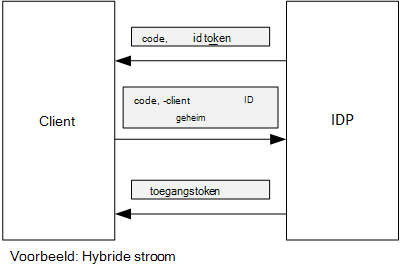

<properties
   pageTitle="Gebruik van de client bevestiging access tokens ophalen van Azure AD | Microsoft Azure"
   description="Het gebruik van de client bevestiging access tokens ophalen van Azure AD."
   services=""
   documentationCenter="na"
   authors="MikeWasson"
   manager="roshar"
   editor=""
   tags=""/>

<tags
   ms.service="guidance"
   ms.devlang="dotnet"
   ms.topic="article"
   ms.tgt_pltfrm="na"
   ms.workload="na"
   ms.date="05/23/2016"
   ms.author="mwasson"/>

# <a name="using-client-assertion-to-get-access-tokens-from-azure-ad"></a>Gebruik van de client bevestiging access tokens ophalen van Azure AD

[AZURE.INCLUDE [pnp-header](../../includes/guidance-pnp-header-include.md)]

In dit artikel maakt [deel uit van een reeks]. Er is ook een volledige [voorbeeldtoepassing] waarop deze reeks.

## <a name="background"></a>Achtergrond

Wanneer u autorisatie code stroom of hybride-mailstroom in OpenID verbinden, vervangt de client een autorisatiecode voor een toegangstoken. Tijdens deze stap heeft de client om zichzelf te verifiëren op de server.



Er is een manier om de client te verifiëren met behulp van een client geheim. Dat hoe de [De enquêtes] [ Surveys] toepassing al dan niet standaard is geconfigureerd.

Hier volgt een voorbeeld-verzoek van de client om de IDP, aanvragen van een toegangstoken. Opmerking de `client_secret` parameter.

```
POST https://login.microsoftonline.com/b9bd2162xxx/oauth2/token HTTP/1.1
Content-Type: application/x-www-form-urlencoded

resource=https://tailspin.onmicrosoft.com/surveys.webapi
  &client_id=87df91dc-63de-4765-8701-b59cc8bd9e11
  &client_secret=i3Bf12Dn...
  &grant_type=authorization_code
  &code=PG8wJG6Y...
```

Het geheim is alleen een tekenreeks, dus u moet zorg ervoor dat u niet de waarde lekken. De beste manier is om te houden van de client geheim afmelden bij het besturingselement voor gegevensbronnen. Wanneer u dashboard naar Azure implementeren, slaat u het geheim in een [app-instelling][configure-web-app].

Iedereen met toegang tot het Azure abonnement kunt echter de app-instellingen weergeven. Er is nog altijd een komen om geheimen controleren in een besturingselement voor gegevensbronnen (bijvoorbeeld in implementatie-scripts), deze per e-mail te delen, enzovoort.

Voor extra beveiliging, kunt u [client bevestiging] in plaats van een client geheim. Met client bevestiging, de client een x.509-certificaat gebruikt om te bewijzen dat de token aanvraag is afkomstig van de client. Dit certificaat is geïnstalleerd op de webserver. In het algemeen wordt deze kunnen gemakkelijker worden het beperken van toegang aan het certificaat, dan om ervoor te zorgen dat niemand per ongeluk klikt, een geheim client worden. Zie [Certificaten gebruiken in toepassingen van Azure-Websites] voor meer informatie over het configureren van certificaten in een WebApp[using-certs-in-websites]

Hier volgt een token verzoek om bevestiging van de client gebruiken:

```
POST https://login.microsoftonline.com/b9bd2162xxx/oauth2/token HTTP/1.1
Content-Type: application/x-www-form-urlencoded

resource=https://tailspin.onmicrosoft.com/surveys.webapi
  &client_id=87df91dc-63de-4765-8701-b59cc8bd9e11
  &client_assertion_type=urn:ietf:params:oauth:client-assertion-type:jwt-bearer
  &client_assertion=eyJhbGci...
  &grant_type=authorization_code
  &code= PG8wJG6Y...
```

U ziet dat de `client_secret` parameter niet meer wordt gebruikt. In plaats daarvan de `client_assertion` parameter bevat een JWT token dat is ondertekend met behulp van de clientcertificaat. De `client_assertion_type` parameter geeft het type bevestiging &mdash; in dit geval JWT token. De server is gevalideerd met het token JWT. Als het token JWT ongeldig is, retourneert de token aanvraag een fout.

> [AZURE.NOTE] X.509-certificaten zijn niet alleen vormen een bevestiging van de client; We richten op deze hier omdat dit wordt ondersteund door Azure AD.

## <a name="using-client-assertion-in-the-surveys-application"></a>Gebruik van de client bevestiging in de toepassing enquêtes

In dit gedeelte ziet hoe u de enquêtes van de toepassing configureren voor gebruik van de client bevestiging. In deze stappen, genereert u een zelfondertekend certificaat dat geschikt is voor de ontwikkeling, maar niet voor gebruik in productieomgeving.

1. Voer de PowerShell-script [/Scripts/Setup-KeyVault.ps1] [ Setup-KeyVault] als volgt:

    ```
    .\Setup-KeyVault.ps -Subject [subject]
    ```

    Voor de `Subject` parameter, voert u een naam, bijvoorbeeld "surveysapp". Het script genereert een zelfondertekend certificaat en opgeslagen in het archief "huidige gebruiker/persoonlijk".

2. De uitvoer van het script is een JSON-fragment. Voeg dit als volgt aan manifest voor de toepassing van de web-app:

    1. Meld u aan bij de [Azure gegevensbeheerportal] [ azure-management-portal] en navigeer naar de map Azure AD.

    2. Klik op **toepassingen**.

    3. Selecteer de toepassing enquêtes.

    4.  Klik op **Beheren bestandenlijst** en selecteer **Downloaden bestandenlijst**.

    5.  Open het manifest JSON-bestand in een teksteditor. Plak de uitvoer van het script in de `keyCredentials` eigenschap. Deze ziet er ongeveer als volgt uit:

        ```    
        "keyCredentials": [
            {
              "type": "AsymmetricX509Cert",
              "usage": "Verify",
              "keyId": "29d4f7db-0539-455e-b708-....",
              "customKeyIdentifier": "ZEPpP/+KJe2fVDBNaPNOTDoJMac=",
              "value": "MIIDAjCCAeqgAwIBAgIQFxeRiU59eL.....
            }
          ],
         ```

    6.  Sla uw wijzigingen op de JSON-bestand.

    7.  Ga terug naar de portal. Klik op **Beheren bestandenlijst** > **Bestandenlijst uploaden** en upload het bestand JSON.

3. Voer de volgende opdracht uit om de vingerafdruk van het certificaat.

    ```
    certutil -store -user my [subject]
    ```

    waar `[subject]` is de waarde die u hebt opgegeven voor onderwerp in de PowerShell-script. De vingerafdruk staat vermeld onder "Certificaat Hash(sha1)". Verwijdert de spaties tussen de hexadecimale waarde getallen.

4. Werk uw app-geheimen. In Solution Explorer met de rechtermuisknop op het project Tailspin.Surveys.Web en selecteer **Gebruiker geheimen beheren**. Een fragment toevoegen voor "Asymmetric" onder 'AzureAd', zoals hieronder wordt weergegeven:

    ```
    {
      "AzureAd": {
        "ClientId": "[Surveys application client ID]",
        // "ClientSecret": "[client secret]",  << Delete this entry
        "PostLogoutRedirectUri": "https://localhost:44300/",
        "WebApiResourceId": "[App ID URI of your Survey.WebAPI application]",
        // new:
        "Asymmetric": {
          "CertificateThumbprint": "[certificate thumbprint]",  // Example: "105b2ff3bc842c53582661716db1b7cdc6b43ec9"
          "StoreName": "My",
          "StoreLocation": "CurrentUser",
          "ValidationRequired": "false"
        }
      },
      "Redis": {
        "Configuration": "[Redis connection string]"
      }
    }
    ```

    U moet instellen `ValidationRequired` op false, omdat het certificaat niet een ondertekend door een basiscertificeringsinstantie CA certificeringsinstantie is. Gebruik een certificaat dat is ondertekend door een certificeringsinstantie CA en ingesteld in productie, `ValidationRequired` op waar.

    Ook verwijderen het fragment voor `ClientSecret`, omdat deze niet nodig met client bevestiging.

5. Zoeken naar de code die wordt geregistreerd in Startup.cs, de `ICredentialService`. Verwijder de opmerkingen voor de lijn die wordt gebruikt bij `CertificateCredentialService`, en de lijn die gebruikmaakt van commentaar `ClientCredentialService`:

    ```csharp
    // Uncomment this:
    services.AddSingleton<ICredentialService, CertificateCredentialService>();
    // Comment out this:
    //services.AddSingleton<ICredentialService, ClientCredentialService>();
    ```

De webtoepassing leest tijdens runtime, het certificaat in de store certificaat. Het certificaat moet zijn geïnstalleerd op dezelfde computer als de web-app.

## <a name="next-steps"></a>Volgende stappen

- Lees het volgende artikel in deze reeks: [Gebruik van Azure toets kluis toepassing geheimen beveiligen][key vault]


<!-- Links -->
[configure-web-app]: ../app-service-web/web-sites-configure.md
[azure-management-portal]: https://manage.windowsazure.com
[bevestiging van de client]: https://tools.ietf.org/html/rfc7521
[key vault]: guidance-multitenant-identity-keyvault.md
[Setup-KeyVault]: https://github.com/Azure-Samples/guidance-identity-management-for-multitenant-apps/blob/master/scripts/Setup-KeyVault.ps1
[Surveys]: guidance-multitenant-identity-tailspin.md
[using-certs-in-websites]: https://azure.microsoft.com/blog/using-certificates-in-azure-websites-applications/
[een reeks hoort]: guidance-multitenant-identity.md
[van voorbeeldtoepassing]: https://github.com/Azure-Samples/guidance-identity-management-for-multitenant-apps
