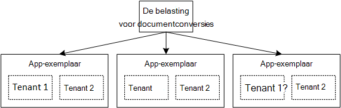

<properties
   pageTitle="Identiteitsbeheer voor multitenant toepassingen | Microsoft Azure"
   description="Inleiding tot identiteitsbeheer in multitenant toepassingen"
   services=""
   documentationCenter="na"
   authors="MikeWasson"
   manager="roshar"
   editor=""
   tags=""/>

<tags
   ms.service="guidance"
   ms.devlang="dotnet"
   ms.topic="article"
   ms.tgt_pltfrm="na"
   ms.workload="na"
   ms.date="06/02/2016"
   ms.author="mwasson"/>

# Inleiding tot identiteitsbeheer voor multitenant toepassingen in Microsoft Azure

[AZURE.INCLUDE [pnp-header](../../includes/guidance-pnp-header-include.md)]

In dit artikel maakt [deel uit van een reeks]. Er is ook een volledige [voorbeeldtoepassing] waarop deze reeks.

Stel dat u schrijft een enterprise SaaS toepassing in de cloud worden gehost. De toepassing wordt natuurlijk gebruikers hebt:

Maar die gebruikers deel uitmaken van organisaties:

Voorbeeld: Tailspin verkoopt abonnementen op de SaaS-toepassing. Registreer u voor de app Contoso en Fabrikam. Wanneer Lisa (`alice@contoso`) tekens in de toepassing moet weten dat Lisa deel uit van Contoso maakt.

- Lisa _moet_ hebben toegang tot gegevens van Contoso.
- Lisa _niet moet_ hebben toegang tot Fabrikam gegevens.

Deze instructies wordt uitgelegd hoe u voor het beheren van de identiteit van de gebruikers in een multitenant-toepassing, met [Azure Active Directory] [ AzureAD] (Azure AD) worden afgehandeld aanmelden en verificatie.

## Wat is multitenancy?

Een _tenant_ is een groep gebruikers. In een SaaS-toepassing is de tenant een abonnee of de verbetering van de toepassing. _Multitenancy_ is een architectuur waar de hetzelfde fysieke exemplaar van de app voor het delen van meerdere tenants. Hoewel tenants delen fysieke bronnen (zoals VMs of opslag), wordt elke tenant eigen logische exemplaar van de app.

Toepassingsgegevens is meestal gedeeld door de gebruikers in een tenant, maar niet met andere tenants.

Vergelijk deze architectuur met een enkel-tenant-architectuur, waarbij elke tenant een apart fysiek exemplaar heeft. In een enkel-tenant-architectuur, kunt u tenants toevoegen door te draaien nieuwe exemplaren van de app.

### Multitenancy en horizontale schaalbaarheid

Als u wilt bereiken schaal in de cloud, wordt meestal meer fysiek exemplaren toevoegen. Dit wordt _Horizontaal schalen_ of _schalen_genoemd. Overweeg om een WebApp te. Als u wilt meer verkeer verwerken, kunt u meer server VMs toevoegen en plaatst u deze achter een taakverdeling. Elke VM wordt uitgevoerd van een afzonderlijk fysiek exemplaar van de web-app.

Elk verzoek kan worden doorgestuurd naar een willekeurig exemplaar. Samen en fungeert het systeem als één logische exemplaar. U kunt een VM verwijderen of kringvelden van een nieuwe VM, zonder ze te activeren. In deze architectuur elk fysiek exemplaar meerdere tenant is en u met het toevoegen van meer exemplaren wilt verkleinen. Als één exemplaar uitvalt, moet dit geen invloed op alle tenant.

## Identiteit in een multitenant-app

In een multitenant app, moet u rekening houden met gebruikers in de context van tenants.

**Verificatie**

- Gebruikers Meld u aan bij de app met de referenties van hun organisatie. Ze hoeft niet te maken van nieuwe gebruikersprofielen voor de app.
- Gebruikers binnen dezelfde organisatie maken deel uit van dezelfde tenant.
- Wanneer een gebruiker zich aanmeldt, wordt in de toepassing welk tenant de gebruiker behoort weet.

**Autorisatie**

- Tijdens het machtigen van een gebruiker acties (zeg, een resource weergeven), moet de app rekening tenant van de gebruiker.
- Gebruikers kunnen functies binnen de toepassing, zoals "Beheerder" of "standaardgebruiker" worden toegewezen. Roltoewijzingen moeten worden beheerd door de klant, niet door de SaaS-provider.

**Voorbeeld.** Lisa een werknemer bij Contoso, gaat naar de toepassing in haar browser en op de knop 'Aanmelden'. Zij omgeleid naar een aanmeldingsvenster waar zij haar zakelijke referenties (gebruikersnaam en wachtwoord) invoert. In dit stadium zij is aangemeld bij de app als `alice@contoso.com`. De toepassing ook weet dat Lisa beheerder van deze toepassing. Omdat ze een beheerder is, kan zij een overzicht van alle resources die bij Contoso horen. Echter weergeven niet zij van Fabrikam resources, omdat ze een beheerder alleen binnen haar tenant is.

In deze handleiding, zullen we specifiek met behulp van Azure AD voor identiteitsbeheer.

- We wordt ervan uitgegaan dat de klant slaat hun gebruikersprofielen in Azure AD (inclusief Office 365 en Dynamics CRM tenants)
- Klanten met on-premises Active Directory (AD) de beschikking over [Azure AD Connect] [ ADConnect] om hun on-premises AD met Azure AD te synchroniseren.

Als een klant met on-premises AD niet kan Azure AD Connect (vanwege bedrijfsbeleid IT of andere redenen), is de provider met de klant communiceren kan SaaS AD via Active Directory Federation Services (AD FS). Deze optie wordt beschreven in [Federating met van een klant AD FS].

Deze instructies rekening geen met andere aspecten van multitenancy zoals partitioneren van gegevens, per tenant configuratie en dergelijke.

## Volgende stappen

- Lees het volgende artikel in deze reeks: [informatie over het de enquêtes-toepassing][tailpin]

<!-- Links -->
[ADConnect]: ../active-directory/active-directory-aadconnect.md
[AzureAD]: https://azure.microsoft.com/documentation/services/active-directory/
[een reeks hoort]: guidance-multitenant-identity.md
[Met de klant AD FS samenbrengen]: guidance-multitenant-identity-adfs.md
[van voorbeeldtoepassing]: https://github.com/Azure-Samples/guidance-identity-management-for-multitenant-apps
[tailpin]: guidance-multitenant-identity-tailspin.md
