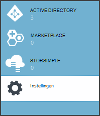
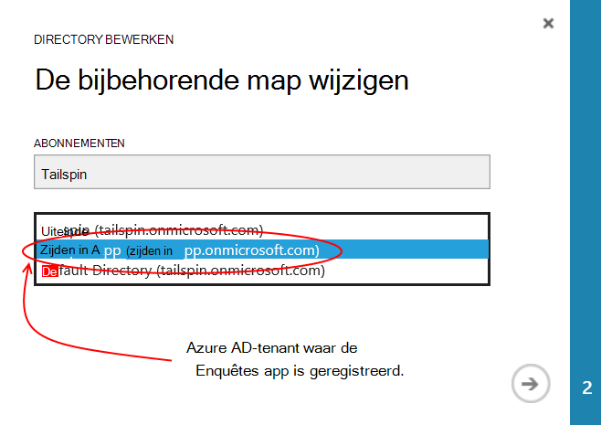
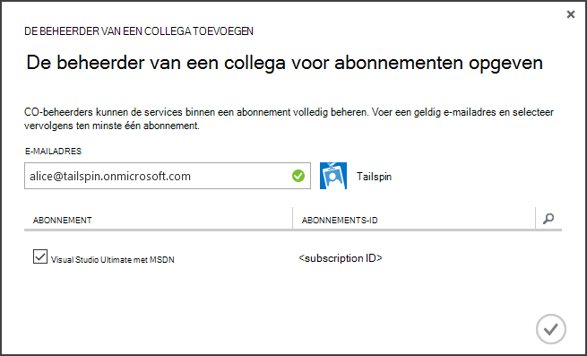
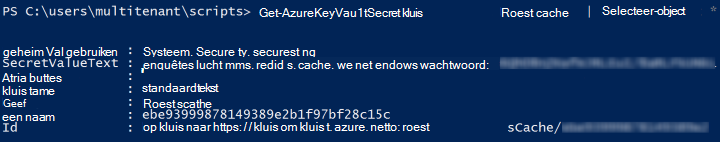

<properties
   pageTitle="Gebruik van de sleutel kluis om te beveiligen van toepassing geheimen | Microsoft Azure"
   description="Hoe een gebruik de sleutel kluis-service voor de opslag van toepassing geheimen"
   services=""
   documentationCenter="na"
   authors="MikeWasson"
   manager="roshar"
   editor=""
   tags=""/>

<tags
   ms.service="guidance"
   ms.devlang="dotnet"
   ms.topic="article"
   ms.tgt_pltfrm="na"
   ms.workload="na"
   ms.date="02/16/2016"
   ms.author="mwasson"/>

# <a name="using-azure-key-vault-to-protect-application-secrets"></a>Gebruik van Azure-toets kluis om te toepassing geheimen beveiligen

[AZURE.INCLUDE [pnp-header](../../includes/guidance-pnp-header-include.md)]

In dit artikel maakt [deel uit van een reeks]. Er is ook een volledige [voorbeeldtoepassing] waarop deze reeks.

## <a name="overview"></a>Overzicht

Meestal wordt hebt toepassingsinstellingen die zijn gevoelige en moeten worden beveiligd, zoals:

- Database-verbindingstekenreeksen
- Wachtwoorden
- Cryptografische sleutels

Als veiligheidsoverwegingen, moet u deze geheimen nooit opslaan in een besturingselement voor gegevensbronnen. Ook kunt u eenvoudig worden lekken &mdash; zelfs als de bron code opslagplaats privé is. En deze wordt niet vrijwel geheimhouding uit de algemene openbare. Klik op grotere projecten u mogelijk wilt beperken welke ontwikkelaars en operatoren hebben toegang tot de geheimen productie. (Instellingen voor test- of ontwikkelomgeving omgevingen zijn verschillende.)

Een veiliger optie is voor de opslag van deze geheimen in [Azure toets kluis][KeyVault]. Toets kluis is een cloud gehoste service voor het beheren van cryptografische sleutels en andere geheimen. In dit artikel leest hoe u met sleutel kluis configuratie-instellingen voor u app opslaan.

Aan de [De enquêtes] [ Surveys] -toepassing, de volgende instellingen zijn geheim:

- De verbindingsreeks van de database.
- De verbindingsreeks bestand Vgx..
- De geheim client voor de webtoepassing.

Om op te slaan configuratie geheimen in sleutel kluis, de toepassing enquêtes een aangepaste configuratie-provider, die Hiermee worden in het ASP.NET Core 1.0- [configuratiesysteem]implementeert[configuration]. De aangepaste provider leest configuratie-instellingen uit kluis sleutel bij het opstarten.

De toepassing enquêtes wordt geladen configuratie-instellingen van de volgende locaties:

- Het bestand appsettings.json
- De [gebruiker geheimen opslaan] [ user-secrets] (ontwikkelomgeving alleen; voor testdoeleinden)
- De hostomgeving (app-instellingen in Azure web-apps)
- Belangrijke kluis

Elk van de vorige taak, zodat alle instellingen die zijn opgeslagen in de sleutel kluis voorrang van dit negeren.

> [AZURE.NOTE] De toets kluis configuratie-provider is standaard uitgeschakeld. Deze niet nodig voor het uitvoeren van de toepassing lokaal. U zou deze inschakelen in een productie-implementatie.

> De toets kluis-provider is momenteel niet ondersteund voor .NET-Core, omdat hiervoor de [Microsoft.Azure.KeyVault] [ Microsoft.Azure.KeyVault] pakket.

Bij het opstarten, de toepassing leest instellingen van elke geregistreerde configuratie-provider en deze worden gebruikt om een object ten zeerste getypte opties te vullen. (Zie voor meer informatie, [Opties via en van configuratieobjecten][options].)

## <a name="implementation"></a>Implementatie

De [KeyVaultConfigurationProvider] [ KeyVaultConfigurationProvider] klasse is een configuratie-provider die u in het ASP.NET Core 1.0- [configuratiesysteem]kunt[configuration].

Gebruik van de `KeyVaultConfigurationProvider`, bellen de `AddKeyVaultSecrets` extensie methode in de klas opstarten:

```csharp
    var builder = new ConfigurationBuilder()
        .SetBasePath(appEnv.ApplicationBasePath)
        .AddJsonFile("appsettings.json");

    if (env.IsDevelopment())
    {
        builder.AddUserSecrets();
    }
    builder.AddEnvironmentVariables();
    var config = builder.Build();

    // Add key vault configuration:
    builder.AddKeyVaultSecrets(config["AzureAd:ClientId"],
        config["KeyVault:Name"],
        config["AzureAd:Asymmetric:CertificateThumbprint"],
        Convert.ToBoolean(config["AzureAd:Asymmetric:ValidationRequired"]),
        loggerFactory);
```

U ziet dat `KeyVaultConfigurationProvider` sommige configuratie-instellingen, die moeten worden opgeslagen in een van de andere bronnen, configuratie vereist.

Wanneer de toepassing wordt gestart, `KeyVaultConfigurationProvider` een lijst van de geheimen in de belangrijkste kluis. Voor elke geheim wordt gezocht naar een tag met de naam 'ConfigKey'. De waarde van de tag is de naam van de configuratie-instelling.

> [AZURE.NOTE] [Labels] [ key-tags] zijn optioneel metagegevens die zijn opgeslagen met een sleutel. Labels worden hier gebruikt omdat belangrijke namen mogen geen dubbele punt (:) tekens bevatten.

```csharp
var kvClient = new KeyVaultClient(GetTokenAsync);
var secretsResponseList = await kvClient.GetSecretsAsync(_vault, MaxSecrets, token);
foreach (var secretItem in secretsResponseList.Value)
{
    //The actual config key is stored in a tag with the Key "ConfigKey"
    // because ':' is not supported in a shared secret name by Key Vault.
    if (secretItem.Tags != null && secretItem.Tags.ContainsKey(ConfigKey))
    {
        var secret = await kvClient.GetSecretAsync(secretItem.Id, token);
        Data.Add(secret.Tags[ConfigKey], secret.Value);
    }
}
```

> [AZURE.NOTE] Zie [KeyVaultConfigurationProvider.cs].

## <a name="setting-up-key-vault-in-the-surveys-app"></a>Toets kluis instellen in de app enquêtes

Vereisten:

- Installeren van de [Azure resourcemanager Cmdlets][azure-rm-cmdlets].
- De toepassing enquêtes configureren, zoals is beschreven in [de toepassing enquêtes][readme].

Hoofdstappen:

1. Een gebruiker beheerder in de tenant instellen.
2. Een clientcertificaat instellen.
3. Maak een belangrijke kluis.
4. Configuratie-instellingen toevoegen aan uw belangrijkste kluis.
5. Verwijder de opmerkingen bij de code waarmee belangrijke kluis.
6. Bijwerken van de toepassing gebruiker geheimen.

### <a name="set-up-an-admin-user"></a>Een admin-gebruiker instellen

> [AZURE.NOTE] Als u wilt een belangrijke kluis hebt gemaakt, moet u een account die uw Azure-abonnement kunt beheren. Een toepassing die u wilt machtigen om te lezen uit de belangrijkste kluis moet ook geregistreerd in dezelfde tenant als dat account.

In deze stap geeft zorgt u ervoor dat kunt u een belangrijke kluis terwijl aangemeld als een gebruiker van de tenant waar de app enquêtes is geregistreerd.

Eerst de map die is gekoppeld aan uw Azure abonnement wijzigen.

1. Meld u aan bij de [Azure management portal][azure-management-portal]

2. Klik op **Instellingen**.

    

3. Selecteer uw Azure-abonnement.

4. Klik op **Adreslijst bewerken** onderaan in de portal.

    

5. In 'Wijzigen van de bijbehorende map', selecteert u de Azure AD-tenant waar de toepassing enquêtes is geregistreerd,

    

6. Klik op de pijlknop en het dialoogvenster te voltooien.

Maak een admin-gebruiker binnen de Azure AD-tenant waar de toepassing enquêtes is geregistreerd.

1. Meld u aan bij de [Azure gegevensbeheerportal][azure-management-portal].

2. Selecteer de Azure AD-tenant waar uw toepassing is geregistreerd.

3. Klik op **gebruikers** > **gebruiker toevoegen**.

4. Klik in het dialoogvenster **Gebruiker toevoegen** door de gebruiker te toewijzen aan de rol van globale beheerder.

Beheerder toevoegen als collega beheerder voor uw Azure-abonnement.

1. Meld u aan bij de [Azure gegevensbeheerportal][azure-management-portal].

2. Klik op **Instellingen** en selecteer uw Azure-abonnement.

3. Klik op **beheerders**

4. Klik op **toevoegen** aan de onderkant van de portal.

5. Voer het e-mailbericht met de admin-gebruiker die u eerder hebt gemaakt.

6. Schakel het selectievakje in voor het abonnement.

7. Klik op de knop vinkje om te voltooien van het dialoogvenster.




### <a name="set-up-a-client-certificate"></a>Een clientcertificaat instellen

1. Voer de PowerShell-script [/Scripts/Setup-KeyVault.ps1] [ Setup-KeyVault] als volgt:
    ```
    .\Setup-KeyVault.ps1 -Subject <<subject>>
    ```
    Voor de `Subject` parameter, voert u een naam, bijvoorbeeld "surveysapp". Het script genereert een zelfondertekend certificaat en opgeslagen in het archief "huidige gebruiker/persoonlijk".

2. De uitvoer van het script is een JSON-fragment. Voeg dit als volgt aan manifest voor de toepassing van de web-app:

    1. Meld u aan bij de [Azure gegevensbeheerportal] [ azure-management-portal] en navigeer naar de map Azure AD.

    2. Klik op **toepassingen**.

    3. Selecteer de toepassing enquêtes.

    4.  Klik op **Beheren bestandenlijst** en selecteer **Downloaden bestandenlijst**.

    5.  Open het manifest JSON-bestand in een teksteditor. Plak de uitvoer van het script in het `keyCredentials` eigenschap. Deze ziet er ongeveer als volgt uit:
    ```
            "keyCredentials": [
                {
                  "type": "AsymmetricX509Cert",
                  "usage": "Verify",
                  "keyId": "29d4f7db-0539-455e-b708-....",
                  "customKeyIdentifier": "ZEPpP/+KJe2fVDBNaPNOTDoJMac=",
                  "value": "MIIDAjCCAeqgAwIBAgIQFxeRiU59eL.....
                }
              ],
    ```          
    6.  Sla uw wijzigingen op de JSON-bestand.

    7.  Ga terug naar de portal. Klik op **Beheren bestandenlijst** > **Bestandenlijst uploaden** en upload het bestand JSON.

3. Het dezelfde JSON-fragment toevoegen aan een manifest voor de toepassing van het web API (Surveys.WebAPI).

4. Voer de volgende opdracht uit om de vingerafdruk van het certificaat.
    ```
    certutil -store -user my [subject]
    ```
    waar `[subject]` is de waarde die u hebt opgegeven voor onderwerp in de PowerShell-script. De vingerafdruk staat vermeld onder "Certificaat Hash(sha1)". Verwijdert de spaties tussen de hexadecimale waarde getallen.

Gebruikt u de vingerafdruk later.

### <a name="create-a-key-vault"></a>Een belangrijke kluis maken

1. Voer de PowerShell-script [/Scripts/Setup-KeyVault.ps1] [ Setup-KeyVault] als volgt:

    ```
    .\Setup-KeyVault.ps1 -KeyVaultName <<key vault name>> -ResourceGroupName <<resource group name>> -Location <<location>>
    ```

    Wanneer u wordt gevraagd om referenties, meld u aan als de gebruiker Azure AD dat u eerder hebt gemaakt. Het script Hiermee maakt u een nieuwe resourcegroep en een nieuwe belangrijke kluis binnen die resourcegroep.

    Opmerking: voor de locatieparameter-, kunt u het volgende PowerShell-opdracht om een lijst met geldige regio's:

    ```
    Get-AzureRmResourceProvider -ProviderNamespace "microsoft.keyvault" | Where-Object { $_.ResourceTypes.ResourceTypeName -eq "vaults" } | Select-Object -ExpandProperty Locations
    ```

2. SetupKeyVault.ps Klik nogmaals met de volgende parameters uitvoeren:

    ```
    .\Setup-KeyVault.ps1 -KeyVaultName <<key vault name>> -ApplicationIds @("<<web app client ID>>", "<<web API client ID>>")
    ```

    waar

    - de naam van de belangrijkste kluis = de naam die u hebt de belangrijkste kluis in de vorige stap gegeven.
    - Web app-client-ID = de client-ID voor de webtoepassing enquêtes.
    - Web api-client-ID = de client-ID voor de toepassing Surveys.WebAPI.

    Voorbeeld:
    ```
    .\Setup-KeyVault.ps1 -KeyVaultName tailspinkv -ApplicationIds @("f84df9d1-91cc-4603-b662-302db51f1031", "8871a4c2-2a23-4650-8b46-0625ff3928a6")
    ```

    > [AZURE.NOTE] U kunt de client id's krijgen van de [Azure gegevensbeheerportal][azure-management-portal]. Selecteer de Azure AD-tenant, selecteert u de toepassing en klik op **configureren**.

    Dit script geautoriseerd de WebApp en web API om op te halen geheimen uit uw belangrijkste kluis. Zie [aan de slag met Azure toets kluis] [ authorize-app] voor meer informatie.

### <a name="add-configuration-settings-to-your-key-vault"></a>Configuratie-instellingen toevoegen aan uw belangrijkste kluis

1. SetupKeyVault.ps als volgt uitvoeren::

    ```
    .\Setup-KeyVault.ps1 -KeyVaultName <<key vault name> -KeyName RedisCache -KeyValue "<<Redis DNS name>>.redis.cache.windows.net,password=<<Redis access key>>,ssl=true" -ConfigName "Redis:Configuration"
    ```
    waar

    - de naam van de belangrijkste kluis = de naam die u hebt de belangrijkste kluis in de vorige stap gegeven.
    - Bestand Vgx. de naam van de DNS-= de DNS-naam van uw exemplaar van de cache bestand Vgx..
    - Bestand Vgx. toegangstoets = van de access-toets voor uw exemplaar van de cache bestand Vgx..

    Deze opdracht voegt een geheim aan uw belangrijkste kluis. Het geheim is een combinatie van naam/waarde plus een tag:

    -   Naam van de sleutel niet wordt gebruikt door de toepassing, maar moet uniek zijn binnen de sleutel kluis.
    -   De waarde is de waarde van de configuratieoptie, klikt u in dit geval de verbindingsreeks bestand Vgx..
    -   de markering 'ConfigKey' bevat de naam van de configuratie-toets.

2. Nu is een goed idee om te controleren of u de geheimen aan belangrijke kluis is opgeslagen. Voer de volgende PowerShell-opdracht:

    ```
    Get-AzureKeyVaultSecret <<key vault name>> RedisCache | Select-Object *
    ```
    De uitvoer moet worden weergegeven de geheime waarde plus enkele metagegevens:

    

3. SetupKeyVault.ps opnieuw als u wilt toevoegen van de database-verbindingsreeks uitvoeren:

    ```
    .\Setup-KeyVault.ps1 -KeyVaultName <<key vault name> -KeyName ConnectionString -KeyValue <<DB connection string>> -ConfigName "Data:SurveysConnectionString"
    ```

    waar `<<DB connection string>>` is de waarde van de verbindingsreeks van de database.

    Voor het testen met de lokale database, kopieert u de verbindingsreeks uit het bestand Tailspin.Surveys.Web/appsettings.json. Als u dat doet, controleert u of wijzigen van de dubbele backslash ('\\\\') in een enkele backslash. Backslashes is een escape-teken in de JSON-bestand.

    Voorbeeld:

    ```
    .\Setup-KeyVault.ps1 -KeyVaultName mykeyvault -KeyName ConnectionString -KeyValue "Server=(localdb)\MSSQLLocalDB;Database=Tailspin.SurveysDB;Trusted_Connection=True;MultipleActiveResultSets=true" -ConfigName "Data:SurveysConnectionString"
    ```

### <a name="uncomment-the-code-that-enables-key-vault"></a>Verwijder de opmerkingen bij de code waarmee toets kluis

1. Open de oplossing Tailspin.Surveys.

2. In [Tailspin.Surveys.Web/Startup.cs][web-startup], zoekt u het volgende codeblok en verwijder de opmerkingen bij deze.

    ```csharp
    //#if DNX451
    //            _configuration = builder.Build();
    //            builder.AddKeyVaultSecrets(_configuration["AzureAd:ClientId"],
    //                _configuration["KeyVault:Name"],
    //                _configuration["AzureAd:Asymmetric:CertificateThumbprint"],
    //                Convert.ToBoolean(_configuration["AzureAd:Asymmetric:ValidationRequired"]),
    //                loggerFactory);
    //#endif
    ```

3. In [Tailspin.Surveys.WebAPI/Startup.cs][web-api-startup], zoekt u het volgende codeblok en verwijder de opmerkingen bij deze.

    ```csharp
    //#if DNX451
    //            var config = builder.Build();
    //            builder.AddKeyVaultSecrets(config["AzureAd:ClientId"],
    //                config["KeyVault:Name"],
    //                config["AzureAd:Asymmetric:CertificateThumbprint"],
    //                Convert.ToBoolean(config["AzureAd:Asymmetric:ValidationRequired"]),
    //                loggerFactory);
    //#endif
    ```

4. In [Tailspin.Surveys.Web/Startup.cs][web-startup], zoek de code die wordt geregistreerd de `ICredentialService`. Verwijder de opmerkingen voor de lijn die wordt gebruikt bij `CertificateCredentialService`, en de lijn die gebruikmaakt van commentaar `ClientCredentialService`:

    ```csharp
    // Uncomment this:
    services.AddSingleton<ICredentialService, CertificateCredentialService>();
    // Comment out this:
    //services.AddSingleton<ICredentialService, ClientCredentialService>();
    ```

    Deze wijziging kan de WebApp voor het gebruik van [Client bevestiging] [ client-assertion] OAuth access tokens ophalen. Met client bevestiging hoeft u niet een geheim OAuth-client. U kunt ook kunt u de geheim client opslaan in belangrijke kluis. Echter certificate belangrijke kluis en client bevestiging dat beide gebruiken een client, dus als u belangrijke kluis inschakelt, is een goede gewoonte om in te schakelen als u ook client bevestiging.

### <a name="update-the-user-secrets"></a>De gebruiker geheimen bijwerken

In Solution Explorer met de rechtermuisknop op het project Tailspin.Surveys.Web en selecteer **Gebruiker geheimen beheren**. In het bestand secrets.json verwijderen van de bestaande JSON en plak in het volgende:

    ```
    {
      "AzureAd": {
        "ClientId": "[Surveys web app client ID]",
        "PostLogoutRedirectUri": "https://localhost:44300/",
        "WebApiResourceId": "[App ID URI of your Surveys.WebAPI application]",
        "Asymmetric": {
          "CertificateThumbprint": "[certificate thumbprint. Example: 105b2ff3bc842c53582661716db1b7cdc6b43ec9]",
          "StoreName": "My",
          "StoreLocation": "CurrentUser",
          "ValidationRequired": "false"
        }
      },
      "KeyVault": {
        "Name": "[key vault name]"
      }
    }
    ```

De items in [vierkante haken] vervangen door de juiste waarden.

- `AzureAd:ClientId`: De client-ID van de app enquêtes.
- `AzureAd:WebApiResourceId`: De App-ID URI die u hebt opgegeven wanneer u de toepassing Surveys.WebAPI in Azure AD hebt gemaakt.
- `Asymmetric:CertificateThumbprint`: De vingerafdruk van het certificaat dat u eerder hebt ontvangen wanneer u het clientcertificaat hebt gemaakt.
- `KeyVault:Name`: De naam van uw belangrijkste kluis.

> [AZURE.NOTE] `Asymmetric:ValidationRequired`ONWAAR is omdat het certificaat dat u eerder hebt gemaakt niet is ondertekend door een certificeringsinstantie (CA) van de hoofdmap. Gebruik een certificaat dat is ondertekend door een basiscertificeringsinstantie en ingesteld in productie, `ValidationRequired` op waar.

Sla het bestand bijgewerkte secrets.json.

Klik vervolgens in Solution Explorer met de rechtermuisknop op het project Tailspin.Surveys.WebApi en selecteer **Gebruiker geheimen beheren**. Verwijder de bestaande JSON en plak in het volgende:

```
{
  "AzureAd": {
    "ClientId": "[Surveys.WebAPI client ID]",
    "WebApiResourceId": "https://tailspin5.onmicrosoft.com/surveys.webapi",
    "Asymmetric": {
      "CertificateThumbprint": "[certificate thumbprint]",
      "StoreName": "My",
      "StoreLocation": "CurrentUser",
      "ValidationRequired": "false"
    }
  },
  "KeyVault": {
    "Name": "[key vault name]"
  }
}
```

Vervang de items in [vierkante haken] en sla het bestand secrets.json.

> [AZURE.NOTE] Zorg dat u de client-ID voor de Surveys.WebAPI-toepassing en niet de toepassing enquêtes gebruiken voor het web API.


<!-- Links -->
[authorize-app]: ../key-vault/key-vault-get-started.md/#authorize
[azure-management-portal]: https://manage.windowsazure.com/
[azure-rm-cmdlets]: https://msdn.microsoft.com/library/mt125356.aspx
[client-assertion]: guidance-multitenant-identity-client-assertion.md
[configuration]: https://docs.asp.net/en/latest/fundamentals/configuration.html
[KeyVault]: https://azure.microsoft.com/services/key-vault/
[KeyVaultConfigurationProvider]: https://github.com/Azure-Samples/guidance-identity-management-for-multitenant-apps/blob/master/src/Tailspin.Surveys.Configuration.KeyVault/KeyVaultConfigurationProvider.cs
[key-tags]: https://msdn.microsoft.com/library/azure/dn903623.aspx#BKMK_Keytags
[Microsoft.Azure.KeyVault]: https://www.nuget.org/packages/Microsoft.Azure.KeyVault/
[options]: https://docs.asp.net/en/latest/fundamentals/configuration.html#using-options-and-configuration-objects
[readme]: https://github.com/Azure-Samples/guidance-identity-management-for-multitenant-apps/blob/master/docs/running-the-app.md
[Setup-KeyVault]: https://github.com/Azure-Samples/guidance-identity-management-for-multitenant-apps/blob/master/scripts/Setup-KeyVault.ps1
[Surveys]: guidance-multitenant-identity-tailspin.md
[user-secrets]: http://go.microsoft.com/fwlink/?LinkID=532709
[web-startup]: https://github.com/Azure-Samples/guidance-identity-management-for-multitenant-apps/blob/master/src/Tailspin.Surveys.Web/Startup.cs
[web-api-startup]: https://github.com/Azure-Samples/guidance-identity-management-for-multitenant-apps/blob/master/src/Tailspin.Surveys.WebAPI/Startup.cs
[een reeks hoort]: guidance-multitenant-identity.md
[KeyVaultConfigurationProvider.cs]: https://github.com/Azure-Samples/guidance-identity-management-for-multitenant-apps/blob/master/src/Tailspin.Surveys.Configuration.KeyVault/KeyVaultConfigurationProvider.cs
[van voorbeeldtoepassing]: https://github.com/Azure-Samples/guidance-identity-management-for-multitenant-apps
