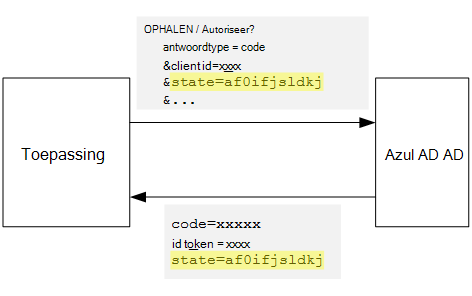
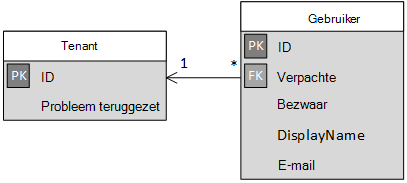

<properties
   pageTitle="Aanmelden bij en onboarding in multitenant toepassingen tenant | Microsoft Azure"
   description="Hoe u met ingebouwde tenants in een toepassing voor multitenant"
   services=""
   documentationCenter="na"
   authors="MikeWasson"
   manager="roshar"
   editor=""
   tags=""/>

<tags
   ms.service="guidance"
   ms.devlang="dotnet"
   ms.topic="article"
   ms.tgt_pltfrm="na"
   ms.workload="na"
   ms.date="05/23/2016"
   ms.author="mwasson"/>

# <a name="sign-up-and-tenant-onboarding-in-a-multitenant-application"></a>Aanmelden bij en onboarding in een toepassing voor multitenant tenant

[AZURE.INCLUDE [pnp-header](../../includes/guidance-pnp-header-include.md)]

In dit artikel maakt [deel uit van een reeks]. Er is ook een volledige [voorbeeldtoepassing] waarop deze reeks.

Dit artikel wordt beschreven hoe u implementeert een _aanmelding_ verwerken in een toepassing voor meerdere tenant, waarmee een klant te registreren van hun organisatie voor uw toepassing.
Er zijn verschillende redenen een aanmelding proces uit te voeren:

-   Toestaan dat een AD-beheerder om toestemming voor de hele organisatie het gebruik van de toepassing van de klant.
-   Betaling per creditcard of andere klantgegevens verzameld.
-   Een eenmalige per tenant setup nodig zijn voor uw toepassing uitvoeren.

## <a name="admin-consent-and-azure-ad-permissions"></a>Beheerder toestemming en Azure AD-machtigingen

Om te verifiëren met Azure AD, moet een toepassing toegang tot de map van de gebruiker. De toepassing moet ten minste leesmachtiging het gebruikersprofiel. De eerste keer is dat een gebruiker zich aanmeldt, ziet Azure AD u een pagina toestemming waarin de machtigingen die wordt gevraagd. Door te klikken op **accepteren**, geeft de gebruiker het recht met de toepassing.

Standaard wordt toestemming verleend op basis van de per gebruiker. Elke gebruiker die zich aanmeldt, ziet de pagina toestemming. Azure AD ondersteunt echter ook _toestemming van de beheerder_kan een beheerder AD toestemming voor de hele organisatie.

Wanneer de stroom van beheerder toestemming wordt gebruikt, wordt de pagina toestemming staat dat de AD-beheerder is toekennen van de machtiging namens de volledige tenant:


Nadat de beheerder op **accepteren**klikt, andere gebruikers in dezelfde tenant kunnen mij aanmelden en Azure AD wordt het scherm toestemming overslaan.

Alleen een AD-beheerder kunt beheerder toestemming geven, omdat deze machtiging namens de gehele organisatie worden toegewezen. Als een gewone gebruiker probeert te verifiëren met de beheerder toestemming stroom, wordt een fout in Azure AD weergegeven:


Als de toepassing extra machtigingen op een later moment, moet de klant opnieuw aanmelden en akkoord met de bijgewerkte machtigingen.  

## <a name="implementing-tenant-sign-up"></a>Tenant aanmelding implementeren

Voor de [De enquêtes] [ Tailspin] toepassing, zoals verschillende vereisten voor het aanmeldingsproces gedefinieerd:

-   Een tenant moet aanmelden voordat gebruikers zich kunnen aanmelden.
-   Aanmelden bij maakt gebruik van de beheerder toestemming stroom.
-   Aanmelding is, wordt de tenant van de gebruiker aan de databasetoepassing toegevoegd.
-   Nadat een tenant zich registreert, ziet u de toepassing een onboarding-pagina.

In dit gedeelte wordt we onze implementatie van het aanmeldingsproces doorlopen.
Het is belangrijk om te begrijpen dat 'registreren' versus 'aanmelden' is een toepassing concept. Tijdens de stroom verificatie weet Azure AD niet per definitie of de gebruiker is bezig zich registreert. Is het aan de toepassing om de context bij te houden.

Als anonieme gebruiker bezoekt de toepassing enquêtes, de gebruiker bevindt zich twee knoppen weergegeven, een aan te melden en één tot "uw bedrijf worden geregistreerd" (registreren).


Deze knoppen roepen acties in de klas [AccountController] .

De `SignIn` actie geeft als resultaat een **ChallegeResult**, waardoor de middleware OpenID verbinding omleiden naar het eindpunt verificatie. Dit is de standaard-manier om te activeren verificatie in ASP.NET Core 1.0.  

```csharp
[AllowAnonymous]
public IActionResult SignIn()
{
    return new ChallengeResult(
        OpenIdConnectDefaults.AuthenticationScheme,
        new AuthenticationProperties
        {
            IsPersistent = true,
            RedirectUri = Url.Action("SignInCallback", "Account")
        });
}
```

Nu vergelijken de `SignUp` actie:

```csharp
[AllowAnonymous]
public IActionResult SignUp()
{
    // Workaround for https://github.com/aspnet/Security/issues/546
    HttpContext.Items.Add("signup", "true");

    var state = new Dictionary<string, string> { { "signup", "true" }};
    return new ChallengeResult(
        OpenIdConnectDefaults.AuthenticationScheme,
        new AuthenticationProperties(state)
        {
            RedirectUri = Url.Action(nameof(SignUpCallback), "Account")
        });
}
```

Zoals `SignIn`, de `SignUp` actie ook geeft als resultaat een `ChallengeResult`. Maar ditmaal we toevoegen een deel van een statusinformatie naar de `AuthenticationProperties` in de `ChallengeResult`:

-   registratie: een Boole-vlag, die aangeeft dat de gebruiker het aanmeldingsproces is begonnen.

De statusinformatie in `AuthenticationProperties` wordt toegevoegd aan de OpenID verbinding [staat] parameter reizen afronden tijdens de stroom verificatie.



Nadat de gebruiker wordt geverifieerd door in Azure AD en terug naar de toepassing wordt omgeleid, bevat de verificatie-tickets de staat. We gebruiken deze faculteit om ervoor te zorgen dat de waarde "registratie" zich blijft voordoen tijdens de hele verificatie-stroom.

## <a name="adding-the-admin-consent-prompt"></a>De beheerder toestemming vraag toevoegen

In Azure AD, wordt de stroom van beheerder toestemming door een parameter "vragen" toe te voegen aan de query in de uitnodiging voor de verificatie geactiveerd:

```
/authorize?prompt=admin_consent&...
```

De toepassing enquêtes voegt de prompt tijdens de `RedirectToAuthenticationEndpoint` gebeurtenis. Deze gebeurtenis heet rechts voordat de middleware wordt omgeleid naar het eindpunt verificatie.

```csharp
public override Task RedirectToAuthenticationEndpoint(RedirectContext context)
{
    if (context.IsSigningUp())
    {
        context.ProtocolMessage.Prompt = "admin_consent";
    }

    _logger.RedirectToIdentityProvider();
    return Task.FromResult(0);
}
```

> [AZURE.NOTE] Zie [SurveyAuthenticationEvents.cs].

Instelling` ProtocolMessage.Prompt` de middleware de parameter "vragen" toevoegen aan het verificatieverzoek worden vermeld.

Houd er rekening mee dat de prompt alleen tijdens het aanmelden nodig is. Normale aanmeldingsproblemen moet niet opnemen. Als u wilt onderscheiden ertussen, we controleren op de `signup` waarde in de verificatiestatus. De volgende extensie-methode voor deze voorwaarde wordt gecontroleerd:

```csharp
internal static bool IsSigningUp(this BaseControlContext context)
{
    Guard.ArgumentNotNull(context, nameof(context));

    string signupValue;
    object obj;
    // Check the HTTP context and convert to string
    if (context.HttpContext.Items.TryGetValue("signup", out obj))
    {
        signupValue = (string)obj;
    }
    else
    {
        // It's not in the HTTP context, so check the authentication ticket.  If it's not there, we aren't signing up.
        if ((context.AuthenticationTicket == null) ||
            (!context.AuthenticationTicket.Properties.Items.TryGetValue("signup", out signupValue)))
        {
            return false;
        }
    }

    // We have found the value, so see if it's valid
    bool isSigningUp;
    if (!bool.TryParse(signupValue, out isSigningUp))
    {
        // The value for signup is not a valid boolean, throw                
        throw new InvalidOperationException($"'{signupValue}' is an invalid boolean value");
    }

    return isSigningUp;
}
```

> [AZURE.NOTE] Zie [BaseControlContextExtensions.cs].

> [AZURE.NOTE] Opmerking: Deze code bevat een tijdelijke oplossing beschikbaar voor een bekende fout in ASP.NET Core 1.0 RC1. In de `RedirectToAuthenticationEndpoint` gebeurtenis, er is geen manier om de verificatie-eigenschappen dat de status 'registratie' bevat. Als een tijdelijke oplossing de `AccountController.SignUp` methode kunt u bovendien de stand 'registratie' in de `HttpContext`. Dit werkt omdat `RedirectToAuthenticationEndpoint` gebeurt voordat de omleiding, zodat we nog steeds hetzelfde `HttpContext`.

## <a name="registering-a-tenant"></a>Registreren van een Tenant

Vindt u informatie over elke tenant en gebruiker van de toepassing enquêtes worden opgeslagen in de databasetoepassing.



In de tabel Tenant is IssuerValue de waarde van de uitgever claim voor de tenant. Voor Azure AD, is dit `https://sts.windows.net/<tentantID>` en geeft een unieke waarde per pachter.

Wanneer een nieuwe tenant zich registreert, de toepassing enquêtes schrijft een tenant-record met de database. Dit gebeurt binnen de `AuthenticationValidated` gebeurtenis. (Niet dit doen voordat u deze gebeurtenis, omdat het ID-token nog, won't worden gevalideerd zodat u de claimwaarden niet kunt vertrouwen. Zie [verificatie].

Hier ziet u de betreffende code van de configuratietoepassing enquêtes:

```csharp
public override async Task AuthenticationValidated(AuthenticationValidatedContext context)
{
    var principal = context.AuthenticationTicket.Principal;
    var userId = principal.GetObjectIdentifierValue();
    var tenantManager = context.HttpContext.RequestServices.GetService<TenantManager>();
    var userManager = context.HttpContext.RequestServices.GetService<UserManager>();
    var issuerValue = principal.GetIssuerValue();
    _logger.AuthenticationValidated(userId, issuerValue);

    // Normalize the claims first.
    NormalizeClaims(principal);
    var tenant = await tenantManager.FindByIssuerValueAsync(issuerValue)
        .ConfigureAwait(false);

    if (context.IsSigningUp())
    {
        // Originally, we were checking to see if the tenant was non-null, however, this would not allow
        // permission changes to the application in AAD since a re-consent may be required.  Now we just don't
        // try to recreate the tenant.
        if (tenant == null)
        {
            tenant = await SignUpTenantAsync(context, tenantManager)
                .ConfigureAwait(false);
        }

        // In this case, we need to go ahead and set up the user signing us up.
        await CreateOrUpdateUserAsync(context.AuthenticationTicket, userManager, tenant)
            .ConfigureAwait(false);
    }
    else
    {
        if (tenant == null)
        {
            _logger.UnregisteredUserSignInAttempted(userId, issuerValue);
            throw new SecurityTokenValidationException($"Tenant {issuerValue} is not registered");
        }

        await CreateOrUpdateUserAsync(context.AuthenticationTicket, userManager, tenant)
            .ConfigureAwait(false);
    }
}
```

> [AZURE.NOTE] Zie [SurveyAuthenticationEvents.cs].

Deze code, gebeurt het volgende:

1.  Controleer of uitgever-waarde van de tenant zich al in de database. Als de tenant niet heeft aangemeld, `FindByIssuerValueAsync` het resultaat is null.
2.  Als de gebruiker aanmeldt zich:
  1.    De tenant toevoegen aan de database (`SignUpTenantAsync`).
  2.    De geverifieerde gebruiker toevoegen aan de database (`CreateOrUpdateUserAsync`).
3.  Vul anders in de normale stroom aanmelden:
  1.    Als de uitgever van de tenant niet in de database gevonden is, betekent dit dat de tenant is niet geregistreerd en de klant moet zich registreren. In dat geval genereert een uitzondering om te leiden tot de verificatie mislukt.
  2.    Anders maakt u een databaserecord voor deze gebruiker als er nog niet een wordt (`CreateOrUpdateUserAsync`).

Hier ziet u de methode [SignUpTenantAsync] waarmee de tenant worden toegevoegd aan de database.

```csharp
private async Task<Tenant> SignUpTenantAsync(BaseControlContext context, TenantManager tenantManager)
{
    Guard.ArgumentNotNull(context, nameof(context));
    Guard.ArgumentNotNull(tenantManager, nameof(tenantManager));

    var principal = context.AuthenticationTicket.Principal;
    var issuerValue = principal.GetIssuerValue();
    var tenant = new Tenant
    {
        IssuerValue = issuerValue,
        Created = DateTimeOffset.UtcNow
    };

    try
    {
        await tenantManager.CreateAsync(tenant)
            .ConfigureAwait(false);
    }
    catch(Exception ex)
    {
        _logger.SignUpTenantFailed(principal.GetObjectIdentifierValue(), issuerValue, ex);
        throw;
    }

    return tenant;
}
```

Hier volgt een overzicht van de hele aanmelding stroom in de toepassing enquêtes:

1.  De gebruiker klikt op de knop **Aanmelden** .
2.  De `AccountController.SignUp` actie geeft als resultaat de uitkomst van een challege.  De verificatiestatus bevat 'registratie' waarde.
3.  In de `RedirectToAuthenticationEndpoint` gebeurtenis toevoegen de `admin_consent` prompt.
4.  De middleware OpenID verbinding wordt omgeleid naar Azure AD en de gebruiker wordt geverifieerd.
5.  In de `AuthenticationValidated` gebeurtenis, zoek naar de stand "registratie".
6.  De tenant toevoegen aan de database.

## <a name="next-steps"></a>Volgende stappen

- Lees het volgende artikel in deze reeks: [Toepassingsrollen in multitenant toepassingen][app roles]


<!-- Links -->
[app roles]: guidance-multitenant-identity-app-roles.md
[Tailspin]: guidance-multitenant-identity-tailspin.md
[een reeks hoort]: guidance-multitenant-identity.md
[AccountController]: https://github.com/Azure-Samples/guidance-identity-management-for-multitenant-apps/blob/master/src/Tailspin.Surveys.Web/Controllers/AccountController.cs
[de staat]: http://openid.net/specs/openid-connect-core-1_0.html#AuthRequest
[SurveyAuthenticationEvents.cs]: https://github.com/Azure-Samples/guidance-identity-management-for-multitenant-apps/blob/master/src/Tailspin.Surveys.Web/Security/SurveyAuthenticationEvents.cs
[BaseControlContextExtensions.cs]: https://github.com/Azure-Samples/guidance-identity-management-for-multitenant-apps/blob/master/src/Tailspin.Surveys.Web/Security/BaseControlContextExtensions.cs
[Verificatie]: guidance-multitenant-identity-authenticate.md
[SignUpTenantAsync]: https://github.com/Azure-Samples/guidance-identity-management-for-multitenant-apps/blob/master/src/Tailspin.Surveys.Web/Security/SurveyAuthenticationEvents.cs
[van voorbeeldtoepassing]: https://github.com/Azure-Samples/guidance-identity-management-for-multitenant-apps
