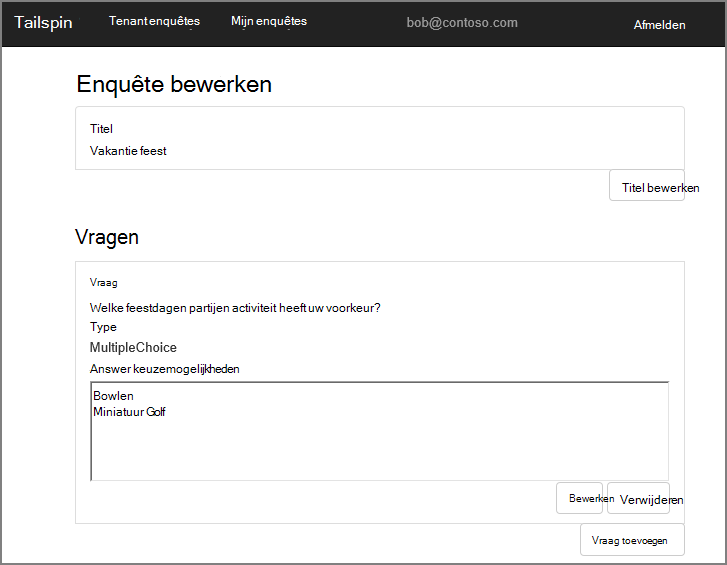
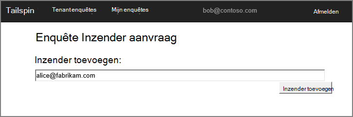

<properties
   pageTitle="Over de toepassing de enquêtes | Microsoft Azure"
   description="Tailspin enquêtes toepassing overzicht"
   services=""
   documentationCenter="na"
   authors="MikeWasson"
   manager="roshar"
   editor=""
   tags=""/>

<tags
   ms.service="guidance"
   ms.devlang="dotnet"
   ms.topic="article"
   ms.tgt_pltfrm="na"
   ms.workload="na"
   ms.date="05/23/2016"
   ms.author="mwasson"/>

# Over de toepassing de enquêtes

[AZURE.INCLUDE [pnp-header](../../includes/guidance-pnp-header-include.md)]

In dit artikel maakt [deel uit van een reeks]. Er is ook een volledige [voorbeeldtoepassing] waarop deze reeks.

Tailspin is een factitief bedrijf dat is een toepassing voor SaaS benoemde enquêtes ontwikkelen. Deze toepassing kan organisaties maken en publiceren van online enquêtes.

- Een organisatie kunt registreren voor de toepassing.
- Nadat de organisatie zich heeft aangemeld, kunnen gebruikers kunnen zich aanmelden bij de toepassing met hun organisatie-referenties.
- Gebruikers kunnen maken, bewerken en enquêtes publiceren.

> [AZURE.NOTE] Zie [de toepassing enquêtes uitgevoerd]om te beginnen met de toepassing.

## Gebruikers kunnen maken, bewerken en weergeven van enquêtes

Een geverifieerde gebruiker kan alle enquêtes die hij of zij heeft gemaakt of Inzender machtigen voor het heeft weergeven en nieuwe enquêtes maken. Zoals u ziet dat de gebruiker is aangemeld met haar organisatie-id, `bob@contoso.com`.

Deze schermafbeelding ziet u de pagina enquête bewerken:

Gebruikers kunnen ook eventuele enquêtes gemaakt door andere gebruikers in dezelfde tenant bekijken.

## Eigenaren van de enquête kunnen inzenders uitnodigen

Wanneer een gebruiker maakt een enquête, hij of zij kan andere personen uitnodigen voor Inzender op de enquête. Inzenders kunnen bewerken van de enquête, maar niet mogelijk verwijderen of uw project publiceren.  

Een gebruiker kan inzenders toevoegen vanuit andere tenants, waarmee meerdere-tenant bronnen te delen. In dit screenshot, Stefan (`bob@contoso.com`) is het toevoegen van Lisa (`alice@fabrikam.com`) als een inzender aan een enquête die Stefan hebt gemaakt.

Wanneer Lisa zich aanmeldt, ziet ze de enquête weergegeven onder 'Enquêtes ik kan bijdragen aan'.

Houd er rekening mee dat Lisa zich bij een eigen tenant, niet als gast van een van de Contoso-tenant aanmeldt. Lisa Inzender machtigingen alleen voor deze enquête heeft &mdash; zij andere enquêtes uit de Contoso-tenant niet weergeven.

## Architectuur

De toepassing enquêtes bestaat uit een web-front-end en een web API-backend. Beide worden geïmplementeerd met [ASP.NET Core 1.0].

De webtoepassing wordt Azure Active Directory (Azure AD) gebruikt om gebruikers te verifiëren. De webtoepassing oproepen ook Azure AD OAuth 2 access tokens krijgen voor de Web-API. Access tokens zijn in Azure bestand Vgx. Cache opgeslagen. De cache kan meerdere exemplaren delen van de cache voor dezelfde token (bijvoorbeeld in een serverfarm).

## Volgende stappen

- Lees het volgende artikel in deze reeks: [verificatie in multitenant apps, met behulp van de Azure Active Directory en verbindt u OpenID][authentication]

<!-- Links -->

[authentication]: guidance-multitenant-identity-authenticate.md
[een reeks hoort]: guidance-multitenant-identity.md
[De toepassing enquêtes]: https://github.com/Azure-Samples/guidance-identity-management-for-multitenant-apps/blob/master/docs/running-the-app.md
[ASP.NET-Core 1.0]: https://docs.asp.net/en/latest/
[van voorbeeldtoepassing]: https://github.com/Azure-Samples/guidance-identity-management-for-multitenant-apps
