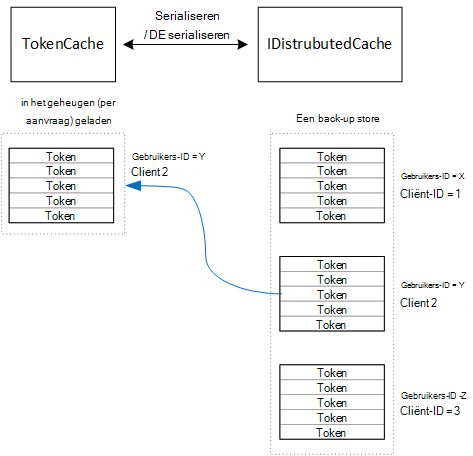

<properties
   pageTitle="Caching van Access tokens in een toepassing voor multitenant | Microsoft Azure"
   description="In de cache access tokens die worden gebruikt om een back-end Web API aan te roepen"
   services=""
   documentationCenter="na"
   authors="MikeWasson"
   manager="roshar"
   editor=""
   tags=""/>

<tags
   ms.service="guidance"
   ms.devlang="dotnet"
   ms.topic="article"
   ms.tgt_pltfrm="na"
   ms.workload="na"
   ms.date="02/16/2016"
   ms.author="mwasson"/>


# <a name="caching-access-tokens-in-a-multitenant-application"></a>In de cache access tokens in een toepassing voor multitenant

[AZURE.INCLUDE [pnp-header](../../includes/guidance-pnp-header-include.md)]

In dit artikel maakt [deel uit van een reeks]. Er is ook een volledige [voorbeeldtoepassing] waarop deze reeks.

Het is relatief dure een OAuth om toegang te krijgen toegangstoken, omdat hiervoor een HTTP-aanvraag voor het beveiligingstoken eindpunt. Daarom aan de cache tokens indien mogelijk. De [Bibliotheek van Azure AD-verificatie] [ ADAL] (ADAL) tokens afgeleid van Azure AD, inclusief vernieuwen tokens automatisch in de cache opgeslagen.

ADAL biedt een standaard-cache voor token-implementatie. Echter deze token cache is bedoeld voor apps van native client en is _niet_ geschikt is voor WebApps:

-   Een statische exemplaar en niet thread-veilig is.
-   Deze schalen niet naar grote aantallen gebruikers, omdat tokens afgeleid van alle gebruikers dieper op de dezelfde woordenlijst.
-   Dit kan niet worden gedeeld met endwebservers in een farm.

In plaats daarvan, moet u een aangepaste token cache dat is afgeleid van de ADAL implementeren `TokenCache` class maar geschikt is voor een serveromgeving en geeft de wenselijk moeten worden geïsoleerd tussen tokens voor verschillende gebruikers.

De `TokenCache` klasse slaat een woordenlijst van tokens, geïndexeerd door de uitgever, resources, cliënt-ID en gebruiker. Een aangepaste token cache moet deze woordenlijst naar een back-winkel, zoals een bestand Vgx. cache schrijven.

Klik in de toepassing de enquêtes de `DistributedTokenCache` klasse implementeert de token cache. Deze implementatie wordt gebruikt voor de [IDistributedCache] [ distributed-cache] abstractielaag ten opzichte van ASP.NET Core 1.0. Op die manier een `IDistributedCache` implementatie kan worden gebruikt als een back-winkel.

-   De app enquêtes standaard in een bestand Vgx. cache.
-   Voor een enkel exemplaar webserver, kunt u de ASP.NET Core 1.0- [cache in het geheugen][in-memory-cache]. (Dit is ook een goede optie voor het uitvoeren van de app lokaal tijdens de ontwikkeling.)

> [AZURE.NOTE] De cache bestand Vgx. is momenteel niet ondersteund voor .NET Core.

`DistributedTokenCache`de cachegegevens als sleutel/waardeparen in het back-archief worden opgeslagen. De sleutel is de gebruikers-ID plus cliënt-ID, zodat de back-store afzonderlijk cachegegevens voor elke unieke combinatie van de gebruiker/client bevat.



De back-store is partitioneren door gebruiker. Voor elke HTTP-aanvraag, de tokens voor die gebruiker zijn lezen uit de back-store en in geladen de `TokenCache` woordenlijst. Als het bestand Vgx. wordt gebruikt als de back-store, elke server-instantie in een serverfarm leest/schrijft aan de dezelfde cache en deze methode wordt aangepast aan veel gebruikers.

## <a name="encrypting-cached-tokens"></a>In de cache tokens coderen

Tokens zijn gevoelige gegevens, omdat ze toegang tot een gebruikerswachtwoord resources verlenen. (Bovendien in tegenstelling tot een gebruikerswachtwoord, u kunt niet alleen opslaan een hash van het token.) Daarom kritieke tokens kunnen worden achterhaald beveiligen. De cache bestand Vgx.-ondersteuning met een wachtwoord is beveiligd, maar als iemand het wachtwoord wordt opgehaald, ze alle de toegangstokens in de cache kunnen krijgen. Om die reden de `DistributedTokenCache` versleutelt alles waarmee deze gegevens worden geschreven naar de back-store. Versleuteling klaar is met de ASP.NET Core 1.0 [gegevensbescherming] [ data-protection] API's.

> [AZURE.NOTE] Als u op Azure-websites implementeert, de versleutelingssleutels zijn back-up gemaakt met netwerk storage en gesynchroniseerd op alle computers ( [Key Management]Zie[key-management]). Standaard sleutels zijn niet gecodeerd als actief in Azure websites, maar u kunt [inschakelen met behulp van een X.509-certificaat versleuteling][x509-cert-encryption].


## <a name="distributedtokencache-implementation"></a>DistributedTokenCache-implementatie

De [DistributedTokenCache] [ DistributedTokenCache] klasse is afgeleid van de ADAL [TokenCache] [ tokencache-class] class.

In de constructor de `DistributedTokenCache` klasse een sleutel voor de huidige gebruiker gemaakt en wordt de cache geladen vanuit de back-store:

```csharp
public DistributedTokenCache(
    ClaimsPrincipal claimsPrincipal,
    IDistributedCache distributedCache,
    ILoggerFactory loggerFactory,
    IDataProtectionProvider dataProtectionProvider)
    : base()
{
    _claimsPrincipal = claimsPrincipal;
    _cacheKey = BuildCacheKey(_claimsPrincipal);
    _distributedCache = distributedCache;
    _logger = loggerFactory.CreateLogger<DistributedTokenCache>();
    _protector = dataProtectionProvider.CreateProtector(typeof(DistributedTokenCache).FullName);
    AfterAccess = AfterAccessNotification;
    LoadFromCache();
}
```

De sleutel is gemaakt voor het samenvoegen van de gebruikers-ID en de client-ID. Deze zijn die u hebt gemaakt van claims zijn gevonden in van de gebruiker `ClaimsPrincipal`:

```csharp
private static string BuildCacheKey(ClaimsPrincipal claimsPrincipal)
{
    string clientId = claimsPrincipal.FindFirstValue("aud", true);
    return string.Format(
        "UserId:{0}::ClientId:{1}",
        claimsPrincipal.GetObjectIdentifierValue(),
        clientId);
}
```

Lees de om cachegegevens te laden, de serienummer blob uit de back-ups store en de oproep `TokenCache.Deserialize` en de blob omzetten in cachegegevens.

```csharp
private void LoadFromCache()
{
    byte[] cacheData = _distributedCache.Get(_cacheKey);
    if (cacheData != null)
    {
        this.Deserialize(_protector.Unprotect(cacheData));
    }
}
```

Wanneer ADAL toegang tot de cache, wordt deze uitgevoerd een `AfterAccess` gebeurtenis. Als de cachegegevens zijn gewijzigd, de `HasStateChanged` eigenschap waar is. In dat geval bijwerken de back-store zodat de wijziging en stel vervolgens `HasStateChanged` op false.

```csharp
public void AfterAccessNotification(TokenCacheNotificationArgs args)
{
    if (this.HasStateChanged)
    {
        try
        {
            if (this.Count > 0)
            {
                _distributedCache.Set(_cacheKey, _protector.Protect(this.Serialize()));
            }
            else
            {
                // There are no tokens for this user/client, so remove the item from the cache.
                _distributedCache.Remove(_cacheKey);
            }
            this.HasStateChanged = false;
        }
        catch (Exception exp)
        {
            _logger.WriteToCacheFailed(exp);
            throw;
        }
    }
}
```

TokenCache verzendt twee andere gebeurtenissen:

- `BeforeWrite`. Direct voor ADAL gegevens worden geschreven naar de cache genoemd. U kunt dit gebruiken om een gelijktijdigheidsstrategie te implementeren
- `BeforeAccess`. Direct voor de ontvanger van ADAL uit de cache genoemd. Hier kunt u de cache als u de meest recente versie opnieuw laden.

In ons geval besloten we niet deze twee om gebeurtenissen te verwerken.

- Voor gelijktijdigheid, moet u laatst wins schrijven. Dat is het OK, omdat tokens zodat een conflict gebeurt alleen als de dezelfde gebruiker twee gelijktijdige login sessies heeft onafhankelijk voor elke gebruiker + mailclient gebruikt, worden opgeslagen.
- Bij het lezen laden we de cache op elk verzoek. Aanvragen worden korte levensduur. Als de cache wordt gewijzigd in deze periode, wordt de volgende aanvraag kiest u de nieuwe waarde.

## <a name="next-steps"></a>Volgende stappen

- Lees het volgende artikel in deze reeks: [Federating met van een klant AD FS voor multitenant apps in Azure wordt aangegeven][adfs]

<!-- links -->
[ADAL]: https://msdn.microsoft.com/library/azure/jj573266.aspx
[adfs]: guidance-multitenant-identity-adfs.md
[data-protection]: https://docs.asp.net/en/latest/security/data-protection/index.html
[distributed-cache]: https://docs.asp.net/en/latest/fundamentals/distributed-cache.html
[DistributedTokenCache]: https://github.com/Azure-Samples/guidance-identity-management-for-multitenant-apps/blob/master/src/Tailspin.Surveys.TokenStorage/DistributedTokenCache.cs
[key-management]: https://docs.asp.net/en/latest/security/data-protection/configuration/default-settings.html
[in-memory-cache]: https://docs.asp.net/en/latest/fundamentals/caching.html
[tokencache-class]: https://msdn.microsoft.com/library/azure/microsoft.identitymodel.clients.activedirectory.tokencache.aspx
[x509-cert-encryption]: https://docs.asp.net/en/latest/security/data-protection/implementation/key-encryption-at-rest.html#x-509-certificate
[een reeks hoort]: guidance-multitenant-identity.md
[van voorbeeldtoepassing]: https://github.com/Azure-Samples/guidance-identity-management-for-multitenant-apps
