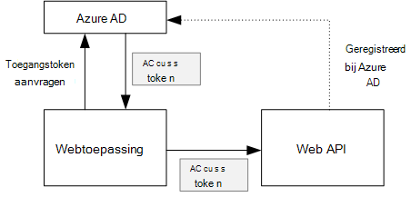
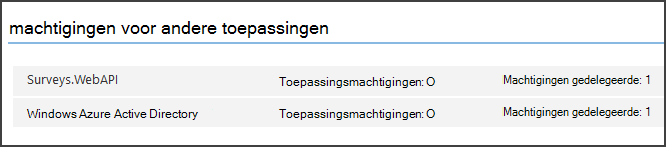

<properties
   pageTitle="Een back-end-web API in een toepassing voor multitenant beveiligen | Microsoft Azure"
   description="Hoe u een back-end-web API beveiligt"
   services=""
   documentationCenter="na"
   authors="MikeWasson"
   manager="roshar"
   editor=""
   tags=""/>

<tags
   ms.service="guidance"
   ms.devlang="dotnet"
   ms.topic="article"
   ms.tgt_pltfrm="na"
   ms.workload="na"
   ms.date="06/02/2016"
   ms.author="mwasson"/>

# <a name="securing-a-backend-web-api-in-a-multitenant-application"></a>Een back-end-web API in een toepassing voor multitenant beveiligen

[AZURE.INCLUDE [pnp-header](../../includes/guidance-pnp-header-include.md)]

In dit artikel maakt [deel uit van een reeks]. Er is ook een volledige [voorbeeldtoepassing] waarop deze reeks.

De toepassing [De enquêtes] gebruikt een back-end-web API voor het beheren van CRUD-bewerkingen op onderzoek. Bijvoorbeeld wanneer een gebruiker op 'Mijn enquêtes', verzendt de webtoepassing een HTTP-aanvraag op het web API:

```
GET /users/{userId}/surveys
```

Het web API geeft als resultaat een JSON-object:

```
{
  "Published":[],
  "Own":[
    {"Id":1,"Title":"Survey 1"},
    {"Id":3,"Title":"Survey 3"},
    ],
  "Contribute": [{"Id":8,"Title":"My survey"}]
}
```

Het web API kan geen anonieme aanvragen, zodat de web-app moet worden geverifieerd OAuth 2 vruchtdragende tokens gebruiken.

> [AZURE.NOTE] Dit is een scenario servers. De toepassing maakt geen AJAX oproepen aan de API vanuit de browserclient.

Er zijn twee belangrijke mogelijkheden:

- Gedelegeerd gebruikers-id. De webtoepassing verifieert met de gebruikers id.
- Toepassings-id. De webtoepassing verifieert met de klant-ID, OAuth2 client referentie stroom gebruiken.

De toepassing Tailspin implementeert gedelegeerde gebruikers-id. Dit zijn de belangrijkste verschillen:

**Gedelegeerd gebruikers-id**

- De dragertoken verzonden op het web API bevat de gebruikers-id.
- Het web API beslissingen autorisatie op basis van de gebruikers-id.
- De webtoepassing moet 403 (niet toegestaan) fouten vanaf het web API, afhandelen, indien de gebruiker is niet geautoriseerd een actie wordt uitgevoerd.
- Meestal de webtoepassing nog steeds zorgt ervoor dat sommige autorisatiebeslissingen die betrekking hebben op de gebruikersinterface, zoals weergeven of verbergen van gebruikersinterface-elementen).
- De web-API kan potentieel worden gebruikt door niet-vertrouwde clients, zoals een JavaScript-toepassing of een clienttoepassing native.

**Toepassings-id**

- Het web API krijgt geen informatie over de gebruiker.
- Het web API uitvoeren geen eventuele autorisatie op basis van de gebruikers-id. Alle autorisatiebeslissingen zijn aangebracht door de webtoepassing.  
- De web-API kan niet worden gebruikt door een niet-vertrouwde client (JavaScript of systeemeigen clienttoepassing).
- Deze methode is mogelijk iets eenvoudiger willen implementeren, omdat er geen autorisatie-logica in de Web-API.

In beide benadering moet de webtoepassing een toegangstoken, dat wil zeggen de referenties die nodig zijn om te bellen van het web API ophalen.

- Voor gedelegeerd gebruikers-id moet het token afkomstig zijn uit het IDP, die een token namens de gebruiker kan verlenen.

- Voor de referenties van de client, mogelijk een toepassing het token krijgen van de IDP of een eigen token server host. (Maar niet een token server schrijven helemaal; gebruiken een uitgebreid geteste framework zoals [IdentityServer3].) Als u met Azure AD verifiëren, moet het is raadzaam het toegangstoken ophalen van Azure AD, ook niet met client referentie stroom.

De rest van dit artikel wordt ervan uitgegaan dat de toepassing verifieert met Azure AD.



## <a name="register-the-web-api-in-azure-ad"></a>Het web API registreren in Azure AD

In de volgorde voor Azure AD te geven van een dragertoken voor het web API, moet u enkele dingen die u in Azure AD configureren.

1. Op [het web API in Azure AD registreren].

2. De client-ID van de web-app toevoegen aan de manifest van de web API-toepassing, in de `knownClientApplications` eigenschap. Zie [de Toepassingsmanifesten bijwerken].

3. [De web-toepassing machtigen om te bellen van het web API].

  In de beheerportal Azure, kunt u twee soorten machtigingen instellen: "Machtigingen van toepassing" voor toepassings-id (client referentie stroom) of "gedelegeerde machtigingen' voor gedelegeerd gebruikers-id.

  

## <a name="getting-an-access-token"></a>Een toegangstoken ophalen

Voordat u het web API, krijgt de webtoepassing een access token van Azure AD. In een .NET-toepassing, gebruikt u de [Azure AD verificatie bibliotheek (ADAL) voor .NET][ADAL].

In de stroom van de code in de OAuth 2 autorisatie vervangt de toepassing een autorisatiecode voor een toegangstoken. De volgende code wordt ADAL gebruikt om het toegangstoken. Deze code wordt aangeroepen tijdens de `AuthorizationCodeReceived` gebeurtenis.

```csharp
// The OpenID Connect middleware sends this event when it gets the authorization code.   
public override async Task AuthorizationCodeReceived(AuthorizationCodeReceivedContext context)
{
    string authorizationCode = context.ProtocolMessage.Code;
    string authority = "https://login.microsoftonline.com/" + tenantID
    string resourceID = "https://tailspin.onmicrosoft.com/surveys.webapi" // App ID URI
    ClientCredential credential = new ClientCredential(clientId, clientSecret);

    AuthenticationContext authContext = new AuthenticationContext(authority, tokenCache);
    AuthenticationResult authResult = await authContext.AcquireTokenByAuthorizationCodeAsync(
        authorizationCode, new Uri(redirectUri), credential, resourceID);

    // If successful, the token is in authResult.AccessToken
}
```

Hier volgen de verschillende parameters die u nodig hebt:

- `authority`. Afgeleid van de tenant-ID van de gebruiker aangemeld. (Niet de tenant-ID van de SaaS-provider)  
- `authorizationCode`. de auth-code die u hebt ontvangen weer van de IDP.
- `clientId`. De webtoepassing client-ID.
- `clientSecret`. Geheim van de client van de webtoepassing.
- `redirectUri`. De omleiding URI dat u hebt ingesteld voor OpenID verbinding maken. Dit is waar de IDP belt terug met het token.
- `resourceID`. De App-ID URI van het web API, die u hebt gemaakt wanneer u het web API geregistreerd in Azure AD
- `tokenCache`. Een object dat in de cache de access-tokens opgeslagen. Zie [Token caching].

Als `AcquireTokenByAuthorizationCodeAsync` is geslaagd, ADAL slaat het token. Later, kunt u het token opvragen uit de cache door te bellen AcquireTokenSilentAsync:

```csharp
AuthenticationContext authContext = new AuthenticationContext(authority, tokenCache);
var result = await authContext.AcquireTokenSilentAsync(resourceID, credential, new UserIdentifier(userId, UserIdentifierType.UniqueId));
```

waar `userId` is de object-ID van de gebruiker, die is gevonden in de `http://schemas.microsoft.com/identity/claims/objectidentifier` claimen.

## <a name="using-the-access-token-to-call-the-web-api"></a>Het toegangstoken gebruiken om te bellen van het web API

Nadat u het token hebt, verzendt u deze in de koptekst van de verificatie van de HTTP-aanvragen op het web API.

```
Authorization: Bearer xxxxxxxxxx
```

De volgende methode toestelnummer van de configuratietoepassing enquêtes wordt de koptekst autorisatie ingesteld op een HTTP-aanvraag, met de klasse **HttpClient** .

```csharp
public static async Task<HttpResponseMessage> SendRequestWithBearerTokenAsync(this HttpClient httpClient, HttpMethod method, string path, object requestBody, string accessToken, CancellationToken ct)
{
    var request = new HttpRequestMessage(method, path);
    if (requestBody != null)
    {
        var json = JsonConvert.SerializeObject(requestBody, Formatting.None);
        var content = new StringContent(json, Encoding.UTF8, "application/json");
        request.Content = content;
    }

    request.Headers.Authorization = new AuthenticationHeaderValue("Bearer", accessToken);
    request.Headers.Accept.Add(new MediaTypeWithQualityHeaderValue("application/json"));

    var response = await httpClient.SendAsync(request, ct);
    return response;
}
```

> [AZURE.NOTE] Zie [HttpClientExtensions.cs].

## <a name="authenticating-in-the-web-api"></a>Verificatie in het web API

Het web API heeft voor de verificatie van de dragertoken. In ASP.NET Core 1.0, kunt u de [Microsoft.AspNet.Authentication.JwtBearer] [ JwtBearer] pakket. Dit pakket biedt middleware waarmee de toepassing voor het ontvangen van vruchtdragende tokens OpenID verbinding maken.

De middleware registreren in uw web API `Startup` class.

```csharp
app.UseJwtBearerAuthentication(options =>
{
    options.Audience = "[app ID URI]";
    options.Authority = "https://login.microsoftonline.com/common/";
    options.TokenValidationParameters = new TokenValidationParameters
    {
        //Instead of validating against a fixed set of known issuers, we perform custom multi-tenant validation logic
        ValidateIssuer = false,
    };
    options.Events = new SurveysJwtBearerEvents();
});
```

> [AZURE.NOTE] Zie [Startup.cs].

- **Publiek**. Hiermee kunt u de URL van de App-ID voor het web API, die u hebt gemaakt wanneer u het web API geregistreerd met Azure AD instellen.
- **Certificeringsinstantie**. Voor een multitenant-toepassing, stelt u dit op `https://login.microsoftonline.com/common/`.
- **TokenValidationParameters**. Ingesteld voor een toepassing multitenant **ValidateIssuer** op onwaar. Dat betekent dat de toepassing wordt de uitgever valideren.
- **Gebeurtenissen** is een klasse dat is afgeleid van **JwtBearerEvents**.

### <a name="issuer-validation"></a>Uitgever gegevensvalidatie

Valideer de token uitgever in de gebeurtenis **JwtBearerEvents.ValidatedToken** . De uitgever wordt in het claimen "iss" verzonden.

Klik in de toepassing enquêtes verwerken niet het web API [tenant aanmelding]. Daarom er alleen op wordt gecontroleerd of de uitgever zich al in de databasetoepassing. Als dit niet het geval is, wordt deze genereert een uitzondering, waardoor de verificatie mislukt.

```csharp
public override async Task ValidatedToken(ValidatedTokenContext context)
{
    var principal = context.AuthenticationTicket.Principal;
    var tenantManager = context.HttpContext.RequestServices.GetService<TenantManager>();
    var userManager = context.HttpContext.RequestServices.GetService<UserManager>();
    var issuerValue = principal.GetIssuerValue();
    var tenant = await tenantManager.FindByIssuerValueAsync(issuerValue);

    if (tenant == null)
    {
        // the caller was not from a trusted issuer - throw to block the authentication flow
        throw new SecurityTokenValidationException();
    }
}
```

> [AZURE.NOTE] Zie [SurveysJwtBearerEvents.cs].

U kunt ook de gebeurtenis **ValidatedToken** moet [claims-transformatie]. Houd er rekening mee dat het claims rechtstreeks afkomstig is van Azure AD, dus als de webtoepassing de transformaties claims hebt gedaan, die niet zichtbaar zijn in de dragertoken dat het web API ontvangt.

## <a name="authorization"></a>Autorisatie

Zie [autorisatie voor rollen gebaseerde en op basis van een resource]voor een algemene discussie van autorisatie[Authorization]. 

De middleware JwtBearer omgaat met de antwoorden autorisatie. Bijvoorbeeld als u wilt beperken tot geverifieerde gebruikers van een actie controller, gebruikt u de atrribute **[autoriseren]** en **JwtBearerDefaults.AuthenticationScheme** opgeven als het schema voor de verificatie:

```csharp
[Authorize(ActiveAuthenticationSchemes = JwtBearerDefaults.AuthenticationScheme)]
```

Hiermee wordt een 401 statuscode geretourneerd als de gebruiker niet is geverifieerd.

Geef de naam van het beleid in het kenmerk **[autoriseren]** als u wilt een actie controller beperken door authorizaton beleid:

```csharp
[Authorize(Policy = PolicyNames.RequireSurveyCreator)]
```

Hiermee wordt een 401 statuscode als de gebruiker niet is geverifieerd, en 403 als de gebruiker is geverifieerd, maar niet gemachtigd. Het beleid bij het opstarten hebt geregistreerd:

```csharp
public void ConfigureServices(IServiceCollection services)
{
    services.AddAuthorization(options =>
    {
        options.AddPolicy(PolicyNames.RequireSurveyCreator,
            policy =>
            {
                policy.AddRequirements(new SurveyCreatorRequirement());
                policy.AddAuthenticationSchemes(JwtBearerDefaults.AuthenticationScheme);
            });
    });
}
```

## <a name="next-steps"></a>Volgende stappen

- Lees het volgende artikel in deze reeks: [cache access tokens in een toepassing voor multitenant][token cache]

<!-- links -->
[ADAL]: https://msdn.microsoft.com/library/azure/jj573266.aspx
[JwtBearer]: https://www.nuget.org/packages/Microsoft.AspNet.Authentication.JwtBearer
[een reeks hoort]: guidance-multitenant-identity.md
[Tailspin enquêtes]: guidance-multitenant-identity-tailspin.md
[IdentityServer3]: https://github.com/IdentityServer/IdentityServer3
[Het web API registreren in Azure AD]: https://github.com/Azure-Samples/guidance-identity-management-for-multitenant-apps/blob/master/docs/running-the-app.md#register-the-surveys-web-api
[Bijwerken van de Toepassingsmanifesten]: https://github.com/Azure-Samples/guidance-identity-management-for-multitenant-apps/blob/master/docs/running-the-app.md#update-the-application-manifests
[De web-toepassing machtigen om te bellen van het web API]: https://github.com/Azure-Samples/guidance-identity-management-for-multitenant-apps/blob/master/docs/running-the-app.md#give-the-web-app-permissions-to-call-the-web-api
[Caching van beveiligingstokens]: guidance-multitenant-identity-token-cache.md
[HttpClientExtensions.cs]: https://github.com/Azure-Samples/guidance-identity-management-for-multitenant-apps/blob/master/src/Tailspin.Surveys.Common/HttpClientExtensions.cs
[Startup.cs]: https://github.com/Azure-Samples/guidance-identity-management-for-multitenant-apps/blob/master/src/Tailspin.Surveys.WebAPI/Startup.cs
[tenant registreren]: guidance-multitenant-identity-signup.md
[SurveysJwtBearerEvents.cs]: https://github.com/Azure-Samples/guidance-identity-management-for-multitenant-apps/blob/master/src/Tailspin.Surveys.WebAPI/SurveyJwtBearerEvents.cs
[op claims-transformatie]: guidance-multitenant-identity-claims.md#claims-transformations
[Authorization]: guidance-multitenant-identity-authorize.md
[van voorbeeldtoepassing]: https://github.com/Azure-Samples/guidance-identity-management-for-multitenant-apps
[token cache]: guidance-multitenant-identity-token-cache.md
