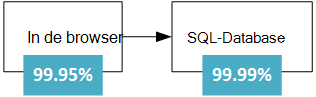
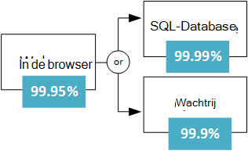
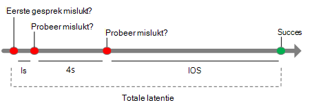
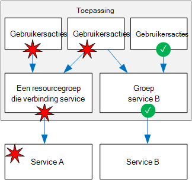
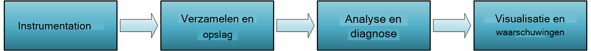

<properties
   pageTitle="Ontwerpen robuuste toepassingen | Microsoft Azure"
   description="Het maken van krachtige toepassingen in Azure wordt aangegeven, voor hoge beschikbaarheid herstel."
   services=""
   documentationCenter="na"
   authors="MikeWasson"
   manager="christb"
   editor=""
   tags=""/>

<tags
   ms.service="guidance"
   ms.devlang="na"
   ms.topic="article"
   ms.tgt_pltfrm="na"
   ms.workload="na"
   ms.date="08/18/2016"
   ms.author="mwasson"/>
   
# Ontwerpen robuuste toepassingen voor Azure

In een gedistribueerd systeem gebeurt er fouten. Hardware kan mislukken. Het netwerk kunt tijdelijke fouten hebben. Zelden, een hele service of de regio waarnemen een onderbreking, maar ook die moeten worden gepland. 

Samenstellen van een betrouwbare toepassing in de cloud is anders dan het bouwen van een betrouwbare toepassing in de instelling voor een onderneming.  Terwijl u in het verleden u mogelijk hebt aangeschaft hoger-end hardware pas uit te breiden, in een omgeving cloud u moet schalen af in plaats van omhoog. Kosten voor cloud-omgevingen worden gehouden met behulp van de rol hardware laag. In plaats van de nadruk op fouten te voorkomen en optimaliseren van 'gemiddelde tijd tussen fouten', in de nieuwe omgeving wordt de focus verplaatst "verstaan afstemmen met herstellen." Het doel is om te minimaliseren de invloed van een fout.

In dit artikel geeft een overzicht van het maken van krachtige toepassingen in Microsoft Azure. Deze begint met een definitie van de term *tolerantie* en gerelateerde concepten. Klik hierin een proces voor het tolerantie, met een gestructureerde benadering via de levensduur van een toepassing ontwerpen en implementeren, implementatie en bewerkingen te bereiken.

## Wat is tolerantie?

**Tolerantie** is de mogelijkheid om te herstellen van fouten en blijven functioneren. Het is niet over de fouten *te vermijden* , maar *reageert* op fouten in een manier die wordt downtime of gegevensverlies voorkomen. Het doel van tolerantie is om terug te keren van de toepassing naar een volledig functioneel status na een storing.

Twee belangrijke aspecten van tolerantie zijn beschikbaarheid en herstel.

- **Beschikbaarheid** (HA) is de mogelijkheid van de toepassing in orde zijn, zonder aanzienlijk uitvaltijd blijven uitvoeren. Door "orde zijn," betekent we dat de toepassing is heeft gereageerd, en kunnen gebruikers verbinding maken met de toepassing en interactief mee werken.  

- **Problemen oplossen** (DR) is de mogelijkheid om te herstellen uit niet vaak voorkomen maar belangrijkste incidenten: tijdelijke, schaal fouten, zoals service-onderbreking die van invloed is op een volledige regio. Herstel bevat back-up van gegevens en archivering en eventueel handmatig acties, zoals een database terugzetten vanuit back-up. 

Een manier om na te denken over HA versus DR is dat DR wordt gestart wanneer de invloed van een storing groter is dan de mogelijkheid van het ontwerp HA afgehandeld. Bijvoorbeeld krijgt verschillende VMs achter een taakverdeling plaatsen beschikbaarheid als één VM mislukt, maar niet als ze allemaal tegelijk mislukt. 

Wanneer u een toepassing moeten robuuste ontwerpt, moet u meer informatie over de vereisten van uw beschikbaarheid. Hoeveel downtime acceptabel is? Dit is deels een functie van de kosten. Hoeveel kost inbegrepen uw bedrijf? Hoeveel moet u investeren in de toepassing uiterst beschikbaar maken? U moet ook definiëren wat betekent dit voor de toepassing kan worden gecontroleerd. Is de toepassing, bijvoorbeeld 'omlaag' als een klant een order kunt indienen, maar het systeem niet kan worden verwerkt in de normale tijdsperiode?

Een andere algemene term is **bedrijfscontinuïteit** (BC), de mogelijkheid om uit te voeren van essentiële zakelijke functies tijdens en na een noodgevallen. BC bestaat uit de gehele bewerking van het bedrijf, zoals fysieke faciliteiten, personen, communicatie, transport, en IT. In dit artikel we zojuist zijn gericht op cloud-toepassingen, maar flexibiliteit plannen moet worden uitgevoerd in de context van de algehele BC vereisten. 

## Proces voor het bereiken van tolerantie

Tolerantie is niet een invoegtoepassing. Er moet worden ontworpen in het systeem en besteedt werkwijze. Dit is een algemene model te volgen:

1.  **Definiëren** uw vereisten voor beschikbaarheid, op basis van de zakelijke behoeften

2.  **Ontwerp** van de toepassing voor tolerantie. Begin met een architectuur die volgt op bewezen procedures en klikt u vervolgens de mogelijke fout wordt verwezen in die architectuur identificeren.

3.  Strategieën **implementeren** detecteren en herstellen van fouten. 

4.  **Test** de uitvoering door simuleren fouten en afgedwongen failovers activeert. 

5.  **Deploy** de toepassing in bedrijf met behulp van een betrouwbare, herhaald processen. 

6.  **Monitor met een** van de toepassing op fouten opsporen. Door te controleren het systeem, kunt u de status van de toepassing meter en reageren op incidenten zo nodig. 

7.  **Reageren** op als er incidenten waarvoor handmatige acties.

In de rest van dit artikel wordt besproken elk van deze stappen uitgebreider.

## Uw vereisten voor tolerantie definiëren

Tolerantie planning begint met de zakelijke behoeften. Hier volgen enkele benaderingen voor na te denken over tolerantie in deze termen.

### Ontleden door werkbelasting

Veel cloud-oplossingen bestaan uit meerdere toepassing werkbelasting. De term "werkbelasting' in deze context betekent dat een aparte mogelijkheid of computing taak logisch kan worden gescheiden van andere taken, wat betreft bedrijven logica en gegevens opslagvereisten. Een e-commerce-app kan bijvoorbeeld de volgende werkbelastingen:

- Bladeren en zoek een productcatalogus.

- Maak en orders bijhouden.

- Aanbevelingen bekijken.

Deze werkbelastingen mogelijk hebben verschillende vereisten voor beschikbaarheid, schaalbaarheid consistentie van de gegevens, herstel en dergelijke. Klik nogmaals ziet hierna u zakelijke beslissingen.

Bedenk ook gebruikspatronen. Zijn er bepaalde kritieke perioden wanneer het systeem beschikbaar moet zijn? Bijvoorbeeld kan geen een btw-indiening-service omlaag gaan rechts voordat de deadline indiening; een video streaming service moet blijven tijdens een gebeurtenis groot sports. enzovoort. Tijdens de kritieke perioden wellicht overtollige implementaties tussen verschillende regio's, zodat de toepassing mislukken kan als één regio is mislukt. Een meerdere landen/regio-implementatie is echter meer dure, zodat u minder kritieke momenten, de toepassing in één regio uitvoeren mogelijk.  

### RTO en vrijgegeven Productieorder

De doelstellingen voor twee belangrijke aandachtspunten worden de herstel tijd doelstelling en herstel punt doelstelling:

- **Herstel tijd doelstelling** (RTO) is de maximale aanvaardbaar tijd die een toepassing kunt na een incident niet beschikbaar zijn. Als uw RTO 90 minuten is, kunt u moet de toepassing op actief binnen 90 minuten vanaf het begin van een noodgevallen herstellen. Als u een erg laag RTO hebt, kunt u mogelijk een tweede implementatie waarop continu stand-by, ter bescherming tegen een regionale storing behouden.

- **Herstel wijst u doelstelling** (Vrijgegeven Productieorder) is de maximale duur van verlies van gegevens die tijdens een noodgevallen acceptabel is. Bijvoorbeeld als u opslag van gegevens in één database, met geen herhaling naar andere databases, en maak per uur back-ups, kunt u verliezen snel aan de uren van gegevens. 

RTO en vrijgegeven Productieorder zijn de vereisten voor bedrijven. Een andere algemene metrisch is **ondertussen herstellen** (MTTR), het gemiddelde tijd die nodig is voor het herstellen van de toepassing na een storing. MTTR is een empirische feit over een systeem. Als MTTR groter is dan de RTO, klikt u vervolgens treedt een fout in het systeem een onderbreking niet acceptabel bedrijven omdat deze niet mogelijk om te herstellen van het systeem binnen de gedefinieerde RTO. 

### Sla 's

In Azure wordt aangegeven, de [Service Level Agreement] [ sla] (SLA) wordt beschreven hoe Microsoft verplichtingen voor beschikbaarheid en connectiviteit. Als de SLA voor een bepaalde service 99,9% is, betekent dit dat u de service kan worden gecontroleerd 99,9% van de tijd kan verwachten.

> [AZURE.NOTE] De SLA Azure bevat ook bepalingen voor het verkrijgen van een creditcard service als de SLA is voldaan, samen met specifieke definities van "beschikbaarheid" voor elke service. Deze aspecten van de SLA fungeert als een beleid afdwingen. 

U moet uw eigen doel serviceovereenkomsten voor elke werkbelasting definiëren in uw oplossing. Een SLA manier kunt u de reden dan ook over de architectuur en of de architectuur voldoet aan de vereisten voor bedrijven. Bijvoorbeeld als een werkbelasting 99,99% beschikbaarheid vereist, maar is afhankelijk van een service met een SLA 99,9%, kan deze service een enkel-de punt risico niet in het systeem. Een verhaal is een fallback pad geval de service is mislukt of andere maatregelen herstellen uit een fout in die service. 

De volgende tabel bevat de cumulatieve inbegrepen voor verschillende SLA niveaus. 

| SLA     | Uitvaltijd per week | Downtime per maand | Uitvaltijd per jaar |
|---------|-------------------|--------------------|-------------------|
| 99%     | 1.68 uur        | 7,2 uur          | 3,65 dagen         |
| 99,9%   | 10,1 minuten      | 43,2 minuten       | 8.76 uur        |
| 99.95%  | 5 minuten         | 21,6 minuten       | 4,38 uur        |
| 99,99%  | 1.01 minuten      | 4.32 minuten       | 52.56 minuten     |
| 99,999% | 6 seconden         | 25,9 seconden       | 5.26 minuten      |

Betere beschikbaarheid is natuurlijk nog beter, alles wat dat waarden gelijk zijn. Maar als u streven voor meer 9s, de kosten en complexiteit die niveau van de beschikbaarheid van te bereiken in omvang groeit. Een beschikbaarheid van 99,99% equivalent ongeveer 5 minuten van totale downtime per maand. Is het meer zegt dan de extra complexiteit en de kosten vijf 9s bereiken? Het antwoord, is afhankelijk van de vereisten voor bedrijven. 

Hier volgen enkele andere overwegingen bij het definiëren van een SLA:

- Als u wilt bereiken vier 9 van (99,99%), vertrouwen u waarschijnlijk niet op tussenkomst herstellen uit de fouten. De toepassing zelf diagnose en automatisch herstel. 

- Na vier 9 van, is lastige bijvoorbeeld snel genoeg vinden om te voldoen aan de SLA.

- Denk na over de tijdvenster die uw SLA is ten opzichte van de. Hoe kleiner het venster, hoe kleiner de marges. Waarschijnlijk niet dat u uw SLA wat betreft beschikbaarheid uur of per dag te bepalen. 

### Samengestelde serviceovereenkomsten

Houd rekening met een web-app voor het App-Service waarmee gegevens worden geschreven met Azure SQL-Database. Op het moment van deze schrijven hebben deze Azure services de volgende serviceovereenkomsten:

- App-Service-WebApps = 99.95%

- SQL-Database = 99,99%

Wat is de maximale downtime die u zou verwachten van deze toepassing? Als een van beide service is mislukt, wordt de hele toepassing mislukt. In het algemeen is de kans van elke service mislukte is onafhankelijke, zodat de samengestelde SLA van deze toepassing 99.95% x 99,99 is % = 99.94%. Die lager is dan de afzonderlijke serviceovereenkomsten, die geen mailserver is verwonderlijk, omdat een toepassing die is gebaseerd op meerdere services heeft meer mogelijke fout wordt verwezen. 

Aan de andere kant, kunt u de samengestelde SLA verbeteren door onafhankelijke fallback paden maken. Bijvoorbeeld als SQL-Database is niet beschikbaar is, zet u transacties in wachtrij, later worden verwerkt.

Met dit ontwerp is de toepassing nog steeds beschikbaar, zelfs als deze geen verbinding met de database maken. Echter mislukt als de database en de wachtrij niet op hetzelfde moment. Het verwachte percentage van de tijd voor een tegelijk fout is 0,0001 × 0,001, dus de samengestelde SLA voor dit gecombineerde pad  

- Database of wachtrij = 1,0 &minus; (0,0001 &times; 0,001) = 99,99999%

De totale samengestelde SLA luidt als volgt:

- Web app en (database of wachtrij) = 99.95% &times; 99,99999% = ~99.95%

Er zijn echter compromissen nodig zijn deze methode. De toepassingslogica is complexer, u betaalt voor de wachtrij en er mogelijk gegevens consistentie problemen u rekening moet houden.

**SLA voor meerdere landen/regio-implementaties**. Een andere HA techniek is implementeren van de toepassing in meer dan één regio en gebruiken van Azure verkeer Manager worden uitgevoerd als de toepassing in één regio mislukt. Voor een implementatie twee regio, wordt de samengestelde SLA als volgt berekend. 

Laat *N* , worden de samengestelde SLA voor de toepassing die zijn geïmplementeerd in één regio. De verwachte kans dat de toepassing niet in beide regio's tegelijkertijd is (1 &minus; N) &times; (1 &minus; N). Daarom

- SLA gecombineerd voor beide regio's = 1 &minus; (1 &minus; N) (1 &minus; N) = N + (1 &minus; N) N

Ten slotte, dan is er nog in de [SERVICEOVEREENKOMST voor verkeer Manager][tm-sla]. Op het wanneer dit artikel is geschreven, is de SLA voor verkeer Manager SLA 99,99%.

- Samengestelde SLA = 99,99% &times; (SLA gecombineerd voor beide regio's)

Een meer gedetailleerde informatie is dat storing worden overgenomen niet onmiddellijk uitgevoerd is, hetgeen kan leiden tot enkele downtime tijdens een een overname. Zie [verkeer Manager eindpunt controle en failover][tm-failover].

Het berekende SLA getal is een handige basislijn, maar deze niet de hele verhaal wordt verteld over beschikbaarheid. Een toepassing kunt vaak zonder problemen wanneer een niet-kritieke pad mislukt afnemen. Houd rekening met een toepassing met een catalogus boeken. Als de toepassing geen de miniatuurafbeelding voor het voorblad kunt ophalen, kan dit een tijdelijke aanduiding voor afbeelding weergegeven. In dat geval wordt verbroken om de afbeelding niet verkleinen van de toepassing beschikbaarheid, hoewel dit van invloed is op de gebruikerservaring.  

## Voor tolerantie ontwerpen

Tijdens de ontwerpfase, moet u een fout modus analyse (FMA) uitvoeren. Het doel van een FMA is mogelijk punten van mislukt identificeren en Definieer hoe de toepassing wordt reageren op deze fouten.

- Hoe wordt de toepassing detecteren van dit type mislukt?

- Hoe wordt de toepassing reageren op dit type mislukt?

- Hoe wordt u Meld u aan en controleren van dit type mislukt? 

Zie voor meer informatie over het proces FMA met specifieke aanbevelingen voor Azure [Azure tolerantie richtlijnen: analyse op modus][fma].

### Voorbeeld van de fout modi en detectie strategie identificeren

**Potentieel:** Bellen met een externe webservice / API.

| Fout-modus | Detectie strategie |
|--------------|--------------------|
| Service is niet beschikbaar | HTTP-5xx |
| Beperken | HTTP 429 (te veel aanvragen) | 
| Verificatie | HTTP 401 (geverifieerd) | 
| Traag antwoord | Aanvraag treedt er een time-out |

## Strategieën voor tolerantie

Deze sectie bevat een overzicht van enkele veelvoorkomende tolerantie strategieën. De meeste van deze artikelen zijn niet beperkt tot een bepaalde technologie. De beschrijvingen in deze sectie zijn bedoeld om samen te vatten het algemene idee achter elke methode, met koppelingen naar verdere lezen.

### Probeer tijdelijke fouten

Tijdelijke fouten kunnen worden veroorzaakt door tijdelijke verlies van netwerkconnectiviteit, een decoratieve database-verbinding of een time-out voor als een service bezet is. Een tijdelijke storing kan vaak worden opgelost door gewoon te opnieuw het verzoek. Voor veel Azure-services implementeert de client SDK automatische nieuwe pogingen, op een manier die transparant voor de beller; Zie [richtlijnen voor specifieke services opnieuw][retry-service-specific guidance].

Er wordt een nieuwe pogingen toegevoegd aan de totale latentie. Te veel mislukte aanvragen kunnen ook leiden tot een vertraging veroorzaken, zoals aanvragen in behandeling verzameld in de wachtrij. Deze geblokkeerde aanvragen mogelijk kritieke systeembronnen zoals geheugen, threads, databaseverbindingen, enzovoort, die kan leiden tot fouten trapsgewijze houdt. U kunt dit voorkomen, de vertraging tussen nieuwe pogingen vergroten en het totale aantal mislukte aanvragen beperken.

Zie voor meer informatie, [Probeer patroon][retry-pattern].

### Taakverdeling alle werkstroomexemplaren

Voor schaalbaarheid moet een toepassing voor de cloud kunnen af met het toevoegen van meer exemplaren wilt verkleinen. Tolerantie, verbeterd deze benadering ook omdat beschadigd exemplaren afmelden bij de draaiing nemen kunnen.  

Bijvoorbeeld:

- Twee of meer VMs achter een taakverdeling plaatsen. De taakverdeling verkeer naar alle VMs. Zie [meerdere VMs op Azure voor schaalbaarheid en beschikbaarheid uitgevoerd][ra-multi-vm].

- De schaal van een app Azure App-Service in meerdere exemplaren. App-Service automatisch laden saldi alle werkstroomexemplaren. Zie [eenvoudige webtoepassing][ra-basic-web].

- [Azure verkeer Manager] gebruiken[ tm] verkeer over een reeks eindpunten verdelen.

### Gegevens repliceren

Repliceren van gegevens is een algemene strategie voor het afhandelen van tijdelijke fouten in een gegevensopslag. Veel opslagruimte technologieën bieden ingebouwde herhaling, inclusief Azure SQL-Database, DocumentDB en Apache Cassandra.  

Het is belangrijk kunt u zowel het lezen en schrijven paden. Afhankelijk van de opslagtechnologie, kunnen er meerdere schrijfbare replica's, of een enkel schrijfbare replica en meerdere alleen-lezen partities. 

Voor hoogste beschikbaarheid, kunnen replica's in meerdere regio's worden geplaatst. Hierdoor wordt echter vergroot de latentie als u wilt repliceren van de gegevens. Repliceren tussen regio's wordt gewoonlijk gedaan asynchroon waarin betekent een eventuele consistentie model en potentieel gegevensverlies als een replica mislukt. 

### Probleemloos afnemen

Als een service is mislukt en er geen failover pad, is het mogelijk dat de toepassing kunnen afnemen zonder problemen, op een manier waarmee u nog steeds een aanvaardbaar gebruikerservaring. Bijvoorbeeld:

- Zet een werkitem op een wachtrij, later wordt uitgevoerd. 

- Een geschatte retourwaarde 

- Lokaal gebruikt in cache opgeslagen gegevens. 

- De gebruiker een foutbericht weergegeven. (Deze optie is dan de toepassing niet meer reageert op aanvragen betere.)

### Grote aantallen gebruikers beperken

Een klein aantal gebruikers maken soms overtollige laden. Die kunt meteen invloed hebben op andere gebruikers, waardoor de algehele beschikbaarheid van de toepassing.

Wanneer een één client veel aanvragen, kan de toepassing de client beperken voor een bepaalde periode. Tijdens de periode bandbreedteregeling weigert de toepassing sommige of alle van het aanvragen van die client (afhankelijk van de exacte bandbreedteregeling strategie). De drempel voor beperken mogelijk hangt af van de klant servicelaag. 

Beperken betekent niet dat de client is per se met schadelijke bedoelingen fungeert. Dit betekent eenvoudigweg dat de client heeft overschreden hun service.  In sommige gevallen mogelijk een consumenten consistente overschrijdt hun quotum of anders gedragen zich onjuist. In dat geval wellicht verder gaan en de gebruiker blokkeert. Dit is gewoonlijk gedaan door het blokkeren van een API-sleutel of een IP-adresbereiken.

Zie voor meer informatie [Beperken patroon][throttling-pattern].

### Een stroomonderbreker gebruiken  

Het patroon stroomonderbreker kunt voorkomen dat een toepassing net zo vaak probeert een bewerking die is waarschijnlijk mislukt. De overeenkomstige is een fysieke stroomonderbreker, een schakeloptie waarmee de stroom van huidige bij een circuitlijnen is overbelasting wordt onderbroken.

De functie circuitlijnen terugloopt oproepen naar een service. Deze heeft drie staten:

- **Gesloten**. Dit is de status Normaal. De functie circuitlijnen verzendt aanvragen naar de service en een item wordt het aantal recente fouten bijgehouden. Als het aantal fouten een drempel binnen een bepaalde periode overschrijdt, schakelt u de functie circuitlijnen naar de Open stand. 

- **Openen**. In deze status mislukt de stroomonderbreker onmiddellijk alle aanvragen, zonder het bellen van de service. De toepassing moet een pad risicobeperking, zoals het lezen van gegevens uit een replica of gewoon een fout wordt geretourneerd voor de gebruiker gebruiken. Wanneer de stroomonderbreker naar openen overschakelt, begint een timer. Als de timer verloopt, schakelt u de functie circuitlijnen naar de Half open stand.

- **Half open**. In deze modus kunt de functie circuitlijnen een beperkt aantal aanvragen leest u over naar de service. Als ze worden voltooid, wordt uitgegaan van de service worden hersteld en schakelt u de functie circuitlijnen terug naar de gesloten stand. Anders weer de omgezet in de Open stand. De staat Half Open voorkomen dat een herstellen service ineens wordt overstelpt met aanvragen.

Zie voor meer informatie [Stroomonderbreker patroon][circuit-breaker-pattern].

### Gebruik laden effenen geeft pieken in het verkeer

Toepassingen kunnen plotselinge pieken in het verkeer, welke services op de backend kunt overspoeld optreden. Als een back-end-service kan niet op aanvragen snel genoeg is reageert, kan het ertoe leiden dat aanvragen voor wachtrij (back-up) of leiden tot de service de toepassing te beperken.

U kunt dit voorkomen, kunt u een wachtrij als buffer. Als er een nieuw werkitem, in plaats van de backend-service onmiddellijk bellen wachtrijen de toepassing een werkitem asynchroon wordt uitgevoerd. De wachtrij fungeert als een buffer die maakt vloeiend af pieken in het selectievakje laden. 

Zie voor meer informatie, [op basis van wachtrijen laden herverdelen patroon][load-leveling-pattern].

### Kritieke resources isoleren 

Fouten in één subsysteem kunnen soms trapsgewijs, fouten veroorzaken in andere delen van de toepassing. Dit kan gebeuren als een fout enkele bronnen, zoals threads of sockets veroorzaakt, niet te krijgen vrijgemaakt webinhoud, waardoor uitgeputte bronnen. 

U kunt dit voorkomen, kunt u een systeem partitioneren in geïsoleerd groepen, zodat een fout in één partition niet buiten het gehele systeem werking. Deze methode is wel het patroon schot.

Voorbeelden:

- Een database, bijvoorbeeld door tenant--partitioneren en wijst u een aparte groep exemplaren van de web-server voor elke partition.  
- Gebruik afzonderlijke groepen te isoleren oproepen naar andere services. Hiermee voorkomt u dat trapsgewijze fouten als een van de services mislukt. Zie de Netflix [Hystrix bibliotheek]voor een voorbeeld,[hystrix].

- [Containers] gebruiken[ containers] de bronnen die beschikbaar zijn voor een bepaalde subsysteem beperken. 

### Veredelingsprodukten transacties toepassen 

Een veredelingsprodukten is een transactie die ongedaan maken van de effecten van een andere voltooide transactie.

In een gedistribueerd systeem, kan het lastig erg om te bereiken sterke transacties consistentie. Veredelingsprodukten transacties zijn een manier om de consistentie bereiken met behulp van een reeks kleinere, afzonderlijke transacties die bij elke stap ongedaan kan worden.

Als u wilt een reis van het adresboek, mogelijk een klant bijvoorbeeld Reserveer een auto, een hotel ruimte en een vlucht. Als een van deze stappen mislukt, mislukt de gehele bewerking. In plaats van probeert te gebruiken van één gedistribueerde transactie voor het hele betrekking heeft, kunt u een veredelingsprodukten transactie voor elke stap definiëren. Bijvoorbeeld als u een auto-reservering ongedaan, wilt u de reservering annuleren. Voordat u de hele bewerking voltooien, voert een coördinator elke stap. Als een stap mislukt, geldt de coördinator veredelingsprodukten transacties om alle stappen die zijn voltooid ongedaan te maken. 

Voor meer informatie raadpleegt u [Verwacht transactie patroon][compensating-transaction-pattern]. 

## Testen op tolerantie

In het algemeen wordt niet kunt u tolerantie testen op dezelfde manier dat u de functionaliteit van de toepassing testen (per eenheidstests enzovoort uitgevoerd). U moet in plaats daarvan testen hoe de werklast end-to-end uitvoert omstandigheden mislukt, die per definitie niet alle van de tijd optreden.

Testen, maakt deel uit van een iteratieve proces. Testen van de toepassing, het resultaat meten, analyseren en corrigeren van fouten die het resultaat en herhaal het proces.

**Foutenstructuuranalyse webweergave testen**. Test de tolerantie van het systeem op fouten, door werkelijke fouten activeert of door ze simuleren. Hier volgen enkele veelvoorkomende scenario's van de fout uit om te testen:

- VM exemplaren afgesloten.

- Loopt vast processen.

- Certificaten zijn verlopen.

- Toegangstoetsen wijzigen.

- De DNS-service op domeincontrollers afgesloten.

- Beschikbare systeembronnen, zoals RAM of aantal threads beperken.

- Ontkoppelen schijven.

- Implementeer deze opnieuw een VM.

Meet de tijden herstel en controleer of dat ze overeenkomen met uw vereisten voor bedrijven. Combinaties van mislukt modi, ook testen. Zorg ervoor dat er geen trapsgewijs en worden verwerkt in een geïsoleerd manier.

Dit is een andere reden waarom is het belangrijk om het analyseren van mogelijke fouten tijdens de ontwerpfase. Het resultaat van deze analyse moet invoeritems in uw testplan.

**Laden testen**. Test de toepassing met een functie zoals [Visual Studio Team Services] laden[ vsts] of [Apache JMeter] [ jmeter] laden testen is essentieel voor fouten die alleen plaatsvinden onder laden, zoals de backend-database wordt ondergesneeuwd identificeren of service beperken. Test piek laden, gebruikt u productiegegevens of synthetische gegevens die lijkt op zoals productiegegevens mogelijk. Het doel is om te zien hoe de toepassing zich gedraagt echte omstandigheden.   

## Robuuste implementatie

Wanneer een toepassing wordt geïmplementeerd op productie, zijn updates een mogelijke bron van fouten. In het ongunstigste geval is, kan een ongeldige update downtime veroorzaken. U kunt dit voorkomen, moet de implementatieproces overzichtelijk en herhaald. Implementatie bevat de inrichting van Azure resources, toepassingscode wordt geïmplementeerd en configuratie-instellingen toepassen. Een update kan gebruikmaakt van alle drie of een subset. 

De essentieel komma is dat handmatige implementaties vatbaar voor fout. Daarom is het raadzaam om een geautomatiseerd, idempotency is ingeschakeld-proces dat u kunt uitvoeren op aanvraag en opnieuw uitvoeren als er iets is mislukt. 

- Resourcemanager sjablonen gebruiken om de inrichting van Azure resources automatiseren.

- Gebruik van de [Configuratie van Azure automatisering gewenst] [ dsc] (DSC) VMs configureren.

- Gebruik een geautomatiseerde implementatie-proces voor toepassing programmacode.

Twee concepten gerelateerd aan robuuste implementatie zijn *infrastructuur als code* en *onveranderlijke infrastructuur*.

- **Infrastructuur als code** is de oefening van het gebruik van de code voor het inrichten en configureren van infrastructuur. Infrastructuur als code kunt op een declaratieve manier of een dwingende benadering (of een combinatie van beide). Resourcemanager-sjablonen zijn een voorbeeld van een declaratieve manier. PowerShell-scripts zijn een voorbeeld van een dwingende aanpak.

- **Onveranderlijke-infrastructuur** is het principe dat niet mag u infrastructuur wijzigen nadat deze wordt geïmplementeerd op productie. U kunt anders krijgen in de modus waarin ad-hoc wijzigingen zijn toegepast, zodat u weet precies wat gewijzigd en moeilijk te reden over het systeem. 

Een andere vraag wordt uitgelegd hoe implementeren van een toepassingsupdate van. Het is raadzaam te technieken zoals blauw-groen implementatie of kokospalm versies, waarin ten zeerste push-updates in gecontroleerd manier om te minimaliseren mogelijke effecten uit een ongeldige implementatie.

- [Blauw-groen implementatie] [ blue-green] is een techniek waar u een update in een afzonderlijk productieomgeving van de configuratietoepassing live implementeren. Nadat u de implementatie valideert, gaan de verkeer zoekresultaten omleiden naar een bijgewerkte versie Bijvoorbeeld Azure App Service Web Apps Hiermee kunt u dit met [tijdelijke sleuven][staging-slots]. 

- [Kokospalm releases] [ canary-release] zijn vergelijkbaar met blauw-groen-implementatie. In plaats van al het verkeer overschakelen naar de bijgewerkte versie, implementeren u van de update naar een klein percentage van gebruikers, door een gedeelte van het verkeer zoekresultaten omleiden naar de nieuwe implementatie. Als er een probleem is, wordt een back-uitschakelen en terugkeren naar de oude implementatie. Routeert anders meer verkeer naar de nieuwe versie, totdat deze 100% van verkeer krijgt.

Welke methode die u neemt, zorg ervoor dat u naar de laatst bekende goede-implementatie terugkeren kunt, geval de nieuwe versie niet werkt. Ook als er fouten optreden, moet het mogelijk uit de toepassingslogboeken welke versie u de fout veroorzaakt. 

## Controle- en diagnostische gegevens

Controle- en diagnostische gegevens zijn essentieel voor tolerantie. Als iets mislukt, moet u weten dat dit is mislukt en u inzicht krijgen in de oorzaak van het probleem moet. 

Een grootschalige gedistribueerd systeem Monitoring vormt een belangrijke uitdaging. Denk na over een toepassing die compatibel is met een paar tientallen VMs, dat is niet praktische Meld u aan bij elke VM, één voor één, en er tot en met logboekbestanden, wilt een probleem op te lossen. Daarnaast wordt is het aantal exemplaren VM waarschijnlijk niet statisch. VMs krijgen toegevoegd en wordt verwijderd als de schaal van de toepassing in-en uitfaden en af en toe een exemplaar kan mislukken en moet door de service. Daarnaast een toepassing voor de normale cloud mogelijk meerdere gegevensopslag (Azure opslag, SQL-Database, DocumentDB, cache bestand Vgx.) gebruik en een enkel gebruikersactie mogelijk meerdere subsystemen beslaan. 

U kunt het proces voor controle en diagnostische gegevens zien als een pijplijn met verschillende verschillende fasen:

- **Instrumentation**. De onbewerkte gegevens voor controle en hulpprogramma's voor diagnose afkomstig van een verscheidenheid aan bronnen, inclusief toepassingslogboeken aan de, server weblogs, OS prestatie-items, databaselogboeken en diagnostische gegevens in het Azure platform ingebouwd. Meest Azure services is een diagnostisch hulpprogramma-functie die u gebruiken kunt om te bepalen de oorzaak van problemen.

- **Verzamelen en opslag**. De onbewerkte gegevens kan plaatsvinden op verschillende locaties en met verschillende bestandsindelingen (Logboeken voor het traceren van toepassing, Performance-items, IIS-logboeken). Deze verschillende bronnen zijn verzameld, samengevoegde en besteedt betrouwbare opslag.

- **Analyse en diagnose**. Nadat de gegevens worden samengevoegd, kan dat worden geanalyseerd, om te kunnen problemen oplossen en geef een algemeen overzicht van de status van de toepassing.

- **Visualisatie en waarschuwingen**. In deze fase, wordt telemetriegegevens gepresenteerd in zodanig dat een operator snel, trends of problemen vinden kunt. Voorbeeld van dashboards opnemen of e-mailwaarschuwingen.  

Cmdlets voor controle is anders dan detectie is mislukt. Bijvoorbeeld uw toepassing een tijdelijk mogelijk detecteren fout en probeer het opnieuw, waardoor er geen downtime. Maar deze moet ook de bewerking opnieuw, zodat u de fout rente, controleren kunt om te krijgen een algemene beschrijving van de toepassingsstatus. 

Toepassingslogboeken zijn een belangrijk gegevensbron diagnostische gegevens. Hier volgen enkele aanbevolen procedures voor logboekregistratie van toepassing:

- Meld u aan productie. Er anders verloren inzicht wanneer u deze nodig optimaal hebt helemaal tijde.

- Gebeurtenissen aan de servicegrenzen van de. Een correlatie-ID die naar een service doorloopt bevatten. Als X transactie tot en met meerdere services en op een van deze mislukt doorloopt, de correlatie-ID die u helpen pinpoint waarom de transactie is mislukt.

- Gebruik semantic logboekregistratie, ook wel genoemd gestructureerde vastleggen. Ongestructureerde logboeken kunnen u moeilijk te automatiseren de verbruik en de analyse van de logboekgegevens, dat nodig bij het op schaal van de cloud is.

- Asynchroon logboekregistratie gebruiken. Anders de logboekregistratie-systeem zelf kan leiden tot de toepassing mislukt, door de oorzaak van aanvragen voor het back-up, terwijl ze blokkeren in afwachting van een gebeurtenis logboekregistratie schrijven.

- Logboekregistratie van toepassing is niet hetzelfde als de controle. Controle kan worden gedaan voor naleving of regulatorische redenen. Zo controlerecords moeten zijn voltooid en het is niet acceptible naar eventuele tijdens het verwerken van transacties. Als een toepassing controle, moet deze afzonderlijk in Diagnostische logboekregistratie worden bewaard. 

Zie [richtlijnen voor controle- en diagnostische hulpprogramma's]voor meer informatie over cmdlets voor controle en diagnostische hulpprogramma's,[monitoring-guidance].

## Handmatige mislukt antwoorden

Vorige gedeelten zijn gericht op geautomatiseerde herstelstrategieën, die kritiek voor maximale beschikbaarheid zijn. Soms tussenkomst is echter wel vereist.

- **Waarschuwingen**. Controleer uw toepassing voor waarschuwingssignalen waarvoor proactief tussenkomst mogelijk. Bijvoorbeeld als u ziet dat SQL-Database of DocumentDB consistente bandbreedte regelen voor uw toepassing, mogelijk moet u de capaciteit van de database te vergroten of optimaliseren van uw query's. In dit voorbeeld, hoewel de toepassing mogelijk de bandbreedteregeling fouten transparant, verwerken moet uw telemetrielogboek nog steeds verhogen een melding in, zodat u kunt opvolgen door.  

- **Handmatige failover**. Sommige systemen niet automatisch uitgevoerd en een handmatige failover vereisen. 

- **De gereedheid van de operationele testen**. Als uw toepassing wordt overgenomen door een secundaire regio, moet u een toets operationele gereedheid uitvoeren voordat u niet terug naar de primaire regio. De test moet controleren of de primaire regio orde en klaar voor het ontvangen van verkeer opnieuw.

- **Gegevens consistentiecontrole**. Als u een fout, gebeurt in een gegevensopslag, kunnen er gegevensinconsistenties wanneer de store weer beschikbaar, met name als de gegevens is gerepliceerd. 

- **Terugzetten uit back-up**. Als SQL-Database een regionale storing ervaringen, kunt u bijvoorbeeld de database uit de meest recente back-up geografische-herstellen.

Een document en test uw gaan. Zijn geschreven procedures voor een handmatige stappen, zoals handmatige failover upgegevens terugzetten uit een back-ups, enzovoort. 

## Overzicht

In dit artikel hebt bekeken tolerantie compleet vanuit het perspectief van, benadrukken enkele van de unieke uitdagingen van de cloud. Het gaat hierbij om de gedistribueerde aard van cloud computing, het gebruik van de rol hardware en de aanwezigheid van transience netwerkfouten.

Dit zijn de belangrijkste wordt verwezen in dit artikel verlaten:

- Tolerantie leidt tot betere beschikbaarheid en lagere ondertussen herstellen uit de fouten. 

- Belangengroepen tolerantie in de cloud is een andere set technieken van traditionele on-premises implementatie-oplossingen die zijn vereist. 

- Tolerantie plaatsvindt niet per ongeluk. Er moet worden ontworpen en ingebouwd vanaf het begin.

- Tolerantie raakt elk onderdeel van de levenscyclus van de toepassing, van planning en codering aan bewerkingen.

- Test en monitor!

## Volgende stappen

- [Controlelijst voor tolerantie] [ resiliency-checklist] bevatten een aanbevelingen die kunnen u plannen voor een groot aantal mislukt modi die kunnen optreden.

- [Fout bij modus analyse] [ fma] (FMA) is een proces voor het samenstellen van tolerantie in een systeem, door te identificeren mogelijke fout wordt verwezen. Als uitgangspunt voor uw FMA-proces bevat in dit artikel een catalogus van mogelijke fout modi en hun beperkingen. 

- U vindt hier aanvullende informatie: [technische ondersteuning van Azure tolerantie](../resiliency/resiliency-technical-guidance.md) 

<!-- links -->

[blue-green]: http://martinfowler.com/bliki/BlueGreenDeployment.html
[canary-release]: http://martinfowler.com/bliki/CanaryRelease.html
[circuit-breaker-pattern]: https://msdn.microsoft.com/library/dn589784.aspx
[compensating-transaction-pattern]: https://msdn.microsoft.com/library/dn589804.aspx
[containers]: https://en.wikipedia.org/wiki/Operating-system-level_virtualization
[dsc]: https://azure.microsoft.com/documentation/articles/automation-dsc-overview/
[fma]: guidance-resiliency-failure-mode-analysis.md
[hystrix]: http://techblog.netflix.com/2012/11/hystrix.html
[jmeter]: http://jmeter.apache.org/
[load-leveling-pattern]: https://msdn.microsoft.com/library/dn589783.aspx
[monitoring-guidance]: https://azure.microsoft.com/documentation/articles/best-practices-monitoring/
[ra-basic-web]: https://azure.microsoft.com/documentation/articles/guidance-web-apps-basic/
[ra-multi-vm]: https://azure.microsoft.com/documentation/articles/guidance-compute-multi-vm/
[resiliency-checklist]: guidance-resiliency-checklist.md
[retry-pattern]: https://msdn.microsoft.com/library/dn589788.aspx
[retry-service-specific guidance]: https://azure.microsoft.com/documentation/articles/best-practices-retry-service-specific/
[sla]: https://azure.microsoft.com/support/legal/sla/
[staging-slots]: https://azure.microsoft.com/documentation/articles/guidance-web-apps-basic/
[throttling-pattern]: https://msdn.microsoft.com/library/dn589798.aspx
[tm]: https://azure.microsoft.com/services/traffic-manager/
[tm-failover]: https://azure.microsoft.com/documentation/articles/traffic-manager-monitoring/
[tm-sla]: https://azure.microsoft.com/support/legal/sla/traffic-manager/v1_0/
[vsts]: https://www.visualstudio.com/features/vso-cloud-load-testing-vs.aspx
