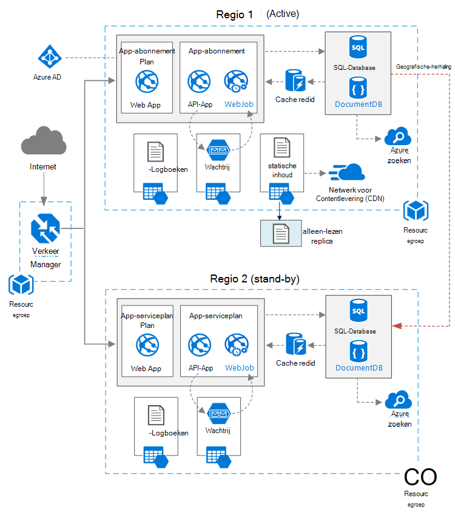

<properties
   pageTitle="Webtoepassing met hoge beschikbaarheid | Azure verwijzing architectuur | Microsoft Azure"
   description="Aanbevolen architectuur voor een webtoepassing met hoge beschikbaarheid, uitgevoerd op Microsoft Azure."
   services="app-service,app-service\web,sql-database" 
   documentationCenter="na"
   authors="MikeWasson"
   manager="roshar"
   editor=""
   tags=""/>

<tags
   ms.service="guidance"
   ms.devlang="na"
   ms.topic="article"
   ms.tgt_pltfrm="na"
   ms.workload="na"
   ms.date="06/27/2016"
   ms.author="mwasson"/>

# <a name="azure-reference-architecture-web-application-with-high-availability"></a>Azure verwijzing architectuur: webtoepassing met hoge beschikbaarheid

[AZURE.INCLUDE [pnp-RA-branding](../../includes/guidance-pnp-header-include.md)]

In dit artikel leest een aanbevolen architectuur voor een webtoepassing met hoge beschikbaarheid, uitgevoerd op Microsoft Azure. De architectuur die is gebaseerd op [Azure verwijzing architectuur: verbeteren van de schaalbaarheid in een webtoepassing][guidance-web-apps-scalability].

## <a name="architecture-diagram"></a>Architectuurdiagram



Deze architectuur is gebaseerd op zoals wordt weergegeven in [de schaalbaarheid van in een webtoepassing][guidance-web-apps-scalability]. De belangrijkste verschillen zijn:

- **Primaire en secundaire regio's**. Deze architectuur gebruikt twee regio's om te rekenen op grotere beschikbaarheid. De toepassing wordt geïmplementeerd op elke regio's. Tijdens normale bewerkingen wordt netwerkverkeer doorgestuurd naar de primaire regio. Maar als die niet beschikbaar is, wordt verkeer wordt doorgestuurd naar de tweede regio. Zie voor meer informatie over failover, [failover beheren](#managing-failover-and-failback).

- **Azure verkeer Manager**. [Verkeer Manager] [ traffic-manager] stuurt verzoeken voor oproepen naar de primaire regio. Als de die regio-toepassing niet beschikbaar is, wordt wordt verkeer Manager overgenomen door de tweede regio. 

- **Geografische herhaling** van de SQL-Database en DocumentDB.

## <a name="recommendations"></a>Aanbevelingen

### <a name="regional-pairing"></a>Regionale koppelen

Elke Azure regio is gekoppeld aan een ander gebied in de dezelfde Geografie. Kies in het algemeen, regio's in dezelfde regionale twee (bijvoorbeeld Oost Amerikaans 2 en Central US). Voordelen van het doet zijn:

- Als er een globaal storing, wordt herstel van ten minste één regio afmelden bij elk paar prioriteit.
- Geplande Azure systeemupdates worden geïmplementeerd op gepaarde regio's opeenvolging, als u wilt mogelijk uitvaltijd.
- In de meeste gevallen bevinden paren binnen de dezelfde Geografie, om te voldoen aan de hand van vestigingsplaats gegevens.

Zorg er wel voor dat beide regio's ondersteuning bieden voor alle van de Azure services die u nodig hebt voor uw toepassing. Zie [Services per regio][services-by-region]. Zie voor meer informatie over regionale paren, [bedrijven bedrijfscontinuïteit en noodgevallen herstel (BCDR): Azure gepaarde t-toets regio's][regional-pairs].

### <a name="resource-groups"></a>Resourcegroepen

Houd rekening met de regio primaire, secundaire regio en verkeer Manager plaatsen in afzonderlijke [resourcegroepen][resource groups]. Hiermee kunt u de resources die zijn geïmplementeerd in elke regio als één set beheren &mdash; u kunt deze afzonderlijk implementeren, verwijderen van de implementatie, enzovoort. 

### <a name="traffic-manager"></a>Verkeer Manager

**Routering.** Verkeer Manager ondersteunt verschillende [routeren algoritmen][tm-routing]. Voor de scenario wordt beschreven in dit artikel, gebruikt u _prioriteit_ routering (voorheen _failover_ routering). Met deze instelling stuurt verkeer Manager alle aanvragen naar de primaire regio, tenzij het eindpunt voor dat gebied niet bereikbaar wordt. Op dat moment wordt deze automatisch overgenomen door de tweede regio. Zie [Failover configureren routeren methode][tm-configure-failover].

**Status-test.** Verkeer Manager gebruikt een HTTP (of HTTPS)-test om te controleren van de beschikbaarheid van elk eindpunt. De test biedt verkeer Manager een toets keer/fail voor storing worden overgenomen de tweede regio. Dit werkt door een nieuw vergaderverzoek verzenden naar een opgegeven URL-pad. Als er een niet-200 antwoord binnen een time-out, mislukt de test. Na vier mislukte aanvragen, wordt verkeer Manager het eindpunt wordt gemarkeerd als niet beschikbaar is weergegeven en wordt overgenomen door het andere eindpunt. Zie voor meer informatie [verkeer Manager eindpunt controle en failover][tm-monitoring].

Een aanbevolen om een systeemstatus test-eindpunt dat de algemene status van de toepassing-rapporten maken en dit eindpunt gebruiken voor de systeemstatus-test. Het eindpunt te controleren of kritieke afhankelijkheden zoals de App Service-apps, opslag wachtrij en SQL-Database. De test mogelijk anders een 'goed' eindpunt rapporteren wanneer kritieke onderdelen van de toepassing daadwerkelijk worden verbroken. 

Aan de andere kant, niet gebruikt de systeemstatus-test lagere prioriteit services controleren. Bijvoorbeeld als een e-mailservice uitvalt, de toepassing kunt overschakelen naar een tweede provider of alleen e-mailberichten later te verzenden. De toepassing niet mag waarschijnlijk mislukken in dat geval. Zie voor meer informatie, [Systeemstatus eindpunt Monitoring patroon][health-endpoint-monitoring-pattern].
  
### <a name="sql-database"></a>SQL-Database

Gebruik van de [Actieve geografische-herhaling] [ sql-replication] een leesbare secundair maken in een andere regio. U kunt maximaal vier leesbare secundaire servers hebben. Als de primaire database mislukt, of gewoon moet worden ondernomen offline, kunt u naar een van de secundaire databases. Actieve geografische-replicatie kan worden geconfigureerd voor elke database in een groep elastische database.

### <a name="documentdb"></a>DocumentDB

DocumentDB ondersteunt geografische-replicatie tussen regio's. Één regio is ingesteld als schrijfbare ingevoegd en de anderen alleen-lezen partities komen. 

Als er een regionale storing, kunt u niet door een andere plaats die u wilt schrijven land of de regio te selecteren. De DocumentDB-client SDK worden automatisch verzonden schrijven aanvragen op het huidige gebied schrijven, zodat u niet nodig hebt bij de configuratie van de client na een failover. Zie voor meer informatie, [verdelen gegevens globaal met DocumentDB][docdb-geo]. 

> [AZURE.NOTE] Alle replica deel uitmaakt van dezelfde resourcegroep.

### <a name="storage"></a>Opslag

Gebruik voor Azure-opslag, [leestoegang geografische-redundante opslag] [ ra-grs] (AB-GRS). Met AB-GRS opslag, worden de gegevens worden gerepliceerd naar een secundaire gebied. U hebt alleen-lezen toegang tot de gegevens in de tweede regio, via een afzonderlijke eindpunt. Als er een regionale storing of noodgevallen, kan het team van Azure Storage bepalen om uit te voeren een geografische-failover de tweede regio. Er is geen actie klant is vereist voor deze failover.

Voor de opslag in de wachtrij, maak een back-wachtrij in de tweede regio. Tijdens een overname beschikking de app over de back-wachtrij, totdat de primaire regio weer beschikbaar. Op deze manier de toepassing kan nog steeds verzoeken om nieuwe verwerkt. 

## <a name="availability-considerations"></a>Aandachtspunten voor de beschikbaarheid

Betere beschikbaarheid dan implementeren naar een enkel gebied kan worden verstrekt door een architectuur meerdere landen/regio. Als een regionale storing van invloed is op de primaire regio, kunt u niet de tweede regio. Deze architectuur kunt ook als een afzonderlijke subsysteem van de toepassing mislukt.  
     
Er zijn verschillende algemene benaderingen bij het bereiken van beschikbaarheid in datacenters:      
- Actieve/passieve met warm stand-by. Verkeer gaat naar één regio, terwijl de andere wacht stand-by. De toepassing wordt geïmplementeerd en uitgevoerd in de tweede regio. Beginnen met een kleinere exemplaar aantal op de secundaire Datacenter wellicht en vervolgens af te schalen naar wens. 

- Actieve/passieve koudwatersystemen vereist. De dezelfde, maar toepassing wordt niet geïmplementeerd totdat u nodig hebt voor failover. Deze methode kosten kleiner om uit te voeren, maar worden in het algemeen meer omlaag tijd tijdens een fout. 

- Actief/actief. Beide regio's actief zijn en gelijkmatig verdeeld ertussen. Als één datacenter niet beschikbaar is, wordt deze draaiing uitgeschakeld. 

In dit artikel bevat informatie over actieve/passieve met warm stand-by, met [Azure verkeer Manager] [ traffic-manager] naar route-verkeer naar het gebied. 

### <a name="traffic-manager"></a>Verkeer Manager

Er wordt automatisch verkeer Manager overgenomen als de primaire regio niet beschikbaar is. Wanneer het verkeer Manager wordt overgenomen, is er een periode wanneer de toepassing is en dat kan enkele minuten zijn door clients kunnen niet worden bereikt. Twee factoren van invloed op de totale duur:

- De status-test moet worden gedetecteerd dat de primaire Datacenter niet bereikbaar is geworden.

- DNS-servers moeten de in de cache DNS-records voor het IP-adres, dat afhankelijk van de DNS-time to live (TTL is) bijwerken. De standaard-TTL is 300 seconden (5 minuten), maar u kunt deze waarde configureren bij het maken van het profiel verkeer Manager.

Zie voor meer informatie [Over het verkeer Manager Monitoring][tm-monitoring]. 

Verkeer Manager is een mogelijke fout in het systeem. Als de service is mislukt, clients, geen toegang tot uw toepassing tijdens de downtime. Controleer de [Verkeer Manager SLA][tm-sla], en bepaalt of met verkeer Manager alleen voldoet aan uw vereisten voor bedrijven voor maximale beschikbaarheid. Als dat niet zo is, kunt u een ander verkeer beheeroplossing toevoegen als een failback. Als de Azure verkeer Manager-service niet, wijzigt u de CNAME-records in DNS te laten verwijzen naar de andere verkeer management-service. (Deze stap handmatig moet worden uitgevoerd en uw toepassing nog niet beschikbaar totdat de DNS-wijzigingen worden doorgegeven.) 

### <a name="sql-database"></a>SQL-Database

De herstel punt doelstelling (vrijgegeven Productieorder) en de geschatte hersteltijd (invoegen) voor SQL-Database worden beschreven [hier][sql-rpo]. 

### <a name="storage"></a>Opslag

AB-GRS opslagruimte biedt duurzame opslag, maar het is belangrijk om te begrijpen wat kan gebeuren tijdens een storing: 

- Als een storing opslag plaatsvindt, wordt er een periode wanneer er geen schrijftoegang tot de gegevens. U kunt nog steeds lezen vanuit het secundaire eindpunt tijdens de storing.

- Als een regionale storing of noodgevallen van invloed is op de primaire locatie en de gegevens er kan niet worden hersteld, kan het team van Azure Storage bepalen om uit te voeren een geografische-failover de tweede regio. 

- Gegevensreplicatie van de naar de tweede regio wordt asynchroon uitgevoerd. Als een geografische-failover wordt uitgevoerd, dus gegevensverlies mogelijk, als de gegevens uit het primaire regio kan niet worden hersteld.

- Tijdelijke fouten, zoals een netwerkstoring, wordt een failover opslag niet geactiveerd. Ontwerp uw toepassing moeten robuuste op tijdelijke fouten. Mogelijke oplossingen:

    - Lees uit de secundaire.

    - Tijdelijk overschakelen naar een ander account van de opslagruimte voor nieuwe schrijven bewerkingen (bijvoorbeeld op berichten). 

    - Gegevens uit de secundaire kopiëren naar een ander opslag-account.

    - Verminderde functionaliteit te verlenen tot het systeem terug mislukt.

Voor meer informatie raadpleegt u [Wat u moet doen als er een storing Azure Storage optreedt][storage-outage].

## <a name="managing-failover-and-failback"></a>Failover en foutherstel beheren

### <a name="traffic-manager"></a>Verkeer Manager

Er wordt automatisch verkeer Manager overgenomen als de primaire regio niet beschikbaar is. Standaard mislukt deze ook automatisch terug, als de primaire regio weer beschikbaar.

Wordt aangeraden echter handmatig failback uitvoering, in plaats van de automatisch verbroken terug. Controleer of alle toepassing subsystemen in orde zijn voordat terug verbroken. Anders kunt u een situatie waar de toepassing gespiegeld heen en weer tussen datacenters maken. 

Als u wilt voorkomen dat automatische failback, verlaagt u handmatig de prioriteit van de primaire regio na een gebeurtenis failover. Stel de primaire regio is prioriteit 1 en de secundaire prioriteit 2 is. Na een failover, het primaire gebied in te stellen op prioriteit 3, om te voorkomen dat automatische failback. Wanneer u klaar om terug te schakelen bent, opnieuw instellen van de prioriteit terug naar 1.

De volgende opdrachten bijwerken de prioriteit.

**PowerShell** 

```bat
$endpoint = Get-AzureRmTrafficManagerEndpoint -Name <endpoint> -ProfileName <profile> -ResourceGroupName <resource-group> -Type AzureEndpoints
$endpoint.Priority = 3
Set-AzureRmTrafficManagerEndpoint -TrafficManagerEndpoint $endpoint
```

Zie voor meer informatie, [Azure verkeer Manager Cmdlets][tm-ps].

**Azure CLI**

```bat
azure network traffic-manager endpoint set --name <endpoint> --profile-name <profile> --resource-group <resource-group> --type AzureEndpoints --priority 3
```    

### <a name="sql-database"></a>SQL-Database

Als de primaire database mislukt, voert u een handmatige failover naar de secundaire database. Zie [herstellen van een Azure SQL-Database of failover naar een secundair][sql-failover]. Totdat u niet, blijft de secundaire database alleen-lezen. 


<!-- links -->

[azure-sql-db]: https://azure.microsoft.com/en-us/documentation/services/sql-database/
[docdb-geo]: ../documentdb/documentdb-distribute-data-globally.md
[guidance-web-apps-scalability]: guidance-web-apps-scalability.md
[health-endpoint-monitoring-pattern]: https://msdn.microsoft.com/library/dn589789.aspx
[ra-grs]: ../storage/storage-redundancy.md#read-access-geo-redundant-storage
[regional-pairs]: ../best-practices-availability-paired-regions.md
[resource groups]: ../resource-group-overview.md
[services-by-region]: https://azure.microsoft.com/en-us/regions/#services
[sql-failover]: ../sql-database/sql-database-disaster-recovery.md
[sql-replication]: ../sql-database/sql-database-geo-replication-overview.md
[sql-rpo]: ../sql-database/sql-database-business-continuity.md#sql-database-business-continuity-features
[storage-outage]: ../storage/storage-disaster-recovery-guidance.md
[tm-configure-failover]: ../traffic-manager/traffic-manager-configure-failover-routing-method.md
[tm-monitoring]: ../traffic-manager/traffic-manager-monitoring.md
[tm-ps]: https://msdn.microsoft.com/en-us/library/mt125941.aspx
[tm-routing]: ../traffic-manager/traffic-manager-routing-methods.md
[tm-sla]: https://azure.microsoft.com/en-us/support/legal/sla/traffic-manager/v1_0/
[traffic-manager]: https://azure.microsoft.com/en-us/services/traffic-manager/
