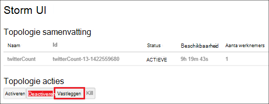

<properties
    pageTitle="Hadoop clusters in met behulp van de portal Azure HDInsight beheren | Microsoft Azure"
    description="Leer hoe u HDInsight-Service beheren. Een cluster HDInsight maken, opent u de interactieve JavaScript-console en open de Hadoop-opdracht-console."
    services="hdinsight"
    documentationCenter=""
    tags="azure-portal"
    authors="mumian"
    manager="jhubbard"
    editor="cgronlun"/>

<tags
    ms.service="hdinsight"
    ms.workload="big-data"
    ms.tgt_pltfrm="na"
    ms.devlang="na"
    ms.topic="article"
    ms.date="09/14/2016"
    ms.author="jgao"/>

# Hadoop clusters in HDInsight beheren met behulp van de Azure-portal

[AZURE.INCLUDE [selector](../../includes/hdinsight-portal-management-selector.md)]

Met behulp van de [Azure portal][azure-portal], kunt u Hadoop clusters maken in Azure HDInsight, Hadoop-gebruikerswachtwoord wijzigen en Remote Desktop Protocol (RDP) inschakelen, zodat u toegang hebt tot de console van de Hadoop-opdracht op het cluster.

De informatie in dit artikel is alleen van toepassing op op basis van het venster HDInsight clusters. Voor informatie over het beheren van Linux gebaseerde clusters, klikt u op de tabkiezer hierboven.

Klik op de tabkiezer voor informatie over het maken van Hadoop clusters in met een ander hulpprogramma HDInsight. 

**Vereisten voor**

Voordat u in dit artikel begint, hebt u het volgende:

- **Een Azure-abonnement**. Zie [Azure krijgen gratis proefversie](https://azure.microsoft.com/documentation/videos/get-azure-free-trial-for-testing-hadoop-in-hdinsight/).
- Een container met Azure Blob storage **azure Storage account** - een HDInsight cluster gebruikt als het standaard-bestandssysteem. Zie voor meer informatie over hoe Azure-blobopslag beschikt u over een naadloze ervaring met HDInsight clusters, [Azure-blobopslag voor gebruik met HDInsight](hdinsight-hadoop-use-blob-storage.md). Zie [hoe u een opslag-Account maken](../storage/storage-create-storage-account.md)voor meer informatie over het maken van een Azure Storage-account.

##Open de Portal

1. Meld u aan bij [https://portal.azure.com](https://portal.azure.com).
2. Nadat u de portal hebt geopend, kunt u het volgende doen:

    - Klik op **Nieuw** in het linkermenu een nieuwe cluster maken:
    
        
    - Klik op **HDInsight Clusters** in het linkermenu.
    
        

    Als **HDInsight** niet wordt weergegeven in het linkermenu, klikt u op **Bladeren**. 

    

##Clusters maken

Zie de instructies voor het maken met behulp van de Portal [clusters HDInsight maken](hdinsight-provision-clusters.md#create-using-the-preview-portal).

HDInsight werkt met een breed Hadoop-onderdelen. Zie [welke versie van Hadoop is in Azure HDInsight](hdinsight-component-versioning.md)voor de lijst van de onderdelen die zijn geverifieerd en ondersteund. U kunt HDInsight aanpassen met behulp van een van de volgende opties:

- Gebruik scriptactie uitvoeren van aangepaste scripts die een cluster clusterconfiguratie wijzigen of aangepaste onderdelen zoals Giraph of Solr installeren kunnen aanpassen. Zie [cluster van HDInsight aanpassen met de actie Script](hdinsight-hadoop-customize-cluster.md)voor meer informatie.
- Gebruik de parameters van de aanpassing cluster in de HDInsight .NET SDK of Azure PowerShell gemaakt. Deze configuratiewijzigingen vervolgens tot en met de levensduur van het cluster blijven behouden en worden niet beïnvloed door cluster knooppunt reimages die Azure platform regelmatig voor onderhoud uitvoert. Zie voor meer informatie over het gebruik van de parameters van de aanpassing cluster [clusters HDInsight maken](hdinsight-provision-clusters.md).
- Sommige systeemeigen Java-onderdelen, zoals Mahout en trapsgewijze, kunnen worden uitgevoerd op het cluster als oppervlak-bestanden. Deze oppervlak-bestanden kunnen worden verdeeld over Azure-blobopslag en bij HDInsight clusters ingediend met Hadoop taak indiening regelingen. Zie [Hadoop verzenden via programmacode taken](hdinsight-submit-hadoop-jobs-programmatically.md)voor meer informatie.

    >[AZURE.NOTE] Als u problemen oppervlak-bestanden met HDInsight clusters implementeert of inbelt oppervlak-bestanden op HDInsight clusters hebt, neemt u contact op met [Microsoft ondersteuning](https://azure.microsoft.com/support/options/).

    > Trapsgewijze wordt niet ondersteund door HDInsight en komt niet in aanmerking voor Microsoft Support. Zie voor lijsten met ondersteunde onderdelen, [Wat is er nieuw in de cluster versies geleverd door HDInsight?](hdinsight-component-versioning.md).

Installatie van aangepaste software op de cluster met behulp van verbinding met extern bureaublad wordt niet ondersteund. Vermijd het opslaan van bestanden op de stations van het hoofd knooppunt, terwijl ze niet verloren als u nodig hebt om de clusters opnieuw te maken. Het is raadzaam om bestanden opslaan op Azure-blobopslag. Blobopslag is permanente.

##Een lijst met en clusters weergeven

1. Meld u aan bij [https://portal.azure.com](https://portal.azure.com).
2. Klik op **HDInsight Clusters** in het linkermenu.
3. Klik op de naam van de cluster. Als de lijst cluster lang is, kunt u filter boven aan de pagina.
4. Dubbelklik op een cluster in de lijst aan de details weergeven.

    **Menu- en essentials**:

    
    
    - U kunt het menu aanpassen door met de rechtermuisknop op een willekeurige plaats in het menu en klik vervolgens op **aanpassen**.
    - **Instellingen** en **Alle instellingen**: Hiermee wordt het blad **Instellingen** voor het cluster, zodat u toegang tot de configuratie van de gedetailleerde informatie voor het cluster weergegeven.
    - **Dashboard**, **Cluster Dashboard** en **URL: dit zijn alle manieren voor toegang tot het dashboard cluster, dat wil Ambari Web voor Linux gebaseerde clusters zeggen. - **Secure Shell **: ziet u de instructies in verbinding maken met de cluster met behulp van Secure Shell (SSH) verbinding.
    - **Schaal Cluster**: Hiermee kunt u het aantal knooppunten werknemer voor dit cluster wijzigen.
    - **Verwijderen**: Hiermee verwijdert u het cluster.
    - **Quickstart ()**: hiermee informatie waarmee u kunt aan de slag met HDInsight.
    - **Gebruikers ()**: Hiermee kunt u machtigingen voor _beheer van de portal_ van deze cluster voor andere gebruikers instellen voor uw abonnement op Azure.
    
        > [AZURE.IMPORTANT] In dit _alleen_ toegang en machtigingen voor dit cluster in de portal van Azure van invloed is op en heeft geen invloed op wie dit kan verbinding maken met of taken aan het cluster HDInsight.
    - **Labels ()**: Tags kunt u instellen sleutel/waardeparen definiëren van een aangepaste taxonomie van uw cloudservices. U mogelijk bijvoorbeeld een __project__met de naam sleutel maakt en gebruikt u een gemeenschappelijke waarde voor alle services dat is gekoppeld aan een specifieke project.
    - **Ambari weergaven**: koppelingen naar Ambari Web.
    
    > [AZURE.IMPORTANT] Als u wilt de services van het cluster HDInsight beheren, moet u Ambari Web of de Ambari REST API gebruiken. Zie voor meer informatie over het gebruik van Ambari [HDInsight beheren clusters Ambari gebruiken](hdinsight-hadoop-manage-ambari.md).

    **Gebruik**:
    
    
    
5. Klik op **Instellingen**.

    

    - **Eigenschappen**: de clustereigenschappen weergeven.
    - **Cluster AAD identiteit**: 
    - **Azure opslag toetsen**: het standaardaccount voor opslagruimte en de sleutel weergeven. Het account opslag is configuratie tijdens het maken van cluster.
    - **Cluster Login**: de cluster HTTP-gebruikersnaam en wachtwoord wijzigen.
    - **Externe Metastores**: de component en Oozie metastores weergeven. De metastores kan alleen worden geconfigureerd tijdens het maken van cluster.
    - **Schaal Cluster**: vergroten en verkleinen het aantal knooppunten werknemer.
    - **Extern bureaublad**: inschakelen en configureren van de gebruikersnaam RDP extern bureaublad (RDP) toegang uitschakelen.  De naam van de RDP-gebruiker is moet verschillen van de HTTP-gebruikersnaam.
    - **Partner record**:
    
    > [AZURE.NOTE] Dit is een algemene lijst met beschikbare instellingen; niet allemaal zijn voor alle clustertypen aanwezig.

6. Klik op **Eigenschappen**:

    De lijsten van de eigenschappen van de volgende handelingen uit:
    
    - **Hostname**: de naam van de Cluster.
    - **Cluster-URL**.
    - **Status**: opnemen afgebroken, aangenomen, ClusterStorageProvisioned, AzureVMConfiguration, HDInsightConfiguration, operationele, uitgevoerd, is opgetreden en verwijdert, hebt verwijderd, time-out, DeleteQueued, DeleteTimedout, DeleteError, PatchQueued, CertRolloverQueued, ResizeQueued, ClusterCustomization
    - **Regio**: Azure locatie. Zie voor een lijst met ondersteunde Azure locaties aan de vervolgkeuzelijst voor de **regio** op [HDInsight prijzen](https://azure.microsoft.com/pricing/details/hdinsight/).
    - **Gegevens die zijn gemaakt**.
    - **Besturingssysteem**: **Windows** of **Linux**.
    - **Type**: Hadoop, HBase, Storm, dus. 
    - **Versie**. Zie [HDInsight versies](hdinsight-component-versioning.md)
    - **Abonnement**: de naam van abonnement.
    - **Abonnements-ID**.
    - **Primaire gegevensbron**. Het Azure Blob storage-account gebruikt als standaardwaarde Hadoop-bestandssysteem.
    - **Werknemer knooppunten prijzen van laag**.
    - **Hoofd knooppunt prijzen laag**.

##Clusters verwijderen

Een cluster verwijderen verwijdert het standaardaccount voor de opslag of uw gekoppelde opslag-accounts. U kunt het cluster opnieuw maken met behulp van de dezelfde opslag-accounts en de dezelfde metastores.

1. Meld u aan bij de [Portal][azure-portal].
2. Klik op **Door alles bladeren** in het linkermenu, klikt u op **HDInsight Clusters**, klikt u op de clusternaam van uw.
3. Klik op **verwijderen** uit het bovenste menu en volg de instructies.

Zie ook [onderbreken/clusters afsluiten](#pauseshut-down-clusters).

##Schaal clusters
De schaal van de functie cluster kunt u wijzigen hoeveel werknemer knooppunten die worden gebruikt door een cluster die wordt uitgevoerd op Azure HDInsight zonder dat u moet het cluster opnieuw te maken.

>[AZURE.NOTE] Alleen clusters met HDInsight versie 3.1.3 of hoger worden ondersteund. Als u niet van de versie van uw cluster weet, kunt u de pagina eigenschappen controleren.  Zie [clusters lijst en weergeven](#list-and-show-clusters).

De gevolgen van het wijzigen van het aantal gegevensknooppunten voor elk type cluster worden ondersteund door HDInsight:

- Hadoop

    U kunt het aantal werknemer knooppunten in een Hadoop-cluster die wordt uitgevoerd zonder die invloed hebben op alle taken in behandeling of wordt uitgevoerd naadloos vergroten. Nieuwe taken kunnen ook worden verzonden, terwijl de bewerking uitgevoerd wordt. Fouten in een schaal bewerking worden zonder problemen worden afgehandeld zodat het cluster altijd functioneel is resteert.

    Wanneer een Hadoop-cluster verkleind door te verminderen van het aantal gegevensknooppunten, worden enkele van de services in het cluster opnieuw gestart. Hierdoor worden alle actief zijn en in behandeling taken aan het einde van de schaal bewerking is mislukt. U kunt de taken echter opnieuw indienen zodra de bewerking voltooid is.

- HBase

    U kunt naadloos toevoegen of verwijderen van knooppunten aan uw cluster HBase terwijl deze wordt uitgevoerd. Regionale Servers worden automatisch verdeeld binnen een paar minuten na het voltooien van de schaal bewerking. U kunt echter ook handmatig de regionale servers verdelen door logboekregistratie in de headnode van cluster en voert u de volgende opdrachten uit in een opdrachtpromptvenster:

        >pushd %HBASE_HOME%\bin
        >hbase shell
        >balancer

    Zie voor meer informatie over het gebruik van de shell HBase,]
- Storm

    U kunt naadloos toevoegen of verwijderen van gegevensknooppunten in uw cluster Storm terwijl deze wordt uitgevoerd. Maar na een succesvolle afronding van de schaal bewerking, moet u naar het vastleggen van de topologie.

    Opnieuw kunt op twee manieren doen:

    * Storm web UI
    * Hulpmiddel opdrachtregel-interface (CLI)

    Raadpleeg de [Apache Storm documentatie](http://storm.apache.org/documentation/Understanding-the-parallelism-of-a-Storm-topology.html) voor meer informatie.

    Het web Storm UI is beschikbaar op het cluster HDInsight:

    

    Hier volgt een voorbeeld van het gebruik van de opdracht CLI de topologie Storm opnieuw uit te:

        ## Reconfigure the topology "mytopology" to use 5 worker processes,
        ## the spout "blue-spout" to use 3 executors, and
        ## the bolt "yellow-bolt" to use 10 executors

        $ storm rebalance mytopology -n 5 -e blue-spout=3 -e yellow-bolt=10

**Aan de nieuwe schaal clusters**

1. Meld u aan bij de [Portal][azure-portal].
2. Klik op **Door alles bladeren** in het linkermenu, klikt u op **HDInsight Clusters**, klikt u op de clusternaam van uw.
3. Klik op **Instellingen** van het bovenste menu en klik vervolgens op **Schaal Cluster**.
4. Voer **het nummer van werknemer knooppunten**. De limiet voor het aantal clusterknooppunt varieert per Azure abonnementen. U kunt contact opnemen met factureringsondersteuning Verhoog deze limiet.  De kostengegevens worden de wijzigingen die u hebt aangebracht in het aantal knooppunten doorgevoerd.

    

##Een pauze invoegen/clusters afsluiten

De meeste Hadoop taken zijn taken die alleen worden uitgevoerd af en toe. Er zijn voor de meeste Hadoop kolomgroepen grote perioden tijd die het cluster niet wordt gebruikt voor de verwerking. Uw gegevens worden opgeslagen in Azure-opslag, met HDInsight, zodat u een cluster veilig verwijderen kunt wanneer deze niet gebruikt wordt.
U wordt ook geheven voor een cluster HDInsight, zelfs wanneer deze niet gebruikt wordt. Aangezien de kosten voor het cluster vaak meer dan de kosten voor opslag zijn, relevant dat is economic clusters verwijderen wanneer ze niet gebruikt worden.

Er zijn tal van manieren kunt u het proces programma:

- Gebruiker Azure gegevens Factory. Zie [Azure HDInsight gekoppelde-Service](../data-factory/data-factory-compute-linked-services.md) en [Transformeren en analyseren met Azure gegevens Factory](../data-factory/data-factory-data-transformation-activities.md) voor op aanvraag en zelf gedefinieerde HDInsight gekoppeld-services.
- Azure PowerShell gebruiken.  Zie [gegevens over vertragingen flight analyseren](hdinsight-analyze-flight-delay-data.md).
- Gebruik Azure CLI. Zie [beheren HDInsight clusters met Azure CLI](hdinsight-administer-use-command-line.md).
- Gebruik HDInsight .NET SDK. Zie [indienen Hadoop-taken](hdinsight-submit-hadoop-jobs-programmatically.md).

Zie [HDInsight prijzen](https://azure.microsoft.com/pricing/details/hdinsight/)voor de prijsinformatie. Zie een cluster verwijderen vanaf de Portal [clusters verwijderen](#delete-clusters)

##Cluster-gebruikersnaam wijzigen

Een cluster HDInsight kunt twee gebruikersaccounts hebben. Het gebruikersaccount van de HDInsight cluster wordt gemaakt tijdens het maakproces. U kunt ook een RDP-gebruikersaccount voor toegang tot het cluster via RDP maken. Zie [Extern bureaublad inschakelen](#connect-to-hdinsight-clusters-by-using-rdp).

**De HDInsight cluster-gebruikersnaam en wachtwoord wijzigen**

1. Meld u aan bij de [Portal][azure-portal].
2. Klik op **Door alles bladeren** in het linkermenu, klikt u op **HDInsight Clusters**, klikt u op de clusternaam van uw.
3. Klik op **Instellingen** van het bovenste menu en klik vervolgens op **Cluster aanmelding**.
4. Als **Cluster login** is ingeschakeld, moet u Klik op **uitschakelen**en klik vervolgens op **inschakelen** voordat u de gebruikersnaam en wachtwoord kunt wijzigen...
4. Wijzig de **Naam van de aanmelding Cluster** en/of het **Wachtwoord voor aanmelden bij Cluster**en klik vervolgens op **Opslaan**.

    

##Toegang verlenen/intrekken

HDInsight clusters bestaan uit de volgende HTTP-webservices (alle van de volgende services hebben RESTful eindpunten):

- ODBC
- JDBC
- Ambari
- Oozie
- Templeton

Deze services zijn standaard verleend voor access. U kunt intrekken/verlenen de toegang van de Azure-portal.

>[AZURE.NOTE] Door de toegang verlenen/intrekken, stelt u de cluster-gebruikersnaam en wachtwoord.

**Naar de HTTP-web services toegang verlenen/intrekken**

1. Meld u aan bij de [Portal][azure-portal].
2. Klik op **Door alles bladeren** in het linkermenu, klikt u op **HDInsight Clusters**, klikt u op de clusternaam van uw.
3. Klik op **Instellingen** van het bovenste menu en klik vervolgens op **Cluster aanmelding**.
4. Als **Cluster login** is ingeschakeld, moet u Klik op **uitschakelen**en klik vervolgens op **inschakelen** voordat u de gebruikersnaam en wachtwoord kunt wijzigen...
6. Voer de nieuwe gebruikersnaam en wachtwoord (respectievelijk) voor het cluster voor **Cluster Login gebruikersnaam** en **Wachtwoord voor aanmelden bij Cluster**.
7. Klik op **Opslaan**.

    

##Het standaardaccount voor de opslag zoeken

Elk cluster HDInsight heeft een standaardaccount voor de opslag. Het standaardaccount voor opslagruimte en de sleutels voor een cluster wordt weergegeven onder **Instellingen**/**Eigenschappen**/**Azure opslag toetsen**. Zie [clusters lijst en weergeven](#list-and-show-clusters).

    
##Zoek de resourcegroep 

In de modus Azure resourcemanager wordt elk cluster HDInsight gemaakt met een Azure resourcegroep. Azure resourcegroep die een cluster behoort wordt weergegeven in:

- De lijst cluster heeft een kolom van het **Resourceveld groep** .
- Cluster **essentiële** tegel.  

Zie [clusters lijst en weergeven](#list-and-show-clusters).
   
##Open de HDInsight Query-console

De HDInsight Query-console bevat de volgende functies:

- **Aan de slag galerie**: Zie [Informatie over Hadoop vanuit de galerie Azure HDInsight aan de slag met](hdinsight-learn-hadoop-use-sample-gallery.md)gebruik van de galerie,.
- **Component Editor**: A grafische gebruikersinterface webservice-interface voor het indienen van component taken.  Zie [query's met de Query-Console component uitvoeren](hdinsight-hadoop-use-hive-query-console.md).

    

- **Overzicht van functies**: Monitor Hadoop-taken.  

    

    Klik op **De naam van de Query** om weer te geven van de taakeigenschappen, **Taak Query**, inclusief details en ** uitvoer van de taak. Ook kunt u zowel de query en de uitvoer downloaden naar uw werkstation.

- **Bestandsbrowser**: bladeren door het standaardaccount voor opslagruimte en de gekoppelde opslag-accounts.

    

    Klik op de schermafbeelding, de **<Account>** type geeft aan het item is een Azure opslag-account.  Klik op de naam van het account om te bladeren in de bestanden.
    
- **Hadoop UI**.

    
    
    Uit **Hadoop UI*, u kunt bestanden bladeren en logboeken controleren. 

- **Garens UI**.

    

##Component query's uitvoeren

Component taken hebt uitgevoerd vanuit de Portal, klik op **Component Editor** in de HDInsight Query-console. Zie [geopende HDInsight Query-console](#open-hdinsight-query-console).

##Monitor taken

Als u wilt controleren taken van de Portal, klikt u op **Werkervaring** in de HDInsight Query-console. Zie [geopende HDInsight Query-console](#open-hdinsight-query-console).

##Bestanden bladeren

Als u wilt bladeren bestanden die zijn opgeslagen in het standaardaccount voor opslagruimte en de gekoppelde opslag-accounts, klikt u op **Bestandsbrowser** in de HDInsight Query-console. Zie [geopende HDInsight Query-console](#open-hdinsight-query-console).

U kunt ook het hulpprogramma **Bladeren in het bestandssysteem** uit de **Hadoop UI** gebruiken in de HDInsight-console.  Zie [geopende HDInsight Query-console](#open-hdinsight-query-console).

##Gebruik van de cluster controleren

Het gedeelte van het __Gebruik__ van het blad met HDInsight cluster wordt informatie over het aantal cores beschikbaar voor uw abonnement voor gebruik met HDInsight, alsmede het aantal cores toegewezen aan deze cluster en hoe ze worden toegewezen voor de knooppunten binnen deze cluster. Zie [clusters lijst en weergeven](#list-and-show-clusters).

> [AZURE.IMPORTANT] Als u wilt controleren van de services van het cluster HDInsight, moet u Ambari Web of de Ambari REST API gebruiken. Zie voor meer informatie over het gebruik van Ambari, [HDInsight beheren clusters met Ambari](hdinsight-hadoop-manage-ambari.md)

##Open Hadoop-gebruikersinterface

Als u wilt het cluster bewaken, het bestandssysteem en logboeken controleren, klikt u op **Hadoop-gebruikersinterface** in de HDInsight Query-console. Zie [geopende HDInsight Query-console](#open-hdinsight-query-console).

##Garens UI openen

Wilt garens gebruikersinterface gebruiken, klikt u **Garens UI** in de HDInsight Query-console. Zie [geopende HDInsight Query-console](#open-hdinsight-query-console).

##Verbinding maken met behulp van RDP clusters

De referenties voor de cluster die u hebt opgegeven bij het maken, wordt er toegang geven aan de pagina services op het cluster, maar niet aan het cluster zelf via Extern bureaublad. U kunt Extern bureaublad-toegang inschakelen als u een cluster inrichten of na een cluster is ingericht. Zie [cluster HDInsight maken](hdinsight-provision-clusters.md)voor de instructies over het inschakelen van extern bureaublad bij maken.

**Extern bureaublad inschakelen**

1. Meld u aan bij de [Portal][azure-portal].
2. Klik op **Door alles bladeren** in het linkermenu, klikt u op **HDInsight Clusters**, klikt u op de clusternaam van uw.
3. Klik op **Instellingen** van het bovenste menu en klik vervolgens op **Extern bureaublad**.
4. Voer **Verloopt op**, **Extern bureaublad-gebruikersnaam** en **Extern bureaublad wachtwoord**en klik vervolgens op **inschakelen**.

    

    De standaardwaarden voor verloopt op is een week.
> [AZURE.NOTE] U kunt ook de HDInsight .NET SDK extern bureaublad inschakelen voor een cluster. Gebruikt u de methode **EnableRdp** op het object HDInsight-client op de volgende wijze: **-client. EnableRdp (clusternaam, locatie, "rdpuser", "rdppassword", DateTime.Now.AddDays(6))**. U kunt op dezelfde manier als u wilt uitschakelen van extern bureaublad op het cluster, **-client gebruiken. DisableRdp (clusternaam, locatie)**. Zie voor meer informatie over deze methoden, [HDInsight .NET SDK verwijzing](http://go.microsoft.com/fwlink/?LinkId=529017). Dit geldt alleen voor HDInsight clusters waarop Windows.

**Verbinding maken met een cluster met behulp van RDP**

1. Meld u aan bij de [Portal][azure-portal].
2. Klik op **Door alles bladeren** in het linkermenu, klikt u op **HDInsight Clusters**, klikt u op de clusternaam van uw.
3. Klik op **Instellingen** van het bovenste menu en klik vervolgens op **Extern bureaublad**.
4. Klik op **verbinding maken** en volg de instructies. Als u verbinding maken is uitgeschakeld, moet u deze eerst inschakelen. Controleer of de extern bureaublad-gebruikersnaam en wachtwoord.  U kunt de gebruikersreferenties Cluster niet gebruiken.

##Hadoop-opdrachtregel openen

Als u wilt verbinden met het cluster met behulp van extern bureaublad en gebruik de opdracht Hadoop, moet u eerst ingeschakeld extern bureaublad toegang tot het cluster zoals is beschreven in de vorige sectie.

**Een Hadoop-opdrachtregel openen**

1. Verbinding maken met het cluster met extern bureaublad.
8. Vanaf het bureaublad, dubbelklik op **de opdrachtregel Hadoop**.

    ![HDI. HadoopCommandLine][image-hadoopcommandline]

    Zie voor meer informatie over Hadoop-opdrachten, [Hadoop opdrachten verwijzing](http://hadoop.apache.org/docs/current/hadoop-project-dist/hadoop-common/CommandsManual.html).

In de vorige schermafbeelding bevat de mapnaam het versienummer Hadoop is ingesloten. Het versienummer kunnen gewijzigd op basis van de versie van de geïnstalleerde het cluster Hadoop-onderdelen. U kunt Hadoop-omgevingsvariabelen gebruiken om te verwijzen naar deze mappen. Bijvoorbeeld:

    cd %hadoop_home%
    cd %hive_home%
    cd %hbase_home%
    cd %pig_home%
    cd %sqoop_home%
    cd %hcatalog_home%
    
##Volgende stappen
U hebt geleerd hoe u een cluster HDInsight maken met behulp van de Portal en hoe u het openen van het hulpprogramma voor de Hadoop in dit artikel. Meer informatie raadpleegt u de volgende artikelen:

* [Beheren via PowerShell Azure HDInsight](hdinsight-administer-use-powershell.md)
* [HDInsight met Azure CLI beheren](hdinsight-administer-use-command-line.md)
* [HDInsight clusters maken](hdinsight-provision-clusters.md)
* [Via een programma Hadoop taken indienen](hdinsight-submit-hadoop-jobs-programmatically.md)
* [Aan de slag met Azure HDInsight](hdinsight-hadoop-linux-tutorial-get-started.md)
* [Welke versie van Hadoop is in Azure HDInsight?](hdinsight-component-versioning.md)

[azure-portal]: https://portal.azure.com
[image-hadoopcommandline]: ./media/hdinsight-administer-use-management-portal/hdinsight-hadoop-command-line.png "Hadoop-opdrachtregel"
