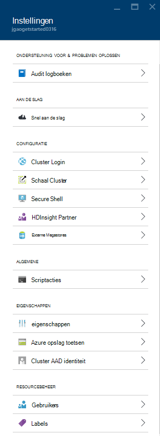

<properties
    pageTitle="Hadoop Linux gebaseerde clusters in HDInsight met behulp van Azure portal beheren | Microsoft Azure"
    description="Informatie over het maken en beheren met behulp van de portal Azure HDInsight Linux gebaseerde-clusters."
    services="hdinsight"
    documentationCenter=""
    authors="mumian"
    manager="jhubbard"
    editor="cgronlun"
    tags="azure-portal"/>

<tags
    ms.service="hdinsight"
    ms.workload="big-data"
    ms.tgt_pltfrm="na"
    ms.devlang="na"
    ms.topic="article"
    ms.date="08/10/2016"
    ms.author="jgao"/>

#Hadoop clusters in HDInsight beheren met behulp van de Azure-portal

[AZURE.INCLUDE [selector](../../includes/hdinsight-portal-management-selector.md)]

Met behulp van de [Azure portal][azure-portal], kunt u Linux gebaseerde clusters in Azure HDInsight beheren. Gebruik de tabkiezer voor informatie over het maken van Hadoop clusters in met een ander hulpprogramma HDInsight. 

**Vereisten voor**

Voordat u in dit artikel begint, hebt u het volgende:

- **Een Azure-abonnement**. Zie [Azure krijgen gratis proefversie](https://azure.microsoft.com/documentation/videos/get-azure-free-trial-for-testing-hadoop-in-hdinsight/).

##Open de Portal

1. Meld u aan bij [https://portal.azure.com](https://portal.azure.com).
2. Nadat u de portal hebt geopend, kunt u het volgende doen:

    - Klik op **Nieuw** in het linkermenu een nieuwe cluster maken:
    
        
    - Klik op **HDInsight Clusters** in het linkermenu voor een overzicht van de bestaande clusters
    
        

        Als **HDInsight** niet wordt weergegeven in het linkermenu, klikt u op **Bladeren**en klik vervolgens op **HDInsight Clusters**.

        

##Clusters maken

[AZURE.INCLUDE [delete-cluster-warning](../../includes/hdinsight-delete-cluster-warning.md)]

HDInsight werkt met een breed Hadoop-onderdelen. Zie [welke versie van Hadoop is in Azure HDInsight](hdinsight-component-versioning.md)voor de lijst van de onderdelen die zijn geverifieerd en ondersteund. Zie voor de algemene cluster maken van informatie [maken Hadoop clusters in HDInsight](hdinsight-hadoop-provision-linux-clusters.md). 

##Een lijst met en clusters weergeven

1. Meld u aan bij [https://portal.azure.com](https://portal.azure.com).
2. Klik op **HDInsight Clusters** in het linkermenu voor een overzicht van de bestaande clusters.
3. Klik op de naam van de cluster. Als de lijst cluster lang is, kunt u filter boven aan de pagina.
4. Dubbelklik op een cluster in de lijst aan de details weergeven.

    **Menu- en essentials**:

    
    
    - **Instellingen** en **Alle instellingen**: Hiermee wordt het blad **Instellingen** voor het cluster, zodat u toegang tot de configuratie van de gedetailleerde informatie voor het cluster weergegeven.
    - **Dashboard**, **Cluster Dashboard** en ** URL: dit zijn alle manieren voor toegang tot het dashboard cluster, dat wil Ambari Web voor Linux gebaseerde clusters zeggen.
    - **Secure Shell**: ziet u de instructies in verbinding maken met de cluster met behulp van Secure Shell (SSH) verbinding.
    - **Schaal Cluster**: Hiermee kunt u het aantal knooppunten werknemer voor dit cluster wijzigen.
    - **Verwijderen**: Hiermee verwijdert u het cluster.
    - **Quickstart ()**: hiermee informatie waarmee u kunt aan de slag met HDInsight.
    - **Gebruikers ()**: Hiermee kunt u machtigingen voor _beheer van de portal_ van deze cluster voor andere gebruikers instellen voor uw abonnement op Azure.
    
        > [AZURE.IMPORTANT] In dit _alleen_ toegang en machtigingen voor dit cluster in de portal van Azure van invloed is op en heeft geen invloed op wie dit kan verbinding maken met of taken aan het cluster HDInsight.
    - **Labels ()**: Tags kunt u instellen sleutel/waardeparen definiëren van een aangepaste taxonomie van uw cloudservices. U mogelijk bijvoorbeeld een __project__met de naam sleutel maakt en gebruikt u een gemeenschappelijke waarde voor alle services dat is gekoppeld aan een specifieke project.
    - **Ambari weergaven**: koppelingen naar Ambari Web.
    
    > [AZURE.IMPORTANT] Als u wilt de services van het cluster HDInsight beheren, moet u Ambari Web of de Ambari REST API gebruiken. Zie voor meer informatie over het gebruik van Ambari [HDInsight beheren clusters Ambari gebruiken](hdinsight-hadoop-manage-ambari.md).

    **Gebruik**:
    
    
    
5. Klik op **Instellingen**.

    

    - **Controlelogboeken bijhouden**:
    - **Snel aan de slag**: geeft informatie waarmee u kunt aan de slag met HDInsight.
    - **Schaal Cluster**: vergroten en verkleinen het aantal knooppunten werknemer.
    - **Secure Shell**: ziet u de instructies in verbinding maken met de cluster met behulp van Secure Shell (SSH) verbinding.
    - **HDInsight Partner**: de huidige HDInsight-Partner toevoegen/verwijderen.
    - **Externe Metastores**: de component en Oozie metastores weergeven. De metastores kan alleen worden geconfigureerd tijdens het maken van cluster.
    - **Scriptacties**: Bash uitvoeren van scripts op het cluster.
    - **Eigenschappen**: de clustereigenschappen weergeven.
    - **Azure opslag toetsen**: het standaardaccount voor opslagruimte en de sleutel weergeven. Het account opslag is configuratie tijdens het maken van cluster.
    - **Cluster AAD identiteit**: 
    - **Gebruikers**: kunt u machtigingen voor _beheer van de portal_ van deze cluster voor andere gebruikers instellen voor uw abonnement op Azure.
    - **Tags**: Tags kunt u instellen sleutel/waardeparen definiëren van een aangepaste taxonomie van uw cloudservices. U mogelijk bijvoorbeeld een __project__met de naam sleutel maakt en gebruikt u een gemeenschappelijke waarde voor alle services dat is gekoppeld aan een specifieke project.
    
    > [AZURE.NOTE] Dit is een algemene lijst met beschikbare instellingen; niet allemaal zijn voor alle clustertypen aanwezig.

6. Klik op **Eigenschappen**:

    De eigenschappen zijn:
    
    - **Hostname**: de naam van de Cluster.
    - **Cluster-URL**.
    - **Status**: opnemen afgebroken, aangenomen, ClusterStorageProvisioned, AzureVMConfiguration, HDInsightConfiguration, operationele, uitgevoerd, is opgetreden en verwijdert, hebt verwijderd, time-out, DeleteQueued, DeleteTimedout, DeleteError, PatchQueued, CertRolloverQueued, ResizeQueued, ClusterCustomization
    - **Regio**: Azure locatie. Zie voor een lijst met ondersteunde Azure locaties aan de vervolgkeuzelijst voor de **regio** op [HDInsight prijzen](https://azure.microsoft.com/pricing/details/hdinsight/).
    - **Gegevens die zijn gemaakt**.
    - **Besturingssysteem**: **Windows** of **Linux**.
    - **Type**: Hadoop, HBase, Storm, dus. 
    - **Versie**. Zie [HDInsight versies](hdinsight-component-versioning.md)
    - **Abonnement**: de naam van abonnement.
    - **Abonnements-ID**.
    - **Standaardgegevensbron**: het standaard cluster-bestandssysteem.
    - **Werknemer knooppunten prijzen van laag**.
    - **Hoofd knooppunt prijzen laag**.

##Clusters verwijderen

Een cluster verwijderen verwijdert het standaardaccount voor de opslag of uw gekoppelde opslag-accounts. U kunt het cluster opnieuw maken met behulp van de dezelfde opslag-accounts en de dezelfde metastores. Het wordt aanbevolen een nieuwe standaard Blob container gebruiken wanneer u het cluster opnieuw maakt.

1. Meld u aan bij de [Portal][azure-portal].
2. Klik op **Door alles bladeren** in het linkermenu, klikt u op **HDInsight Clusters**, klikt u op de clusternaam van uw.
3. Klik op **verwijderen** uit het bovenste menu en volg de instructies.

Zie ook [onderbreken/clusters afsluiten](#pauseshut-down-clusters).

##Schaal clusters
De schaal van de functie cluster kunt u wijzigen hoeveel werknemer knooppunten die worden gebruikt door een cluster die wordt uitgevoerd op Azure HDInsight zonder dat u moet het cluster opnieuw te maken.

>[AZURE.NOTE] Alleen clusters met HDInsight versie 3.1.3 of hoger worden ondersteund. Als u niet van de versie van uw cluster weet, kunt u de pagina eigenschappen controleren.  Zie [clusters lijst en weergeven](#list-and-show-clusters).

De gevolgen van het wijzigen van het aantal gegevensknooppunten voor elk type cluster worden ondersteund door HDInsight:

- Hadoop

    U kunt het aantal werknemer knooppunten in een Hadoop-cluster die wordt uitgevoerd zonder die invloed hebben op alle taken in behandeling of wordt uitgevoerd naadloos vergroten. Nieuwe taken kunnen ook worden verzonden, terwijl de bewerking uitgevoerd wordt. Fouten in een schaal bewerking worden zonder problemen worden afgehandeld zodat het cluster altijd functioneel is overblijft.

    Wanneer een Hadoop-cluster verkleind door te verminderen van het aantal gegevensknooppunten, worden enkele van de services in het cluster opnieuw gestart. Hierdoor worden alle actief zijn en in behandeling taken aan het einde van de schaal bewerking is mislukt. U kunt de taken echter opnieuw indienen zodra de bewerking voltooid is.

- HBase

    U kunt naadloos toevoegen of verwijderen van knooppunten aan uw cluster HBase terwijl deze wordt uitgevoerd. Regionale Servers worden automatisch verdeeld binnen een paar minuten na het voltooien van de schaal bewerking. U kunt echter ook handmatig de regionale servers verdelen door logboekregistratie in de headnode van cluster en voert u de volgende opdrachten uit in een opdrachtpromptvenster:

        >pushd %HBASE_HOME%\bin
        >hbase shell
        >balancer

    Zie voor meer informatie over het gebruik van de shell HBase,]
- Storm

    U kunt naadloos toevoegen of verwijderen van gegevensknooppunten in uw cluster Storm terwijl deze wordt uitgevoerd. Maar na een succesvolle afronding van de schaal bewerking, moet u naar het vastleggen van de topologie.

    Opnieuw kunt op twee manieren doen:

    * Storm web UI
    * Hulpmiddel opdrachtregel-interface (CLI)

    Raadpleeg de [Apache Storm documentatie](http://storm.apache.org/documentation/Understanding-the-parallelism-of-a-Storm-topology.html) voor meer informatie.

    Het web Storm UI is beschikbaar op het cluster HDInsight:

    

    Hier volgt een voorbeeld van het gebruik van de opdracht CLI de topologie Storm opnieuw uit te:

        ## Reconfigure the topology "mytopology" to use 5 worker processes,
        ## the spout "blue-spout" to use 3 executors, and
        ## the bolt "yellow-bolt" to use 10 executors

        $ storm rebalance mytopology -n 5 -e blue-spout=3 -e yellow-bolt=10

**Aan de nieuwe schaal clusters**

1. Meld u aan bij de [Portal][azure-portal].
2. Klik op **Door alles bladeren** in het linkermenu, klikt u op **HDInsight Clusters**, klikt u op de clusternaam van uw.
3. Klik op **Instellingen** van het bovenste menu en klik vervolgens op **Schaal Cluster**.
4. Voer **het nummer van werknemer knooppunten**. De limiet voor het aantal clusterknooppunt varieert per Azure abonnementen. U kunt contact opnemen met factureringsondersteuning Verhoog deze limiet.  De kostengegevens worden de wijzigingen die u hebt aangebracht in het aantal knooppunten doorgevoerd.

    

##Een pauze invoegen/clusters afsluiten

De meeste Hadoop taken zijn taken die alleen worden uitgevoerd af en toe. Er zijn voor de meeste Hadoop kolomgroepen grote perioden tijd die het cluster niet wordt gebruikt voor de verwerking. Uw gegevens worden opgeslagen in Azure-opslag, met HDInsight, zodat u een cluster veilig verwijderen kunt wanneer deze niet gebruikt wordt.
U wordt ook geheven voor een cluster HDInsight, zelfs wanneer deze niet gebruikt wordt. Aangezien de kosten voor het cluster vaak meer dan de kosten voor opslag zijn, relevant dat is economic clusters verwijderen wanneer ze niet gebruikt worden.

Er zijn tal van manieren kunt u het proces programma:

- Gebruiker Azure gegevens Factory. Zie [maken op aanvraag Linux gebaseerde Hadoop in HDInsight Azure gegevens Factory gebruiken](hdinsight-hadoop-create-linux-clusters-adf.md) voor het maken van op aanvraag HDInsight gekoppeld services.
- Azure PowerShell gebruiken.  Zie [gegevens over vertragingen flight analyseren](hdinsight-analyze-flight-delay-data.md).
- Gebruik Azure CLI. Zie [beheren HDInsight clusters met Azure CLI](hdinsight-administer-use-command-line.md).
- Gebruik HDInsight .NET SDK. Zie [indienen Hadoop-taken](hdinsight-submit-hadoop-jobs-programmatically.md).

Zie [HDInsight prijzen](https://azure.microsoft.com/pricing/details/hdinsight/)voor de prijsinformatie. Zie een cluster verwijderen vanaf de Portal [clusters verwijderen](#delete-clusters)

##Wachtwoorden wijzigen

Een cluster HDInsight kunt twee gebruikersaccounts hebben. De HDInsight cluster gebruikersaccount (ook HTTP-gebruikersaccount) en het gebruikersaccount SSH worden gemaakt tijdens het maken. U kunt het Ambari web interface om te wijzigen van de gebruiker cluster gebruikersnaam en wachtwoord en scriptacties het gebruikersaccount SSH wijzigen

###Het wachtwoord van de gebruiker cluster wijzigen

De gebruikersinterface van de Web Ambari kunt u het wachtwoord van de gebruiker Cluster wijzigen. Als u wilt Meld u aan bij Ambari, moet u de bestaande cluster gebruikersnaam en wachtwoord.

> [AZURE.NOTE] Als u het wachtwoord van de gebruiker (admin) cluster wijzigt, kan dit script acties uitgevoerd ten opzichte van dit cluster mislukt veroorzaken. Als u permanente script bewerkingen die target werknemer knooppunten, mislukken volgende wanneer u toevoegt knooppunten aan het cluster via formaat bewerkingen. Zie voor meer informatie over scriptacties, [HDInsight aanpassen clusters scriptacties gebruiken](hdinsight-hadoop-customize-cluster-linux.md).

1. Meld u aan bij de Ambari Web gebruikersinterface van de gebruikersreferenties van HDInsight cluster. De standaard-gebruikersnaam is **admin**. De URL is **https://&lt;HDInsight Clusternaam > azurehdinsight.net**.
2. Klik op **beheerder** in het bovenste menu en klik vervolgens op "Ambari beheren". 
3. Klik op **gebruikers**in het linkermenu.
4. Klik op **beheerder**.
5. Klik op **wachtwoord wijzigen**.

Ambari vervolgens het wachtwoord op alle knooppunten in het cluster wordt gewijzigd.

###Het wachtwoord van de gebruiker SSH wijzigen

1. Met een teksteditor, de volgende opslaan als een bestand __changepassword.sh__.

    > [AZURE.IMPORTANT] U kunt een editor die wordt gebruikt LF als het einde van de regel moet gebruiken. Als u de editor CRLF gebruikt, klikt u vervolgens werkt het script niet.
    
        #! /bin/bash
        USER=$1
        PASS=$2

        usermod --password $(echo $PASS | openssl passwd -1 -stdin) $USER

2. Het bestand uploaden naar een opslaglocatie van die zijn toegankelijk vanaf HDInsight via een HTTP of HTTPS-adres. Bijvoorbeeld een openbaar bestand opslaan zoals OneDrive of Azure Blob storage. Sla de URI (HTTP of HTTPS adres,) naar het bestand, als dit nodig is in de volgende stap.

3. Selecteer uw cluster HDInsight van de Azure-portal en selecteer __alle instellingen__. Selecteer in het blad __Instellingen__ __Scriptacties__.

4. Selecteer __Nieuwe indienen__van het blad __Scriptacties__ . Wanneer het blad __verzenden scriptactie__ wordt weergegeven, voert u de volgende informatie.

  	| Veld | Waarde |
  	| ----- | ----- |
  	| Naam | Ssh wachtwoord wijzigen |
  	| We vaker doen script URI | De URI naar het bestand changepassword.sh |
  	| Knooppunten (kop, werknemer, Nimbus, toezichthouder, Zookeeper, enz.) | ✓ voor alle knooppunttypen vermeld |
  	| Parameters | Voer de naam van de gebruiker SSH en klik vervolgens op het nieuwe wachtwoord. Moet er één spatie tussen de gebruikersnaam en het wachtwoord zijn.
  	| Deze scriptactie in persistent... | Laat dit veld uitgeschakeld.

5. Selecteer __maken__ om het script te passen. Zodra het script is voltooid, is mogelijk verbinding maken met de cluster SSH gebruiken met het nieuwe wachtwoord.

##Toegang verlenen/intrekken

HDInsight clusters bestaan uit de volgende HTTP-webservices (alle van de volgende services hebben RESTful eindpunten):

- ODBC
- JDBC
- Ambari
- Oozie
- Templeton

Deze services zijn standaard verleend voor access. U kunt revoke/verlenen de toegang tot een [Azure CLI](hdinsight-administer-use-command-line.md#enabledisable-http-access-for-a-cluster) en [Azure PowerShell](hdinsight-administer-use-powershell.md#grantrevoke-access).

##Zoek de abonnements-ID

**Uw Azure abonnement id's zoeken**

1. Meld u aan bij de [Portal][azure-portal].
2. Klik op **Door alles bladeren** in het linkermenu en klik vervolgens op **abonnementen**. Elk abonnement heeft een naam en een-ID.

Elk cluster is gekoppeld aan een Azure-abonnement. De abonnements-ID wordt weergegeven in het cluster **essentiële** tegel. Zie [clusters lijst en weergeven](#list-and-show-clusters).

##Zoek de resourcegroep 

In de modus ARM wordt elk cluster HDInsight gemaakt met een Azure resourcegroep. Azure resourcegroep die een cluster behoort wordt weergegeven in:

- De lijst cluster heeft een kolom van het **Resourceveld groep** .
- Cluster **essentiële** tegel.  

Zie [clusters lijst en weergeven](#list-and-show-clusters).

##Het standaardaccount voor de opslag zoeken

Elk cluster HDInsight heeft een standaardaccount voor de opslag. Het standaardaccount voor opslagruimte en de sleutels voor een cluster wordt weergegeven onder **Instellingen**/**Eigenschappen**/**Azure opslag toetsen**. Zie [clusters lijst en weergeven](#list-and-show-clusters).

##Component query's uitvoeren

U kunt component taak niet uitvoeren rechtstreeks vanuit de Azure-portal, maar u kunt de weergave component op Ambari Web UI.

**Component query's met Ambari component View uitvoeren**

1. Meld u aan bij de Ambari Web gebruikersinterface van de gebruikersreferenties van HDInsight cluster. De gebruikersnaam defaut is **beheerder**. De URL is **https://&lt;HDInsight Clusternaam > azurehdinsight.net**.
2. Open component weergave, zoals wordt weergegeven in de volgende schermafbeelding:  

    
3. Klik op **Query** in het bovenste menu.
4. Voer een query component in **Query-Editor**, en klik op **uitvoeren**.

##Monitor taken

Zie [clusters HDInsight beheren met behulp van de gebruikersinterface van de Web Ambari](hdinsight-hadoop-manage-ambari.md#monitoring).

##Bestanden bladeren

De portal van Azure gebruikt, kunt u de inhoud van de standaardcontainer bladeren.

1. Meld u aan bij [https://portal.azure.com](https://portal.azure.com).
2. Klik op **HDInsight Clusters** in het linkermenu voor een overzicht van de bestaande clusters.
3. Klik op de naam van de cluster. Als de lijst cluster lang is, kunt u filter boven aan de pagina.
4. Klik op **Instellingen**.
5. Klik op **Instellingen** blade, op **Azure opslag toetsen**.
6. Klik op de standaardnaam voor de opslag-account.
7. Klik op de tegel **BLOB's** .
8. Klik op de standaardnaam van de container.

##Gebruik van de cluster controleren

Het gedeelte van het __Gebruik__ van het blad met HDInsight cluster wordt informatie over het aantal cores beschikbaar voor uw abonnement voor gebruik met HDInsight, alsmede het aantal cores toegewezen aan deze cluster en hoe ze worden toegewezen voor de knooppunten binnen deze cluster. Zie [clusters lijst en weergeven](#list-and-show-clusters).

> [AZURE.IMPORTANT] Als u wilt controleren van de services van het cluster HDInsight, moet u Ambari Web of de Ambari REST API gebruiken. Zie voor meer informatie over het gebruik van Ambari, [HDInsight beheren clusters met Ambari](hdinsight-hadoop-manage-ambari.md)

##Verbinding maken met een cluster

Zie [component met Hadoop in HDInsight via SSH gebruiken](hdinsight-hadoop-use-hive-ssh.md#ssh).
    
##Volgende stappen
U hebt geleerd hoe u een cluster HDInsight maken met behulp van de Portal en hoe u het openen van het hulpprogramma voor de Hadoop in dit artikel. Meer informatie raadpleegt u de volgende artikelen:

* [Beheren via PowerShell Azure HDInsight](hdinsight-administer-use-powershell.md)
* [HDInsight met Azure CLI beheren](hdinsight-administer-use-command-line.md)
* [HDInsight clusters maken](hdinsight-provision-clusters.md)
* [Component in HDInsight gebruiken](hdinsight-use-hive.md)
* [Varken in HDInsight gebruiken](hdinsight-use-pig.md)
* [Sqoop in HDInsight gebruiken](hdinsight-use-sqoop.md)
* [Aan de slag met Azure HDInsight](hdinsight-hadoop-linux-tutorial-get-started.md)
* [Welke versie van Hadoop is in Azure HDInsight?](hdinsight-component-versioning.md)

[azure-portal]: https://portal.azure.com
[image-hadoopcommandline]: ./media/hdinsight-administer-use-portal-linux/hdinsight-hadoop-command-line.png "Hadoop-opdrachtregel"
