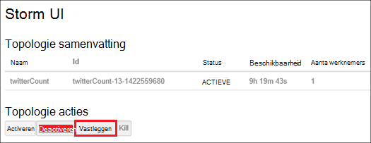

<properties
    pageTitle="Hadoop clusters in HDInsight via PowerShell beheren | Microsoft Azure"
    description="Leer hoe u beheertaken uitvoeren voor Hadoop clusters in via PowerShell Azure HDInsight."
    services="hdinsight"
    editor="cgronlun"
    manager="jhubbard"
    tags="azure-portal"
    authors="mumian"
    documentationCenter=""/>

<tags
    ms.service="hdinsight"
    ms.workload="big-data"
    ms.tgt_pltfrm="na"
    ms.devlang="na"
    ms.topic="article"
    ms.date="08/10/2016"
    ms.author="jgao"/>

# Hadoop clusters in HDInsight beheren met behulp van Azure PowerShell

[AZURE.INCLUDE [selector](../../includes/hdinsight-portal-management-selector.md)]

Azure PowerShell is een krachtige uitvoeren van scripts omgeving die u gebruiken kunt om te beheren en automatiseren de implementatie en het beheer van uw werkbelasting in Azure wordt aangegeven. In dit artikel leert u hoe u Hadoop clusters in Azure HDInsight beheren met behulp van een lokale Azure PowerShell-console met behulp van Windows PowerShell. Zie [HDInsight-cmdlet-naslaginformatie]voor de lijst met de HDInsight PowerShell-cmdlets,[hdinsight-powershell-reference].

**Vereisten voor**

Voordat u in dit artikel begint, hebt u het volgende:

- **Een Azure-abonnement**. Zie [Azure krijgen gratis proefversie](https://azure.microsoft.com/documentation/videos/get-azure-free-trial-for-testing-hadoop-in-hdinsight/).

##Azure PowerShell installeren

[AZURE.INCLUDE [upgrade-powershell](../../includes/hdinsight-use-latest-powershell.md)]

Als u Azure PowerShell versie 0,9 hebt geïnstalleerd x, moet u deze verwijderen voordat u een nieuwere versie installeert.

De versie van de geïnstalleerde PowerShell controleren:

    Get-Module *azure*
    
Als u wilt de oudere versie verwijdert, worden uitgevoerd programma's en onderdelen in het Configuratiescherm. 

##Clusters maken

Zie [maken Linux gebaseerde clusters in via PowerShell Azure HDInsight](hdinsight-hadoop-create-linux-clusters-azure-powershell.md)

##Lijst met clusters
Gebruik de volgende opdracht uit voor een overzicht van alle clusters in het huidige abonnement:

    Get-AzureRmHDInsightCluster

##Cluster weergeven

Gebruik de volgende opdracht uit om weer te geven details van een specifiek cluster in het huidige abonnement:

    Get-AzureRmHDInsightCluster -ClusterName <Cluster Name>

##Clusters verwijderen

Gebruik de volgende opdracht uit om te verwijderen van een cluster:

    Remove-AzureRmHDInsightCluster -ClusterName <Cluster Name>

U kunt ook een cluster verwijderen door te verwijderen van de resourcegroep die het cluster bevat. Let op: Hiermee verwijdert u alle resources in de groep met inbegrip van het standaardaccount voor de opslag.

    Remove-AzureRmResourceGroup -Name <Resource Group Name>
            
##Schaal clusters
De schaal van de functie cluster kunt u wijzigen hoeveel werknemer knooppunten die worden gebruikt door een cluster die wordt uitgevoerd op Azure HDInsight zonder dat u moet het cluster opnieuw te maken.

>[AZURE.NOTE] Alleen clusters met HDInsight versie 3.1.3 of hoger worden ondersteund. Als u niet van de versie van uw cluster weet, kunt u de pagina eigenschappen controleren.  Zie [clusters lijst en weergeven](hdinsight-administer-use-portal-linux.md#list-and-show-clusters).

De gevolgen van het wijzigen van het aantal gegevensknooppunten voor elk type cluster worden ondersteund door HDInsight:

- Hadoop

    U kunt het aantal werknemer knooppunten in een Hadoop-cluster die wordt uitgevoerd zonder die invloed hebben op alle taken in behandeling of wordt uitgevoerd naadloos vergroten. Nieuwe taken kunnen ook worden verzonden, terwijl de bewerking uitgevoerd wordt. Fouten in een schaal bewerking worden zonder problemen worden afgehandeld zodat het cluster altijd functioneel is resteert.

    Wanneer een Hadoop-cluster verkleind door te verminderen van het aantal gegevensknooppunten, worden enkele van de services in het cluster opnieuw gestart. Hierdoor worden alle actief zijn en in behandeling taken aan het einde van de schaal bewerking is mislukt. U kunt de taken echter opnieuw indienen zodra de bewerking voltooid is.

- HBase

    U kunt naadloos toevoegen of verwijderen van knooppunten aan uw cluster HBase terwijl deze wordt uitgevoerd. Regionale Servers worden automatisch verdeeld binnen een paar minuten na het voltooien van de schaal bewerking. U kunt echter ook handmatig de regionale servers verdelen door naar de headnode van cluster aanmelden en voert u de volgende opdrachten uit in een opdrachtpromptvenster:

        >pushd %HBASE_HOME%\bin
        >hbase shell
        >balancer

- Storm

    U kunt naadloos toevoegen of verwijderen van gegevensknooppunten in uw cluster Storm terwijl deze wordt uitgevoerd. Maar na een succesvolle afronding van de schaal bewerking, moet u naar het vastleggen van de topologie.

    Opnieuw kunt op twee manieren doen:

    * Storm web UI
    * Hulpmiddel opdrachtregel-interface (CLI)

    Raadpleeg de [Apache Storm documentatie](http://storm.apache.org/documentation/Understanding-the-parallelism-of-a-Storm-topology.html) voor meer informatie.

    Het web Storm UI is beschikbaar op het cluster HDInsight:

    

    Hier volgt een voorbeeld van het gebruik van de opdracht CLI de topologie Storm opnieuw uit te:

        ## Reconfigure the topology "mytopology" to use 5 worker processes,
        ## the spout "blue-spout" to use 3 executors, and
        ## the bolt "yellow-bolt" to use 10 executors

        $ storm rebalance mytopology -n 5 -e blue-spout=3 -e yellow-bolt=10

Als de grootte van de cluster Hadoop wijzigen met behulp van Azure PowerShell, voert u de volgende opdracht uit vanaf een clientcomputer:

    Set-AzureRmHDInsightClusterSize -ClusterName <Cluster Name> -TargetInstanceCount <NewSize>
    

##Toegang verlenen/intrekken

HDInsight clusters bestaan uit de volgende HTTP-webservices (alle van de volgende services hebben RESTful eindpunten):

- ODBC
- JDBC
- Ambari
- Oozie
- Templeton

Deze services zijn standaard verleend voor access. U kunt intrekken/verlenen toegang. Intrekken:

    Revoke-AzureRmHDInsightHttpServicesAccess -ClusterName <Cluster Name>

Verlenen:

    $clusterName = "<HDInsight Cluster Name>"

    # Credential option 1
    $hadoopUserName = "admin"
    $hadoopUserPassword = "<Enter the Password>"
    $hadoopUserPW = ConvertTo-SecureString -String $hadoopUserPassword -AsPlainText -Force
    $credential = New-Object System.Management.Automation.PSCredential($hadoopUserName,$hadoopUserPW)

    # Credential option 2
    #$credential = Get-Credential -Message "Enter the HTTP username and password:" -UserName "admin"
    
    Grant-AzureRmHDInsightHttpServicesAccess -ClusterName $clusterName -HttpCredential $credential

>[AZURE.NOTE] Door de toegang verlenen/intrekken, stelt u de cluster-gebruikersnaam en wachtwoord.

Dit is ook mogelijk via de Portal. Zie [HDInsight beheren met behulp van de Azure portal][hdinsight-admin-portal].

##HTTP-gebruikersreferenties bijwerken

Dit is dezelfde procedure als [verlenen/intrekken HTTP-toegang](#grant/revoke-access). Als het cluster heeft de HTTP-toegang is verleend, moet u eerst het intrekken.  En vervolgens de toegang met nieuwe HTTP-gebruikersreferenties verlenen.

##Het standaardaccount voor de opslag zoeken

Het volgende Powershell-script ziet u hoe u de standaardnaam voor de opslag-account en de accountsleutel van de standaard-opslag voor een cluster.

    $clusterName = "<HDInsight Cluster Name>"
    
    $cluster = Get-AzureRmHDInsightCluster -ClusterName $clusterName
    $resourceGroupName = $cluster.ResourceGroup
    $defaultStorageAccountName = ($cluster.DefaultStorageAccount).Replace(".blob.core.windows.net", "")
    $defaultBlobContainerName = $cluster.DefaultStorageContainer
    $defaultStorageAccountKey = (Get-AzureRmStorageAccountKey -ResourceGroupName $resourceGroupName -Name $defaultStorageAccountName)[0].Value
    $defaultStorageAccountContext = New-AzureStorageContext -StorageAccountName $defaultStorageAccountName -StorageAccountKey $defaultStorageAccountKey 

##Zoek de resourcegroep

In de modus resourcemanager, wordt elk cluster HDInsight hoort bij een Azure resourcegroep.  De resourcegroep zoeken:

    $clusterName = "<HDInsight Cluster Name>"
    
    $cluster = Get-AzureRmHDInsightCluster -ClusterName $clusterName
    $resourceGroupName = $cluster.ResourceGroup

##Taken indienen

**MapReduce taken**

Zie [de voorbeelden Hadoop MapReduce uitvoeren in Windows gebaseerde HDInsight](hdinsight-run-samples.md).

**Component taken** 

Zie [query's via PowerShell component uitvoeren](hdinsight-hadoop-use-hive-powershell.md).

**Varken taken**

Zie [uitvoeren varken taken via PowerShell](hdinsight-hadoop-use-pig-powershell.md).

**Sqoop taken**

Zie [Gebruik Sqoop met HDInsight](hdinsight-use-sqoop.md).

**Oozie taken**

Zie [Gebruik Oozie met Hadoop definiëren en uitvoeren van een werkstroom in HDInsight](hdinsight-use-oozie.md).

##Gegevens uploaden naar Azure-blobopslag
Zie [gegevens met HDInsight uploaden][hdinsight-upload-data].

## Zie ook
* [HDInsight-cmdlet-documentatie][hdinsight-powershell-reference]
* [HDInsight beheren met behulp van de Azure-portal][hdinsight-admin-portal]
* [HDInsight opdrachtregel beheren][hdinsight-admin-cli]
* [HDInsight clusters maken][hdinsight-provision]
* [Gegevens uploaden naar HDInsight][hdinsight-upload-data]
* [Via programmacode Hadoop taken indienen][hdinsight-submit-jobs]
* [Aan de slag met Azure HDInsight][hdinsight-get-started]

[azure-purchase-options]: http://azure.microsoft.com/pricing/purchase-options/
[azure-member-offers]: http://azure.microsoft.com/pricing/member-offers/
[azure-free-trial]: http://azure.microsoft.com/pricing/free-trial/

[hdinsight-get-started]: hdinsight-hadoop-linux-tutorial-get-started.md
[hdinsight-provision]: hdinsight-provision-clusters.md
[hdinsight-provision-custom-options]: hdinsight-provision-clusters.md#configuration
[hdinsight-submit-jobs]: hdinsight-submit-hadoop-jobs-programmatically.md

[hdinsight-admin-cli]: hdinsight-administer-use-command-line.md
[hdinsight-admin-portal]: hdinsight-administer-use-management-portal.md
[hdinsight-storage]: hdinsight-hadoop-use-blob-storage.md
[hdinsight-use-hive]: hdinsight-use-hive.md
[hdinsight-use-mapreduce]: hdinsight-use-mapreduce.md
[hdinsight-upload-data]: hdinsight-upload-data.md
[hdinsight-flight]: hdinsight-analyze-flight-delay-data.md

[hdinsight-powershell-reference]: https://msdn.microsoft.com/library/dn858087.aspx

[powershell-install-configure]: powershell-install-configure.md

[image-hdi-ps-provision]: ./media/hdinsight-administer-use-powershell/HDI.PS.Provision.png
