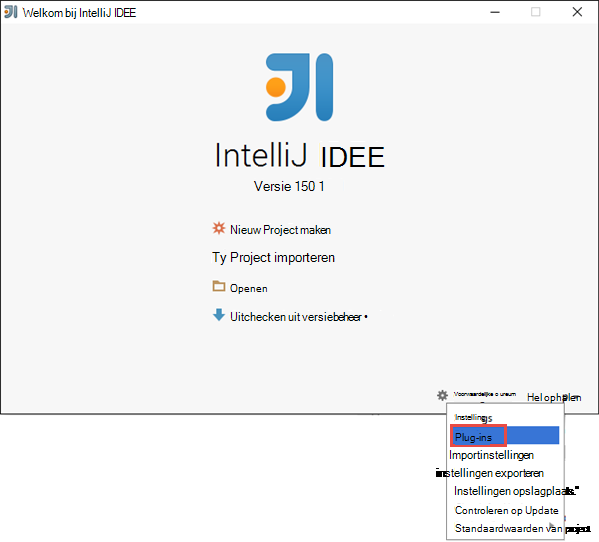
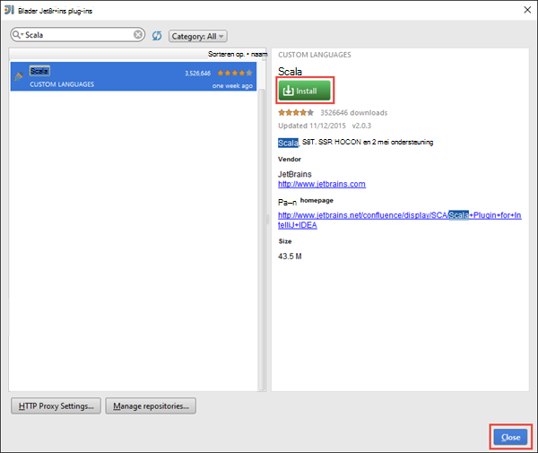
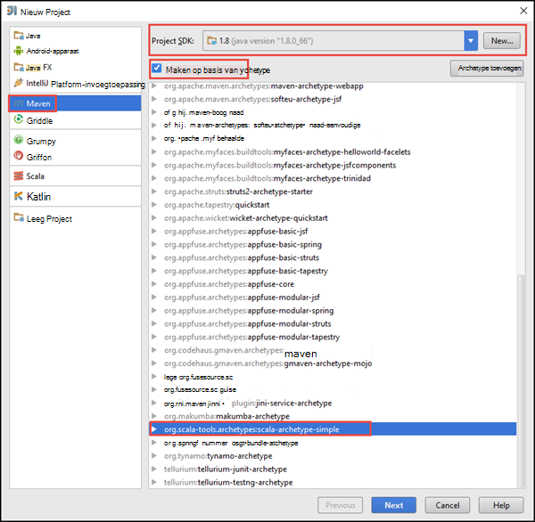
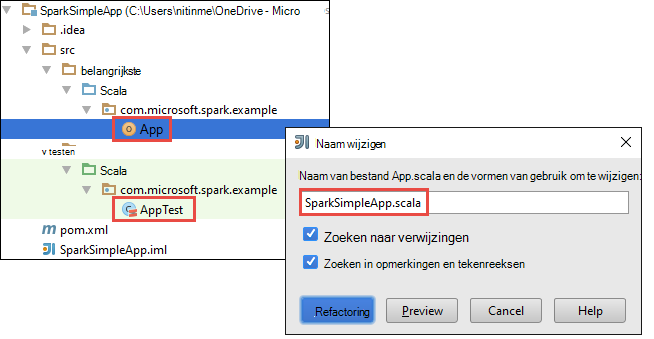
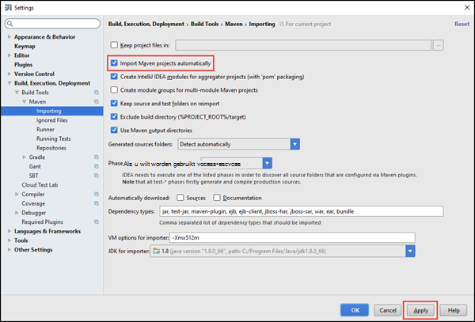
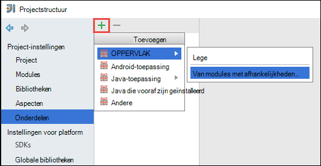
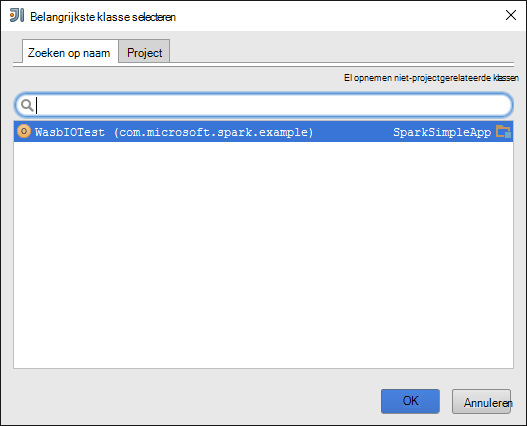
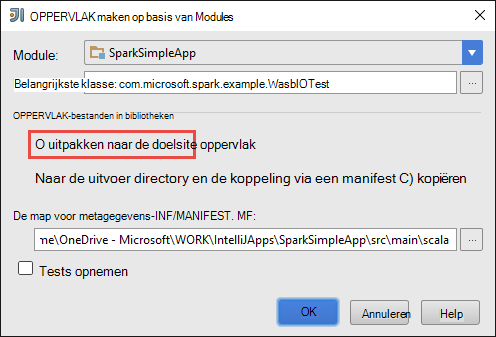
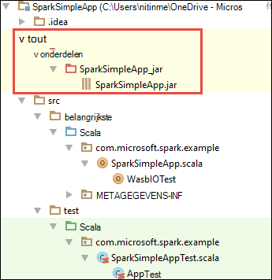

<properties
    pageTitle="Zelfstandige scala-toepassingen om uit te voeren op HDInsight Spark clusters maken | Microsoft Azure"
    description="Informatie over het maken van een zelfstandig product een toepassing wilt uitvoeren op HDInsight Spark clusters."
    services="hdinsight"
    documentationCenter=""
    authors="nitinme"
    manager="jhubbard"
    editor="cgronlun"
    tags="azure-portal"/>

<tags
    ms.service="hdinsight"
    ms.workload="big-data"
    ms.tgt_pltfrm="na"
    ms.devlang="na"
    ms.topic="article"
    ms.date="10/28/2016"
    ms.author="nitinme"/>

# Zelfstandige Scala toepassing wilt uitvoeren op een van de Apache cluster op HDInsight Linux maken

In dit artikel biedt stapsgewijze instructies over het ontwikkelen zelfstandige elektrische toepassingen geschreven in Scala Maven gebruikt met IntelliJ IDEE. Het artikel Apache Maven gebruikt als het systeem opbouwen en begint met een bestaande Maven archetype voor Scala IntelliJ IDEE gekregen.  Bij een hoog niveau, wordt voor het maken van een Scala-toepassing in IntelliJ IDEE gebruikmaakt van de volgende stappen uit:

* Gebruik Maven als het systeem opbouwen.
* Project Object Model (POM)-bestand om op te lossen een module afhankelijkheden bijwerken.
* Schrijf uw toepassing in Scala.
* Een oppervlak-bestand dat kan worden ingediend met HDInsight Spark clusters genereren.
* Voer de toepassing op een cluster met hier.

>[AZURE.NOTE] HDInsight bevat ook een hulpprogramma van de invoegtoepassing IntelliJ IDEE om het proces van het maken en het versturen van een cluster HDInsight Spark op Linux-toepassingen. Zie [Gebruik HDInsight-invoegtoepassing voor hulpmiddelen voor IntelliJ IDEE maken en indienen elektrische toepassingen](hdinsight-apache-spark-intellij-tool-plugin.md)voor meer informatie.

**Vereisten voor**

* Een Azure-abonnement. Zie [Azure krijgen gratis proefversie](https://azure.microsoft.com/documentation/videos/get-azure-free-trial-for-testing-hadoop-in-hdinsight/).
* Een cluster Apache elektrische op HDInsight Linux. Zie voor instructies voor het [maken Apache elektrische clusters in Azure HDInsight](hdinsight-apache-spark-jupyter-spark-sql.md).
* Oracle Java Development kit. U kunt deze installeren vanaf [hier](http://www.oracle.com/technetwork/java/javase/downloads/jdk8-downloads-2133151.html).
* Een Java IDE. In dit artikel worden de IntelliJ IDEE 15.0.1 gebruikt. U kunt deze installeren vanaf [hier](https://www.jetbrains.com/idea/download/).

## Scala-invoegtoepassing voor IntelliJ IDEE installeren

Als IntelliJ IDEE installatie niet niet gevraagd voor het inschakelen van Scala Plug, IntelliJ IDEE starten en gaat u door de volgende stappen voor het installeren van de invoegtoepassing voor:

1. IntelliJ IDEE Start en klik op **configureren** in Welkom-scherm en klik op **Plug-ins**.

    

2. Klik op **installeren JetBrains-invoegtoepassing** in de diavoorstellingsweergave links onder in het volgende scherm. Zoeken naar Scala in het dialoogvenster **Bladeren JetBrains Plug-ins** dat wordt geopend, en klik vervolgens op **installeren**.

    

3. Nadat de invoegtoepassing is geïnstalleerd, klikt u op de **knop Start opnieuw IntelliJ IDEE** om de IDE opnieuw te starten.

## Een zelfstandige Scala project maken

1. IntelliJ IDEE starten en een nieuw project maken. De volgende opties in het dialoogvenster Nieuw project en klik vervolgens op **volgende**.

    

    * Selecteer **Maven** als het projecttype.
    * Een **Project SDK**opgeven. Klik op Nieuw en navigeer naar de Java-installatiemap, meestal `C:\Program Files\Java\jdk1.8.0_66`.
    * Selecteer de optie **maken op basis van archetype** .
    * Selecteer in de lijst met archetypes, **org.scala-tools.archetypes:scala-archetype-eenvoudige**. Hiermee maakt u de juiste mapstructuur en de vereiste standaard afhankelijkheden u schrijft Scala programma downloaden.

2. Relevante waarden opgeven voor **groeps-id**, **ArtifactId**en **versie**. Klik op **volgende**.

3. Accepteer de standaardinstellingen in het volgende dialoogvenster, waar u de basismap Maven en andere gebruikersinstellingen opgeeft, en klik op **volgende**.

4. Klik in het dialoogvenster laatste Geef een naam van het project en de locatie en klik op **Voltooien**.

5. Verwijder het bestand **MySpec.Scala** op **src\test\scala\com\microsoft\spark\example**. U hoeft niet dit voor de toepassing.

6. Als verplicht, wijzigt u de standaard-bron- en test-bestanden. In het linkerdeelvenster van het IDEE IntelliJ, navigeer naar **src\main\scala\com.microsoft.spark.example**. Met de rechtermuisknop op **App.scala**op **refactoring**, klik op naam wijzigen-bestand, en geef de nieuwe naam voor de toepassing in het dialoogvenster en klik vervolgens op **refactoring**.

      

7. In de volgende stappen verandert u de pom.xml als u wilt de afhankelijkheden voor de toepassing een Scala definiëren. Voor deze afhankelijkheden worden gedownload en automatisch opgelost, moet u Maven dienovereenkomstig gewijzigd.

    

    1. Klik in het menu **bestand** op **Instellingen**.
    2. Navigeren in het dialoogvenster **Instellingen** om te **maken, uitvoeren, implementatie** > **Bouwen hulpmiddelen voor** > **Maven** > **importeren**.
    3. Selecteer de optie voor het **importeren Maven automatisch projecten**.
    4. Klik op **toepassen**en klik vervolgens op **OK**.

8. Werk het bronbestand Scala als u wilt opnemen van uw toepassingscode. Open en de bestaande steekproef-code vervangen door de volgende code en de wijzigingen op te slaan. Deze code leest de gegevens uit de HVAC.csv (beschikbaar op alle HDInsight Spark clusters), worden de rijen die slechts één cijfer in het zesde kolom hebben en de uitvoer schrijft naar **/HVACOut** onder de container standaard opslag voor het cluster.

        package com.microsoft.spark.example

        import org.apache.spark.SparkConf
        import org.apache.spark.SparkContext

        /**
          * Test IO to wasb
          */
        object WasbIOTest {
          def main (arg: Array[String]): Unit = {
            val conf = new SparkConf().setAppName("WASBIOTest")
            val sc = new SparkContext(conf)

            val rdd = sc.textFile("wasbs:///HdiSamples/HdiSamples/SensorSampleData/hvac/HVAC.csv")

            //find the rows which have only one digit in the 7th column in the CSV
            val rdd1 = rdd.filter(s => s.split(",")(6).length() == 1)

            rdd1.saveAsTextFile("wasbs:///HVACout")
          }
        }

9. Werk de pom.xml.

    1.  Binnen `<project>\<properties>` toevoegen de volgende handelingen uit:

            <scala.version>2.10.4</scala.version>
            <scala.compat.version>2.10.4</scala.compat.version>
            <scala.binary.version>2.10</scala.binary.version>

    2. Binnen `<project>\<dependencies>` toevoegen de volgende handelingen uit:

            <dependency>
              <groupId>org.apache.spark</groupId>
              <artifactId>spark-core_${scala.binary.version}</artifactId>
              <version>1.4.1</version>
            </dependency>

    Wijzigingen opslaan op pom.xml.

10. Het bestand .jar maken. IntelliJ IDEE kunt maken van oppervlak als een onderdeel van een project. De volgende stappen uitvoeren.

    1. Klik op **Project-structuur**van het menu **bestand** .
    2. Klik in het dialoogvenster **Projectstructuur** op **onderdelen** en klik vervolgens op het plusteken. In het pop-dialoogvenster **JAR**op en klik vervolgens op **uit modules met afhankelijkheden**.

        

    3. In het dialoogvenster **Maken JAR uit Modules** , klikt u op het beletselteken ( ) ten opzichte van de **Belangrijkste Class**.

    4. Selecteer de klasse dat standaard wordt weergegeven in het dialoogvenster **Selecteer Hoofdgegeven Class** en klik op **OK**.

        

    5. Zorg ervoor dat de optie voor het **extraheren naar de doelsite oppervlak** is geselecteerd in het dialoogvenster **Maken JAR uit Modules** , en klik vervolgens op **OK**. Hiermee wordt een één oppervlak gemaakt met alle afhankelijkheden.

        

    6. Het tabblad van de indeling uitvoer bevat alle potten die opgenomen als onderdeel van het project Maven zijn. U kunt selecteren en verwijderen van de kleuren die waarop de toepassing Scala heeft geen directe afhankelijkheid. Voor de toepassing we hier maakt, kunt u alles, behalve de laatste een (**SparkSimpleApp compilatie-uitvoer**). Selecteer de potten wilt verwijderen en klik op het pictogram **verwijderen** .

        

        Controleer of **op een tabelmaakquery maken** is geselecteerd, waarin zorgt ervoor dat het oppervlak wordt gemaakt telkens wanneer het project wordt gemaakt of bijgewerkt. Klik op **toepassen** en klik vervolgens op **OK**.

    7. De menubalk op de knop **Opbouwen**en klik vervolgens op **Project maken**. U kunt ook klikken op **Onderdelen maken** als u wilt maken van het oppervlak. Het oppervlak uitvoer wordt onder **\out\artifacts**gemaakt.

        

## Voer de toepassing op het cluster elektrische

Als u wilt de toepassing op het cluster uitvoert, moet u het volgende doen:

* **Kopieer het oppervlak van toepassing op de opslag van Azure blob** die is gekoppeld aan het cluster. U kunt [**AzCopy**](../storage/storage-use-azcopy.md), een opdrachtregelhulpprogramma kunt doen. Zijn er een groot aantal andere clients ook die u kunt gebruiken voor het uploaden van gegevens. U vindt meer informatie over deze bij het [uploaden van gegevens voor Hadoop-projecten in HDInsight](hdinsight-upload-data.md).

* **Gebruik hier om in te dienen van een taak van toepassing op afstand** aan het cluster elektrische. Elektrische clusters op HDInsight hier dat toegang biedt tot REST eindpunten om in te dienen extern elektrische taken bevat. Zie voor meer informatie [indienen elektrische taken op afstand met hier met een clusters op HDInsight](hdinsight-apache-spark-livy-rest-interface.md).

## Zie ook

* [Overzicht: Apache elektrische op Azure HDInsight](hdinsight-apache-spark-overview.md)

### Scenario 's

* [Elektrische met BI: interactieve gegevensanalyses elektrische in HDInsight met hulpmiddelen voor BI uitvoeren](hdinsight-apache-spark-use-bi-tools.md)

* [Elektrische met Machine Learning: gebruik een in HDInsight building temperatuur met Aircoschema gegevens analyseren](hdinsight-apache-spark-ipython-notebook-machine-learning.md)

* [Elektrische met Machine Learning: gebruik een in HDInsight eten controleresultaten voorspellen](hdinsight-apache-spark-machine-learning-mllib-ipython.md)

* [Een Streaming: Gebruik een in HDInsight voor het samenstellen van realtime streaming-toepassingen](hdinsight-apache-spark-eventhub-streaming.md)

* [Website logboekanalyse met behulp van een in HDInsight](hdinsight-apache-spark-custom-library-website-log-analysis.md)

### Maken en uitvoeren van toepassingen

* [Taken op afstand uitvoeren op een elektrische cluster met hier](hdinsight-apache-spark-livy-rest-interface.md)

### Hulpprogramma's en uitbreidingen

* [HDInsight-invoegtoepassing voor hulpmiddelen voor IntelliJ IDEE maken en indienen elektrische Scala toepassingen gebruiken](hdinsight-apache-spark-intellij-tool-plugin.md)

* [Gebruik HDInsight-invoegtoepassing voor hulpmiddelen voor IntelliJ verloop foutopsporing elektrische toepassingen op afstand uitvoeren](hdinsight-apache-spark-intellij-tool-plugin-debug-jobs-remotely.md)

* [Zeppelin notitieblokken gebruikt met een cluster elektrische op HDInsight](hdinsight-apache-spark-use-zeppelin-notebook.md)

* [Kernels beschikbaar voor Jupyter notitieblok in een cluster voor HDInsight](hdinsight-apache-spark-jupyter-notebook-kernels.md)

* [Externe-pakketten gebruiken met Jupyter notitieblokken](hdinsight-apache-spark-jupyter-notebook-use-external-packages.md)

* [Jupyter installeert op uw computer en verbinding maken met een cluster HDInsight Spark](hdinsight-apache-spark-jupyter-notebook-install-locally.md)

### Resources beheren

* [Bronnen voor de Apache elektrische cluster in Azure HDInsight beheren](hdinsight-apache-spark-resource-manager.md)

* [Bijhouden en foutopsporing taken op een cluster Apache elektrische in HDInsight](hdinsight-apache-spark-job-debugging.md)
