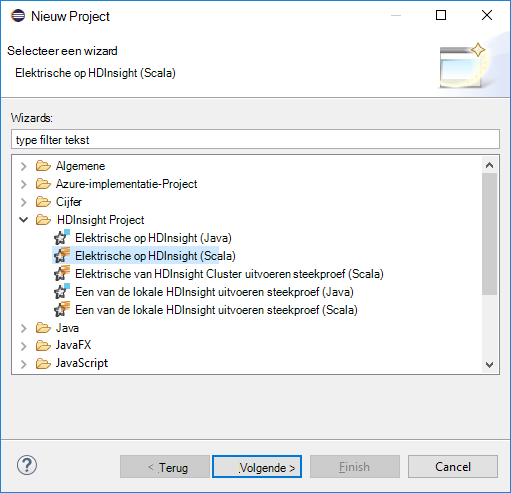

 <properties
    pageTitle="Maken van een Scala toepassingen HDInsight hulpmiddelen voor gebruik in Azure Toolkit voor Eclips | Microsoft Azure"
    description="Informatie over het maken van een zelfstandig product een toepassing wilt uitvoeren op HDInsight Spark clusters."
    services="hdinsight"
    documentationCenter=""
    authors="nitinme"
    manager="jhubbard"
    editor="cgronlun"
    tags="azure-portal"/>

<tags
    ms.service="hdinsight"
    ms.workload="big-data"
    ms.tgt_pltfrm="na"
    ms.devlang="na"
    ms.topic="article"
    ms.date="08/30/2016"
    ms.author="nitinme"/>

# Hulpmiddelen voor HDInsight gebruiken in Azure Toolkit voor Eclips elektrische toepassingen voor HDInsight elektrische Linux cluster maken

Dit artikel vindt stapsgewijze instructies over het ontwikkelen elektrische toepassingen in Scala en het versturen van deze aan een HDInsight Spark cluster met hulpmiddelen voor HDInsight in Azure Toolkit voor Eclips geschreven. U kunt de hulpmiddelen in op verschillende manieren gebruiken:

* Ontwikkelen en een Scala Spark-aanvraag op een cluster HDInsight Spark indienen
* Voor toegang tot uw Azure HDInsight elektrische cluster resources
* Voor het ontwikkelen en een toepassing Scala Spark lokaal uitvoeren

>[AZURE.IMPORTANT] Dit hulpmiddel kunt maken en indienen toepassingen alleen inschakelen voor een cluster HDInsight Spark op Linux worden gebruikt.

##Vereisten voor

* Een Azure-abonnement. Zie [Azure krijgen gratis proefversie](https://azure.microsoft.com/documentation/videos/get-azure-free-trial-for-testing-hadoop-in-hdinsight/).

* Een cluster Apache elektrische op HDInsight Linux. Zie voor instructies voor het [maken Apache elektrische clusters in Azure HDInsight](hdinsight-apache-spark-jupyter-spark-sql.md).

* Oracle Java Development kit versie 7 en 8-versie. 
    * **Java SDK 7** wordt gebruikt voor het compileren van een projecten, terwijl de clusters HDInsight Java versie 7-ondersteuning. U kunt Java SDK 7 downloaden van [hier](http://www.oracle.com/technetwork/java/javase/downloads/jdk7-downloads-1880260.html).
    * **Java SDK 8** wordt gebruikt voor Eclips IDE runtime. U kunt downloaden vanaf [hier](http://www.oracle.com/technetwork/java/javase/downloads/jdk8-downloads-2133151.html).

* Eclips IDE. In dit artikel worden de Eclips Neon gebruikt. U kunt deze installeren vanaf [hier](https://www.eclipse.org/downloads/).

* Scala IDE voor Eclips. 
    * **Als er Eclips IDE is geïnstalleerd**, kunt u de invoegtoepassing voor Scala IDE toevoegen door te gaan om te **helpen** -> **Nieuwe SoftWare installeren**, en voeg [http://download.scala-ide.org/sdk/lithium/e44/scala211/stable/site](http://download.scala-ide.org/sdk/lithium/e44/scala211/stable/site) als bron Scala Plugin voor Eclips downloaden. 
    * **Als u nog geen Eclips IDE is geïnstalleerd**, kunt u rechtstreeks vanaf [hier](http://scala-ide.org/download/sdk.html)Scala IDE installeren. U kunt het ZIP-bestand downloaden via deze koppeling, pak dit, navigeer naar de map **/eclipse** , en voer **eclipse.exe** bestand daarvandaan.
    
    >[AZURE.NOTE] De stappen in dit document zijn gebaseerd op het gebruik van Eclips IDE met Scala-invoegtoepassing is geïnstalleerd.

* Elektrische SDK. U kunt downloaden vanaf [hier](http://go.microsoft.com/fwlink/?LinkID=723585&clcid=0x409).

* Installeer e (fx) clipse vanaf [https://www.eclipse.org/efxclipse/install.html](https://www.eclipse.org/efxclipse/install.html).

## Hulpmiddelen voor HDInsight in Azure Toolkit voor Eclips installeren

HDInsight tools voor Eclips beschikbaar is als onderdeel van de Azure Toolkit voor Eclips. Zie de [installatie van de Azure Toolkit voor Eclips](../azure-toolkit-for-eclipse-installation.md)voor instructies over het installeren van de Azure-Toolkit.

## Meld u aan bij uw Azure-abonnement

1. Start de IDE Eclips en open de Verkenner Azure. In het menu **venster** op de IDE, klikt u op **Weergave weergeven** en klik vervolgens op **Overige**. In het dialoogvenster dat wordt geopend, **Azure**uitvouwen, klikt u op **Azure Explorer**en klik vervolgens op **OK**.

    

2. Met de rechtermuisknop op het knooppunt **Azure** in **Azure Explorer**en klik vervolgens op **Abonnementen beheren**.

3. In het dialoogvenster **Abonnementen beheren** , klikt u op **aanmelden** en voert u uw Azure referenties.

    

4. Nadat u bent aangemeld, wordt in het dialoogvenster **Abonnementen beheren** de Azure abonnementen die is gekoppeld aan de referenties bevat. Klik op **sluiten** in het dialoogvenster.

5. Vouw in het tabblad Azure Explorer uit **HDInsight** als u wilt zien van de clusters HDInsight Spark onder uw abonnement.

    

6. Verder kunt u een cluster naam knooppunt als u wilt zien van de resources (bijvoorbeeld opslag-accounts) die zijn gekoppeld aan het cluster uitbreiden.

    

## Een project een Scala voor een cluster HDInsight Spark instellen

1. Van de werkruimte Eclips IDE, klik op **bestand**, klikt u op **Nieuw**en klik vervolgens op **Project**. 

2. Klik in de wizard **Nieuw Project** **HDInsight**uitvouwen, selecteert u **een op HDInsight (Scala)**en klik vervolgens op **volgende**.

    

3. Klik in het dialoogvenster **Nieuw HDInsight Scala Project** invoeren/selecteren waarden zoals weergegeven in de onderstaande afbeelding en klik vervolgens op **volgende**.

    

    * Voer een naam voor het project.
    * Klik in het vak **JRE** zorg **dat gebruiken een omgeving JRE** is ingesteld op **JavaSE-1.7**.
    * Controleer of dat een SDK is ingesteld op de locatie waar u de SDK hebt gedownload. De koppeling naar de downloadlocatie is opgenomen in de [vereisten voor](#prerequisites) eerder in dit onderwerp. U kunt ook de SDK downloaden via de koppeling in dit dialoogvenster wordt geleverd, zoals wordt weergegeven in de bovenstaande afbeelding.    

4. In het volgende dialoogvenster, klik op het tabblad **bibliotheken** en dubbelklik vervolgens op **JRE systeembibliotheek [JavaSE-1.7]**.

    

5. Zorg dat **Omgeving** is ingesteld op **JavaSE-1.7(jdk1.7.0_79)**in het dialoogvenster **Bibliotheek bewerken** . Als dit niet beschikbaar als een optie, volgt u de onderstaande stappen.

    1. Selecteer de optie **Alternatieve JRE** en zien of **JavaSE-1.7(jdk1.7.0_79)** beschikbaar is.
    2. Als dat niet zo is, klikt u op de knop **JREs is geïnstalleerd** .

          

    3. In het dialoogvenster **JREs is geïnstalleerd** , klikt u op **toevoegen**.

            

    4. Klik in het dialoogvenster **JRE Type** **Standaard VM**selecteren en klik op **volgende**

            

    5. Directory, klikt u op in het dialoogvenster **JRE definitie** en navigeer naar de locatie voor JDK 7-installatie, en selecteert u de hoofdmap voor **jdk1.7.0_79**.

            

    6. Klik op **Voltooien**. In het dialoogvenster **JREs is geïnstalleerd** , selecteert u de zojuist toegevoegde JRE en klik vervolgens op **OK**.

           

    7. De toegevoegde JRE moet voor **Omgeving**worden weergegeven. Klik op **Voltooien**.

           

6. Dubbelklik op het tabblad **bibliotheken** op **Scala bibliotheek Container [2.11.8]**. Selecteer in het dialoogvenster **Bewerken bibliotheek** **vaste Scala bibliotheek container: 2.10.6**. 

    

    Klik op **Voltooien** totdat u het dialoogvenster Instellingen voor project afsluit.

## Een servicetoepassing Scala voor HDInsight Spark cluster maken

1. In de al geopende Eclips IDE, vanuit de **Pakket Explorer**uitvouwen van het project dat u eerder hebt gemaakt, met de rechtermuisknop op **src**aan, wijs **Nieuw**aan en klik vervolgens op **Overige**.

2. Klik in het dialoogvenster **Selecteer een wizard** **Scala Wizards**uitvouwen, klikt u op **Scala Object**en klik vervolgens op **volgende**.

    

3. Voer een naam voor het object in het dialoogvenster **Nieuw bestand maken** en klik vervolgens op **Voltooien**.

    

4. Plak de volgende code in de teksteditor.

        import org.apache.spark.SparkConf
        import org.apache.spark.SparkContext
    
        object MyClusterApp{
          def main (arg: Array[String]): Unit = {
            val conf = new SparkConf().setAppName("MyClusterApp")
            val sc = new SparkContext(conf)
        
            val rdd = sc.textFile("wasbs:///HdiSamples/HdiSamples/SensorSampleData/hvac/HVAC.csv")
        
            //find the rows which have only one digit in the 7th column in the CSV
            val rdd1 =  rdd.filter(s => s.split(",")(6).length() == 1)
        
            rdd1.saveAsTextFile("wasbs:///HVACOut")
          }     
        }

5. De toepassing uitvoert op een cluster HDInsight Spark.

    1. Vanuit de **Pakket Verkenner**met de rechtermuisknop op de naam van het project en selecteert u **Een toepassing verzenden met HDInsight**.      

    2. Geef de volgende waarden in het dialoogvenster **Een indienen** .

        * Selecteer het HDInsight Spark cluster waarop u wilt uitvoeren van uw toepassing voor **De naam van de Cluster**.

        * U moet een onderdeel van het project Eclips selecteert, of Selecteer een van de harde schijf.

        * Voer de naam van het object dat u hebt opgegeven in de code ten opzichte van het tekstvak **Hoofdgegeven klassenaam** (Zie onderstaande afbeelding).

            

        * Omdat de toepassingscode in dit voorbeeld niet alle opdrachtregelargumenten vereisen of verwijzingen naar potten of bestanden, kunt u de resterende tekstvakken leeg laat.

        * Klik op **verzenden**.

    3. Het tabblad **Elektrische indiening** moet beginnen met het weergeven van de voortgang. U kunt de toepassing stoppen door te klikken op de rode knop in het venster "Elektrische indiening". U kunt ook de logboeken voor deze specifieke toepassing uitvoeren door te klikken op het pictogram van een wereldbol (aangeduid met het blauwe vakje in de afbeelding) weergeven.

        

    In de volgende sectie leert u hoe u toegang tot de taak uitvoeren met de HDInsight-hulpmiddelen op Azure Toolkit voor Eclips.

## Toegang tot en met de HDInsight-hulpmiddelen op Azure Toolkit voor Eclips HDInsight Spark-clusters beheren

U kunt allerlei met de hulpmiddelen HDInsight bewerkingen uitvoeren.

### Toegang tot de container opslag voor het cluster

1. Vanuit de Explorer Azure Vouw **HDInsight** hoofdmap voor een overzicht van HDInsight Spark clusters die beschikbaar zijn.

3. Vouw de naam van het cluster om de opslag-account en de standaard-opslag container voor het cluster weer te geven.

    

4. Klik op de naam van opslag container die is gekoppeld aan het cluster. Klik in het rechterdeelvenster ziet u een map genaamd **HVACOut**. Dubbelklik om te openen van de map en u ziet **deel -*** bestanden. Open een van deze bestanden om de uitvoer van de toepassing weer te geven.

### Toegang tot de Server met een geschiedenis

1. Vanuit de **Azure Verkenner**met de rechtermuisknop op de naam van uw elektrische cluster en selecteer vervolgens **Openen een geschiedenis UI**. Wanneer u wordt gevraagd, typt u de beheerdersreferenties voor het cluster. U moet hebben opgegeven deze tijdens het inrichten van het cluster.

2. In het dashboard voor een geschiedenis Server, kunt u zoeken naar de toepassing die u zojuist hebt uitgevoerd met behulp van de naam van de toepassing. In de bovenstaande code, u hebt ingesteld de toepassing naam met `val conf = new SparkConf().setAppName("MyClusterApp")`. De naam van een toepassing is dus **MyClusterApp**.

### De portal Ambari starten

Vanuit de **Azure Verkenner**met de rechtermuisknop op de naam van uw elektrische cluster en selecteer vervolgens **Openen Cluster Management Portal (Ambari)**. Wanneer u wordt gevraagd, typt u de beheerdersreferenties voor het cluster. U moet hebben opgegeven deze tijdens het inrichten van het cluster.

### Azure abonnementen beheren

De hulpmiddelen voor de HDInsight in Azure Toolkit voor Eclips bevat standaard een clusters uit uw Azure abonnementen. Als verplicht, kunt u de abonnementen waarvoor u toegang tot het cluster wilt opgeven. Vanuit de **Azure Verkenner**met de rechtermuisknop op het knooppunt van de hoofdsite **Azure** en klik op **Abonnementen beheren**. Schakel de selectievakjes ten opzichte van het abonnement waaraan u niet wilt openen en klik vervolgens op **sluiten**in het dialoogvenster. U kunt ook op **Afmelden** als u zich wilt afmelden bij uw Azure-abonnement.

## Een toepassing voor een Scala lokaal uitvoeren

U kunt de HDInsight-hulpmiddelen in Azure Toolkit voor Eclips elektrische Scala toepassingen lokaal op uw werkstation uitvoeren. Meestal dergelijke toepassingen niet nodig hebt toegang tot uw cluster resources zoals opslagruimte container en kan worden uitgevoerd en lokaal getest.

### Vereiste

Tijdens het uitvoeren van de lokale Scala van een toepassing op een Windows-computer, krijgt u mogelijk een uitzondering zoals wordt uitgelegd in [elektrische-2356](https://issues.apache.org/jira/browse/SPARK-2356) die vanwege een ontbrekende **WinUtils.exe** op Windows-besturingssysteem optreedt. U kunt deze fout omzeilen, moet u [het uitvoerbare bestand vanaf hier downloaden](http://public-repo-1.hortonworks.com/hdp-win-alpha/winutils.exe) naar een locatie zoals **C:\WinUtils\bin**. Vervolgens moet u een omgevingsvariabele **HADOOP_HOME** toevoegen en stel de waarde van de variabele op **C\WinUtils**.

### Een lokale Scala van een toepassing uitvoeren  

1. Eclips starten en een nieuw project maken. De volgende opties in het dialoogvenster Nieuw project en klik vervolgens op **volgende**.

    

    * Selecteer **HDInsight**in het linkerdeelvenster.
    * Selecteer **een van HDInsight lokale uitvoeren steekproef (Scala)**in het rechterdeelvenster.
    * Klik op **volgende**.

2. Volg de stappen 3 tot en met 6 zoals wordt weergegeven in de sectie [een project Scala van een toepassing voor een cluster HDInsight elektrische instellen](#set-up-a-spark-scala-application-project-for-an-hdinsight-spark cluster)om de projectdetails van het.

3. De sjabloon een steekproef-code (**LogQuery**) onder de **src** -map die u lokaal op uw computer uitvoeren kunt wordt toegevoegd.

    

4.  Klik met de rechtermuisknop op de toepassing **LogQuery** , wijs **uitvoeren als**en klik vervolgens op **1 Scala-toepassing**. Hier ziet u een uitvoer als volgt op het tabblad **Console** onderaan.

    

## Feedback en bekende problemen

Momenteel weergeeft elektrische Hiermee kunt u direct wordt niet ondersteund en we werken aan die.

Als u suggesties of feedback hebt of als u problemen ondervindt bij het gebruik van dit hulpprogramma je mag rustig ons een e-mailbericht bij hdivstool bij microsoft dot com negeren.

## Zie ook

* [Overzicht: Apache elektrische op Azure HDInsight](hdinsight-apache-spark-overview.md)

### Scenario 's

* [Elektrische met BI: interactieve gegevensanalyses elektrische in HDInsight met hulpmiddelen voor BI uitvoeren](hdinsight-apache-spark-use-bi-tools.md)

* [Elektrische met Machine Learning: gebruik een in HDInsight building temperatuur met Aircoschema gegevens analyseren](hdinsight-apache-spark-ipython-notebook-machine-learning.md)

* [Elektrische met Machine Learning: gebruik een in HDInsight eten controleresultaten voorspellen](hdinsight-apache-spark-machine-learning-mllib-ipython.md)

* [Een Streaming: Gebruik een in HDInsight voor het samenstellen van realtime streaming-toepassingen](hdinsight-apache-spark-eventhub-streaming.md)

* [Website logboekanalyse met behulp van een in HDInsight](hdinsight-apache-spark-custom-library-website-log-analysis.md)

### Maken en uitvoeren van toepassingen

* [Een zelfstandige toepassing maken met Scala](hdinsight-apache-spark-create-standalone-application.md)

* [Taken op afstand uitvoeren op een elektrische cluster met hier](hdinsight-apache-spark-livy-rest-interface.md)

### Hulpprogramma's en uitbreidingen

* [Hulpmiddelen voor HDInsight gebruiken in Azure Toolkit voor IntelliJ maken en indienen elektrische Scala toepassingen](hdinsight-apache-spark-intellij-tool-plugin.md)

* [Gebruik HDInsight hulpprogramma's in Azure Toolkit voor IntelliJ voor foutopsporing dus toepassingen op afstand](hdinsight-apache-spark-intellij-tool-plugin-debug-jobs-remotely.md)

* [Zeppelin notitieblokken gebruikt met een cluster elektrische op HDInsight](hdinsight-apache-spark-use-zeppelin-notebook.md)

* [Kernels beschikbaar voor Jupyter notitieblok in een cluster voor HDInsight](hdinsight-apache-spark-jupyter-notebook-kernels.md)

* [Externe-pakketten gebruiken met Jupyter notitieblokken](hdinsight-apache-spark-jupyter-notebook-use-external-packages.md)

* [Jupyter installeren op uw computer en verbinding maken met een cluster HDInsight Spark](hdinsight-apache-spark-jupyter-notebook-install-locally.md)

### Resources beheren

* [Bronnen voor de Apache elektrische cluster in Azure HDInsight beheren](hdinsight-apache-spark-resource-manager.md)

* [Bijhouden en foutopsporing taken op een cluster Apache elektrische in HDInsight](hdinsight-apache-spark-job-debugging.md)
