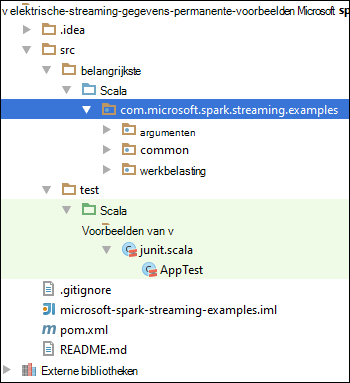

<properties 
    pageTitle="Azure gebeurtenis Hubs gebruiken met een Apache in HDInsight streaming gegevensverwerking | Microsoft Azure" 
    description="Stapsgewijze instructies voor het verzenden van een gegevens streamen op Azure gebeurtenis Hub en vervolgens ontvangt deze gebeurtenissen in uitgerust met een toepassing scala" 
    services="hdinsight" 
    documentationCenter="" 
    authors="nitinme" 
    manager="jhubbard" 
    editor="cgronlun"
    tags="azure-portal"/>

<tags 
    ms.service="hdinsight" 
    ms.workload="big-data" 
    ms.tgt_pltfrm="na" 
    ms.devlang="na" 
    ms.topic="article" 
    ms.date="09/30/2016" 
    ms.author="nitinme"/>

# Een Streaming: Gebeurtenissen van Azure gebeurtenis Hubs met Apache elektrische cluster op HDInsight Linux verwerken

Een Streaming breidt de core elektrische API scalable, hoge gegevensdoorvoer, fouttolerantie stream verwerking toepassingen maken. Gegevens mag worden ingenomen vanuit vele bronnen. In dit artikel kunt we Azure gebeurtenis Hubs gebruiken om op te nemen gegevens. Gebeurtenis Hubs is een zeer scalable opname-systeem dat kan-opname miljoenen van gebeurtenissen per seconde. 

In deze zelfstudie leert u hoe u het maken van een gebeurtenis Azure Hub berichten nemen op een gebeurtenis Hub met gebruikmaking van een consoletoepassing in Java, hoe en hoe u deze weer ophalen parallel met een een-toepassing in Scala geschreven. Deze toepassing gebruikt de gegevens streamen via gebeurtenis Hubs en doorgestuurd naar verschillende uitvoer (Azure opslag Blob, component tabel en SQL-tabel).

> [AZURE.NOTE] Als u wilt volgen de instructies in dit artikel, moet u beide versies van de Azure-portal gebruiken. Als u wilt maken van een gebeurtenis-Hub gebruikt u de [klassieke Azure-portal](https://manage.windowsazure.com). Als u wilt werken met het cluster HDInsight Spark, gebruikt u de [Azure-Portal](https://portal.azure.com/).  

**Vereisten:**

U hebt het volgende:

- Een Azure-abonnement. Zie [Azure krijgen gratis proefversie](https://azure.microsoft.com/documentation/videos/get-azure-free-trial-for-testing-hadoop-in-hdinsight/).
- Een cluster Apache elektrische. Zie voor instructies voor het [maken Apache elektrische clusters in Azure HDInsight](hdinsight-apache-spark-jupyter-spark-sql.md).
- Oracle Java Development kit. U kunt deze installeren vanaf [hier](http://www.oracle.com/technetwork/java/javase/downloads/jdk8-downloads-2133151.html).
- Een Java IDE. In dit artikel worden de IntelliJ IDEE 15.0.1 gebruikt. U kunt deze installeren vanaf [hier](https://www.jetbrains.com/idea/download/).
- Microsoft JDBC-stuurprogramma voor SQL Server, v4.1 of hoger. Dit is vereist voor het schrijven van gegevens van de gebeurtenis in een SQL Server-database. U kunt deze installeren vanaf [hier](https://msdn.microsoft.com/sqlserver/aa937724.aspx).
- Een Azure SQL-database. Zie voor instructies voor het [maken een SQL-database in minuten](../sql-database/sql-database-get-started.md).

## Wat doet deze oplossing?

Dit is hoe de streaming oplossing doorloopt:

1. Maak een Azure gebeurtenis Hub die u een stroom van gebeurtenissen ontvangt.

2. Een lokale zelfstandige toepassing uitvoeren die genereert gebeurtenissen en de Hub van de gebeurtenis Azure oppakken. De voorbeeldtoepassing die u dit doet is [https://github.com/hdinsight/spark-streaming-data-persistence-examples](https://github.com/hdinsight/spark-streaming-data-persistence-examples)gepubliceerd.

2. Een streaming toepassing op afstand uitvoert op een elektrische cluster leest van streaming gebeurtenissen van Azure gebeurtenis Hub en oppakken af op verschillende locaties (Azure Blob, component tabel en tabel SQL-database). 

## Hub Azure gebeurtenis maken

1. In de [Portal van Azure](https://manage.windowsazure.com), selecteert u **Nieuw** > **Service Bus** > **Gebeurtenis Hub** > **Aangepaste maken**.

2. Voer een **Naam voor de gebeurtenis Hub**op het scherm **toevoegen een nieuwe gebeurtenis-Hub** , selecteert u de **regio** maken van de hub in, en een nieuwe naamruimte maken of Selecteer een bestaande eigenschap. Klik op de **pijl** om door te gaan.

    ![pagina 1 van de wizard] (./media/hdinsight-apache-spark-eventhub-streaming/hdispark.streaming.create.event.hub.png "Een Hub Azure gebeurtenis maken")

    > [AZURE.NOTE] Als uw cluster Apache elektrische in HDInsight verkleinen latentie en -kosten moet u dezelfde **locatie** .

3. Voer het **aantal partities** en het **Bericht bewaarbeleid** waarden in het scherm **Gebeurtenis Hub configureren** en klik vervolgens op het vinkje. In dit voorbeeld een aantal partities van 10 en een bericht behoud van 1 te gebruiken. Houd rekening met het aantal partities omdat u deze waarde later moet.

    ![pagina van de wizard 2] (./media/hdinsight-apache-spark-eventhub-streaming/hdispark.streaming.create.event.hub2.png "Geef partition grootte en het bewaarbeleid voor dagen gebeurtenis Hub")

4. Klik op de gebeurtenis Hub die u hebt gemaakt, klikt u op **configureren**en maakt u twee-beleid voor de gebeurtenis hub.

    <table>
    <tr><th>Naam</th><th>Machtigingen</th></tr>
    <tr><td>mysendpolicy</td><td>Verzenden</td></tr>
    <tr><td>myreceivepolicy</td><td>Luisteren</td></tr>
    </table>

    Nadat u de machtigingen hebt gemaakt, selecteert u het pictogram **Opslaan** onder aan de pagina. Hiermee maakt u de gedeelde clienttoegangsbeleid die wordt gebruikt om te verzenden (**mysendpolicy**) en (**myreceivepolicy**) beluisteren in de Hub van deze gebeurtenis.

    ![beleidsregels] (./media/hdinsight-apache-spark-eventhub-streaming/hdispark.streaming.event.hub.policies.png "Beleid voor het maken van de gebeurtenis-Hub")

    
5. Op dezelfde pagina, een Let op het beleid toetsen gegenereerd voor de twee beleidsregels uit te voeren. Sla deze toetsen omdat ze later worden gebruikt.

    ![beleid toetsen] (./media/hdinsight-apache-spark-eventhub-streaming/hdispark.streaming.event.hub.policy.keys.png "Beleid toetsen opslaan")

6. Klik op de pagina **Dashboard** , klikt u op de **Verbindingsgegevens** vanaf de onderkant ophalen en opslaan van de verbindingstekenreeksen voor de gebeurtenis Hub voor het gebruik van de twee beleidsregels.

    ![beleid toetsen] (./media/hdinsight-apache-spark-eventhub-streaming/hdispark.streaming.event.hub.policy.connection.strings.png "Beleid verbindingstekenreeksen opslaan")

## Een toepassing Scala gebruiken om berichten te verzenden naar gebeurtenis Hub

In deze sectie kunt u een zelfstandige lokale Scala toepassing gebruiken om te verzenden van een reeks gebeurtenissen met Azure gebeurtenis Hub die u in de vorige stap hebt gemaakt. Deze toepassing is beschikbaar op GitHub bij [https://github.com/hdinsight/eventhubs-sample-event-producer](https://github.com/hdinsight/eventhubs-sample-event-producer). De volgende stappen proberen wordt ervan uitgegaan dat u al deze opslagplaats GitHub hebt forked.

1. Open de toepassing, **EventhubsSampleEventProducer**, in IntelliJ IDEE.
    
2. Het project maakt. Klik op **Project maken**in het menu **maken** . Het oppervlak uitvoer wordt onder **\out\artifacts**gemaakt.

>[AZURE.TIP] U kunt ook een optie beschikbaar in IntelliJ IDEE rechtstreeks vanuit een bibliotheek GitHub maken het project. Als u wilt weten over het gebruik van deze methode, moet u de instructies gebruiken in de volgende sectie voor instructies. Houd er rekening mee dat een groot aantal stappen die worden beschreven in het volgende gedeelte wordt niet van toepassing zijn op de Scala-toepassing die u in deze stap maakt. Bijvoorbeeld:

> * U moet niet bij de POM als u wilt opnemen van de een-versie. Dit is omdat er geen afhankelijkheid op elektrische voor het maken van deze toepassing
> * U geen enkele potten afhankelijkheid toevoegen aan de bibliotheek van het project. Dat komt doordat deze potten zijn niet vereist voor dit project.

## De toepassing voor het ontvangen van de gebeurtenissen streaming Scala bijwerken

Een voorbeeld Scala toepassing ontvangen van de gebeurtenis en deze doorsturen naar verschillende bestemmingen is beschikbaar op [https://github.com/hdinsight/spark-streaming-data-persistence-examples](https://github.com/hdinsight/spark-streaming-data-persistence-examples). Volg de onderstaande stappen voor het bijwerken van de toepassing en het oppervlak uitvoer maken.

1. IntelliJ IDEE starten en selecteer **uitchecken uit versiebeheer** in het scherm starten en klik op **cijfer**.
        
    

2. Geef in het dialoogvenster **Klonen opslagplaats** de URL naar de bibliotheek cijfer klonen uit, geef de map kopiëren naar en klik vervolgens op **klonen**.

    

    
3. Volg de aanwijzingen totdat het project volledig is gekopieerd. Druk op **Alt + 1** om de **Project-weergave**te openen. Dit moet er dan ongeveer als volgt te werk.

    
    
4. Zorg ervoor dat de toepassingscode is gecompileerd met Java8. Taal projectniveau is om te zorgen dat dit, klik op **bestand**, klik op **Project-structuur**en zorg ervoor dat op het tabblad **Project** ingesteld op **8 - Lambdas, type aantekeningen, enzovoort**.

    

5. Open de **pom.xml** en controleer of de versie van een correct is. Klik onder <properties> knooppunt, zoekt u het volgende fragment en controleer of de een-versie.

        <scala.version>2.10.4</scala.version>
        <scala.compat.version>2.10.4</scala.compat.version>
        <scala.binary.version>2.10</scala.binary.version>
        <spark.version>1.6.2</spark.version>
    
5. De toepassing vereist twee afhankelijkheid potten:

    * **EventHub ontvanger oppervlak**. Dit is vereist voor elektrische voor het ontvangen van berichten van gebeurtenis Hub. Als u wilt gebruiken in dit oppervlak, werken de **pom.xml** om toe te voegen van de volgende handelingen uit onder `<dependencies>`.

            <dependency>
              <groupId>com.microsoft.azure</groupId>
              <artifactId>spark-streaming-eventhubs_2.10</artifactId>
              <version>1.6.0</version>
            </dependency> 

    * **JDBC stuurprogramma oppervlak**. Dit is vereist voor het schrijven van de berichten hebt ontvangen van gebeurtenis Hub in een Azure SQL-database. U kunt downloaden v4.1 of hoger van dit bestand oppervlak vanaf [hier](https://msdn.microsoft.com/sqlserver/aa937724.aspx). Verwijzing naar deze oppervlak toevoegen in de project-bibliotheek. De volgende stappen uitvoeren:

        1. Vanuit IntelliJ IDEE venster waar u de toepassing openen, klikt u op **bestand**hebt **Projectstructuur**op en klik vervolgens op **bibliotheken**. 
        
        2. Klik op het pictogram toevoegen (), klikt u op **Java**en ga vervolgens naar de locatie waar u het JDBC stuurprogramma oppervlak gedownload. Volg de aanwijzingen voor het oppervlak-bestand toevoegen aan de bibliotheek van het project.

            ![ontbrekende afhankelijkheden toevoegen] (./media/hdinsight-apache-spark-eventhub-streaming/add-missing-dependency-jars.png "De ontbrekende afhankelijkheid potten toevoegen")

        3. Klik op **toepassen**.

6. De uitvoer oppervlak-bestand maken. De volgende stappen uitvoeren.
    1. Klik in het dialoogvenster **Projectstructuur** op **onderdelen** en klik vervolgens op het plusteken. In het pop-dialoogvenster **JAR**op en klik vervolgens op **uit modules met afhankelijkheden**.

        

    1. In het dialoogvenster **Maken JAR uit Modules** , klikt u op het beletselteken () ten opzichte van de **Belangrijkste Class**.

    1. Selecteer een van de beschikbare klassen in het dialoogvenster **Selecteer Hoofdgegeven Class** en klik op **OK**.

        

    1. Zorg ervoor dat de optie voor het **extraheren naar de doelsite oppervlak** is geselecteerd in het dialoogvenster **Maken JAR uit Modules** , en klik vervolgens op **OK**. Hiermee wordt een één oppervlak gemaakt met alle afhankelijkheden.

        

    1. Het tabblad **Indeling van de uitvoer** bevat alle potten die opgenomen als onderdeel van het project Maven zijn. U kunt selecteren en verwijderen van de kleuren die waarop de toepassing Scala heeft geen directe afhankelijkheid. Voor de toepassing we hier maakt, kunt u alles, behalve de laatste een (**microsoft-een-streaming-voorbeelden compilatie-uitvoer**). Selecteer de potten wilt verwijderen en klik op het pictogram **verwijderen** ().

        

        Controleer of **op een tabelmaakquery maken** is geselecteerd, waarin zorgt ervoor dat het oppervlak wordt gemaakt telkens wanneer het project wordt gemaakt of bijgewerkt. Klik op **toepassen** en klik vervolgens op **OK**.

    1. In het tabblad **Indeling van de uitvoer** rechts onderaan in het vak **Beschikbare elementen** moet u het SQL JDBC oppervlak die u eerder hebt toegevoegd aan de bibliotheek van het project. U moet dit toevoegen aan het tabblad **Indeling van de uitvoer** . Met de rechtermuisknop op het oppervlak-bestand en klik vervolgens op **Uitpakken in uitvoer hoofdmap**.

          

        Het tabblad **Indeling van de uitvoer** ziet er nu als volgt.

             

        Klik in het dialoogvenster **Projectstructuur** klikt u op **toepassen** en klik vervolgens op **OK**. 

    1. De menubalk op de knop **Opbouwen**en klik vervolgens op **Project maken**. U kunt ook klikken op **Onderdelen maken** als u wilt maken van het oppervlak. Het oppervlak uitvoer wordt onder **\out\artifacts**gemaakt.

        

## De toepassingen op afstand uitvoeren op een elektrische cluster met hier

Hier gebruiken we de streaming-toepassing op afstand uitvoeren op een cluster elektrische. Zie voor gedetailleerde informatie over het gebruik van hier met HDInsight Spark cluster [verzenden taken met een cluster Apache elektrische op Azure HDInsight](hdinsight-apache-spark-livy-rest-interface.md). Voordat u kunt uitvoeren zijn de externe taken op stream gebeurtenissen er uitgerust met een aantal dingen die u moet doen:

1. Start de toepassing lokale zelfstandige gebeurtenissen genereren en verzonden naar gebeurtenis Hub. Gebruik de volgende opdracht kunt doen:

        java -cp EventhubsSampleEventProducer.jar com.microsoft.eventhubs.client.example.EventhubsClientDriver --eventhubs-namespace "mysbnamespace" --eventhubs-name "myeventhub" --policy-name "mysendpolicy" --policy-key "<policy key>" --message-length 32 --thread-count 32 --message-count -1

2. Kopieer het streaming oppervlak (**microsoft-een-streaming-examples.jar**) met de Azure-blobopslag die is gekoppeld aan het cluster. Dit zorgt ervoor dat het oppervlak toegankelijk zijn voor hier. U kunt [**AzCopy**](../storage/storage-use-azcopy.md), een opdrachtregelhulpprogramma kunt doen. Zijn er een groot aantal andere clients die u kunt gebruiken voor het uploaden van gegevens. U vindt meer informatie over deze bij het [uploaden van gegevens voor Hadoop-projecten in HDInsight](hdinsight-upload-data.md).

3. Installeer KRUL op de computer waarop u deze toepassingen uitvoert. We KRUL gebruiken om aan te roepen de eindpunten hier als u wilt de taken op afstand uitvoeren.

### Voer de toepassingen voor het ontvangen van de gebeurtenissen in een Blob Azure opslag als tekst

Open een opdrachtprompt, navigeer naar de map waarin u KRUL hebt geïnstalleerd en voer de volgende opdracht (vervangen gebruikersnaam en wachtwoord en cluster naam):

    curl -k --user "admin:mypassword1!" -v -H "Content-Type: application/json" -X POST --data @C:\Temp\inputBlob.txt "https://mysparkcluster.azurehdinsight.net/livy/batches"

De parameters in het bestand **inputBlob.txt** zijn als volgt gedefinieerd:

    { "file":"wasbs:///example/jars/microsoft-spark-streaming-examples.jar", "className":"com.microsoft.spark.streaming.examples.workloads.EventhubsEventCount", "args":["--eventhubs-namespace", "mysbnamespace", "--eventhubs-name", "myeventhub", "--policy-name", "myreceivepolicy", "--policy-key", "<put-your-key-here>", "--consumer-group", "$default", "--partition-count", 10, "--batch-interval-in-seconds", 20, "--checkpoint-directory", "/EventCheckpoint", "--event-count-folder", "/EventCount/EventCount10"], "numExecutors":20, "executorMemory":"1G", "executorCores":1, "driverMemory":"2G" }

Laat ons begrijpen wat de parameters in het invoer bestand zijn:

* **het bestand** is van het pad naar het bestand voor het oppervlak van toepassing op het Azure opslag-account dat is gekoppeld aan het cluster.
* **klassenaam** is de naam van de klasse in het oppervlak.
* **argumenten** is de lijst met argumenten vereist door de klasse
* **numExecutors** is het aantal cores wordt gebruikt door een voor het uitvoeren van de streaming toepassing. Dit moet altijd ten minste twee maal het aantal gebeurtenis Hub partities.
* **executorMemory**, **executorCores**, **driverMemory** zijn parameters kon u de vereiste resources toewijzen aan de streaming-toepassing.

>[AZURE.NOTE] U hoeft niet te maken van de uitvoermappen (EventCheckpoint, EventCount/EventCount10) die worden gebruikt als parameters. De streaming toepassing ze voor u gemaakt.
    
Wanneer u de opdracht uitvoert, ziet u een uitvoer als volgt uit:

    < HTTP/1.1 201 Created
    < Content-Type: application/json; charset=UTF-8
    < Location: /18
    < Server: Microsoft-IIS/8.5
    < X-Powered-By: ARR/2.5
    < X-Powered-By: ASP.NET
    < Date: Tue, 01 Dec 2015 05:39:10 GMT
    < Content-Length: 37
    <
    {"id":1,"state":"starting","log":[]}* Connection #0 to host mysparkcluster.azurehdinsight.net left intact

Noteer de batch-ID in de laatste regel van de uitvoer (in dit voorbeeld is '1'). Om te bevestigen dat de toepassing wel wordt uitgevoerd, kunt u uw Azure opslag-account dat is gekoppeld aan het cluster bekijken en ziet u de **/EventCount/EventCount10** map er hebt gemaakt. Deze map mogen bevatten BLOB's die het aantal gebeurtenissen verwerkt binnen de opgegeven periode voor de parameter **batch interval in seconden**weergeeft.

De toepassing blijft uitgevoerd totdat u deze verwijderen. Gebruik hiervoor de volgende opdracht uit:

    curl -k --user "admin:mypassword1!" -v -X DELETE "https://mysparkcluster.azurehdinsight.net/livy/batches/1"

### De toepassingen voor het ontvangen van de gebeurtenissen in een Blob Azure opslag als JSON uitvoeren

Open een opdrachtprompt, navigeer naar de map waarin u KRUL hebt geïnstalleerd en voer de volgende opdracht (vervangen gebruikersnaam en wachtwoord en cluster naam):

    curl -k --user "admin:mypassword1!" -v -H "Content-Type: application/json" -X POST --data @C:\Temp\inputJSON.txt "https://mysparkcluster.azurehdinsight.net/livy/batches"

De parameters in het bestand **inputJSON.txt** zijn als volgt gedefinieerd:

    { "file":"wasbs:///example/jars/microsoft-spark-streaming-examples.jar", "className":"com.microsoft.spark.streaming.examples.workloads.EventhubsToAzureBlobAsJSON", "args":["--eventhubs-namespace", "mysbnamespace", "--eventhubs-name", "myeventhub", "--policy-name", "myreceivepolicy", "--policy-key", "<put-your-key-here>", "--consumer-group", "$default", "--partition-count", 10, "--batch-interval-in-seconds", 20, "--checkpoint-directory", "/EventCheckpoint", "--event-count-folder", "/EventCount/EventCount10", "--event-store-folder", "/EventStore10"], "numExecutors":20, "executorMemory":"1G", "executorCores":1, "driverMemory":"2G" }

De parameters zijn vergelijkbaar met wat u hebt opgegeven voor de tekstuitvoer van de in de vorige stap. Nogmaals, hoeft u niet te maken van de uitvoermappen (EventCheckpoint, EventCount/EventCount10) die worden gebruikt als parameters. De streaming toepassing ze voor u gemaakt.

 Nadat u de opdracht uitvoert, kunt u uw Azure opslag-account dat is gekoppeld aan het cluster bekijken en ziet u de **/EventStore10** map er hebt gemaakt. Open een bestand voorafgegaan door **deel-** en u ziet de gebeurtenissen in een indeling van JSON verwerkt.

### De toepassingen voor het ontvangen van de gebeurtenissen in een tabel component uitvoeren

Als u wilt uitvoeren van de toepassing die gebeurtenissen in een tabel component streamt moet u enkele extra onderdelen. Dit zijn:

* datanucleus-api-jdo-3.2.6.jar
* datanucleus-rdbms-3.2.9.jar
* datanucleus-core-3.2.10.jar
* component-site.xml

De **JAR** -bestanden zijn beschikbaar op uw cluster HDInsight Spark bij `/usr/hdp/current/spark-client/lib`. De **component site.xml** beschikbaar is binnen `/usr/hdp/current/spark-client/conf`.

U kunt [WinScp](http://winscp.net/eng/download.php) gebruiken om te kopiëren via deze bestanden uit het cluster met uw lokale computer. Vervolgens kunt u in hulpmiddelen voor deze bestanden via kopiëren naar uw opslag-account dat is gekoppeld aan het cluster. Zie [gegevens voor Hadoop-projecten in HDInsight uploaden](hdinsight-upload-data.md)voor meer informatie over het uploaden van bestanden naar de opslag-account.

Nadat u naar uw account Azure opslagruimte over de bestanden hebt gekopieerd, open een opdrachtprompt, navigeer naar de map waarin u KRUL hebt geïnstalleerd en voer de volgende opdracht (vervangen gebruikersnaam en wachtwoord en cluster naam):

    curl -k --user "admin:mypassword1!" -v -H "Content-Type: application/json" -X POST --data @C:\Temp\inputHive.txt "https://mysparkcluster.azurehdinsight.net/livy/batches"

De parameters in het bestand **inputHive.txt** zijn als volgt gedefinieerd:

    { "file":"wasbs:///example/jars/microsoft-spark-streaming-examples.jar", "className":"com.microsoft.spark.streaming.examples.workloads.EventhubsToHiveTable", "args":["--eventhubs-namespace", "mysbnamespace", "--eventhubs-name", "myeventhub", "--policy-name", "myreceivepolicy", "--policy-key", "<put-your-key-here>", "--consumer-group", "$default", "--partition-count", 10, "--batch-interval-in-seconds", 20, "--checkpoint-directory", "/EventCheckpoint", "--event-count-folder", "/EventCount/EventCount10", "--event-hive-table", "EventHiveTable10" ], "jars":["wasbs:///example/jars/datanucleus-api-jdo-3.2.6.jar", "wasbs:///example/jars/datanucleus-rdbms-3.2.9.jar", "wasbs:///example/jars/datanucleus-core-3.2.10.jar"], "files":["wasbs:///example/jars/hive-site.xml"], "numExecutors":20, "executorMemory":"1G", "executorCores":1, "driverMemory":"2G" }

De parameters zijn vergelijkbaar met wat u hebt opgegeven voor de tekstuitvoer van de in de vorige stappen. Nogmaals, u hoeft niet te maken van de uitvoermappen (EventCheckpoint, EventCount/EventCount10) of de uitvoer component tabel (EventHiveTable10) die worden gebruikt als parameters. De streaming toepassing ze voor u gemaakt. Houd er rekening mee dat de optie **potten** en **bestanden** paden naar de JAR-bestanden en de component-site.xml die u hebt gekopieerd boven aan het account opslag bevat.

Om te bevestigen dat de tabel component is gemaakt, kunt u SSH in de cluster en uitvoeren component-query's. Zie [Gebruik component met Hadoop in HDInsight via SSH](hdinsight-hadoop-use-hive-ssh.md)voor instructies. Nadat u via SSH verbonden bent, kunt u de volgende opdracht uit om te controleren of de tabel component **EventHiveTable10**, is gemaakt kunt uitvoeren.

    show tables;

Hier ziet u een uitvoer ongeveer als volgt uit:

    OK
    eventhivetable10
    hivesampletable

U kunt ook een selectiequery om weer te geven van de inhoud van de tabel uitvoeren.

    SELECT * FROM eventhivetable10 LIMIT 10;

Hier ziet u een uitvoer als volgt uit:

    ZN90apUSQODDTx7n6Toh6jDbuPngqT4c
    sor2M7xsFwmaRW8W8NDwMneFNMrOVkW1
    o2HcsU735ejSi2bGEcbUSB4btCFmI1lW
    TLuibq4rbj0T9st9eEzIWJwNGtMWYoYS
    HKCpPlWFWAJILwR69MAq863nCWYzDEw6
    Mvx0GQOPYvPR7ezBEpIHYKTKiEhYammQ
    85dRppSBSbZgThLr1s0GMgKqynDUqudr
    5LAWkNqorLj3ZN9a2mfWr9rZqeXKN4pF
    ulf9wSFNjD7BZXCyunozecov9QpEIYmJ
    vWzM3nvOja8DhYcwn0n5eTfOItZ966pa
    Time taken: 4.434 seconds, Fetched: 10 row(s)

### De toepassingen voor het ontvangen van de gebeurtenissen in een tabel met Azure SQL database uitvoeren

Voordat u deze stap, zorg er een Azure SQL-database gemaakt. Moet u waarden voor de databasenaam van de, de naam van de database-server en de referenties van de beheerder van database als parameters. U hoeft niet te maken met de databasetabel. De streaming-toepassing die voor u gemaakt.

Open een opdrachtprompt, navigeer naar de map waarin u KRUL hebt geïnstalleerd en voer de volgende opdracht:

    curl -k --user "admin:mypassword1!" -v -H "Content-Type: application/json" -X POST --data @C:\Temp\inputSQL.txt "https://mysparkcluster.azurehdinsight.net/livy/batches"

De parameters in het bestand **inputSQL.txt** zijn als volgt gedefinieerd:

    { "file":"wasbs:///example/jars/microsoft-spark-streaming-examples.jar", "className":"com.microsoft.spark.streaming.examples.workloads.EventhubsToAzureSQLTable", "args":["--eventhubs-namespace", "mysbnamespace", "--eventhubs-name", "myeventhub", "--policy-name", "myreceivepolicy", "--policy-key", "<put-your-key-here>", "--consumer-group", "$default", "--partition-count", 10, "--batch-interval-in-seconds", 20, "--checkpoint-directory", "/EventCheckpoint", "--event-count-folder", "/EventCount/EventCount10", "--sql-server-fqdn", "<database-server-name>.database.windows.net", "--sql-database-name", "mysparkdatabase", "--database-username", "sparkdbadmin", "--database-password", "<put-password-here>", "--event-sql-table", "EventContent" ], "numExecutors":20, "executorMemory":"1G", "executorCores":1, "driverMemory":"2G" }

Om te bevestigen dat de toepassing wel wordt uitgevoerd, kunt u een verbinding maken met de SQL Azure-database met SQL Server Management Studio. Zie voor instructies over hoe u dat doen, [verbinding maken met SQL-Database met SQL Server Management Studio](../sql-database/sql-database-connect-query-ssms.md). Nadat u met de database verbonden bent, kunt u navigeren naar de **EventContent** -tabel die is gemaakt door de streaming-toepassing. U kunt een snelle query om de gegevens uit de tabel uitvoeren. Voer de volgende query:

    SELECT * FROM EventCount

Hier ziet u uitvoer ongeveer als volgt uit:

    00046b0f-2552-4980-9c3f-8bba5647c8ee
    000b7530-12f9-4081-8e19-90acd26f9c0c
    000bc521-9c1b-4a42-ab08-dc1893b83f3b
    00123a2a-e00d-496a-9104-108920955718
    0017c68f-7a4e-452d-97ad-5cb1fe5ba81b
    001KsmqL2gfu5ZcuQuTqTxQvVyGCqPp9
    001vIZgOStka4DXtud0e3tX7XbfMnZrN
    00220586-3e1a-4d2d-a89b-05c5892e541a
    0029e309-9e54-4e1b-84be-cd04e6fce5ec
    003333cf-874f-4045-9da3-9f98c2b4ea49
    0043c07e-8d73-420a-9af7-1fcb94575356
    004a11a9-0c2c-4bc0-a7d5-2e0ebd947ab9

    
## Zie ook

* [Overzicht: Apache elektrische op Azure HDInsight](hdinsight-apache-spark-overview.md)

### Scenario 's

* [Elektrische met BI: interactieve gegevensanalyses elektrische in HDInsight met hulpmiddelen voor BI uitvoeren](hdinsight-apache-spark-use-bi-tools.md)

* [Elektrische met Machine Learning: gebruik een in HDInsight building temperatuur met Aircoschema gegevens analyseren](hdinsight-apache-spark-ipython-notebook-machine-learning.md)

* [Elektrische met Machine Learning: gebruik een in HDInsight eten controleresultaten voorspellen](hdinsight-apache-spark-machine-learning-mllib-ipython.md)

* [Website logboekanalyse met behulp van een in HDInsight](hdinsight-apache-spark-custom-library-website-log-analysis.md)

### Maken en uitvoeren van toepassingen

* [Een zelfstandige toepassing maken met Scala](hdinsight-apache-spark-create-standalone-application.md)

* [Taken op afstand uitvoeren op een elektrische cluster met hier](hdinsight-apache-spark-livy-rest-interface.md)

### Hulpprogramma's en uitbreidingen

* [HDInsight-invoegtoepassing voor hulpmiddelen voor IntelliJ IDEE maken en indienen elektrische Scala toepassingen gebruiken](hdinsight-apache-spark-intellij-tool-plugin.md)

* [Gebruik HDInsight-invoegtoepassing voor hulpmiddelen voor IntelliJ verloop foutopsporing elektrische toepassingen op afstand uitvoeren](hdinsight-apache-spark-intellij-tool-plugin-debug-jobs-remotely.md)

* [Zeppelin notitieblokken gebruikt met een cluster elektrische op HDInsight](hdinsight-apache-spark-use-zeppelin-notebook.md)

* [Kernels beschikbaar voor Jupyter notitieblok in een cluster voor HDInsight](hdinsight-apache-spark-jupyter-notebook-kernels.md)

* [Externe-pakketten gebruiken met Jupyter notitieblokken](hdinsight-apache-spark-jupyter-notebook-use-external-packages.md)

* [Jupyter installeren op uw computer en verbinding maken met een cluster HDInsight Spark](hdinsight-apache-spark-jupyter-notebook-install-locally.md)

### Resources beheren

* [Bronnen voor de Apache elektrische cluster in Azure HDInsight beheren](hdinsight-apache-spark-resource-manager.md)

* [Bijhouden en foutopsporing taken op een cluster Apache elektrische in HDInsight](hdinsight-apache-spark-job-debugging.md)

[hdinsight-versions]: hdinsight-component-versioning.md
[hdinsight-upload-data]: hdinsight-upload-data.md
[hdinsight-storage]: hdinsight-hadoop-use-blob-storage.md

[azure-purchase-options]: http://azure.microsoft.com/pricing/purchase-options/
[azure-member-offers]: http://azure.microsoft.com/pricing/member-offers/
[azure-free-trial]: http://azure.microsoft.com/pricing/free-trial/
[azure-management-portal]: https://manage.windowsazure.com/
[azure-create-storageaccount]: ../storage-create-storage-account/ 
