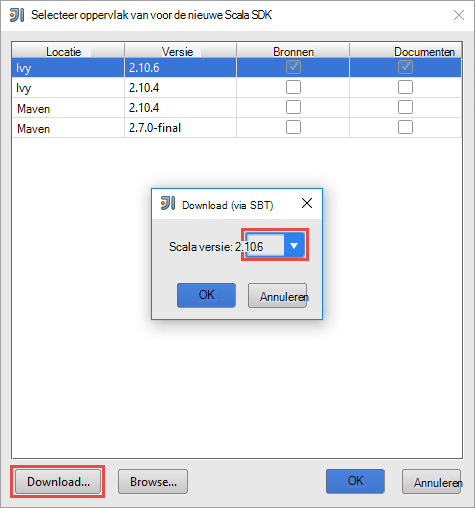
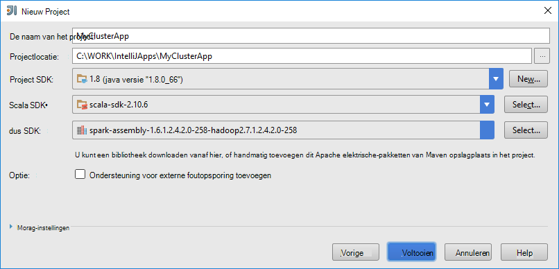
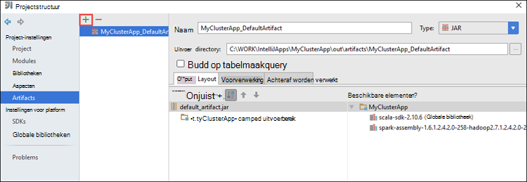
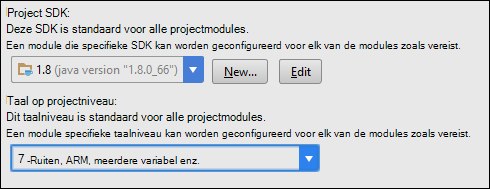
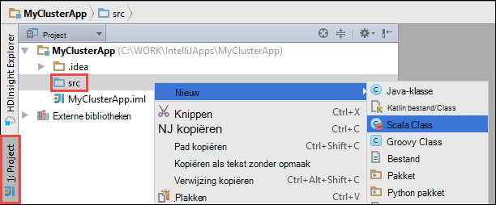

 <properties
    pageTitle="Gebruik van HDInsight hulpmiddelen in Azure Toolkit voor IntelliJ voor foutopsporing op afstand van toepassingen op HDInsight Spark clusters | Microsoft Azure"
    description="Leer hoe HDInsight hulpmiddelen in Azure Toolkit voor IntelliJ te gebruiken voor foutopsporing op afstand van toepassingen op HDInsight Spark clusters."
    services="hdinsight"
    documentationCenter=""
    authors="nitinme"
    manager="jhubbard"
    editor="cgronlun"
    tags="azure-portal"/>

<tags
    ms.service="hdinsight"
    ms.workload="big-data"
    ms.tgt_pltfrm="na"
    ms.devlang="na"
    ms.topic="article"
    ms.date="09/09/2016"
    ms.author="nitinme"/>

# Fouten opsporen in een toepassingen op afstand op HDInsight elektrische Linux cluster met HDInsight hulpprogramma's uit Azure Toolkit voor IntelliJ

In dit artikel vindt u stapsgewijze instructies over het gebruik van de hulpmiddelen HDInsight in Azure Toolkit voor IntelliJ aan een taak een op HDInsight Spark cluster stuurt en klik vervolgens op afstand foutopsporing vanaf uw pc. Hiervoor moet u de volgende algemene stappen uitvoeren:

1. Maak een site-naar-site of punt-naar-site Azure Virtual Network. De stappen in dit document wordt ervan uitgegaan dat die u een netwerk met een site-naar-site gebruikt.

2. Maak een elektrische cluster in Azure HDInsight die deel uitmaakt van het site-naar-site Azure virtuele netwerk.

3. Controleer of de connectiviteit tussen de headnode cluster en uw bureaublad.

4. Maken van een toepassing Scala in IntelliJ IDEE en configureer deze voor foutopsporing op afstand.

5. Uitvoeren en fouten opsporen in de toepassing.

##Vereisten voor

* Een Azure-abonnement. Zie [Azure krijgen gratis proefversie](https://azure.microsoft.com/documentation/videos/get-azure-free-trial-for-testing-hadoop-in-hdinsight/).

* Een cluster Apache elektrische op HDInsight Linux. Zie voor instructies voor het [maken Apache elektrische clusters in Azure HDInsight](hdinsight-apache-spark-jupyter-spark-sql.md).
 
* Oracle Java Development kit. U kunt deze installeren vanaf [hier](http://www.oracle.com/technetwork/java/javase/downloads/jdk8-downloads-2133151.html).
 
* IntelliJ IDEE. In dit artikel gebruikt versie 15.0.1. U kunt deze installeren vanaf [hier](https://www.jetbrains.com/idea/download/).
 
* Hulpprogramma's voor een HDInsight in Azure Toolkit voor IntelliJ. HDInsight hulpmiddelen voor IntelliJ die beschikbaar zijn als onderdeel van de Azure Toolkit voor IntelliJ. Zie de [installatie van de Azure Toolkit voor IntelliJ](../azure-toolkit-for-intellij-installation.md)voor instructies over het installeren van de Azure-Toolkit.

* Meld u aan bij uw Azure abonnement van IntelliJ IDEE. Volg de instructies [hier](hdinsight-apache-spark-intellij-tool-plugin.md#log-into-your-azure-subscription).
 
* Tijdens het uitvoeren van Scala van een toepassing voor foutopsporing op afstand op een Windows-computer, krijgt u mogelijk een uitzondering zoals wordt uitgelegd in [elektrische-2356](https://issues.apache.org/jira/browse/SPARK-2356) die vanwege een ontbrekende WinUtils.exe in Windows optreedt. U kunt deze fout omzeilen, moet u [het uitvoerbare bestand vanaf hier downloaden](http://public-repo-1.hortonworks.com/hdp-win-alpha/winutils.exe) naar een locatie zoals **C:\WinUtils\bin**. Vervolgens moet u een omgevingsvariabele **HADOOP_HOME** toevoegen en stel de waarde van de variabele op **C\WinUtils**.

## Stap 1: Een Azure virtuele netwerk maken

Volg de instructies van de onderstaande koppelingen kunt maken van een Azure Virtual Network en controleer of de connectiviteit tussen de bureaublad- en Azure Virtual Network.

* [Een VNet maken met een VPN-verbinding van het site-naar-site met behulp van Azure-Portal](../vpn-gateway/vpn-gateway-howto-site-to-site-resource-manager-portal.md)
* [Een VNet maken met een VPN-verbinding van het site-naar-site via PowerShell](../vpn-gateway/vpn-gateway-create-site-to-site-rm-powershell.md)
* [Een punt-naar-site-verbinding met een virtueel netwerk via PowerShell configureren](../vpn-gateway/vpn-gateway-howto-point-to-site-rm-ps.md)

## Stap 2: Een cluster HDInsight Spark maken

Klik op Azure HDInsight die deel uitmaakt van de Azure Virtual Network die u hebt gemaakt, moet u ook een cluster Apache elektrische maken. Gebruik de informatie beschikbaar [maken Linux gebaseerde clusters in HDInsight](hdinsight-hadoop-provision-linux-clusters.md). Als onderdeel van optionele configuratie, selecteert u het Azure virtuele netwerk dat u in de vorige stap hebt gemaakt.

## Stap 3: Controleer of de connectiviteit tussen de headnode cluster en uw bureaublad

1. Het IP-adres van de headnode krijgen. Open Ambari UI voor het cluster. Klik op **Dashboard**van het blad cluster.

    

2. Klik op de Ambari UI, in de rechterbovenhoek op **Hosts**.

    

3. U ziet een lijst met headnodes, werknemer knooppunten en zookeeper knooppunten. De headnodes hebben de **hn*** voorvoegsel. Klik op de eerste headnode.

    

4. Onder aan de pagina dat wordt geopend, via het vak **Samenvatting** , kopieert u het IP-adres van de headnode en de hostnaam.

    

5. Het IP-adres en de hostnaam van de headnode naar het bestand **hosts** op de computer waaruit u wilt uitvoeren en extern fouten opsporen in de taken een opnemen. Hiermee kunt u communiceren met de headnode met het IP-adres, evenals de hostnaam.

    1. Open een Kladblok met verhoogde machtigingen. Vanuit het bestandsmenu, klik op **openen** en ga vervolgens naar de locatie van het Hostsbestand. Op een Windows-computer, is het `C:\Windows\System32\Drivers\etc\hosts`.

    2. De volgende toevoegen aan de **hosts** -bestand.

            # For headnode0
            192.xxx.xx.xx hn0-nitinp
            192.xxx.xx.xx hn0-nitinp.lhwwghjkpqejawpqbwcdyp3.gx.internal.cloudapp.net

            # For headnode1
            192.xxx.xx.xx hn1-nitinp
            192.xxx.xx.xx hn1-nitinp.lhwwghjkpqejawpqbwcdyp3.gx.internal.cloudapp.net

5. Op de computer waarop u verbinding met het Azure virtuele netwerk dat wordt gebruikt door het cluster HDInsight, controleren dat u zowel de headnodes met het IP-adres, evenals de hostnaam kunt pingen.

6. SSH in de cluster headnode volgens de instructies in [verbinding maken met een HDInsight cluster via SSH](hdinsight-hadoop-linux-use-ssh-windows.md#connect-to-a-linux-based-hdinsight-cluster). Ping van de headnode cluster het IP-adres van de pc is geïnstalleerd. Connectiviteit met zowel de IP-adressen die zijn toegewezen aan de computer, één telefoonnummer voor de netwerkverbinding en de andere voor het Azure virtuele netwerk waarmee de computer is verbonden, moet u testen.

7. Herhaal de stappen voor de andere headnode ook. 

## Stap 4: Een Scala van een toepassing maken met de hulpmiddelen HDInsight in Azure Toolkit voor IntelliJ en configureer deze voor foutopsporing op afstand

1. IntelliJ IDEE starten en een nieuw project maken. De volgende opties in het dialoogvenster Nieuw project en klik vervolgens op **volgende**.

    

    * Selecteer **HDInsight**in het linkerdeelvenster.
    * Selecteer in het rechterdeelvenster **een op HDInsight (Scala)**.
    * Klik op **volgende**.

2. Geef in het volgende venster de projectdetails.

    * Geef een naam van het project en projectlocatie.
    * Zorg dat u opgeeft dat een groter is dan 7 Java-versie voor **Project SDK**.
    * Voor **Scala SDK**, klikt u op **maken**, klikt u op **downloaden**en selecteer vervolgens de versie van Scala gebruiken. **Zorg ervoor dat u geen gebruik maakt versie 2.11.x**. In dit voorbeeld wordt de versie **2.10.6**gebruikt.

        

    * Voor **Een SDK**, downloaden en gebruiken van de SDK van [hier](http://go.microsoft.com/fwlink/?LinkID=723585&clcid=0x409). U kunt ook deze negeren en gebruiken de [elektrische Maven opslagplaats](http://mvnrepository.com/search?q=spark) in plaats daarvan echter Zorg ervoor dat u hebt de juiste maven opslagplaats geïnstalleerd om een toepassingen ontwikkelen. (Bijvoorbeeld u nodig hebt om ervoor te zorgen dat u hebt het deel achter de elektrische Streaming geïnstalleerd als u werkt met een Streaming; Ook neemt Zorg ervoor dat u gebruikt de bibliotheek gemarkeerd als Scala 2.10: kan niet gebruiken die de bibliotheek gemarkeerd als Scala 2.11.)

        

    * Klik op **Voltooien**.

3. Het project een maakt een onderdeel automatisch voor u. Voer de volgende stappen uit het onderdeel vindt.

    1. Klik in het menu **bestand** op **Projectstructuur**.
    2. Klik in het dialoogvenster **Projectstructuur** op **onderdelen** als u wilt zien van de standaard-onderdeel dat wordt gemaakt.

        

    U kunt ook uw eigen onderdeel maken bly te klikken op de **+** pictogram, gemarkeerd in de bovenstaande afbeelding.

4. Klik op **Project**in het dialoogvenster **Projectstructuur** . Als de **Project-SDK** is ingesteld op 1,8, Controleer of het **niveau van de Project-taal** is ingesteld op **7 - ruiten, ARM, meerdere variabel, enzovoort**.

    

4. Bibliotheken toevoegen aan uw project. Naar een bibliotheek toevoegen, met de rechtermuisknop op de naam van het project in de projectstructuur en klik vervolgens op **Openen Module-instellingen**. Klik in het dialoogvenster **Projectstructuur** Klik in het linkerdeelvenster op **bibliotheken**, klikt u op het (+) symbool en klik vervolgens op **Maven uit**. 

     

    Klik in het dialoogvenster **Bibliotheek downloaden uit de bibliotheek Maven** zoeken en toevoegen van de volgende bibliotheken.

    * `org.scalatest:scalatest_2.10:2.2.1`
    * `org.apache.hadoop:hadoop-azure:2.7.1`

5. Kopie `yarn-site.xml` en `core-site.xml` uit de headnode cluster en voeg deze toe aan het project. De volgende opdrachten gebruiken om de bestanden te kopiëren. U kunt [Cygwin](https://cygwin.com/install.html) Voer de volgende `scp` opdrachten kunt u de bestanden uit de headnodes cluster kopiëren.

        scp <ssh user name>@<headnode IP address or host name>://etc/hadoop/conf/core-site.xml .

    Omdat we het IP-adres van cluster headnode- en hostnamen al toegevoegd voor de hosts bestand op het bureaublad, we de **scp** -opdrachten in de volgende wijze kunnen gebruiken.

        scp sshuser@hn0-nitinp:/etc/hadoop/conf/core-site.xml .
        scp sshuser@hn0-nitinp:/etc/hadoop/conf/yarn-site.xml .

    Deze bestanden toevoegen aan uw project door deze te kopiëren onder de map **/src** in de projectstructuur van uw, bijvoorbeeld `<your project directory>\src`.

6. Update van de `core-site.xml` naar de volgende wijzigingen aanbrengen.

    1. `core-site.xml`bevat de versleutelde sleutel aan de opslag-account dat is gekoppeld aan het cluster. In de `core-site.xml` dat u toegevoegd aan het project, de gecodeerde sleutel vervangen door de werkelijke opslag-toets die is gekoppeld aan het standaardaccount voor de opslag. Zie [uw toegangstoetsen opslag beheren](../storage/storage-create-storage-account.md#manage-your-storage-account).

            <property>
                <name>fs.azure.account.key.hdistoragecentral.blob.core.windows.net</name>
                <value>access-key-associated-with-the-account</value>
            </property>

    2. Verwijderen van de volgende items uit de `core-site.xml`.

            <property>
                <name>fs.azure.account.keyprovider.hdistoragecentral.blob.core.windows.net</name>
                <value>org.apache.hadoop.fs.azure.ShellDecryptionKeyProvider</value>
            </property>

            <property>
                <name>fs.azure.shellkeyprovider.script</name>
                <value>/usr/lib/python2.7/dist-packages/hdinsight_common/decrypt.sh</value>
            </property>

            <property>
                <name>net.topology.script.file.name</name>
                <value>/etc/hadoop/conf/topology_script.py</value>
            </property>

    3. Sla het bestand.

7. De klasse Hoofdgegeven voor uw toepassing toevoegen. Vanuit de **Projectverkenner**met de rechtermuisknop op **src**, wijs **Nieuw**aan en klik vervolgens op **Scala class**.

    

8. Geef een naam, voor select **type** **Object**, in het dialoogvenster **Nieuwe Scala klasse maken** en klik vervolgens op **OK**.

    

9. In de `MyClusterAppMain.scala` bestand, plak de volgende code. Met deze code maakt de elektrische context en gestart een `executeJob` methode uit de `SparkSample` object.

        import org.apache.spark.{SparkConf, SparkContext}

        object SparkSampleMain {
          def main (arg: Array[String]): Unit = {
            val conf = new SparkConf().setAppName("SparkSample")
                                      .set("spark.hadoop.validateOutputSpecs", "false")
            val sc = new SparkContext(conf)
        
            SparkSample.executeJob(sc,
                                   "wasbs:///HdiSamples/HdiSamples/SensorSampleData/hvac/HVAC.csv",
                                   "wasbs:///HVACOut")
          }
        }

10. Herhaal stap 8 en 9 hierboven om toe te voegen een nieuw Scala object genoemd `SparkSample`. Voeg de volgende code toe aan deze klasse. Deze code leest de gegevens uit de HVAC.csv (beschikbaar op alle HDInsight Spark clusters), worden de rijen die slechts één cijfer in de zevende kolom in de CSV hebben en schrijft de uitvoer naar **/HVACOut** onder de container standaard opslag voor het cluster.

        import org.apache.spark.SparkContext
    
        object SparkSample {
          def executeJob (sc: SparkContext, input: String, output: String): Unit = {
            val rdd = sc.textFile(input)
        
            //find the rows which have only one digit in the 7th column in the CSV
            val rdd1 =  rdd.filter(s => s.split(",")(6).length() == 1)
        
            val s = sc.parallelize(rdd.take(5)).cartesian(rdd).count()
            println(s)
        
            rdd1.saveAsTextFile(output)
            //rdd1.collect().foreach(println)
          }
        
        }

11. Herhaal stap 8 en 9 hierboven om toe te voegen een nieuwe klasse `RemoteClusterDebugging`. Deze klasse implementeert het kader van een test die wordt gebruikt voor foutopsporing in toepassingen. Voeg de volgende code aan de `RemoteClusterDebugging` class.

        import org.apache.spark.{SparkConf, SparkContext}
        import org.scalatest.FunSuite
        
        class RemoteClusterDebugging extends FunSuite {
        
          test("Remote run") {
            val conf = new SparkConf().setAppName("SparkSample")
                                      .setMaster("yarn-client")
                                      .set("spark.yarn.am.extraJavaOptions", "-Dhdp.version=2.4")
                                      .set("spark.yarn.jar", "wasbs:///hdp/apps/2.4.2.0-258/spark-assembly-1.6.1.2.4.2.0-258-hadoop2.7.1.2.4.2.0-258.jar")
                                      .setJars(Seq("""C:\WORK\IntelliJApps\MyClusterApp\out\artifacts\MyClusterApp_DefaultArtifact\default_artifact.jar"""))
                                      .set("spark.hadoop.validateOutputSpecs", "false")
            val sc = new SparkContext(conf)
        
            SparkSample.executeJob(sc,
              "wasbs:///HdiSamples/HdiSamples/SensorSampleData/hvac/HVAC.csv",
              "wasbs:///HVACOut")
          }
        }

    Enkele belangrijke punten onthouden hier:
    
    * Voor `.set("spark.yarn.jar", "wasbs:///hdp/apps/2.4.2.0-258/spark-assembly-1.6.1.2.4.2.0-258-hadoop2.7.1.2.4.2.0-258.jar")`, zorg ervoor dat de vergadering een oppervlak is beschikbaar op de clusteropslag in het opgegeven pad.
    * Voor `setJars`, geef de locatie waar het onderdeel oppervlak worden gemaakt. Dit is meestal `<Your IntelliJ project directory>\out\<project name>_DefaultArtifact\default_artifact.jar`. 

11. In de `RemoteClusterDebugging` klasse, met de rechtermuisknop op de `test` trefwoord en selecteer **RemoteClusterDebugging configuratie maken**.

    

12. Geef een naam voor de configuratie in het dialoogvenster en selecteer een **Test type** als **de naam van de Test**. Alle andere waarden als standaard verlaten, klikt u op **toepassen**en klik vervolgens op **OK**.

    

13. U ziet nu een configuratie **Externe uitvoeren** -omlaag op de menubalk. 

    

## Stap 5: De toepassing uitvoeren in de foutopsporingsmodus voor

1. Open in uw project IntelliJ IDEE `SparkSample.scala` en maak een onderbrekingspunt naast 'val rdd1'. Selecteer in het pop-upmenu voor het maken van een onderbrekingspunt **lijn in de functie executeJob**.

    

2. Klik op de knop **Foutopsporing uitvoeren** naast de configuratie **Externe uitvoeren** vervolgkeuzelijst in waarop de toepassing wordt gestart.

    

3. Wanneer de uitvoering van het programma voor het onderbrekingspunt bereikt, ziet u een tabblad **Foutopsporing** in het onderste deelvenster.

    

4. Klik op de (**+**) pictogram voor het toevoegen van een controle zoals weergegeven in de onderstaande afbeelding. 

    

    Hier zijn, omdat de toepassing voordat u de variabele beëindigt `rdd1` is gemaakt, met deze controle we kunnen zien wat zijn de eerste 5 rijen in de variabele `rdd`. Druk op **ENTER**.

    

    Wat u ziet in de bovenstaande afbeelding is dat terrabytes van gegevens en foutopsporing gedurende runtime, kan query hoe de voortgang van uw toepassing. Bijvoorbeeld, in de uitvoer in de bovenstaande afbeelding wordt weergegeven, ziet u dat de eerste rij van de uitvoer een koptekst is. Op basis van dit, kunt u uw toepassingscode als u wilt de veldnamenrij overslaan desgewenst wijzigen.

5. U kunt nu klikken op het programmapictogram van **Cv** om door te gaan met uw toepassing klaar.

    

6. Als de toepassing voltooid is, ziet u een uitvoer als volgt uit.

    

 

## Zie ook

* [Overzicht: Apache elektrische op Azure HDInsight](hdinsight-apache-spark-overview.md)

### Scenario 's

* [Elektrische met BI: interactieve gegevensanalyses elektrische in HDInsight met hulpmiddelen voor BI uitvoeren](hdinsight-apache-spark-use-bi-tools.md)

* [Elektrische met Machine Learning: gebruik een in HDInsight building temperatuur met Aircoschema gegevens analyseren](hdinsight-apache-spark-ipython-notebook-machine-learning.md)

* [Elektrische met Machine Learning: gebruik een in HDInsight eten controleresultaten voorspellen](hdinsight-apache-spark-machine-learning-mllib-ipython.md)

* [Een Streaming: Gebruik een in HDInsight voor het samenstellen van realtime streaming-toepassingen](hdinsight-apache-spark-eventhub-streaming.md)

* [Website logboekanalyse met behulp van een in HDInsight](hdinsight-apache-spark-custom-library-website-log-analysis.md)

### Maken en uitvoeren van toepassingen

* [Een zelfstandige toepassing maken met Scala](hdinsight-apache-spark-create-standalone-application.md)

* [Taken op afstand uitvoeren op een elektrische cluster met hier](hdinsight-apache-spark-livy-rest-interface.md)

### Hulpprogramma's en uitbreidingen

* [Hulpmiddelen voor HDInsight gebruiken in Azure Toolkit voor IntelliJ maken en indienen elektrische Scala toepassingen](hdinsight-apache-spark-intellij-tool-plugin.md)

* [Hulpmiddelen voor HDInsight gebruiken in Azure Toolkit voor Eclips elektrische toepassingen maken](hdinsight-apache-spark-eclipse-tool-plugin.md)

* [Zeppelin notitieblokken gebruikt met een cluster elektrische op HDInsight](hdinsight-apache-spark-use-zeppelin-notebook.md)

* [Kernels beschikbaar voor Jupyter notitieblok in een cluster voor HDInsight](hdinsight-apache-spark-jupyter-notebook-kernels.md)

* [Externe-pakketten gebruiken met Jupyter notitieblokken](hdinsight-apache-spark-jupyter-notebook-use-external-packages.md)

* [Jupyter installeren op uw computer en verbinding maken met een cluster HDInsight Spark](hdinsight-apache-spark-jupyter-notebook-install-locally.md)

### Resources beheren

* [Bronnen voor de Apache elektrische cluster in Azure HDInsight beheren](hdinsight-apache-spark-resource-manager.md)

* [Bijhouden en foutopsporing taken op een cluster Apache elektrische in HDInsight](hdinsight-apache-spark-job-debugging.md)
