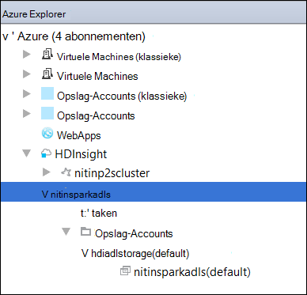
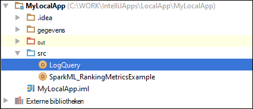

 <properties
    pageTitle="Maken van een Scala toepassingen HDInsight hulpmiddelen voor gebruik in Azure Toolkit voor IntelliJ | Microsoft Azure"
    description="Informatie over het maken van een zelfstandig product een toepassing wilt uitvoeren op HDInsight Spark clusters."
    services="hdinsight"
    documentationCenter=""
    authors="nitinme"
    manager="jhubbard"
    editor="cgronlun"
    tags="azure-portal"/>

<tags
    ms.service="hdinsight"
    ms.workload="big-data"
    ms.tgt_pltfrm="na"
    ms.devlang="na"
    ms.topic="article"
    ms.date="09/09/2016"
    ms.author="nitinme"/>

# Hulpmiddelen voor HDInsight gebruiken in Azure Toolkit voor IntelliJ elektrische toepassingen voor HDInsight elektrische Linux cluster maken

Dit artikel vindt stapsgewijze instructies over het ontwikkelen elektrische toepassingen in Scala en het versturen van deze aan een HDInsight Spark cluster met hulpmiddelen voor HDInsight in Azure Toolkit voor IntelliJ geschreven.  U kunt de hulpmiddelen in op verschillende manieren gebruiken:

* Ontwikkelen en een Scala Spark-aanvraag op een cluster HDInsight Spark indienen
* Voor toegang tot uw Azure HDInsight elektrische cluster resources
* Voor het ontwikkelen en een toepassing Scala Spark lokaal uitvoeren

U kunt ook een video [hier](https://mix.office.com/watch/1nqkqjt5xonza) om u aan de slag volgen.

>[AZURE.IMPORTANT] Dit hulpmiddel kunt maken en indienen toepassingen alleen inschakelen voor een cluster HDInsight Spark op Linux worden gebruikt.

##Vereisten voor

* Een Azure-abonnement. Zie [Azure krijgen gratis proefversie](https://azure.microsoft.com/documentation/videos/get-azure-free-trial-for-testing-hadoop-in-hdinsight/).

* Een cluster Apache elektrische op HDInsight Linux. Zie voor instructies voor het [maken Apache elektrische clusters in Azure HDInsight](hdinsight-apache-spark-jupyter-spark-sql.md).

* Oracle Java Development kit. U kunt deze installeren vanaf [hier](http://www.oracle.com/technetwork/java/javase/downloads/jdk8-downloads-2133151.html).

* IntelliJ IDEE. In dit artikel gebruikt versie 15.0.1. U kunt deze installeren vanaf [hier](https://www.jetbrains.com/idea/download/).

## Hulpmiddelen voor HDInsight in Azure Toolkit voor IntelliJ installeren

HDInsight tools voor IntelliJ beschikbaar is als onderdeel van de Azure Toolkit voor IntelliJ. Zie de [installatie van de Azure Toolkit voor IntelliJ](../azure-toolkit-for-intellij-installation.md)voor instructies over het installeren van de Azure-Toolkit.

## Meld u aan bij uw Azure-abonnement

1. Start de IDE IntelliJ en open de Verkenner Azure. Klik in het menu **Beeld** in de IDE **Hulpprogramma Windows** op en klik op **Azure Explorer**.

    

2. Met de rechtermuisknop op het knooppunt **Azure** in **Azure Explorer**en klik vervolgens op **Abonnementen beheren**.

3. In het dialoogvenster **Abonnementen beheren** , klikt u op **aanmelden** en voert u uw Azure referenties.

    

4. Nadat u bent aangemeld, wordt in het dialoogvenster **Abonnementen beheren** de Azure abonnementen die is gekoppeld aan de referenties bevat. Klik op **sluiten** in het dialoogvenster.

5. Vouw in het tabblad **Azure Explorer** uit **HDInsight** als u wilt zien van de clusters HDInsight Spark onder uw abonnement.

    

6. Verder kunt u een cluster naam knooppunt als u wilt zien van de resources (bijvoorbeeld opslag-accounts) die zijn gekoppeld aan het cluster uitbreiden.

    

## Een toepassing een Scala uitvoert op een cluster HDInsight Spark

1. IntelliJ IDEE starten en een nieuw project maken. De volgende opties in het dialoogvenster Nieuw project en klik vervolgens op **volgende**.

    

    * Selecteer in het linkerdeelvenster **HDInsight**.
    * Selecteer in het rechterdeelvenster **een op HDInsight (Scala)**.
    * Klik op **volgende**.

2. Geef de projectdetails van het in het volgende venster.

    * Geef een naam van het project en projectlocatie.
    * Zorg dat u opgeeft dat een groter is dan 7 Java-versie voor **Project SDK**.
    * Voor **Scala SDK**, klikt u op **maken**, klikt u op **downloaden**en selecteer vervolgens de versie van Scala gebruiken. **Zorg ervoor dat u geen gebruik maakt versie 2.11.x**. In dit voorbeeld wordt de versie **2.10.6**gebruikt.

        

    * Voor **Een SDK**, downloaden en gebruiken van de SDK van [hier](http://go.microsoft.com/fwlink/?LinkID=723585&clcid=0x409). U kunt ook deze negeren en gebruiken de [elektrische Maven opslagplaats](http://mvnrepository.com/search?q=spark) in plaats daarvan echter Zorg ervoor dat u hebt de juiste maven opslagplaats geïnstalleerd om een toepassingen ontwikkelen. (Bijvoorbeeld u nodig hebt om ervoor te zorgen dat u hebt het deel achter de elektrische Streaming geïnstalleerd als u werkt met een Streaming; Ook neemt Zorg ervoor dat u gebruikt de bibliotheek gemarkeerd als Scala 2.10: kan niet gebruiken die de bibliotheek gemarkeerd als Scala 2.11.)

        

    * Klik op **Voltooien**.

3. Het project een maakt een onderdeel automatisch voor u. Voer de volgende stappen uit het onderdeel vindt.

    1. Klik op **Project-structuur**van het menu **bestand** .
    2. Klik in het dialoogvenster **Projectstructuur** op **onderdelen** als u wilt zien van de standaard-onderdeel dat wordt gemaakt.

        

    U kunt ook uw eigen onderdeel maken bly te klikken op de **+** pictogram, gemarkeerd in de bovenstaande afbeelding.

4. Klik op **Project**in het dialoogvenster **Projectstructuur** . Als de **Project-SDK** is ingesteld op 1,8, Controleer of het **niveau van de Project-taal** is ingesteld op **7 - ruiten, ARM, meerdere variabel, enzovoort**.

    

5. Uw toepassing-broncode toevoegen.

    1. Vanuit de **Projectverkenner**met de rechtermuisknop op **src**, wijs **Nieuw**aan en klik vervolgens op **Scala class**.

        

    2. Geef een naam, voor select **type** **Object**, in het dialoogvenster **Nieuwe Scala klasse maken** en klik vervolgens op **OK**.

        

    3. Plak de volgende code in het bestand **MyClusterApp.scala** . Deze code leest de gegevens uit de HVAC.csv (beschikbaar op alle HDInsight Spark clusters), worden de rijen die slechts één cijfer in de zevende kolom in de CSV hebben en schrijft de uitvoer naar **/HVACOut** onder de container standaard opslag voor het cluster.

            import org.apache.spark.SparkConf
            import org.apache.spark.SparkContext

            object MyClusterApp{
              def main (arg: Array[String]): Unit = {
                val conf = new SparkConf().setAppName("MyClusterApp")
                val sc = new SparkContext(conf)

                val rdd = sc.textFile("wasbs:///HdiSamples/HdiSamples/SensorSampleData/hvac/HVAC.csv")

                //find the rows which have only one digit in the 7th column in the CSV
                val rdd1 =  rdd.filter(s => s.split(",")(6).length() == 1)

                rdd1.saveAsTextFile("wasbs:///HVACOut")
              }

            }

5. De toepassing uitvoert op een cluster HDInsight Spark.

    1. Vanuit de **Projectverkenner**met de rechtermuisknop op de naam van het project en selecteert u **Een toepassing verzenden met HDInsight**.

        

    2. U wordt gevraagd om uw Azure-abonnement. Geef de volgende waarden in het dialoogvenster **Een indienen** .

        * Voor **een clusters (alleen Linux)**, selecteert u het HDInsight Spark cluster waarop u wilt uitvoeren van uw toepassing.

        * U moet een onderdeel Selecteer uit het project IntelliJ of Selecteer een van de harde schijf.

        * Klik op het beletselteken ten opzichte van het tekstvak **Hoofdgegeven klassenaam** ( ), selecteert u de belangrijkste klasse in uw toepassing-broncode en klik vervolgens op **OK**.

            

        * Omdat de toepassingscode in dit voorbeeld niet alle opdrachtregelargumenten vereisen of verwijzingen naar potten of bestanden, kunt u de resterende tekstvakken leeg laat.

        * Na het opgeven van alle invoer, in het dialoogvenster moet er dan ongeveer als volgt te werk.

            

        * Klik op **verzenden**.

    3. Het tabblad **Elektrische indiening** onderaan in het venster moet beginnen met het weergeven van de voortgang. U kunt ook de toepassing stoppen door te klikken op de rode knop in het venster "Elektrische indiening".

        

    In de volgende sectie leert u hoe u toegang tot de taak uitvoeren met de HDInsight-hulpmiddelen op Azure Toolkit voor IntelliJ.

## Toegang tot en met de HDInsight-hulpmiddelen op Azure Toolkit voor IntelliJ HDInsight Spark-clusters beheren

U kunt allerlei met de HDInsight-hulpmiddelen die deel van Azure Toolkit voor IntelliJ uitmaken bewerkingen uitvoeren.

### Toegang tot de weergave van taak rechtstreeks vanuit de HDInsight-hulpmiddelen

1. Vanuit de **Explorer Azure** **HDInsight**uitvouwen, de naam van het elektrische cluster uitvouwen en klik op **taken**.

2. Klik in het rechterdeelvenster op het tabblad **Weergave van een taak** alle toepassingen die zijn uitgevoerd op het cluster weergegeven. Klik op de naam van de toepassing waarvan u wilt meer details kunnen zien.

    

3. De vakken voor het **Foutbericht wordt weergegeven**, **Taak uitvoer** **Hier taak logboeken**en **Een stuurprogramma logboeken** worden ingevuld op basis van de toepassing die u hebt geselecteerd.

4. U kunt ook de **Elektrische geschiedenis UI** en de **Garens UI** (op het toepassingsniveau van) openen door te klikken op de desbetreffende knoppen boven aan het scherm.

### Toegang tot de Server met een geschiedenis

1. Vanuit de **Explorer Azure** **HDInsight**uitvouwen, met de rechtermuisknop op de naam van uw elektrische cluster en selecteer vervolgens **Openen een geschiedenis UI**. Wanneer u wordt gevraagd, typt u de beheerdersreferenties voor het cluster. U moet hebben opgegeven deze tijdens het inrichten van het cluster.

2. In het dashboard voor een geschiedenis Server, kunt u zoeken naar de toepassing die u zojuist hebt uitgevoerd met behulp van de naam van de toepassing. In de bovenstaande code, u hebt ingesteld de toepassing naam met `val conf = new SparkConf().setAppName("MyClusterApp")`. De naam van een toepassing is dus **MyClusterApp**.

### De portal Ambari starten

Vanuit de **Explorer Azure** **HDInsight**uitvouwen, met de rechtermuisknop op de naam van uw elektrische cluster en selecteer vervolgens **Openen Cluster Management Portal (Ambari)**. Wanneer u wordt gevraagd, typt u de beheerdersreferenties voor het cluster. U moet hebben opgegeven deze tijdens het inrichten van het cluster.

### Azure abonnementen beheren

Standaard bevat de HDInsight hulpmiddelen voor de clusters elektrische uit uw Azure abonnementen. Als verplicht, kunt u de abonnementen waarvoor u toegang tot het cluster wilt opgeven. Vanuit de **Azure Verkenner**met de rechtermuisknop op het knooppunt van de hoofdsite **Azure** en klik op **Abonnementen beheren**. Schakel de selectievakjes ten opzichte van het abonnement waaraan u niet wilt openen en klik vervolgens op **sluiten**in het dialoogvenster. U kunt ook op **Afmelden** als u zich wilt afmelden bij uw Azure-abonnement.

## Een toepassing voor een Scala lokaal uitvoeren

U kunt de HDInsight-hulpmiddelen in Azure Toolkit voor IntelliJ elektrische Scala toepassingen lokaal op uw werkstation uitvoeren. Meestal dergelijke toepassingen niet nodig hebt toegang tot uw cluster resources zoals opslagruimte container en kan worden uitgevoerd en lokaal getest.

### Vereiste

Tijdens het uitvoeren van de lokale Scala van een toepassing op een Windows-computer, krijgt u mogelijk een uitzondering zoals wordt uitgelegd in [elektrische-2356](https://issues.apache.org/jira/browse/SPARK-2356) die vanwege een ontbrekende WinUtils.exe in Windows optreedt. U kunt deze fout omzeilen, moet u [het uitvoerbare bestand vanaf hier downloaden](http://public-repo-1.hortonworks.com/hdp-win-alpha/winutils.exe) naar een locatie zoals **C:\WinUtils\bin**. Vervolgens moet u een omgevingsvariabele **HADOOP_HOME** toevoegen en stel de waarde van de variabele op **C\WinUtils**.

### Een lokale Scala van een toepassing uitvoeren  

1. IntelliJ IDEE starten en een nieuw project maken. De volgende opties in het dialoogvenster Nieuw project en klik vervolgens op **volgende**.

    

    * Selecteer **HDInsight**in het linkerdeelvenster.
    * Selecteer **een van HDInsight lokale uitvoeren steekproef (Scala)**in het rechterdeelvenster.
    * Klik op **volgende**.

2. Geef in het volgende venster de projectdetails.

    * Geef een naam van het project en projectlocatie.
    * Zorg dat u opgeeft dat een groter is dan 7 Java-versie voor **Project SDK**.
    * Voor **Scala SDK**, klikt u op **maken**, klikt u op **downloaden**en selecteer vervolgens de versie van Scala gebruiken. **Zorg ervoor dat u geen gebruik maakt versie 2.11.x**. In dit voorbeeld wordt de versie **2.10.6**gebruikt.

        

    * Voor **Een SDK**, downloaden en gebruiken van de SDK van [hier](http://go.microsoft.com/fwlink/?LinkID=723585&clcid=0x409). U kunt ook deze negeren en gebruiken de [elektrische Maven opslagplaats](http://mvnrepository.com/search?q=spark) in plaats daarvan echter Zorg ervoor dat u hebt de juiste maven opslagplaats geïnstalleerd om een toepassingen ontwikkelen. (Bijvoorbeeld u nodig hebt om ervoor te zorgen dat u hebt het deel achter de elektrische Streaming geïnstalleerd als u werkt met een Streaming; Ook neemt Zorg ervoor dat u gebruikt de bibliotheek gemarkeerd als Scala 2.10: kan niet gebruiken die de bibliotheek gemarkeerd als Scala 2.11.)

        

    * Klik op **Voltooien**.

3. De sjabloon een steekproef-code (**LogQuery**) onder de **src** -map die u lokaal op uw computer uitvoeren kunt wordt toegevoegd.

    

4.  Klik met de rechtermuisknop op de **LogQuery** -toepassing en klik vervolgens op **"Uitvoeren 'LogQuery'"**. Hier ziet u een uitvoer als volgt op het tabblad **uitvoeren** onder.

    

## Bestaande IntelliJ IDEE toepassingen gebruik van de hulpmiddelen HDInsight in Azure Toolkit voor IntelliJ converteren

U kunt ook uw bestaande elektrische Scala toepassingen die is gemaakt in IntelliJ IDEE compatibel met de hulpmiddelen voor het HDInsight in Azure Toolkit voor IntelliJ converteren. Hiermee kunt u het hulpprogramma gebruiken om in te dienen de toepassingen aan een cluster HDInsight Spark. U kunt dit doen door de volgende stappen uit te voeren:

1. Open het bijbehorende .iml-bestand voor een bestaande elektrische Scala appliction die zijn gemaakt met behulp van IntelliJ IDEE.
2. Op het hoogste niveau ziet u een element **module** als volgt:

        <module org.jetbrains.idea.maven.project.MavenProjectsManager.isMavenModule="true" type="JAVA_MODULE" version="4">

3. Het element wilt toevoegen bewerken `UniqueKey="HDInsightTool"` zodat het element **module** ziet er als volgt uit:

        <module org.jetbrains.idea.maven.project.MavenProjectsManager.isMavenModule="true" type="JAVA_MODULE" version="4" UniqueKey="HDInsightTool">

4. De wijzigingen opslaan. Uw toepassing moet nu compatibel is met de hulpmiddelen voor de HDInsight in Azure Toolkit voor IntelliJ. U kunt dit testen door met de rechtermuisknop op de naam van het project in de Projectverkenner. Het pop-upmenu hebt nu de optie voor het **Indienen van een toepassing met HDInsight**.

## Problemen oplossen

### "Gebruik groter opslagruimte" fout in lokale uitvoeren

Elektrische 1,6, als u een 32-bits Java SDK tijdens de uitvoering van de lokale, gebruikt kan u zich in de volgende fouten:

    Exception in thread "main" java.lang.IllegalArgumentException: System memory 259522560 must be at least 4.718592E8. Please use a larger heap size.
        at org.apache.spark.memory.UnifiedMemoryManager$.getMaxMemory(UnifiedMemoryManager.scala:193)
        at org.apache.spark.memory.UnifiedMemoryManager$.apply(UnifiedMemoryManager.scala:175)
        at org.apache.spark.SparkEnv$.create(SparkEnv.scala:354)
        at org.apache.spark.SparkEnv$.createDriverEnv(SparkEnv.scala:193)
        at org.apache.spark.SparkContext.createSparkEnv(SparkContext.scala:288)
        at org.apache.spark.SparkContext.<init>(SparkContext.scala:457)
        at LogQuery$.main(LogQuery.scala:53)
        at LogQuery.main(LogQuery.scala)
        at sun.reflect.NativeMethodAccessorImpl.invoke0(Native Method)
        at sun.reflect.NativeMethodAccessorImpl.invoke(NativeMethodAccessorImpl.java:57)
        at sun.reflect.DelegatingMethodAccessorImpl.invoke(DelegatingMethodAccessorImpl.java:43)
        at java.lang.reflect.Method.invoke(Method.java:606)
        at com.intellij.rt.execution.application.AppMain.main(AppMain.java:144)

Dit komt omdat de opslagruimte niet groot genoeg voor een uit te voeren is, omdat een ten minste 471MB vereist (krijgt u meer details van [een 12081](https://issues.apache.org/jira/browse/SPARK-12081) desgewenst kunt u). Een eenvoudige oplossing is een 64-bits Java SDK gebruiken. U kunt de instellingen JVM in IntelliJ ook wijzigen door het toevoegen van de volgende opties:

    -Xms128m -Xmx512m -XX:MaxPermSize=300m -ea

## Feedback en bekende problemen

Momenteel weergeeft elektrische Hiermee kunt u direct wordt niet ondersteund en we werken aan die.

Als u suggesties of feedback hebt of als u problemen ondervindt bij het gebruik van dit hulpprogramma je mag rustig ons een e-mailbericht bij hdivstool bij microsoft dot com negeren.

## Zie ook

* [Overzicht: Apache elektrische op Azure HDInsight](hdinsight-apache-spark-overview.md)

### Scenario 's

* [Elektrische met BI: interactieve gegevensanalyses elektrische in HDInsight met hulpmiddelen voor BI uitvoeren](hdinsight-apache-spark-use-bi-tools.md)

* [Elektrische met Machine Learning: gebruik een in HDInsight building temperatuur met Aircoschema gegevens analyseren](hdinsight-apache-spark-ipython-notebook-machine-learning.md)

* [Elektrische met Machine Learning: gebruik een in HDInsight eten controleresultaten voorspellen](hdinsight-apache-spark-machine-learning-mllib-ipython.md)

* [Een Streaming: Gebruik een in HDInsight voor het samenstellen van realtime streaming-toepassingen](hdinsight-apache-spark-eventhub-streaming.md)

* [Website logboekanalyse met behulp van een in HDInsight](hdinsight-apache-spark-custom-library-website-log-analysis.md)

### Maken en uitvoeren van toepassingen

* [Een zelfstandige toepassing maken met Scala](hdinsight-apache-spark-create-standalone-application.md)

* [Taken op afstand uitvoeren op een elektrische cluster met hier](hdinsight-apache-spark-livy-rest-interface.md)

### Hulpprogramma's en uitbreidingen

* [Gebruik HDInsight hulpprogramma's in Azure Toolkit voor IntelliJ voor foutopsporing dus toepassingen op afstand](hdinsight-apache-spark-intellij-tool-plugin-debug-jobs-remotely.md)

* [Hulpmiddelen voor HDInsight gebruiken in Azure Toolkit voor Eclips elektrische toepassingen maken](hdinsight-apache-spark-eclipse-tool-plugin.md)

* [Zeppelin notitieblokken gebruikt met een cluster elektrische op HDInsight](hdinsight-apache-spark-use-zeppelin-notebook.md)

* [Kernels beschikbaar voor Jupyter notitieblok in een cluster voor HDInsight](hdinsight-apache-spark-jupyter-notebook-kernels.md)

* [Externe-pakketten gebruiken met Jupyter notitieblokken](hdinsight-apache-spark-jupyter-notebook-use-external-packages.md)

* [Jupyter installeren op uw computer en verbinding maken met een cluster HDInsight Spark](hdinsight-apache-spark-jupyter-notebook-install-locally.md)

### Resources beheren

* [Bronnen voor de Apache elektrische cluster in Azure HDInsight beheren](hdinsight-apache-spark-resource-manager.md)

* [Bijhouden en foutopsporing taken op een cluster Apache elektrische in HDInsight](hdinsight-apache-spark-job-debugging.md)
