<properties 
    pageTitle="Bijhouden en foutopsporing taken uitvoeren op een van de Apache cluster in HDInsight | Microsoft Azure" 
    description="GARENS UI, een UI en geschiedenis van een server gebruiken voor het bijhouden en fouten opsporen in taken op een cluster elektrische in Azure HDInsight" 
    services="hdinsight" 
    documentationCenter="" 
    authors="nitinme" 
    manager="jhubbard" 
    editor="cgronlun"
    tags="azure-portal"/>

<tags 
    ms.service="hdinsight" 
    ms.workload="big-data" 
    ms.tgt_pltfrm="na" 
    ms.devlang="na" 
    ms.topic="article" 
    ms.date="08/25/2016" 
    ms.author="nitinme"/>

# Bijhouden en foutopsporing taken op een van de Apache cluster in HDInsight Linux

In dit artikel leert u hoe u voor het bijhouden en fouten opsporen in een taken met de gebruikersinterface garens, een UI en de Server met een geschiedenis. Voor dit artikel, we een een taak voor het gebruik van een notitieblok beschikbaar met het cluster elektrische wordt gestart **Machine learning: Bekijk analyses van eten inspectie gegevens met behulp van MLLib**. U kunt de volgende stappen uit voor het bijhouden van een toepassing die u hebt verzonden met een andere methode, bijvoorbeeld **een indienen**.

##Vereisten voor

U hebt het volgende:

- Een Azure-abonnement. Zie [Azure krijgen gratis proefversie](https://azure.microsoft.com/documentation/videos/get-azure-free-trial-for-testing-hadoop-in-hdinsight/).
- Een cluster Apache elektrische op HDInsight Linux. Zie voor instructies voor het [maken Apache elektrische clusters in Azure HDInsight](hdinsight-apache-spark-jupyter-spark-sql.md).
- U moet worden begonnen met het notitieblok uitgevoerd **[Machine learning: Bekijk analyses van eten inspectie gegevens met behulp van MLLib](hdinsight-apache-spark-machine-learning-mllib-ipython.md)**. Voor instructies over het uitvoeren van dit notitieblok, volgt u de koppeling.  

## Een toepassing in de gebruikersinterface van garens bijhouden

1. Start de gebruikersinterface garens. Klik op **Cluster Dashboard**van het blad cluster en klik op **garens**.

    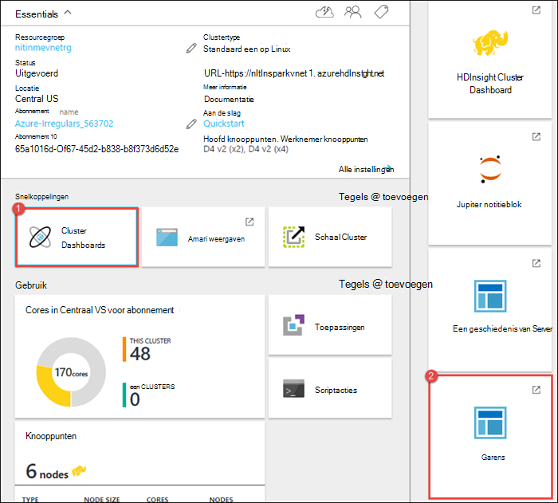

    >[AZURE.TIP] U kunt ook kunt u ook de gebruikersinterface garens uit de Ambari UI starten. Naar de Ambari UI, van het blad cluster starten **Cluster Dashboard**op en klik vervolgens op **HDInsight Cluster Dashboard**. Vanuit de UI Ambari op **garens**, klikt u op **Snelkoppelingen**, klikt u op de actieve bronbeheer en klik vervolgens op **ResourceManager UI**.  

3. Omdat u de taak, een die gebruikmaakt van Jupyter notitieblokken gestart, heeft de toepassing de naam **remotesparkmagics** (dit is de naam voor alle toepassingen die uit de notitieblokken worden gestart). Klik op de toepassings-ID ten opzichte van de naam van de toepassing voor meer informatie over de taak. De weergave van de toepassing wordt gestart.

    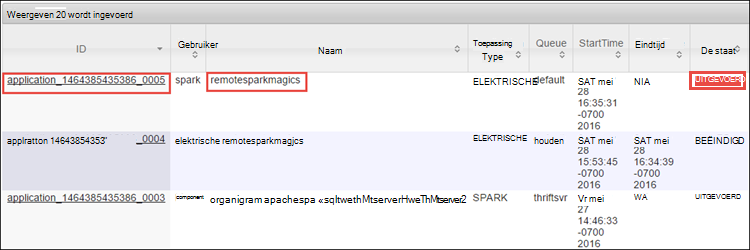

    Voor deze toepassingen die zijn dat is gestart vanuit de notitieblokken Jupyter, de status ervan is altijd **uitgevoerd** totdat u het notitieblok afsluiten.

4. Vanuit de weergave van toepassing, kunt u inzoomen verder naar leest u de containers die hoort bij de toepassing en de logboeken (stdout/stderr). U kunt ook de gebruikersinterface een starten door te klikken op de koppeling overeenkomt met de **URL bijhouden**, zoals hieronder wordt weergegeven. 

    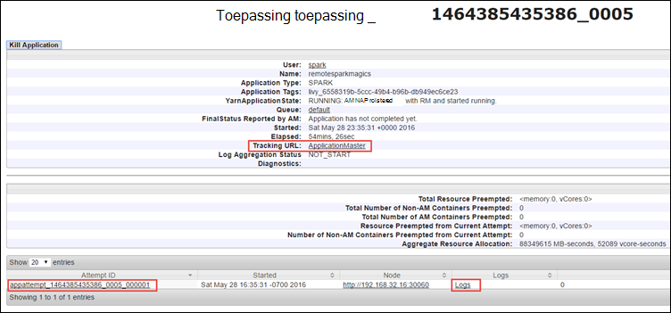

## Een toepassing in de gebruikersinterface van een bijhouden

In de gebruikersinterface elektrische, kunt u inzoomen in de een-taken die zijn geïnitieerd door de toepassing die u eerder hebt gewerkt.

1. Als u wilt starten van de gebruikersinterface van elektrische, in de weergave van de toepassing, klik op de koppeling ten opzichte van de **URL bijhouden**, zoals wordt weergegeven in de schermopname boven. Hier ziet u alle elektrische taken die worden uitgevoerd door de toepassing in het notitieblok Jupyter uitgevoerd.

    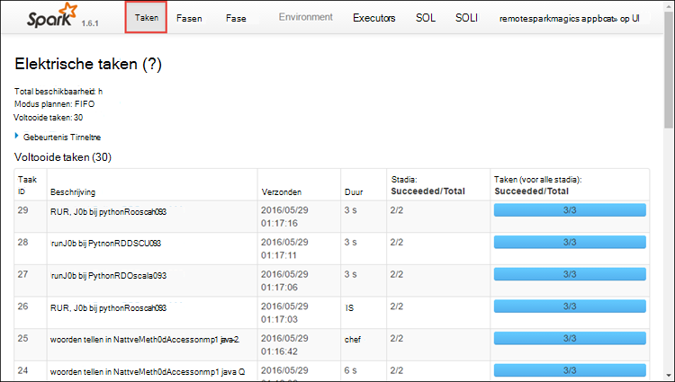

2. Klik op het tabblad **Executors** verwerking en opslag informatie voor elke executor. U kunt ook de stapel gesprek door te klikken op de koppeling **Thread Dump** ophalen.

    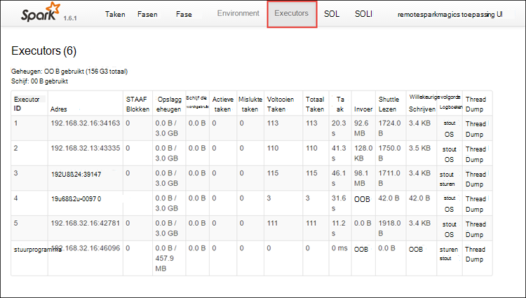
 
3. Klik op het tabblad **fasen** als u wilt zien van de fasen die is gekoppeld aan de toepassing.

    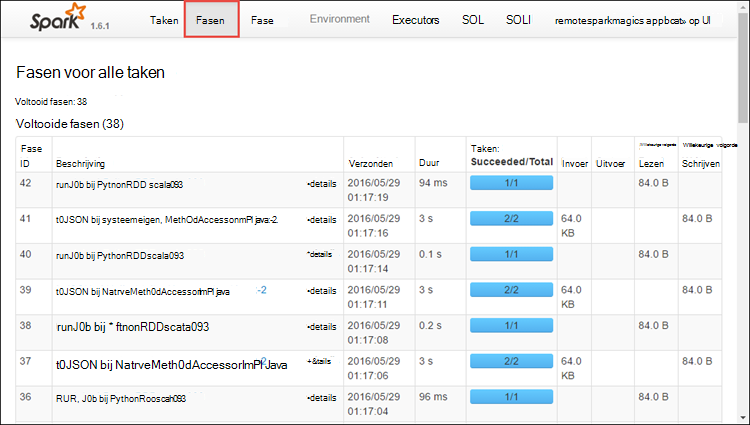

    Elke fase kan hebben meerdere taken waarvoor u statistieken kan worden uitgevoerd, zoals weergeven kunt hieronder weergegeven.

    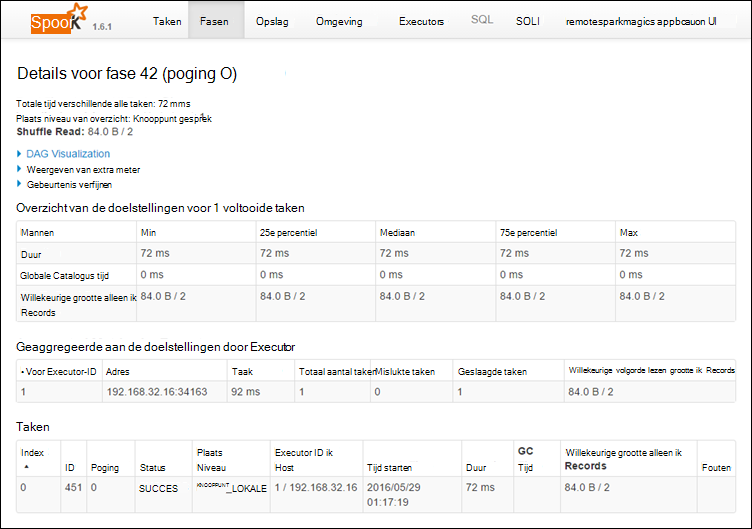 

4. U kunt de detailpagina van fase DAG visualisatie starten. Vouw de **DAG visualisatie** koppeling boven aan de pagina, zoals hieronder wordt weergegeven.

    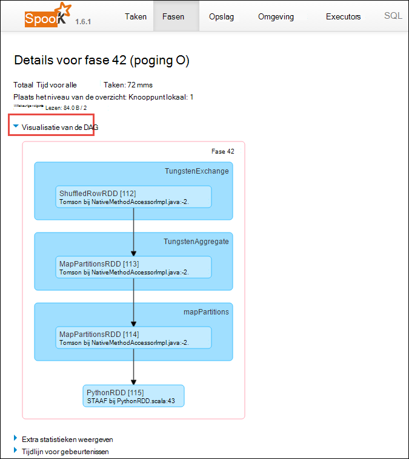

    DAG of directe Aclyic Graph staat voor de verschillende fasen in de toepassing. Elk vak blauw in de grafiek vertegenwoordigt een een-bewerking aangeroepen vanuit de toepassing.

5. Vanaf de detailpagina van niveau kunt u ook de tijdlijnweergave toepassing te starten. Vouw de **Tijdlijn voor gebeurtenissen** koppeling boven aan de pagina, zoals hieronder wordt weergegeven.

    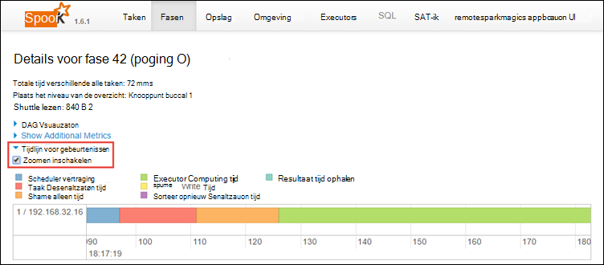

    Hiermee worden de gebeurtenissen die een weergegeven in de vorm van een tijdlijn. De tijdlijnweergave is beschikbaar op drie niveaus in projecten, binnen een project en binnen een fase. De bovenstaande afbeelding wordt vastgelegd de tijdlijnweergave voor een bepaalde fase.

    >[AZURE.TIP] Als u het selectievakje **inschakelen zoomen** selecteert, kunt u links en rechts schuiven in de tijdlijnweergave.

6. Andere tabbladen in de gebruikersinterface van een bieden nuttige informatie over het exemplaar van een ook.

    * Tabblad opslag - als de toepassing een RDDs maakt, vindt u informatie over de gebruikersprofielen in het tabblad opslag.
    * Tabblad omgeving - dit tabblad biedt een groot aantal nuttige informatie over uw exemplaar van een zoals de 
        * Scala versie
        * Gebeurtenislogboek directory die is gekoppeld aan het cluster
        * Aantal executor kernen voor de toepassing
        * Enzovoort.

## Informatie over voltooide taken met de Server met een geschiedenis

Wanneer een taak is voltooid, wordt de informatie over de taak blijft behouden in de elektrische geschiedenis-Server.

1. Naar de Server een geschiedenis van het blad cluster starten **Cluster Dashboard**op en klik vervolgens op **Een geschiedenis Server**.

    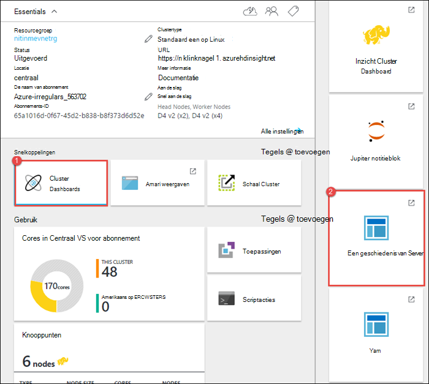

    >[AZURE.TIP] U kunt ook kunt u ook de gebruikersinterface van een geschiedenis Server uit de Ambari UI starten. Naar de Ambari UI, van het blad cluster starten **Cluster Dashboard**op en klik vervolgens op **HDInsight Cluster Dashboard**. Klik op **een**van de UI Ambari op **Snelkoppelingen**en klik vervolgens op **Een geschiedenis Server UI**.

2. Hier ziet u de voltooide toepassingen vermeld. Klik op de ID van een groep Inzoomen op een toepassing voor meer informatie.

    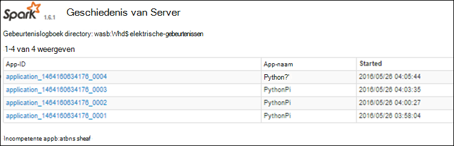
    

## Zie ook

* [Overzicht: Apache elektrische op Azure HDInsight](hdinsight-apache-spark-overview.md)

### Scenario 's

* [Elektrische met BI: interactieve gegevensanalyse met een in HDInsight met hulpmiddelen voor BI uitvoeren](hdinsight-apache-spark-use-bi-tools.md)

* [Elektrische met Machine Learning: gebruik een in HDInsight building temperatuur met Aircoschema gegevens analyseren](hdinsight-apache-spark-ipython-notebook-machine-learning.md)

* [Elektrische met Machine Learning: gebruik een in HDInsight eten controleresultaten voorspellen](hdinsight-apache-spark-machine-learning-mllib-ipython.md)

* [Een Streaming: Gebruik een in HDInsight voor het samenstellen van realtime streaming-toepassingen](hdinsight-apache-spark-eventhub-streaming.md)

* [Website logboekanalyse met behulp van een in HDInsight](hdinsight-apache-spark-custom-library-website-log-analysis.md)

### Maken en uitvoeren van toepassingen

* [Een zelfstandige toepassing maken met Scala](hdinsight-apache-spark-create-standalone-application.md)

* [Taken op afstand uitvoeren op een elektrische cluster met hier](hdinsight-apache-spark-livy-rest-interface.md)

### Hulpprogramma's en uitbreidingen

* [HDInsight-invoegtoepassing voor hulpmiddelen voor IntelliJ IDEE maken en indienen elektrische Scala toepassingen gebruiken](hdinsight-apache-spark-intellij-tool-plugin.md)

* [Gebruik HDInsight-invoegtoepassing voor hulpmiddelen voor IntelliJ verloop foutopsporing elektrische toepassingen op afstand uitvoeren](hdinsight-apache-spark-intellij-tool-plugin-debug-jobs-remotely.md)

* [Zeppelin notitieblokken gebruikt met een cluster elektrische op HDInsight](hdinsight-apache-spark-use-zeppelin-notebook.md)

* [Kernels beschikbaar voor Jupyter notitieblok in een cluster voor HDInsight](hdinsight-apache-spark-jupyter-notebook-kernels.md)

* [Externe-pakketten gebruiken met Jupyter notitieblokken](hdinsight-apache-spark-jupyter-notebook-use-external-packages.md)

* [Jupyter installeert op uw computer en verbinding maken met een cluster HDInsight Spark](hdinsight-apache-spark-jupyter-notebook-install-locally.md)

### Resources beheren

* [Bronnen voor de Apache elektrische cluster in Azure HDInsight beheren](hdinsight-apache-spark-resource-manager.md)
