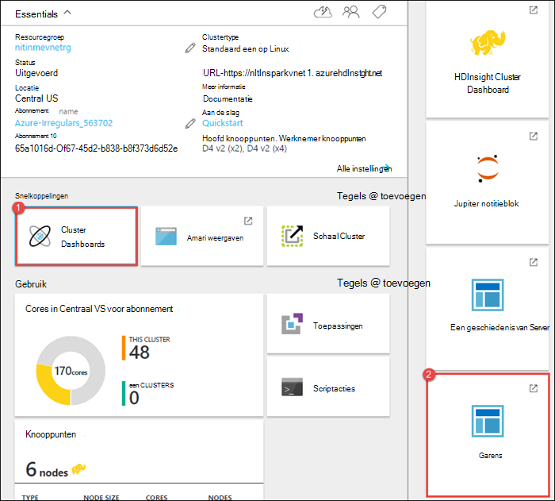
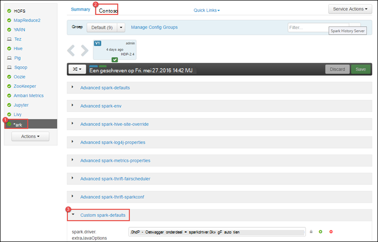
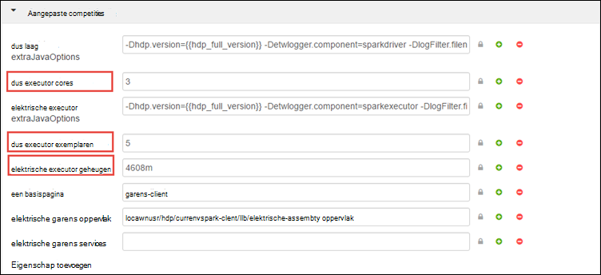
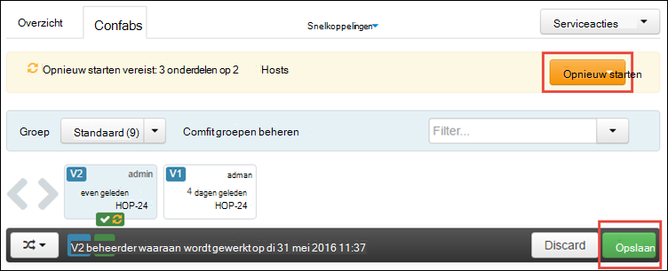
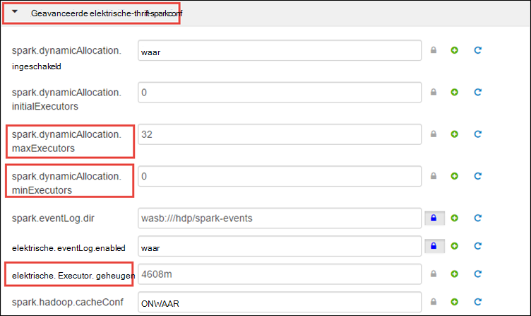
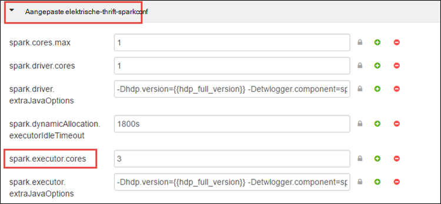
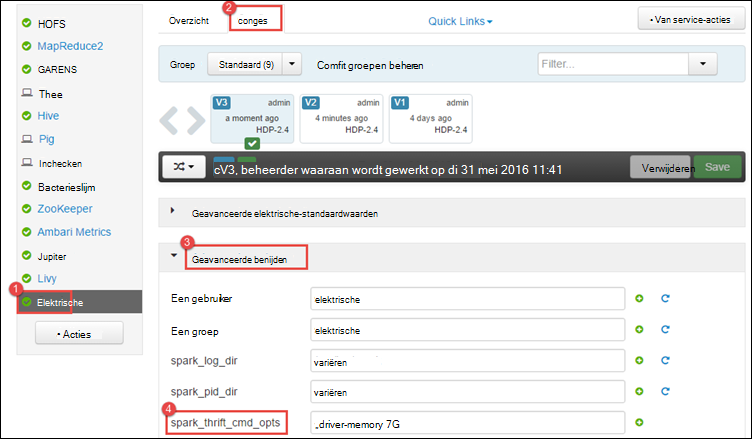
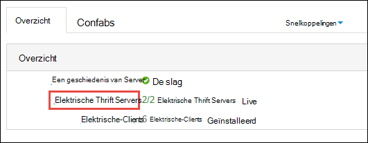
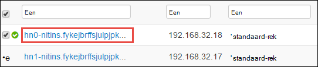
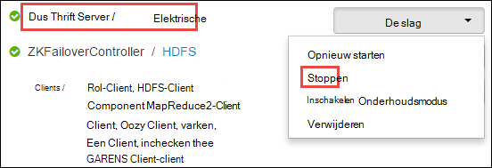

<properties 
    pageTitle="Gebruik resourcemanager resources toewijzen aan het cluster Apache elektrische in HDInsight | Microsoft Azure" 
    description="Informatie over het gebruik van bronbeheer voor een clusters op HDInsight voor betere prestaties." 
    services="hdinsight" 
    documentationCenter="" 
    authors="nitinme" 
    manager="jhubbard" 
    editor="cgronlun"
    tags="azure-portal"/>

<tags 
    ms.service="hdinsight" 
    ms.workload="big-data" 
    ms.tgt_pltfrm="na" 
    ms.devlang="na" 
    ms.topic="article" 
    ms.date="08/25/2016" 
    ms.author="nitinme"/>

# Bronnen voor het cluster Apache elektrische op HDInsight Linux beheren

In dit artikel leert u hoe u toegang tot de interfaces zoals Ambari UI, garens UI, en de elektrische geschiedenis Server die is gekoppeld aan uw cluster elektrische. Ook leert u hoe u om de configuratie van het cluster voor optimale prestaties af te stellen.

**Vereisten:**

U hebt het volgende:

- Een Azure-abonnement. Zie [Azure krijgen gratis proefversie](https://azure.microsoft.com/documentation/videos/get-azure-free-trial-for-testing-hadoop-in-hdinsight/).
- Een cluster Apache elektrische op HDInsight Linux. Zie voor instructies voor het [maken Apache elektrische clusters in Azure HDInsight](hdinsight-apache-spark-jupyter-spark-sql.md).

## Hoe ik de gebruikersinterface van de Web Ambari starten?

1. In de [Portal van Azure](https://portal.azure.com/)uit de startboard, klikt u op de tegel voor uw cluster elektrische (als u deze aan de startboard vastgemaakt). U kunt ook naar uw cluster onder **Door alles bladeren**gaan > **HDInsight Clusters**. 
 
2. Klik op het blad een cluster, op **Dashboard**. Wanneer u wordt gevraagd, voert u de beheerdersreferenties voor het cluster elektrische.

    ![Ambari starten] (./media/hdinsight-apache-spark-resource-manager/hdispark.cluster.launch.dashboard.png "Resourcemanager starten")

3. Dit moet de gebruikersinterface van de Web Ambari start, zoals hieronder wordt weergegeven.

    ![Ambari Web UI] (./media/hdinsight-apache-spark-resource-manager/ambari-web-ui.png "Ambari Web UI")   

## Hoe ik de Server met een geschiedenis starten?

1. In de [Portal van Azure](https://portal.azure.com/)uit de startboard, klikt u op de tegel voor uw cluster elektrische (als u deze aan de startboard vastgemaakt).

2. Klik in het blad cluster onder **Snelkoppelingen**op **Cluster Dashboard**. Klik op **Een geschiedenis Server**in het blad **Cluster Dashboard** .

    ![Een geschiedenis van Server] (./media/hdinsight-apache-spark-resource-manager/launch-history-server.png "Een geschiedenis van Server")

    Wanneer u wordt gevraagd, voert u de beheerdersreferenties voor het cluster elektrische.

## Hoe ik de gebruikersinterface garens starten?

U kunt de gebruikersinterface garens gebruiken om de toepassingen die momenteel worden uitgevoerd op het cluster elektrische te houden. 

1. Klik op **Cluster Dashboard**van het blad cluster en klik op **garens**.

    

    >[AZURE.TIP] U kunt ook kunt u ook de gebruikersinterface garens uit de Ambari UI starten. Naar de Ambari UI, van het blad cluster starten **Cluster Dashboard**op en klik vervolgens op **HDInsight Cluster Dashboard**. Vanuit de UI Ambari op **garens**, klikt u op **Snelkoppelingen**, klikt u op de actieve bronbeheer en klik vervolgens op **ResourceManager UI**.

## Wat is de configuratie van het optimale cluster elektrische toepassingen uitvoeren?

De drie belangrijkste parameters die kunnen worden gebruikt voor een configuratie afhankelijk van de toepassingsvereisten zijn `spark.executor.instances`, `spark.executor.cores`, en `spark.executor.memory`. Een Executor is een proces dat is gestart voor een een-toepassing. Er wordt uitgevoerd op het knooppunt werknemer en die verantwoordelijk zijn voor het uitvoeren van de taken voor de toepassing. Het standaardaantal executors en de grootte executor voor elk cluster wordt berekend op basis van het aantal knooppunten van werknemer en de grootte van het knooppunt werknemer. Deze zijn opgeslagen in `spark-defaults.conf` hoofd knooppunten. 

De drie configuratieparameters kunnen worden geconfigureerd op het clusterniveau van de (voor alle toepassingen die worden uitgevoerd op het cluster) of voor elke afzonderlijke toepassing ook worden opgegeven.

### Wijzigen van de parameters Ambari UI gebruiken

1. Klik op **een**van de Ambari UI op **configuraties**en vouwt u **aangepaste elektrische-standaardwaarden**.

    

2. De standaardwaarden zijn handig voor 4 elektrische toepassingen tegelijkertijd worden uitgevoerd op het cluster hebben. U kunt wijzigingen deze waarden uit de gebruikersinterface, zoals hieronder wordt weergegeven.

    

3. Klik op **Opslaan** om op te slaan wijzigingen in de configuratie. Aan de bovenkant van de pagina, wordt u gevraagd om de desbetreffende services opnieuw te starten. Klik op **opnieuw**.

    

### De parameters voor een toepassing wordt uitgevoerd in Jupyter notitieblok wijzigen

Voor toepassingen in het notitieblok Jupyter worden uitgevoerd, kunt u de `%%configure` bijzonder configuratiewijzigingen aan te brengen. In het ideale geval moet u deze wijzigingen aanbrengen aan het begin van de toepassing, voordat u de eerste cel van de code uitvoert. Dit zorgt ervoor dat de configuratie wordt toegepast op de sessie hier wanneer deze wordt gemaakt. Als u wijzigen van de configuratie in een later stadium in de toepassing wilt, moet u de `-f` parameter. Door doen, zodat alle voortgang in de toepassing niet verloren.

Het codefragment van de onderstaande ziet hoe u de configuratie wijzigen voor een toepassing wordt uitgevoerd in Jupyter.

    %%configure 
    {"executorMemory": "3072M", "executorCores": 4, “numExecutors”:10}

Parameters voor de configuratie moeten worden doorgegeven als een tekenreeks JSON en moeten op de volgende regel na de magie, zoals wordt weergegeven in de voorbeeldkolom. 

### De parameters voor een toepassing verzonden met een indienen wijzigen

De opdracht volgen is een voorbeeld van het wijzigen van de configuratieparameters voor een batch-toepassing die is verzonden met `spark-submit`.

    spark-submit --class <the application class to execute> --executor-memory 3072M --executor-cores 4 –-num-executors 10 <location of application jar file> <application parameters>

### De parameters voor een toepassing ingediend met behulp van krul wijzigen

De opdracht volgen is een voorbeeld van het wijzigen van de configuratieparameters voor een batch-toepassing die is verzonden met behulp van krul.

    curl -k -v -H 'Content-Type: application/json' -X POST -d '{"file":"<location of application jar file>", "className":"<the application class to execute>", "args":[<application parameters>], "numExecutors":10, "executorMemory":"2G", "executorCores":5' localhost:8998/batches

### Hoe wijzig ik deze parameters op een Server met een Thrift?

Elektrische Thrift Server biedt JDBC/ODBC-toegang tot een cluster elektrische en wordt gebruikt om de service een SQL-query's. Hulpprogramma's zoals Power BI, Tableau enzovoort. ODBC-protocol gebruiken om te communiceren met een Thrift Server een SQL-query's uitvoeren als een toepassing. Wanneer een cluster elektrische is gemaakt, zijn er twee instanties van de Server met een Thrift gestart, een op elk hoofd knooppunt. Elke elektrische Thrift Server wordt weergegeven als een een-toepassing in de gebruikersinterface garens. 

Elektrische Thrift Server gebruikt een dynamische executor toegewezen en dus de `spark.executor.instances` niet wordt gebruikt. In plaats daarvan een Thrift Server gebruikt `spark.dynamicAllocation.minExecutors` en `spark.dynamicAllocation.maxExecutors` om op te geven van de telling executor. De configuratieparameters `spark.executor.cores` en `spark.executor.memory` wordt gebruikt voor het wijzigen van de grootte executor. U kunt deze parameters kunt wijzigen, zoals hieronder wordt weergegeven.

* Vouw de categorie **Geavanceerd elektrische-thrift-sparkconf** als u wilt bijwerken van de parameters `spark.dynamicAllocation.minExecutors`, `spark.dynamicAllocation.maxExecutors`, en `spark.executor.memory`.

     

* Vouw de categorie **aangepast elektrische-thrift-sparkconf** als u wilt bijwerken van de parameter `spark.executor.cores`.

    

### Hoe wijzig ik het stuurprogramma geheugen van de Server met een Thrift?

Geheugen elektrische Thrift Server is geconfigureerd 25% van de grootte van het hoofd knooppunt RAM, mits dat de totale RAM grootte van het hoofd knooppunt groter is dan 14GB. U kunt de Ambari UI wijzigen van de configuratie van het stuurprogramma geheugen zoals hieronder wordt weergegeven.

* Klik op **een**op **configuraties**, vouw **Geavanceerde een envelop**en vervolgens de waarde opgeven voor **spark_thrift_cmd_opts**uit de Ambari UI.

    

## Ik gebruik geen BI met een cluster. Hoe ik de resources weer volgen?

Aangezien we een dynamische toewijzing wordt gebruikt, zijn de enige bronnen die worden gebruikt door thrift server de bronnen voor de twee toepassing-modellen. Als u wilt vrijmaken deze resources moet u de Thrift Server services worden uitgevoerd op het cluster stoppen.

1. Klik op **een**van de Ambari UI, in het linkerdeelvenster.

2. Klik in de volgende pagina op **Een Thrift Servers**.

    

3. Hier ziet u de twee headnodes waarop de elektrische Thrift Server wordt uitgevoerd. Klik op een van de headnodes.

    

4. De volgende pagina bevat alle services die worden uitgevoerd op die headnode. Klik op de knop pijl-omlaag naast een Thrift Server in de lijst en klik vervolgens op **stoppen**.

    

5. Herhaal deze stappen op de andere headnode ook.

## Mijn notitieblokken Jupyter uitvoert niet zoals verwacht. Hoe kan ik de service opnieuw starten?

1. Start de gebruikersinterface van de Web Ambari zoals hierboven. In het linkernavigatiedeelvenster, klikt u op **Jupyter**op **Serviceacties**en klik vervolgens op **Alles opnieuw starten**. Hiermee start u de service Jupyter op alle headnodes.

    ![Start opnieuw Jupyter] (./media/hdinsight-apache-spark-resource-manager/restart-jupyter.png "Start opnieuw Jupyter")

    

## Zie ook

* [Overzicht: Apache elektrische op Azure HDInsight](hdinsight-apache-spark-overview.md)

### Scenario 's

* [Elektrische met BI: interactieve gegevensanalyses elektrische in HDInsight met hulpmiddelen voor BI uitvoeren](hdinsight-apache-spark-use-bi-tools.md)

* [Elektrische met Machine Learning: gebruik een in HDInsight building temperatuur met Aircoschema gegevens analyseren](hdinsight-apache-spark-ipython-notebook-machine-learning.md)

* [Elektrische met Machine Learning: gebruik een in HDInsight eten controleresultaten voorspellen](hdinsight-apache-spark-machine-learning-mllib-ipython.md)

* [Een Streaming: Gebruik een in HDInsight voor het samenstellen van realtime streaming-toepassingen](hdinsight-apache-spark-eventhub-streaming.md)

* [Website logboekanalyse met behulp van een in HDInsight](hdinsight-apache-spark-custom-library-website-log-analysis.md)

### Maken en uitvoeren van toepassingen

* [Een zelfstandige toepassing maken met Scala](hdinsight-apache-spark-create-standalone-application.md)

* [Taken op afstand uitvoeren op een elektrische cluster met hier](hdinsight-apache-spark-livy-rest-interface.md)

### Hulpprogramma's en uitbreidingen

* [HDInsight-invoegtoepassing voor hulpmiddelen voor IntelliJ IDEE maken en indienen elektrische Scala toepassingen gebruiken](hdinsight-apache-spark-intellij-tool-plugin.md)

* [Gebruik HDInsight-invoegtoepassing voor hulpmiddelen voor IntelliJ verloop foutopsporing elektrische toepassingen op afstand uitvoeren](hdinsight-apache-spark-intellij-tool-plugin-debug-jobs-remotely.md)

* [Zeppelin notitieblokken gebruikt met een cluster elektrische op HDInsight](hdinsight-apache-spark-use-zeppelin-notebook.md)

* [Kernels beschikbaar voor Jupyter notitieblok in een cluster voor HDInsight](hdinsight-apache-spark-jupyter-notebook-kernels.md)

* [Externe-pakketten gebruiken met Jupyter notitieblokken](hdinsight-apache-spark-jupyter-notebook-use-external-packages.md)

* [Jupyter installeren op uw computer en verbinding maken met een cluster HDInsight Spark](hdinsight-apache-spark-jupyter-notebook-install-locally.md)

### Resources beheren

* [Bijhouden en foutopsporing taken op een cluster Apache elektrische in HDInsight](hdinsight-apache-spark-job-debugging.md)

[hdinsight-versions]: hdinsight-component-versioning.md
[hdinsight-upload-data]: hdinsight-upload-data.md
[hdinsight-storage]: hdinsight-hadoop-use-blob-storage.md

[azure-purchase-options]: http://azure.microsoft.com/pricing/purchase-options/
[azure-member-offers]: http://azure.microsoft.com/pricing/member-offers/
[azure-free-trial]: http://azure.microsoft.com/pricing/free-trial/
[azure-management-portal]: https://manage.windowsazure.com/
[azure-create-storageaccount]: storage-create-storage-account.md 
