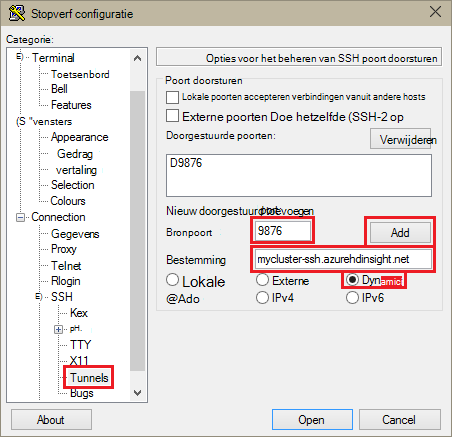
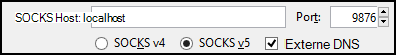
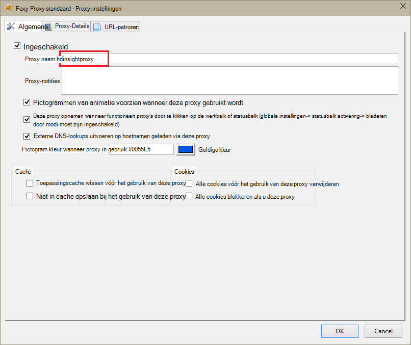
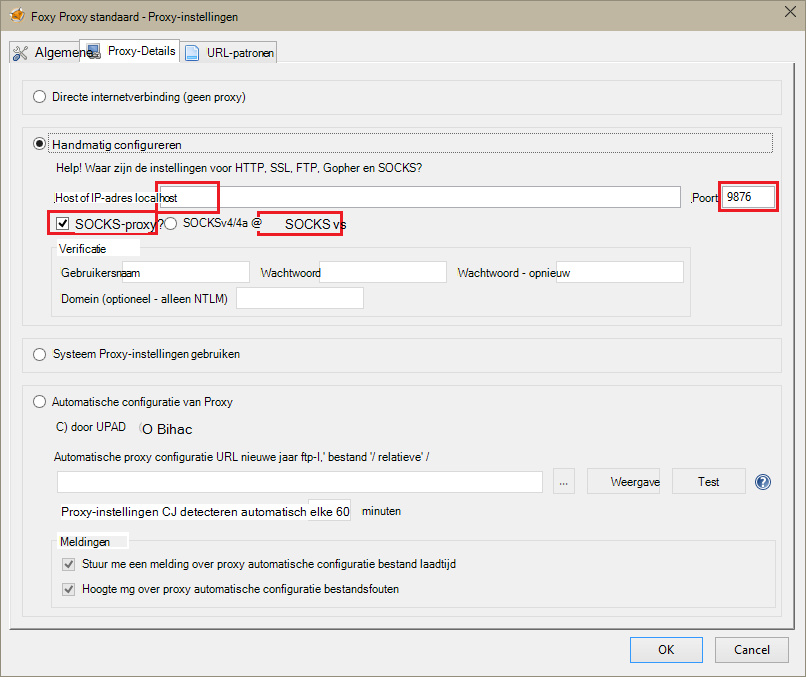
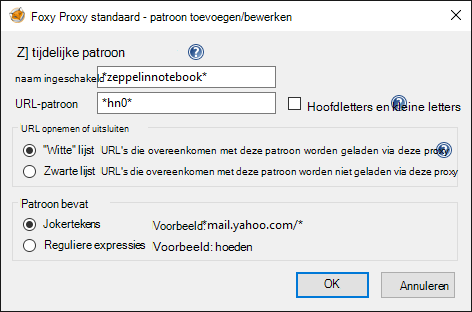
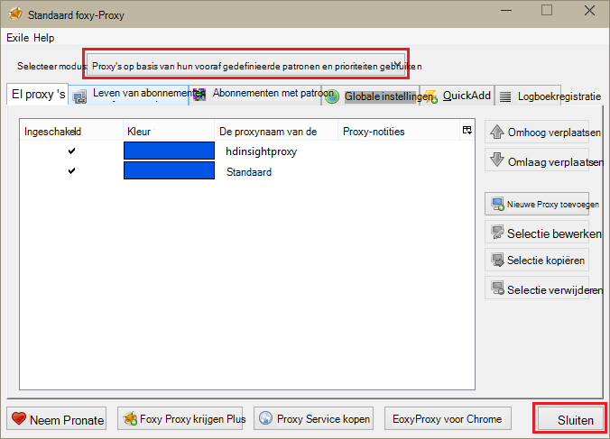

<properties 
    pageTitle="Zeppelin notitieblokken voor Apache elektrische cluster installeren op HDInsight Linux | Microsoft Azure" 
    description="Stapsgewijze instructies voor het installeren en gebruiken van Zeppelin notitieblokken met een clusters op HDInsight Linux." 
    services="hdinsight" 
    documentationCenter="" 
    authors="nitinme" 
    manager="jhubbard" 
    editor="cgronlun"/>

<tags 
    ms.service="hdinsight" 
    ms.workload="big-data" 
    ms.tgt_pltfrm="na" 
    ms.devlang="na" 
    ms.topic="article" 
    ms.date="10/28/2016" 
    ms.author="nitinme"/>

# Zeppelin notitieblokken voor Apache elektrische cluster op HDInsight Linux installeren

Leer hoe u Zeppelin notitieblokken installeert op een van de Apache clusters en het gebruik van de notitieblokken Zeppelin elektrische taken uitvoeren.

> [AZURE.IMPORTANT] Zeppelin notitieblokken zijn nu beschikbaar met een clusters standaard. U hoeft niet te expliciet Installeer deze op een cluster elektrische meer. Zie voor meer informatie, [Gebruik Zeppelin notitieblokken met Apache elektrische cluster op HDInsight Linux](hdinsight-apache-spark-zeppelin-notebook.md). 

**Vereisten:**

* Voordat u deze zelfstudie begint, moet u een Azure-abonnement hebben. Zie [Azure krijgen gratis proefversie](https://azure.microsoft.com/documentation/videos/get-azure-free-trial-for-testing-hadoop-in-hdinsight/).
* Een cluster Apache elektrische. Zie voor instructies voor het [maken Apache elektrische clusters in Azure HDInsight](hdinsight-apache-spark-jupyter-spark-sql.md).
* Een SSH-client. Voor Linux en Unix onderzoeken of Macintosh OS X, de `ssh` opdracht wordt geleverd bij het besturingssysteem. Voor Windows raden [stopverf](http://www.chiark.greenend.org.uk/~sgtatham/putty/download.html)

    > [AZURE.NOTE] Als u wilt een client SSH anders dan gebruiken `ssh` of stopverf, Zie de documentatie voor de client op het tot stand brengen van een tunnel SSH.

* Een webbrowser die kan worden geconfigureerd voor gebruik van een SOCKS-proxy

* __(optioneel)__: regels die alleen specifieke vragen worden gerouteerd via de tunnel van een invoegtoepassing zoals [FoxyProxy](http://getfoxyproxy.org/,) die kunt toepassen.

    > [AZURE.WARNING] Zonder een invoegtoepassing zoals FoxyProxy, kunnen alle aanvragen via de browser kunnen worden gerouteerd via de tunnel. Dit kan resulteren in langzamer laden van webpagina's in uw browser.

## Zeppelin installeren op een cluster elektrische

U kunt Zeppelin installeren op een elektrische cluster met scriptactie. Aangepaste scripts scriptactie gebruikt om onderdelen te installeren op de cluster die niet beschikbaar is al dan niet standaard zijn. U kunt de aangepast script Zeppelin installeren vanaf de Azure-Portal met behulp van HDInsight .NET SDK of met behulp van Azure PowerShell. U kunt het script installeren Zeppelin als onderdeel van het maken van het cluster of na het cluster actief is. Koppelingen in de onderstaande secties vindt u de instructies over het kunt doen. 

### Met behulp van de Azure Portal

Zie voor instructies over het gebruik van de Portal Azure scriptactie uitvoeren voor het installeren van Zeppelin, [HDInsight aanpassen clusters met de Script-actie](hdinsight-hadoop-customize-cluster-linux.md#use-a-script-action-from-the-azure-portal). U moet een paar wijzigingen aanbrengen in de instructies in dit artikel.

* U moet het script gebruiken voor het installeren van Zeppelin. De aangepast script Zeppelin installeren op een cluster elektrische op HDInsight vindt u in de volgende koppelingen:
    * Voor een 1.6.0 clusters-`https://hdiconfigactions.blob.core.windows.net/linuxincubatorzeppelinv01/install-zeppelin-spark160-v01.sh`
    * Voor een 1.5.2 clusters-`https://hdiconfigactions.blob.core.windows.net/linuxincubatorzeppelinv01/install-zeppelin-spark151-v01.sh`

* Alleen op de headnode, moet u de scriptactie uitvoeren.

* Het script hoeft niet alle parameters. 

### Met behulp van HDInsight .NET SDK

Zie voor instructies over het gebruik van HDInsight .NET SDK scriptactie uitvoeren voor het installeren van Zeppelin, [HDInsight aanpassen clusters met de Script-actie](hdinsight-hadoop-customize-cluster-linux.md#use-a-script-action-from-the-hdinsight-net-sdk). U moet een paar wijzigingen aanbrengen in de instructies in dit artikel.

* U moet het script gebruiken voor het installeren van Zeppelin. De aangepast script Zeppelin installeren op een cluster elektrische op HDInsight vindt u in de volgende koppelingen:
    * Voor een 1.6.0 clusters-`https://hdiconfigactions.blob.core.windows.net/linuxincubatorzeppelinv01/install-zeppelin-spark160-v01.sh`
    * Voor een 1.5.2 clusters-`https://hdiconfigactions.blob.core.windows.net/linuxincubatorzeppelinv01/install-zeppelin-spark151-v01.sh`

* Het script hoeft niet alle parameters. 

* Stel het clustertype die u maakt op een.

### Via Azure PowerShell

Gebruik het volgende PowerShell-fragment maken van een cluster elektrische op HDInsight Linux met Zeppelin is geïnstalleerd. Afhankelijk van welke versie van een cluster die u hebt, moet u de onderstaande en de koppeling naar de bijbehorende aangepast script toevoegen PowerShell-fragment bijwerken. 

* Voor een 1.6.0 clusters-`https://hdiconfigactions.blob.core.windows.net/linuxincubatorzeppelinv01/install-zeppelin-spark160-v01.sh`
* Voor een 1.5.2 clusters-`https://hdiconfigactions.blob.core.windows.net/linuxincubatorzeppelinv01/install-zeppelin-spark151-v01.sh`

[AZURE.INCLUDE [upgrade-powershell](../../includes/hdinsight-use-latest-powershell.md)]

    Login-AzureRMAccount
    
    # PROVIDE VALUES FOR THE VARIABLES
    $clusterAdminUsername="admin"
    $clusterAdminPassword="<<password>>"
    $clusterSshUsername="adminssh"
    $clusterSshPassword="<<password>>"
    $clusterName="<<clustername>>"
    $clusterContainerName=$clusterName
    $resourceGroupName="<<resourceGroupName>>"
    $location="<<region>>"
    $storage1Name="<<storagename>>"
    $storage1Key="<<storagekey>>"
    $subscriptionId="<<subscriptionId>>"
    
    Select-AzureRmSubscription -SubscriptionId $subscriptionId
    
    $passwordAsSecureString=ConvertTo-SecureString $clusterAdminPassword -AsPlainText -Force
    $clusterCredential=New-Object System.Management.Automation.PSCredential ($clusterAdminUsername, $passwordAsSecureString)
    $passwordAsSecureString=ConvertTo-SecureString $clusterSshPassword -AsPlainText -Force
    $clusterSshCredential=New-Object System.Management.Automation.PSCredential ($clusterSshUsername, $passwordAsSecureString)
    
    $azureHDInsightConfigs= New-AzureRmHDInsightClusterConfig -ClusterType Spark
    $azureHDInsightConfigs.DefaultStorageAccountKey = $storage1Key
    $azureHDInsightConfigs.DefaultStorageAccountName = "$storage1Name.blob.core.windows.net"
    
    Add-AzureRMHDInsightScriptAction -Config $azureHDInsightConfigs -Name "Install Zeppelin" -NodeType HeadNode -Parameters "void" -Uri "https://hdiconfigactions.blob.core.windows.net/linuxincubatorzeppelinv01/install-zeppelin-spark151-v01.sh"
    
    New-AzureRMHDInsightCluster -Config $azureHDInsightConfigs -OSType Linux -HeadNodeSize "Standard_D12" -WorkerNodeSize "Standard_D12" -ClusterSizeInNodes 2 -Location $location -ResourceGroupName $resourceGroupName -ClusterName $clusterName -HttpCredential $clusterCredential -DefaultStorageContainer $clusterContainerName -SshCredential $clusterSshCredential -Version "3.3"
 
## SSH tunneling voor toegang tot een notitieblok Zeppelin instellen

U kunt SSH tunnels wilt gebruiken voor toegang tot de Zeppelin notitieblokken op een cluster op HDInsight Linux. De onderstaande stappen om het maken van een SSH tunnel met ssh opdrachtregel (Linux) en stopverf (Windows).

### Maken van een tunnel met de opdracht SSH (Linux)

Gebruik de volgende opdracht uit om te maken van een SSH tunnel gebruik van de `ssh` opdracht. __Gebruikersnaam__ vervangen door een gebruiker SSH voor uw cluster HDInsight en __CLUSTERNAAM__ vervangen door de naam van uw cluster HDInsight

    ssh -C2qTnNf -D 9876 USERNAME@CLUSTERNAME-ssh.azurehdinsight.net

Hiermee maakt u een verbinding die verkeer door naar lokale poort 9876 aan het cluster via SSH stuurt. De opties zijn:

* **D 9876** - de lokale poort die verkeer via de tunnel stuurt.

* **C** - comprimeren zorgen dat alle gegevens, omdat webverkeer hoofdzakelijk tekst is.

* **2** - dwingen SSH om te proberen protocol uitsluitend versie 2.

* **q** - stille modus.

* **T** - uitschakelen pseudo-tty-toewijzing, want we zojuist een poort doorstuurt.

* **n** - voorkomen dat het lezen van STDIN, want we zojuist een poort doorstuurt.

* **N** - een externe opdracht, niet uitgevoerd omdat we zojuist een poort doorstuurt.

* **f** - uitvoeren op de achtergrond.

Als u het cluster met een SSH-sleutel hebt geconfigureerd, moet u mogelijk gebruiken de `-i` parameter en geef het pad naar de persoonlijke SSH-sleutel.

Wanneer de opdracht is voltooid, wordt verkeer verzonden naar poort 9876 op de lokale computer worden gerouteerd via wordt Secure Sockets Layer (SSL) aan het cluster knooppunt head en er afkomstig lijken te zijn.

### Stopverf (Windows) met een tunnel maken

Gebruik de volgende stappen uit om te maken van een SSH tunnel stopverf gebruiken.

1. Open stopverf en voert u de verbindingsgegevens van uw. Als u niet bekend met stopverf bent, raadpleegt u [Gebruik SSH met Linux gebaseerde Hadoop op HDInsight vanuit Windows](hdinsight-hadoop-linux-use-ssh-windows.md) voor meer informatie over hoe u dit product gebruiken met HDInsight.

2. Klik in de sectie **categorie** aan de linkerkant van het dialoogvenster **verbinding**uitvouwen, **SSH**uitvouwen en selecteer vervolgens **Tunnels**.

3. De onderstaande informatie opgeven in het formulier **Opties SSH poort doorschakelen bepalen** :

    * **Bronpoort** - de poort op de client die u wilt doorsturen. Bijvoorbeeld **9876**.

    * **Bestemming** - de SSH adres voor het cluster Linux gebaseerde HDInsight. Bijvoorbeeld: **mijncluster-ssh.azurehdinsight.net**.

    * **Dynamische** - Hiermee dynamische SOCKS-proxy-mailroutering.

    

4. Klik op **toevoegen** om de instellingen en klik vervolgens op **openen** om te openen van een verbinding SSH.

5. Wanneer u wordt gevraagd, meld u aan bij de server. Hiermee wordt een sessie SSH tot stand brengen en inschakelen van de tunnel.

### De tunnel vanuit uw browser gebruiken

> [AZURE.NOTE] De stappen in deze sectie gebruikt de FireFox-browser, zoals deze vrij beschikbaar voor Linux, Unix, Macintosh OS X en Windows-systemen is. Andere moderne browsers zoals Google Chrome, Microsoft Edge of Apple Safari moeten werken ook; echter de FoxyProxy-invoegtoepassing gebruikt in enkele stappen mogelijk niet beschikbaar voor alle browsers.

1. Configureer de browser om het **localhost:9876** gebruiken als een **SOCKS v5** -proxy. Hier ziet u hoe de instellingen van Firefox eruit. Als u een andere poort dan 9876 gebruikt, kunt u de poort wijzigen met de sjabloon die u hebt gebruikt:

    

    > [AZURE.NOTE] Selecteren van de **Externe DNS** , worden Domain Name System (DNS) aanvragen opgelost met behulp van het cluster HDInsight. Als dit niet ingeschakeld, wordt DNS lokaal worden opgelost.

2. Controleer of dat verkeer wordt gerouteerd via de tunnel door een site, zoals [http://www.whatismyip.com/](http://www.whatismyip.com/) vising bij de proxy-instellingen uitgeschakeld in Firefox. Terwijl de instellingen zijn ingeschakeld, is het IP-adres voor een machine in het Microsoft Azure-datacenter.

### Browser-extensies

Tijdens het configureren van de browser om het gebruik van de tunnel werkt, wilt u geen meestal routeren van al het verkeer via de tunnel. Browser-extensies zoals [FoxyProxy](http://getfoxyproxy.org/) ondersteunen patroon overeenkomende voor URL-aanvragen (FoxyProxy standaard of Plus alleen), zodat alleen aanvragen voor specifieke URL's worden via de tunnel verzonden.

Als u FoxyProxy standaard hebt geïnstalleerd, gebruikt u de volgende stappen te configureren alleen verkeer doorsturen voor HDInsight via de tunnel.

1. Open de extensie FoxyProxy in uw browser. Bijvoorbeeld, in Firefox, selecteert u het pictogram FoxyProxy naast het adresveld.

    

2. Selecteer **Nieuwe Proxy toevoegen**, selecteer het tabblad **Algemeen** en voer vervolgens een proxynaam van **HDInsightProxy**.

    

3. Selecteer het tabblad **Proxy Details** en vullen van de volgende velden:

    * **Host of IP-adres** - dit is localhost, omdat we een tunnel SSH op de lokale computer gebruikt.

    * **Poort** - dit is de poort die u voor de tunnel SSH gebruikt.

    * **SOCKS-proxy** - Selecteer deze optie om in te schakelen van de browser naar de tunnel als een proxyserver gebruiken.

    * **SOCKS v5** - Selecteer deze optie om de vereiste versie voor de proxy.

    

4. Selecteer het tabblad **URL patronen** en selecteer vervolgens **Nieuwe patroon toevoegen**. Gebruik van de volgende handelingen uit om te definiëren het patroon en klik vervolgens op **OK**:

    * **Naam patroon** - **zeppelinnotebook** - dit alleen een beschrijvende naam voor het patroon is.

    * **URL-patroon** - **\*hn0** * - Hiermee definieert u een patroon dat overeenkomt met de interne FQDN-naam van het eindpunt waar de Zeppelin-notitieblokken worden gehost. Omdat Zeppelin notitieblokken alleen beschikbaar op de headnode0 van het cluster zijn en het eindpunt meestal is `http://hn0-<string>.internal.cloudapp.net`, met het patroon * *hn0** zou ervoor zorgen dat de aanvraag wordt omgeleid naar het eindpunt Zeppelin.

        

4. Klik op **OK** als u wilt toevoegen van de proxy op en sluit **Proxy-instellingen**.

5. Aan de bovenkant van het dialoogvenster FoxyProxy, **Selecteert u de modus** naar **Gebruik proxy's op basis van hun vooraf gedefinieerde patronen en prioriteiten**wijzigen en klik vervolgens op **sluiten**.

    

Na deze stappen uitvoert, worden alleen aanvragen voor URL's die de tekenreeks __hn0__ bevatten via de SSL-tunnel doorgestuurd. 

## Toegang tot het notitieblok Zeppelin

Nadat u SSH tunneling setup hebt, kunt u de volgende stappen gebruiken voor toegang tot Zeppelin notitieblok op het cluster een door de onderstaande stappen. In deze sectie ziet u het uitvoeren van % sql versus % component-instructies.

1. Vanuit uw browser, opent u het volgende eindpunt:

        http://hn0-myspar:9995

    * **hn0** geeft headnode0
    * **myspar** is de eerste zes letters van de naam van het elektrische cluster.
    * **9995** is de poort waar Zeppelin notitieblok toegankelijk is.

2. Een nieuw notitieblok maken. Klik op **notitieblok**vanuit het deelvenster kop en klik vervolgens op **Nieuwe notitie maken**.

    ![Een nieuw Zeppelin-notitieblok maken] (./media/hdinsight-apache-spark-use-zeppelin-notebook/hdispark.createnewnote.png "Een nieuw Zeppelin-notitieblok maken")

    Op dezelfde pagina, onder de kop van het **notitieblok** , ziet u een nieuw notitieblok met de naam begint met **Notitie XXXXXXXXX**. Klik op het nieuwe notitieblok.

3. Klik op de pagina met webonderdelen voor het nieuwe notitieblok, klik op de kop en de naam van het notitieblok wijzigen als u wilt. Druk op ENTER om op te slaan, de naam wijzigen. Zorg er ook voor dat de kop van het notitieblok bevat de status van een **verbonden** in de rechterbovenhoek.

    ![Zeppelin notitieblok status] (./media/hdinsight-apache-spark-use-zeppelin-notebook/hdispark.newnote.connected.png "Zeppelin notitieblok status")

### SQL-instructies uitvoeren

4. Voorbeeldgegevens in een tijdelijke tabel laden. Wanneer u een een-cluster in HDInsight maakt, wordt het voorbeeld van gegevensbestand, **hvac.csv**, gekopieerd naar het bijbehorende opslag account onder **\HdiSamples\SensorSampleData\hvac**.

    In de lege alinea die standaard in het nieuwe notitieblok is gemaakt, plak de volgende fragment.

        // Create an RDD using the default Spark context, sc
        val hvacText = sc.textFile("wasbs:///HdiSamples/HdiSamples/SensorSampleData/hvac/HVAC.csv")
        
        // Define a schema
        case class Hvac(date: String, time: String, targettemp: Integer, actualtemp: Integer, buildingID: String)
        
        // Map the values in the .csv file to the schema
        val hvac = hvacText.map(s => s.split(",")).filter(s => s(0) != "Date").map(
            s => Hvac(s(0), 
                    s(1),
                    s(2).toInt,
                    s(3).toInt,
                    s(6)
            )
        ).toDF()
        
        // Register as a temporary table called "hvac"
        hvac.registerTempTable("hvac")
        
    Druk op **SHIFT + ENTER** of klik op de knop **afspelen** van de alinea om uit te voeren van het fragment. De status in de rechterbenedenhoek van de alinea moet werken vanaf READY, nog moeten worden uitgevoerd op gereed. De uitvoer weergegeven onderaan in dezelfde alinea. De schermafbeelding ziet er als volgt uit:

    ![Een tijdelijke tabel maken van onbewerkte gegevens] (./media/hdinsight-apache-spark-use-zeppelin-notebook/hdispark.note.loaddDataintotable.png "Een tijdelijke tabel maken van onbewerkte gegevens")

    U kunt ook een titel aan elke alinea geven. Vanaf de rechterkant hoek, klikt u op het pictogram **Instellingen** en klik vervolgens op **Titel weergeven**.

5. U kunt nu een SQL-instructies in de tabel **Aircoschema** uitvoeren. Plak de volgende query in een nieuwe alinea. De query haalt de building-ID en het verschil tussen de doel- en werkelijke temperaturen voor elke maken op een bepaalde datum. Druk op **SHIFT + ENTER**.

        %sql
        select buildingID, (targettemp - actualtemp) as temp_diff, date 
        from hvac
        where date = "6/1/13" 

    De **% sql** -instructie aan het begin Hiermee wordt aan het notitieblok dat u wilt de een SQL-interpreter gebruiken. U kunt de gedefinieerde interpreters op het tabblad **Interpreter** in de kop van het notitieblok bekijken.

    De volgende schermafbeelding ziet u de uitvoer.

    ![Een een SQL-instructie met het notitieblok uitvoert] (./media/hdinsight-apache-spark-use-zeppelin-notebook/hdispark.note.sparksqlquery1.png "Een een SQL-instructie met het notitieblok uitvoert")

     Klik op de weergaveopties (gemarkeerd rechthoek) om te schakelen tussen verschillende weergaven voor hetzelfde resultaat op. Klik op **Instellingen** om te kiezen welke consitutes de sleutel en de waarden in de uitvoer. De schermopname hierboven gebruikt **buildingID** als de sleutel en het gemiddelde van **temp_diff** als de waarde.

    
6. U kunt ook een SQL-instructies met de variabelen in de query uitvoeren. Het codefragment van de volgende ziet hoe u een variabele, **Temp**, in de query met de mogelijke waarden die u wilt opvragen met definiëren. Wanneer u eerst de query uitvoert, wordt automatisch een vervolgkeuzelijst gevuld met de waarden die u hebt opgegeven voor de variabele.

        %sql
        select buildingID, date, targettemp, (targettemp - actualtemp) as temp_diff
        from hvac
        where targettemp > "${Temp = 65,65|75|85}" 

    Het codefragment van deze plakken in een nieuwe alinea en druk op **SHIFT + ENTER**. De volgende schermafbeelding ziet u de uitvoer.

    ![Een een SQL-instructie met het notitieblok uitvoert] (./media/hdinsight-apache-spark-use-zeppelin-notebook/hdispark.note.sparksqlquery2.png "Een een SQL-instructie met het notitieblok uitvoert")

    U kunt voor de volgende query's, selecteer een nieuwe waarde in de vervolgkeuzelijst en voer de query nogmaals uit. Klik op **Instellingen** om te kiezen welke consitutes de sleutel en de waarden in de uitvoer. De bovenstaande schermopname gebruikt **buildingID** als de toets, het gemiddelde van **temp_diff** als de waarde en **targettemp** als de groep.

7. Start de een SQL-interpreter om af te sluiten van de toepassing opnieuw. Klik op het tabblad **Interpreter** aan het begin en voor de interpreter elektrische, klikt u op **opnieuw starten**.

    ![Start opnieuw de intepreter Zeppelin] (./media/hdinsight-apache-spark-use-zeppelin-notebook/hdispark.zeppelin.restart.interpreter.png "Start opnieuw de intepreter Zeppelin")

### Component-instructies uitvoeren

1. Klik op de knop **Interpreter** van het notitieblok Zeppelin.

    ![Interpreter update-component] (./media/hdinsight-apache-spark-use-zeppelin-notebook/zeppelin-update-hive-interpreter-1.png "Interpreter update-component")

2. Voor de **component** -interpreter, klikt u op **bewerken**.

    ![Interpreter update-component] (./media/hdinsight-apache-spark-use-zeppelin-notebook/zeppelin-update-hive-interpreter-2.png "Interpreter update-component")

    De volgende eigenschappen bijwerken.

    * Stel **default.password** naar het wachtwoord die u hebt opgegeven voor de beheerder tijdens het maken van het cluster HDInsight Spark.
    * **Default.url** ingesteld op `jdbc:hive2://<spark_cluster_name>.azurehdinsight.net:443/default;ssl=true?hive.server2.transport.mode=http;hive.server2.thrift.http.path=/hive2`. Vervang ** \<spark_cluster_name >** met de naam van uw cluster elektrische.
    * Stel **default.user** op de naam van de admin-gebruiker die u hebt opgegeven bij het maken van het cluster. Bijvoorbeeld: *beheerder*.

3. Klik op **Opslaan** en wanneer u hierom wordt gevraagd om de component interpreter opnieuw te starten, klikt u op **OK**.

4. Een nieuw notitieblok maken en voer de volgende instructie waarmee de component tabellen op het cluster.

        %hive
        SHOW TABLES

    Standaard bevat een cluster HDInsight een voorbeeldtabel **hivesampletable** genoemd, zodat u de volgende uitvoer moet zien.

    ![Uitvoer component] (./media/hdinsight-apache-spark-use-zeppelin-notebook/zeppelin-update-hive-interpreter-3.png "Uitvoer component")

5. Voer de volgende instructie om de records in de tabel.

        %hive
        SELECT * FROM hivesampletable LIMIT 5

    U moet een uitvoer als volgt uit.

    ![Uitvoer component] (./media/hdinsight-apache-spark-use-zeppelin-notebook/zeppelin-update-hive-interpreter-4.png "Uitvoer component")

## Zie ook

* [Overzicht: Apache elektrische op Azure HDInsight](hdinsight-apache-spark-overview.md)

### Scenario 's

* [Elektrische met BI: interactieve gegevensanalyses elektrische in HDInsight met hulpmiddelen voor BI uitvoeren](hdinsight-apache-spark-use-bi-tools.md)

* [Elektrische met Machine Learning: gebruik een in HDInsight building temperatuur met Aircoschema gegevens analyseren](hdinsight-apache-spark-ipython-notebook-machine-learning.md)

* [Elektrische met Machine Learning: gebruik een in HDInsight eten controleresultaten voorspellen](hdinsight-apache-spark-machine-learning-mllib-ipython.md)

* [Een Streaming: Gebruik een in HDInsight voor het samenstellen van realtime streaming-toepassingen](hdinsight-apache-spark-eventhub-streaming.md)

* [Website logboekanalyse met behulp van een in HDInsight](hdinsight-apache-spark-custom-library-website-log-analysis.md)

### Maken en uitvoeren van toepassingen

* [Een zelfstandige toepassing maken met Scala](hdinsight-apache-spark-create-standalone-application.md)

* [Taken op afstand uitvoeren op een elektrische cluster met hier](hdinsight-apache-spark-livy-rest-interface.md)

### Hulpprogramma's en uitbreidingen

* [HDInsight-invoegtoepassing voor hulpmiddelen voor IntelliJ IDEE maken en indienen elektrische Scala toepassingen gebruiken](hdinsight-apache-spark-intellij-tool-plugin.md)

* [Gebruik HDInsight-invoegtoepassing voor hulpmiddelen voor IntelliJ verloop foutopsporing elektrische toepassingen op afstand uitvoeren](hdinsight-apache-spark-intellij-tool-plugin-debug-jobs-remotely.md)

* [Kernels beschikbaar voor Jupyter notitieblok in een cluster voor HDInsight](hdinsight-apache-spark-jupyter-notebook-kernels.md)

* [Externe-pakketten gebruiken met Jupyter notitieblokken](hdinsight-apache-spark-jupyter-notebook-use-external-packages.md)

* [Jupyter installeren op uw computer en verbinding maken met een cluster HDInsight Spark](hdinsight-apache-spark-jupyter-notebook-install-locally.md)

### Resources beheren

* [Bronnen voor de Apache elektrische cluster in Azure HDInsight beheren](hdinsight-apache-spark-resource-manager.md)

* [Bijhouden en foutopsporing taken op een cluster Apache elektrische in HDInsight](hdinsight-apache-spark-job-debugging.md)

[hdinsight-versions]: hdinsight-component-versioning.md
[hdinsight-upload-data]: hdinsight-upload-data.md
[hdinsight-storage]: hdinsight-hadoop-use-blob-storage.md

[azure-purchase-options]: http://azure.microsoft.com/pricing/purchase-options/
[azure-member-offers]: http://azure.microsoft.com/pricing/member-offers/
[azure-free-trial]: http://azure.microsoft.com/pricing/free-trial/
[azure-management-portal]: https://manage.windowsazure.com/
[azure-create-storageaccount]: storage-create-storage-account.md 

