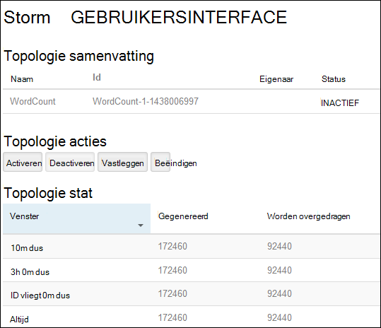
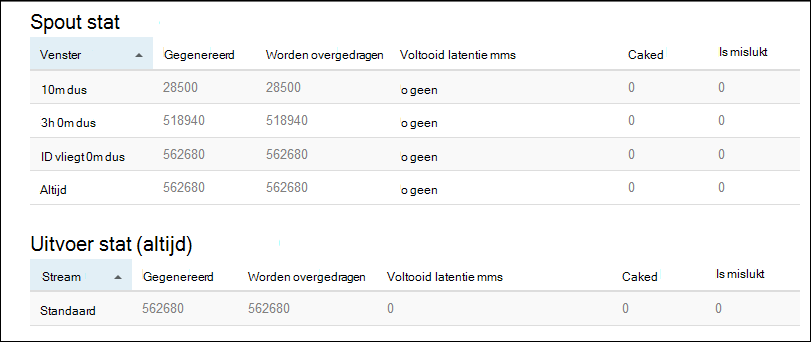

<properties
    pageTitle="Apache Storm zelfstudie: aan de slag met Linux gebaseerde Storm op HDInsight | Microsoft Azure"
    description="Aan de slag met analyses van grote gegevens met behulp Apache Storm en in de voorbeelden Storm Starter op Linux gebaseerde HDInsight. Leer hoe u Storm gebruiken om gegevens te verwerken realtime."
    keywords="Apache storm, apache storm zelfstudie, analyses van grote gegevens, storm starter"
    services="hdinsight"
    documentationCenter=""
    authors="Blackmist"
    manager="jhubbard"
    editor="cgronlun"/>

<tags
   ms.service="hdinsight"
   ms.devlang="java"
   ms.topic="get-started-article"
   ms.tgt_pltfrm="na"
   ms.workload="big-data"
   ms.date="10/12/2016"
   ms.author="larryfr"/>

# Apache Storm zelfstudie: aan de slag met de voorbeelden Storm Starter voor analyses van grote gegevens op HDInsight

Apache Storm is een berekening scalable, fouttolerantie, gedistribueerde en realtime-systeem voor het verwerken van streams van gegevens. Met Storm op Azure HDInsight, kunt u een cloudgebaseerde Storm cluster waarmee analyses van grote gegevens in realtime maken.

> [AZURE.NOTE] De stappen in dit artikel maken een cluster Linux gebaseerde HDInsight. Zie voor stapsgewijze instructies voor het maken van een Storm op basis van Windows op HDInsight cluster [Apache Storm zelfstudie: aan de slag met de Storm Starter steekproef met gegevens-analyses op HDInsight](hdinsight-apache-storm-tutorial-get-started.md)

## Vereisten voor

[AZURE.INCLUDE [delete-cluster-warning](../../includes/hdinsight-delete-cluster-warning.md)]

U moet de volgende handelingen uit te kunnen voltooien van deze zelfstudie Apache Storm hebben:

- **Een Azure-abonnement**. Zie [Azure krijgen gratis proefversie](https://azure.microsoft.com/documentation/videos/get-azure-free-trial-for-testing-hadoop-in-hdinsight/).

- **Bekend zijn met SSH en SCP**. Zie de volgende onderwerpen voor meer informatie over het gebruik van SSH en SCP met HDInsight:

    - **Linux, Unix of OS X-clients**: Zie [Gebruik SSH met Linux gebaseerde Hadoop op HDInsight uit Linux, OS X of Unix](hdinsight-hadoop-linux-use-ssh-unix.md)

    - **Windows-clients**: Zie [Gebruik SSH met Linux gebaseerde Hadoop op HDInsight vanuit Windows](hdinsight-hadoop-linux-use-ssh-windows.md)

### Vereisten voor het beheer van Access

[AZURE.INCLUDE [access-control](../../includes/hdinsight-access-control-requirements.md)]

## Een cluster Storm maken

In dit gedeelte maakt u een HDInsight versie 3,2 cluster (Storm versie 0.9.3) met een sjabloon van Azure resourcemanager. Zie voor informatie over HDInsight versies en hun serviceovereenkomsten [HDInsight onderdeel versiebeheer](hdinsight-component-versioning.md). Zie voor andere methoden voor het maken van cluster [clusters HDInsight maken](hdinsight-hadoop-provision-linux-clusters.md).

1. Klik op de volgende afbeelding om te openen van de sjabloon in de portal van Azure.         

    
    
    De sjabloon bevindt zich in een openbare blob container, *https://hditutorialdata.blob.core.windows.net/armtemplates/create-linux-based-storm-cluster-in-hdinsight.json*. 
   
2. Voer de volgende gegevens van het blad Parameters:

    - **Clusternaam**: Voer een naam voor het Hadoop-cluster dat u wilt maken.
    - **Cluster aanmeldingsnaam en wachtwoord**: de standaard-aanmeldingsnaam is beheerder.
    - **SSH-gebruikersnaam en wachtwoord**.
    
    Noteer deze waarden.  U moet ze later in deze zelfstudie.

    > [AZURE.NOTE] SSH wordt extern toegang tot het HDInsight cluster met een opdrachtregel gebruikt. De gebruikersnaam en wachtwoord dat u hier gebruikt, wordt gebruikt wanneer u verbinding maakt met het cluster via SSH. Ook zijn de naam van de gebruiker SSH uniek, zoals een gebruikersaccount op de HDInsight knooppunten gemaakt. De volgende zijn enkele van de accountnamen gereserveerd voor gebruik door services op het cluster en kunnen niet worden gebruikt als de naam van de gebruiker SSH:
    >
    > hoofdmap, hdiuser, storm, hbase, ubuntu, zookeeper, hdfs, garens, mapred, hbase, component, oozie, falcon, sqoop, beheerder, tez, hcat, hdinsight-zookeeper.

    > Zie een van de volgende artikelen voor meer informatie over het gebruik van SSH met HDInsight:

    > * [SSH gebruiken met Linux gebaseerde Hadoop op HDInsight uit Linux, Unix of OS X](hdinsight-hadoop-linux-use-ssh-unix.md)
    > * [SSH gebruiken met Linux gebaseerde Hadoop op HDInsight vanuit Windows](hdinsight-hadoop-linux-use-ssh-windows.md)

    
3. Klik op **OK** als u wilt opslaan van de parameters.

4. van het blad **aangepaste implementatie** op **resourcegroep** vervolgkeuzelijst in en klik vervolgens op **Nieuw** om een nieuwe resourcegroep te maken. De resourcegroep is een container waarin het cluster, het afhankelijke opslag-account en andere gekoppelde resource worden gegroepeerd.

5. op **juridische voorwaarden**en klik vervolgens op **maken**.

6. Klik op **maken**. Hier ziet u een nieuwe tegel getiteld Submitting implementatie voor implementatie van de sjabloon. Het duurt over ongeveer 20 minuten om het cluster en SQL-database te maken.

##Het uitvoeren van een steekproef Storm Starter op HDInsight

De [storm-starter](https://github.com/apache/storm/tree/master/examples/storm-starter) voorbeelden zijn opgenomen in het cluster HDInsight. U kunt het voorbeeld WordCount wilt uitvoeren in de volgende stappen.

1. Verbinding maken met het HDInsight cluster SSH gebruiken:

        ssh USERNAME@CLUSTERNAME-ssh.azurehdinsight.net
        
    Als u een wachtwoord beveiligen van uw gebruikersaccount SSH gebruikt, wordt u gevraagd in te voeren. Als u een openbare sleutel gebruikt, moet u mogelijk gebruiken de `-i` -parameter voor de overeenkomende persoonlijke sleutel opgeven. Bijvoorbeeld `ssh -i ~/.ssh/id_rsa USERNAME@CLUSTERNAME-ssh.azurehdinsight.net`.
        
    Zie de volgende artikelen voor meer informatie over het gebruik van SSH met Linux gebaseerde HDInsight:
    
    * [SSH gebruiken met Linux gebaseerde Hadoop op HDInsight uit Linux, Unix of OS X](hdinsight-hadoop-linux-use-ssh-unix.md)

    * [SSH gebruiken met Linux gebaseerde Hadoop op HDInsight vanuit Windows](hdinsight-hadoop-linux-use-ssh-windows)

2. Gebruik de volgende opdracht uit een topologie starten:

        storm jar /usr/hdp/current/storm-client/contrib/storm-starter/storm-starter-topologies-*.jar storm.starter.WordCountTopology wordcount
        
    > [AZURE.NOTE] De `*` deel van de bestandsnaam wordt gebruikt om te voldoen aan het versienummer waarmee gewijzigd als HDInsight wordt bijgewerkt.

    Hiermee start u de topologie van de WordCount voorbeeld op het cluster, met een beschrijvende naam 'wordcount'. Er wordt willekeurig zinnen genereren en tellen van elk woord in de zinnen.

    > [AZURE.NOTE] Bij het verzenden van topologie aan het cluster, moet u eerst het oppervlak-bestand met het cluster vóór het gebruik van kopiëren de `storm` opdracht. Dit kan worden uitgevoerd met de `scp` command vanuit de client waar het bestand zich bevindt. Bijvoorbeeld:`scp FILENAME.jar USERNAME@CLUSTERNAME-ssh.azurehdinsight.net:FILENAME.jar`
    >
    > Het voorbeeld WordCount en andere voorbeelden van de starter storm staan al op uw cluster bij `/usr/hdp/current/storm-client/contrib/storm-starter/`.

##De topologie controleren

De gebruikersinterface Storm een webservice-interface biedt voor het werken met topologieën uitgevoerd en is opgenomen in uw cluster HDInsight.

Gebruik de volgende stappen uit om te controleren van de topologie met de gebruikersinterface Storm:

1. Open een webbrowser naar https://CLUSTERNAME.azurehdinsight.net/stormui, waar __CLUSTERNAAM__ de naam van uw cluster is. Hiermee opent u de Storm-gebruikersinterface.

    > [AZURE.NOTE] Als u wordt gevraagd een gebruikersnaam en wachtwoord op te geven, voert u de beheerder van het cluster (admin) en het wachtwoord dat u wanneer gebruikt u het cluster maakt.

2. Selecteer onder **topologie samenvatting**, het fragment **wordcount** in de kolom **naam** . Hierdoor wordt meer informatie over de topologie weergegeven.

    

    Deze pagina bevat de volgende informatie:

    * **Topologie stat** - basisinformatie over de prestaties van de topologie, ingedeeld in tijd windows.

        > [AZURE.NOTE] Het tijdvenster voor informatie weergegeven in andere secties van de pagina selecteren een specifieke tijdvenster worden gewijzigd.

    * **Spouts** - basisinformatie over spouts, met inbegrip van de laatste fout die door elk spout.

    * **Bolts** - basisinformatie over bouten.

    * **Configuratie van de topologie** : gedetailleerde informatie over de topologieconfiguratie.

    Deze pagina bevat ook acties die kunnen worden uitgevoerd op de topologie:

    * **Activeren** - cv's verwerking van een gedeactiveerd topologie.

    * Een actieve topologie onderbreken **deactiveren** -

    * **Opnieuw** - Hiermee past u de evenwijdigheid van de topologie. Nadat u het aantal knooppunten in het cluster hebt gewijzigd, moet u lopende topologieën vastleggen. Hierdoor wordt de topologie om aan te passen parallellisme ter voor het nummer verhoogd/afgenomen van knooppunten in het cluster. Zie [informatie over de evenwijdigheid van de topologie van een Storm](http://storm.apache.org/documentation/Understanding-the-parallelism-of-a-Storm-topology.html)voor meer informatie.

    * **Beëindigen** - eindigt een topologie Storm na de opgegeven time-out.

3. Selecteer een vermelding van de sectie **Spouts** of **Bolts** op deze pagina. Hiermee wordt informatie over het geselecteerde onderdeel weergegeven.

    

    Deze pagina bevat de volgende gegevens:

    * **Spout/bout stat** - basisinformatie over de prestaties onderdeel ingedeeld in tijd windows.

        > [AZURE.NOTE] Het tijdvenster voor informatie weergegeven in andere secties van de pagina selecteren een specifieke tijdvenster worden gewijzigd.

    * **Invoer stat** (alleen bout) - informatie over de onderdelen die gegevens worden gebruikt door de bout produceren.

    * **Uitvoer stat** - informatie over gegevens dat door deze bout.

    * **Executors** - informatie over exemplaren van dit onderdeel.

    * **Fouten** - fouten geproduceerd door dit onderdeel.

4. Wanneer de details van een spout of bout bekijken, selecteert u een vermelding uit de kolom **poort** in de sectie **Executors** om voor een specifieke exemplaar van het onderdeel te bekijken.

        2015-01-27 14:18:02 b.s.d.task [INFO] Emitting: split default ["with"]
        2015-01-27 14:18:02 b.s.d.task [INFO] Emitting: split default ["nature"]
        2015-01-27 14:18:02 b.s.d.executor [INFO] Processing received message source: split:21, stream: default, id: {}, [snow]
        2015-01-27 14:18:02 b.s.d.task [INFO] Emitting: count default [snow, 747293]
        2015-01-27 14:18:02 b.s.d.executor [INFO] Processing received message source: split:21, stream: default, id: {}, [white]
        2015-01-27 14:18:02 b.s.d.task [INFO] Emitting: count default [white, 747293]
        2015-01-27 14:18:02 b.s.d.executor [INFO] Processing received message source: split:21, stream: default, id: {}, [seven]
        2015-01-27 14:18:02 b.s.d.task [INFO] Emitting: count default [seven, 1493957]

    Van deze gegevens kunt u zien dat de word **zeven** is opgetreden 1493957 tijden. Dat is het aantal keren dat deze is opgetreden sinds deze topologie is gestart.

##De topologie stoppen

Terugkeren naar de pagina **summary topologie** voor de topologie van het aantal woorden en selecteer vervolgens de knop **verwijderen** in de sectie **topologie acties** . Wanneer u wordt gevraagd, voert u 10 voor de seconden wachten voordat u stopt de topologie. De topologie wordt achter de punt time-out niet meer weergegeven wanneer u Ga naar het **Storm UI** -gedeelte van het dashboard.

##Het cluster verwijderen

[AZURE.INCLUDE [delete-cluster-warning](../../includes/hdinsight-delete-cluster-warning.md)]

##Volgende stappen

In deze zelfstudie Apache Storm kunt u de Starter Storm gebruikte voor meer informatie over het maken van een Storm op HDInsight cluster met behulp van het Dashboard Storm en implementeren, controleren en beheren van Storm topologieën. Vervolgens wordt uitgelegd hoe u [ontwikkelen Java gebaseerde topologieën Maven gebruiken](hdinsight-storm-develop-java-topology.md).

Als u al bekend met ontwikkelen Java gebaseerde topologieën en u wilt een bestaand topologie implementeren naar HDInsight bent, raadpleegt u [distribueren en beheren van Apache Storm topologieën op HDInsight](hdinsight-storm-deploy-monitor-topology-linux.md).

Als u een .NET-ontwikkelaar bent, kunt u C# of hybride C# / Java topologieën gebruik van Visual Studio. Zie [ontwikkelen C# topologieën voor Apache Storm op HDInsight met Hadoop tools for Visual Studio](hdinsight-storm-develop-csharp-visual-studio-topology.md)voor meer informatie.

Topologieën die kunnen worden gebruikt met Storm op HDInsight, Zie bijvoorbeeld de volgende voorbeelden:

    * [Voorbeeld topologieën voor Storm op HDInsight](hdinsight-storm-example-topology.md)

[apachestorm]: https://storm.incubator.apache.org
[stormdocs]: http://storm.incubator.apache.org/documentation/Documentation.html
[stormstarter]: https://github.com/apache/storm/tree/master/examples/storm-starter
[stormjavadocs]: https://storm.incubator.apache.org/apidocs/
[azureportal]: https://manage.windowsazure.com/
[hdinsight-provision]: hdinsight-provision-clusters.md
[preview-portal]: https://portal.azure.com/
