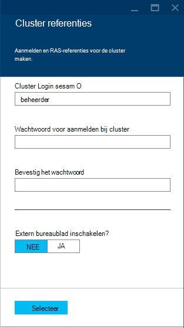

<properties
    pageTitle="Apache Storm zelfstudie: aan de slag met Storm | Microsoft Azure"
    description="Aan de slag met analyses van grote gegevens met behulp Apache Storm en in de voorbeelden Storm Starter op HDInsight. Leer hoe u Storm gebruiken om gegevens te verwerken realtime."
    keywords="Apache storm, apache storm zelfstudie, analyses van grote gegevens, storm starter"
    services="hdinsight"
    documentationCenter=""
    authors="Blackmist"
    manager="jhubbard"
    editor="cgronlun"
    tags="azure-portal"/>

<tags
   ms.service="hdinsight"
   ms.devlang="java"
   ms.topic="article"
   ms.tgt_pltfrm="na"
   ms.workload="big-data"
   ms.date="09/07/2016"
   ms.author="larryfr"/>

# Apache Storm zelfstudie: aan de slag met de voorbeelden Storm Starter voor analyses van grote gegevens op HDInsight

Apache Storm is een berekening scalable, fouttolerantie, gedistribueerde en realtime-systeem voor het verwerken van streams van gegevens. Met Storm op Microsoft Azure HDInsight, kunt u een cloudgebaseerde Storm cluster waarmee analyses van grote gegevens in realtime maken. 

> [AZURE.NOTE] De stappen in dit artikel maken een cluster HDInsight op basis van Windows. Zie voor stapsgewijze instructies voor het maken van een Storm Linux gebaseerde op HDInsight cluster [Apache Storm zelfstudie: aan de slag met de Storm Starter steekproef met gegevens-analyses op HDInsight](hdinsight-apache-storm-tutorial-get-started-linux.md)

## Vereisten voor

[AZURE.INCLUDE [delete-cluster-warning](../../includes/hdinsight-delete-cluster-warning.md)]

U moet de volgende handelingen uit te kunnen voltooien van deze zelfstudie Apache Storm hebben:

- **Een Azure-abonnement**. Zie [Azure krijgen gratis proefversie](https://azure.microsoft.com/documentation/videos/get-azure-free-trial-for-testing-hadoop-in-hdinsight/).

### Vereisten voor het beheer van Access

[AZURE.INCLUDE [access-control](../../includes/hdinsight-access-control-requirements.md)]

## Een cluster Storm maken

Azure-blobopslag storm op HDInsight gebruikt voor het opslaan van de logbestanden en topologieën verzonden naar het cluster. Gebruik de volgende stappen om te maken van een account Azure opslag voor gebruik met uw cluster:

1. Meld u aan bij de [Portal van Azure][preview-portal].

2. Selecteer **Nieuw** __Analyses van gegevens__, en selecteer vervolgens __HDInsight__.

    

3. Voer een __clusternaam__. Er verschijnt een groen vinkje naast de __Naam Cluster__ als deze beschikbaar is.

4. Als u meer dan één abonnement hebt, selecteert u de vermelding voor het __abonnement__ om te selecteren van de Azure-abonnement dat wordt gebruikt voor het cluster.

5.  Gebruik __Cluster Type selecteren__ om te selecteren van een cluster __Storm__ . Voor het __besturingssysteem gebruikt__, selecteert u Windows. Selecteer voor __Cluster laag__, standaard. Gebruik ten slotte de knop selecteren om op te slaan van deze instellingen.

    

5. Voor __Resourcegroep__kunt u ons de vervolgkeuzelijst een overzicht van bestaande resourcegroepen en selecteer vervolgens een de cluster in maken. Of u kunt selecteert u daarna __Nieuw__ en voer vervolgens de naam van de nieuwe resourcegroep. Een groen vinkje wordt weergegeven om aan te geven als de naam van de nieuwe groep beschikbaar is.

6. Selecteer __referenties__en voer vervolgens een __Cluster Login gebruikersnaam__ en __Wachtwoord voor aanmelden bij Cluster__. Gebruik ten slotte, __Selecteer__ referenties instellen. Extern bureaublad worden niet gebruikt in dit document, zodat u kunt laten staan uitgeschakeld.

    

6. U kunt voor __Gegevensbron__, selecteer het item naar een bestaande gegevensbron kiezen of een nieuw account te maken.

    

    Momenteel kunt u een account Azure opslag als de gegevensbron voor een cluster HDInsight. Gebruik de volgende manieren te werk voor meer informatie over de items in het blad __Gegevensbron__ .

    - __Selectiemethode__: deze worden ingesteld __van alle abonnementen__ om te bladeren van opslag-accounts op uw abonnementen inschakelen. Als u wilt de __Naam van de opslag__ en __Toegangstoets__ van een bestaand account voor de opslag ingesteld op __Toegangstoets__ .

    - __Nieuw__: Hiermee kunt u een nieuw account voor de opslag maken. Het veld dat wordt weergegeven om het Voer de naam van het account opslag gebruiken. Een groen vinkje wordt weergegeven als de naam beschikbaar is.

    - __Kies standaardcontainer__: Hiermee voert u de naam van de standaardcontainer wilt gebruiken voor het cluster. Terwijl u hier een naam invoert kunt, wordt u aangeraden dezelfde naam als het cluster gebruiken, zodat u gemakkelijk herkennen kunt dat de container wordt gebruikt voor deze specifieke cluster.

    - __Locatie__: de geografische regio die het opslag-account bevinden zich in of wordt gemaakt in.

        > [AZURE.IMPORTANT] De locatie voor de standaard-gegevensbron selecteren, stelt ook de locatie van het cluster HDInsight. De gegevensbron cluster en standaard moet zich bevinden in dezelfde regio.

    - __Selecteer__: Gebruik deze opdracht om op te slaan configuratie van de gegevensbron.

7. Selecteer __Knooppunt prijzen lagen__ om informatie over de knooppunten die worden gemaakt voor deze cluster weer te geven. Het aantal knooppunten werknemer is standaard ingesteld op __4__. Stel dit in op __1__, wanneer dit voldoende voor deze zelfstudie wordt en Hiermee reduceert u de kosten van het cluster. De geschatte kosten van het cluster wordt weergegeven onder aan deze blade.

    

    Gebruik __selecteert u__ de gegevens van het __Knooppunt prijzen lagen__ op te slaan.

8. Selecteer __optioneel configuratie__. Deze blade kunt u de versie cluster selecteert, evenals andere optionele instellingen configureren zoals deelnemen aan een __Virtueel netwerk__.

    

9. Zorg ervoor dat __vastmaken aan Startboard__ is geselecteerd en selecteer __maken__. Hiermee wordt het cluster gemaakt en voegt een tegel voor deze naar de Startboard van uw Azure-portal. Het pictogram wordt aangegeven dat de inrichting van het cluster en wijzigingen in de inrichting van één keer HDInsight-pictogram weergeven is voltooid.

  	| Tijdens het inrichten | Inrichten is voltooid |
  	| ------------------ | --------------------- |
  	|  |  |

    > [AZURE.NOTE] Het duurt enige tijd voor het cluster moet worden gemaakt, meestal ongeveer 15 minuten. De tegel op het Startboard of het fragment __meldingen__ aan de linkerkant van de pagina gebruiken om te controleren of het inrichten.

## Het uitvoeren van een steekproef Storm Starter op HDInsight

Deze zelfstudie Apache Storm maakt u kennis met analyses van grote gegevens met de voorbeelden Storm Starter op GitHub.

Elke Storm op HDInsight cluster wordt geleverd met het Dashboard Storm, die kan worden gebruikt om te uploaden en Storm topologieën worden uitgevoerd op het cluster. Elk cluster is ook wordt geleverd met steekproef topologieën die rechtstreeks vanuit het Dashboard Storm kunnen worden uitgevoerd.

### Verbinding maken met het dashboard

Het dashboard bevindt zich op **https://&lt;Clusternaam >.azurehdinsight.net//**, waarbij **clusternaam** de naam van het cluster. U kunt ook een koppeling naar het dashboard vinden door het cluster in de Startboard selecteren en de koppeling __Dashboard__ aan de bovenkant van het blad te selecteren.

> [AZURE.NOTE] Wanneer u verbinding maakt met het dashboard, wordt u gevraagd een gebruikersnaam en wachtwoord invoeren. Dit is de naam van de beheerder (**beheerder**) en het wachtwoord gebruikt wanneer u het cluster hebt gemaakt.

Nadat het Dashboard Storm is geladen, ziet u het formulier **Topologie indienen** .

Het formulier **Indienen topologie** kan worden gebruikt om te uploaden en uitvoeren van de JAR-bestanden die Storm topologieën bevatten. Het bevat ook verschillende eenvoudige voorbeelden die bij het cluster worden geleverd.

### De steekproef aantal woorden uit het project Storm Starter in GitHub uitvoeren

De voorbeelden met het cluster bevatten verschillende versies van een word-tellen topologie. Deze voorbeelden bevatten een **spout** die willekeurig genereert zinnen en **bolts** waarmee het einde van elke zin in afzonderlijke woorden en klik vervolgens tellen hoe vaak elk woord is opgetreden. Deze voorbeelden zijn van de [Storm Starter voorbeelden](https://github.com/apache/storm/tree/master/examples/storm-starter), die een deel uitmaken van Apache Storm.

De volgende stappen als u wilt uitvoeren van een steekproef Storm Starter uitvoeren:

1. Selecteer **StormStarter - WordCount** in de vervolgkeuzelijst **Jar-bestand** . Hierdoor wordt de **Klassenaam** en **Aanvullende Parameters** velden met de parameters voor dit voorbeeld gevuld.

    

    * **De naam van de klasse** - de klas in het bestand .jar waarmee de topologie.
    * **Aanvullende Parameters** - eventuele parameters door de topologie. In dit voorbeeld is het veld wordt gebruikt om te leveren een beschrijvende naam voor de ingediende topologie.

2. Klik op **verzenden**. Het veld **resultaat** weergegeven en de opdracht gebruikt om in te dienen voor de taak, evenals de resultaten van de opdracht. Het veld **fout** wordt eventuele fouten die zich in het indienen van de topologie.

    

    > [AZURE.NOTE] De resultaten niet geven aan dat de topologie is voltooid - wordt **een Storm topologie, één keer wordt gestart, wordt uitgevoerd totdat u deze stoppen** Het aantal woorden topologie genereert willekeurige zinnen en een telling van hoe vaak wordt aangetroffen elk woord, totdat u het stopt blijft.

### De topologie controleren

De gebruikersinterface Storm kan worden gebruikt om te controleren van de topologie.

1. Selecteer **Storm UI** vanaf de bovenkant van het Dashboard Storm. Hiermee worden samenvatting van de gegevens voor het cluster en alle actieve topologieën weergegeven.

    

    Op de pagina ziet u de tijd die de topologie actief is, alsmede het aantal werknemers, executors en taken die wordt gebruikt.

    > [AZURE.NOTE] De kolom **naam van** bevat de opgegeven eerder via het veld **Aanvullende Parameters** beschrijvende naam.

4. Selecteer onder **topologie samenvatting**, het fragment **wordcount** in de kolom **naam** . Hiermee worden weergegeven voor meer informatie over de topologie.

    

    Deze pagina bevat de volgende informatie:

    * **Topologie stat** - basisinformatie over de prestaties van de topologie, ingedeeld in tijd windows.

        > [AZURE.NOTE] Het tijdvenster voor informatie weergegeven in andere secties van de pagina selecteren een specifieke tijdvenster worden gewijzigd.

    * **Spouts** - basisinformatie over spouts, met inbegrip van de laatste fout die door elk spout.

    * **Bolts** - basisinformatie over bouten.

    * **Configuratie van de topologie** : gedetailleerde informatie over de topologieconfiguratie.

    Deze pagina bevat ook acties die kunnen worden uitgevoerd op de topologie:

    * **Activeren** - cv's verwerking van een gedeactiveerd topologie.

    * Een actieve topologie onderbreken **deactiveren** -

    * **Opnieuw** - Hiermee past u de evenwijdigheid van de topologie. Nadat u het aantal knooppunten in het cluster hebt gewijzigd, moet u lopende topologieën vastleggen. Hierdoor wordt de topologie om aan te passen parallellisme ter voor het nummer verhoogd/afgenomen van knooppunten in het cluster. Zie [informatie over de evenwijdigheid van de topologie van een Storm](http://storm.apache.org/documentation/Understanding-the-parallelism-of-a-Storm-topology.html)voor meer informatie.

    * **Beëindigen** - eindigt een topologie Storm na de opgegeven time-out.

5. Selecteer een vermelding van de sectie **Spouts** of **Bolts** op deze pagina. Hiermee wordt informatie over het geselecteerde onderdeel.

    

    Deze pagina bevat de volgende gegevens:

    * **Spout/bout stat** - basisinformatie over de prestaties onderdeel ingedeeld in tijd windows.

        > [AZURE.NOTE] Het tijdvenster voor informatie weergegeven in andere secties van de pagina selecteren een specifieke tijdvenster worden gewijzigd.

    * **Invoer stat** (alleen bout) - informatie over de onderdelen die gegevens worden gebruikt door de bout produceren.

    * **Uitvoer stat** - informatie over gegevens dat door deze bout.

    * **Executors** - informatie over het exemplaren van dit onderdeel.

    * **Fouten** - fouten geproduceerd door dit onderdeel.

5. Wanneer de details van een spout of bout bekijken, selecteert u een vermelding uit de kolom **poort** in de sectie **Executors** om voor een specifieke exemplaar van het onderdeel te bekijken.

        2015-01-27 14:18:02 b.s.d.task [INFO] Emitting: split default ["with"]
        2015-01-27 14:18:02 b.s.d.task [INFO] Emitting: split default ["nature"]
        2015-01-27 14:18:02 b.s.d.executor [INFO] Processing received message source: split:21, stream: default, id: {}, [snow]
        2015-01-27 14:18:02 b.s.d.task [INFO] Emitting: count default [snow, 747293]
        2015-01-27 14:18:02 b.s.d.executor [INFO] Processing received message source: split:21, stream: default, id: {}, [white]
        2015-01-27 14:18:02 b.s.d.task [INFO] Emitting: count default [white, 747293]
        2015-01-27 14:18:02 b.s.d.executor [INFO] Processing received message source: split:21, stream: default, id: {}, [seven]
        2015-01-27 14:18:02 b.s.d.task [INFO] Emitting: count default [seven, 1493957]

    Van deze gegevens kunt u zien dat de word **zeven** is opgetreden 1,493,957 tijden. Dat is het aantal keren dat deze is opgetreden sinds deze topologie is gestart.

### De topologie stoppen

Terugkeren naar de pagina **summary topologie** voor de topologie van het aantal woorden en selecteer **verwijderen** in de sectie **topologie acties** . Wanneer u wordt gevraagd, voert u 10 voor de seconden wachten voordat u stopt de topologie. Na de time-out de topologie niet meer wordt weergegeven wanneer u gaat u naar de sectie **Storm UI** van het dashboard.

##Het cluster verwijderen

[AZURE.INCLUDE [delete-cluster-warning](../../includes/hdinsight-delete-cluster-warning.md)]

## Overzicht

In deze zelfstudie Apache Storm kunt u de Starter Storm gebruikte voor meer informatie over het maken van een Storm op HDInsight cluster met behulp van het Dashboard Storm en implementeren, controleren en beheren van Storm topologieën.

## Volgende stappen

* **HDInsight Tools voor Visual Studio** - hulpmiddelen voor HDInsight kunt u Visual Studio gebruiken om te verzenden, controleren en beheren van Storm topologieën vergelijkbaar met het Storm Dashboard eerder hebt. Hulpmiddelen voor HDInsight ook biedt de mogelijkheid te maken van C# Storm topologieën en steekproef topologieën die u kunt implementeren en uitvoeren op uw cluster bevat.

    Zie [aan de slag met de HDInsight-Tools for Visual Studio](hdinsight-hadoop-visual-studio-tools-get-started.md)voor meer informatie.

* **Voorbeeldbestanden** - het HDInsight Storm cluster bevat verschillende voorbeelden in de adreslijst **%STORM_HOME%\contrib** . Elk voorbeeld moet de volgende elementen bevatten:

    * De broncode - bijvoorbeeld storm-starter-0.9.1.2.1.5.0-2057-sources.jar

    * De Java documenten - bijvoorbeeld storm-starter-0.9.1.2.1.5.0-2057-javadoc.jar

    * Het voorbeeld - bijvoorbeeld storm-starter-0.9.1.2.1.5.0-2057-jar-with-dependencies.jar

    Gebruik de opdracht 'oppervlak' worden geëxtraheerd de broncode of Java-documenten. Bijvoorbeeld ' oppervlak - xvf storm-starter-0.9.1.2.1.5.0.2057-javadoc.jar'.

    > [AZURE.NOTE] Java-documenten bestaan uit webpagina's. Zodra opgehaald, moet u een browser gebruiken om het bestand **index.html** .

    Voor toegang tot deze voorbeelden, moet u extern bureaublad inschakelen voor de Storm op HDInsight cluster en kopieert u de bestanden van **%STORM_HOME%\contrib**.

* Het volgende document bevat een lijst met andere voorbeelden die kan worden gebruikt met Storm op HDInsight:

    * [Voorbeeld topologieën voor Storm op HDInsight](hdinsight-storm-example-topology.md)

[apachestorm]: https://storm.incubator.apache.org
[stormdocs]: http://storm.incubator.apache.org/documentation/Documentation.html
[stormstarter]: https://github.com/apache/storm/tree/master/examples/storm-starter
[stormjavadocs]: https://storm.incubator.apache.org/apidocs/
[azureportal]: https://manage.windowsazure.com/
[hdinsight-provision]: hdinsight-provision-clusters.md
[preview-portal]: https://portal.azure.com/
