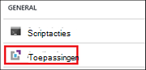
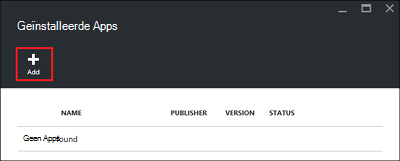
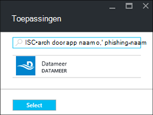
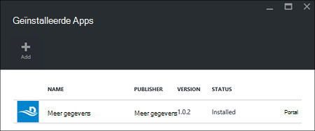

<properties
    pageTitle="Hadoop-toepassingen installeren op HDInsight | Microsoft Azure"
    description="Leer hoe u HDInsight-toepassingen installeren op HDInsight-toepassingen."
    services="hdinsight"
    documentationCenter=""
    authors="mumian"
    manager="jhubbard"
    editor="cgronlun"
    tags="azure-portal"/>

<tags
    ms.service="hdinsight"
    ms.devlang="na"
    ms.topic="hero-article"
    ms.tgt_pltfrm="na"
    ms.workload="big-data"
    ms.date="09/14/2016"
    ms.author="jgao"/>

# HDInsight-toepassingen installeren

Een toepassing HDInsight is een toepassing die gebruikers op een cluster Linux gebaseerde HDInsight installeren kunnen. Deze toepassingen kunnen worden ontwikkeld door Microsoft, onafhankelijke leveranciers (ISV) of door zelf. In dit artikel leert u hoe u een gepubliceerde toepassing installeert. Zie [aangepaste HDInsight-toepassingen installeren](hdinsight-apps-install-custom-applications.md)voor de installatie van uw eigen toepassing. 

Er is momenteel één gepubliceerde toepassing:

- **Datameer**: [Datameer](http://www.datameer.com/documentation/display/DAS50/Home?ls=Partners&lsd=Microsoft&c=Partners&cd=Microsoft) biedt analisten een interactieve manier om te ontdekken, analyseren en de resultaten op Big Data visualiseren. Ophalen in aanvullende gegevensbronnen eenvoudig naar kennismaken met nieuwe relaties en de antwoorden die u snel nodig hebt.

>[AZURE.NOTE] Datameer is momenteel alleen ondersteund voor Azure HDInsight versie 3,2 clusters.

De instructies in dit artikel Azure-portal gebruiken. U kunt ook de resourcemanager Azure-sjabloon van de portal exporteren of een kopie van de sjabloon Resource Manager verkrijgen van leveranciers en Azure PowerShell en Azure CLI gebruiken om te implementeren van de sjabloon.  Zie [maken Linux gebaseerde Hadoop in HDInsight resourcemanager sjablonen gebruiken](hdinsight-hadoop-create-linux-clusters-arm-templates.md).

## Vereisten voor

Als u HDInsight-toepassingen installeren op een bestaand HDInsight cluster wilt, moet u een cluster HDInsight hebben. Als u wilt maken, raadpleegt u [clusters maken](hdinsight-hadoop-linux-tutorial-get-started.md#create-cluster). Wanneer u een cluster HDInsight maakt, kunt u ook HDInsight-toepassingen installeren.

## Toepassingen met bestaande clusters installeren

De volgende procedure ziet u hoe u aan een bestaand HDInsight cluster HDInsight-toepassingen installeren.

**Een HDInsight-toepassing te installeren**

1. Meld u aan bij de [portal van Azure](https://portal.azure.com).
2. Klik op **HDInsight Clusters** in het linkermenu.  Als u dit niet ziet, klikt u op **Bladeren**en klik vervolgens op **HDInsight Clusters**.
3. Klik op een cluster HDInsight.  Als u deze niet hebt, moet u een eerste.  Zie [clusters maken](hdinsight-hadoop-linux-tutorial-get-started.md#create-cluster).
4. Klik op **toepassingen** onder de categorie **Algemeen** van het blad **Instellingen** . Het blad **Geïnstalleerd Apps** bevat alle geïnstalleerde toepassingen. 

    

5. Klik op **toevoegen** vanuit het menu blade. 

    

    Er wordt een overzicht van bestaande HDInsight-toepassingen.

    

6. Klik op een van de toepassingen, accepteer de juridische voorwaarden en klik vervolgens op **selecteren**.

U kunt de installatiestatus van de portal-mailmeldingen zien (Klik op het belpictogram boven aan de portal). Nadat de toepassing is geïnstalleerd, wordt de toepassing wordt weergegeven op het blad Apps hebt geïnstalleerd.

## Toepassingen tijdens het maken van cluster installeren

Hebt u de optie HDInsight-toepassingen installeren wanneer u een cluster maakt. Tijdens het proces, worden de HDInsight-toepassingen worden geïnstalleerd nadat het cluster wordt gemaakt en in de actieve stand wordt. De volgende procedure ziet u hoe u HDInsight-toepassingen installeren wanneer u een cluster maakt.

**Een HDInsight-toepassing te installeren**

1. Meld u aan bij de [portal van Azure](https://portal.azure.com).
2. Klik op **Nieuw**, klik op **gegevens + Analytics**en klik vervolgens op **HDInsight**.
3. Voer **De naam van Cluster**: deze naam moet uniek zijn.
4. Klik op **abonnement** om te selecteren van de Azure-abonnement dat wordt gebruikt voor het cluster.
5. Klik op **Selecteer cluster Type**en selecteer vervolgens:

    - **Cluster Type**: als u niet weet wat u moet kiezen, selecteert u **Hadoop**. Dit is het meest populaire clustertype.
    - **Besturingssysteem**: Selecteer **Linux**.
    - **Versie**: de standaardversie gebruiken als u niet weet wat u moet kiezen. Zie voor meer informatie [HDInsight cluster versies](hdinsight-component-versioning.md).
    - **Cluster laag**: Azure HDInsight biedt de grote gegevens cloud aanbiedingen in twee categorieën: standaard laag en Premium laag. Zie [Cluster lagen](hdinsight-hadoop-provision-linux-clusters.md#cluster-tiers)voor meer informatie.
6. Klik op **toepassingen**op een van de gepubliceerde toepassingen en klik vervolgens op **selecteren**.
6. Klik op **referenties** en voer vervolgens een wachtwoord voor de beheerder. U moet ook een **SSH gebruikersnaam** en een **wachtwoord** of **Openbare sleutel**, die wordt gebruikt om te verifiëren van de gebruiker SSH invoeren. Een openbare sleutel gebruikt, is de aanbevolen wijze. Klik op **selecteren** onder de configuratie referenties opslaan.
8. Klik op **Gegevensbron**, selecteer een van de bestaande opslag-account of maak een nieuwe opslag-account moet worden gebruikt als het standaardaccount voor de opslag voor het cluster.
9. Klik op **Resourcegroep** om een bestaande resourcegroep te selecteren of klik op **Nieuw** om te maken van een nieuwe resourcegroep

10. Zorg ervoor dat **vastmaken aan Startboard** is geselecteerd en klik vervolgens op **maken**op het blad **Nieuwe HDInsight Cluster** . 

## Een lijst met geïnstalleerde HDInsight-apps en eigenschappen

De portal ziet u een overzicht van de geïnstalleerde toepassingen HDInsight voor een cluster en de eigenschappen van elke geïnstalleerde toepassingen.

**Aan de lijst HDInsight-toepassing en eigenschappen weer te geven**

1. Meld u aan bij de [portal van Azure](https://portal.azure.com).
2. Klik op **HDInsight Clusters** in het linkermenu.  Als u dit niet ziet, klikt u op **Bladeren**en klik vervolgens op **HDInsight Clusters**.
3. Klik op een cluster HDInsight.
4. Klik op **toepassingen** onder de categorie **Algemeen** van het blad **Instellingen** . Het blad geïnstalleerd Apps bevat alle geïnstalleerde toepassingen. 

    

5. Klik op een van de geïnstalleerde toepassingen om weer te geven van de eigenschap. Het blad eigenschap bevat:

    - App-naam: toepassingsnaam.
    - Status: toepassingsstatus. 
    - Webpagina: De URL van de webtoepassing die u hebt geïmplementeerd naar het randknooppunt als er een. De referentie is hetzelfde als de referenties van de HTTP-gebruiker die u hebt geconfigureerd voor het cluster.
    - HTTP-eindpunt: de referentie is hetzelfde als de referenties van de HTTP-gebruiker die u hebt geconfigureerd voor het cluster. 
    - SSH eindpunt: U kunt [SSH](hdinsight-hadoop-linux-use-ssh-unix.md) verbinding maken met het randknooppunt. De referenties SSH zijn hetzelfde als de gebruikersreferenties SSH die u hebt geconfigureerd voor het cluster.

6. Als u wilt verwijderen van een toepassing, met de rechtermuisknop op de toepassing en klik vervolgens op **verwijderen** in het snelmenu.

## Verbinding maken met het randknooppunt

U kunt verbinding maken met het randknooppunt HTTP en SSH. De weergegeven gegevens vindt u in de [portal](#list-installed-hdinsight-apps-and-properties). Zie voor meer informatie over het gebruik van SSH, [Gebruik SSH met Linux gebaseerde Hadoop op HDInsight uit Linux, Unix, of OS X](hdinsight-hadoop-linux-use-ssh-unix.md). 

De HTTP-eindpunt referenties zijn de referenties van de HTTP-gebruiker die u hebt geconfigureerd voor het cluster HDInsight. de SSH eindpunt referenties zijn de SSH-referenties die u hebt geconfigureerd voor het cluster HDInsight.

## Problemen met

Zie [problemen oplossen met de installatie](hdinsight-apps-install-custom-applications.md#troubleshoot-the-installation).

## Volgende stappen

- [Aangepaste HDInsight-toepassingen installeren](hdinsight-apps-install-custom-applications.md): informatie over het implementeren van een niet-gepubliceerde HDInsight-toepassing met HDInsight.
- [Publiceren HDInsight-toepassingen](hdinsight-apps-publish-applications.md): informatie over het publiceren van uw aangepaste HDInsight-toepassingen met Azure Marketplace.
- [MSDN: installatie van een toepassing HDInsight](https://msdn.microsoft.com/library/mt706515.aspx): meer informatie over het definiëren van HDInsight-toepassingen.
- [HDInsight aanpassen Linux gebaseerde clusters met de actie Script](hdinsight-hadoop-customize-cluster-linux.md): informatie over het gebruik van scriptactie voor het installeren van extra toepassingen.
- [Hadoop maken Linux gebaseerde clusters in HDInsight resourcemanager sjablonen gebruiken](hdinsight-hadoop-create-linux-clusters-arm-templates.md): meer informatie over het bellen van resourcemanager sjablonen HDInsight clusters maken.
- [Lege rand knooppunten in HDInsight gebruiken](hdinsight-apps-use-edge-node.md): informatie over het gebruik van een lege randknooppunt voor toegang tot HDInsight cluster, testen van HDInsight-toepassingen en hostingprovider HDInsight-toepassingen.

