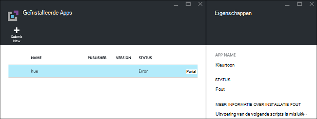
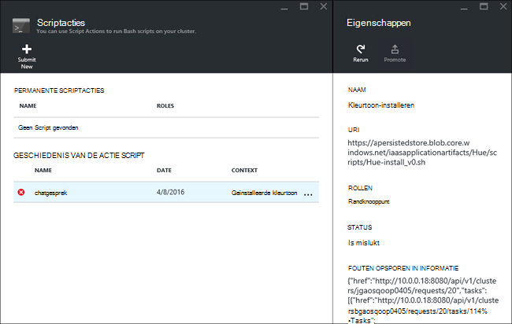

<properties
    pageTitle="Hadoop-toepassingen installeren op HDInsight | Microsoft Azure"
    description="Leer hoe u HDInsight-toepassingen installeren op HDInsight-toepassingen."
    services="hdinsight"
    documentationCenter=""
    authors="mumian"
    manager="jhubbard"
    editor="cgronlun"
    tags="azure-portal"/>

<tags
    ms.service="hdinsight"
    ms.devlang="na"
    ms.topic="hero-article"
    ms.tgt_pltfrm="na"
    ms.workload="big-data"
    ms.date="09/14/2016"
    ms.author="jgao"/>

# Aangepaste HDInsight-toepassingen installeren

Een toepassing HDInsight is een toepassing die gebruikers op een cluster Linux gebaseerde HDInsight installeren kunnen.  Deze toepassingen kunnen worden ontwikkeld door Microsoft, onafhankelijke leveranciers (ISV) of door zelf. In dit artikel leert u hoe u een HDInsight-toepassing die niet is gepubliceerd naar de Azure-portal op HDInsight installeert. De toepassing die u wilt installeren is [kleurtoon](http://gethue.com/). 

Andere verwante artikelen:

- [Installeer HDInsight-toepassingen](hdinsight-apps-install-applications.md): informatie over het installeren van een toepassing HDInsight uw clusters.
- [Publiceren HDInsight-toepassingen](hdinsight-apps-publish-applications.md): informatie over het publiceren van uw aangepaste HDInsight-toepassingen met Azure Marketplace.
- [MSDN: installatie van een toepassing HDInsight](https://msdn.microsoft.com/library/mt706515.aspx): meer informatie over het definiëren van HDInsight-toepassingen.

 
## Vereisten voor

Als u HDInsight-toepassingen installeren op een bestaand HDInsight cluster wilt, moet u een cluster HDInsight hebben. Als u wilt maken, raadpleegt u [clusters maken](hdinsight-hadoop-linux-tutorial-get-started.md#create-cluster). Wanneer u een cluster HDInsight maakt, kunt u ook HDInsight-toepassingen installeren.

## HDInsight-toepassingen installeren

HDInsight toepassingen kunnen worden geïnstalleerd wanneer u een cluster maakt of aan een bestaand HDInsight cluster. Zie voor het definiëren van Azure resourcemanager sjablonen, [MSDN: installatie van een toepassing HDInsight](https://msdn.microsoft.com/library/mt706515.aspx).

De bestanden die u nodig hebt voor het implementeren van deze toepassing (kleurtoon):

- [azuredeploy.JSON](https://github.com/hdinsight/Iaas-Applications/blob/master/Hue/azuredeploy.json): de resourcemanager sjabloon voor de installatie van HDInsight-toepassing. Zie [MSDN: installatie van een toepassing HDInsight](https://msdn.microsoft.com/library/mt706515.aspx) voor het ontwikkelen van uw eigen sjabloon resourcemanager.
- [tint-install_v0.sh](https://github.com/hdinsight/Iaas-Applications/blob/master/Hue/scripts/Hue-install_v0.sh): het Script actie wordt aangeroepen door de resourcemanager-sjabloon voor het configureren van het randknooppunt. 
- [tint-binaries.tgz](https://hdiconfigactions.blob.core.windows.net/linuxhueconfigactionv01/hue-binaries-14-04.tgz): het tint binair bestand wordt aangeroepen vanuit hui-install_v0.sh. 
- [kleurtoon-binaire bestanden-14-04.tgz](https://hdiconfigactions.blob.core.windows.net/linuxhueconfigactionv01/hue-binaries-14-04.tgz): de kleurtoon binair bestand wordt aangeroepen vanuit hui-install_v0.sh. 
- [webwasb-tomcat.tar.gz](https://hdiconfigactions.blob.core.windows.net/linuxhueconfigactionv01/webwasb-tomcat.tar.gz): een voorbeeld-webtoepassing (Tomcat) dat wordt aangeroepen vanuit hui-install_v0.sh.

**Kleurtoon aan een bestaand HDInsight cluster installeren**

1. Klik op de volgende afbeelding om te melden bij Azure en open de sjabloon resourcemanager in de Portal Azure. 

    

    Deze knop opent een sjabloon resourcemanager op de Azure-portal.  De sjabloon resourcemanager bevindt zich op [https://github.com/hdinsight/Iaas-Applications/tree/master/Hue](https://github.com/hdinsight/Iaas-Applications/tree/master/Hue).  Als u wilt weten hoe u deze sjabloon voor een Resource Manager schrijven, raadpleegt u [MSDN: installatie van een toepassing HDInsight](https://msdn.microsoft.com/library/mt706515.aspx).
    
2. Voer de volgende gegevens van het blad **Parameters** :

    - **Clusternaam**: Voer de naam van het cluster waarop u wilt installeren van de toepassing. Dit cluster moet een bestaand cluster.
    
3. Klik op **OK** als u wilt opslaan van de parameters.
4. Voer de **resourcegroep**van het blad **aangepaste implementatie** .  De resourcegroep is een container waarin het cluster, het afhankelijke opslag-account en andere resources worden gegroepeerd. Dit is vereist voor het gebruiken van dezelfde resourcegroep als het cluster.
5. Klik op de **juridische voorwaarden**en klik vervolgens op **maken**.
6. Controleer of het selectievakje **vastmaken aan het dashboard** is geselecteerd en klik vervolgens op **maken**. Ziet u de installatiestatus van de tegel vastgemaakt aan de portal dashboard en de portal melding (Klik op het belpictogram boven aan de portal).  Het duurt ongeveer 10 minuten om de toepassing te installeren.

**Kleurtoon tijdens het maken van een cluster installeren**

1. Klik op de volgende afbeelding om te melden bij Azure en open de sjabloon resourcemanager in de Portal Azure. 

    

    Deze knop opent een sjabloon resourcemanager op de Azure-portal.  De sjabloon resourcemanager bevindt zich op [https://hditutorialdata.blob.core.windows.net/hdinsightapps/create-linux-based-hadoop-cluster-in-hdinsight.json](https://hditutorialdata.blob.core.windows.net/hdinsightapps/create-linux-based-hadoop-cluster-in-hdinsight.json).  Als u wilt weten hoe u deze sjabloon voor een Resource Manager schrijven, raadpleegt u [MSDN: installatie van een toepassing HDInsight](https://msdn.microsoft.com/library/mt706515.aspx).

2. Volg de aanwijzingen op cluster maken en installeer kleurtoon. Zie voor meer informatie over het maken van HDInsight clusters [maken Linux gebaseerde Hadoop clusters in HDInsight](hdinsight-hadoop-provision-linux-clusters.md).

Naast de Azure-portal, kunt u [Azure PowerShell](hdinsight-hadoop-create-linux-clusters-arm-templates.md#deploy-with-powershell) en [Azure CLI](hdinsight-hadoop-create-linux-clusters-arm-templates.md#deploy-with-azure-cli) ook gebruiken om te bellen resourcemanager sjablonen.

## Valideer de installatie

U kunt de toepassingsstatus op de Azure-portal voor het valideren van de installatie van de toepassing controleren. Bovendien kunt u ook valideren alle HTTP eindpunten afkomstig zijn van zoals verwacht en de webpagina als er een:

**De kleurtoon-portal openen**

1. Meld u aan bij de [portal van Azure](https://portal.azure.com).
2. Klik op **HDInsight Clusters** in het linkermenu.  Als u dit niet ziet, klikt u op **Bladeren**en klik vervolgens op **HDInsight Clusters**.
3. Klik op het cluster waarop u de toepassing hebt geïnstalleerd.
4. Klik op **toepassingen** onder de categorie **Algemeen** van het blad **Instellingen** . Er wordt **kleurtoon** vermeld in het blad **Apps hebt geïnstalleerd** .
5. Klik op **kleurtoon** in de lijst voor een overzicht van de eigenschappen.  
6. Klik op de koppeling webpagina valideren van de website; Open het HTTP-eindpunt in een browser om te valideren van het tint web UI, opent u het SSH eindpunt met [stopverf](hdinsight-hadoop-linux-use-ssh-windows.md) of andere [SSH-clients](hdinsight-hadoop-linux-use-ssh-unix.md).
 
## Problemen met de installatie oplossen

U kunt de installatiestatus van de toepassing van de portal melding controleren (Klik op het belpictogram boven aan de portal). 

Als de installatie van een toepassing is mislukt, kunt u ziet u de foutberichten en fouten opsporen in informatie uit 3 locaties:

- HDInsight-toepassingen: algemene foutinformatie.

    Het cluster openen vanuit de portal en toepassingen van het blad instellingen op:

    

- HDInsight scriptactie: als de HDInsight-toepassingen foutbericht geeft aan een script actie is mislukt dat, meer informatie over het script is mislukt in het deelvenster script acties weergegeven.

    Klik op scriptactie uit het blad instellingen. Script actie geschiedenis ziet u de foutberichten

    
    
- Ambari Web UI: Als het script voor installatie de oorzaak van het probleem is, gebruik Ambari Web UI volledige logboeken over de installatie-scripts controleren.

    Zie voor meer informatie [voor probleemoplossing](hdinsight-hadoop-customize-cluster-linux.md#troubleshooting).

## HDInsight-toepassingen verwijderen

Er zijn verschillende manieren HDInsight-toepassingen verwijderen.

### Portal gebruiken

**Verwijderen van een toepassing met behulp van de portal**

1. Meld u aan bij de [portal van Azure](https://portal.azure.com).
2. Klik op **HDInsight Clusters** in het linkermenu.  Als u dit niet ziet, klikt u op **Bladeren**en klik vervolgens op **HDInsight Clusters**.
3. Klik op het cluster waarop u de toepassing hebt geïnstalleerd.
4. Klik op **toepassingen** onder de categorie **Algemeen** van het blad **Instellingen** . Er wordt een lijst met geïnstalleerde toepassingen. Voor deze zelfstudie **tint** in het blad **Apps geïnstalleerd** weergegeven.
5. Met de rechtermuisknop op de toepassing die u wilt verwijderen en klik vervolgens op **verwijderen**.
6. Klik op **Ja** om te bevestigen.

U kunt ook de cluster verwijderen of de resourcegroep waarin de toepassing verwijderen in de portal.

### Azure PowerShell gebruiken

Azure PowerShell gebruikt, kunt u de cluster verwijderen of verwijderen van de resourcegroep. Zie [clusters met behulp van Azure PowerShell verwijderen](hdinsight-administer-use-powershell.md#delete-clusters).

### Azure CLI gebruiken

Azure CLI gebruikt, kunt u het cluster verwijderen of verwijderen van het resourceveld groep. Zie [clusters met behulp van Azure CLI verwijderen](hdinsight-administer-use-command-line.md#delete-clusters).

## Volgende stappen

- [MSDN: installatie van een toepassing HDInsight](https://msdn.microsoft.com/library/mt706515.aspx): meer informatie over het ontwikkelen van resourcemanager sjablonen voor het implementeren van HDInsight-toepassingen.
- [Installeer HDInsight-toepassingen](hdinsight-apps-install-applications.md): informatie over het installeren van een toepassing HDInsight uw clusters.
- [Publiceren HDInsight-toepassingen](hdinsight-apps-publish-applications.md): informatie over het publiceren van uw aangepaste HDInsight-toepassingen met Azure Marketplace.
- [HDInsight aanpassen Linux gebaseerde clusters met de actie Script](hdinsight-hadoop-customize-cluster-linux.md): informatie over het gebruik van scriptactie voor het installeren van extra toepassingen.
- [Hadoop maken Linux gebaseerde clusters in HDInsight resourcemanager sjablonen gebruiken](hdinsight-hadoop-create-linux-clusters-arm-templates.md): meer informatie over het bellen van resourcemanager sjablonen HDInsight clusters maken.
- [Lege rand knooppunten in HDInsight gebruiken](hdinsight-apps-use-edge-node.md): informatie over het gebruik van een lege randknooppunt voor toegang tot HDInsight cluster, testen van HDInsight-toepassingen en hostingprovider HDInsight-toepassingen.
