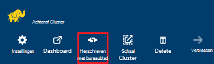

<properties
 pageTitle="Gebruik JDBC op query component op Azure HDInsight"
 description="Informatie over het gebruik van JDBC verbinding maken met de component op Azure HDInsight en query's op afstand uitvoeren op gegevens die zijn opgeslagen in de cloud."
 services="hdinsight"
 documentationCenter=""
 authors="Blackmist"
 manager="jhubbard"
 editor="cgronlun"
    tags="azure-portal"/>

<tags
 ms.service="hdinsight"
 ms.devlang="java"
 ms.topic="article"
 ms.tgt_pltfrm="na"
 ms.workload="big-data"
 ms.date="08/23/2016"
 ms.author="larryfr"/>

#Verbinding maken met de component op Azure HDInsight met het stuurprogramma JDBC component

[AZURE.INCLUDE [ODBC-JDBC-selector](../../includes/hdinsight-selector-odbc-jdbc.md)]

In dit document leert u hoe u JDBC uit een Java-toepassing gebruiken om in te dienen extern component query's aan een cluster HDInsight. U leert hoe u verbinding maakt vanuit de eekhoorn SQL-client en hoe u verbinding maakt via een programma uit Java.

Zie voor meer informatie over de component JDBC-Interface, [HiveJDBCInterface](https://cwiki.apache.org/confluence/display/Hive/HiveJDBCInterface).

##Vereisten voor

U voltooit de stappen in dit artikel, moet u het volgende:

* Een Hadoop op HDInsight cluster. Linux- of Windows clusters werkt.

* [Eekhoorn SQL](http://squirrel-sql.sourceforge.net/). Eekhoorn is een clienttoepassing JDBC.

Als u wilt maken en uitvoeren van de koppelingen in dit artikel voorbeeld Java-toepassing, moet u het volgende.

* De [Java ontwikkelaars Kit (JDK) versie 7](https://www.oracle.com/technetwork/java/javase/downloads/jdk7-downloads-1880260.html) of hoger.

* [Apache Maven](https://maven.apache.org). Maven is een project maken systeem voor Java projecten die wordt gebruikt door het project dat is gekoppeld aan dit artikel.

##Verbindingsreeks

JDBC verbindingen met een cluster HDInsight op Azure meer dan 443 zijn doorgevoerd en het verkeer wordt beveiligd via SSL. De openbare gateway die de clusters bevinden zich achter wordt het verkeer omgeleid naar de poort die HiveServer2 daadwerkelijk luistert op. Dus een typische verbindingsreeks zou als volgt te werk:

    jdbc:hive2://CLUSTERNAME.azurehdinsight.net:443/default;ssl=true?hive.server2.transport.mode=http;hive.server2.thrift.http.path=/hive2

__CLUSTERNAAM__ vervangen door de naam van uw cluster HDInsight.

##Verificatie

Wanneer de verbinding tot stand brengt, moet u de naam van de beheerder cluster HDInsight en het wachtwoord om te verifiëren met de gateway cluster. Wanneer u verbinding maakt van JDBC clients zoals eekhoorn SQL, moet u de beheerdersnaam en het wachtwoord in clientinstellingen.

Vanuit een Java-toepassing, moet u de naam en het wachtwoord gebruiken bij het maken van een verbinding. De volgende Java-code wordt bijvoorbeeld geopend voor een nieuwe verbinding met de verbindingsreeks, beheerdersnaam en wachtwoord:

    DriverManager.getConnection(connectionString,clusterAdmin,clusterPassword);

##Verbinding maken met eekhoorn SQL-client

Eekhoorn SQL is een JDBC-client die kan worden gebruikt op afstand component query's uitvoeren met uw cluster HDInsight. De volgende stappen wordt ervan uitgegaan dat u eekhoorn SQL al hebt geïnstalleerd en leest u downloaden en de stuurprogramma's configureren voor component.

1. Kopieer de component JDBC-stuurprogramma's van uw cluster HDInsight.

    * Voor __Linux gebaseerde HDInsight__, gebruikt u de volgende stappen uit om te downloaden van de vereiste oppervlak-bestanden.

        1. Maak een nieuwe map waarin u de bestanden. Bijvoorbeeld `mkdir hivedriver`.

        2. Vanuit een opdrachtprompt, we vaker doen, PowerShell of andere opdrachtprompt, mappen wijzigen in de nieuwe map en de volgende opdrachten gebruiken om te kopiëren van de bestanden uit het cluster HDInsight.

                scp USERNAME@CLUSTERNAME:/usr/hdp/current/hive-client/lib/hive-jdbc*standalone.jar .
                scp USERNAME@CLUSTERNAME:/usr/hdp/current/hadoop-client/hadoop-common.jar .
                scp USERNAME@CLUSTERNAME:/usr/hdp/current/hadoop-client/hadoop-auth.jar .

            __Gebruikersnaam__ vervangen door de SSH account gebruikersnaam voor de cluster. __CLUSTERNAAM__ vervangen door de naam van het cluster HDInsight.

            > [AZURE.NOTE] Klik op Windows-omgevingen moet u het hulpprogramma PSCP gebruiken in plaats van scp. U kunt het downloaden van [http://www.chiark.greenend.org.uk/~sgtatham/putty/download.html](http://www.chiark.greenend.org.uk/~sgtatham/putty/download.html).

    * Voor __HDInsight op basis van Windows__, gebruikt u de volgende stappen uit om te downloaden van de oppervlak-bestanden.

        1. Selecteer uw cluster HDInsight in de Azure-portal en selecteer het pictogram __Extern bureaublad__ .

            

        2. Gebruik de knop __verbinding maken met__ verbinding maken met de cluster op het blad extern bureaublad. Als het externe bureaublad niet is ingeschakeld, gebruikt u het formulier op te geven een gebruikersnaam en wachtwoord, selecteer __inschakelen__ om extern bureaublad voor het cluster.

            

            Nadat u __verbinding maken met__selecteert, wordt een RDP-bestand worden gedownload. Gebruik dit bestand aan de client extern bureaublad starten. Wanneer u wordt gevraagd, gebruikt u de gebruikersnaam en wachtwoord die u hebt opgegeven voor extern bureaublad access.

        3. Zodra u verbinding hebt, kopieert u de volgende bestanden uit de externe bureaubladsessie naar uw lokale computer. Overbrengen in een lokale map met de naam `hivedriver`.

            * C:\apps\dist\hive-0.14.0.2.2.9.1-7\lib\hive-JDBC-0.14.0.2.2.9.1-7-standalone.jar
            * C:\apps\dist\hadoop-2.6.0.2.2.9.1-7\share\hadoop\common\hadoop-Common-2.6.0.2.2.9.1-7.jar
            * C:\apps\dist\hadoop-2.6.0.2.2.9.1-7\share\hadoop\common\lib\hadoop-auth-2.6.0.2.2.9.1-7.jar

            > [AZURE.NOTE] De versienummers opgenomen in de paden en bestandsnamen afwijken voor uw cluster.

        4. De externe bureaubladsessie zodra u klaar bent met het kopiëren van de bestanden die de verbinding verbreken.

3. Start de toepassing eekhoorn SQL. Tik aan de linkerkant van het venster __stuurprogramma's__te selecteren.

    

4. Selecteer in de pictogrammen boven aan het dialoogvenster __stuurprogramma's__ , de __+__ pictogram voor het maken van een nieuw stuurprogramma.

    

5. Voeg de volgende informatie in het dialoogvenster stuurprogramma toevoegen.

    * __Naam__: component
    * __Voorbeeld-URL__: jdbc:hive2://localhost:443/default;ssl=true?hive.server2.transport.mode=http;hive.server2.thrift.http.path=/hive2
    * __Extra Class pad__: Gebruik de knop toevoegen om toe te voegen van de bestanden oppervlak eerder hebt gedownload
    * __Klassenaam__: org.apache.hive.jdbc.HiveDriver

    

    Klik op __OK__ als deze instellingen wilt opslaan.

6. Selecteer __aliassen__aan de linkerkant van het eekhoorn SQL-venster. Klik vervolgens op de __+__ pictogram voor het maken van een nieuwe verbinding alias.

    

7. Gebruik de volgende waarden voor het dialoogvenster __Alias toevoegen__ .

    * __Naam__: component op HDInsight
    * __Stuurprogramma__: Gebruik de vervolgkeuzelijst het stuurprogramma __component__ selecteren
    * __URL__: jdbc:hive2://CLUSTERNAME.azurehdinsight.net:443/default;ssl=true?hive.server2.transport.mode=http;hive.server2.thrift.http.path=/hive2

        __CLUSTERNAAM__ vervangen door de naam van uw cluster HDInsight.

    * __Gebruikersnaam in te voeren__: de cluster login accountnaam voor uw cluster HDInsight. De standaardinstelling is `admin`.
    * __Wachtwoord__: het wachtwoord voor de aanmeldingsaccount cluster. Dit is een wachtwoord dat u hebt opgegeven toen u het cluster HDInsight maakt.

    

    Gebruik de knop __testen__ om te controleren of de verbinding werkt. Wanneer __verbinding maken met: component op HDInsight__ dialoogvenster wordt weergegeven, selecteert u __verbinding maken__ met de test uitvoeren. Als de test is geslaagd, ziet u het dialoogvenster van een __verbinding tot stand gebracht__ .

    Gebruik de knop __Ok__ onderaan in het dialoogvenster __Alias toevoegen__ om op te slaan de alias verbinding.

8. Selecteer de __component op HDInsight__in de vervolgkeuzelijst __verbinding maken met__ aan de bovenkant van eekhoorn SQL. Wanneer u wordt gevraagd, selecteert u __verbinding maken__.

    

9. Zodra u verbinding hebt, voert u de volgende query in het dialoogvenster SQL-query en selecteer het pictogram __uitvoeren__ . De resultaten van de query moet worden weergegeven in het resultatengebied.

        select * from hivesampletable limit 10;

    

##Verbinding maken vanuit een voorbeeld Java-toepassing

Een voorbeeld van het gebruik van een query component Java-client op HDInsight is beschikbaar op [https://github.com/Azure-Samples/hdinsight-java-hive-jdbc](https://github.com/Azure-Samples/hdinsight-java-hive-jdbc). Volg de instructies in de bibliotheek maken en uitvoeren van de steekproef.

##Problemen oplossen

### Onverwachte fout opgetreden bij het openen van een SQL-verbinding.

__Symptomen__: wanneer u verbinding maakt met een HDInsight cluster die versie 3.3 of 3.4 is, wordt een fout die een onverwachte fout opgetreden. De tracering stapel voor deze fout wordt gestart met de volgende regels:

    java.util.concurrent.ExecutionException: java.lang.RuntimeException: java.lang.NoSuchMethodError: org.apache.commons.codec.binary.Base64.<init>(I)V
    at java.util.concurrent.FutureTas...(FutureTask.java:122)
    at java.util.concurrent.FutureTask.get(FutureTask.java:206)

__Oorzaak__: deze fout wordt veroorzaakt door een probleem in de versie van het commons-codec.jar-bestand dat is gebruikt door eekhoorn en de presentatie die is vereist voor de component JDBC onderdelen gedownload van het cluster HDInsight.

__Oplossing__: gebruik u lost deze fout door de volgende stappen.

1. Download het commons-codec oppervlak-bestand uit uw cluster HDInsight.

        scp USERNAME@CLUSTERNAME:/usr/hdp/current/hive-client/lib/commons-codec*.jar ./commons-codec.jar

2. Sluit eekhoorn en ga vervolgens naar de map waar eekhoorn op uw computer is geïnstalleerd. In de map eekhoorn, onder de `lib` directory, vervangen de bestaande commons-codec.jar met de een gedownload van het cluster HDInsight.

3. Start opnieuw eekhoorn. De fout kan niet meer optreden wanneer u verbinding maakt met de component op HDInsight.

##Volgende stappen

U hebt geleerd hoe JDBC gebruiken om te werken met onderdeel, gebruikt u de volgende koppelingen naar andere manieren om te werken met Azure HDInsight verkennen.

* [Gegevens uploaden naar HDInsight](hdinsight-upload-data.md)
* [Component gebruiken met HDInsight](hdinsight-use-hive.md)
* [Varken met HDInsight gebruiken](hdinsight-use-pig.md)
* [Gebruik MapReduce taken met HDInsight](hdinsight-use-mapreduce.md)
